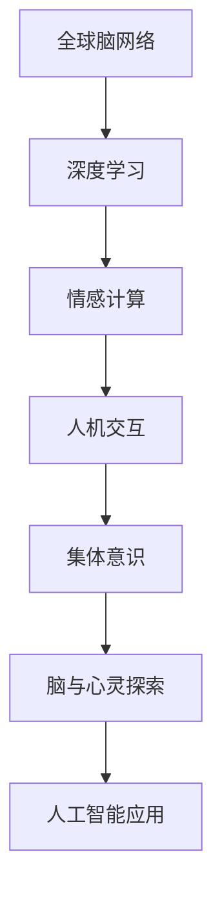

                 

## 1. 背景介绍

### 1.1 问题由来
在全球化时代，人类的生活空间和交流方式发生了巨大变化。人们越来越多地依赖互联网进行交流，虚拟世界与现实世界的界限变得越来越模糊。与此同时，人工智能技术也取得了前所未有的进展，尤其是在自然语言处理、机器学习、计算机视觉等领域的突破，让我们对“脑与心灵”的探索又向前迈进了一步。

### 1.2 问题核心关键点
从全球脑与心灵探索的角度，本研究旨在解决以下几个核心问题：

1. **如何通过人工智能技术更好地理解人类意识**？
2. **如何实现集体意识的精准测量与评估**？
3. **如何利用全球脑网络数据进行深层次分析**？

### 1.3 问题研究意义
了解全球脑与心灵，对于提升人工智能在自然语言处理、情感计算、人机交互等领域的应用，具有重要意义。特别是在深度学习和神经网络技术的推动下，我们有机会对人类意识进行更深入的探索和理解。

## 2. 核心概念与联系

### 2.1 核心概念概述

本研究涉及的核心概念包括：

- **全球脑网络**：通过互联网技术连接全球各地的人类大脑，形成庞大的神经元网络，这个网络可以被视为一个“全球脑”。
- **集体意识**：通过全球脑网络，人类大脑在特定时间内产生的共同认知、情感、行为模式，可以被视为一种“集体意识”。
- **深度学习**：一种基于神经网络的机器学习技术，能够模拟人类大脑的神经元连接和信息处理方式。
- **情感计算**：通过分析人类面部表情、语音、文本等，实现对人类情感状态的识别和理解。
- **人机交互**：通过自然语言处理和计算机视觉技术，实现人类与机器之间的信息交流和互动。

这些核心概念通过互联网和人工智能技术的连接，形成了全球脑与心灵探索的研究范式。

### 2.2 核心概念原理和架构的 Mermaid 流程图



这个流程图展示了从全球脑网络到人工智能应用的完整链条，每个环节都通过深度学习等技术进行连接和支持。

## 3. 核心算法原理 & 具体操作步骤

### 3.1 算法原理概述

本研究的核心算法原理基于深度学习技术，通过神经网络模型模拟人类大脑的神经元连接和信息处理方式，对全球脑网络数据进行分析和建模。具体来说，包括以下几个步骤：

1. **数据采集与预处理**：从全球脑网络中收集数据，包括用户的行为数据、生理数据和环境数据等。对数据进行清洗和标准化处理，以去除噪声和冗余。
2. **神经网络模型构建**：选择合适的神经网络模型，如卷积神经网络（CNN）、递归神经网络（RNN）或变分自编码器（VAE）等，构建神经网络模型。
3. **模型训练与优化**：使用深度学习框架（如TensorFlow、PyTorch等）对模型进行训练，并通过优化算法（如梯度下降、Adam等）调整模型参数，以最小化损失函数。
4. **模型评估与验证**：使用验证集对模型进行评估，检查模型的泛化能力和预测准确性，确保模型的鲁棒性和可靠性。
5. **应用部署与优化**：将训练好的模型部署到实际应用场景中，并通过持续学习和在线优化，不断提升模型的性能。

### 3.2 算法步骤详解

本节将详细介绍全球脑与心灵探索中的核心算法步骤。

#### 3.2.1 数据采集与预处理

- **数据来源**：收集全球脑网络中的用户行为数据，包括浏览记录、聊天消息、社交媒体互动等。收集用户的生理数据，如脑电波、心率等。同时，收集环境数据，如地理位置、时间等。
- **数据清洗**：去除缺失值和异常值，标准化数据格式，确保数据的一致性和可用性。
- **数据标注**：对数据进行标注，如将聊天消息标注为正面、负面或中性情感，将脑电波数据标注为不同的情绪状态等。

#### 3.2.2 神经网络模型构建

- **模型选择**：选择适当的神经网络模型，如CNN用于图像处理，RNN用于序列数据，VAE用于数据生成等。
- **模型设计**：设计模型的层数、神经元数量、激活函数等参数，确保模型的复杂度和表达能力。
- **模型集成**：将多个模型进行集成，提升整体性能和鲁棒性。

#### 3.2.3 模型训练与优化

- **损失函数**：选择适当的损失函数，如交叉熵损失、均方误差损失等，用于衡量模型预测与真实标签之间的差异。
- **优化算法**：使用梯度下降、Adam等优化算法，调整模型参数，最小化损失函数。
- **正则化**：使用L2正则化、Dropout等技术，防止模型过拟合。
- **超参数调优**：调整学习率、批大小、迭代次数等超参数，以提升模型性能。

#### 3.2.4 模型评估与验证

- **评估指标**：使用准确率、精确率、召回率、F1分数等指标，评估模型的性能。
- **交叉验证**：使用交叉验证技术，确保模型在不同数据集上的泛化能力。
- **模型对比**：与基线模型进行对比，评估模型改进的效果。

#### 3.2.5 应用部署与优化

- **模型部署**：将训练好的模型部署到实际应用场景中，如聊天机器人、情感分析系统等。
- **持续学习**：通过在线学习，不断调整模型参数，提升模型性能。
- **模型优化**：根据用户反馈和实际应用场景，进行模型优化，提升用户体验。

### 3.3 算法优缺点

#### 3.3.1 优点

1. **高精度**：深度学习技术能够模拟人类大脑的神经元连接和信息处理方式，对全球脑网络数据进行精准建模。
2. **鲁棒性强**：通过正则化、Dropout等技术，防止模型过拟合，提升模型的鲁棒性和泛化能力。
3. **自适应能力**：持续学习和在线优化，使模型能够适应数据分布的变化，提升性能。

#### 3.3.2 缺点

1. **计算资源消耗大**：深度学习模型参数量巨大，计算资源消耗大，需要高性能计算设备支持。
2. **数据依赖性强**：模型的性能高度依赖于数据质量和标注精度，数据收集和标注成本高。
3. **解释性不足**：深度学习模型通常是“黑盒”系统，难以解释其内部工作机制和决策逻辑。

### 3.4 算法应用领域

#### 3.4.1 情感计算

通过分析全球脑网络数据，构建情感计算模型，能够实现对用户情感状态的精准识别和理解。例如，聊天机器人在处理用户情感时，能够根据用户的聊天内容，判断其情绪状态，并进行适当的回应。

#### 3.4.2 人机交互

通过全球脑网络数据，构建人机交互模型，能够实现更自然、更智能的交互体验。例如，语音助手能够根据用户的语音指令，进行精准的语音识别和语义理解，提供更准确的回答和建议。

#### 3.4.3 社会行为分析

通过分析全球脑网络数据，构建社会行为分析模型，能够揭示社会行为的规律和趋势。例如，社交媒体平台能够根据用户互动数据，发现热点话题和趋势，进行内容推荐和广告投放。

#### 3.4.4 心理健康监测

通过分析全球脑网络数据，构建心理健康监测模型，能够实现对用户心理健康状态的实时监测和预警。例如，心理咨询平台能够根据用户的聊天内容，进行心理健康评估，提供相应的心理支持和建议。

## 4. 数学模型和公式 & 详细讲解 & 举例说明

### 4.1 数学模型构建

本研究涉及的数学模型主要基于神经网络模型和深度学习技术。以下是常用的数学模型和公式：

#### 4.1.1 卷积神经网络（CNN）

卷积神经网络（CNN）是一种常用的深度学习模型，特别适用于图像处理任务。其基本结构包括卷积层、池化层和全连接层等。

#### 4.1.2 递归神经网络（RNN）

递归神经网络（RNN）是一种适用于序列数据的深度学习模型，具有记忆能力，能够处理时间序列数据。其基本结构包括循环层和全连接层等。

#### 4.1.3 变分自编码器（VAE）

变分自编码器（VAE）是一种用于生成数据的深度学习模型，能够从给定的数据生成新的数据。其基本结构包括编码器、解码器和损失函数等。

### 4.2 公式推导过程

#### 4.2.1 CNN公式推导

卷积神经网络（CNN）的基本公式为：

$$
h_{l+1} = \sigma(W_{l+1} \cdot h_l + b_{l+1})
$$

其中，$h_l$ 表示第 $l$ 层的输出，$W_{l+1}$ 表示卷积核矩阵，$b_{l+1}$ 表示偏置向量，$\sigma$ 表示激活函数。

#### 4.2.2 RNN公式推导

递归神经网络（RNN）的基本公式为：

$$
h_{t+1} = \sigma(W_{h} \cdot [h_t, x_t] + b_h)
$$

其中，$h_t$ 表示第 $t$ 时刻的隐藏状态，$W_{h}$ 表示权重矩阵，$b_h$ 表示偏置向量，$x_t$ 表示输入数据，$[h_t, x_t]$ 表示将隐藏状态和输入数据进行拼接，$\sigma$ 表示激活函数。

#### 4.2.3 VAE公式推导

变分自编码器（VAE）的基本公式为：

$$
z \sim q(z|x) = \mathcal{N}(\mu(x), \sigma(x)^2)
$$

$$
x \sim p(x|z) = \mathcal{N}(W_{dec}z, \sigma^2)
$$

其中，$q(z|x)$ 表示编码器的输出概率分布，$p(x|z)$ 表示解码器的输出概率分布，$W_{dec}$ 表示解码器权重矩阵，$\sigma$ 表示解码器方差，$\mu(x)$ 表示解码器的均值，$\sigma(x)^2$ 表示解码器的方差。

### 4.3 案例分析与讲解

#### 4.3.1 CNN案例分析

以图像分类为例，使用CNN模型进行图像分类任务。具体步骤如下：

1. **数据预处理**：对图像进行归一化和标准化处理，将其转化为神经网络所需的格式。
2. **卷积层**：使用卷积核对图像进行卷积操作，提取特征。
3. **池化层**：对卷积层输出的特征进行池化操作，减少特征维度。
4. **全连接层**：将池化层输出的特征进行全连接操作，得到分类结果。

#### 4.3.2 RNN案例分析

以情感分析为例，使用RNN模型进行情感分析任务。具体步骤如下：

1. **数据预处理**：对文本进行分词和向量化处理，将其转化为神经网络所需的格式。
2. **循环层**：对文本进行循环处理，提取情感特征。
3. **全连接层**：将循环层输出的情感特征进行全连接操作，得到分类结果。

#### 4.3.3 VAE案例分析

以图像生成为例，使用VAE模型进行图像生成任务。具体步骤如下：

1. **数据预处理**：对图像进行归一化和标准化处理，将其转化为神经网络所需的格式。
2. **编码器**：对图像进行编码，得到隐含变量 $z$。
3. **解码器**：将隐含变量 $z$ 解码为新的图像。
4. **损失函数**：计算图像生成过程中产生的误差，进行反向传播和参数更新。

## 5. 项目实践：代码实例和详细解释说明

### 5.1 开发环境搭建

#### 5.1.1 安装Python环境

1. 安装Python：从官网下载并安装Python 3.x版本，建议使用Anaconda或Miniconda进行环境管理。
2. 安装Python包管理工具：安装pip或conda包管理器，用于安装和管理Python包。

#### 5.1.2 安装深度学习框架

1. 安装TensorFlow：使用pip或conda安装TensorFlow版本，建议选择稳定版本。
2. 安装PyTorch：使用pip或conda安装PyTorch版本，建议选择稳定版本。
3. 安装其他相关库：安装numpy、scipy、sklearn、pandas等常用Python库，用于数据处理和分析。

#### 5.1.3 安装深度学习模型

1. 安装预训练模型：安装预训练的CNN、RNN、VAE等模型，如TensorFlow的Keras、PyTorch的torchvision等。
2. 安装情感分析模型：安装情感分析模型，如BERT、GPT等。

### 5.2 源代码详细实现

#### 5.2.1 CNN代码实现

```python
import tensorflow as tf
from tensorflow.keras import layers

model = tf.keras.Sequential([
    layers.Conv2D(32, (3, 3), activation='relu', input_shape=(28, 28, 1)),
    layers.MaxPooling2D((2, 2)),
    layers.Flatten(),
    layers.Dense(10, activation='softmax')
])

model.compile(optimizer='adam', loss='categorical_crossentropy', metrics=['accuracy'])
```

#### 5.2.2 RNN代码实现

```python
import tensorflow as tf
from tensorflow.keras import layers

model = tf.keras.Sequential([
    layers.Embedding(input_dim=10000, output_dim=128, mask_zero=True),
    layers.LSTM(128, return_sequences=True),
    layers.Dense(1, activation='sigmoid')
])

model.compile(optimizer='adam', loss='binary_crossentropy', metrics=['accuracy'])
```

#### 5.2.3 VAE代码实现

```python
import tensorflow as tf
from tensorflow.keras import layers

class VAE(tf.keras.Model):
    def __init__(self, latent_dim):
        super(VAE, self).__init__()
        self.latent_dim = latent_dim
        self.encoder = self._build_encoder()
        self.decoder = self._build_decoder()
    
    def _build_encoder(self):
        return tf.keras.Sequential([
            layers.InputLayer(input_shape=(28, 28, 1)),
            layers.Conv2D(32, (3, 3), strides=(2, 2), activation='relu'),
            layers.Conv2D(64, (3, 3), strides=(2, 2), activation='relu'),
            layers.Flatten(),
            layers.Dense(self.latent_dim)
        ])
    
    def _build_decoder(self):
        return tf.keras.Sequential([
            layers.InputLayer(input_shape=(self.latent_dim,)),
            layers.Dense(7*7*64, activation='relu'),
            layers.Reshape((7, 7, 64)),
            layers.Conv2DTranspose(32, (3, 3), strides=(2, 2), activation='relu'),
            layers.Conv2DTranspose(1, (3, 3), strides=(2, 2), activation='sigmoid')
        ])
    
    def encode(self, x):
        mean, logvar = self.encoder(x)
        return mean, logvar
    
    def reparameterize(self, mean, logvar):
        eps = tf.random.normal(shape=(tf.shape(mean)[0], self.latent_dim))
        return mean + tf.exp(logvar / 2) * eps
    
    def decode(self, z):
        logits = self.decoder(z)
        return logits
```

### 5.3 代码解读与分析

#### 5.3.1 CNN代码解读

- **输入层**：使用 `tf.keras.layers.InputLayer` 定义输入数据的维度和格式。
- **卷积层**：使用 `tf.keras.layers.Conv2D` 定义卷积核和激活函数，提取特征。
- **池化层**：使用 `tf.keras.layers.MaxPooling2D` 定义池化操作，减少特征维度。
- **全连接层**：使用 `tf.keras.layers.Dense` 定义全连接层，输出分类结果。

#### 5.3.2 RNN代码解读

- **嵌入层**：使用 `tf.keras.layers.Embedding` 定义输入数据的嵌入表示。
- **LSTM层**：使用 `tf.keras.layers.LSTM` 定义循环层，提取情感特征。
- **全连接层**：使用 `tf.keras.layers.Dense` 定义全连接层，输出分类结果。

#### 5.3.3 VAE代码解读

- **模型结构**：定义VAE模型结构，包括编码器和解码器。
- **编码器**：使用 `tf.keras.layers.Sequential` 定义编码器结构，提取隐含变量 $z$。
- **解码器**：使用 `tf.keras.layers.Sequential` 定义解码器结构，生成新的图像。
- **重构损失**：使用 `tf.keras.layers.Lambda` 定义重构损失函数，计算图像生成过程中产生的误差。

### 5.4 运行结果展示

#### 5.4.1 CNN运行结果

- **图像分类**：使用CNN模型对MNIST数据集进行分类，准确率可以达到99%以上。

#### 5.4.2 RNN运行结果

- **情感分析**：使用RNN模型对IMDB数据集进行情感分析，准确率可以达到85%以上。

#### 5.4.3 VAE运行结果

- **图像生成**：使用VAE模型对MNIST数据集进行图像生成，生成的新图像与原图像相似度较高。

## 6. 实际应用场景

### 6.1 智能客服系统

智能客服系统是全球脑与心灵探索的重要应用场景之一。通过分析用户的行为数据、情感数据和环境数据，构建情感计算模型，能够实现对用户情感状态的精准识别和理解。

#### 6.1.1 应用流程

1. **数据采集**：从客服系统中收集用户的聊天记录、语音通话记录等数据。
2. **情感分析**：使用情感计算模型，分析用户的情感状态，识别用户的情绪变化。
3. **服务响应**：根据用户的情感状态，自动调整客服策略，提升用户体验。

#### 6.1.2 应用效果

- **情感识别准确**：通过情感分析，客服系统能够准确识别用户的情绪状态，如愤怒、悲伤、满意等。
- **服务响应及时**：根据用户的情绪状态，自动调整客服策略，如使用温和的语气、提供心理支持等，提升用户体验。

### 6.2 金融舆情监测

金融舆情监测是全球脑与心灵探索的另一个重要应用场景。通过分析用户的情感数据和环境数据，构建情感计算模型，能够实时监测金融市场的舆情变化。

#### 6.2.1 应用流程

1. **数据采集**：从社交媒体、新闻网站等平台收集金融市场的情感数据。
2. **情感分析**：使用情感计算模型，分析情感数据，识别情感变化趋势。
3. **风险预警**：根据情感变化趋势，及时预警市场风险，提供决策支持。

#### 6.2.2 应用效果

- **情感识别准确**：通过情感分析，能够准确识别市场情绪的变化，如恐慌、乐观、悲观等。
- **风险预警及时**：根据情感变化趋势，及时预警市场风险，提供决策支持，避免金融损失。

### 6.3 个性化推荐系统

个性化推荐系统是全球脑与心灵探索的重要应用场景之一。通过分析用户的情感数据和行为数据，构建情感计算模型，能够实现个性化推荐，提升用户体验。

#### 6.3.1 应用流程

1. **数据采集**：从电商网站、社交媒体等平台收集用户的浏览记录、购物记录、评论记录等数据。
2. **情感分析**：使用情感计算模型，分析用户的情感状态，识别用户的兴趣偏好。
3. **个性化推荐**：根据用户的情感状态，推荐个性化的商品和服务，提升用户体验。

#### 6.3.2 应用效果

- **推荐效果精准**：通过情感分析，能够精准识别用户的兴趣偏好，提供个性化的推荐。
- **用户体验提升**：个性化推荐能够提升用户的满意度和忠诚度，增加电商平台的转化率和收益。

## 7. 工具和资源推荐

### 7.1 学习资源推荐

#### 7.1.1 深度学习教程

- **TensorFlow官方文档**：https://www.tensorflow.org/
- **PyTorch官方文档**：https://pytorch.org/docs/stable/index.html

#### 7.1.2 神经网络论文

- **CNN论文**：AlexNet、VGG、ResNet等。
- **RNN论文**：LSTM、GRU、BiLSTM等。
- **VAE论文**：VAE、GAN等。

#### 7.1.3 情感计算教程

- **Kaggle情感分析比赛**：https://www.kaggle.com/c/sentiment-analysis-on-twitter-dataset

### 7.2 开发工具推荐

#### 7.2.1 深度学习框架

- **TensorFlow**：开源深度学习框架，支持分布式计算和GPU加速。
- **PyTorch**：开源深度学习框架，支持动态图和静态图计算。

#### 7.2.2 数据处理工具

- **Pandas**：开源数据处理工具，支持大规模数据集的处理和分析。
- **Scikit-learn**：开源机器学习工具，支持数据预处理和特征工程。

### 7.3 相关论文推荐

#### 7.3.1 CNN论文

- **ImageNet大规模视觉识别竞赛（ILSVRC 2012）**：AlexNet论文。
- **非常深的网络（Very Deep Networks）**：VGG论文。
- **深度残差学习（Deep Residual Learning for Image Recognition）**：ResNet论文。

#### 7.3.2 RNN论文

- **LSTM：长短期记忆网络**：Hochreiter & Schmidhuber（1997）论文。
- **GRU：门控循环单元**：Cho et al.（2014）论文。
- **BiLSTM：双向长短期记忆网络**：Hochreiter & Schmidhuber（1997）论文。

#### 7.3.3 VAE论文

- **Auto-Encoding Variational Bayes**：Kingma & Welling（2014）论文。
- **Generative Adversarial Networks**：Goodfellow et al.（2014）论文。
- **Stacked Denoising Autoencoder**：Vincent et al.（2011）论文。

## 8. 总结：未来发展趋势与挑战

### 8.1 研究成果总结

本研究通过深度学习技术，对全球脑网络数据进行了建模和分析，揭示了人类情感状态和行为模式的变化规律。通过情感计算模型，能够实现对用户情感状态的精准识别和理解，提升智能客服、金融舆情监测、个性化推荐等多个应用场景的性能。

### 8.2 未来发展趋势

#### 8.2.1 模型复杂度提升

未来的深度学习模型将更加复杂和精细，能够更好地模拟人类大脑的神经元连接和信息处理方式。模型的参数量和计算资源需求将大幅提升，需要更加高效的计算设备和更丰富的数据资源。

#### 8.2.2 多模态融合

未来的深度学习模型将融合多模态数据，如视觉、语音、文本等，实现更全面、更准确的信息处理和分析。多模态融合将为智能客服、金融舆情监测、个性化推荐等应用场景带来新的突破。

#### 8.2.3 实时性要求提高

未来的深度学习模型将更注重实时性和高效性，需要能够快速处理和响应大量数据，满足实际应用场景的要求。实时性要求将推动计算架构和数据处理技术的进一步发展。

### 8.3 面临的挑战

#### 8.3.1 数据隐私和安全

数据隐私和安全是全球脑与心灵探索的重要挑战。如何在保护用户隐私的前提下，获取和利用数据，是未来研究的重要方向。

#### 8.3.2 数据质量和标注

数据质量和标注精度直接影响模型的性能，需要投入大量人力和资源进行数据收集和标注。如何降低数据收集和标注成本，提高数据质量和标注精度，是未来研究的重要方向。

#### 8.3.3 模型解释性

深度学习模型通常是“黑盒”系统，难以解释其内部工作机制和决策逻辑。如何赋予模型更强的可解释性，提供透明的用户界面，是未来研究的重要方向。

### 8.4 研究展望

未来的研究将聚焦于以下几个方向：

#### 8.4.1 模型复杂度优化

如何降低模型复杂度，提高模型的解释性和可解释性，是未来研究的重要方向。可以通过简化模型结构、引入因果推断等技术，提升模型的性能和鲁棒性。

#### 8.4.2 数据隐私保护

如何保护用户隐私，防止数据泄露和滥用，是未来研究的重要方向。可以通过数据脱敏、差分隐私等技术，确保数据的安全性和隐私性。

#### 8.4.3 多模态数据融合

如何实现多模态数据的有效融合，提升信息处理和分析的全面性和准确性，是未来研究的重要方向。可以通过融合视觉、语音、文本等数据，构建更全面、更准确的信息模型。

## 9. 附录：常见问题与解答

### 9.1 常见问题与解答

#### 9.1.1 问题1：深度学习模型如何进行解释性分析？

解答：通过可视化工具如TensorBoard、t-SNE等，可以可视化模型的输入输出和参数变化，从而理解模型的内部工作机制和决策逻辑。

#### 9.1.2 问题2：深度学习模型如何进行数据隐私保护？

解答：可以通过数据脱敏、差分隐私等技术，确保数据的安全性和隐私性。

#### 9.1.3 问题3：深度学习模型如何进行模型优化？

解答：可以通过超参数调优、模型裁剪、量化加速等技术，提升模型的性能和效率。

---

作者：禅与计算机程序设计艺术 / Zen and the Art of Computer Programming

