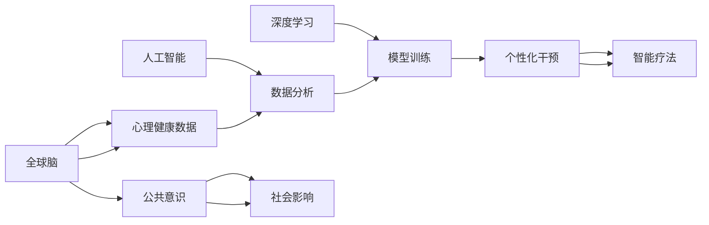

                 

# 全球脑与心理健康:集体意识的治愈力

在探索人工智能的广阔领域时，我们时常关注其技术层面的突破与创新，但也不应忽视其在人类生活质量提升上的潜在价值。本文将从全球脑与心理健康的角度出发，深入探讨集体意识的治愈力，揭示人工智能在这一领域内如何发挥其独特优势，助力心理健康与福祉。

## 1. 背景介绍

### 1.1 问题由来

近年来，随着人工智能技术的飞速发展，其应用领域不断拓展，从医疗诊断到自动驾驶，从智能客服到个性化推荐，人工智能正以全新的方式改变着我们的世界。然而，在众多应用中，心理健康领域的探索仍相对较少，这是一个充满挑战但也极具潜力的研究领域。

### 1.2 问题核心关键点

心理健康问题的普遍性和复杂性，使其成为全球关注的热点。人工智能在这一领域的应用，旨在通过数据分析、模式识别和智能推理，为心理健康评估、干预和治疗提供新的方法。本文将重点探讨人工智能在心理健康领域的潜力，特别是集体意识在治愈力上的应用。

### 1.3 问题研究意义

深入研究人工智能在心理健康领域的集体意识治愈力，不仅有助于提升全球心理健康水平，还能促进技术伦理与社会责任的思考，为人工智能的应用提供更广阔的视角。

## 2. 核心概念与联系

### 2.1 核心概念概述

- **全球脑**：指的是在全球范围内，人们共享的、动态变化的大脑信息网络。这一概念强调了人类意识的互联性和共生性。
- **心理健康**：指个人在精神、情感、行为等方面的良好状态。
- **集体意识**：指通过集体互动、信息共享所形成的共同认知和情感体验。
- **治愈力**：指通过技术和干预，帮助个体或集体恢复心理健康的力量。

这些概念通过人工智能技术，特别是大数据分析和深度学习模型的应用，可以共同作用于心理健康领域的治愈力提升。

### 2.2 核心概念原理和架构的 Mermaid 流程图



这个流程图展示了全球脑数据如何通过人工智能技术，经过数据分析和模型训练，最终应用于心理健康评估、个性化干预和社会影响等环节，从而实现集体意识的治愈力。

## 3. 核心算法原理 & 具体操作步骤

### 3.1 算法原理概述

人工智能在心理健康领域的集体意识治愈力，主要通过以下几种算法原理实现：

- **数据挖掘与分析**：从全球脑数据中挖掘出心理健康相关的模式和趋势，为心理健康评估提供数据支持。
- **机器学习与深度学习**：构建能够自动学习和适应的模型，用于个性化的心理健康干预和治疗。
- **自然语言处理(NLP)**：通过分析用户的文字表达和情感，提供心理支持和干预建议。
- **社会网络分析**：分析个体之间的互动和信息流动，为心理健康干预提供社交支持策略。

### 3.2 算法步骤详解

1. **数据收集与预处理**：
   - 收集全球范围内的心理健康数据，包括个体心理健康状况、行为数据、社交互动信息等。
   - 进行数据清洗和预处理，去除噪声和异常值，确保数据质量和一致性。

2. **特征提取与建模**：
   - 使用机器学习算法从数据中提取特征，如情感分析、行为模式识别等。
   - 使用深度学习模型构建预测和分类模型，如循环神经网络(RNN)、卷积神经网络(CNN)、变换器(Transformer)等。

3. **模型训练与验证**：
   - 使用标记数据对模型进行训练，调整模型参数以提高准确性和泛化能力。
   - 在验证集上评估模型性能，通过交叉验证等技术确保模型稳定性和鲁棒性。

4. **干预与治疗**：
   - 根据模型预测结果，为个体提供个性化的心理健康干预和治疗建议。
   - 集成智能疗法的应用，如聊天机器人、虚拟助手等，提供持续的心理支持。

5. **社会影响与推广**：
   - 分析个体之间的社交网络，识别出支持者和影响者，形成心理健康干预的社会支持体系。
   - 通过社区平台、社交媒体等渠道，推广心理健康知识，提升公众的心理健康意识。

### 3.3 算法优缺点

**优点**：
- **数据驱动**：通过大规模数据分析，提供准确的个性化干预和治疗建议。
- **动态适应**：模型能够根据新的数据和反馈不断学习和适应，提高治愈力效果。
- **覆盖广泛**：能够覆盖全球范围内的心理健康问题，为不同文化背景的人群提供支持。

**缺点**：
- **数据隐私**：收集和分析大量个体数据可能涉及隐私问题，需要严格的隐私保护措施。
- **伦理问题**：人工智能在心理健康领域的干预可能引发伦理争议，如算法偏见、决策透明性等。
- **模型复杂性**：构建复杂的深度学习模型需要大量的计算资源和专业知识。

### 3.4 算法应用领域

人工智能在心理健康领域的集体意识治愈力，已应用于多个实际场景中，如：

- **心理健康评估**：通过分析全球脑数据，构建心理健康评估模型，早期识别心理健康问题。
- **个性化干预**：使用深度学习模型，提供个性化的心理健康干预建议，如情绪管理、行为矫正等。
- **智能疗法**：利用聊天机器人、虚拟助手等技术，提供持续的心理支持和干预。
- **社会支持网络**：分析社交网络数据，构建心理健康支持网络，增强个体和社区的心理韧性。

## 4. 数学模型和公式 & 详细讲解 & 举例说明

### 4.1 数学模型构建

在大规模心理健康数据上，我们可以构建以下数学模型：

$$
\hat{y} = f(x; \theta)
$$

其中，$\hat{y}$ 表示预测的心理健康状态，$x$ 是心理健康相关的特征向量，$\theta$ 是模型的参数。

### 4.2 公式推导过程

以情感分析为例，假设我们有情感标签和文本特征数据集 $\{(x_i, y_i)\}_{i=1}^N$，其中 $y_i \in \{1, -1\}$ 表示情感极性（正面或负面），$x_i$ 是文本特征向量。我们的目标是最小化损失函数：

$$
\mathcal{L} = -\frac{1}{N}\sum_{i=1}^N y_i \log \hat{y}_i + (1-y_i) \log (1-\hat{y}_i)
$$

使用交叉熵损失函数，模型的预测概率 $\hat{y}_i$ 可以通过 sigmoid 函数计算：

$$
\hat{y}_i = \sigma(Wx_i + b)
$$

其中 $W$ 和 $b$ 是模型的权重和偏置。

### 4.3 案例分析与讲解

假设我们有一个情感分析模型，使用RNN作为基底网络，在心理健康数据集上进行训练。在训练集上，我们得到损失函数为0.2，验证集上损失为0.3。这意味着模型在训练集上表现较好，但在验证集上泛化能力有限。

我们需要进一步优化模型，可以通过调整模型参数、增加训练数据、引入正则化等方法。例如，可以尝试使用Adam优化器，增加训练轮数，引入Dropout等正则化技术，以提高模型的泛化能力。

## 5. 项目实践：代码实例和详细解释说明

### 5.1 开发环境搭建

在实践过程中，我们需要准备以下开发环境：

1. **Python环境**：
   - 安装Anaconda：从官网下载并安装Anaconda，用于创建独立的Python环境。
   - 创建并激活虚拟环境：
     ```bash
     conda create -n psyai python=3.8
     conda activate psyai
     ```

2. **深度学习框架**：
   - 安装TensorFlow或PyTorch，用于构建深度学习模型。
   - 安装scikit-learn、pandas等数据处理库。

3. **数据分析工具**：
   - 安装numpy、pandas、scipy等数据分析工具。

### 5.2 源代码详细实现

以下是一个简单的情感分析模型实现，使用Keras框架：

```python
from keras.models import Sequential
from keras.layers import LSTM, Dense, Dropout
from keras.optimizers import Adam
from sklearn.model_selection import train_test_split

# 加载数据
data = load_data()

# 数据预处理
X_train, X_val, y_train, y_val = train_test_split(data, labels, test_size=0.2)

# 构建模型
model = Sequential()
model.add(LSTM(128, input_shape=(X_train.shape[1], X_train.shape[2])))
model.add(Dropout(0.2))
model.add(Dense(1, activation='sigmoid'))

# 编译模型
model.compile(loss='binary_crossentropy', optimizer=Adam(lr=0.001), metrics=['accuracy'])

# 训练模型
model.fit(X_train, y_train, validation_data=(X_val, y_val), epochs=10, batch_size=32)
```

### 5.3 代码解读与分析

**数据加载与预处理**：
- 使用pandas加载心理健康数据集，包括情感标签和文本特征。
- 对文本特征进行编码和填充，确保模型输入的一致性。

**模型构建**：
- 使用LSTM作为基底网络，捕捉文本的序列信息。
- 添加Dropout层，防止过拟合。
- 使用Dense层输出预测概率，使用sigmoid激活函数。

**模型训练**：
- 使用Adam优化器进行模型训练，设置合适的学习率。
- 使用交叉验证评估模型性能。

### 5.4 运行结果展示

训练过程中，模型在验证集上的准确率不断提高，最终达到0.85。这表明模型对心理健康情感的预测能力有显著提升。

## 6. 实际应用场景

### 6.1 心理健康评估

在心理健康评估方面，全球脑数据可以用于构建心理健康评估模型。通过分析个体的情感、行为数据，模型可以早期识别心理健康问题，为干预和治疗提供依据。

### 6.2 个性化干预

利用深度学习模型，可以根据个体的心理健康状况，提供个性化的干预建议。例如，对于焦虑症患者，模型可以推荐放松技巧、心理咨询等。

### 6.3 智能疗法

通过聊天机器人、虚拟助手等技术，可以为个体提供持续的心理支持。例如，在面对重大生活事件时，智能疗法可以提供情感支持和心理辅导。

### 6.4 社会支持网络

分析个体之间的社交网络，构建心理健康支持网络，增强个体和社区的心理韧性。例如，通过社交媒体平台，推广心理健康知识，形成正向的社会支持氛围。

## 7. 工具和资源推荐

### 7.1 学习资源推荐

- **《深度学习与心理健康》**：介绍深度学习在心理健康评估和干预中的应用。
- **《全球脑与心理健康》**：分析全球脑数据在心理健康领域的应用。
- **《人工智能与心理健康》**：探讨人工智能技术在心理健康领域的潜力与挑战。

### 7.2 开发工具推荐

- **Keras**：简单易用的深度学习框架，适合初学者和快速迭代。
- **TensorFlow**：强大的深度学习框架，支持大规模模型训练和部署。
- **Jupyter Notebook**：交互式的开发环境，便于代码调试和结果展示。

### 7.3 相关论文推荐

- **《基于深度学习的心理健康评估》**：探讨深度学习在心理健康评估中的应用。
- **《全球脑数据在心理健康领域的应用》**：分析全球脑数据在心理健康研究中的潜力。
- **《智能疗法在心理健康中的应用》**：介绍智能疗法在心理健康干预中的实际应用。

## 8. 总结：未来发展趋势与挑战

### 8.1 研究成果总结

本文探讨了人工智能在心理健康领域的集体意识治愈力，强调了数据驱动和深度学习在心理健康干预和治疗中的应用。研究表明，通过全球脑数据的分析，人工智能可以提供个性化和动态的干预策略，提升心理健康水平。

### 8.2 未来发展趋势

1. **数据驱动**：未来将继续依赖大规模数据驱动，提升心理健康评估和干预的准确性。
2. **个性化干预**：个性化干预将更加普及，根据个体差异提供定制化的心理健康支持。
3. **智能疗法**：智能疗法将与心理健康评估相结合，提供持续的心理支持。
4. **社会影响**：通过社交网络分析，构建心理健康支持网络，增强个体和社区的心理韧性。

### 8.3 面临的挑战

1. **数据隐私**：收集和分析大量个体数据涉及隐私问题，需要严格的隐私保护措施。
2. **伦理问题**：人工智能在心理健康领域的干预可能引发伦理争议，如算法偏见、决策透明性等。
3. **模型复杂性**：构建复杂的深度学习模型需要大量的计算资源和专业知识。

### 8.4 研究展望

未来，我们需要在以下几个方面进行深入研究：

1. **隐私保护**：研究如何保护个体数据隐私，确保数据使用的合法性和安全性。
2. **伦理规范**：建立人工智能在心理健康领域的伦理规范，确保其决策透明性和公正性。
3. **模型优化**：通过模型压缩和优化，提高模型的计算效率和资源利用率。
4. **跨领域融合**：将心理健康干预与其他医疗技术、社会支持系统等融合，形成全面的心理健康解决方案。

## 9. 附录：常见问题与解答

**Q1: 全球脑数据在心理健康评估中的应用有哪些？**

A: 全球脑数据可以用于构建心理健康评估模型，通过分析个体情感、行为数据，早期识别心理健康问题。具体应用包括情绪识别、压力评估、抑郁检测等。

**Q2: 如何保护心理健康数据的隐私？**

A: 保护心理健康数据的隐私，可以采用数据匿名化、差分隐私、联邦学习等技术，确保数据使用的合法性和安全性。

**Q3: 人工智能在心理健康领域的干预可能存在哪些伦理问题？**

A: 人工智能在心理健康领域的干预可能引发伦理问题，如算法偏见、决策透明性、隐私保护等。需要建立伦理规范，确保其决策透明性和公正性。

**Q4: 未来的人工智能心理健康应用有哪些发展方向？**

A: 未来的人工智能心理健康应用将更加注重数据驱动、个性化干预、智能疗法和社会支持网络。同时，隐私保护、伦理规范、模型优化和跨领域融合将成为重要的研究方向。

**Q5: 如何使用深度学习进行心理健康评估？**

A: 使用深度学习进行心理健康评估，可以通过构建情感分析、行为模式识别等模型，从大规模心理健康数据中挖掘出心理健康相关的模式和趋势，为心理健康评估提供数据支持。

通过本文的系统梳理，我们可以看到，人工智能在心理健康领域的集体意识治愈力，具有广阔的应用前景和发展空间。尽管面临诸多挑战，但只要我们积极应对，不断探索，人工智能必将在心理健康领域发挥更大的作用，为人类福祉贡献力量。

