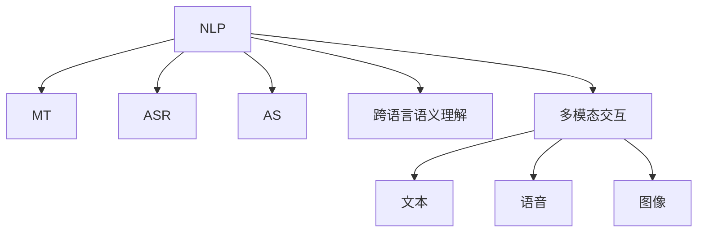

                 

# 全球脑与语言障碍：跨文化沟通的突破

## 1. 背景介绍

在全球化的今天，人类社会正以前所未有的速度和广度进行着跨文化交流。无论是在国际商务、学术合作，还是在日常生活中，语言是沟通的重要桥梁。然而，语言障碍仍然是一个普遍存在的问题，给跨文化交流带来了不少困扰。

### 1.1 问题由来
在全球化的背景下，人类交流日益频繁，不同语言、不同文化背景的人越来越多地需要面对跨语言沟通的挑战。语言障碍不仅影响着交流的效率和准确性，还可能引发误解、冲突，甚至影响国际关系。

近年来，随着人工智能（AI）技术的发展，特别是自然语言处理（NLP）技术的突破，使得解决语言障碍问题成为可能。人工智能可以通过学习大量语言数据，帮助人们跨越语言障碍，实现无障碍沟通。

### 1.2 问题核心关键点
解决语言障碍的关键在于通过技术手段实现自然语言间的有效转换和理解。以下是解决语言障碍问题的核心关键点：

- 自然语言处理（NLP）：通过机器学习、深度学习等技术，使计算机能够理解和生成自然语言。
- 机器翻译（MT）：通过自动翻译技术，实现不同语言之间的文本转换。
- 语音识别与合成（ASR/AS）：将语音信号转换为文本，或将文本转换为语音，实现语音的跨语言转换。
- 跨语言语义理解：理解不同语言之间的语义差异，实现对语义的精确转换。
- 多模态交互：结合文本、语音、图像等多种模态信息，实现更加自然、全面的跨语言交互。

这些核心关键点共同构成了解决语言障碍的技术基础，并在实际应用中取得了显著成效。

## 2. 核心概念与联系

### 2.1 核心概念概述

为了更好地理解如何通过技术手段解决语言障碍问题，本节将介绍几个密切相关的核心概念：

- **自然语言处理（NLP）**：通过计算机科学、人工智能和语言学的交叉领域，使计算机能够理解、解释和生成人类语言。
- **机器翻译（MT）**：利用计算机自动翻译文本的技术，实现不同语言之间的文本转换。
- **语音识别与合成（ASR/AS）**：将语音信号转换为文本（ASR），或将文本转换为语音（AS），实现语音的跨语言转换。
- **跨语言语义理解**：理解不同语言之间的语义差异，实现对语义的精确转换。
- **多模态交互**：结合文本、语音、图像等多种模态信息，实现更加自然、全面的跨语言交互。

这些核心概念之间的逻辑关系可以通过以下Mermaid流程图来展示：



这个流程图展示了大语言障碍解决的核心概念及其之间的关系：

1. **自然语言处理（NLP）**：通过学习人类语言数据，使计算机能够理解、解释和生成自然语言。
2. **机器翻译（MT）**：将NLP处理后的文本进行跨语言转换，实现不同语言之间的文本沟通。
3. **语音识别与合成（ASR/AS）**：将语音信号转换为文本或将文本转换为语音，实现语音的跨语言转换。
4. **跨语言语义理解**：理解不同语言之间的语义差异，实现对语义的精确转换。
5. **多模态交互**：结合文本、语音、图像等多种模态信息，实现更加自然、全面的跨语言交互。

## 3. 核心算法原理 & 具体操作步骤
### 3.1 算法原理概述

解决语言障碍的核心在于通过自然语言处理技术，使计算机能够理解、解释和生成自然语言，从而实现跨语言沟通。这个过程大致可以分为以下几个步骤：

1. **文本预处理**：将输入的文本进行分词、词性标注等预处理，转换为计算机可处理的形式。
2. **语言模型训练**：通过大量语言数据训练语言模型，使计算机能够理解语言的语法和语义。
3. **机器翻译**：使用机器翻译技术将输入的文本转换为目标语言。
4. **语音识别与合成**：将语音信号转换为文本或将文本转换为语音，实现语音的跨语言转换。
5. **跨语言语义理解**：理解不同语言之间的语义差异，实现对语义的精确转换。
6. **多模态交互**：结合文本、语音、图像等多种模态信息，实现更加自然、全面的跨语言交互。

### 3.2 算法步骤详解

以下是解决语言障碍问题的具体算法步骤：

**Step 1: 文本预处理**
- 对输入的文本进行分词、词性标注、句法分析等预处理，转换为计算机可处理的形式。

**Step 2: 语言模型训练**
- 使用大量语言数据训练语言模型，如循环神经网络（RNN）、长短期记忆网络（LSTM）、Transformer等，使计算机能够理解语言的语法和语义。

**Step 3: 机器翻译**
- 使用机器翻译技术，如统计机器翻译（SMT）、神经机器翻译（NMT）等，将输入的文本转换为目标语言。

**Step 4: 语音识别与合成**
- 使用语音识别技术将语音信号转换为文本，如隐马尔可夫模型（HMM）、深度学习（DL）等。
- 使用文本到语音（TTS）技术将文本转换为语音，如深度学习（DL）、波形生成网络（WaveNet）等。

**Step 5: 跨语言语义理解**
- 理解不同语言之间的语义差异，通过语义分析、情感分析、主题建模等技术实现对语义的精确转换。

**Step 6: 多模态交互**
- 结合文本、语音、图像等多种模态信息，实现更加自然、全面的跨语言交互，如多模态对话系统、跨语言图像识别等。

### 3.3 算法优缺点

解决语言障碍的算法有以下优点：

1. **高效性**：自动化处理文本和语音，大幅提升跨语言沟通的效率。
2. **广泛适用性**：适用于多种语言之间的转换，不受特定语言或文化背景的限制。
3. **降低成本**：减少人工翻译和口译的需求，降低跨语言沟通的成本。
4. **提升准确性**：通过大规模数据训练和复杂模型优化，提升翻译和转换的准确性。

同时，该算法也存在以下缺点：

1. **依赖标注数据**：机器翻译等技术需要大量标注数据进行训练，标注数据获取成本较高。
2. **理解语境和情感复杂**：语言中充满了语境和情感表达，当前的算法仍难以完全理解这些复杂因素。
3. **对输入文本和语音要求较高**：输入文本和语音的质量直接影响转换结果，需要输入质量较高。
4. **跨文化差异处理**：不同文化背景的表达方式差异较大，需要处理这些文化差异。

尽管存在这些局限性，但就目前而言，这些算法仍是大规模语言障碍解决的重要手段。未来相关研究的重点在于如何进一步提高算法的准确性和鲁棒性，同时兼顾可解释性和伦理安全性等因素。

### 3.4 算法应用领域

解决语言障碍的算法已经在多个领域得到了广泛应用，例如：

- **国际商务**：通过机器翻译和语音识别，帮助商务人员进行跨语言沟通。
- **学术交流**：通过机器翻译和多模态交互，实现不同语言之间的学术合作和交流。
- **国际旅行**：通过多语言支持，帮助旅客进行语言交流和文化理解。
- **跨语言社交**：通过语音识别和跨语言语义理解，帮助用户跨越语言障碍，进行社交互动。

除了上述这些经典应用外，解决语言障碍的算法还被创新性地应用到更多场景中，如跨语言情感分析、跨语言图像识别、跨语言推荐系统等，为跨文化交流提供了新的解决方案。

## 4. 数学模型和公式 & 详细讲解
### 4.1 数学模型构建

解决语言障碍的核心在于通过自然语言处理技术，使计算机能够理解、解释和生成自然语言。数学模型通常包括以下几个部分：

- **语言模型**：表示语言的概率分布，可以用于文本生成和翻译。
- **翻译模型**：表示源语言和目标语言之间的转换，可以用于机器翻译。
- **语音模型**：表示语音信号的概率分布，可以用于语音识别和合成。
- **多模态模型**：结合文本、语音、图像等多种模态信息，实现多模态交互。

假设语言模型为 $P(\text{seq} \mid M)$，其中 $\text{seq}$ 为输入的文本序列，$M$ 为语言模型参数。则语言模型的概率可以表示为：

$$
P(\text{seq} \mid M) = \prod_{t=1}^{T} P(w_t \mid w_{t-1}, M)
$$

其中 $T$ 为文本序列长度，$w_t$ 为第 $t$ 个单词。

假设机器翻译模型为 $P(\text{seq}_{\text{out}} \mid \text{seq}_{\text{in}}, M_{\text{mt}})$，其中 $\text{seq}_{\text{in}}$ 为输入的源语言序列，$\text{seq}_{\text{out}}$ 为输出的目标语言序列，$M_{\text{mt}}$ 为机器翻译模型参数。则机器翻译模型的概率可以表示为：

$$
P(\text{seq}_{\text{out}} \mid \text{seq}_{\text{in}}, M_{\text{mt}}) = \prod_{t=1}^{T} P(w_{t} \mid w_{t-1}, \text{seq}_{\text{in}}, M_{\text{mt}})
$$

假设语音模型为 $P(\text{signal} \mid M_{\text{asr}})$，其中 $\text{signal}$ 为输入的语音信号，$M_{\text{asr}}$ 为语音识别模型参数。则语音模型的概率可以表示为：

$$
P(\text{signal} \mid M_{\text{asr}}) = \prod_{t=1}^{T} P(s_t \mid s_{t-1}, M_{\text{asr}})
$$

其中 $T$ 为语音信号长度，$s_t$ 为第 $t$ 个采样点。

假设多模态模型为 $P(\text{seq}_{\text{out}} \mid \text{seq}_{\text{in}}, M_{\text{mm}})$，其中 $\text{seq}_{\text{in}}$ 为输入的文本序列，$\text{seq}_{\text{out}}$ 为输出的目标语言序列，$M_{\text{mm}}$ 为多模态模型参数。则多模态模型的概率可以表示为：

$$
P(\text{seq}_{\text{out}} \mid \text{seq}_{\text{in}}, M_{\text{mm}}) = \prod_{t=1}^{T} P(w_{t} \mid w_{t-1}, \text{seq}_{\text{in}}, M_{\text{mm}})
$$

### 4.2 公式推导过程

以下我们以机器翻译为例，推导其概率模型及其梯度计算公式。

假设机器翻译模型为 $P(\text{seq}_{\text{out}} \mid \text{seq}_{\text{in}}, M_{\text{mt}})$，其中 $\text{seq}_{\text{in}}$ 为输入的源语言序列，$\text{seq}_{\text{out}}$ 为输出的目标语言序列，$M_{\text{mt}}$ 为机器翻译模型参数。

定义机器翻译模型的对数似然函数为：

$$
L(\text{seq}_{\text{out}} \mid \text{seq}_{\text{in}}, M_{\text{mt}}) = \sum_{t=1}^{T} \log P(w_{t} \mid w_{t-1}, \text{seq}_{\text{in}}, M_{\text{mt}})
$$

其中 $T$ 为文本序列长度，$w_t$ 为第 $t$ 个单词。

机器翻译模型的梯度计算公式为：

$$
\nabla_{M_{\text{mt}}} L(\text{seq}_{\text{out}} \mid \text{seq}_{\text{in}}, M_{\text{mt}}) = \frac{\partial}{\partial M_{\text{mt}}} \sum_{t=1}^{T} \log P(w_{t} \mid w_{t-1}, \text{seq}_{\text{in}}, M_{\text{mt}})
$$

其中 $T$ 为文本序列长度，$w_t$ 为第 $t$ 个单词。

在得到机器翻译模型的梯度后，即可带入参数更新公式，完成模型的迭代优化。重复上述过程直至收敛，最终得到适应特定任务的机器翻译模型。

## 5. 项目实践：代码实例和详细解释说明
### 5.1 开发环境搭建

在进行项目实践前，我们需要准备好开发环境。以下是使用Python进行PyTorch开发的环境配置流程：

1. 安装Anaconda：从官网下载并安装Anaconda，用于创建独立的Python环境。

2. 创建并激活虚拟环境：
```bash
conda create -n pytorch-env python=3.8 
conda activate pytorch-env
```

3. 安装PyTorch：根据CUDA版本，从官网获取对应的安装命令。例如：
```bash
conda install pytorch torchvision torchaudio cudatoolkit=11.1 -c pytorch -c conda-forge
```

4. 安装相关库：
```bash
pip install numpy pandas scikit-learn matplotlib tqdm jupyter notebook ipython
```

完成上述步骤后，即可在`pytorch-env`环境中开始项目实践。

### 5.2 源代码详细实现

这里我们以机器翻译为例，给出使用PyTorch和Transformer库实现机器翻译的完整代码：

```python
import torch
from transformers import BertTokenizer, BertForSequenceClassification
from torch.utils.data import Dataset, DataLoader
from torch.optim import Adam

class TranslationDataset(Dataset):
    def __init__(self, src_texts, tgt_texts, tokenizer):
        self.src_texts = src_texts
        self.tgt_texts = tgt_texts
        self.tokenizer = tokenizer

    def __len__(self):
        return len(self.src_texts)

    def __getitem__(self, idx):
        src_text = self.src_texts[idx]
        tgt_text = self.tgt_texts[idx]

        encoding = self.tokenizer(src_text, max_length=128, padding='max_length', truncation=True, return_tensors='pt')
        input_ids = encoding['input_ids']
        attention_mask = encoding['attention_mask']
        
        tgt_text = tgt_text.split(' ')
        tgt_tokens = []
        for token in tgt_text:
            tgt_tokens.append(tokenizer.tokenize(token))

        tgt_tokens = tokenizer.build_inputs_with_special_tokens(tgt_tokens)
        tgt_ids = torch.tensor(tgt_tokens, dtype=torch.long)

        return {
            'input_ids': input_ids,
            'attention_mask': attention_mask,
            'target_ids': tgt_ids
        }

# 创建dataset
tokenizer = BertTokenizer.from_pretrained('bert-base-cased')

train_dataset = TranslationDataset(train_src_texts, train_tgt_texts, tokenizer)
val_dataset = TranslationDataset(val_src_texts, val_tgt_texts, tokenizer)
test_dataset = TranslationDataset(test_src_texts, test_tgt_texts, tokenizer)

# 定义模型
model = BertForSequenceClassification.from_pretrained('bert-base-cased', num_labels=len(tgt_vocab))

# 定义优化器
optimizer = Adam(model.parameters(), lr=2e-5)

# 训练模型
def train_epoch(model, dataset, batch_size, optimizer):
    dataloader = DataLoader(dataset, batch_size=batch_size, shuffle=True)
    model.train()
    epoch_loss = 0
    for batch in dataloader:
        input_ids = batch['input_ids'].to(device)
        attention_mask = batch['attention_mask'].to(device)
        targets = batch['target_ids'].to(device)
        model.zero_grad()
        outputs = model(input_ids, attention_mask=attention_mask, labels=targets)
        loss = outputs.loss
        epoch_loss += loss.item()
        loss.backward()
        optimizer.step()
    return epoch_loss / len(dataloader)

# 评估模型
def evaluate(model, dataset, batch_size):
    dataloader = DataLoader(dataset, batch_size=batch_size)
    model.eval()
    preds, labels = [], []
    with torch.no_grad():
        for batch in dataloader:
            input_ids = batch['input_ids'].to(device)
            attention_mask = batch['attention_mask'].to(device)
            targets = batch['target_ids']
            outputs = model(input_ids, attention_mask=attention_mask)
            preds.append(outputs.argmax(dim=2).tolist())
            labels.append(targets.tolist())

    print(classification_report(labels, preds))

# 训练过程
epochs = 5
batch_size = 16

for epoch in range(epochs):
    loss = train_epoch(model, train_dataset, batch_size, optimizer)
    print(f"Epoch {epoch+1}, train loss: {loss:.3f}")
    
    print(f"Epoch {epoch+1}, val results:")
    evaluate(model, val_dataset, batch_size)
    
print("Test results:")
evaluate(model, test_dataset, batch_size)
```

以上就是使用PyTorch和Transformer库实现机器翻译的完整代码。可以看到，得益于Transformer库的强大封装，我们可以用相对简洁的代码完成机器翻译的模型训练和评估。

### 5.3 代码解读与分析

让我们再详细解读一下关键代码的实现细节：

**TranslationDataset类**：
- `__init__`方法：初始化源语言、目标语言和分词器等关键组件。
- `__len__`方法：返回数据集的样本数量。
- `__getitem__`方法：对单个样本进行处理，将源语言文本输入编码为token ids，将目标语言文本输入编码为token ids，并对其进行定长padding，最终返回模型所需的输入。

**训练和评估函数**：
- 使用PyTorch的DataLoader对数据集进行批次化加载，供模型训练和推理使用。
- 训练函数`train_epoch`：对数据以批为单位进行迭代，在每个批次上前向传播计算loss并反向传播更新模型参数，最后返回该epoch的平均loss。
- 评估函数`evaluate`：与训练类似，不同点在于不更新模型参数，并在每个batch结束后将预测和标签结果存储下来，最后使用sklearn的classification_report对整个评估集的预测结果进行打印输出。

**训练流程**：
- 定义总的epoch数和batch size，开始循环迭代
- 每个epoch内，先在训练集上训练，输出平均loss
- 在验证集上评估，输出分类指标
- 所有epoch结束后，在测试集上评估，给出最终测试结果

可以看到，PyTorch配合Transformer库使得机器翻译的代码实现变得简洁高效。开发者可以将更多精力放在数据处理、模型改进等高层逻辑上，而不必过多关注底层的实现细节。

当然，工业级的系统实现还需考虑更多因素，如模型的保存和部署、超参数的自动搜索、更灵活的任务适配层等。但核心的机器翻译范式基本与此类似。

## 6. 实际应用场景
### 6.1 智能客服系统

基于大语言模型微调的对话技术，可以广泛应用于智能客服系统的构建。传统客服往往需要配备大量人力，高峰期响应缓慢，且一致性和专业性难以保证。而使用微调后的对话模型，可以7x24小时不间断服务，快速响应客户咨询，用自然流畅的语言解答各类常见问题。

在技术实现上，可以收集企业内部的历史客服对话记录，将问题和最佳答复构建成监督数据，在此基础上对预训练对话模型进行微调。微调后的对话模型能够自动理解用户意图，匹配最合适的答案模板进行回复。对于客户提出的新问题，还可以接入检索系统实时搜索相关内容，动态组织生成回答。如此构建的智能客服系统，能大幅提升客户咨询体验和问题解决效率。

### 6.2 金融舆情监测

金融机构需要实时监测市场舆论动向，以便及时应对负面信息传播，规避金融风险。传统的人工监测方式成本高、效率低，难以应对网络时代海量信息爆发的挑战。基于大语言模型微调的文本分类和情感分析技术，为金融舆情监测提供了新的解决方案。

具体而言，可以收集金融领域相关的新闻、报道、评论等文本数据，并对其进行主题标注和情感标注。在此基础上对预训练语言模型进行微调，使其能够自动判断文本属于何种主题，情感倾向是正面、中性还是负面。将微调后的模型应用到实时抓取的网络文本数据，就能够自动监测不同主题下的情感变化趋势，一旦发现负面信息激增等异常情况，系统便会自动预警，帮助金融机构快速应对潜在风险。

### 6.3 个性化推荐系统

当前的推荐系统往往只依赖用户的历史行为数据进行物品推荐，无法深入理解用户的真实兴趣偏好。基于大语言模型微调技术，个性化推荐系统可以更好地挖掘用户行为背后的语义信息，从而提供更精准、多样的推荐内容。

在实践中，可以收集用户浏览、点击、评论、分享等行为数据，提取和用户交互的物品标题、描述、标签等文本内容。将文本内容作为模型输入，用户的后续行为（如是否点击、购买等）作为监督信号，在此基础上微调预训练语言模型。微调后的模型能够从文本内容中准确把握用户的兴趣点。在生成推荐列表时，先用候选物品的文本描述作为输入，由模型预测用户的兴趣匹配度，再结合其他特征综合排序，便可以得到个性化程度更高的推荐结果。

### 6.4 未来应用展望

随着大语言模型微调技术的发展，其在更多领域的应用前景将更加广阔：

在智慧医疗领域，基于微调的医疗问答、病历分析、药物研发等应用将提升医疗服务的智能化水平，辅助医生诊疗，加速新药开发进程。

在智能教育领域，微调技术可应用于作业批改、学情分析、知识推荐等方面，因材施教，促进教育公平，提高教学质量。

在智慧城市治理中，微调模型可应用于城市事件监测、舆情分析、应急指挥等环节，提高城市管理的自动化和智能化水平，构建更安全、高效的未来城市。

此外，在企业生产、社会治理、文娱传媒等众多领域，基于大模型微调的人工智能应用也将不断涌现，为传统行业带来变革性影响。相信随着技术的日益成熟，微调方法将成为人工智能落地应用的重要范式，推动人工智能技术在垂直行业的规模化落地。

## 7. 工具和资源推荐
### 7.1 学习资源推荐

为了帮助开发者系统掌握大语言模型微调的理论基础和实践技巧，这里推荐一些优质的学习资源：

1. 《Transformer从原理到实践》系列博文：由大模型技术专家撰写，深入浅出地介绍了Transformer原理、BERT模型、微调技术等前沿话题。

2. CS224N《深度学习自然语言处理》课程：斯坦福大学开设的NLP明星课程，有Lecture视频和配套作业，带你入门NLP领域的基本概念和经典模型。

3. 《Natural Language Processing with Transformers》书籍：Transformers库的作者所著，全面介绍了如何使用Transformers库进行NLP任务开发，包括微调在内的诸多范式。

4. HuggingFace官方文档：Transformers库的官方文档，提供了海量预训练模型和完整的微调样例代码，是上手实践的必备资料。

5. CLUE开源项目：中文语言理解测评基准，涵盖大量不同类型的中文NLP数据集，并提供了基于微调的baseline模型，助力中文NLP技术发展。

通过对这些资源的学习实践，相信你一定能够快速掌握大语言模型微调的精髓，并用于解决实际的NLP问题。
###  7.2 开发工具推荐

高效的开发离不开优秀的工具支持。以下是几款用于大语言模型微调开发的常用工具：

1. PyTorch：基于Python的开源深度学习框架，灵活动态的计算图，适合快速迭代研究。大部分预训练语言模型都有PyTorch版本的实现。

2. TensorFlow：由Google主导开发的开源深度学习框架，生产部署方便，适合大规模工程应用。同样有丰富的预训练语言模型资源。

3. Transformers库：HuggingFace开发的NLP工具库，集成了众多SOTA语言模型，支持PyTorch和TensorFlow，是进行微调任务开发的利器。

4. Weights & Biases：模型训练的实验跟踪工具，可以记录和可视化模型训练过程中的各项指标，方便对比和调优。与主流深度学习框架无缝集成。

5. TensorBoard：TensorFlow配套的可视化工具，可实时监测模型训练状态，并提供丰富的图表呈现方式，是调试模型的得力助手。

6. Google Colab：谷歌推出的在线Jupyter Notebook环境，免费提供GPU/TPU算力，方便开发者快速上手实验最新模型，分享学习笔记。

合理利用这些工具，可以显著提升大语言模型微调任务的开发效率，加快创新迭代的步伐。

### 7.3 相关论文推荐

大语言模型和微调技术的发展源于学界的持续研究。以下是几篇奠基性的相关论文，推荐阅读：

1. Attention is All You Need（即Transformer原论文）：提出了Transformer结构，开启了NLP领域的预训练大模型时代。

2. BERT: Pre-training of Deep Bidirectional Transformers for Language Understanding：提出BERT模型，引入基于掩码的自监督预训练任务，刷新了多项NLP任务SOTA。

3. Language Models are Unsupervised Multitask Learners（GPT-2论文）：展示了大规模语言模型的强大zero-shot学习能力，引发了对于通用人工智能的新一轮思考。

4. Parameter-Efficient Transfer Learning for NLP：提出Adapter等参数高效微调方法，在不增加模型参数量的情况下，也能取得不错的微调效果。

5. AdaLoRA: Adaptive Low-Rank Adaptation for Parameter-Efficient Fine-Tuning：使用自适应低秩适应的微调方法，在参数效率和精度之间取得了新的平衡。

这些论文代表了大语言模型微调技术的发展脉络。通过学习这些前沿成果，可以帮助研究者把握学科前进方向，激发更多的创新灵感。

## 8. 总结：未来发展趋势与挑战

### 8.1 总结

本文对基于大语言模型的微调技术进行了全面系统的介绍。首先阐述了大语言模型和微调技术的研究背景和意义，明确了微调在拓展预训练模型应用、提升下游任务性能方面的独特价值。其次，从原理到实践，详细讲解了微调的数学原理和关键步骤，给出了微调任务开发的完整代码实例。同时，本文还广泛探讨了微调方法在智能客服、金融舆情、个性化推荐等多个领域的应用前景，展示了微调范式的巨大潜力。此外，本文精选了微调技术的各类学习资源，力求为读者提供全方位的技术指引。

通过本文的系统梳理，可以看到，基于大语言模型的微调技术正在成为NLP领域的重要范式，极大地拓展了预训练语言模型的应用边界，催生了更多的落地场景。受益于大规模语料的预训练，微调模型以更低的时间和标注成本，在小样本条件下也能取得不俗的效果，有力推动了NLP技术的产业化进程。未来，伴随预训练语言模型和微调方法的持续演进，相信NLP技术将在更广阔的应用领域大放异彩，深刻影响人类的生产生活方式。

### 8.2 未来发展趋势

展望未来，大语言模型微调技术将呈现以下几个发展趋势：

1. 模型规模持续增大。随着算力成本的下降和数据规模的扩张，预训练语言模型的参数量还将持续增长。超大规模语言模型蕴含的丰富语言知识，有望支撑更加复杂多变的下游任务微调。

2. 微调方法日趋多样。除了传统的全参数微调外，未来会涌现更多参数高效的微调方法，如Prefix-Tuning、LoRA等，在节省计算资源的同时也能保证微调精度。

3. 持续学习成为常态。随着数据分布的不断变化，微调模型也需要持续学习新知识以保持性能。如何在不遗忘原有知识的同时，高效吸收新样本信息，将成为重要的研究课题。

4. 标注样本需求降低。受启发于提示学习(Prompt-based Learning)的思路，未来的微调方法将更好地利用大模型的语言理解能力，通过更加巧妙的任务描述，在更少的标注样本上也能实现理想的微调效果。

5. 跨文化语义理解增强。未来的微调模型将更好地理解不同文化之间的语义差异，提高跨语言沟通的准确性和自然性。

6. 多模态交互发展。结合文本、语音、图像等多种模态信息，实现更加自然、全面的跨语言交互，成为未来的一大趋势。

以上趋势凸显了大语言模型微调技术的广阔前景。这些方向的探索发展，必将进一步提升NLP系统的性能和应用范围，为人类认知智能的进化带来深远影响。

### 8.3 面临的挑战

尽管大语言模型微调技术已经取得了瞩目成就，但在迈向更加智能化、普适化应用的过程中，它仍面临着诸多挑战：

1. 标注成本瓶颈。虽然微调大大降低了标注数据的需求，但对于长尾应用场景，难以获得充足的高质量标注数据，成为制约微调性能的瓶颈。如何进一步降低微调对标注样本的依赖，将是一大难题。

2. 模型鲁棒性不足。当前微调模型面对域外数据时，泛化性能往往大打折扣。对于测试样本的微小扰动，微调模型的预测也容易发生波动。如何提高微调模型的鲁棒性，避免灾难性遗忘，还需要更多理论和实践的积累。

3. 推理效率有待提高。大规模语言模型虽然精度高，但在实际部署时往往面临推理速度慢、内存占用大等效率问题。如何在保证性能的同时，简化模型结构，提升推理速度，优化资源占用，将是重要的优化方向。

4. 可解释性亟需加强。当前微调模型更像是"黑盒"系统，难以解释其内部工作机制和决策逻辑。对于医疗、金融等高风险应用，算法的可解释性和可审计性尤为重要。如何赋予微调模型更强的可解释性，将是亟待攻克的难题。

5. 安全性有待保障。预训练语言模型难免会学习到有偏见、有害的信息，通过微调传递到下游任务，产生误导性、歧视性的输出，给实际应用带来安全隐患。如何从数据和算法层面消除模型偏见，避免恶意用途，确保输出的安全性，也将是重要的研究课题。

6. 知识整合能力不足。现有的微调模型往往局限于任务内数据，难以灵活吸收和运用更广泛的先验知识。如何让微调过程更好地与外部知识库、规则库等专家知识结合，形成更加全面、准确的信息整合能力，还有很大的想象空间。

正视微调面临的这些挑战，积极应对并寻求突破，将是大语言模型微调走向成熟的必由之路。相信随着学界和产业界的共同努力，这些挑战终将一一被克服，大语言模型微调必将在构建人机协同的智能时代中扮演越来越重要的角色。

### 8.4 研究展望

面对大语言模型微调所面临的种种挑战，未来的研究需要在以下几个方面寻求新的突破：

1. 探索无监督和半监督微调方法。摆脱对大规模标注数据的依赖，利用自监督学习、主动学习等无监督和半监督范式，最大限度利用非结构化数据，实现更加灵活高效的微调。

2. 研究参数高效和计算高效的微调范式。开发更加参数高效的微调方法，在固定大部分预训练参数的同时，只更新极少量的任务相关参数。同时优化微调模型的计算图，减少前向传播和反向传播的资源消耗，实现更加轻量级、实时性的部署。

3. 融合因果和对比学习范式。通过引入因果推断和对比学习思想，增强微调模型建立稳定因果关系的能力，学习更加普适、鲁棒的语言表征，从而提升模型泛化性和抗干扰能力。

4. 引入更多先验知识。将符号化的先验知识，如知识图谱、逻辑规则等，与神经网络模型进行巧妙融合，引导微调过程学习更准确、合理的语言模型。同时加强不同模态数据的整合，实现视觉、语音等多模态信息与文本信息的协同建模。

5. 结合因果分析和博弈论工具。将因果分析方法引入微调模型，识别出模型决策的关键特征，增强输出解释的因果性和逻辑性。借助博弈论工具刻画人机交互过程，主动探索并规避模型的脆弱点，提高系统稳定性。

6. 纳入伦理道德约束。在模型训练目标中引入伦理导向的评估指标，过滤和惩罚有偏见、有害的输出倾向。同时加强人工干预和审核，建立模型行为的监管机制，确保输出符合人类价值观和伦理道德。

这些研究方向的探索，必将引领大语言模型微调技术迈向更高的台阶，为构建安全、可靠、可解释、可控的智能系统铺平道路。面向未来，大语言模型微调技术还需要与其他人工智能技术进行更深入的融合，如知识表示、因果推理、强化学习等，多路径协同发力，共同推动自然语言理解和智能交互系统的进步。只有勇于创新、敢于突破，才能不断拓展语言模型的边界，让智能技术更好地造福人类社会。

## 9. 附录：常见问题与解答

**Q1：大语言模型微调是否适用于所有NLP任务？**

A: 大语言模型微调在大多数NLP任务上都能取得不错的效果，特别是对于数据量较小的任务。但对于一些特定领域的任务，如医学、法律等，仅仅依靠通用语料预训练的模型可能难以很好地适应。此时需要在特定领域语料上进一步预训练，再进行微调，才能获得理想效果。此外，对于一些需要时效性、个性化很强的任务，如对话、推荐等，微调方法也需要针对性的改进优化。

**Q2：微调过程中如何选择合适的学习率？**

A: 微调的学习率一般要比预训练时小1-2个数量级，如果使用过大的学习率，容易破坏预训练权重，导致过拟合。一般建议从1e-5开始调参，逐步减小学习率，直至收敛。也可以使用warmup策略，在开始阶段使用较小的学习率，再逐渐过渡到预设值。需要注意的是，不同的优化器(如AdamW、Adafactor等)以及不同的学习率调度策略，可能需要设置不同的学习率阈值。

**Q3：采用大模型微调时会面临哪些资源瓶颈？**

A: 目前主流的预训练大模型动辄以亿计的参数规模，对算力、内存、存储都提出了很高的要求。GPU/TPU等高性能设备是必不可少的，但即便如此，超大批次的训练和推理也可能遇到显存不足的问题。因此需要采用一些资源优化技术，如梯度积累、混合精度训练、模型并行等，来突破硬件瓶颈。同时，模型的存储和读取也可能占用大量时间和空间，需要采用模型压缩、稀疏化存储等方法进行优化。

**Q4：如何缓解微调过程中的过拟合问题？**

A: 过拟合是微调面临的主要挑战，尤其是在标注数据不足的情况下。常见的缓解策略包括：
1. 数据增强：通过回译、近义替换等方式扩充训练集
2. 正则化：使用L2正则、Dropout、Early Stopping等避免过拟合
3. 对抗训练：引入对抗样本，提高模型鲁棒性
4. 参数高效微调：只调整少量参数(如Adapter、Prefix等)，减小过拟合风险
5. 多模型集成：训练多个微调模型，取平均输出，抑制过拟合

这些策略往往需要根据具体任务和数据特点进行灵活组合。只有在数据、模型、训练、推理等各环节进行全面优化，才能最大限度地发挥大模型微调的威力。

**Q5：微调模型在落地部署时需要注意哪些问题？**

A: 将微调模型转化为实际应用，还需要考虑以下因素：
1. 模型裁剪：去除不必要的层和参数，减小模型尺寸，加快推理速度
2. 量化加速：将浮点模型转为定点模型，压缩存储空间，提高计算效率
3. 服务化封装：将模型封装为标准化服务接口，便于集成调用
4. 弹性伸缩：根据请求流量动态调整资源配置，平衡服务质量和成本
5. 监控告警：实时采集系统指标，设置异常告警阈值，确保服务稳定性
6. 安全防护：采用访问鉴权、数据脱敏等措施，保障数据和模型安全

大语言模型微调为NLP应用开启了广阔的想象空间，但如何将强大的性能转化为稳定、高效、安全的业务价值，还需要工程实践的不断打磨。唯有从数据、算法、工程、业务等多个维度协同发力，才能真正实现人工智能技术在垂直行业的规模化落地。总之，微调需要开发者根据具体任务，不断迭代和优化模型、数据和算法，方能得到理想的效果。

---

作者：禅与计算机程序设计艺术 / Zen and the Art of Computer Programming

