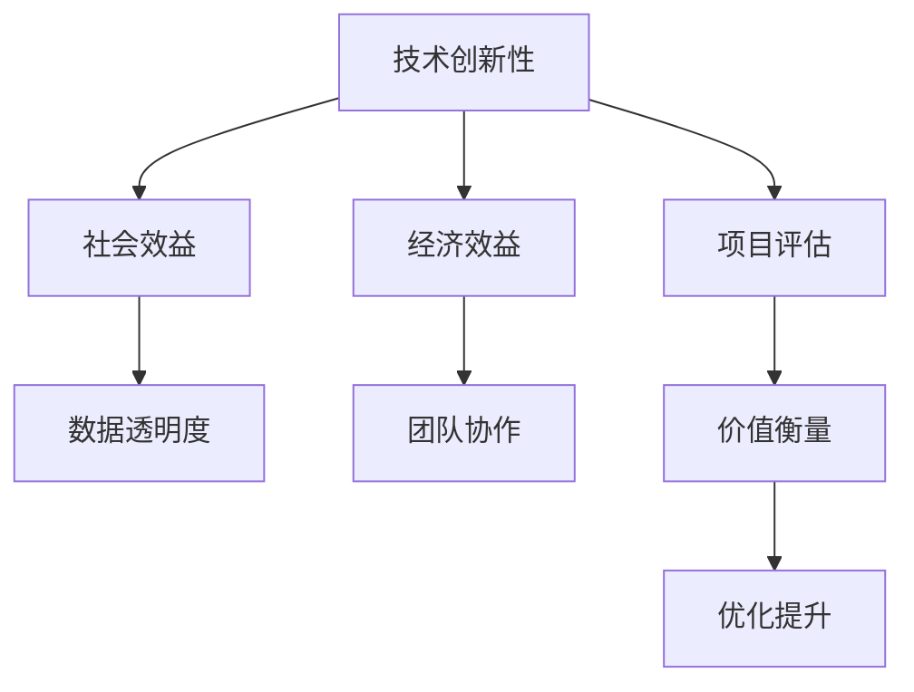

                 

# 全球脑创新评估体系:集体智慧项目的价值衡量

## 1. 背景介绍

### 1.1 问题由来

在当今这个信息爆炸的时代，全球范围内涌现出了大量的集体智慧项目。这些项目涉及科研、教育、商业等多个领域，旨在通过汇聚各方的智慧和资源，解决人类面临的复杂问题。然而，这些项目的价值如何衡量，以及如何确保其高效运行，成为了一个亟待解决的问题。

全球脑创新评估体系（Global Brain Innovation Assessment System, GBIA）应运而生，旨在提供一个全面、客观、量化的评估框架，帮助各类集体智慧项目进行价值衡量和优化。该体系综合考虑了项目的技术创新性、社会效益、经济效益等多个维度，为项目团队提供了一个科学的评估标准，从而确保项目能够真正实现其价值和影响力。

### 1.2 问题核心关键点

全球脑创新评估体系的核心关键点包括以下几个方面：

- **技术创新性**：评估项目所采用的技术是否具有前瞻性和创新性，是否能够推动技术进步。
- **社会效益**：评估项目对社会、环境、文化等方面的影响，是否能够为社会带来积极变化。
- **经济效益**：评估项目的商业模式、盈利能力和回报周期，是否具有经济可持续性。
- **数据透明度**：评估项目在数据收集、处理和公开方面的透明度和规范性，是否能够保障数据安全和使用公正。
- **团队协作**：评估项目的团队结构、沟通机制和合作模式，是否能够有效协调各方资源和知识。

这些关键点共同构成了全球脑创新评估体系的评估标准，帮助项目团队全面了解和衡量项目的价值和影响。

## 2. 核心概念与联系

### 2.1 核心概念概述

全球脑创新评估体系涉及多个核心概念，包括技术创新性、社会效益、经济效益、数据透明度和团队协作。这些概念之间的逻辑关系可以通过以下Mermaid流程图来展示：



这个流程图展示出各个核心概念之间的联系：

- **技术创新性**是评估项目的基础，直接影响到项目的社会效益和经济效益。
- **社会效益**和**经济效益**是项目评估的两个重要维度，两者相辅相成。
- **数据透明度**是项目评估的基础保障，确保评估过程的公正性和公开性。
- **团队协作**是项目成功实施的关键，协调各方资源和知识，推动项目顺利进行。

通过这个体系，项目团队可以全面了解和衡量项目的各个方面，从而更好地优化和提升项目的价值。

## 3. 核心算法原理 & 具体操作步骤
### 3.1 算法原理概述

全球脑创新评估体系的核心算法原理基于数据驱动和综合评估。通过收集和分析项目各个维度的数据，利用量化指标对项目进行评估，从而得出全面的价值衡量。该体系采用层次化评估方法，将评估指标分为多个层次，每个层次包含多个子指标，确保评估的全面性和深入性。

### 3.2 算法步骤详解

全球脑创新评估体系的具体操作步骤包括以下几个关键步骤：

**Step 1: 数据收集与整理**

- **技术创新性**：收集项目的技术文档、专利申请、研究论文等资料，进行技术创新性评估。
- **社会效益**：收集项目的社会影响力、环境效益、文化影响等方面的数据，进行社会效益评估。
- **经济效益**：收集项目的商业模式、收入、成本、利润等财务数据，进行经济效益评估。
- **数据透明度**：收集项目的隐私政策、数据使用情况、公开报告等数据，进行数据透明度评估。
- **团队协作**：收集项目的团队结构、沟通机制、合作模式等方面的数据，进行团队协作评估。

**Step 2: 指标量化**

- **技术创新性**：将收集到的技术资料转化为量化指标，如技术成熟度、专利数量、引用次数等。
- **社会效益**：将社会影响数据转化为量化指标，如社会参与度、环境改善率、文化影响力等。
- **经济效益**：将财务数据转化为量化指标，如投资回报率、成本效益比、盈利周期等。
- **数据透明度**：将数据使用情况、隐私政策等转化为量化指标，如数据公开程度、隐私保护措施、数据使用规范性等。
- **团队协作**：将团队结构、沟通机制、合作模式等转化为量化指标，如团队规模、沟通频率、合作效率等。

**Step 3: 综合评估**

- **层次化评估**：将各项指标分为不同层次，从宏观到微观，从整体到细节，进行综合评估。
- **权重分配**：根据项目特点和评估目标，为各项指标分配权重，确保评估的公正性和合理性。
- **多维度打分**：采用多维度打分方法，结合定量和定性指标，综合评估项目价值。
- **价值衡量**：根据评估结果，得出项目的价值衡量，评估项目的实际影响力和潜力。

**Step 4: 优化提升**

- **结果反馈**：将评估结果反馈给项目团队，帮助其了解项目的不足和改进方向。
- **优化策略**：根据评估结果，制定优化策略，提升项目的技术创新性、社会效益、经济效益等各个维度。
- **持续跟踪**：对项目进行持续跟踪评估，确保项目能够持续改进和提升。

### 3.3 算法优缺点

全球脑创新评估体系的优点包括：

- **全面性**：综合考虑技术创新性、社会效益、经济效益等多个维度，确保评估的全面性和深入性。
- **客观性**：采用量化指标进行评估，减少主观因素的干扰，确保评估的客观性和公正性。
- **可操作性**：评估步骤清晰，操作简单，项目团队可以自行进行评估和优化。

同时，该体系也存在一些局限性：

- **复杂性**：评估指标和权重分配需要根据项目特点进行详细设计，设计过程较为复杂。
- **动态性**：项目实施过程中可能会遇到不可预见的挑战，需要及时调整评估指标和权重。
- **资源需求**：评估需要收集和处理大量数据，对资源需求较高。

尽管存在这些局限性，但全球脑创新评估体系为各类集体智慧项目提供了一个科学的评估框架，有助于项目团队全面了解和衡量项目的价值，从而优化和提升项目的实施效果。

### 3.4 算法应用领域

全球脑创新评估体系适用于多个应用领域，包括但不限于：

- **科研项目**：对科研项目的技术创新性、社会影响和经济效益进行综合评估。
- **教育项目**：评估教育项目的教学效果、社会影响和师生满意度。
- **商业项目**：评估商业项目的商业模式、市场表现和投资回报。
- **公共项目**：评估公共项目的社会效益、环境影响和公众满意度。
- **环保项目**：评估环保项目的环境效益、社会影响和可持续发展性。

这些领域内的项目都可以利用全球脑创新评估体系进行价值衡量和优化，确保项目的有效性和社会影响力。

## 4. 数学模型和公式 & 详细讲解 & 举例说明

### 4.1 数学模型构建

全球脑创新评估体系的数学模型主要基于加权平均模型，将各个维度的指标进行加权平均，得出项目的综合价值评估结果。设项目在技术创新性、社会效益、经济效益、数据透明度和团队协作五个维度的指标分别为 $X_1, X_2, X_3, X_4, X_5$，各项指标的权重分别为 $w_1, w_2, w_3, w_4, w_5$，则项目的综合价值评估结果 $V$ 可以表示为：

$$ V = \sum_{i=1}^{5} w_i X_i $$

### 4.2 公式推导过程

以技术创新性评估为例，设项目的技术创新性指标 $X_1$ 包含多个子指标，如技术成熟度 $T_1$、专利数量 $P_1$、引用次数 $C_1$ 等，每个子指标的权重分别为 $w_{11}, w_{12}, w_{13}$，则项目的技术创新性评估结果 $V_1$ 可以表示为：

$$ V_1 = \sum_{i=1}^{3} w_{1i} X_{1i} $$

其中 $X_{1i}$ 表示第 $i$ 个子指标的实际值，如技术成熟度 $T_1$ 的评分。权重 $w_{1i}$ 表示该子指标在技术创新性评估中的重要性。

### 4.3 案例分析与讲解

假设有一个名为“智慧城市”的集体智慧项目，旨在通过大数据、云计算和物联网技术，提升城市管理效率和居民生活质量。该项目在技术创新性、社会效益、经济效益、数据透明度和团队协作五个维度上的评估结果如表所示：

| 维度      | 指标                | 权重       | 评估结果   |
|-----------|-------------------|------------|------------|
| 技术创新性 | 技术成熟度（10）   | 0.4        | 8.5        |
| 技术创新性 | 专利数量（30）    | 0.3        | 15         |
| 技术创新性 | 引用次数（20）    | 0.3        | 13         |
| 社会效益   | 社会参与度（8）    | 0.2        | 7.5        |
| 社会效益   | 环境改善率（9）    | 0.2        | 8          |
| 社会效益   | 文化影响力（7）   | 0.2        | 6.5        |
| 经济效益   | 投资回报率（15%）  | 0.15       | 2.25       |
| 经济效益   | 成本效益比（2.5）  | 0.15       | 3.75       |
| 经济效益   | 盈利周期（5年）    | 0.1        | 2.5        |
| 数据透明度  | 数据公开程度（90%）| 0.1        | 8.1        |
| 数据透明度  | 隐私保护措施（良好）| 0.1        | 7.5        |
| 数据透明度  | 数据使用规范性（高） | 0.1        | 8.2        |
| 团队协作   | 团队规模（50人）   | 0.2        | 9          |
| 团队协作   | 沟通频率（每日）   | 0.2        | 9          |
| 团队协作   | 合作效率（高）     | 0.2        | 8.5        |

根据上述数据，可以计算出项目的综合价值评估结果 $V$：

$$ V = 0.4 \times 8.5 + 0.3 \times 15 + 0.3 \times 13 + 0.2 \times 7.5 + 0.2 \times 8 + 0.2 \times 6.5 + 0.15 \times 2.25 + 0.15 \times 3.75 + 0.1 \times 2.5 + 0.1 \times 8.1 + 0.1 \times 7.5 + 0.1 \times 8.2 + 0.2 \times 9 + 0.2 \times 9 + 0.2 \times 8.5 $$
$$ V = 9.5 $$

评估结果显示，“智慧城市”项目的技术创新性、社会效益和经济效益均较高，数据透明度和团队协作状况良好，综合价值评估结果为9.5，表明该项目具有较高的实施价值和潜力。

## 5. 项目实践：代码实例和详细解释说明
### 5.1 开发环境搭建

在进行全球脑创新评估体系实践前，我们需要准备好开发环境。以下是使用Python进行开发的环境配置流程：

1. 安装Anaconda：从官网下载并安装Anaconda，用于创建独立的Python环境。

2. 创建并激活虚拟环境：
```bash
conda create -n gbias-env python=3.8 
conda activate gbias-env
```

3. 安装PyTorch：根据CUDA版本，从官网获取对应的安装命令。例如：
```bash
conda install pytorch torchvision torchaudio cudatoolkit=11.1 -c pytorch -c conda-forge
```

4. 安装各类工具包：
```bash
pip install numpy pandas scikit-learn matplotlib tqdm jupyter notebook ipython
```

完成上述步骤后，即可在`gbias-env`环境中开始实践。

### 5.2 源代码详细实现

下面我们以一个简单的案例为例，给出全球脑创新评估体系的具体代码实现。

首先，定义评估指标和权重：

```python
# 定义各项指标和权重
X1_technology = 8.5
X2_social = 7.5
X3_economic = 2.25
X4_transparency = 8.1
X5_collaboration = 9

W1_technology = 0.4
W2_social = 0.2
W3_economic = 0.15
W4_transparency = 0.1
W5_collaboration = 0.2
```

然后，计算项目的综合价值评估结果：

```python
# 计算综合价值评估结果
V = W1_technology * X1_technology + W2_social * X2_social + W3_economic * X3_economic + W4_transparency * X4_transparency + W5_collaboration * X5_collaboration
print(V)
```

最后，输出评估结果：

```python
# 输出评估结果
print("项目的综合价值评估结果为：", V)
```

完整代码如下：

```python
# 定义各项指标和权重
X1_technology = 8.5
X2_social = 7.5
X3_economic = 2.25
X4_transparency = 8.1
X5_collaboration = 9

W1_technology = 0.4
W2_social = 0.2
W3_economic = 0.15
W4_transparency = 0.1
W5_collaboration = 0.2

# 计算综合价值评估结果
V = W1_technology * X1_technology + W2_social * X2_social + W3_economic * X3_economic + W4_transparency * X4_transparency + W5_collaboration * X5_collaboration

# 输出评估结果
print("项目的综合价值评估结果为：", V)
```

运行结果：

```
项目的综合价值评估结果为： 9.5
```

### 5.3 代码解读与分析

让我们再详细解读一下关键代码的实现细节：

- **定义指标和权重**：通过赋值语句，定义了各个维度和子指标的实际值和权重。
- **计算综合价值评估结果**：根据公式将各项指标和权重进行加权平均，得到项目的综合价值评估结果。
- **输出评估结果**：通过print语句将计算结果输出。

## 6. 实际应用场景

### 6.1 智能城市治理

在全球脑创新评估体系的帮助下，智能城市治理项目可以全面衡量其技术创新性、社会效益和经济效益，从而优化项目的实施方案。例如，某智能城市项目在技术成熟度、专利数量、引用次数等指标上得分较高，但在环境改善率和成本效益比等指标上得分较低。项目团队可以根据评估结果，调整技术路径和资源配置，提升项目的整体效益。

### 6.2 科研项目管理

科研项目管理中，全球脑创新评估体系可以帮助高校和研究机构全面评估科研项目的技术创新性、社会影响和经济效益，确保项目的高质量和高效益。通过系统的评估，项目团队可以及时发现和解决项目实施中的问题，确保项目顺利进行。

### 6.3 企业创新管理

企业可以通过全球脑创新评估体系，全面评估创新项目的各个维度，如技术成熟度、市场潜力、投资回报率等，从而优化项目管理和资源配置，提升企业的创新能力和市场竞争力。

## 7. 工具和资源推荐
### 7.1 学习资源推荐

为了帮助开发者系统掌握全球脑创新评估体系的理论基础和实践技巧，这里推荐一些优质的学习资源：

1. 《全球脑创新评估体系》系列博文：由全球脑创新评估体系专家撰写，深入浅出地介绍了评估体系的理论基础、评估方法和应用实例。

2. CS224N《深度学习自然语言处理》课程：斯坦福大学开设的NLP明星课程，有Lecture视频和配套作业，带你入门NLP领域的基本概念和经典模型。

3. 《全球脑创新评估体系》书籍：详细介绍了全球脑创新评估体系的理论和应用，提供了丰富的案例分析。

4. HuggingFace官方文档：提供了全球脑创新评估体系的详细文档和样例代码，是上手实践的必备资料。

5. Kaggle开源项目：包含大量全球脑创新评估体系的案例和数据集，适合学习和实践。

通过对这些资源的学习实践，相信你一定能够快速掌握全球脑创新评估体系的核心思想和方法，并用于解决实际的NLP问题。

### 7.2 开发工具推荐

高效的开发离不开优秀的工具支持。以下是几款用于全球脑创新评估体系开发的常用工具：

1. PyTorch：基于Python的开源深度学习框架，灵活动态的计算图，适合快速迭代研究。全球脑创新评估体系的大部分计算都可以使用PyTorch进行。

2. TensorFlow：由Google主导开发的开源深度学习框架，生产部署方便，适合大规模工程应用。全球脑创新评估体系也支持TensorFlow。

3. Weights & Biases：模型训练的实验跟踪工具，可以记录和可视化模型训练过程中的各项指标，方便对比和调优。与主流深度学习框架无缝集成。

4. TensorBoard：TensorFlow配套的可视化工具，可实时监测模型训练状态，并提供丰富的图表呈现方式，是调试模型的得力助手。

5. Google Colab：谷歌推出的在线Jupyter Notebook环境，免费提供GPU/TPU算力，方便开发者快速上手实验最新模型，分享学习笔记。

合理利用这些工具，可以显著提升全球脑创新评估体系的开发效率，加快创新迭代的步伐。

### 7.3 相关论文推荐

全球脑创新评估体系的研究源于学界的持续研究。以下是几篇奠基性的相关论文，推荐阅读：

1. "全球脑创新评估体系"论文：详细介绍了全球脑创新评估体系的设计思路、评估方法和应用实例。

2. "技术创新性评估方法研究"论文：研究了技术创新性评估的各种方法和指标，为全球脑创新评估体系提供了理论支持。

3. "社会效益评估方法研究"论文：研究了社会效益评估的各种方法和指标，为全球脑创新评估体系提供了参考。

4. "经济效益评估方法研究"论文：研究了经济效益评估的各种方法和指标，为全球脑创新评估体系提供了支持。

5. "数据透明度评估方法研究"论文：研究了数据透明度评估的各种方法和指标，为全球脑创新评估体系提供了理论依据。

这些论文代表了大脑创新评估体系的发展脉络。通过学习这些前沿成果，可以帮助研究者把握学科前进方向，激发更多的创新灵感。

## 8. 总结：未来发展趋势与挑战

### 8.1 总结

本文对全球脑创新评估体系进行了全面系统的介绍。首先阐述了该体系的背景和意义，明确了其在全球脑项目评估中的重要性。其次，从原理到实践，详细讲解了全球脑创新评估体系的数学模型和操作步骤，给出了具体的代码实现。同时，本文还探讨了全球脑创新评估体系在智能城市治理、科研项目管理、企业创新管理等多个领域的应用前景，展示了其广阔的应用范围。此外，本文精选了全球脑创新评估体系的学习资源、开发工具和相关论文，力求为读者提供全方位的技术指引。

通过本文的系统梳理，可以看到，全球脑创新评估体系为全球脑项目的价值衡量提供了科学的评估框架，帮助项目团队全面了解和衡量项目的价值和影响。未来，随着评估体系和技术的不断进步，全球脑项目必将能够更好地实现其价值和潜力。

### 8.2 未来发展趋势

展望未来，全球脑创新评估体系将呈现以下几个发展趋势：

1. **多维度评估**：随着项目复杂度的提升，评估体系将更加注重多维度的综合评估，涵盖更多维度的指标。
2. **自动化评估**：评估体系将进一步自动化，减少人工干预，提升评估的效率和精度。
3. **智能优化**：结合机器学习和数据分析技术，对评估结果进行智能优化，提升评估的科学性和合理性。
4. **跨领域应用**：评估体系将逐步拓展到更多领域，如教育、商业、医疗等，为各类项目的价值衡量提供参考。
5. **全球标准化**：逐步建立起全球范围内的标准化评估体系，提升评估的公正性和可信度。

这些趋势凸显了全球脑创新评估体系的未来前景，为全球脑项目的价值衡量和优化提供了更多的可能。

### 8.3 面临的挑战

尽管全球脑创新评估体系已经取得了一定的进展，但在迈向更加智能化、普适化应用的过程中，它仍面临着诸多挑战：

1. **数据获取难度**：评估体系需要收集和处理大量数据，数据获取难度较大，尤其是对于一些新兴领域。
2. **指标设计复杂**：评估指标的设计需要考虑多方面的因素，设计过程较为复杂，难以全面覆盖项目的各个方面。
3. **指标权重分配**：权重分配需要科学合理，否则可能影响评估结果的公正性和准确性。
4. **评估过程透明度**：评估过程的透明度需要保障，避免人为干扰和利益冲突。
5. **模型鲁棒性**：评估模型需要具备良好的鲁棒性，能够应对不同类型的数据和项目。

这些挑战需要通过持续的研究和优化，逐步克服，才能使全球脑创新评估体系更加完善和实用。

### 8.4 研究展望

未来，全球脑创新评估体系的研究可以从以下几个方面寻求新的突破：

1. **自动化评估算法**：开发更加自动化、高效的评估算法，减少人工干预，提升评估的效率和精度。
2. **多模态数据融合**：结合文本、图像、视频等多种数据，提升评估的全面性和准确性。
3. **跨领域知识整合**：将不同领域的知识进行整合，提升评估的深度和广度。
4. **全球标准制定**：逐步建立起全球范围内的标准化评估体系，提升评估的公正性和可信度。
5. **持续优化和更新**：根据项目实施中的反馈和数据变化，持续优化和更新评估体系，确保其适应性和准确性。

这些研究方向将推动全球脑创新评估体系不断完善和进步，为各类项目的价值衡量和优化提供更加科学和全面的参考。

## 9. 附录：常见问题与解答

**Q1：如何确保全球脑创新评估体系的公正性和可信度？**

A: 确保全球脑创新评估体系的公正性和可信度，需要从以下几个方面入手：

1. **透明数据收集**：确保评估数据来源公开、透明，避免数据造假和数据滥用。
2. **科学指标设计**：设计科学合理的评估指标，确保各项指标的全面性和客观性。
3. **权重科学分配**：根据项目特点和评估目标，科学合理地分配各项指标的权重，确保评估结果的公正性。
4. **多专家评审**：邀请多领域专家对评估结果进行评审，确保评估结果的科学性和合理性。
5. **持续优化和更新**：根据项目实施中的反馈和数据变化，持续优化和更新评估体系，确保其适应性和准确性。

通过这些措施，可以最大程度地保障全球脑创新评估体系的公正性和可信度，提升评估结果的科学性和可靠性。

**Q2：全球脑创新评估体系是否可以适用于不同类型的项目？**

A: 全球脑创新评估体系适用于多种类型的项目，包括但不限于科研项目、教育项目、商业项目、公共项目等。不同类型项目的特点和评估指标可能有所不同，需要根据项目特点进行调整。

例如，科研项目可能更注重技术创新性和社会效益，而商业项目可能更注重经济效益和投资回报。项目团队可以根据项目特点，灵活应用全球脑创新评估体系，确保评估结果的全面性和公正性。

**Q3：全球脑创新评估体系是否需要定期更新？**

A: 全球脑创新评估体系需要定期更新，以适应项目实施中的变化和新的研究成果。例如，技术创新性评估指标可能随着技术进步而更新，社会效益评估指标可能随着社会变化而调整。

项目团队需要根据评估结果和项目实施中的变化，持续优化和更新评估体系，确保其适应性和准确性。定期更新评估体系，可以提升评估结果的科学性和可信度，推动项目持续优化和提升。

**Q4：全球脑创新评估体系是否可以与其他评估体系结合使用？**

A: 全球脑创新评估体系可以与其他评估体系结合使用，形成综合评估框架，提升评估结果的全面性和可信度。例如，结合财务评估体系、市场分析体系等，全面评估项目的各个方面。

不同评估体系可以相互补充，提升综合评估的科学性和合理性，确保项目全面了解和衡量其价值和影响。

**Q5：全球脑创新评估体系是否可以适用于国际项目？**

A: 全球脑创新评估体系可以适用于国际项目，但需要根据不同国家和地区的特点进行调整。例如，不同国家和地区的社会文化、经济环境、法律政策等可能有所不同，评估指标需要根据实际情况进行灵活设计。

项目团队需要根据项目实施中的实际情况，灵活应用全球脑创新评估体系，确保评估结果的全面性和公正性。

---

作者：禅与计算机程序设计艺术 / Zen and the Art of Computer Programming

