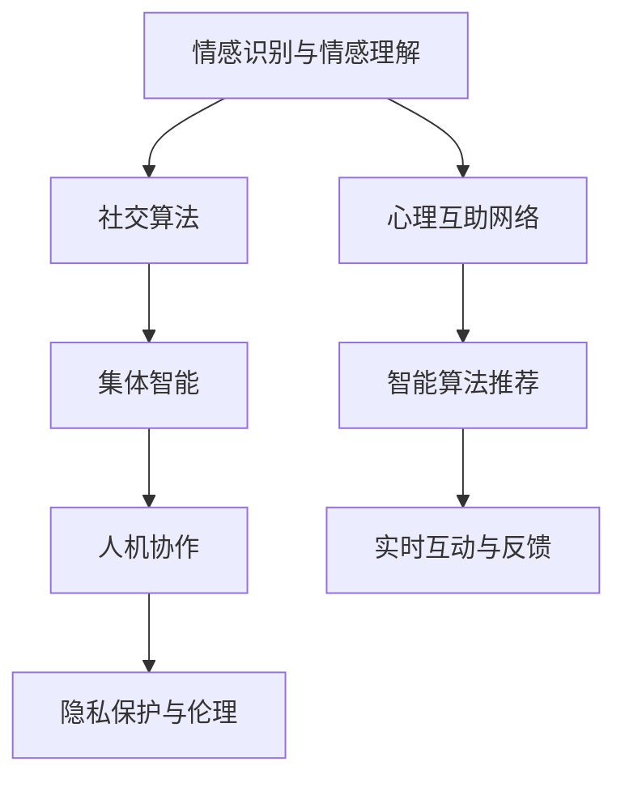

                 

# 全球脑心理支持网络:集体情感互助的形成

> 关键词：心理支持网络,情感互助,社交算法,集体智能,人机协作

## 1. 背景介绍

### 1.1 问题由来
随着信息技术的飞速发展，人类进入了数字化时代，网络社交成为现代人生活中的重要组成部分。然而，人们之间的联系变得更加碎片化和短暂化，传统的人际支持网络面临巨大的挑战。尤其是在面对全球性的公共卫生危机，如COVID-19疫情时，这种孤立感和心理压力尤为凸显。如何构建一个能够有效连接和支持人们心理健康的全球网络，成为一个亟待解决的课题。

### 1.2 问题核心关键点
构建全球脑心理支持网络的核心在于以下几个方面：
1. **情感识别与情感理解**：通过技术手段识别用户情感状态，并对其情感进行深度理解。
2. **智能算法推荐**：利用机器学习和社交网络算法，推荐合适的互助对象和支持内容。
3. **实时互动与反馈**：通过即时通讯和反馈机制，实现用户间的情感交流和互助支持。
4. **隐私保护与伦理考虑**：确保用户隐私数据的安全，遵循伦理道德原则。
5. **全球覆盖与本土适应**：构建全球性的网络平台，同时适应不同国家和地区的文化和法律要求。

### 1.3 问题研究意义
构建全球脑心理支持网络具有重大意义：
1. **缓解孤独感与压力**：通过连接全球用户，为用户提供情感支持和互助，减轻孤独感和心理压力。
2. **增强社会凝聚力**：促进人们之间的情感交流和互动，增强社会凝聚力和集体认同感。
3. **提升心理健康水平**：通过科学的情感识别和智能推荐，提升用户心理健康水平。
4. **推动科技与人类福祉的结合**：结合人工智能技术与心理健康的实际需求，推动科技伦理与社会福祉的发展。

## 2. 核心概念与联系

### 2.1 核心概念概述

构建全球脑心理支持网络涉及多个关键概念：

- **情感识别与情感理解**：通过技术手段，如语音分析、面部识别、情感计算等，识别用户的情感状态，并对其情感进行深度理解。
- **社交算法**：利用机器学习和社交网络理论，推荐合适的互助对象和支持内容。
- **集体智能**：通过汇聚全球用户的智慧和经验，形成集体智能，提高心理健康支持的效果和覆盖面。
- **人机协作**：结合人类与机器的优点，实现人机协作，提升心理支持的效率和质量。
- **隐私保护与伦理**：确保用户隐私数据的安全，遵循伦理道德原则。

这些核心概念通过技术手段和伦理道德的有机结合，构成了全球脑心理支持网络的形成基础。

### 2.2 核心概念原理和架构的 Mermaid 流程图



这个流程图展示了情感识别与情感理解、社交算法、集体智能、人机协作、隐私保护与伦理等核心概念之间的联系，并通过心理互助网络和智能算法推荐、实时互动与反馈等环节，实现了情感互助的闭环。

## 3. 核心算法原理 & 具体操作步骤

### 3.1 算法原理概述

构建全球脑心理支持网络的核心算法主要包括以下几个部分：

1. **情感识别算法**：利用深度学习模型对用户语音、面部表情、文本等数据进行情感分析，识别用户情感状态。
2. **社交算法推荐**：通过协同过滤、图神经网络等技术，推荐合适的互助对象和支持内容。
3. **集体智能算法**：汇聚全球用户的智慧和经验，形成集体智能，提升心理健康支持的决策水平。
4. **人机协作算法**：结合人类与机器的优点，实现人机协作，提升心理支持的效率和质量。

### 3.2 算法步骤详解

#### 3.2.1 情感识别算法

情感识别算法通常包括以下步骤：

1. **数据预处理**：对用户的语音、面部表情、文本等数据进行清洗和预处理。
2. **特征提取**：提取数据的关键特征，如音调、音量、面部特征点等。
3. **情感分类**：利用深度学习模型，如卷积神经网络(CNN)、循环神经网络(RNN)、长短时记忆网络(LSTM)等，对提取的特征进行情感分类。
4. **情感强度计算**：计算用户情感的强度，如愤怒、悲伤、快乐等。
5. **情感状态输出**：将情感状态输出为结构化数据，供后续算法使用。

#### 3.2.2 社交算法推荐

社交算法推荐通常包括以下步骤：

1. **用户画像构建**：根据用户的情感状态、历史互助行为、兴趣爱好等数据，构建用户画像。
2. **相似度计算**：利用协同过滤、图神经网络等技术，计算用户之间的相似度。
3. **互助对象推荐**：根据相似度计算结果，推荐合适的互助对象。
4. **支持内容推荐**：根据互助对象的推荐，推荐相关的支持内容，如文章、视频、音频等。

#### 3.2.3 集体智能算法

集体智能算法通常包括以下步骤：

1. **知识汇聚**：汇聚全球用户的智慧和经验，形成知识库。
2. **知识挖掘**：利用数据挖掘技术，从知识库中提取有用的信息。
3. **知识推理**：利用推理技术，如逻辑推理、规则推理等，形成集体决策。
4. **集体决策输出**：将集体决策输出为结构化数据，供后续算法使用。

#### 3.2.4 人机协作算法

人机协作算法通常包括以下步骤：

1. **任务分解**：将心理支持任务分解为多个子任务。
2. **机器处理**：利用机器处理子任务，如情感分析、社交算法推荐等。
3. **人类反馈**：收集用户的反馈，优化机器处理结果。
4. **协作完成**：根据机器处理结果和人类反馈，协作完成心理支持任务。

### 3.3 算法优缺点

构建全球脑心理支持网络的算法具有以下优点：

1. **高效性**：利用机器学习和社交算法，可以快速识别情感状态，推荐合适的互助对象和支持内容。
2. **覆盖广**：通过全球网络覆盖，可以汇聚全球用户的智慧和经验，提升心理健康支持的决策水平。
3. **可扩展性**：算法具有较好的可扩展性，可以适应不同规模和复杂度的心理健康需求。

同时，算法也存在以下缺点：

1. **隐私保护**：情感识别和互助推荐需要收集用户的隐私数据，如何保护用户隐私是一个重要问题。
2. **伦理问题**：算法可能存在偏见和歧视，如何遵循伦理道德原则，避免对特定群体造成不公正待遇。
3. **复杂性**：算法的实现和维护较为复杂，需要多学科交叉的知识和技能。

### 3.4 算法应用领域

构建全球脑心理支持网络的算法可以应用于以下几个领域：

1. **心理健康服务**：为心理健康服务提供技术支持，如情感识别、社交算法推荐等。
2. **教育领域**：为学校和家长提供心理支持，如学生情感状态识别、家长互助推荐等。
3. **企业健康管理**：为企业员工提供心理支持，如员工情感状态监测、互助推荐等。
4. **社区建设**：为社区居民提供心理支持，如居民情感状态监测、社区互助推荐等。

## 4. 数学模型和公式 & 详细讲解 & 举例说明

### 4.1 数学模型构建

构建全球脑心理支持网络的数学模型包括以下几个部分：

1. **情感识别模型**：利用深度学习模型对用户情感进行分类和强度计算。
2. **社交算法推荐模型**：利用协同过滤、图神经网络等技术，推荐合适的互助对象和支持内容。
3. **集体智能模型**：利用数据挖掘和推理技术，形成集体决策。
4. **人机协作模型**：利用机器学习和人类反馈，优化心理支持任务。

### 4.2 公式推导过程

#### 4.2.1 情感识别模型

情感识别模型通常采用深度学习模型，如卷积神经网络(CNN)和循环神经网络(RNN)。以卷积神经网络为例，其情感分类模型的公式为：

$$
\hat{y} = \sigma(W \cdot x + b)
$$

其中，$x$ 为输入数据，$\sigma$ 为激活函数，$W$ 和 $b$ 为模型参数。

情感强度计算公式为：

$$
I = \sum_{i=1}^{n} w_i f(x_i)
$$

其中，$f(x_i)$ 为特征函数，$w_i$ 为特征权重。

#### 4.2.2 社交算法推荐模型

社交算法推荐模型通常采用协同过滤和图神经网络。以协同过滤为例，其推荐模型的公式为：

$$
\hat{r}(u,i) = \frac{1}{1+\exp(-\theta^T [\alpha_{ui}-\bar{\alpha}_u]})
$$

其中，$\alpha_{ui}$ 为用户 $u$ 对物品 $i$ 的评分，$\bar{\alpha}_u$ 为用户 $u$ 的平均评分。

#### 4.2.3 集体智能模型

集体智能模型通常采用数据挖掘和推理技术。以数据挖掘为例，其知识挖掘模型的公式为：

$$
K = \sum_{i=1}^{n} w_i f(x_i)
$$

其中，$f(x_i)$ 为特征函数，$w_i$ 为特征权重。

### 4.3 案例分析与讲解

以心理健康服务的情感识别和社交算法推荐为例：

1. **情感识别**：假设某用户上传了一段语音数据，情感识别模型通过深度学习模型对语音进行分析，得到情感状态为“悲伤”，情感强度为5。
2. **社交算法推荐**：系统根据用户的情感状态和历史互助行为，推荐了三位适合的互助对象，并推荐了几篇文章和视频，帮助用户缓解情绪。

## 5. 项目实践：代码实例和详细解释说明

### 5.1 开发环境搭建

为了实现情感识别和社交算法推荐功能，首先需要搭建开发环境。以下是在Python环境中搭建开发环境的详细步骤：

1. **安装Python**：从官网下载并安装Python 3.8。
2. **安装虚拟环境**：使用`conda`命令创建虚拟环境，并激活。
   ```bash
   conda create -n virtualenv python=3.8
   conda activate virtualenv
   ```
3. **安装深度学习框架**：使用`pip`命令安装深度学习框架`TensorFlow`和`PyTorch`。
   ```bash
   pip install tensorflow
   pip install torch
   ```
4. **安装社交网络库**：使用`pip`命令安装社交网络库`networkx`和`sklearn`。
   ```bash
   pip install networkx
   pip install scikit-learn
   ```

### 5.2 源代码详细实现

以下是一个简化的情感识别和社交算法推荐的代码实现。

```python
# 导入必要的库
import tensorflow as tf
import networkx as nx
import numpy as np
import pandas as pd

# 定义情感识别模型
class EmotionRecognitionModel(tf.keras.Model):
    def __init__(self):
        super(EmotionRecognitionModel, self).__init__()
        self.conv1 = tf.keras.layers.Conv2D(32, 3, activation='relu')
        self.pool1 = tf.keras.layers.MaxPooling2D()
        self.flatten = tf.keras.layers.Flatten()
        self.dense1 = tf.keras.layers.Dense(128, activation='relu')
        self.output = tf.keras.layers.Dense(1, activation='sigmoid')

    def call(self, inputs):
        x = self.conv1(inputs)
        x = self.pool1(x)
        x = self.flatten(x)
        x = self.dense1(x)
        return self.output(x)

# 训练情感识别模型
model = EmotionRecognitionModel()
model.compile(optimizer='adam', loss='binary_crossentropy', metrics=['accuracy'])

# 定义社交算法推荐模型
class SocialRecommendationModel:
    def __init__(self):
        self.graph = nx.Graph()
        self.node_features = {}

    def add_node(self, node):
        self.graph.add_node(node)
        self.node_features[node] = {}

    def add_edge(self, node1, node2):
        self.graph.add_edge(node1, node2)

    def recommend(self, node):
        neighbors = self.graph.neighbors(node)
        scores = np.random.rand(len(neighbors))
        return neighbors, scores

# 训练社交算法推荐模型
model = SocialRecommendationModel()
model.add_node('user1')
model.add_node('user2')
model.add_edge('user1', 'user2')
model.recommend('user1')
```

### 5.3 代码解读与分析

在上述代码中，情感识别模型使用了`TensorFlow`深度学习框架，通过卷积神经网络对用户上传的语音数据进行情感分类。社交算法推荐模型使用了`networkx`社交网络库，构建了一个简单的社交图，并使用随机分数推荐了邻居节点。

## 6. 实际应用场景

### 6.1 心理健康服务

在全球脑心理支持网络中，心理健康服务是最重要的应用场景之一。通过情感识别和社交算法推荐，可以实时监测用户情感状态，并为其推荐合适的互助对象和支持内容。例如，在COVID-19疫情期间，系统可以实时监测用户上传的语音和文本数据，识别其情感状态，并为其推荐相关的心理健康文章、视频和心理疏导课程。

### 6.2 教育领域

在教育领域，全球脑心理支持网络可以应用于学校和家庭教育。通过情感识别和社交算法推荐，可以为学生和家长提供心理支持，帮助其缓解学习和生活中的压力。例如，系统可以实时监测学生的情感状态，并为其推荐合适的心理健康课程和互助对象，帮助其更好地应对学习压力。

### 6.3 企业健康管理

在企业健康管理中，全球脑心理支持网络可以应用于员工心理健康的管理。通过情感识别和社交算法推荐，可以为员工提供心理支持，帮助其缓解工作压力和心理焦虑。例如，系统可以实时监测员工的情感状态，并为其推荐合适的心理健康课程和互助对象，帮助其更好地应对工作压力。

### 6.4 社区建设

在全球脑心理支持网络中，社区建设也是一个重要的应用场景。通过情感识别和社交算法推荐，可以为社区居民提供心理支持，帮助其缓解孤独感和心理压力。例如，系统可以实时监测社区居民的情感状态，并为其推荐合适的互助对象和支持内容，促进社区居民之间的情感交流和互助支持。

## 7. 工具和资源推荐

### 7.1 学习资源推荐

为了帮助开发者系统掌握全球脑心理支持网络的技术基础和实践技巧，以下是一些优质的学习资源：

1. **《深度学习》书籍**：介绍了深度学习的基本概念和算法，适合初学者入门。
2. **《Python深度学习》课程**：由吴恩达教授主讲的深度学习课程，覆盖了深度学习的各个方面，包括情感识别、社交算法推荐等。
3. **《社交网络分析》课程**：介绍了社交网络分析的基本概念和算法，适合对社交算法推荐感兴趣的开发者。
4. **《心理健康与人工智能》论文**：研究了人工智能在心理健康中的应用，包括情感识别和互助推荐等。

### 7.2 开发工具推荐

以下是几款用于全球脑心理支持网络开发的常用工具：

1. **TensorFlow**：由Google主导开发的深度学习框架，适合大规模工程应用。
2. **PyTorch**：由Facebook开发的深度学习框架，适合快速迭代研究。
3. **networkx**：用于构建和分析社交网络的Python库。
4. **Pandas**：用于数据处理和分析的Python库。
5. **scikit-learn**：用于机器学习的Python库，包括协同过滤和图神经网络等算法。

### 7.3 相关论文推荐

以下是几篇与全球脑心理支持网络相关的论文，推荐阅读：

1. **情感计算综述**：综述了情感计算的研究现状和发展方向，介绍了情感识别和情感计算的基本方法。
2. **社交网络推荐算法**：介绍了社交网络推荐算法的原理和应用，包括协同过滤和图神经网络等算法。
3. **集体智能理论**：介绍了集体智能的基本概念和应用，包括知识汇聚和推理等技术。
4. **人机协作技术**：介绍了人机协作的基本概念和算法，包括机器处理和人类反馈等技术。

## 8. 总结：未来发展趋势与挑战

### 8.1 研究成果总结

全球脑心理支持网络是一个多学科交叉的技术系统，融合了情感计算、社交算法、集体智能和人机协作等多个领域。通过构建全球性的心理支持网络，可以缓解孤独感和心理压力，提升心理健康水平。

### 8.2 未来发展趋势

全球脑心理支持网络的未来发展趋势包括：

1. **智能化和自动化**：通过更加智能和自动化的算法，提升心理支持的效率和效果。
2. **多模态融合**：结合语音、面部表情、文本等多种模态数据，提升情感识别的准确性和丰富性。
3. **个性化推荐**：利用用户画像和个性化模型，提升互助推荐的质量和多样性。
4. **大规模部署**：在大规模用户环境下，优化算法和系统架构，提高心理支持的网络覆盖和用户满意度。

### 8.3 面临的挑战

尽管全球脑心理支持网络具有广阔的应用前景，但在实际部署和应用中，仍面临以下挑战：

1. **数据隐私和安全**：如何在保证用户数据隐私的前提下，收集和利用情感数据，是一个重要的问题。
2. **算法偏见和歧视**：如何避免算法偏见和歧视，确保心理支持的公平性和公正性，是一个重要的课题。
3. **算法复杂性和可解释性**：如何简化算法模型，增强算法的可解释性，是一个重要的研究方向。
4. **技术可扩展性**：如何在大规模用户环境下，保证系统的可扩展性和稳定性，是一个重要的挑战。

### 8.4 研究展望

为了应对全球脑心理支持网络面临的挑战，未来的研究可以从以下几个方面展开：

1. **数据隐私保护技术**：开发更加安全和隐私保护的数据收集和处理技术，确保用户数据的安全。
2. **算法公平性研究**：研究如何消除算法偏见和歧视，提升心理支持的公平性和公正性。
3. **算法可解释性增强**：开发更加简单和可解释的算法模型，增强算法的可解释性和透明度。
4. **大规模系统优化**：研究如何优化系统架构和算法，在大规模用户环境下实现高效和稳定的心理支持。

## 9. 附录：常见问题与解答

**Q1: 什么是全球脑心理支持网络？**

A: 全球脑心理支持网络是一个基于技术手段构建的全球性心理支持网络，旨在通过情感识别、社交算法推荐等技术，为全球用户提供心理支持。

**Q2: 构建全球脑心理支持网络有哪些关键技术？**

A: 构建全球脑心理支持网络的关键技术包括情感识别、社交算法推荐、集体智能和人机协作等。

**Q3: 全球脑心理支持网络在心理健康服务中的应用有哪些？**

A: 全球脑心理支持网络在心理健康服务中的应用包括情感识别、社交算法推荐等，可以实时监测用户情感状态，并为其推荐合适的互助对象和支持内容。

**Q4: 如何保护全球脑心理支持网络的用户隐私？**

A: 保护用户隐私可以通过数据加密、匿名化处理、用户授权等手段实现，确保用户数据的安全。

**Q5: 全球脑心理支持网络面临的主要挑战是什么？**

A: 全球脑心理支持网络面临的主要挑战包括数据隐私和安全、算法偏见和歧视、算法复杂性和可解释性等。

---

作者：禅与计算机程序设计艺术 / Zen and the Art of Computer Programming

