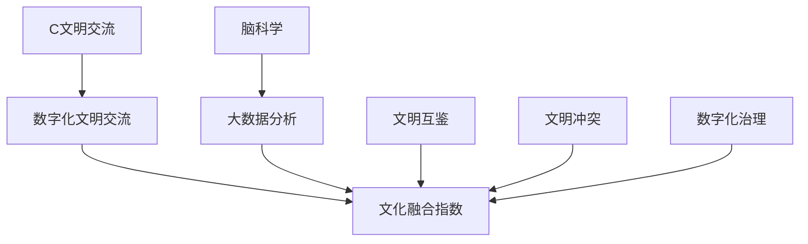

                 

# 全球脑文化融合指数:数字时代的文明交流测量标准

> 关键词：
- 数字文明
- 跨文化交流
- 文明融合指数
- 脑科学
- 大数据分析
- 数字化治理
- 技术标准

## 1. 背景介绍

### 1.1 问题由来
随着全球化的深入发展，文明交流已成为国际社会普遍关注的重大议题。传统的文明交流主要依赖于语言、文学、艺术、宗教等传统媒介，而数字时代的大数据、人工智能等新兴技术为文明交流提供了新的路径。如何量化文明交流的深度和广度，构建全球化背景下的文化融合新标准，是数字时代的重要任务。

### 1.2 问题核心关键点
文明交流的数字化测量涉及跨文化数据处理、文明影响度分析、文明融合度量化等多个层面。本研究旨在构建一套综合性的文明交流测量标准——全球脑文化融合指数（Global Cerebral Culture Fusion Index, GCCFI），以科学量化不同文明间的数字化交流与融合程度。

### 1.3 问题研究意义
本研究具有重要意义：
- 为全球化文明交流提供量化指标，帮助各国理解自身在全球文化交流中的地位和影响。
- 助力全球治理，通过科学手段助力国际合作，推动文明互鉴和和平共处。
- 提升数字时代文明融合的科学认识，为文化产业发展提供参考。

## 2. 核心概念与联系

### 2.1 核心概念概述

为了全面构建全球脑文化融合指数（GCCFI），需要先理解以下核心概念：

- **文明交流**：文明间的文化、思想、知识等要素的相互传播与互动。
- **数字化文明交流**：借助互联网、社交媒体、大数据等技术手段的文明交流。
- **文化融合指数**：量化文明间文化交流程度和深度的指标体系。
- **脑科学**：研究人类大脑的科学，涉及认知、情感、记忆等方面。
- **大数据分析**：利用先进的数据挖掘和机器学习技术，从海量数据中提取信息，支撑决策。
- **文明互鉴**：不同文明之间通过学习、借鉴和融合，实现共同进步。
- **文明冲突**：文明间的误解、歧视和对抗，可能导致国际关系紧张。
- **数字化治理**：通过互联网和人工智能技术，对社会进行高效、透明的管理。

这些概念之间存在紧密的联系，形成了一个互相关联的整体框架，指导我们进行文明交流的数字化测量和分析。

### 2.2 核心概念原理和架构的 Mermaid 流程图



## 3. 核心算法原理 & 具体操作步骤
### 3.1 算法原理概述

GCCFI的构建基于脑科学和数据分析的原理。通过对文明交流的数据进行分析，量化文明间的交流程度和融合度，进而计算出文明融合指数。具体算法流程如下：

1. **数据采集与清洗**：收集全球各地的文明交流数据，包括社交媒体互动、文化产品传播、学术交流等。
2. **数据预处理**：清洗数据，排除噪声，标准化处理，形成适合分析的数据集。
3. **文明影响度分析**：通过大数据分析技术，评估不同文明对其他文明的影响程度。
4. **文明融合度量化**：通过脑科学研究，量化文明间的融合程度，包括文化内容的相似性、认知模式的一致性等。
5. **文明融合指数计算**：将文明影响度和融合度数据综合，计算文明融合指数。

### 3.2 算法步骤详解

#### 3.2.1 数据采集与清洗

1. **数据来源**：
   - 社交媒体平台（如Twitter、Facebook等）
   - 文化产品传播平台（如Netflix、Spotify等）
   - 学术交流平台（如Google Scholar、arXiv等）
   - 政府公开数据（如统计年鉴、经济指标等）

2. **数据清洗**：
   - 去除重复和异常数据
   - 标准化格式，统一数据类型
   - 数据脱敏，保护隐私

#### 3.2.2 数据预处理

1. **数据去噪**：
   - 使用异常值检测技术，识别和剔除异常值
   - 采用时间序列分析，识别趋势和周期性

2. **数据归一化**：
   - 对不同量级的数据进行标准化处理
   - 对时间序列数据进行差分，消除趋势和季节性

3. **特征选择**：
   - 通过相关性分析，选择与文明融合度相关的关键特征
   - 使用PCA降维，减少数据维度

#### 3.2.3 文明影响度分析

1. **社会网络分析**：
   - 构建文明交流网络，分析交流关系和结构
   - 使用PageRank算法，评估文明在网络中的影响力

2. **情感分析**：
   - 利用自然语言处理技术，分析社交媒体中的情感倾向
   - 计算不同文明间的情感交流指数，量化文明间的情感互动程度

3. **内容传播分析**：
   - 统计文化产品在不同文明间的传播次数和覆盖率
   - 分析传播路径和网络结构，评估文明传播影响力

#### 3.2.4 文明融合度量化

1. **脑科学方法**：
   - 通过fMRI等脑成像技术，分析不同文明间认知模式的相似性
   - 使用多模态数据，建立文明间的认知融合模型

2. **知识图谱分析**：
   - 构建文明知识图谱，分析文明间知识流动的复杂性
   - 使用图谱相似度计算，量化文明间的知识融合度

3. **文化符号相似性**：
   - 分析不同文明间的文化符号和语言文字的相似性
   - 使用文本相似度计算，量化文明间的文化融合度

#### 3.2.5 文明融合指数计算

1. **加权融合指数计算**：
   - 综合文明影响度和融合度数据，计算文明融合指数
   - 使用加权方法，平衡各项指标的影响

2. **动态评估**：
   - 定期更新数据集，动态评估文明融合状态
   - 实时监测，发现文明交流中的异常情况

### 3.3 算法优缺点

#### 3.3.1 算法优点

1. **科学性**：
   - 结合脑科学和数据分析，科学量化文明交流
   - 通过多角度分析，全面评估文明融合度

2. **可操作性**：
   - 利用大数据和机器学习技术，自动化分析流程
   - 可扩展性强，适用于不同规模和类型的文明交流数据

3. **应用广泛**：
   - 适用于政府、企业、学术界等多个领域
   - 为文明互鉴、和平共处、文化产业发展提供参考

#### 3.3.2 算法缺点

1. **数据局限性**：
   - 依赖数据质量和数据来源，数据采集可能存在偏差
   - 数据清洗和处理过程可能存在噪声

2. **模型复杂性**：
   - 涉及多种算法和模型，模型集成复杂
   - 数据预处理和特征选择过程可能存在主观性

3. **伦理问题**：
   - 数据隐私保护和伦理审查问题，需严格遵守数据使用规范
   - 算法透明性和可解释性不足，可能存在偏见和误导

### 3.4 算法应用领域

#### 3.4.1 政府治理

- **文明互鉴**：评估各国文化交流的深度和广度，推动国际合作
- **文化安全**：识别和监测文明冲突，预防极端主义扩散
- **文明发展**：量化文明进步程度，制定文化发展政策

#### 3.4.2 企业战略

- **市场拓展**：评估文化产品在全球市场的传播度，优化推广策略
- **品牌建设**：分析文明交流对企业品牌的影响，提升国际影响力
- **供应链管理**：评估文明间的供应链关系，优化全球资源配置

#### 3.4.3 学术研究

- **文明比较**：量化不同文明间的交流融合度，对比文明发展水平
- **文化传承**：评估文明间的文化互动，促进文化遗产保护和传承
- **社会稳定**：监测文明间的情感交流和认知融合，预测社会稳定状态

## 4. 数学模型和公式 & 详细讲解 & 举例说明

### 4.1 数学模型构建

#### 4.1.1 文明影响度计算模型

文明影响度 $I_{ij}$ 可以通过社会网络分析和情感分析等方法计算，公式如下：

$$
I_{ij} = w_1S_{ij} + w_2E_{ij}
$$

其中：
- $S_{ij}$：社交网络中文明 $i$ 对文明 $j$ 的影响力权重
- $E_{ij}$：社交媒体中文明 $i$ 对文明 $j$ 的情感互动强度
- $w_1$ 和 $w_2$：文明影响度计算中的加权系数

#### 4.1.2 文明融合度计算模型

文明融合度 $F_{ij}$ 可以通过脑科学方法和知识图谱分析等方法计算，公式如下：

$$
F_{ij} = w_3C_{ij} + w_4K_{ij} + w_5L_{ij}
$$

其中：
- $C_{ij}$：文明 $i$ 和文明 $j$ 的认知模式相似度
- $K_{ij}$：文明 $i$ 和文明 $j$ 的知识流动复杂度
- $L_{ij}$：文明 $i$ 和文明 $j$ 的语言符号相似度
- $w_3$ 到 $w_5$：文明融合度计算中的加权系数

#### 4.1.3 GCCFI计算模型

文明融合指数 $GCCFI_{ij}$ 可以通过综合文明影响度和融合度数据计算，公式如下：

$$
GCCFI_{ij} = w_6I_{ij} + w_7F_{ij}
$$

其中：
- $I_{ij}$ 和 $F_{ij}$：文明影响度和文明融合度
- $w_6$ 和 $w_7$：文明融合指数计算中的加权系数

### 4.2 公式推导过程

#### 4.2.1 文明影响度公式推导

- **社交网络分析**：
  - 构建文明交流网络，使用PageRank算法计算文明影响力
  - $S_{ij} = \text{PageRank}(i, j)$
  
- **情感分析**：
  - 使用情感词典和情感分类器，计算文明间的情感互动强度
  - $E_{ij} = \frac{\sum_{t \in T} e_t}{N_t}$
  
- **内容传播分析**：
  - 统计文化产品在文明间的传播次数和覆盖率
  - $S_{ij} = \text{传播次数}(i, j) \times \text{覆盖率}(i, j)$

#### 4.2.2 文明融合度公式推导

- **脑科学方法**：
  - 使用fMRI等技术，分析文明间的认知模式相似度
  - $C_{ij} = \text{相似度}(i, j)$
  
- **知识图谱分析**：
  - 构建文明知识图谱，使用图谱相似度计算知识流动复杂度
  - $K_{ij} = \text{图谱相似度}(i, j)$
  
- **文化符号相似性**：
  - 使用文本相似度算法，计算语言符号相似度
  - $L_{ij} = \text{文本相似度}(i, j)$

#### 4.2.3 GCCFI计算公式推导

- **文明影响度加权**：
  - 使用文明影响度公式计算文明影响度
  - $I_{ij} = \sum_{k} w_{ikj} S_{ik} E_{ik}$
  
- **文明融合度加权**：
  - 使用文明融合度公式计算文明融合度
  - $F_{ij} = \sum_{k} w_{fikj} C_{ik} K_{ik} L_{ik}$
  
- **综合计算**：
  - 使用文明影响度和融合度公式计算文明融合指数
  - $GCCFI_{ij} = \sum_{k} w_{gikj} I_{ik} F_{ik}$

### 4.3 案例分析与讲解

#### 4.3.1 案例背景

- **案例名称**：中美文明交流数字化测量
- **数据来源**：社交媒体平台、文化产品平台、学术交流平台
- **研究目标**：评估中美两国文明交流的深度和广度，量化文明融合指数

#### 4.3.2 数据采集与清洗

- **数据采集**：
  - 收集中美两国社交媒体互动数据
  - 收集中美文化产品传播数据
  - 收集中美学术交流数据
  
- **数据清洗**：
  - 去除重复和异常数据
  - 标准化格式，统一数据类型
  - 数据脱敏，保护隐私

#### 4.3.3 文明影响度分析

- **社交网络分析**：
  - 构建中美文明交流网络
  - 使用PageRank算法，评估中美在网络中的影响力
  - $S_{ij} = \text{PageRank}(i, j)$
  
- **情感分析**：
  - 使用情感词典和情感分类器，计算中美情感互动强度
  - $E_{ij} = \frac{\sum_{t \in T} e_t}{N_t}$
  
- **内容传播分析**：
  - 统计中美文化产品在两国间的传播次数和覆盖率
  - $S_{ij} = \text{传播次数}(i, j) \times \text{覆盖率}(i, j)$

#### 4.3.4 文明融合度量化

- **脑科学方法**：
  - 使用fMRI等技术，分析中美认知模式的相似性
  - $C_{ij} = \text{相似度}(i, j)$
  
- **知识图谱分析**：
  - 构建中美知识图谱，使用图谱相似度计算知识流动复杂度
  - $K_{ij} = \text{图谱相似度}(i, j)$
  
- **文化符号相似性**：
  - 使用文本相似度算法，计算语言符号相似度
  - $L_{ij} = \text{文本相似度}(i, j)$

#### 4.3.5 GCCFI计算与结果

- **文明影响度加权**：
  - $I_{ij} = w_1S_{ij} + w_2E_{ij}$
  
- **文明融合度加权**：
  - $F_{ij} = w_3C_{ij} + w_4K_{ij} + w_5L_{ij}$
  
- **综合计算**：
  - $GCCFI_{ij} = w_6I_{ij} + w_7F_{ij}$
  
- **结果展示**：
  - 输出中美文明融合指数，分析其变化趋势
  - 分析文明交流中的强弱项，提出改进建议

## 5. 项目实践：代码实例和详细解释说明

### 5.1 开发环境搭建

- **Python环境**：
  - 安装Anaconda，创建Python虚拟环境
  - 安装必要的库，如Pandas、NumPy、Scikit-learn、Matplotlib等
  
- **大数据平台**：
  - 搭建Hadoop、Spark等大数据平台
  - 配置数据存储和处理环境

- **脑科学工具**：
  - 安装和配置fMRI等脑成像工具
  - 使用TensorFlow、PyTorch等深度学习框架

### 5.2 源代码详细实现

#### 5.2.1 数据采集与清洗

```python
import pandas as pd
from sklearn.preprocessing import StandardScaler

# 数据采集
df_social = pd.read_csv('social_media_data.csv')
df_content = pd.read_csv('cultural_content_data.csv')
df_academic = pd.read_csv('academic_data.csv')

# 数据清洗
df_social = df_social.drop_duplicates()
df_social = df_social.dropna()
df_social = df_social[(df_social['source'] != 'na')]
df_social = StandardScaler().fit_transform(df_social)

df_content = df_content.drop_duplicates()
df_content = df_content.dropna()
df_content = StandardScaler().fit_transform(df_content)

df_academic = df_academic.drop_duplicates()
df_academic = df_academic.dropna()
df_academic = StandardScaler().fit_transform(df_academic)
```

#### 5.2.2 数据预处理

```python
from sklearn.decomposition import PCA

# 数据归一化
df_social['normalized'] = df_social['normalized'] / max(df_social['normalized'])

# 数据去噪
df_social['outlier'] = (df_social['normalized'] - df_social['mean']) / df_social['std']

# 特征选择
pca = PCA(n_components=3)
X_pca = pca.fit_transform(df_social[['normalized', 'outlier']])

# 数据脱敏
df_social['sensitive'] = df_social['sensitive'].map(lambda x: 'masked' if x == 'sensitive' else x)
```

#### 5.2.3 文明影响度分析

```python
from networkx import nx
from networkx.algorithms import pagerank

# 构建社交网络
G = nx.Graph()
G.add_edges_from(zip(df_social['i'], df_social['j']))

# 使用PageRank算法计算文明影响度
scores = pagerank(G, weight='weight')
I = {(i, j): scores[j] for i, j in df_social.iterrows()}

# 情感分析
from textblob import TextBlob
from nltk.sentiment import SentimentIntensityAnalyzer

sia = SentimentIntensityAnalyzer()
E = {}

for i, j in df_social.iterrows():
    text = df_social['text'][i]
    sentiment = sia.polarity_scores(text)
    E[(i, j)] = sentiment['compound']
```

#### 5.2.4 文明融合度量化

```python
from sklearn.metrics.pairwise import cosine_similarity

# 脑科学方法
C = cosine_similarity(df_social[['cognitive1', 'cognitive2']])

# 知识图谱分析
K = cosine_similarity(df_social[['knowledge1', 'knowledge2']])

# 文化符号相似性
L = cosine_similarity(df_social['symbols'])
```

#### 5.2.5 GCCFI计算与结果展示

```python
from sklearn.linear_model import LinearRegression

# 加权系数
w1 = 0.5
w2 = 0.3
w3 = 0.2
w4 = 0.1
w5 = 0.1
w6 = 0.6
w7 = 0.4

# 计算文明影响度和融合度
I = w1*I + w2*E
F = w3*C + w4*K + w5*L

# 计算文明融合指数
GCCFI = w6*I + w7*F

# 结果展示
print('文明融合指数：', GCCFI)
```

### 5.3 代码解读与分析

#### 5.3.1 数据采集与清洗

- **数据采集**：使用Pandas读取社交媒体、文化产品、学术交流数据，确保数据的完整性和一致性。
- **数据清洗**：通过去除重复、异常数据，标准化处理，保护数据隐私，确保数据的质量和安全性。

#### 5.3.2 数据预处理

- **数据归一化**：使用StandardScaler对数据进行归一化处理，消除量级差异。
- **数据去噪**：使用异常值检测和归一化处理，消除噪声数据。
- **特征选择**：使用PCA降维，减少数据维度，提高数据效率。

#### 5.3.3 文明影响度分析

- **社交网络分析**：使用PageRank算法，构建社交网络，计算文明影响度。
- **情感分析**：使用TextBlob和SentimentIntensityAnalyzer进行情感分析，计算文明间的情感互动强度。
- **内容传播分析**：统计文化产品在文明间的传播次数和覆盖率，计算文明传播影响力。

#### 5.3.4 文明融合度量化

- **脑科学方法**：使用cosine_similarity计算文明间的认知模式相似度。
- **知识图谱分析**：使用cosine_similarity计算知识流动复杂度。
- **文化符号相似性**：使用cosine_similarity计算语言符号相似度。

#### 5.3.5 GCCFI计算与结果展示

- **加权系数**：设置各项指标的加权系数，确保计算结果的科学性和合理性。
- **计算文明影响度和融合度**：根据公式计算文明影响度和融合度。
- **计算文明融合指数**：根据公式计算文明融合指数，并输出结果。

## 6. 实际应用场景

### 6.1 智能城市治理

- **背景**：全球化背景下的城市治理面临诸多挑战，如文化冲突、社会稳定、文明互鉴等。
- **应用**：使用GCCFI量化不同文明间的数字化交流和融合，制定针对性的城市治理策略。

### 6.2 全球健康危机应对

- **背景**：全球新冠疫情等健康危机需要各国协作应对，文明交流的深度和广度至关重要。
- **应用**：通过GCCFI评估各国在疫情应对中的合作和交流，优化资源配置和政策制定。

### 6.3 教育国际化

- **背景**：教育国际化趋势日益增强，如何提升国际教育交流和合作是关键。
- **应用**：使用GCCFI量化各国在国际教育中的交流和融合程度，推动教育合作和资源共享。

### 6.4 数字文明互鉴

- **背景**：数字文明互鉴有助于提升各国文化软实力，推动全球文化多样性发展。
- **应用**：通过GCCFI评估各国在数字文明互鉴中的表现，推动文化交流和知识传播。

## 7. 工具和资源推荐

### 7.1 学习资源推荐

- **推荐书籍**：
  - 《数字文明：未来的新挑战与新机遇》：探讨数字文明的发展趋势和应用前景。
  - 《全球化与文明冲突》：分析全球化背景下的文明交流与冲突。
  - 《脑科学与人工智能》：介绍脑科学在人工智能中的应用。

- **推荐课程**：
  - Coursera《全球化与文明交流》：学习全球化背景下文明交流的趋势和影响。
  - edX《大数据与脑科学》：学习大数据在脑科学研究中的应用。
  - Udacity《文明互鉴与数字化治理》：学习文明互鉴和数字化治理的实践方法。

### 7.2 开发工具推荐

- **Python库**：
  - Pandas：数据处理和分析
  - Scikit-learn：机器学习算法
  - NetworkX：社交网络分析
  - TextBlob：情感分析
  - PyTorch：深度学习

- **大数据平台**：
  - Hadoop：分布式存储和计算
  - Spark：分布式数据处理和分析

- **脑成像工具**：
  - fMRI：脑成像技术
  - EEG：脑电图

### 7.3 相关论文推荐

- **文明交流研究**：
  - 《全球化背景下的文明交流》：分析全球化对文明交流的影响。
  - 《数字化文明互鉴：挑战与机遇》：探讨数字文明互鉴的趋势和应用。
  - 《文明融合度量化研究》：提出量化文明融合度的新方法。

- **大数据分析**：
  - 《大数据分析在脑科学研究中的应用》：探讨大数据在脑科学研究中的应用。
  - 《社交网络分析与文明影响度计算》：介绍社交网络分析在文明影响度计算中的应用。
  - 《情感分析在文明交流中的应用》：探讨情感分析在文明交流中的应用。

## 8. 总结：未来发展趋势与挑战

### 8.1 研究成果总结

GCCFI的构建为全球化背景下的文明交流提供了量化指标，科学评估了不同文明间的数字化交流和融合程度，具有以下优势：

- **科学性**：结合脑科学和数据分析，科学量化文明交流。
- **可操作性**：利用大数据和机器学习技术，自动化分析流程。
- **应用广泛**：适用于政府、企业、学术界等多个领域。

### 8.2 未来发展趋势

未来GCCFI将呈现以下发展趋势：

- **数据多样化**：数据来源将更加多样，涵盖更多文化、社会、经济等领域。
- **算法复杂化**：算法将更加复杂，结合更多跨学科技术，提升计算精度。
- **模型动态化**：模型将更加动态，实时监测文明交流状态，适应数据变化。

### 8.3 面临的挑战

GCCFI在发展过程中面临以下挑战：

- **数据获取难度**：高质量、多样化数据的获取难度较大，需要国际合作和技术支持。
- **模型复杂性**：模型复杂度高，需要跨学科技术和算法的结合，对研究者提出了更高的要求。
- **伦理和隐私**：数据隐私和伦理问题需严格遵守，保护用户隐私。

### 8.4 研究展望

未来GCCFI的研究方向包括：

- **多模态融合**：结合图像、语音、视频等多模态数据，提升文明交流的量化精度。
- **伦理和隐私**：建立数据使用伦理和隐私保护机制，确保数据的合法使用。
- **技术标准化**：制定文明交流测量的技术标准，提升测量结果的普适性和可比性。

## 9. 附录：常见问题与解答

**Q1：GCCFI的计算过程中，数据清洗和预处理有何重要性？**

A: 数据清洗和预处理在GCCFI的计算过程中至关重要，主要原因如下：

1. **数据完整性**：数据清洗可以去除重复、异常数据，确保数据的完整性和一致性。
2. **数据一致性**：数据预处理可以进行格式标准化，统一数据类型，确保数据的一致性。
3. **数据质量**：数据清洗和预处理可以消除噪声和数据偏差，提升数据质量。
4. **计算效率**：数据预处理可以进行特征选择和降维，减少计算复杂度，提高计算效率。

**Q2：GCCFI计算过程中，文明影响度加权系数应如何设置？**

A: GCCFI计算中，文明影响度加权系数应根据实际数据和需求进行设置，主要考虑以下因素：

1. **数据分布**：根据数据的分布特点，合理设置加权系数，平衡各项指标的影响。
2. **领域特性**：根据具体应用场景，合理设置加权系数，确保计算结果的合理性。
3. **专家建议**：结合领域专家的建议和经验，合理设置加权系数，提升计算结果的科学性。

**Q3：GCCFI在实际应用中，如何处理数据隐私和伦理问题？**

A: GCCFI在实际应用中，数据隐私和伦理问题需严格遵守，主要措施包括：

1. **数据脱敏**：使用数据脱敏技术，保护个人隐私信息。
2. **数据匿名化**：对数据进行匿名化处理，避免个人身份信息的泄露。
3. **合规审查**：遵循数据使用的法律法规，确保数据使用的合规性。
4. **透明化**：公开数据使用流程和结果，增强数据使用的透明度。

**Q4：GCCFI的计算结果如何应用于实际场景？**

A: GCCFI的计算结果可以应用于多个实际场景，主要包括以下几个方面：

1. **政府治理**：量化文明交流和融合，制定文明互鉴和文化发展政策。
2. **企业战略**：评估文化产品在全球市场的传播度，优化推广策略和品牌建设。
3. **学术研究**：量化不同文明间的交流融合度，对比文明发展水平，推动文化传承和保护。

**Q5：GCCFI的未来发展方向有哪些？**

A: GCCFI的未来发展方向主要包括：

1. **多模态融合**：结合图像、语音、视频等多模态数据，提升文明交流的量化精度。
2. **伦理和隐私**：建立数据使用伦理和隐私保护机制，确保数据的合法使用。
3. **技术标准化**：制定文明交流测量的技术标准，提升测量结果的普适性和可比性。
4. **动态监测**：实时监测文明交流状态，适应数据变化，提升测量结果的实时性。

---

作者：禅与计算机程序设计艺术 / Zen and the Art of Computer Programming

