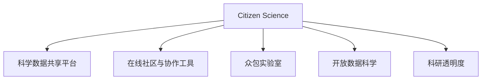

                 

# 公民科学：公众参与科学研究的新模式

## 1. 背景介绍

### 1.1 问题由来
在科学研究的传统模式中，科研活动主要集中在专业科学家之间，公众往往被排除在外。这种模式限制了科学发现的范围和速度，也阻碍了科学研究的社会价值最大化。现代科技的快速发展，特别是互联网和社交媒体的普及，为公众参与科学研究提供了新的可能性。公民科学（Citizen Science）应运而生，它鼓励普通民众参与到科学研究中来，共同探索未知的科学领域。

### 1.2 问题核心关键点
公民科学的核心在于将公众的力量引入到科学研究中，通过数据收集、实验设计、结果验证等多个环节的参与，扩展科学研究的边界。其关键点包括：
- **公众参与**：鼓励普通民众参与到科研活动中，贡献自己的知识和经验。
- **数据共享**：公众提供的实时数据是科研的重要信息来源。
- **透明度**：科研过程的公开透明，让公众理解并监督科研进展。
- **社区协作**：通过在线社区平台，实现科研人员与公众的互动交流。

### 1.3 问题研究意义
公民科学的研究意义主要体现在以下几个方面：
1. **加速科学发现**：公众的广泛参与可以加速科研进程，扩大科学研究的覆盖面。
2. **提升科学素养**：参与科研活动可以增强公众的科学意识和知识。
3. **促进社会协作**：公民科学加强了科研与社会大众的联系，促进了社会协作和创新。
4. **提升科学决策质量**：通过多方的视角和数据，科研决策更具代表性和公信力。
5. **推动可持续发展**：公民科学关注环境和生态保护，推动可持续发展目标的实现。

## 2. 核心概念与联系

### 2.1 核心概念概述

为了更好地理解公民科学，本节将介绍几个密切相关的核心概念：

- **公民科学（Citizen Science）**：一种鼓励公众参与科学研究的活动，旨在扩大科学研究的范围，提高科学研究的效率和科学素养。
- **科学数据共享平台**：一个集中管理科研数据的在线平台，便于公众和科研人员的数据获取与共享。
- **在线社区与协作工具**：利用网络平台（如论坛、社交媒体）实现科研人员与公众之间的互动交流，促进知识的共享和协作。
- **众包实验室**：利用开放实验室和众包平台，实现实验设计和数据收集的公众参与。
- **开放数据科学（Open Data Science）**：强调科研数据和算法的开放共享，鼓励科研创新和跨学科合作。
- **科研透明度**：科研活动的开放透明，确保公众能够理解、监督和参与科研过程。

这些核心概念之间的逻辑关系可以通过以下Mermaid流程图来展示：



这个流程图展示了一系列核心概念之间的逻辑关系：

1. 公民科学通过各种平台和技术手段，将公众引入到科研活动中。
2. 科学数据共享平台为公众和科研人员提供数据访问和共享的渠道。
3. 在线社区与协作工具促进了科研人员与公众之间的交流合作。
4. 众包实验室利用开放平台进行实验设计和数据收集。
5. 开放数据科学强调数据的开放共享，推动科研创新和跨学科合作。
6. 科研透明度确保了公众能够理解、监督和参与科研过程。

## 3. 核心算法原理 & 具体操作步骤

### 3.1 算法原理概述

公民科学的算法原理基于数据驱动的科研方法论，主要包括以下几个关键步骤：

1. **数据收集**：通过公众参与，收集大量的实时数据。
2. **数据清洗与分析**：对收集到的数据进行清洗和初步分析，剔除噪声和错误数据。
3. **模型训练与验证**：基于清洗后的数据，训练和验证科研模型。
4. **结果验证与反馈**：将模型结果返回给公众进行验证和反馈，进一步优化模型。
5. **社区协作与知识共享**：通过社区平台实现科研人员与公众之间的互动交流，共享知识和经验。

### 3.2 算法步骤详解

公民科学的算法步骤包括以下几个主要环节：

**Step 1: 建立数据收集平台**
- 选择合适的数据收集平台，如eBird、Galaxy Zoo等。
- 设计数据收集任务，明确科研目标和公众参与方式。

**Step 2: 推广与招募公众参与**
- 通过社交媒体、科学网站等渠道宣传项目，招募公众参与。
- 提供培训和指导，确保公众了解参与流程和数据收集标准。

**Step 3: 数据提交与审核**
- 公众将数据提交到平台，科研人员对数据进行审核和清洗。
- 标记可疑数据，要求公众重新提交或提供更多信息。

**Step 4: 数据分析与模型训练**
- 对清洗后的数据进行初步分析，找出关键特征。
- 利用机器学习模型（如分类、回归等）对数据进行建模。
- 使用交叉验证等方法验证模型性能，进行参数调整和优化。

**Step 5: 结果验证与反馈**
- 将模型结果展示给公众，邀请他们验证和反馈。
- 根据公众反馈调整模型，优化算法和数据处理流程。

**Step 6: 社区协作与知识共享**
- 建立在线社区，促进科研人员与公众之间的互动交流。
- 共享研究成果，交流科研经验，增强公众的科学素养。

### 3.3 算法优缺点

公民科学的优点包括：
1. **广泛参与**：公众的广泛参与可以带来更多的数据和视角，加速科研进程。
2. **数据多样性**：公众提供的实时数据有助于捕捉数据中的细节和异常。
3. **提高科学素养**：参与科研活动可以提高公众的科学素养和意识。
4. **降低成本**：公众参与降低了科研经费的需求，提高了资源利用效率。

其缺点主要体现在：
1. **数据质量参差不齐**：公众提供的非专业数据质量可能较低，需要额外的时间和精力进行清洗。
2. **科研可靠性受限**：公众参与科研的过程可能缺乏专业性，影响结果的可靠性。
3. **公众科学素养不一**：不同公众的科学素养和理解能力差异较大，影响科研的统一性。

### 3.4 算法应用领域

公民科学的应用领域非常广泛，覆盖了各个科学领域：

- **生态学与环境保护**：如eBird项目，鼓励公众记录鸟类观察，帮助科学家监测生态变化。
- **天文学**：如Galaxy Zoo，邀请公众标注天文图像，辅助天文学家发现新的星系和天体。
- **地球物理与地质学**：如OpenStreetMap，通过众包平台收集地理信息，支持地质学研究和灾害预警。
- **医学**：如CrowdFlu，利用公众提供的流感症状数据，预测和监控流感流行趋势。
- **气候变化**：如CitizenScience.org，通过公众记录气候变化数据，支持气候变化研究。

## 4. 数学模型和公式 & 详细讲解 & 举例说明

### 4.1 数学模型构建

公民科学的数学模型主要关注如何利用公众提供的实时数据，进行科研分析和模型训练。

假设公众提供的数据集为 $D=\{(x_i,y_i)\}_{i=1}^N$，其中 $x_i$ 为观测数据，$y_i$ 为标签或分类结果。模型的目标是学习一个函数 $f(x)$，使得 $f(x_i)$ 能够最接近地预测 $y_i$。

基于监督学习的模型训练过程可以表示为：

$$
\hat{f} = \mathop{\arg\min}_{f} \sum_{i=1}^N L(f(x_i),y_i)
$$

其中 $L$ 为损失函数，常用的有均方误差（MSE）、交叉熵（Cross Entropy）等。

### 4.2 公式推导过程

以线性回归模型为例，其目标是最小化预测值与真实值之间的均方误差：

$$
\min_{\theta} \sum_{i=1}^N (y_i - \hat{y}_i)^2
$$

其中 $\hat{y}_i = f(x_i) = \theta^T x_i$，$\theta$ 为模型参数。

对损失函数求导，得到梯度：

$$
\frac{\partial L}{\partial \theta} = -2\sum_{i=1}^N (y_i - \hat{y}_i)x_i
$$

使用梯度下降等优化算法，更新模型参数：

$$
\theta_{t+1} = \theta_t - \eta \frac{\partial L}{\partial \theta}
$$

其中 $\eta$ 为学习率。

### 4.3 案例分析与讲解

以eBird项目为例，分析如何利用公众提交的鸟类观察数据进行生态学研究。

1. **数据收集**：eBird平台允许公众记录鸟类的种类、数量、时间和地点等信息。平台将数据存储在一个中央数据库中。

2. **数据清洗**：科研人员对收集到的数据进行清洗，剔除不完整或异常的数据。例如，删除不符合格式规范的数据，校正错误地点和时间等信息。

3. **数据分析**：对清洗后的数据进行初步分析，计算鸟类的种类数量、分布区域、迁徙时间等特征。

4. **模型训练**：基于分析结果，使用线性回归、决策树等模型进行训练，预测鸟类的分布趋势。

5. **结果验证**：将模型结果与实际观测数据进行对比，计算预测准确率。利用模型对未来鸟类的分布进行预测，验证模型的可靠性和准确性。

6. **公众反馈**：将模型结果展示给公众，邀请他们验证和反馈。根据公众反馈调整模型，优化算法和数据处理流程。

## 5. 项目实践：代码实例和详细解释说明

### 5.1 开发环境搭建

在进行公民科学项目开发前，我们需要准备好开发环境。以下是使用Python进行项目开发的简单环境配置流程：

1. 安装Anaconda：从官网下载并安装Anaconda，用于创建独立的Python环境。

2. 创建并激活虚拟环境：
```bash
conda create -n citizen-science python=3.8 
conda activate citizen-science
```

3. 安装必要的Python包：
```bash
pip install pandas numpy matplotlib requests
```

4. 安装eBird API：
```bash
pip install ebird-api
```

5. 设置API密钥：
```bash
export EBIRD_API_KEY=your_ebird_api_key
```

完成上述步骤后，即可在`citizen-science`环境中开始项目开发。

### 5.2 源代码详细实现

这里我们以eBird项目为例，提供一个简单的Python代码实现，用于数据收集、清洗和初步分析。

```python
import ebird
import pandas as pd
import numpy as np

# 创建eBird API客户端
ebird_api = ebird.EbirdClient('your_ebird_api_key')

# 获取鸟类观测数据
data = ebird_api.get_records(location='California', date_range=('2022-01-01', '2022-06-30'))

# 将数据转换为Pandas DataFrame
df = pd.DataFrame(data)

# 数据清洗和初步分析
df = df.dropna(subset=['timestamp', 'latitude', 'longitude', 'species'])
species_counts = df['species'].value_counts()

# 输出物种数量分布
print(species_counts)
```

### 5.3 代码解读与分析

让我们再详细解读一下关键代码的实现细节：

**eBird API**：
- 通过安装eBird API包，我们能够使用eBird平台的API接口，获取鸟类观测数据。

**Pandas DataFrame**：
- 将数据转换为Pandas DataFrame，方便后续的数据处理和分析。

**数据清洗**：
- 使用`dropna`方法删除不完整的数据行，保留关键字段（如时间、经纬度、物种）。

**初步分析**：
- 使用`value_counts`方法计算物种数量分布，得到鸟类种类的丰富度和数量统计。

这些步骤是公民科学项目开发的基础，后续的数据模型训练和验证工作将在此基础上展开。

## 6. 实际应用场景

### 6.1 生态学与环境保护

公民科学在生态学与环境保护领域具有广泛的应用。例如，eBird项目通过收集公众记录的鸟类观察数据，帮助科学家监测生态变化，保护生物多样性。

在实际应用中，eBird平台能够将公众提交的数据进行整合，提供实时更新的鸟类分布和数量信息。科研人员可以基于这些数据，进行物种分布分析、迁徙规律研究等，辅助制定生态保护策略。

### 6.2 天文学

天文学也是公民科学的重要应用领域。Galaxy Zoo项目利用公众标注天文图像，辅助天文学家发现新的星系和天体。

具体而言，Galaxy Zoo邀请公众在图像上标注可能存在星系的区域，并将标注结果提交到平台。科研人员对公众的标注结果进行审核和筛选，验证其准确性。最终，系统将标记出候选星系的位置和形态，支持天文学家的进一步研究。

### 6.3 地球物理与地质学

地球物理与地质学领域也受益于公民科学。OpenStreetMap平台通过众包平台收集地理信息，支持地质学研究和灾害预警。

OpenStreetMap利用公众提交的地图数据，进行地理信息的整合和标注。科研人员可以利用这些数据，研究地球物理变化、地质灾害分布等。此外，公众的实时反馈和贡献，也能帮助提高数据的质量和精度。

### 6.4 医学

在医学领域，CrowdFlu项目通过收集公众提供的流感症状数据，预测和监控流感流行趋势。

CrowdFlu邀请公众记录自身的健康状况，包括发热、咳嗽、头痛等。系统对收集到的数据进行清洗和分析，构建流感症状与感染率的关联模型。科研人员基于这些数据，预测流感的流行趋势，制定防控措施。

### 6.5 气候变化

公民科学在气候变化研究中也具有重要应用。CitizenScience.org平台通过公众记录气候变化数据，支持气候变化研究。

CitizenScience.org利用公众提交的气象数据，进行气候变化的长期监测。科研人员基于这些数据，分析气候变化趋势，评估全球变暖等环境问题的影响。公众的实时反馈和参与，也能提高数据的覆盖面和准确性。

## 7. 工具和资源推荐

### 7.1 学习资源推荐

为了帮助开发者系统掌握公民科学的理论基础和实践技巧，这里推荐一些优质的学习资源：

1. **eBird API文档**：官方API文档，详细介绍了如何使用eBird API进行数据收集和分析。

2. **Galaxy Zoo项目网站**：该项目官方网站，提供了详细的教程和案例分析，帮助用户快速上手。

3. **OpenStreetMap开发者指南**：详细介绍了OpenStreetMap平台的使用方法和API接口，提供了丰富的数据集和案例分析。

4. **CrowdFlu项目网站**：该项目官方网站，提供了详细的教程和案例分析，帮助用户理解流感监测的科学原理和应用。

5. **CitizenScience.org文档**：详细介绍了CitizenScience.org平台的使用方法和案例分析，帮助用户进行气候变化研究。

通过对这些资源的学习实践，相信你一定能够快速掌握公民科学的精髓，并用于解决实际的科学研究问题。

### 7.2 开发工具推荐

高效的开发离不开优秀的工具支持。以下是几款用于公民科学项目开发的常用工具：

1. **Jupyter Notebook**：轻量级的在线编程环境，支持Python、R等多种编程语言，方便开发者进行数据分析和建模。

2. **Scikit-learn**：基于Python的机器学习库，提供了丰富的模型和算法，支持数据预处理、特征工程、模型训练等。

3. **TensorFlow**：由Google主导开发的深度学习框架，支持分布式训练、模型优化等，适用于大规模数据处理。

4. **eBird API**：eBird平台的API接口，方便开发者进行数据收集和分析。

5. **Galaxy Zoo数据集**：该项目提供的公开数据集，方便开发者进行模型训练和验证。

6. **OpenStreetMap数据集**：OpenStreetMap平台提供的公开数据集，方便开发者进行地理信息分析和研究。

合理利用这些工具，可以显著提升公民科学项目的开发效率，加快创新迭代的步伐。

### 7.3 相关论文推荐

公民科学的理论基础和实践经验来源于学界的持续研究。以下是几篇奠基性的相关论文，推荐阅读：

1. **Citizen Science in the Age of Participatory Internet**：探讨了公民科学在互联网时代的兴起和应用，分析了其对科学研究的影响。

2. **CrowdSourced Data for Empirical Research in Conservation Biology**：分析了eBird项目在鸟类观测数据收集中的应用，探讨了公众参与的科学价值。

3. **Galaxy Zoo: Morphology-Based Galaxy Classification by Volunteers on the Internet**：介绍了Galaxy Zoo项目的基本原理和应用，展示了公众标注在天文学研究中的应用。

4. **CrowdFlu: A Real-time, Real-world Flu Prediction System**：介绍了CrowdFlu项目在流感监测中的应用，展示了公众参与在疾病预测中的作用。

5. **Citizen Science in Climate Research: An Introduction to Research with Online Volunteers**：分析了CitizenScience.org平台在气候变化研究中的应用，展示了公民科学在环境保护中的重要性。

这些论文代表了大科学模式的理论基础和发展脉络，通过学习这些前沿成果，可以帮助研究者把握学科前进方向，激发更多的创新灵感。

## 8. 总结：未来发展趋势与挑战

### 8.1 总结

本文对公民科学的概念、原理和应用进行了全面系统的介绍。首先阐述了公民科学的基本原理和研究背景，明确了公众参与科研活动的重要性和价值。其次，从原理到实践，详细讲解了公民科学的数学模型和操作步骤，给出了具体项目开发的完整代码实例。同时，本文还广泛探讨了公民科学在生态学、天文学、地质学、医学、气候变化等多个领域的应用前景，展示了公民科学的广泛影响力和应用潜力。

通过本文的系统梳理，可以看到，公民科学作为公众参与科学研究的新模式，在数据收集、模型训练和结果验证等多个环节，都充分利用了公众的智慧和力量。未来，公民科学将进一步拓展其应用边界，推动科学研究的民主化和智能化，为人类认知智能的进化带来深远影响。

### 8.2 未来发展趋势

展望未来，公民科学的发展趋势主要包括以下几个方面：

1. **数据规模持续增长**：随着公众参与度的提升，数据规模将持续增长，为科研活动提供更丰富的数据资源。

2. **技术手段日益先进**：随着数据科学和人工智能的进步，公民科学将采用更先进的数据处理和分析技术，提升科研效率和质量。

3. **社区协作日益紧密**：通过在线社区和协作平台，科研人员与公众的互动将更加频繁和紧密，促进知识的共享和交流。

4. **跨学科融合加深**：公民科学将更多地与其他学科融合，如医学、地质学、天文学等，推动跨学科研究的发展。

5. **教育普及化加强**：通过参与科研活动，公众的科学素养和知识水平将得到提升，促进科学教育的普及。

6. **决策支持性增强**：公民科学提供的科学数据和研究成果，将更多地应用于公共政策制定和社会治理，提升决策的科学性和透明度。

以上趋势凸显了公民科学在科学研究和社会发展中的重要作用，预示了其广阔的未来前景。

### 8.3 面临的挑战

尽管公民科学在科学研究中展现出了巨大的潜力和优势，但在其实施过程中也面临诸多挑战：

1. **公众科学素养不一**：不同公众的科学素养和理解能力差异较大，影响科研的统一性和准确性。
2. **数据质量参差不齐**：公众提供的非专业数据质量可能较低，需要额外的时间和精力进行清洗和处理。
3. **科研可靠性受限**：公众参与科研的过程可能缺乏专业性，影响结果的可靠性和准确性。
4. **资源和平台限制**：公民科学项目的实施需要大量资源和技术支持，平台建设和维护成本较高。
5. **隐私和安全问题**：公众数据的安全和隐私保护是一个重要问题，需要在数据收集和共享过程中加以注意。

这些挑战需要学界和产业界共同努力，通过技术创新、教育培训和政策支持，逐步克服。

### 8.4 研究展望

未来的公民科学研究需要在以下几个方面寻求新的突破：

1. **增强数据质量控制**：通过算法和技术手段，提高公众数据的清洗和预处理效率，提升数据质量。
2. **提升公众科学素养**：通过教育和培训，提高公众的科学素养和参与能力，促进科研的统一性和可靠性。
3. **推动跨学科融合**：加强与其他学科的融合，推动跨学科研究的发展，拓展公民科学的覆盖面。
4. **提升数据和模型的透明性**：通过开放数据和算法，提升科研活动的透明性和可追溯性，增强公众的信任和参与度。
5. **加强隐私和安全保护**：在数据收集和共享过程中，加强隐私和安全保护，确保公众数据的安全和隐私。

这些研究方向将进一步推动公民科学的发展，拓展其应用边界，为科学研究和社会发展注入新的动力。

## 9. 附录：常见问题与解答

**Q1: 如何选择合适的数据收集平台？**

A: 选择合适的数据收集平台需要考虑以下几个因素：
1. 平台的覆盖范围和用户群体，是否符合科研需求。
2. 平台的技术成熟度和稳定性，是否能够支持大规模数据收集和处理。
3. 平台的开放性和社区协作，是否便于公众参与和科研人员的互动。
4. 平台的支持和培训，是否提供足够的技术支持和培训资源。

常用的数据收集平台包括eBird、Galaxy Zoo、OpenStreetMap等，科研人员应根据具体需求选择合适的平台。

**Q2: 如何进行数据清洗和预处理？**

A: 数据清洗和预处理是公民科学项目的重要环节，主要包括以下几个步骤：
1. 删除不完整或异常的数据，确保数据的质量和完整性。
2. 校正错误数据，如纠正时间、地点、物种等错误信息。
3. 标准化数据格式，确保数据的一致性和可比性。
4. 去除噪声数据，如重复数据、无用信息等。
5. 进行特征提取和编码，如将分类标签转换为数字编码。

常用的数据清洗工具包括Python的Pandas库、OpenRefine等。

**Q3: 如何进行模型训练和验证？**

A: 模型训练和验证是公民科学项目的重要环节，主要包括以下几个步骤：
1. 选择合适的机器学习模型，如线性回归、决策树、支持向量机等。
2. 划分数据集，将数据集分为训练集、验证集和测试集，确保模型的可靠性和泛化性。
3. 使用交叉验证等方法，验证模型的性能和稳定性。
4. 使用不同的算法和参数，进行模型调优和优化。
5. 使用测试集验证模型的泛化能力，确保模型的可靠性。

常用的模型训练工具包括Python的Scikit-learn库、TensorFlow等。

**Q4: 如何进行公众反馈和互动？**

A: 公众反馈和互动是公民科学项目的重要环节，主要包括以下几个步骤：
1. 提供易于理解和操作的反馈界面，如问卷、标注工具等。
2. 及时收集和反馈公众的意见和建议，进行模型调整和优化。
3. 通过在线社区和协作平台，促进科研人员与公众的互动交流。
4. 提供透明的科研过程和结果，增强公众的信任和参与度。
5. 定期举办公众讲座和培训，提升公众的科学素养和参与能力。

常用的公众互动工具包括eBird平台、Galaxy Zoo社区等。

**Q5: 如何进行数据和模型的安全保护？**

A: 数据和模型的安全保护是公民科学项目的重要问题，主要包括以下几个方面：
1. 数据加密和匿名化，保护公众数据的隐私和安全。
2. 权限控制和访问管理，确保只有授权人员可以访问数据和模型。
3. 数据备份和恢复机制，保障数据的安全和可用性。
4. 合规性和监管，确保数据和模型的使用符合法律法规和伦理要求。
5. 透明性和可追溯性，确保数据和模型的使用过程可追溯和审计。

常用的数据保护工具包括加密算法、访问控制列表（ACL）等。

---

作者：禅与计算机程序设计艺术 / Zen and the Art of Computer Programming

