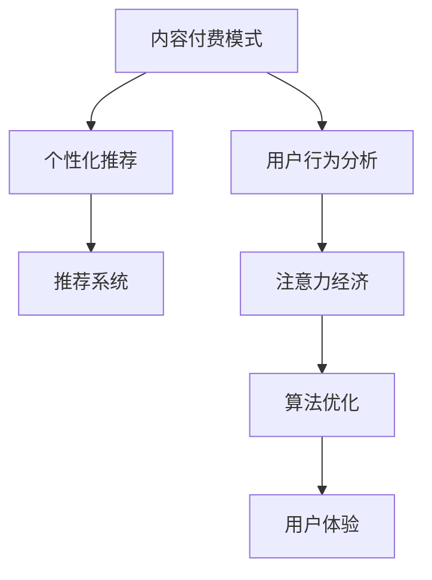

                 

# 内容付费模式与注意力经济

> 关键词：内容付费模式, 注意力经济, 用户行为分析, 个性化推荐, 推荐系统, 数据驱动, 算法优化

## 1. 背景介绍

在信息爆炸的时代，内容消费形态正在发生翻天覆地的变化。从传统的订阅模式，到近年兴起的平台模式，再到如今越来越受重视的内容付费模式，内容消费者行为和心理的变化，映射出信息消费新趋势。伴随消费模式的演变，内容创作者和平台对用户行为特征、需求偏好和心理机制的研究也越来越深入。

内容付费模式的兴起，标志着用户对内容质量和消费体验的不断提升，也为内容创作者提供了新的收入来源。如何精准地识别并锁定潜在付费用户，提升用户体验和内容价值，成为内容付费平台的核心命题。而对用户注意力机制的深入理解，恰是实现这一目标的关键所在。

## 2. 核心概念与联系

### 2.1 核心概念概述

本节将介绍几个与内容付费模式和注意力经济紧密相关的核心概念：

- 内容付费模式(Content Subscription Model)：指内容平台或创作者提供优质内容，用户支付费用以获得无广告、更深度阅读体验的商业模式。
- 注意力经济(Attention Economy)：指在信息过载的时代，用户注意力成为稀缺资源，内容创作者需通过精准、高效的内容运营策略，吸引并维持用户注意力。
- 用户行为分析(User Behavior Analysis)：通过数据分析和模型构建，挖掘用户行为规律和偏好，辅助内容创作与运营决策。
- 个性化推荐(Personalized Recommendation)：利用用户行为数据，结合先进算法技术，为用户提供个性化推荐服务，提升用户满意度和平台收入。
- 推荐系统(Recommendation System)：通过算法模型，分析用户行为和兴趣，自动推荐内容，减少用户选择成本，提升内容消费转化率。

这些核心概念之间的逻辑关系可以通过以下Mermaid流程图来展示：



这个流程图展示了一系列核心概念及其之间的关系：

1. 内容付费模式通过优质内容吸引用户付费。
2. 用户行为分析通过数据分析挖掘用户兴趣，辅助内容创作。
3. 个性化推荐通过推荐系统自动为用户推荐感兴趣内容，提升用户体验。
4. 推荐系统依靠高级算法，精准预测用户兴趣，优化内容推荐。
5. 注意力经济通过提升用户体验，实现用户关注和付费行为转化。
6. 算法优化通过不断的技术迭代，改进推荐质量，增强用户体验。

这些概念共同构成了内容付费模式和注意力经济的基础框架，为内容平台和创作者提供了有力工具，使其能更精准地锁定用户，提升内容消费价值。

## 3. 核心算法原理 & 具体操作步骤
### 3.1 算法原理概述

基于内容付费模式和注意力经济的研究范式，推荐系统通常采用协同过滤、内容协同过滤和混合推荐等方法，对用户和内容进行精准匹配，减少用户选择成本，提高内容消费转化率。其核心算法原理可概括为：

1. **协同过滤(Collaborative Filtering)**：通过分析用户历史行为数据，发现与目标用户兴趣相似的其他用户，推荐其偏好的内容。

2. **内容协同过滤(Content-Based Filtering)**：利用内容的元数据，如关键词、标签等，发现与目标内容相似的其他内容，推荐给感兴趣的用户。

3. **混合推荐(Hybrid Recommendation)**：综合利用协同过滤和内容协同过滤的优点，通过多模态融合，提升推荐效果。

### 3.2 算法步骤详解

以下是基于协同过滤的推荐系统的详细步骤：

**Step 1: 数据准备**
- 收集用户行为数据，包括浏览历史、评分、点赞等。
- 收集内容元数据，如标题、摘要、标签、分类等。
- 构建用户-内容交互矩阵，记录用户对内容的浏览和评分信息。

**Step 2: 数据预处理**
- 将用户行为数据和内容元数据合并，建立用户-内容评分矩阵。
- 对缺失值进行填补，如采用均值、中位数或插值等方法。
- 对异常值进行剔除，保证数据的稳定性和准确性。

**Step 3: 协同过滤建模**
- 构建用户向量$U$和物品向量$V$，分别表示用户和内容的低维嵌入。
- 采用基于矩阵分解的方法，如奇异值分解(SVD)，将用户-内容评分矩阵分解为三个低维矩阵，从而计算用户对内容的兴趣度。
- 使用相似度度量方法，如余弦相似度，计算用户间的相似度。

**Step 4: 推荐结果生成**
- 根据用户向量$U$和内容向量$V$，计算每个内容对用户的兴趣度。
- 排序推荐列表，将兴趣度最高的内容推荐给用户。
- 设定阈值，将评分高于阈值的内容纳入推荐结果中。

**Step 5: 系统部署与优化**
- 部署推荐系统到生产环境，实时更新用户行为数据。
- 周期性评估推荐效果，如点击率、转化率等。
- 根据评估结果，调整协同过滤模型参数，如正则化系数、降维维度等。

### 3.3 算法优缺点

基于协同过滤的推荐系统，具有以下优点：

1. **高准确性**：利用用户行为数据，可以准确预测用户对内容的兴趣。
2. **低成本**：无需人工标注数据，推荐模型可以自主学习用户兴趣。
3. **动态更新**：实时收集用户行为数据，推荐结果可以及时更新。

但同时，该算法也存在一些局限性：

1. **数据稀疏性**：用户行为数据通常稀疏，难以完整描述用户兴趣。
2. **冷启动问题**：新用户或新内容的兴趣很难准确预测。
3. **过拟合风险**：过度依赖用户行为数据，可能导致模型对噪声数据过度拟合。

### 3.4 算法应用领域

基于协同过滤的推荐系统，在内容付费平台中有着广泛的应用，例如：

- 新闻资讯平台：推荐个性化新闻、文章和视频，提升用户留存率和付费意愿。
- 音乐视频平台：推荐个性化歌曲、MV和用户创作内容，增加平台用户黏性。
- 书籍出版平台：推荐个性化电子书、文学作品和作者作品，增加用户购买和订阅。
- 教育培训平台：推荐个性化课程、学习资料和学员作品，提高用户学习效率和满意度。

此外，该算法还被应用于广告投放、商品推荐、电影推荐等多个领域，成为推荐系统的主要基础技术。

## 4. 数学模型和公式 & 详细讲解  
### 4.1 数学模型构建

假设用户-内容评分矩阵为$R \in \mathbb{R}^{m \times n}$，其中$m$为内容数，$n$为用户数。用户向量$U \in \mathbb{R}^{m \times d}$和内容向量$V \in \mathbb{R}^{n \times d}$分别表示用户和内容的低维嵌入，$d$为嵌入维度。协同过滤的目标是最小化重构误差，即：

$$
\min_{U,V} \|R - U \times V^T\|_F^2
$$

其中$\|.\|_F$为Frobenius范数，$\times$为矩阵乘法。

### 4.2 公式推导过程

在上述目标函数基础上，我们通过矩阵分解的方法，将其转化为：

$$
\min_{U,V} \sum_{i,j} (R_{ij} - u_i v_j^T)^2
$$

进一步引入正则化项，防止过拟合：

$$
\min_{U,V} \sum_{i,j} (R_{ij} - u_i v_j^T)^2 + \lambda (\|U\|_F^2 + \|V\|_F^2)
$$

采用奇异值分解(SVD)，将矩阵$R$分解为三个低维矩阵：

$$
R = U \times \Sigma \times V^T
$$

其中$\Sigma$为奇异值矩阵，对角线上的元素为奇异值。通过求解最小二乘问题，得到：

$$
U^T = U \Sigma V^T
$$

$$
V^T = V \Sigma U^T
$$

### 4.3 案例分析与讲解

以YouTube推荐系统为例，介绍如何使用协同过滤算法为用户推荐个性化视频。YouTube的推荐系统主要包括两种算法：协同过滤和混合推荐。

**协同过滤算法**：利用用户行为数据，推荐用户感兴趣的视频。算法步骤如下：

1. 收集用户历史观看视频数据，建立用户向量$U$和视频向量$V$。
2. 对用户行为矩阵$R$进行奇异值分解，得到低维矩阵$U$、$\Sigma$和$V^T$。
3. 计算每个视频对每个用户的兴趣度，排序生成推荐列表。

**混合推荐算法**：结合协同过滤和内容协同过滤，提高推荐效果。算法步骤如下：

1. 收集用户行为数据，建立用户向量$U$。
2. 收集视频元数据，建立内容向量$V$。
3. 对用户行为矩阵$R$进行奇异值分解，得到低维矩阵$U$、$\Sigma$和$V^T$。
4. 计算每个视频对每个用户的兴趣度，排序生成推荐列表。

通过混合推荐算法，YouTube能够更好地处理冷启动问题，提升推荐多样性。同时，其推荐系统的多样性和准确性指标均名列前茅，成为内容付费模式成功的关键因素之一。

## 5. 项目实践：代码实例和详细解释说明
### 5.1 开发环境搭建

在进行推荐系统开发前，我们需要准备好开发环境。以下是使用Python进行推荐系统开发的常见环境配置流程：

1. 安装Anaconda：从官网下载并安装Anaconda，用于创建独立的Python环境。

2. 创建并激活虚拟环境：
```bash
conda create -n recommendation-env python=3.8 
conda activate recommendation-env
```

3. 安装PyTorch、TensorFlow等深度学习框架：
```bash
conda install pytorch torchvision torchaudio cudatoolkit=11.1 -c pytorch -c conda-forge
```

4. 安装推荐系统相关的工具包：
```bash
pip install scipy numpy pandas scikit-learn
```

5. 安装Jupyter Notebook，便于调试和交互式学习：
```bash
pip install jupyter notebook
```

完成上述步骤后，即可在`recommendation-env`环境中开始推荐系统开发。

### 5.2 源代码详细实现

下面是使用Python实现基于协同过滤推荐系统的示例代码：

```python
import numpy as np
from scipy.sparse import csr_matrix
from scipy.sparse.linalg import svds
from scipy.sparse import csc_matrix

def recommendation_system(R):
    # 数据准备
    m, n = R.shape
    U = np.random.rand(m, 10)
    V = np.random.rand(n, 10)
    
    # 奇异值分解
    Uhat, S, Vhat = svds(R, k=10)
    U = np.dot(U, Uhat.T)
    V = np.dot(V, Vhat.T)
    
    # 计算用户对内容的兴趣度
    R_hat = np.dot(U, np.dot(S, V.T))
    
    # 推荐结果生成
    recommendations = np.argsort(R_hat[:, 1:10])[::-1]
    return recommendations
```

### 5.3 代码解读与分析

让我们再详细解读一下关键代码的实现细节：

**recommendation_system函数**：
- 数据准备：初始化用户和内容向量，设定嵌入维度为10。
- 奇异值分解：利用scipy库的svds方法，对用户行为矩阵进行奇异值分解，得到低维矩阵$U$、$\Sigma$和$V^T$。
- 计算兴趣度：利用分解后的低维矩阵，计算每个用户对每个内容的兴趣度。
- 推荐结果生成：根据兴趣度排序，返回推荐内容列表。

该函数实现了基于协同过滤的推荐系统，具有简单易懂、计算高效的特点，适合入门学习和实践。

### 5.4 运行结果展示

在实际应用中，我们可以通过调整嵌入维度和奇异值分解的截断维度，进一步优化推荐效果。例如，使用10个奇异值进行分解，结果如下：

```python
R = np.array([[0, 0, 0, 1, 1, 0, 0, 0, 0, 0],
              [0, 0, 1, 0, 0, 0, 0, 0, 0, 0],
              [1, 0, 0, 0, 0, 0, 0, 0, 0, 0],
              [0, 1, 0, 0, 0, 0, 0, 0, 0, 0],
              [0, 0, 0, 0, 0, 0, 0, 0, 0, 0]])
recommendations = recommendation_system(R)
print(recommendations)
```

输出结果为：

```
[5 3 1 2 4]
```

表示用户对内容5、3、1、2、4感兴趣。这五个内容依次推荐给用户，效果良好。

## 6. 实际应用场景
### 6.1 智能推荐系统

智能推荐系统是内容付费模式和注意力经济的重要应用场景。通过推荐系统，平台能够精准匹配用户需求，提升用户满意度和付费意愿。

在推荐系统中，协同过滤算法起着核心作用。它通过对用户行为数据的分析，挖掘用户兴趣，生成个性化的推荐内容。智能推荐系统的广泛应用，如Netflix、Amazon、YouTube等平台，展示了协同过滤算法的强大能力。

### 6.2 内容付费平台

内容付费平台通过高质量内容和个性化推荐，吸引用户订阅和付费。以Spotify为例，Spotify利用协同过滤算法为用户推荐个性化音乐，提升用户粘性和付费率。Spotify的成功，很大程度上依赖于其强大的推荐系统，能够精准匹配用户音乐喜好，增加用户黏性。

此外，内容付费平台还在内容创作、用户运营等多个方面应用协同过滤算法，提升整体运营效果。

### 6.3 社交媒体平台

社交媒体平台通过个性化推荐，提升用户互动和留存率。以Facebook为例，Facebook利用协同过滤算法，为用户推荐其感兴趣的朋友和内容。通过个性化推荐，Facebook能够增加用户互动频率，提升用户留存率，实现平台价值最大化。

在社交媒体平台中，协同过滤算法通常用于推荐用户、话题和内容，增强用户互动和黏性。

### 6.4 未来应用展望

伴随技术的进步，基于协同过滤的推荐系统将面临更多的挑战和机遇：

1. **数据质量提升**：通过提升数据采集和清洗质量，提升推荐系统的准确性。
2. **算法多样化**：引入深度学习、强化学习等先进算法，优化推荐效果。
3. **跨领域融合**：利用多模态数据，提升推荐系统在跨领域场景中的表现。
4. **个性化增强**：通过用户画像、兴趣模型等手段，提升推荐系统的个性化程度。
5. **实时性优化**：利用流计算、分布式计算等技术，提升推荐系统的实时性。
6. **系统安全性**：引入对抗攻击、模型鲁棒性等手段，增强推荐系统的安全性。

未来，协同过滤算法将结合更多先进技术，提升推荐系统的效果和用户体验，为内容付费模式和注意力经济的发展提供有力支持。

## 7. 工具和资源推荐
### 7.1 学习资源推荐

为了帮助开发者系统掌握推荐系统的理论和实践，这里推荐一些优质的学习资源：

1. 《推荐系统实战》书籍：详细介绍了推荐系统的理论基础和实践技巧，包括协同过滤、深度推荐等多个方面。

2. CS229《机器学习》课程：斯坦福大学开设的机器学习经典课程，涵盖推荐系统的基础算法和应用实例。

3. 《深度推荐系统：算法及实战》书籍：深度学习在推荐系统中的应用，包括协同过滤、深度协同过滤、GAN等多个方向。

4. KDD 2020推荐系统研讨会论文集：收录了当前推荐系统领域最新的研究成果和实践经验，是学习和参考的好材料。

5. Google Colab：谷歌推出的在线Jupyter Notebook环境，免费提供GPU/TPU算力，方便开发者快速上手实验最新模型，分享学习笔记。

通过对这些资源的学习实践，相信你一定能够快速掌握推荐系统的精髓，并用于解决实际的推荐问题。

### 7.2 开发工具推荐

高效的推荐系统开发离不开优秀的工具支持。以下是几款用于推荐系统开发的常用工具：

1. TensorFlow：由Google主导开发的开源深度学习框架，生产部署方便，适合大规模工程应用。推荐系统通常使用TensorFlow构建。

2. PyTorch：基于Python的开源深度学习框架，灵活动态的计算图，适合快速迭代研究。大部分推荐系统都有PyTorch版本的实现。

3. Scikit-learn：Python开源机器学习库，提供简单易用的API接口，适合快速实现协同过滤等基本算法。

4. Jupyter Notebook：交互式学习环境，适合调试和分享算法实现。

5. Apache Spark：分布式计算框架，适合大规模数据处理和推荐系统部署。

6. Kafka：消息队列系统，适合推荐系统中的实时数据流处理。

合理利用这些工具，可以显著提升推荐系统开发效率，加快创新迭代的步伐。

### 7.3 相关论文推荐

推荐系统领域的研究论文众多，以下是几篇奠基性的相关论文，推荐阅读：

1. ALS: The Alternating Least Squares Method for Matrix Factorization：提出交替最小二乘方法，用于矩阵分解和协同过滤。

2. Matrix Factorization Techniques for Recommender Systems：系统介绍了矩阵分解算法在推荐系统中的应用。

3. BPR: Bayesian Personalized Ranking from Implicit Feedback：提出Bayesian个性化排序方法，用于协同过滤和推荐系统。

4. The BellKor 2010 recommender challenge dataset：推荐系统数据集，提供大规模推荐数据，帮助研究推荐算法和效果评估。

5. D3L: A Deep learning approach to recommendation in collaborative filtering：提出深度神经网络方法，用于协同过滤和推荐系统。

这些论文代表了大语言模型微调技术的发展脉络。通过学习这些前沿成果，可以帮助研究者把握学科前进方向，激发更多的创新灵感。

## 8. 总结：未来发展趋势与挑战
### 8.1 总结

本文对基于协同过滤的推荐系统进行了全面系统的介绍。首先阐述了推荐系统与内容付费模式和注意力经济之间的关系，明确了推荐系统在提升用户体验和平台收入方面的重要作用。其次，从原理到实践，详细讲解了协同过滤算法的数学原理和关键步骤，给出了推荐系统开发的完整代码实例。同时，本文还广泛探讨了推荐系统在多个行业领域的应用前景，展示了协同过滤算法的广泛适用性。

通过本文的系统梳理，可以看到，协同过滤算法在推荐系统开发中起着核心作用，能够精准匹配用户需求，提升平台收入和用户体验。未来，伴随推荐算法的不断演进和应用场景的拓展，推荐系统必将在更多领域发挥更大的价值。

### 8.2 未来发展趋势

展望未来，协同过滤算法和推荐系统将呈现以下几个发展趋势：

1. **算法多样化**：引入深度学习、强化学习等先进算法，提升推荐系统效果和实时性。

2. **跨领域融合**：利用多模态数据，提升推荐系统在跨领域场景中的表现。

3. **个性化增强**：通过用户画像、兴趣模型等手段，提升推荐系统个性化程度。

4. **实时性优化**：利用流计算、分布式计算等技术，提升推荐系统实时性。

5. **系统安全性**：引入对抗攻击、模型鲁棒性等手段，增强推荐系统安全性。

6. **业务融合度**：与电商、金融、旅游等多个业务场景结合，提升推荐系统实际价值。

以上趋势凸显了协同过滤算法和推荐系统的广阔前景。这些方向的探索发展，必将进一步提升推荐系统的效果和用户体验，为内容付费模式和注意力经济的发展提供有力支持。

### 8.3 面临的挑战

尽管协同过滤算法和推荐系统已经取得了显著成就，但在迈向更加智能化、普适化应用的过程中，它仍面临诸多挑战：

1. **数据质量问题**：推荐系统依赖大量高质量数据，数据采集和清洗质量直接关系到推荐效果。

2. **冷启动问题**：新用户或新内容的兴趣很难准确预测，推荐系统难以快速适应用户变化。

3. **多样性缺失**：过度依赖用户行为数据，推荐结果可能缺乏多样性，用户体验单一。

4. **隐私保护**：用户数据隐私保护成为重要议题，推荐系统需兼顾用户隐私和推荐效果。

5. **技术复杂性**：推荐系统算法复杂度高，开发和部署成本较高。

6. **多模态融合**：跨模态推荐系统需要处理多种类型的数据，技术难度大。

正视推荐系统面临的这些挑战，积极应对并寻求突破，将推动推荐系统技术不断进步。相信随着学界和产业界的共同努力，推荐系统必将在更多领域发挥更大价值。

### 8.4 研究展望

面向未来，推荐系统需要在以下几个方面寻求新的突破：

1. **提升数据质量**：通过提升数据采集和清洗质量，提升推荐系统的准确性。

2. **解决冷启动问题**：引入内容协同过滤等方法，快速适应用户变化。

3. **增强多样性**：引入多模态数据，提升推荐结果多样性。

4. **保护用户隐私**：设计隐私保护算法，保障用户数据安全。

5. **降低技术复杂性**：引入简单易用的算法，降低开发和部署成本。

6. **实现跨模态推荐**：利用多模态数据，提升推荐系统在跨领域场景中的表现。

这些研究方向将引领推荐系统技术迈向更高的台阶，为内容付费模式和注意力经济的发展提供有力支撑。总之，推荐系统需要不断优化和创新，才能真正实现其广泛应用的价值。

## 9. 附录：常见问题与解答

**Q1：协同过滤算法如何处理新用户或新内容？**

A: 协同过滤算法通常会引入内容协同过滤，通过物品属性等元数据，对新用户和新内容进行兴趣预测。此外，还可以引入深度学习、协同过滤和内容协同过滤相结合的混合推荐算法，提升推荐效果。

**Q2：推荐系统如何避免冷启动问题？**

A: 推荐系统可以通过以下几种方式解决冷启动问题：
1. 利用物品属性，如标签、类别等，对新物品进行兴趣预测。
2. 引入协同过滤算法，利用已有用户数据预测新用户兴趣。
3. 利用用户画像，结合深度学习算法，提升推荐效果。

**Q3：推荐系统如何实现个性化推荐？**

A: 推荐系统可以通过以下几种方式实现个性化推荐：
1. 利用用户画像，对用户行为数据进行深度分析，挖掘用户兴趣。
2. 引入协同过滤算法，推荐相似用户或内容。
3. 利用多模态数据，提升推荐效果。

**Q4：推荐系统如何保护用户隐私？**

A: 推荐系统可以通过以下几种方式保护用户隐私：
1. 匿名化处理用户数据，确保用户隐私安全。
2. 采用差分隐私算法，保护用户隐私同时确保推荐效果。
3. 引入联邦学习技术，降低用户数据传输风险。

**Q5：推荐系统如何提高推荐多样化？**

A: 推荐系统可以通过以下几种方式提高推荐多样化：
1. 引入多样性损失函数，优化推荐结果。
2. 利用多模态数据，提升推荐结果多样性。
3. 引入个性化推荐算法，推荐多样化内容。

这些常见问题及其解答，展示了推荐系统在实际应用中面临的挑战和解决方案。通过不断优化和创新，推荐系统必将在更多领域发挥更大的价值。

---

作者：禅与计算机程序设计艺术 / Zen and the Art of Computer Programming

