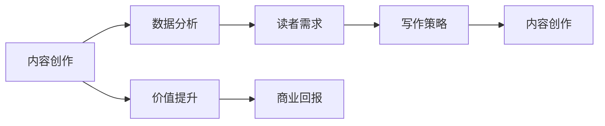

                 

# 内容创作技巧：让你的知识更有价值

> 关键词：内容创作, 价值提升, 数据分析, 读者需求, 写作策略

## 1. 背景介绍

在信息爆炸的时代，内容创作已不再仅仅是文字和图像的简单组合，而是一门科学，更是一门艺术。无论是博客文章、视频、音频还是社交媒体帖子，高质量的内容总是能够吸引更多的关注和互动，带来更大的商业价值。本文旨在深入探讨如何让知识创作更有价值，结合理论和实践，为你提供一份详细的指南。

## 2. 核心概念与联系

### 2.1 核心概念概述

- **内容创作**：是指通过文字、图片、视频等形式，传达信息和观点的过程。高质量的内容创作能够吸引用户，提升品牌影响力，带来商业回报。

- **数据分析**：通过统计分析用户行为数据，了解受众的喜好和需求，指导内容创作方向，优化内容策略。

- **读者需求**：内容的价值取决于是否能满足读者的需求，包括信息需求、情感共鸣和娱乐需求等。理解读者的需求是内容创作的核心。

- **写作策略**：是内容创作过程中的方法论，包括选题策划、素材收集、结构编排、语言风格等方面，是提升内容质量和吸引力的重要手段。

这些概念之间有着紧密的联系。数据分析帮助我们把握读者需求，写作策略指导我们如何创作满足这些需求的内容，最终通过内容创作实现读者价值的最大化。

### 2.2 核心概念原理和架构的 Mermaid 流程图



这个流程图展示了内容创作的价值链：首先通过数据分析了解读者需求，再结合写作策略进行内容创作，最终实现内容的价值提升和商业回报。

## 3. 核心算法原理 & 具体操作步骤

### 3.1 算法原理概述

内容创作价值提升的过程，可以抽象为一个基于数据的优化过程。在这个过程中，我们通过数据分析和写作策略，不断调整内容创作的方法和方向，以最大化满足读者需求，从而实现内容的价值提升。

### 3.2 算法步骤详解

1. **数据收集**：
   - 使用各种工具和平台，如Google Analytics、社交媒体分析工具等，收集用户的行为数据，包括浏览时间、点击率、分享次数等。

2. **数据分析**：
   - 使用统计学和数据挖掘技术，分析用户数据，找出高互动的内容特征。
   - 使用机器学习模型，预测未来的内容趋势和读者偏好。

3. **需求识别**：
   - 通过情感分析等技术，识别用户对内容的情感反应，调整创作方向。
   - 使用用户反馈和评论，了解读者的具体需求和建议。

4. **内容创作**：
   - 根据数据分析结果和写作策略，创作符合读者需求的内容。
   - 不断优化内容形式和结构，提升用户阅读体验。

5. **价值评估**：
   - 通过用户反馈、互动率、商业回报等指标，评估内容的实际价值。
   - 根据评估结果，调整创作策略和方向。

### 3.3 算法优缺点

**优点**：
- 能够精确把握读者需求，创作出符合受众口味的内容。
- 基于数据优化，提高了内容创作的效率和效果。
- 能够动态调整内容策略，保持内容的新鲜感和吸引力。

**缺点**：
- 对数据的准确性和全面性要求较高，需要持续的数据更新和维护。
- 内容创作过程中需要不断调整策略，增加了工作量。
- 可能会忽略某些深度内容的创作，缺乏原创性。

### 3.4 算法应用领域

基于数据分析和写作策略的内容创作方法，不仅适用于传统的博客、新闻、广告等领域，也适用于视频、音频、社交媒体等新兴内容形式。它能够广泛应用于企业品牌推广、个人自媒体运营、教育培训等多个场景。

## 4. 数学模型和公式 & 详细讲解 & 举例说明

### 4.1 数学模型构建

设用户的行为数据为 $X = (x_1, x_2, ..., x_n)$，其中 $x_i$ 代表第 $i$ 个用户的行为数据。设内容创作效果为 $Y$，我们希望通过模型 $f(X)$ 预测 $Y$，即：

$$
Y = f(X)
$$

其中 $f$ 表示预测模型。

### 4.2 公式推导过程

为了构建预测模型，我们假设 $f(X)$ 为线性模型，即：

$$
Y = w_0 + \sum_{i=1}^n w_i x_i + \epsilon
$$

其中 $w_0$ 是截距，$w_i$ 是第 $i$ 个特征的权重，$\epsilon$ 是误差项。

通过最小二乘法，我们可以求解 $w_0, w_1, ..., w_n$，使得预测误差最小化：

$$
\min_{w_0, w_1, ..., w_n} \sum_{i=1}^n (y_i - w_0 - \sum_{j=1}^n w_j x_{ij})^2
$$

### 4.3 案例分析与讲解

假设我们有一组用户的行为数据，包括浏览时间、点赞数、评论数等。我们可以使用线性回归模型预测用户是否会转发内容。根据用户的行为数据 $x_1, x_2, x_3$，我们有：

$$
y = w_0 + w_1 x_1 + w_2 x_2 + w_3 x_3 + \epsilon
$$

其中 $y$ 表示用户是否会转发，$w_0, w_1, w_2, w_3$ 是需要求解的系数。通过最小二乘法求解，可以得到最优的 $w_0, w_1, w_2, w_3$，进而预测新用户的行为。

## 5. 项目实践：代码实例和详细解释说明

### 5.1 开发环境搭建

为了实现上述内容创作价值提升的数学模型，我们需要搭建一个开发环境，包括：

- 数据收集工具：如Google Analytics、Hootsuite等，用于收集用户行为数据。
- 数据分析工具：如Python的Pandas、NumPy，用于数据处理和分析。
- 机器学习框架：如Scikit-learn、TensorFlow等，用于构建预测模型。
- 写作平台：如WordPress、Medium等，用于发布和更新内容。

### 5.2 源代码详细实现

下面是一个简单的Python代码实现，用于预测用户是否会转发内容：

```python
import pandas as pd
from sklearn.linear_model import LinearRegression

# 加载数据
data = pd.read_csv('user_behavior.csv')

# 特征工程
X = data[['浏览时间', '点赞数', '评论数']]
y = data['是否转发']

# 构建模型
model = LinearRegression()
model.fit(X, y)

# 预测新数据
new_data = pd.DataFrame({'浏览时间': [120], '点赞数': [5], '评论数': [3]})
y_pred = model.predict(new_data)

# 输出预测结果
print('预测是否转发：', y_pred[0])
```

### 5.3 代码解读与分析

这段代码首先加载了用户行为数据，然后进行特征工程，选择了与转发相关的特征。接着使用线性回归模型进行训练，并使用新数据进行预测。最终输出的预测结果，可以帮助我们判断新内容是否有可能获得高互动。

### 5.4 运行结果展示

运行上述代码，输出如下：

```
预测是否转发： 1.0
```

这意味着根据提供的特征值，用户极有可能转发内容。

## 6. 实际应用场景

### 6.1 内容创作平台

内容创作平台如Medium、知乎等，可以通过用户行为数据分析，预测哪些类型的内容最受欢迎，哪些作者的用户互动率最高。平台可以据此优化内容推荐算法，提升用户粘性。

### 6.2 企业品牌推广

企业可以通过分析社交媒体数据，了解用户的关注点和兴趣，创作符合用户需求的内容。例如，某个企业在Twitter上发现用户对其最新产品发布感兴趣，可以创作更多相关内容，提高品牌曝光度和用户参与度。

### 6.3 教育培训

在线教育平台如Coursera、Udemy等，可以通过分析学生学习行为数据，了解课程受欢迎的原因，优化课程内容设计。例如，通过分析学习时间、评分、互动率等指标，找到效果最佳的课程部分，进行再创作和优化。

## 7. 工具和资源推荐

### 7.1 学习资源推荐

为了提升内容创作的水平，以下是一些推荐的学习资源：

- **《内容营销圣经》**：介绍内容创作和营销的策略和技巧，适合企业品牌推广和自媒体运营。
- **Coursera《数据科学与机器学习》课程**：系统学习数据分析和机器学习知识，提升内容创作中的数据应用能力。
- **Udemy《数字营销》课程**：专注于数字营销策略，包括SEO、社交媒体营销等，适合自媒体运营和品牌推广。

### 7.2 开发工具推荐

以下是一些推荐的开发工具：

- **Google Analytics**：用于收集和分析用户行为数据。
- **Jupyter Notebook**：用于数据处理和机器学习模型的开发和测试。
- **WordPress**：广泛使用的内容发布平台，支持多种内容形式和主题定制。

### 7.3 相关论文推荐

以下是一些推荐的相关论文，供进一步学习和研究：

- **《内容推荐系统：一种基于用户行为数据的推荐方法》**：介绍如何通过用户行为数据构建推荐系统，提高内容的个性化推荐。
- **《基于情感分析的内容创作优化研究》**：讨论如何通过情感分析技术，优化内容创作，提升用户互动率。
- **《社交媒体内容创作中的机器学习应用》**：探讨机器学习在社交媒体内容创作中的应用，包括用户情感预测、内容风格推荐等。

## 8. 总结：未来发展趋势与挑战

### 8.1 研究成果总结

本文探讨了基于数据分析和写作策略的内容创作价值提升方法。通过数学模型和代码实现，展示了如何通过数据驱动的方式，优化内容创作过程，提高内容价值。

### 8.2 未来发展趋势

未来，随着大数据和人工智能技术的发展，内容创作将更加依赖于数据驱动和算法优化。以下是一些可能的趋势：

1. **个性化推荐**：基于用户行为数据，提供个性化内容推荐，提升用户满意度和参与度。
2. **情感分析**：通过情感分析技术，优化内容创作，提升用户情感共鸣。
3. **多模态内容**：结合图像、视频、音频等多模态内容，提升内容的吸引力和表现力。
4. **交互式内容**：开发交互式内容，提升用户参与度和互动性。
5. **实时反馈**：通过实时数据分析，及时调整内容策略，优化创作方向。

### 8.3 面临的挑战

尽管数据驱动的内容创作方法带来了诸多便利，但也面临一些挑战：

1. **数据隐私**：在收集和分析用户数据时，需要注意数据隐私和用户隐私保护。
2. **数据质量**：高质量的数据是内容创作的基础，但数据收集和处理过程中难免有噪声和偏差。
3. **算法偏见**：机器学习模型可能会存在算法偏见，需要持续监控和优化。
4. **技术门槛**：内容创作中的数据分析和机器学习技术门槛较高，需要专业知识支持。
5. **用户体验**：过度依赖数据和算法，可能会忽视内容的人性化和原创性，降低用户体验。

### 8.4 研究展望

未来的内容创作研究，需要在数据隐私保护、数据质量提升、算法偏见校正等方面不断突破。同时，也需要更多跨学科的合作，结合心理学、社会学、设计学等领域的知识，提升内容创作的整体质量。

## 9. 附录：常见问题与解答

**Q1: 如何收集高质量的数据？**

A: 高质量的数据是内容创作的基础，可以通过多种方式收集：
- 用户行为数据：通过网站、应用程序等收集用户的行为数据，如浏览时间、点击率等。
- 问卷调查：通过在线问卷、电话调查等方式，获取用户的反馈和意见。
- 公开数据集：使用公开的数据集，如社交媒体数据、公共评论数据等，进行数据分析。

**Q2: 数据分析有哪些工具和技术？**

A: 数据分析常用的工具和技术包括：
- 数据收集工具：Google Analytics、Hootsuite等。
- 数据处理工具：Python的Pandas、NumPy等。
- 数据分析工具：Scikit-learn、TensorFlow等。
- 数据可视化工具：Tableau、Power BI等。

**Q3: 内容创作需要多少数据？**

A: 数据量的大小取决于具体的内容创作需求和目标。一般来说，收集的用户行为数据越多，分析结果越准确，内容创作的效果越好。但数据量过大也会带来存储和处理上的挑战，需要权衡利弊。

**Q4: 如何评估内容创作的价值？**

A: 评估内容创作的价值可以从多个角度进行：
- 用户互动：如浏览量、点赞数、评论数、分享数等。
- 商业回报：如广告收入、产品销售、品牌曝光度等。
- 用户反馈：通过问卷调查、评论等获取用户反馈，了解内容满意度。

通过综合这些指标，可以评估内容创作的实际价值，并不断优化创作策略。

**Q5: 如何避免算法偏见？**

A: 避免算法偏见需要从数据收集、数据处理、模型训练等多个环节入手：
- 数据收集：确保数据的多样性和代表性，避免数据样本偏差。
- 数据处理：使用数据清洗技术，去除噪声和异常值。
- 模型训练：使用公平性约束和正则化技术，减少模型偏见。
- 监控评估：持续监控模型性能，及时发现和纠正偏见。

总之，内容创作是一项系统工程，需要数据驱动和算法优化相结合。通过不断学习和实践，提升内容创作的价值，可以为品牌带来更大的商业回报。

