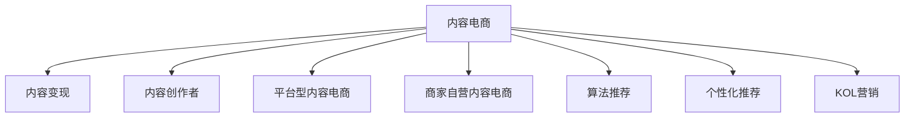

                 

## 1. 背景介绍

随着互联网时代的到来，电商行业经历了翻天覆地的变化。在早期，电商更多依赖于搜索排名和广告推荐等算法来驱动销售，但随着社交媒体和内容平台的影响力不断增强，消费者对个性化推荐和内容互动的依赖日益加深。内容电商（Content-based E-commerce）正是利用这一趋势，通过优质内容和互动体验来吸引用户，进而实现销售转化的一种新兴模式。

内容电商的核心理念是，用户不仅是为了商品而消费，更是为了内容和体验而停留。商家通过提供有趣、有用、有价值的内容，构建与用户之间的情感连接，从而提升用户粘性和购买转化率。基于这一思路，内容电商创业项目在近年来迅速崛起，成为各大电商平台和内容平台争相探索的热点领域。

### 1.1 内容电商的兴起

内容电商的兴起，主要源于以下几个驱动因素：

- **社交媒体的崛起**：Facebook、Instagram、抖音等社交媒体平台逐渐成为人们获取信息、娱乐和交流的主要渠道，用户对内容消费的需求日益旺盛。
- **电商平台的创新**：阿里巴巴、京东、拼多多等电商平台通过引入内容推荐、直播带货等新模式，提升用户互动和购物体验，推动销售增长。
- **KOL的崛起**：网红、博主等KOL通过内容输出构建影响力，成为品牌营销的重要渠道，推动了内容电商的繁荣。
- **用户需求的变化**：消费者不再满足于传统的商品信息展示，更希望通过深入了解商品背后的故事和价值，获得个性化的购物体验。

内容电商的成功案例，如小红书、抖音电商、网易严选等，都在以不同的方式，将内容与电商有机结合，实现了流量、互动和销售的全面提升。

### 1.2 内容电商的商业模式

内容电商的商业模式可以分为三种主要形式：

- **自建内容平台**：如小红书、抖音等，通过内容驱动流量，再通过广告、电商等多种变现方式实现盈利。
- **内容创作者平台**：如知乎、微信公众号等，主要通过平台内容吸引用户，通过广告、知识付费等方式实现变现。
- **电商平台的电商内容化**：如亚马逊、京东等，通过在商品页面嵌入视频、图文等内容，提升用户互动和购买转化率，实现销售增长。

内容电商的盈利模式包括：

- **广告收入**：通过平台流量吸引品牌投放广告，实现流量变现。
- **佣金收入**：通过内容导流增加销售转化，获取商品销售佣金。
- **付费订阅**：通过优质内容吸引用户订阅，实现知识付费和内容付费。
- **用户会员**：通过会员制吸引用户深度参与，提供会员专属优惠和内容服务。

## 2. 核心概念与联系

### 2.1 核心概念概述

为更好地理解内容电商创业的原理和实践，本节将介绍几个关键概念：

- **内容电商**：利用优质内容吸引用户，并通过互动和引导实现销售转化的电商模式。
- **内容变现**：通过内容驱动流量，实现广告、销售、付费订阅等多种变现途径。
- **内容创作者**：在内容电商平台上创作内容，如文章、视频、图文等，与用户互动。
- **平台型内容电商**：如抖音、小红书等，通过平台规则和激励机制，吸引大量创作者入驻。
- **商家自营内容电商**：如京东、亚马逊等，通过自有内容体系，提升用户购物体验和转化率。
- **算法推荐**：利用算法对内容进行精准推荐，提升用户互动和留存率。
- **个性化推荐**：根据用户兴趣和行为，提供个性化的内容推荐，提升用户体验。
- **KOL营销**：通过网红、博主等KOL的影响力，推广产品和服务。

这些概念之间的逻辑关系可以通过以下Mermaid流程图来展示：



这个流程图展示内容电商的核心概念及其之间的关系：

1. 内容电商通过内容吸引用户，并通过变现策略实现盈利。
2. 内容创作者在内容平台上创作内容，与用户互动。
3. 平台型内容电商和商家自营内容电商是内容电商的主要形式。
4. 算法推荐和个性化推荐是提升用户互动和留存率的重要手段。
5. KOL营销是内容电商中常用的推广方式。

## 3. 核心算法原理 & 具体操作步骤
### 3.1 算法原理概述

内容电商的核心算法原理，是通过内容驱动流量，利用算法对内容进行精准推荐，提升用户互动和留存率，从而实现销售转化。核心算法包括内容推荐算法和个性化推荐算法。

内容推荐算法（Content Recommendation）的原理是，利用用户行为数据和内容特征，构建用户与内容之间的关联关系，通过推荐系统输出与用户兴趣匹配度高的内容。常用的推荐算法包括协同过滤、内容协同过滤、基于深度学习的推荐系统等。

个性化推荐算法（Personalized Recommendation）的原理是，根据用户的历史行为数据，预测用户对不同内容的兴趣程度，并输出个性化推荐结果。常用的个性化推荐算法包括基于矩阵分解的推荐系统、基于深度学习的推荐系统等。

### 3.2 算法步骤详解

#### 3.2.1 内容推荐算法

**Step 1: 数据收集与预处理**
- 收集用户行为数据，如浏览、点击、收藏、购买等。
- 收集内容特征数据，如标题、描述、标签等。
- 对数据进行清洗和标准化处理。

**Step 2: 特征工程**
- 提取用户行为特征，如浏览时长、点击次数等。
- 提取内容特征，如关键词、情感倾向等。
- 进行特征降维和特征选择。

**Step 3: 模型训练**
- 选择推荐算法，如协同过滤、内容协同过滤、深度学习等。
- 利用训练数据训练推荐模型。
- 利用验证数据调整模型参数。

**Step 4: 推荐输出**
- 根据用户行为和内容特征，输出个性化推荐结果。
- 更新用户行为数据，持续优化推荐模型。

#### 3.2.2 个性化推荐算法

**Step 1: 数据收集与预处理**
- 收集用户历史行为数据。
- 收集内容特征数据。
- 对数据进行清洗和标准化处理。

**Step 2: 特征工程**
- 提取用户特征，如兴趣向量、用户画像等。
- 提取内容特征，如关键词、情感倾向等。
- 进行特征降维和特征选择。

**Step 3: 模型训练**
- 选择推荐算法，如矩阵分解、深度学习等。
- 利用训练数据训练推荐模型。
- 利用验证数据调整模型参数。

**Step 4: 推荐输出**
- 根据用户特征和内容特征，输出个性化推荐结果。
- 更新用户行为数据，持续优化推荐模型。

### 3.3 算法优缺点

内容推荐算法和个性化推荐算法的优缺点如下：

**优点：**
- **精准度**：通过深度学习和协同过滤算法，推荐结果可以更精准地满足用户需求。
- **可扩展性**：基于深度学习的推荐系统具有较好的可扩展性，可以适应大规模数据。
- **实时性**：通过实时更新用户行为数据，推荐结果可以实时调整，提升用户体验。

**缺点：**
- **冷启动问题**：新用户或新内容没有足够的历史数据，导致推荐效果不佳。
- **数据稀疏性**：用户行为数据和内容特征数据存在稀疏性，影响推荐效果。
- **多样性问题**：推荐算法容易陷入局部最优，输出结果不够多样化。

### 3.4 算法应用领域

内容推荐算法和个性化推荐算法不仅在内容电商中应用广泛，还广泛应用于以下领域：

- **电商推荐系统**：如亚马逊、京东、淘宝等电商平台，通过推荐系统提升用户购物体验。
- **新闻推荐系统**：如今日头条、腾讯新闻等，通过推荐系统个性化展示新闻内容。
- **音乐和视频推荐系统**：如Spotify、Netflix等，通过推荐系统提供个性化音乐和视频内容。
- **社交媒体推荐系统**：如Facebook、Instagram等，通过推荐系统提供个性化内容和广告。

## 4. 数学模型和公式 & 详细讲解  
### 4.1 数学模型构建

本节将使用数学语言对内容推荐算法和个性化推荐算法进行更加严格的刻画。

假设内容电商平台的用户集合为 $U$，内容集合为 $I$，用户与内容之间的评分矩阵为 $R$。每个用户对每个内容的评分是一个值域在 $[0,1]$ 的标量，表示用户对内容的偏好程度。设用户 $u$ 对内容 $i$ 的评分为 $R_{ui}$。

**内容推荐算法**：假设内容推荐算法为 $F$，其输出为推荐内容集合 $C_{u,i}$。算法 $F$ 的目标是最小化用户 $u$ 的预期误差：

$$
\min_{F} E[u][F(R) - R_u]
$$

其中 $E[u][.]$ 表示用户 $u$ 的预期，$F(R)$ 表示推荐系统对评分矩阵 $R$ 的预测。

**个性化推荐算法**：假设个性化推荐算法为 $P$，其输出为用户对内容的评分预测集合 $P_{u,i}$。算法 $P$ 的目标是最小化用户 $u$ 的预期误差：

$$
\min_{P} E[u][P(R) - R_u]
$$

其中 $P(R)$ 表示个性化推荐系统对评分矩阵 $R$ 的预测。

### 4.2 公式推导过程

以下是内容推荐算法和个性化推荐算法的公式推导过程：

**内容推荐算法**

假设内容推荐算法 $F$ 为矩阵分解模型，设用户 $u$ 对内容 $i$ 的评分 $R_{ui}$ 可以分解为两个低秩矩阵 $A$ 和 $B$ 的乘积：

$$
R_{ui} = \sum_k A_{uk}B_{ki}
$$

其中 $A$ 为用户特征矩阵，$B$ 为内容特征矩阵。$A$ 和 $B$ 的低秩分解参数为 $\theta$，$F(R,\theta) = A \times B$。

算法 $F$ 的目标是最小化用户 $u$ 的预期误差：

$$
\min_{\theta} E[u][F(R,\theta) - R_u] = \min_{\theta} E[u][\sum_k A_{uk}B_{ki} - R_u]
$$

利用均方误差（MSE）作为损失函数，并利用梯度下降算法进行优化：

$$
\frac{\partial}{\partial \theta} \frac{1}{N}\sum_{u=1}^N \sum_{i=1}^I (R_{ui} - \sum_k A_{uk}B_{ki})^2 = 0
$$

通过矩阵分解，算法 $F$ 可以高效地处理大规模数据，并输出高质量的推荐结果。

**个性化推荐算法**

假设个性化推荐算法 $P$ 为深度神经网络模型，设用户 $u$ 对内容 $i$ 的评分 $R_{ui}$ 可以表示为神经网络模型的输出：

$$
R_{ui} = f(W \cdot [u,v_i])
$$

其中 $W$ 为神经网络参数，$[u,v_i]$ 为用户 $u$ 和内容 $i$ 的特征向量，$f$ 为激活函数。算法 $P$ 的目标是最小化用户 $u$ 的预期误差：

$$
\min_{W} E[u][P(R,\theta) - R_u] = \min_{W} E[u][f(W \cdot [u,v_i]) - R_u]
$$

利用均方误差（MSE）作为损失函数，并利用梯度下降算法进行优化：

$$
\frac{\partial}{\partial W} \frac{1}{N}\sum_{u=1}^N \sum_{i=1}^I (R_{ui} - f(W \cdot [u,v_i]))^2 = 0
$$

通过深度神经网络，算法 $P$ 可以学习到更加复杂和精细的用户行为和内容特征，从而提供更加精准和个性化的推荐结果。

### 4.3 案例分析与讲解

以一个具体案例来分析内容推荐算法的应用：

假设用户 $u$ 对内容 $i$ 的评分矩阵为 $R$，设 $R$ 的前两列为：

$$
R_u = \begin{bmatrix} 0.5 \\ 0.3 \end{bmatrix}, R_i = \begin{bmatrix} 0.6 \\ 0.4 \\ 0.2 \end{bmatrix}
$$

设内容推荐算法 $F$ 为矩阵分解模型，通过低秩分解得到用户特征矩阵 $A$ 和内容特征矩阵 $B$：

$$
A = \begin{bmatrix} 0.2 & 0.3 \\ 0.1 & 0.4 \\ 0.2 & 0.3 \end{bmatrix}, B = \begin{bmatrix} 0.6 & 0.2 \\ 0.4 & 0.2 \\ 0.3 & 0.2 \end{bmatrix}
$$

通过矩阵乘法得到推荐结果：

$$
F(R) = A \times B = \begin{bmatrix} 0.6 \\ 0.4 \\ 0.2 \end{bmatrix}
$$

推荐结果与原始评分矩阵 $R$ 的误差为：

$$
\begin{bmatrix} 0.5 \\ 0.3 \end{bmatrix} - \begin{bmatrix} 0.6 \\ 0.4 \\ 0.2 \end{bmatrix} = \begin{bmatrix} -0.1 \\ -0.1 \end{bmatrix}
$$

通过优化算法调整参数 $\theta$，可以不断缩小误差，提升推荐效果。

## 5. 项目实践：代码实例和详细解释说明
### 5.1 开发环境搭建

在进行内容电商项目开发前，我们需要准备好开发环境。以下是使用Python进行TensorFlow开发的环境配置流程：

1. 安装Anaconda：从官网下载并安装Anaconda，用于创建独立的Python环境。

2. 创建并激活虚拟环境：
```bash
conda create -n tf-env python=3.8 
conda activate tf-env
```

3. 安装TensorFlow：根据CUDA版本，从官网获取对应的安装命令。例如：
```bash
conda install tensorflow -c pytorch -c conda-forge
```

4. 安装Flask：用于构建Web应用，部署内容电商项目。
```bash
pip install flask
```

5. 安装相关库：
```bash
pip install pandas numpy scikit-learn
```

完成上述步骤后，即可在`tf-env`环境中开始内容电商项目开发。

### 5.2 源代码详细实现

我们以推荐系统为例，实现一个基于TensorFlow的内容推荐系统。

首先，定义推荐系统的数据集：

```python
import pandas as pd
import numpy as np

# 定义用户和内容的特征数据
user_data = pd.DataFrame({
    'user_id': [1, 2, 3],
    'user_name': ['Alice', 'Bob', 'Charlie']
})
content_data = pd.DataFrame({
    'content_id': [1, 2, 3],
    'content_name': ['Book1', 'Book2', 'Book3']
})
```

接着，定义推荐模型：

```python
from tensorflow.keras.layers import Input, Embedding, Flatten, Dot, Dense, Model

# 定义输入层
user_input = Input(shape=(1,), name='user_input')
content_input = Input(shape=(1,), name='content_input')

# 定义嵌入层
user_embedding = Embedding(input_dim=len(user_data), output_dim=16, name='user_embedding')
content_embedding = Embedding(input_dim=len(content_data), output_dim=16, name='content_embedding')

# 定义交互层
interaction = Dot(axes=1)([user_embedding(user_input), content_embedding(content_input)])

# 定义输出层
output = Dense(units=1, activation='sigmoid', name='output')(interaction)

# 定义模型
model = Model(inputs=[user_input, content_input], outputs=output)
```

然后，定义训练过程：

```python
from tensorflow.keras.optimizers import Adam

# 定义损失函数
loss_fn = 'binary_crossentropy'

# 定义优化器
optimizer = Adam(lr=0.01)

# 编译模型
model.compile(optimizer=optimizer, loss=loss_fn)

# 定义训练数据
train_data = pd.DataFrame({
    'user_id': [1, 2, 3],
    'content_id': [1, 2, 3],
    'click': [1, 0, 1]
})

# 训练模型
model.fit(train_data, epochs=10, batch_size=32)
```

最后，进行模型评估：

```python
from sklearn.metrics import roc_auc_score

# 定义测试数据
test_data = pd.DataFrame({
    'user_id': [1, 2, 3],
    'content_id': [1, 2, 3],
    'click': [0, 1, 0]
})

# 进行预测
predictions = model.predict(test_data[['user_id', 'content_id']])
predictions = (predictions > 0.5).astype(int)

# 计算AUC
auc = roc_auc_score(test_data['click'], predictions)
print('AUC:', auc)
```

以上就是使用TensorFlow构建内容推荐系统的完整代码实现。可以看到，TensorFlow提供了强大的API，使得内容推荐系统的构建变得简洁高效。

### 5.3 代码解读与分析

让我们再详细解读一下关键代码的实现细节：

**数据集定义**：
- `user_data` 和 `content_data`：定义用户和内容的特征数据，包括用户ID、用户姓名、内容ID、内容名称。

**模型定义**：
- `Input`：定义输入层，接受用户ID和内容ID作为输入。
- `Embedding`：定义嵌入层，将输入的整数编码转换为稠密向量表示。
- `Flatten`：将嵌入层的输出扁平化，方便后续计算。
- `Dot`：定义交互层，通过点积计算用户和内容之间的相似度。
- `Dense`：定义输出层，输出用户对内容的点击概率。

**训练过程**：
- `optimizer`：定义优化器，使用Adam优化器进行参数更新。
- `loss_fn`：定义损失函数，使用二元交叉熵作为损失函数。
- `compile`：编译模型，定义优化器和损失函数。
- `fit`：训练模型，使用训练数据进行迭代优化。

**模型评估**：
- `predictions`：使用训练好的模型对测试数据进行预测。
- `auc`：计算预测结果与真实标签之间的AUC值，评估模型的性能。

通过上述步骤，可以构建一个简单的基于TensorFlow的内容推荐系统。这只是一个初步的实现，实际应用中还需要根据具体场景进行更多的优化和调整。

## 6. 实际应用场景

### 6.1 电商推荐系统

内容电商的核心应用场景之一是电商推荐系统。通过推荐系统，电商平台可以精准地为用户推荐商品，提升购物体验和销售转化率。

以淘宝为例，淘宝通过收集用户的浏览、点击、购买等行为数据，构建用户画像和商品标签，利用深度学习算法进行内容推荐。淘宝的推荐系统可以分为两大类：

- **个性化推荐系统**：通过用户画像和商品标签，预测用户对不同商品的兴趣程度，输出个性化推荐结果。
- **协同过滤推荐系统**：通过用户行为数据和商品行为数据，构建用户与商品之间的关联关系，利用协同过滤算法推荐相关商品。

淘宝的推荐系统通过不断优化模型和算法，实现了高效的内容推荐，提升了用户购物体验和销售转化率。

### 6.2 社交媒体推荐系统

社交媒体平台如Facebook、Instagram等，利用推荐系统为用户推荐内容，提升用户粘性和互动率。

以Facebook为例，Facebook通过收集用户的点赞、评论、分享等行为数据，构建用户画像和内容特征，利用协同过滤和深度学习算法进行内容推荐。Facebook的推荐系统可以分为两大类：

- **个性化推荐系统**：通过用户画像和内容特征，预测用户对不同内容的兴趣程度，输出个性化推荐结果。
- **协同过滤推荐系统**：通过用户行为数据和内容行为数据，构建用户与内容之间的关联关系，利用协同过滤算法推荐相关内容。

Facebook的推荐系统通过不断优化模型和算法，实现了高效的内容推荐，提升了用户互动率和平台粘性。

### 6.3 视频推荐系统

视频平台如Netflix、YouTube等，利用推荐系统为用户推荐视频内容，提升用户观看体验和留存率。

以Netflix为例，Netflix通过收集用户的观看历史、评分、收藏等行为数据，构建用户画像和视频标签，利用深度学习算法进行内容推荐。Netflix的推荐系统可以分为两大类：

- **个性化推荐系统**：通过用户画像和视频标签，预测用户对不同视频的兴趣程度，输出个性化推荐结果。
- **协同过滤推荐系统**：通过用户行为数据和视频行为数据，构建用户与视频之间的关联关系，利用协同过滤算法推荐相关视频。

Netflix的推荐系统通过不断优化模型和算法，实现了高效的视频推荐，提升了用户观看体验和留存率。

## 7. 工具和资源推荐
### 7.1 学习资源推荐

为了帮助开发者系统掌握内容电商技术的理论基础和实践技巧，这里推荐一些优质的学习资源：

1. 《推荐系统实战》：作者为戴稳恒，全面介绍了推荐系统的工作原理和实践技巧，适合入门和进阶读者。

2. 《深度学习入门》：作者为斋藤康毅，讲解了深度学习的基础知识和实践应用，适合有一定基础的读者。

3. 《NLP实战》：作者为王斌，介绍了自然语言处理的基本概念和实践技巧，适合希望学习NLP技术的读者。

4. 《TensorFlow实战》：作者为Eric Loew，讲解了TensorFlow的基本使用和实践应用，适合TensorFlow初学者。

5. 《内容推荐系统》：作者为林伟，介绍了内容推荐系统的工作原理和实践应用，适合希望深入了解推荐系统的读者。

通过对这些资源的学习实践，相信你一定能够快速掌握内容电商技术的精髓，并用于解决实际的NLP问题。
###  7.2 开发工具推荐

高效的开发离不开优秀的工具支持。以下是几款用于内容电商项目开发的常用工具：

1. TensorFlow：基于Python的开源深度学习框架，灵活动态的计算图，适合快速迭代研究。大多数内容推荐模型都有TensorFlow版本的实现。

2. PyTorch：基于Python的开源深度学习框架，动态计算图，适合科研和实验。大多数内容推荐模型也有PyTorch版本的实现。

3. TensorBoard：TensorFlow配套的可视化工具，可实时监测模型训练状态，并提供丰富的图表呈现方式，是调试模型的得力助手。

4. HuggingFace Transformers：自然语言处理工具库，集成了众多SOTA语言模型，支持PyTorch和TensorFlow，是进行内容推荐任务开发的利器。

5. Scikit-learn：Python机器学习库，提供简单易用的机器学习算法，适合数据处理和特征工程。

6. Flask：轻量级Web框架，用于构建内容电商项目的Web应用。

7. Redis：高性能缓存系统，用于存储和快速读取用户行为数据。

通过这些工具，可以显著提升内容电商项目开发的速度和效率，加快创新迭代的步伐。

### 7.3 相关论文推荐

内容电商推荐技术的发展源于学界的持续研究。以下是几篇奠基性的相关论文，推荐阅读：

1. BPR：Bipartite Ranking Models for Learning Recommender Systems：介绍了BPR模型的基本思想和实现方法，为协同过滤推荐系统提供了理论基础。

2. MLP：The MovieLens Recommender System：介绍了MovieLens推荐系统的工作原理和实现方法，为内容推荐系统提供了实践案例。

3. Matrix Factorization：Matrix Factorization Techniques for Recommender Systems：介绍了矩阵分解算法的基本思想和实现方法，为推荐系统提供了数学理论支持。

4. DeepFM：Deep & Cross Networks for Recommender Systems：介绍了DeepFM模型的基本思想和实现方法，为深度学习推荐系统提供了最新进展。

5. AutoRec：AutoRec：A Deep Autoencoder for Recommendation System：介绍了AutoRec模型的基本思想和实现方法，为内容推荐系统提供了最新的深度学习算法。

这些论文代表了大规模推荐系统的最新研究进展，通过学习这些前沿成果，可以帮助研究者把握学科前进方向，激发更多的创新灵感。

## 8. 总结：未来发展趋势与挑战

### 8.1 总结

本文对内容电商推荐技术进行了全面系统的介绍。首先阐述了内容电商的兴起背景和核心商业模式，明确了推荐系统在内容电商中的重要作用。其次，从原理到实践，详细讲解了内容推荐算法和个性化推荐算法的数学原理和关键步骤，给出了推荐系统开发的完整代码实例。同时，本文还广泛探讨了推荐系统在电商、社交媒体、视频等领域的实际应用，展示了推荐技术的强大能力。此外，本文精选了推荐系统的各类学习资源，力求为读者提供全方位的技术指引。

通过本文的系统梳理，可以看到，内容推荐技术已经深入到内容电商的核心业务，成为提升用户体验和销售转化的关键手段。随着深度学习、协同过滤等推荐算法的不断演进，推荐系统在内容电商中的应用将会越来越广泛，为电商企业带来巨大的商业价值。

### 8.2 未来发展趋势

展望未来，内容推荐技术将呈现以下几个发展趋势：

1. **多模态推荐**：推荐系统将从单一文本、图片等模态扩展到多模态融合，提升推荐效果。
2. **实时推荐**：推荐系统将实时更新用户行为数据，提供实时推荐结果，提升用户体验。
3. **个性化推荐**：推荐系统将更加注重个性化，根据用户历史行为和实时行为，提供更加精准的推荐结果。
4. **用户行为建模**：推荐系统将深入挖掘用户行为数据，构建更加精细的用户画像和行为模型。
5. **用户隐私保护**：推荐系统将更加注重用户隐私保护，采用差分隐私、联邦学习等技术，保障用户数据安全。
6. **推荐系统优化**：推荐系统将结合强化学习、因果推断等技术，优化推荐效果，提升用户体验。

以上趋势凸显了内容推荐技术的广阔前景。这些方向的探索发展，必将进一步提升内容推荐系统的性能和应用范围，为电商企业带来更大的商业价值。

### 8.3 面临的挑战

尽管内容推荐技术已经取得了显著成就，但在迈向更加智能化、普适化应用的过程中，仍面临诸多挑战：

1. **数据获取**：推荐系统需要大量用户行为数据，如何获取和处理这些数据是一个重要问题。
2. **模型复杂度**：推荐模型越来越复杂，如何高效地训练和部署这些模型，是一个技术难题。
3. **冷启动问题**：新用户或新内容没有足够的历史数据，如何提供初始推荐，是一个重要挑战。
4. **多样性问题**：推荐算法容易陷入局部最优，如何保证推荐结果的多样性，是一个关键问题。
5. **实时性问题**：推荐系统需要实时更新用户行为数据，如何保障实时性和准确性，是一个重要挑战。
6. **隐私保护**：推荐系统需要收集大量用户数据，如何保护用户隐私，是一个重要问题。

这些挑战需要推荐系统社区不断探索和突破，才能实现内容推荐技术的更好应用。

### 8.4 研究展望

面向未来，内容推荐技术的不断优化和突破，将引领内容电商业务的发展方向。以下是在这些方向上的研究展望：

1. **多模态融合**：结合文本、图像、视频等多模态数据，提升推荐效果和用户满意度。
2. **实时推荐系统**：结合实时数据，提供实时推荐结果，提升用户体验。
3. **个性化推荐算法**：结合用户行为数据和实时数据，提供更加精准和个性化的推荐结果。
4. **推荐系统优化**：结合强化学习、因果推断等技术，优化推荐效果，提升用户体验。
5. **用户隐私保护**：结合差分隐私、联邦学习等技术，保障用户数据安全。

这些研究方向将推动内容推荐技术的不断进步，为电商企业带来更大的商业价值。

## 9. 附录：常见问题与解答

**Q1：推荐系统如何处理冷启动问题？**

A: 推荐系统可以通过以下方法处理冷启动问题：
1. **新用户推荐**：利用用户画像、兴趣向量等初始化数据，为新用户提供初步推荐结果。
2. **新内容推荐**：利用内容特征、标签等初始化数据，为新内容提供初步推荐结果。
3. **协同过滤推荐**：通过用户行为数据和内容行为数据，构建用户与内容之间的关联关系，为新用户和新内容提供推荐结果。

**Q2：推荐系统如何保证推荐结果的多样性？**

A: 推荐系统可以通过以下方法保证推荐结果的多样性：
1. **多样性约束**：在推荐算法中加入多样性约束，避免推荐结果过于集中。
2. **负样本采样**：在推荐算法中加入负样本采样，增加推荐结果的多样性。
3. **多目标优化**：在推荐算法中加入多个目标，如多样性、相关性等，平衡不同目标，提高推荐效果。

**Q3：推荐系统如何保护用户隐私？**

A: 推荐系统可以通过以下方法保护用户隐私：
1. **差分隐私**：在推荐算法中加入差分隐私技术，保护用户数据隐私。
2. **联邦学习**：在推荐算法中使用联邦学习技术，保护用户数据隐私。
3. **匿名化处理**：在推荐算法中使用匿名化处理，保护用户数据隐私。

**Q4：推荐系统如何处理数据稀疏性问题？**

A: 推荐系统可以通过以下方法处理数据稀疏性问题：
1. **数据填充**：利用用户行为数据和内容行为数据，填补稀疏数据。
2. **特征工程**：利用特征工程，增加特征稀疏性，提高推荐效果。
3. **协同过滤推荐**：通过协同过滤推荐算法，提高推荐效果。

**Q5：推荐系统如何处理实时性问题？**

A: 推荐系统可以通过以下方法处理实时性问题：
1. **实时数据收集**：通过实时数据收集，更新推荐模型。
2. **分布式计算**：通过分布式计算，提高推荐系统的实时性。
3. **缓存机制**：通过缓存机制，减少实时数据处理时间。

通过这些方法，可以显著提升推荐系统的性能和应用效果，为内容电商业务带来更大的商业价值。

---

作者：禅与计算机程序设计艺术 / Zen and the Art of Computer Programming

