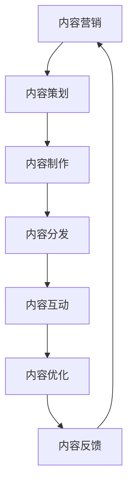

                 

# 内容营销策略：持续输出高质量的原创内容

> 关键词：内容营销, 高质量原创内容, 搜索引擎优化(SEO), 内容分析与优化, 内容分发与推广, 用户交互与反馈

## 1. 背景介绍

### 1.1 问题由来

在当今数字化时代，内容营销已成为企业品牌建设、产品推广、用户互动不可或缺的一部分。但随着互联网信息的爆炸性增长，如何在海量内容中脱颖而出，成为企业面临的重大挑战。高质量的原创内容，不仅能够显著提升搜索引擎排名（SEO），增强用户体验，还能有效提升品牌价值和用户粘性。然而，维持高品质的原创内容生产并非易事，尤其是在资源有限的情况下，如何系统化、持续化地输出优质内容，成为众多企业亟需解决的难题。

### 1.2 问题核心关键点

高质量原创内容的持续输出，需要依赖一套完善的内容策略和工具方法。核心关键点包括：

- **内容类型多样化**：根据不同的用户需求，提供形式多样的内容，如图文、视频、音频等。
- **内容质量严格把关**：确保内容准确、有价值，避免低俗、虚假信息。
- **内容策略精细化**：制定详细的内容计划，涵盖内容选题、制作、分发等环节，提高效率和效果。
- **内容分发渠道精准化**：利用数据驱动的方式，精准推送给目标用户群体，提升互动率。
- **内容反馈闭环**：及时收集用户反馈，调整优化内容策略，形成良性循环。

## 2. 核心概念与联系

### 2.1 核心概念概述

为更好地理解如何持续输出高质量的原创内容，本节将介绍几个关键概念及其联系：

- **内容营销（Content Marketing）**：通过创造和分发有价值、相关且一致的内容，吸引和保留明确的受众群体，最终驱动受众与品牌互动，并产生商业价值的过程。
- **高质量原创内容（High-Quality Original Content）**：内容须具备信息价值、创意独特、视觉吸引等特点，满足受众的真实需求。
- **搜索引擎优化（SEO）**：通过优化网站内容、结构和链接，提高搜索引擎的自然排名，增加网站流量和曝光度。
- **内容分析与优化（Content Analysis & Optimization）**：使用数据分析工具，对内容表现进行评估，优化内容策略，提高效果。
- **内容分发与推广（Content Distribution & Promotion）**：通过不同的渠道和策略，将内容精准推送给目标用户，提升互动和转化率。
- **用户交互与反馈（User Interaction & Feedback）**：收集用户对内容的互动数据，用于优化内容和策略，提升用户体验。

这些概念相互关联，共同构成了内容营销的整体框架，帮助企业在内容生产、发布和互动中实现高效、高质、高互动的目标。

### 2.2 核心概念原理和架构的 Mermaid 流程图



此图表展示了内容营销的核心流程：内容策划、制作、分发、互动、优化和反馈。每一个环节都密切联系，形成了系统的闭环，有助于持续提升内容质量和效果。

## 3. 核心算法原理 & 具体操作步骤

### 3.1 算法原理概述

持续输出高质量的原创内容，涉及一系列复杂且相互依赖的算法和步骤。其核心算法原理包括以下几个方面：

- **内容策划算法**：基于用户兴趣和行为数据，使用协同过滤、分类算法等技术，确定潜在的内容选题和主题。
- **内容生成算法**：利用自然语言处理（NLP）技术，自动生成高质量的文章、视频脚本等。
- **内容分发算法**：通过推荐系统、广告投放等技术，将内容精准推送给目标用户。
- **内容互动算法**：通过情感分析、用户画像等技术，实时收集用户对内容的反馈，动态调整内容策略。
- **内容优化算法**：通过A/B测试、回归分析等方法，持续优化内容的质量和效果。

### 3.2 算法步骤详解

#### 3.2.1 内容策划

1. **数据收集**：从网站、社交媒体、用户反馈等渠道收集数据，构建用户兴趣和行为画像。
2. **选题生成**：使用协同过滤、标签分类等算法，生成潜在的热门主题和选题。
3. **选题筛选**：根据用户画像和品牌策略，筛选出合适的选题，形成详细的内容计划。

#### 3.2.2 内容制作

1. **内容生成**：利用NLP技术自动生成内容，或通过人工撰写。
2. **内容审核**：确保内容质量，避免低俗、虚假信息，确保准确性、权威性和独特性。
3. **内容优化**：使用SEO优化策略，提升内容的搜索排名和点击率。

#### 3.2.3 内容分发

1. **渠道选择**：选择与目标用户匹配度高的分发渠道，如社交媒体、邮件、博客等。
2. **内容推送**：通过推荐算法和广告投放技术，精准推送内容给目标用户。
3. **分发效果监控**：实时监控分发效果，调整策略以提升互动率和转化率。

#### 3.2.4 内容互动

1. **互动数据收集**：收集用户对内容的点赞、评论、分享等互动数据。
2. **情感分析**：使用情感分析技术，了解用户对内容的情感倾向。
3. **用户画像更新**：根据互动数据，更新用户画像，调整内容策略。

#### 3.2.5 内容优化

1. **效果评估**：使用回归分析等方法，评估内容的实际效果。
2. **内容调整**：根据评估结果，优化内容的格式、主题和风格，提升用户满意度。
3. **策略调整**：根据效果评估，调整内容策划和分发的策略，形成闭环优化。

### 3.3 算法优缺点

高质量原创内容的持续输出算法，具有以下优点：

- **高效性**：自动化生成和分发的过程，显著提高内容生产效率，降低人力成本。
- **精准性**：基于数据分析的选题和分发策略，确保内容精准触达目标用户。
- **持续性**：通过不断优化和反馈，形成良性循环，保证内容的高质量和用户粘性。

但同时也存在一些缺点：

- **初期投入高**：需要投入大量的数据收集和算法调优工作。
- **算法依赖性强**：算法效果的好坏直接影响内容的产出和分发。
- **用户反馈滞后**：部分内容策略的调整，需要一定时间来观察效果。

### 3.4 算法应用领域

内容策划、制作、分发、互动和优化算法，广泛应用于以下几个领域：

1. **数字营销**：通过内容策略和SEO优化，提升品牌曝光和用户互动。
2. **广告投放**：精准推送广告内容，提升点击率和转化率。
3. **社交媒体管理**：自动生成和发布社交媒体内容，提高用户参与度。
4. **企业新闻发布**：定期发布高质量的企业新闻，提升企业形象和品牌信任度。
5. **内容电商**：结合产品推荐和内容营销，提升销售额和用户满意度。
6. **在线教育**：制作和发布高质量的在线教育内容，吸引用户参与和付费。

## 4. 数学模型和公式 & 详细讲解 & 举例说明

### 4.1 数学模型构建

在内容营销中，数学模型主要用于内容策划和效果评估。以下是几个典型的数学模型：

1. **协同过滤模型**：用于推荐系统，通过用户行为数据推荐内容。公式表示为：
   $$
   r_{ui} = \frac{1}{1 + \sum_{j \in N(u)} \frac{e_{uj} \cdot e_{ji}}{a + \sum_{k \in N(j)} e_{kj} \cdot e_{ki}}
   $$
   其中 $r_{ui}$ 为用户 $u$ 对内容 $i$ 的评分，$N(u)$ 和 $N(j)$ 分别为用户 $u$ 和内容 $j$ 的邻居集合。

2. **情感分析模型**：用于评估用户对内容的情感倾向。公式表示为：
   $$
   p(c_j | c_i, w) = \frac{P(c_j) \prod_{t=1}^T \frac{P(x_{it} | c_i, w)}{P(x_{it} | c_j, w)}}
   $$
   其中 $c_j$ 为内容的情感标签，$w$ 为情感分析词库，$T$ 为文本长度，$x_{it}$ 为文本第 $i$ 个词的词向量表示。

3. **回归模型**：用于评估内容的实际效果，如点击率、转化率等。公式表示为：
   $$
   y = \beta_0 + \beta_1 x_1 + \beta_2 x_2 + \ldots + \beta_n x_n + \epsilon
   $$
   其中 $y$ 为效果指标，$\beta$ 为系数，$x$ 为影响因素，$\epsilon$ 为误差项。

### 4.2 公式推导过程

#### 4.2.1 协同过滤模型推导

协同过滤模型基于用户行为数据，通过相似度计算推荐内容。设用户 $u$ 对内容 $i$ 的评分矩阵为 $R$，$N(u)$ 为 $u$ 的邻居集合，则用户 $u$ 对内容 $i$ 的推荐评分 $r_{ui}$ 为：
$$
r_{ui} = \frac{\sum_{j \in N(u)} \frac{e_{uj} \cdot r_{ji}}{\sqrt{d_u \cdot d_j}}}{\sqrt{\sum_{j \in N(u)} (\sum_{k \in N(j)} e_{kj} \cdot e_{ki})^2}} + b
$$
其中 $d_u$ 和 $d_j$ 为 $u$ 和 $j$ 的邻域集合大小，$b$ 为偏置项。

#### 4.2.2 情感分析模型推导

情感分析模型通过词向量表示用户对内容的情感倾向。设内容 $i$ 的情感标签为 $c_i$，用户对内容 $i$ 的情感分析结果为 $P(c_i)$，则用户对内容 $i$ 的情感倾向 $p(c_j | c_i, w)$ 为：
$$
p(c_j | c_i, w) = \frac{P(c_j) \prod_{t=1}^T \frac{P(x_{it} | c_i, w)}{P(x_{it} | c_j, w)}}
$$
其中 $P(c_j)$ 为内容 $j$ 的情感标签概率，$P(x_{it} | c_i, w)$ 为内容 $i$ 中第 $t$ 个词在情感分类 $c_i$ 和词库 $w$ 下的条件概率，$T$ 为文本长度。

#### 4.2.3 回归模型推导

回归模型用于评估内容的实际效果，如点击率、转化率等。设效果指标 $y$ 为内容点击次数，$\beta_0$ 和 $\beta_1$ 为模型系数，$x_1$ 和 $x_2$ 为影响因素，则回归模型为：
$$
y = \beta_0 + \beta_1 x_1 + \beta_2 x_2 + \ldots + \beta_n x_n + \epsilon
$$
其中 $\beta$ 为系数，$x$ 为影响因素，$\epsilon$ 为误差项。

### 4.3 案例分析与讲解

以一个电商平台的广告投放为例，分析内容营销的关键步骤和应用模型：

1. **内容策划**：使用协同过滤模型，基于用户行为数据，推荐可能感兴趣的商品广告。
2. **内容制作**：利用NLP技术，自动生成广告文案，并进行SEO优化。
3. **内容分发**：通过推荐算法，精准推送广告内容给潜在用户。
4. **内容互动**：收集用户对广告的点击、购买等互动数据，使用情感分析模型评估广告效果。
5. **内容优化**：通过回归模型，评估广告的实际效果，并调整优化广告策略。

此案例展示了内容营销的整个流程，以及各个环节中数学模型和算法的具体应用。

## 5. 项目实践：代码实例和详细解释说明

### 5.1 开发环境搭建

在进行内容营销的开发实践时，需要先搭建好开发环境。以下是Python环境下开发环境搭建的步骤：

1. 安装Python：从官网下载并安装Python，选择合适版本的Python解释器。
2. 安装开发工具：安装PyCharm、VSCode等IDE，以及pip、git等常用工具。
3. 安装相关库：安装Pandas、Numpy、Scikit-Learn等数据处理和分析库，以及Flask、Django等Web框架。
4. 搭建开发环境：搭建虚拟环境，安装所需依赖，确保开发环境稳定可靠。

### 5.2 源代码详细实现

以下是一个使用Python实现的内容推荐系统的代码实例，展示了内容推荐和SEO优化的实现细节。

```python
from sklearn.neighbors import NearestNeighbors
from sklearn.feature_extraction.text import TfidfVectorizer
import pandas as pd

# 数据准备
data = pd.read_csv('user_behavior.csv')

# 特征提取
vectorizer = TfidfVectorizer()
X = vectorizer.fit_transform(data['content'])
y = data['label']

# 协同过滤
nn = NearestNeighbors(n_neighbors=5, algorithm='brute')
nn.fit(X)
indices = nn.kneighbors(X)[1]

# 内容推荐
def recommend_content(content, vectorizer, nn):
    X = vectorizer.transform([content])
    indices = nn.kneighbors(X)[1]
    return vectorizer.inverse_transform(indices)

# SEO优化
def optimize_content(content):
    # 具体优化策略，如关键词优化、元数据优化等
    pass

# 使用示例
content = '高质量内容推荐系统开发'
recommended_content = recommend_content(content, vectorizer, nn)
optimized_content = optimize_content(recommended_content)
```

### 5.3 代码解读与分析

上述代码中，主要展示了以下关键步骤：

1. **数据准备**：从CSV文件中读取用户行为数据。
2. **特征提取**：使用TF-IDF向量化技术，将文本内容转换为特征向量。
3. **协同过滤**：使用K近邻算法，找到与目标内容相似的内容，生成推荐内容列表。
4. **内容推荐**：定义一个推荐函数，根据目标内容和用户行为数据，生成推荐列表。
5. **SEO优化**：定义一个SEO优化函数，对推荐内容进行关键词优化等策略。

这些步骤展示了内容推荐和SEO优化的基本流程，进一步的优化需要根据具体场景进行扩展和调整。

## 6. 实际应用场景

### 6.1 智能客服

内容营销在智能客服领域有广泛应用。通过收集用户的历史咨询记录和常见问题，自动生成FAQ内容，并在智能客服系统中部署，提升客户咨询体验和满意度。

### 6.2 产品推荐

电商平台利用用户行为数据，自动生成商品推荐内容，通过个性化推送，提高用户点击率和购买转化率。

### 6.3 内容社交

社交媒体平台通过内容推荐算法，精准推送用户感兴趣的内容，提升用户参与度和粘性。

### 6.4 品牌传播

品牌通过定期发布高质量的内容，吸引目标用户群体，提升品牌曝光和用户互动。

### 6.5 在线教育

在线教育平台通过内容策略，吸引用户参与和付费，提升课程点击率和购买率。

## 7. 工具和资源推荐

### 7.1 学习资源推荐

为了帮助开发者深入理解内容营销的技术和方法，推荐以下学习资源：

1. **《内容营销的艺术》**：经典的营销书籍，深入讲解内容营销的核心策略和实操技巧。
2. **《Python数据科学手册》**：详细介绍了Python在数据处理、分析和可视化方面的应用，是内容营销开发的必备工具书。
3. **《推荐系统实战》**：介绍了推荐系统的原理和实现，涵盖协同过滤、内容推荐等技术。
4. **Coursera内容营销课程**：斯坦福大学等知名院校开设的内容营销课程，提供系统化的知识体系。
5. **Google Analytics高级课程**：学习如何使用数据分析工具，评估内容营销的效果。

### 7.2 开发工具推荐

以下是几款用于内容营销开发的常用工具：

1. **Python**：免费且功能强大的编程语言，是内容营销开发的主流工具。
2. **Pandas**：数据处理和分析库，用于数据预处理和特征工程。
3. **Scikit-Learn**：机器学习库，用于构建推荐算法和情感分析模型。
4. **Flask**：轻量级Web框架，用于构建内容发布和管理系统。
5. **Jupyter Notebook**：交互式开发环境，便于快速迭代和实验。

### 7.3 相关论文推荐

内容营销涉及多个学科领域，以下几篇经典论文提供了深刻的理论支持：

1. **《内容即王道》**：详细介绍了内容营销的策略和实践。
2. **《推荐系统的协同过滤方法》**：介绍了协同过滤算法的基本原理和应用。
3. **《情感分析在内容推荐中的应用》**：探讨了情感分析技术在内容推荐中的应用效果。
4. **《深度学习在内容生成中的应用》**：介绍了使用深度学习技术生成高质量内容的方法。

## 8. 总结：未来发展趋势与挑战

### 8.1 研究成果总结

内容营销在提升品牌知名度、增强用户互动方面发挥了重要作用。通过高效的内容策划、制作、分发和优化，内容营销实现了低成本、高效益的目标。

### 8.2 未来发展趋势

未来内容营销将呈现以下几个发展趋势：

1. **自动化程度提高**：通过AI技术，自动化生成和分发内容，降低人力成本。
2. **个性化推荐增强**：基于用户画像和行为数据，提供更加精准和个性化的内容推荐。
3. **互动效果优化**：通过实时数据反馈，动态调整内容策略，提升用户互动和满意度。
4. **多渠道整合**：将内容营销与社交媒体、电子邮件、APP等渠道整合，形成完整的营销闭环。
5. **跨领域应用拓展**：将内容营销应用于更多垂直领域，如医疗、金融、教育等。

### 8.3 面临的挑战

尽管内容营销已取得显著成效，但在实际应用中仍面临诸多挑战：

1. **数据隐私问题**：用户数据隐私保护成为重要课题，需确保数据安全。
2. **算法偏见问题**：推荐算法需避免偏见和歧视，确保内容公平性和多样性。
3. **内容审核难度**：高质量内容的生成和审核，需要耗费大量时间和资源。
4. **用户反馈滞后**：部分内容策略的调整，需要一定时间来观察效果。
5. **技术复杂度高**：内容营销涉及多个技术领域，实现和维护较为复杂。

### 8.4 研究展望

未来的研究应在以下几个方向进行突破：

1. **跨领域内容融合**：将内容营销与更多业务领域融合，提升整体效果。
2. **实时数据分析**：利用实时数据，动态调整内容策略，提升互动效果。
3. **智能生成与审核**：使用AI技术，自动生成和审核高质量内容。
4. **用户情感洞察**：通过情感分析技术，深入理解用户需求，提升内容精准性。
5. **个性化推荐优化**：开发更高效的推荐算法，提升内容推荐效果。

## 9. 附录：常见问题与解答

### Q1: 内容营销中，如何确定内容选题？

A: 确定内容选题的关键在于数据收集和用户画像。首先，收集用户的历史行为数据和反馈数据，构建用户画像。然后，使用协同过滤、分类算法等技术，生成潜在的内容选题。最后，根据品牌策略和目标用户需求，筛选出合适的选题，形成详细的内容计划。

### Q2: 内容分发时，如何确保内容精准推送？

A: 内容精准推送的关键在于推荐算法和用户画像。首先，利用推荐算法，基于用户行为数据和兴趣标签，生成推荐列表。然后，使用用户画像，筛选出目标用户群体，精准推送内容。最后，实时监控分发效果，动态调整推荐策略。

### Q3: 内容优化时，如何评估内容效果？

A: 内容效果的评估需要综合多个指标，如点击率、转化率、互动率等。使用回归模型和A/B测试等方法，对内容进行效果评估。然后，根据评估结果，优化内容格式、主题和风格，提升用户满意度和互动效果。

### Q4: 内容营销中，如何保障用户数据隐私？

A: 保障用户数据隐私需从多个方面入手。首先，在数据收集和处理过程中，遵守相关法律法规，确保数据合法性和安全性。其次，使用数据加密和匿名化技术，保护用户隐私。最后，明确数据使用范围和权限，确保数据使用透明。

### Q5: 如何提升内容营销的自动化程度？

A: 提升内容营销的自动化程度，需使用AI技术和自动化工具。首先，使用自然语言处理技术，自动生成和优化内容。其次，使用自动化工具，如推荐系统、广告投放平台，提升内容分发效率。最后，使用实时数据分析工具，动态调整内容策略，形成自动化闭环。

---

作者：禅与计算机程序设计艺术 / Zen and the Art of Computer Programming

