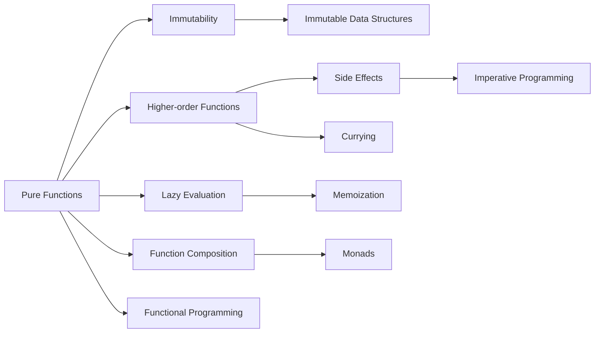

                 

# 函数式编程：理论与实践

> 关键词：函数式编程,纯函数,不可变性,高阶函数,函数组合,副作用,惰性求值,并行计算,并发编程

## 1. 背景介绍

函数式编程（Functional Programming, FP）是一种编程范式，以函数作为基本构建单元，强调函数的无副作用、不可变性、高阶函数等特性。随着函数式编程理念在各类编程语言和框架中的广泛应用，它已经成为现代软件开发中不可或缺的一部分。本文将深入探讨函数式编程的核心概念与技术，结合实际案例，展示其在软件开发和系统设计中的应用。

### 1.1 问题由来
在传统的面向过程（Procedural Programming）和面向对象（Object-oriented Programming, OOP）范式下，数据和行为混杂在一起，导致代码的可读性、可维护性以及可测试性都存在一定的问题。函数式编程则通过引入纯函数、不可变性、高阶函数等概念，提供了一种更为清晰、直观的编程思路。

### 1.2 问题核心关键点
函数式编程的核心点主要包括以下几个方面：
- 纯函数（Pure Functions）：输入相同则输出相同，没有副作用，不会改变外部状态。
- 不可变性（Immutability）：数据一旦创建，无法被改变，所有操作都在原有数据基础上生成新的数据。
- 高阶函数（Higher-order Functions）：函数可以作为参数或返回值，实现抽象和复用。
- 惰性求值（Lazy Evaluation）：只有在需要时才进行计算，避免不必要的计算开销。
- 副作用（Side Effects）：对外部状态有影响的函数调用，例如打印、修改全局变量等。
- 函数组合（Function Composition）：通过组合多个函数，实现复杂功能的复用。

通过深入理解这些核心概念，我们可以更好地把握函数式编程的特点与优势。

### 1.3 问题研究意义
函数式编程的应用范围非常广泛，无论是大型系统设计还是微服务架构，都可以看到它的身影。其主要意义在于：

1. 提高代码的可读性：纯函数和不可变性使代码易于理解、修改和维护。
2. 增强代码的可测试性：无副作用使得单元测试更加可靠。
3. 提升系统的可复用性：高阶函数和函数组合使得代码模块化程度更高，易于复用。
4. 增强系统的可扩展性：函数式编程更易与其他编程范式融合，形成混合编程风格。
5. 支持并发和并行计算：不可变性和惰性求值有助于避免线程安全问题，提高并发性能。

## 2. 核心概念与联系

### 2.1 核心概念概述

为更好地理解函数式编程，本节将介绍几个密切相关的核心概念：

- 纯函数：给定相同输入，输出始终相同，没有副作用。
- 不可变性：数据不可被修改，所有操作都在原有数据基础上生成新的数据。
- 高阶函数：函数作为参数或返回值，实现抽象和复用。
- 惰性求值：只有在需要时才进行计算，避免不必要的计算开销。
- 副作用：对外部状态有影响的函数调用，如打印、修改全局变量等。
- 函数组合：通过组合多个函数，实现复杂功能的复用。

这些核心概念之间的逻辑关系可以通过以下Mermaid流程图来展示：



这个流程图展示了大语言模型的核心概念及其之间的关系：

1. 纯函数和不可变性是大语言模型的基础特性。
2. 高阶函数和函数组合实现了代码的抽象和复用。
3. 惰性求值有助于避免不必要的计算开销。
4. 副作用是面向过程编程的特性，需要尽量避免。
5. 函数式编程是一种综合了纯函数、不可变性、高阶函数等特性的编程范式。
6. 与传统编程范式相比，函数式编程具有更高的可读性和可维护性。

## 3. 核心算法原理 & 具体操作步骤
### 3.1 算法原理概述

函数式编程的算法原理相对简单，其主要思想是将计算看作对纯函数的连续组合。在函数式编程中，数据的变换是通过一系列纯函数实现的，每个纯函数只依赖输入，不改变外部状态。

函数式编程中的核心操作包括函数组合、柯里化、惰性求值等。函数组合是将多个函数组合起来，实现复杂功能的抽象。柯里化是将多参数函数转换为一系列单参数函数的过程。惰性求值则是在需要时才进行计算，避免不必要的计算开销。

### 3.2 算法步骤详解

以下是一个简单的示例，展示如何通过函数式编程实现阶乘计算：

```javascript
function factorial(n) {
    if (n === 0) {
        return 1;
    } else {
        return n * factorial(n - 1);
    }
}

console.log(factorial(5)); // 120
```

在这个例子中，我们通过递归调用了函数 `factorial` 来计算阶乘。每次调用时，将 `n` 作为参数传入，直到 `n` 等于 0 时返回 1。这个过程中，我们利用了函数的递归调用和纯函数的特性。

### 3.3 算法优缺点

函数式编程有以下优点：

1. 代码简洁清晰：纯函数和不可变性使代码易于理解、修改和维护。
2. 易于测试：无副作用使得单元测试更加可靠。
3. 支持并发和并行计算：不可变性和惰性求值有助于避免线程安全问题，提高并发性能。
4. 提高代码复用性：高阶函数和函数组合使得代码模块化程度更高，易于复用。

同时，函数式编程也存在一定的局限性：

1. 学习曲线较陡：函数式编程的理念和语法与传统编程范式有所不同，需要一定的学习成本。
2. 性能问题：纯函数和不可变性可能导致函数调用频繁，增加计算开销。
3. 难以处理复杂数据结构：函数式编程处理复杂数据结构（如树、图等）较为困难。
4. 副作用处理：某些程序逻辑必须依赖副作用才能实现，难以直接迁移到函数式编程。

尽管存在这些局限性，但函数式编程作为一种编程范式，其思想和方法在现代软件开发中得到了广泛应用。

### 3.4 算法应用领域

函数式编程在许多领域都有应用，以下是几个典型场景：

1. 数据处理：函数式编程适用于数据变换、过滤、映射等操作，常用于大数据处理和数据科学。
2. 并发编程：函数式编程的不可变性和惰性求值特性支持并发和并行计算，常用于分布式系统和微服务架构。
3. 安全性：函数式编程避免了副作用，有助于提升代码的安全性。
4. 测试：函数式编程的纯函数特性使得单元测试更加容易设计和执行。
5. 函数式编程语言：许多函数式编程语言（如Haskell、Scala、Erlang等）已经广泛应用于学术和工业界。

## 4. 数学模型和公式 & 详细讲解  
### 4.1 数学模型构建

函数式编程中的数学模型主要基于递归和组合。以下是一个简单的数学模型：

1. 基本运算符：加减乘除、幂运算等。
2. 复合运算符：逻辑运算、条件运算、函数组合等。

### 4.2 公式推导过程

以下是一个示例，展示如何通过函数式编程实现斐波那契数列计算：

```javascript
function fibonacci(n) {
    if (n === 0 || n === 1) {
        return n;
    } else {
        return fibonacci(n - 1) + fibonacci(n - 2);
    }
}

console.log(fibonacci(10)); // 55
```

在这个例子中，我们通过递归调用了函数 `fibonacci` 来计算斐波那契数列。每次调用时，将 `n` 作为参数传入，直到 `n` 等于 0 或 1 时返回 `n`。这个过程中，我们利用了函数的递归调用和纯函数的特性。

### 4.3 案例分析与讲解

函数式编程在实际开发中有着广泛的应用。以下是一个典型的例子：

1. 函数组合：
   ```javascript
   const compose = (f, g) => (x) => f(g(x));
   
   const addOne = (x) => x + 1;
   const double = (x) => x * 2;
   
   const composed = compose(double, addOne);
   
   console.log(composed(5)); // 12
   ```
   在这个例子中，我们定义了两个函数 `addOne` 和 `double`，分别实现了加一和乘二的功能。然后，通过函数组合 `compose`，将这两个函数组合起来，实现先加一后乘二的功能。

2. 柯里化：
   ```javascript
   function curry(fn) {
       return function curried(...args) {
           if (args.length >= fn.length) {
               return fn.apply(this, args);
           } else {
               return function(...args2) {
                   return curried.apply(this, args.concat(args2));
               }
           }
       };
   }
   
   function multiply(x, y) {
       return x * y;
   }
   
   const curriedMultiply = curry(multiply);
   
   console.log(curriedMultiply(2)(3)); // 6
   ```
   在这个例子中，我们定义了一个函数 `curry`，实现了柯里化。然后，定义了一个函数 `multiply`，实现了乘法功能。最后，通过柯里化，将 `multiply` 函数转换为一系列单参数函数，实现先传一个参数，再传另一个参数的调用方式。

## 5. 项目实践：代码实例和详细解释说明
### 5.1 开发环境搭建

在进行函数式编程实践前，我们需要准备好开发环境。以下是使用JavaScript进行函数式编程的环境配置流程：

1. 安装Node.js：从官网下载并安装Node.js，用于运行JavaScript代码。
2. 安装TypeScript：通过npm安装TypeScript，支持JavaScript静态类型检查和编译。
3. 安装相关的IDE或编辑器，如Visual Studio Code、Atom等。

### 5.2 源代码详细实现

这里我们以柯里化为例，展示如何通过函数式编程实现：

```javascript
function curry(fn) {
    return function curried(...args) {
        if (args.length >= fn.length) {
            return fn.apply(this, args);
        } else {
            return function(...args2) {
                return curried.apply(this, args.concat(args2));
            }
        }
    };
}

function multiply(x, y) {
    return x * y;
}

const curriedMultiply = curry(multiply);

console.log(curriedMultiply(2)(3)); // 6
```

在这个例子中，我们定义了一个函数 `curry`，实现了柯里化。然后，定义了一个函数 `multiply`，实现了乘法功能。最后，通过柯里化，将 `multiply` 函数转换为一系列单参数函数，实现先传一个参数，再传另一个参数的调用方式。

### 5.3 代码解读与分析

让我们再详细解读一下关键代码的实现细节：

1. 函数 `curry`：定义一个函数，用于实现柯里化。该函数接受一个函数作为参数，返回一个新的函数。
2. 函数 `curried`：定义一个函数，用于实现柯里化的具体逻辑。该函数接受一个或多个参数，并返回一个新的函数。
3. 函数 `multiply`：定义一个函数，用于实现乘法功能。
4. 函数调用：通过柯里化的函数 `curriedMultiply`，实现先传一个参数，再传另一个参数的调用方式。

## 6. 实际应用场景

函数式编程的应用范围非常广泛，以下是几个典型的应用场景：

1. 数据处理：函数式编程适用于数据变换、过滤、映射等操作，常用于大数据处理和数据科学。
2. 并发编程：函数式编程的不可变性和惰性求值特性支持并发和并行计算，常用于分布式系统和微服务架构。
3. 安全性：函数式编程避免了副作用，有助于提升代码的安全性。
4. 测试：函数式编程的纯函数特性使得单元测试更加容易设计和执行。
5. 函数式编程语言：许多函数式编程语言（如Haskell、Scala、Erlang等）已经广泛应用于学术和工业界。

## 7. 工具和资源推荐
### 7.1 学习资源推荐

为了帮助开发者系统掌握函数式编程的理论基础和实践技巧，这里推荐一些优质的学习资源：

1. 《函数式编程：原理与设计》：作者Alan Mycroft，系统介绍了函数式编程的基本概念、核心思想和实际应用。
2. 《Eloquent JavaScript》：作者Marijn Haverbeke，介绍了JavaScript的基本语法和函数式编程技巧。
3. 《Functional Programming with JavaScript》：作者J-key，介绍了JavaScript的函数式编程特性和常见模式。
4. Coursera上的《Functional Programming in JavaScript》课程：由Khan Academy提供，介绍了函数式编程的基本概念和实践技巧。
5. Udemy上的《Learn Functional Programming with JavaScript》课程：由FreeCodeCamp提供，介绍了函数式编程的基本概念和实践技巧。

通过对这些资源的学习实践，相信你一定能够快速掌握函数式编程的精髓，并用于解决实际的编程问题。

### 7.2 开发工具推荐

高效的开发离不开优秀的工具支持。以下是几款用于函数式编程开发的常用工具：

1. Visual Studio Code：轻量级的代码编辑器，支持TypeScript和JavaScript等多种语言。
2. Atom：开源的代码编辑器，支持TypeScript和JavaScript等多种语言。
3. Haskell：纯函数式编程语言，支持丰富的函数式编程特性。
4. Scala：混合式编程语言，支持函数式编程和面向对象编程。
5. Erlang：并发编程语言，支持函数式编程特性和Actor模型。

合理利用这些工具，可以显著提升函数式编程的开发效率，加快创新迭代的步伐。

### 7.3 相关论文推荐

函数式编程的研究涉及许多前沿领域，以下是几篇奠基性的相关论文，推荐阅读：

1. "Pure Functional Programming" by H.B. Mann and G. L. Strang：介绍了纯函数式编程的基本概念和核心思想。
2. "Side Effects in Functional Programming" by John Kulik：介绍了副作用在函数式编程中的处理方式和技巧。
3. "Functional Programming for Software Engineers" by Felix Filbey：介绍了函数式编程在软件开发中的应用和实践技巧。
4. "The Lambda Calculus" by Alonzo Church：介绍了函数式编程的数学基础和核心思想。
5. "Functional Programming in Haskell" by Bill Ware：介绍了Haskell的函数式编程特性和实际应用。

这些论文代表了大语言模型函数式编程的发展脉络。通过学习这些前沿成果，可以帮助研究者把握学科前进方向，激发更多的创新灵感。

## 8. 总结：未来发展趋势与挑战

### 8.1 总结

本文对函数式编程的核心概念与技术进行了全面系统的介绍。首先阐述了函数式编程的研究背景和意义，明确了函数式编程在软件开发中的重要价值。其次，从原理到实践，详细讲解了函数式编程的数学模型和操作步骤，给出了函数式编程任务开发的完整代码实例。同时，本文还广泛探讨了函数式编程在数据处理、并发编程、测试和函数式编程语言等众多领域的应用前景，展示了函数式编程范式的广泛应用。

通过本文的系统梳理，可以看到，函数式编程作为一种编程范式，其思想和方法在现代软件开发中得到了广泛应用。未来，伴随函数式编程理念和技术的不断发展，函数式编程必将在更多的场景中得到应用，为软件系统的构建带来新的思路和方法。

### 8.2 未来发展趋势

展望未来，函数式编程的发展趋势主要体现在以下几个方面：

1. 更多编程语言的融合：函数式编程与其他编程范式（如面向对象编程、过程式编程等）的融合，形成混合编程风格。
2. 更好的工具支持：更多的IDE和开发工具将支持函数式编程特性，提升开发效率和代码质量。
3. 更丰富的函数式编程语言：更多的新兴编程语言将支持函数式编程特性，拓展函数式编程的应用场景。
4. 更高效的语言实现：函数式编程语言的实现将进一步优化，提升执行效率和代码性能。
5. 更广泛的应用领域：函数式编程将在更多领域（如人工智能、大数据、金融等）得到应用，提升系统性能和可扩展性。

### 8.3 面临的挑战

尽管函数式编程具有许多优势，但在实际应用中仍面临一些挑战：

1. 学习曲线较陡：函数式编程的理念和语法与传统编程范式有所不同，需要一定的学习成本。
2. 性能问题：纯函数和不可变性可能导致函数调用频繁，增加计算开销。
3. 难以处理复杂数据结构：函数式编程处理复杂数据结构（如树、图等）较为困难。
4. 副作用处理：某些程序逻辑必须依赖副作用才能实现，难以直接迁移到函数式编程。

尽管存在这些局限性，但函数式编程作为一种编程范式，其思想和方法在现代软件开发中得到了广泛应用。未来，伴随函数式编程理念和技术的不断发展，这些挑战终将一一被克服，函数式编程必将在构建安全、可靠、可扩展的软件系统中扮演越来越重要的角色。

### 8.4 研究展望

未来的函数式编程研究需要在以下几个方面寻求新的突破：

1. 探索更高效的语言实现：优化函数式编程语言的执行效率，提升代码性能。
2. 开发更丰富的函数式编程语言：拓展函数式编程的应用场景，支持更多的编程特性。
3. 结合其他编程范式：将函数式编程与其他编程范式（如面向对象编程、过程式编程等）进行融合，形成混合编程风格。
4. 引入更先进的数学工具：引入更多先进的数学工具和算法，提升函数式编程的计算能力和应用范围。
5. 支持更广泛的数据处理：开发更多的函数式编程工具和库，支持大规模数据的处理和分析。

这些研究方向的研究和实践，必将引领函数式编程技术迈向更高的台阶，为软件开发和系统设计带来新的突破和创新。面向未来，函数式编程需要与其他编程范式和技术进行更深入的融合，共同推动现代软件开发的发展。

## 9. 附录：常见问题与解答

**Q1：函数式编程与面向对象编程有什么区别？**

A: 函数式编程与面向对象编程的主要区别在于：
1. 数据和行为的分离：函数式编程强调函数的不可变性和纯函数，而面向对象编程强调对象的状态和行为。
2. 编程范式的思想：函数式编程强调函数作为基本构建单元，而面向对象编程强调对象作为基本构建单元。
3. 编程方式：函数式编程以函数组合、柯里化等技术实现复杂功能的复用，而面向对象编程以继承、多态等技术实现代码复用。

**Q2：函数式编程是否适用于所有编程任务？**

A: 函数式编程并不适用于所有编程任务。对于一些需要副作用的编程任务，如打印、修改全局变量等，难以直接迁移到函数式编程。此外，函数式编程处理复杂数据结构（如树、图等）较为困难。因此，在实际开发中，需要根据具体任务和需求，选择适合的编程范式。

**Q3：函数式编程在并发编程中的优势是什么？**

A: 函数式编程在并发编程中的优势主要体现在以下几个方面：
1. 无副作用：纯函数和不可变性使得函数式编程更容易实现并发编程。
2. 惰性求值：惰性求值避免了不必要的计算开销，提高了并发性能。
3. 不可变性：不可变性避免了并发编程中的数据竞争和线程安全问题，提高了系统的稳定性。

**Q4：如何处理函数式编程中的副作用？**

A: 函数式编程中的副作用可以通过以下方式处理：
1. 副作用封装：将副作用封装在专门的函数中，避免对全局状态的修改。
2. 函数式数据结构：使用不可变的数据结构，避免对原有数据的修改。
3. 显式控制：通过显式控制副作用，确保其在特定的条件下执行。
4. 函数式编程语言：一些函数式编程语言（如Erlang、Scala等）提供了对副作用的支持，可以在特定条件下执行副作用函数。

通过以上方式，可以有效地处理函数式编程中的副作用，提升代码的可读性和可维护性。

**Q5：函数式编程在实际开发中如何应用？**

A: 函数式编程在实际开发中可以应用到以下几个方面：
1. 数据处理：函数式编程适用于数据变换、过滤、映射等操作，常用于大数据处理和数据科学。
2. 并发编程：函数式编程的不可变性和惰性求值特性支持并发和并行计算，常用于分布式系统和微服务架构。
3. 安全性：函数式编程避免了副作用，有助于提升代码的安全性。
4. 测试：函数式编程的纯函数特性使得单元测试更加容易设计和执行。
5. 函数式编程语言：许多函数式编程语言（如Haskell、Scala、Erlang等）已经广泛应用于学术和工业界。

通过合理利用函数式编程的特性和工具，可以在实际开发中提升代码的可读性、可维护性和并发性能，提高系统的稳定性和安全性。

---

作者：禅与计算机程序设计艺术 / Zen and the Art of Computer Programming

