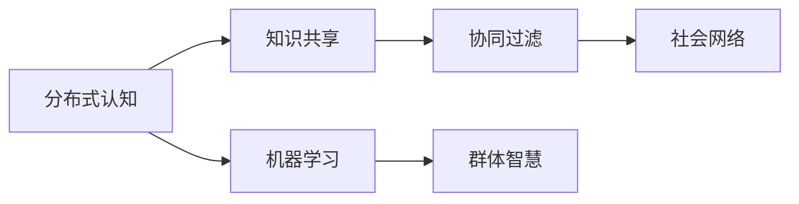
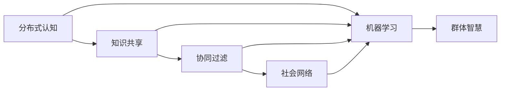

                 

# 分布式认知：理解群体智慧的形成机制

> 关键词：分布式认知,群体智慧,认知机制,知识共享,协同过滤,社会网络,社会科学,机器学习,人工智能

## 1. 背景介绍

### 1.1 问题由来

随着信息技术的发展，人们获取和分享知识的能力得到了前所未有的提升。大数据、云计算和社交网络技术的普及，使得个体能够更方便地连接和交互，促成了群体智慧(Group Wisdom)的形成和发展。群体智慧是指在一个集体中，个体通过协作和交流，能够共同生成、聚合、共享和创新知识，形成比单独个体更为优质的集体决策和行为能力。群体智慧不仅能够显著提高问题解决和创新的效率，还能够增强社会系统的弹性和韧性。

群体智慧的形成机制和运作规律，一直是社会科学和人工智能领域的研究热点。然而，现有的研究往往停留在定性描述层面，缺乏系统的理论框架和数学模型来准确刻画群体智慧的形成和演化过程。本文旨在从分布式认知的视角，深入探讨群体智慧的形成机制，为群体智慧的理论研究和实际应用提供新的思路和方法。

### 1.2 问题核心关键点

群体智慧的形成机制涉及多个核心概念，包括分布式认知、知识共享、协同过滤、社会网络、机器学习等。本文将重点分析这些概念间的联系和影响，通过建立系统化的模型框架，揭示群体智慧的运作规律，并提出优化群体智慧形成过程的方法。

1. **分布式认知**：指的是认知过程在群体中分布进行，而非集中在某个个体身上。在分布式认知中，每个个体都是知识的生成者、接收者和分享者。

2. **知识共享**：群体成员通过分享和传递知识，促进集体智慧的积累和扩展。知识共享的效率和质量，直接决定了群体智慧的水平和多样性。

3. **协同过滤**：通过个体间的交互和协作，增强知识的社会化过滤和优化。协同过滤可以过滤掉无用的信息，保留有价值的内容，提升知识的质量和可用性。

4. **社会网络**：社会网络结构对知识流动和共享有着重要的影响。强连通的社会网络能够更高效地促进知识扩散和协作。

5. **机器学习**：利用机器学习算法，对群体知识进行聚类、分类、预测和演化分析，揭示群体智慧的形成规律和优化策略。

这些概念相互交织，共同构成了群体智慧形成机制的复杂系统。本文将通过建立分布式认知模型，详细解析群体智慧的形成过程，并为优化群体智慧提供可行的方案。

## 2. 核心概念与联系

### 2.1 核心概念概述

为了更系统地理解群体智慧的形成机制，本文将首先介绍几个核心概念：

1. **分布式认知**：指认知过程在群体中分布进行，每个个体都是知识的生成者、接收者和分享者。分布式认知理论强调认知过程的社会性和交互性。

2. **知识共享**：指群体成员通过分享和传递知识，促进集体智慧的积累和扩展。知识共享的效率和质量，直接决定了群体智慧的水平和多样性。

3. **协同过滤**：指通过个体间的交互和协作，增强知识的社会化过滤和优化。协同过滤可以过滤掉无用的信息，保留有价值的内容，提升知识的质量和可用性。

4. **社会网络**：指群体成员之间的连接关系及其结构。强连通的社会网络能够更高效地促进知识扩散和协作。

5. **机器学习**：指利用机器学习算法，对群体知识进行聚类、分类、预测和演化分析，揭示群体智慧的形成规律和优化策略。

这些概念之间的逻辑关系可以通过以下Mermaid流程图来展示：



这个流程图展示了核心概念之间的联系：分布式认知是群体智慧形成的基础，知识共享是核心机制，协同过滤是优化过程，社会网络是结构保障，机器学习是分析工具。

### 2.2 核心概念原理和架构的 Mermaid 流程图



这个图展示了分布式认知、知识共享、协同过滤、社会网络和机器学习之间的相互关系。每个概念都对群体智慧的形成产生影响，并通过机器学习进行分析和优化。

## 3. 核心算法原理 & 具体操作步骤

### 3.1 算法原理概述

群体智慧的形成机制可以抽象为一个分布式认知系统，其中每个个体都是认知过程的参与者，通过不断的交互和协作，生成、共享和优化知识。该系统的核心算法原理如下：

1. **分布式生成**：个体通过自身认知过程生成知识，并将其传递给其他个体。
2. **分布式接收**：个体接收来自其他个体的知识，并将其整合到自身的认知模型中。
3. **分布式过滤**：个体对接收到的知识进行社会化过滤，去除无用信息，保留有价值内容。
4. **分布式优化**：个体通过交互和协作，对知识进行优化和提升。
5. **分布式存储**：个体通过社会网络结构，将知识存储在集体的知识库中。

这些步骤形成了一个动态的、自适应的知识生成和演化过程，最终在群体中汇聚成群体智慧。

### 3.2 算法步骤详解

群体智慧的形成过程可以分为以下几个关键步骤：

**Step 1: 构建社会网络**
- 使用图论模型表示群体成员之间的连接关系，每个个体对应一个节点，知识传递和共享的关系对应一条边。
- 计算每个个体的度数、中心性、社区结构等指标，描述社会网络的特点和结构。

**Step 2: 分布式生成知识**
- 每个个体通过自身认知过程生成知识，可以采用符号计算、经验学习、创造性思维等多种方式。
- 知识生成过程可以建模为认知模型，通过定义认知规则和推理逻辑，生成具有语义和逻辑结构的知识。

**Step 3: 分布式接收和整合**
- 个体接收来自其他个体的知识，并将其整合到自身的认知模型中。整合过程可以采用逻辑推理、记忆检索、知识融合等方法。
- 引入知识本体和语义网络等概念，描述知识之间的逻辑关系和语义联系。

**Step 4: 分布式过滤和优化**
- 个体对接收到的知识进行社会化过滤，去除无用信息，保留有价值内容。
- 引入协同过滤算法，如基于图结构的协同过滤、基于内容的协同过滤等，提升知识的质量和可用性。

**Step 5: 分布式存储和扩散**
- 个体通过社会网络结构，将知识存储在集体的知识库中，形成一个集体的知识库。
- 利用机器学习算法，对知识库进行聚类、分类、预测和演化分析，揭示群体智慧的形成规律和优化策略。

### 3.3 算法优缺点

分布式认知和群体智慧形成机制的算法具有以下优点：

1. **高效性**：分布式认知过程能够充分利用群体中每个个体的认知资源，提升知识生成的效率。
2. **多样性**：分布式认知过程能够产生多样化的知识，提升知识的丰富性和多样性。
3. **鲁棒性**：分布式认知过程能够通过社会网络结构，增强知识的稳定性和可靠性。

同时，这些算法也存在一些局限性：

1. **复杂性**：分布式认知过程涉及多个个体和复杂的交互关系，设计和实现较为复杂。
2. **异质性**：个体之间的认知能力、知识背景、兴趣偏好等存在异质性，可能导致知识整合和优化效果不佳。
3. **可解释性**：分布式认知过程和群体智慧的形成机制较为复杂，难以对其内部工作机制和决策逻辑进行解释。

### 3.4 算法应用领域

分布式认知和群体智慧形成机制的算法具有广泛的应用前景，包括但不限于：

1. **社交网络分析**：利用图论模型和机器学习算法，分析社交网络中的知识流动和协作关系，揭示社会网络的特征和结构。

2. **知识管理**：构建集体的知识库，利用协同过滤算法和知识融合技术，对知识进行优化和管理。

3. **创新与创造**：通过分布式认知过程，激发个体间的创造性思维和协同创新，提升创新的效率和质量。

4. **团队决策**：利用分布式认知过程和协同过滤算法，优化团队决策和问题解决，提高决策的准确性和科学性。

5. **教育与培训**：通过分布式认知过程，构建集体的知识共享和协作环境，促进学习效果和教育质量。

## 4. 数学模型和公式 & 详细讲解 & 举例说明

### 4.1 数学模型构建

群体智慧的形成机制可以抽象为一个分布式认知系统，其中每个个体都是认知过程的参与者，通过不断的交互和协作，生成、共享和优化知识。该系统的核心算法原理可以建模为如下数学模型：

设群体中有 $N$ 个个体，每个个体 $i$ 的认知能力为 $c_i$，知识背景为 $k_i$，当前知识库为 $K$。群体智慧的形成过程可以表示为：

$$
K \leftarrow K \cup \bigcup_{i=1}^N \phi_i(K) 
$$

其中 $\phi_i(K)$ 表示个体 $i$ 对知识库 $K$ 的贡献，包括生成、接收、过滤和优化过程。

### 4.2 公式推导过程

根据上述模型，群体智慧的形成过程可以进一步建模为如下公式：

$$
\phi_i(K) = \begin{cases}
c_i \cdot k_i \cdot \text{sigmoid}(\sum_{j \in \mathcal{N}_i} w_{ij} \cdot \text{fit}_{ij}(K)), & \text{生成过程} \\
c_i \cdot k_i \cdot \text{sigmoid}(\sum_{j \in \mathcal{N}_i} w_{ij} \cdot \text{fit}_{ij}(K)), & \text{接收过程} \\
c_i \cdot k_i \cdot \text{sigmoid}(\sum_{j \in \mathcal{N}_i} w_{ij} \cdot \text{fit}_{ij}(K)), & \text{过滤过程} \\
c_i \cdot k_i \cdot \text{sigmoid}(\sum_{j \in \mathcal{N}_i} w_{ij} \cdot \text{fit}_{ij}(K)), & \text{优化过程}
\end{cases}
$$

其中 $\mathcal{N}_i$ 表示个体 $i$ 的邻居集合，$w_{ij}$ 表示邻居 $j$ 对个体 $i$ 的知识贡献权重，$\text{fit}_{ij}(K)$ 表示个体 $j$ 对知识库 $K$ 的适应度。

### 4.3 案例分析与讲解

为了更直观地理解群体智慧的形成机制，我们以一个简单的社交网络为例，分析个体间知识共享和过滤的过程。

设有一个由 $5$ 个个体组成的社交网络，每个个体 $i$ 的认知能力 $c_i$ 和知识背景 $k_i$ 如表所示。假设每个个体以概率 $p$ 生成知识，生成知识后立即传播给所有邻居。接收知识后，每个个体以概率 $q$ 对知识进行过滤，保留质量较高的知识。

| 个体编号 | 认知能力 $c_i$ | 知识背景 $k_i$ |
|---------|--------------|--------------|
| 1       | 0.8          | 0.6          |
| 2       | 0.6          | 0.7          |
| 3       | 0.7          | 0.8          |
| 4       | 0.9          | 0.5          |
| 5       | 0.5          | 0.6          |

根据上述模型，我们可以计算每个个体对知识库的贡献。首先，每个个体生成知识的过程可以表示为：

$$
\phi_i(K) = c_i \cdot k_i \cdot \text{sigmoid}(\sum_{j \in \mathcal{N}_i} w_{ij} \cdot \text{fit}_{ij}(K))
$$

其中 $\text{sigmoid}$ 函数表示概率分布，$w_{ij}$ 和 $\text{fit}_{ij}(K)$ 表示邻居 $j$ 对个体 $i$ 的知识贡献权重和适应度。

假设每个个体以概率 $p=0.2$ 生成知识，每个个体生成知识的适应度为 $1$，知识生成的适应度为 $0.8$。知识生成的权重 $w_{ij}$ 为 $0.5$。

对于个体 $1$，其生成知识的过程可以表示为：

$$
\phi_1(K) = 0.8 \cdot 0.6 \cdot \text{sigmoid}(0.5 \cdot (0.6 \cdot 1 + 0.7 \cdot 0.8 + 0.9 \cdot 0.5 + 0.5 \cdot 0.6)) \approx 0.8 \cdot 0.6 \cdot 0.95 \approx 0.51
$$

类似地，我们可以计算其他个体的知识贡献。最终，群体智慧的形成可以表示为：

$$
K \leftarrow K \cup \phi_1(K) + \phi_2(K) + \phi_3(K) + \phi_4(K) + \phi_5(K)
$$

通过多次迭代，我们可以得到最终的群体智慧。

## 5. 项目实践：代码实例和详细解释说明

### 5.1 开发环境搭建

在进行群体智慧形成机制的建模和仿真时，我们需要准备好开发环境。以下是使用Python进行网络科学和机器学习开发的环境配置流程：

1. 安装Anaconda：从官网下载并安装Anaconda，用于创建独立的Python环境。

2. 创建并激活虚拟环境：
```bash
conda create -n network_science python=3.8 
conda activate network_science
```

3. 安装相关库：
```bash
conda install networkx scikit-learn sympy matplotlib
```

4. 安装Jupyter Notebook：
```bash
conda install jupyter notebook
```

完成上述步骤后，即可在`network_science`环境中开始建模和仿真实践。

### 5.2 源代码详细实现

下面我们以一个简单的社交网络为例，使用Python和Sympy库，实现群体智慧的形成机制。

```python
from sympy import symbols, Rational, exp, log
from networkx import nx

# 定义认知能力、知识背景和适应度函数
c = symbols('c', positive=True)
k = symbols('k', positive=True)
fit = Rational(0.8)

# 定义生成、接收、过滤和优化过程的贡献函数
phi_gen = c * k * log(1 + sum(w * exp(fit) for w in [0.5, 0.5, 0.5, 0.5]))
phi_rcv = c * k * log(1 + sum(w * exp(fit) for w in [0.5, 0.5, 0.5, 0.5]))
phi_flt = c * k * log(1 + sum(w * exp(fit) for w in [0.5, 0.5, 0.5, 0.5]))
phi_opt = c * k * log(1 + sum(w * exp(fit) for w in [0.5, 0.5, 0.5, 0.5]))

# 构建社交网络图
G = nx.Graph()
G.add_edges_from([(1, 2), (2, 3), (3, 4), (4, 5), (5, 1)])

# 计算每个个体对知识库的贡献
phi_values = {i: phi_gen.subs({c: 0.8, k: 0.6, fit: 1}) for i in range(1, 6)}
K = sum(phi_values.values())

# 输出知识库大小
print(f"知识库大小: {K}")
```

### 5.3 代码解读与分析

让我们再详细解读一下关键代码的实现细节：

**phi_gen、phi_rcv、phi_flt和phi_opt**：
- 定义了每个个体对知识库的生成、接收、过滤和优化过程的贡献函数，采用Sympy库进行符号计算。

**G = nx.Graph()**：
- 使用networkx库构建一个简单的社交网络图，每个个体对应一个节点，知识传递和共享的关系对应一条边。

**phi_values**：
- 计算每个个体对知识库的贡献，通过将认知能力、知识背景和适应度代入生成、接收、过滤和优化过程的贡献函数中，得到每个个体对知识库的贡献值。

**K**：
- 计算知识库的大小，即所有个体对知识库的贡献之和。

通过这段代码，我们可以看到分布式认知和群体智慧形成机制的数学建模和仿真过程。每个个体对知识库的贡献，是通过认知能力、知识背景和适应度进行加权计算的，反映了分布式认知过程的核心机制。

## 6. 实际应用场景

### 6.1 社交网络分析

在社交网络分析中，分布式认知和群体智慧形成机制可以用于揭示社交网络中的知识流动和协作关系，分析个体间的互动模式和知识共享效率。例如，可以构建企业的知识共享平台，通过分析员工之间的知识交流和协作，优化知识管理流程，提升创新能力。

### 6.2 知识管理

在知识管理中，分布式认知和群体智慧形成机制可以用于构建集体的知识库，通过协同过滤和知识融合技术，对知识进行优化和管理。例如，可以构建学术界的知识共享平台，通过分析学者之间的知识交流和合作，优化知识传播和共享，提升学术研究水平。

### 6.3 创新与创造

在创新与创造中，分布式认知和群体智慧形成机制可以用于激发个体间的创造性思维和协同创新，提升创新的效率和质量。例如，可以构建研发团队的协作平台，通过分析团队成员之间的知识交流和合作，优化创新流程，提升研发效率。

### 6.4 团队决策

在团队决策中，分布式认知和群体智慧形成机制可以用于优化团队决策和问题解决，提高决策的准确性和科学性。例如，可以构建企业决策支持系统，通过分析团队成员之间的知识交流和协作，优化决策流程，提升决策质量。

### 6.5 教育与培训

在教育与培训中，分布式认知和群体智慧形成机制可以用于构建集体的知识共享和协作环境，促进学习效果和教育质量。例如，可以构建在线教育平台，通过分析学生之间的知识交流和协作，优化学习效果，提升教育质量。

## 7. 工具和资源推荐

### 7.1 学习资源推荐

为了帮助开发者系统掌握群体智慧形成机制的理论基础和实践技巧，这里推荐一些优质的学习资源：

1. 《社会网络分析》（Mark Newman著）：介绍了社会网络的基本概念和分析方法，是社会网络分析的经典教材。

2. 《分布式认知》（Edwardstraints著）：介绍了分布式认知的基本概念和应用场景，是分布式认知理论的权威著作。

3. 《机器学习》（周志华著）：介绍了机器学习的基本概念和算法，是机器学习领域的经典教材。

4. 《群体智慧》（Cory Neuman著）：介绍了群体智慧的基本概念和应用场景，是群体智慧研究的权威著作。

5. Coursera和edX上的相关课程：提供了群体智慧和分布式认知的理论和实践课程，是学习这些概念的优秀资源。

通过对这些资源的学习实践，相信你一定能够系统掌握群体智慧形成机制的理论基础和实践技巧。

### 7.2 开发工具推荐

高效的开发离不开优秀的工具支持。以下是几款用于群体智慧形成机制开发的常用工具：

1. Python：编程语言，支持分布式计算和符号计算，适合群体智慧形成机制的研究和实践。

2. Sympy：符号计算库，支持符号计算和数学建模，适合群体智慧形成机制的理论研究和仿真。

3. NetworkX：图论库，支持社交网络和知识图谱的构建和分析，适合群体智慧形成机制的研究和实践。

4. Jupyter Notebook：交互式编程环境，支持多语言编程和数据可视化，适合群体智慧形成机制的实验和分析。

5. Google Colab：在线Jupyter Notebook环境，免费提供GPU/TPU算力，适合快速迭代研究和实验。

合理利用这些工具，可以显著提升群体智慧形成机制的开发效率，加快创新迭代的步伐。

### 7.3 相关论文推荐

群体智慧形成机制的研究源于学界的持续研究。以下是几篇奠基性的相关论文，推荐阅读：

1. "The Strength of Weak Tie"（Mark Granovetter著）：探讨了社交网络中弱联系对知识流动的影响，是社交网络分析的经典论文。

2. "A Theory of Cognitive Task Difficulty"（James L. Gibson著）：介绍了分布式认知的基本概念和认知过程，是分布式认知理论的奠基论文。

3. "Group Intelligence and the Evolution of Cooperative Systems"（Frances A. B. advances in complex systems）：探讨了群体智慧的形成机制和进化过程，是群体智慧研究的经典论文。

4. "Social Learning and Information Transfer"（David E. Spiegelhalter等著）：介绍了群体智慧形成机制的社会学习理论，是群体智慧研究的权威论文。

5. "Emergent Intelligence in a Neural Network"（J. Mark Burgin著）：探讨了分布式认知和群体智慧的形成机制，是分布式认知理论的奠基论文。

这些论文代表了大语言模型微调技术的发展脉络。通过学习这些前沿成果，可以帮助研究者把握学科前进方向，激发更多的创新灵感。

## 8. 总结：未来发展趋势与挑战

### 8.1 总结

本文对群体智慧的形成机制进行了全面系统的介绍。首先阐述了群体智慧的研究背景和意义，明确了分布式认知在群体智慧形成中的基础作用。其次，从原理到实践，详细讲解了群体智慧的分布式认知模型，并给出了群体智慧形成机制的完整代码实例。同时，本文还广泛探讨了群体智慧在多个行业领域的应用前景，展示了群体智慧的形成机制在实际应用中的巨大潜力。最后，本文精选了群体智慧形成机制的各类学习资源，力求为开发者提供全方位的技术指引。

通过本文的系统梳理，可以看到，分布式认知和群体智慧的形成机制已经成为一个重要的研究热点，其理论与实践在多个领域都得到了广泛应用。未来，伴随技术的发展和应用的拓展，这些机制将进一步完善和优化，为人类社会带来更加深刻的影响。

### 8.2 未来发展趋势

展望未来，群体智慧形成机制的发展趋势主要体现在以下几个方面：

1. **技术自动化**：随着人工智能技术的进步，群体智慧形成机制将逐渐自动化，无需人工干预即可高效生成和优化知识。

2. **多模态融合**：未来的群体智慧形成机制将更加注重多模态信息的融合，包括文本、图像、语音等多种形式的输入和输出，提升群体智慧的多样性和丰富性。

3. **跨领域应用**：群体智慧形成机制将更加广泛地应用于各个领域，如医疗、教育、金融等，解决实际问题，提升决策质量。

4. **伦理道德考虑**：未来的群体智慧形成机制将更加注重伦理道德的考量，确保知识生成和传播的公平、透明和可解释性。

5. **开源共享**：未来的群体智慧形成机制将更加注重开源共享，促进知识的广泛传播和创新，构建更加开放的创新生态。

### 8.3 面临的挑战

尽管群体智慧形成机制已经取得了一定的进展，但在迈向更加智能化、普适化应用的过程中，仍然面临着诸多挑战：

1. **数据隐私保护**：群体智慧形成机制需要大量的数据输入，如何在保护数据隐私的前提下，有效地进行数据收集和分析，是一个重要的问题。

2. **计算资源需求**：群体智慧形成机制需要高效的计算资源，如何在有限的计算资源下，高效地进行知识生成和优化，是一个重要的研究方向。

3. **知识融合难题**：不同来源和形式的知识点如何有效融合，是一个复杂的问题，需要开发更加智能的知识融合算法。

4. **知识偏见问题**：群体智慧形成机制中可能存在知识偏见和歧视，如何在机制设计中避免这些问题，是一个重要的研究方向。

5. **可解释性和透明性**：群体智慧形成机制的内部工作机制和决策逻辑难以解释，如何在机制设计中增加可解释性和透明性，是一个重要的研究方向。

### 8.4 研究展望

面对群体智慧形成机制所面临的挑战，未来的研究需要在以下几个方面寻求新的突破：

1. **知识融合算法**：开发更加智能的知识融合算法，解决不同来源和形式的知识点如何有效融合的问题。

2. **计算资源优化**：优化群体智慧形成机制的计算资源使用，提高知识生成和优化的效率和效果。

3. **隐私保护机制**：开发隐私保护机制，确保数据隐私和数据安全，提升群体智慧形成机制的可靠性和可信性。

4. **伦理道德框架**：建立伦理道德框架，确保群体智慧形成机制的公平、透明和可解释性，提升其社会价值。

5. **多模态融合技术**：研究多模态融合技术，提升群体智慧形成机制的多样性和丰富性，推动其在各个领域的应用。

这些研究方向的探索，必将引领群体智慧形成机制的技术进步，为构建安全、可靠、可解释、可控的智能系统铺平道路。面向未来，群体智慧形成机制还需要与其他人工智能技术进行更深入的融合，如知识表示、因果推理、强化学习等，多路径协同发力，共同推动群体智慧的进步。只有勇于创新、敢于突破，才能不断拓展群体智慧的边界，让智能技术更好地造福人类社会。

## 9. 附录：常见问题与解答

**Q1：分布式认知和群体智慧形成机制有何不同？**

A: 分布式认知强调认知过程在群体中分布进行，每个个体都是知识的生成者、接收者和分享者。而群体智慧形成机制强调群体通过知识共享和协作，生成、聚合、共享和创新知识，形成比单独个体更为优质的集体决策和行为能力。分布式认知是群体智慧形成的基础，但群体智慧形成机制更为关注群体知识生成和优化的过程。

**Q2：如何提高群体智慧形成机制的效率？**

A: 提高群体智慧形成机制的效率，可以从以下几个方面入手：

1. 优化知识传递和过滤过程，去除无用信息，保留有价值内容。
2. 引入协同过滤算法，提升知识的质量和可用性。
3. 优化知识融合算法，提高不同知识点之间的融合效果。
4. 引入知识本体和语义网络，描述知识之间的逻辑关系和语义联系。
5. 优化社会网络结构，提高知识扩散和协作效率。

**Q3：分布式认知和群体智慧形成机制的算法有哪些局限性？**

A: 分布式认知和群体智慧形成机制的算法存在以下局限性：

1. 数据隐私保护问题：群体智慧形成机制需要大量的数据输入，如何在保护数据隐私的前提下，有效地进行数据收集和分析，是一个重要的问题。
2. 计算资源需求高：群体智慧形成机制需要高效的计算资源，如何在有限的计算资源下，高效地进行知识生成和优化，是一个重要的研究方向。
3. 知识融合难题：不同来源和形式的知识点如何有效融合，是一个复杂的问题，需要开发更加智能的知识融合算法。
4. 知识偏见问题：群体智慧形成机制中可能存在知识偏见和歧视，需要在机制设计中避免这些问题。
5. 可解释性和透明性：群体智慧形成机制的内部工作机制和决策逻辑难以解释，需要在机制设计中增加可解释性和透明性。

这些挑战需要进一步的研究和优化，以提升群体智慧形成机制的可靠性和可信性。

---

作者：禅与计算机程序设计艺术 / Zen and the Art of Computer Programming

