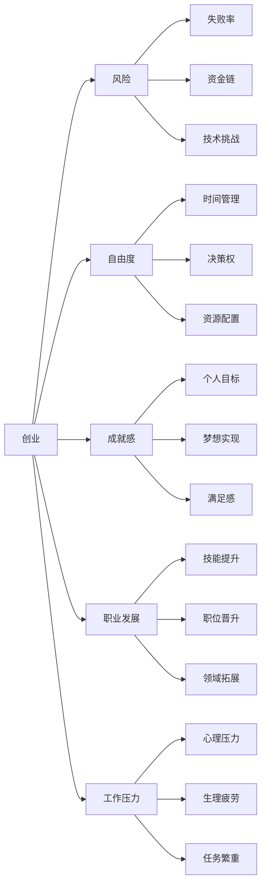

                 

## 1. 背景介绍

在科技日新月异的今天，职业选择成为了无数程序员面临的重大决策。要不要创业？还是选择稳定的工作？这是一个值得深思的问题。创业可以带来巨大的个人成就感和自由度，但也伴随着高风险和高压力。而上班则能提供稳定的收入和保障，但可能难以实现个人激情和价值。本文将探讨创业和上班两种职业路径的优劣，帮助程序员做出更明智的抉择。

## 2. 核心概念与联系

### 2.1 核心概念概述

**创业 (Entrepreneurship)**：指创建和经营一个新企业的过程。创业者通过发现市场机会、研发新产品或服务、运营管理，希望实现企业的成长和成功。

**上班 (Employment)**：指在某个公司或组织中受雇工作，领取薪水，遵守公司规章制度，为公司创造价值。

**风险 (Risk)**：指创业过程中面临的各种不确定性和潜在损失，如市场失败、资金链断裂、技术难题等。

**稳定性 (Stability)**：指上班带来的稳定收入、固定福利、工作环境稳定等。

**自由度 (Freedom)**：指创业带来的时间自由、决策自由、资源配置自由等。

**成就感 (Achievement)**：指实现个人目标和梦想所带来的满足感和自豪感。

**职业发展 (Career Development)**：指个人在职业上的成长和提升，包括技能提升、职位晋升、专业领域拓展等。

**工作压力 (Work Pressure)**：指由于工作要求高、环境竞争激烈、任务繁重等因素带来的心理和生理压力。

这些概念之间通过Mermaid流程图呈现，展示它们之间的相互影响和关系。



### 2.2 核心概念原理和架构

**创业的原理**：创业的核心在于发现市场机会，通过创新产品或服务，满足市场需求。其基本架构包括：

1. **市场调研**：了解市场需求，找到潜在客户群体。
2. **产品研发**：开发有竞争力的产品或服务，形成核心竞争力。
3. **团队组建**：组建一支高效、互补的团队，提升企业运营效率。
4. **融资管理**：获取资金支持，管理好现金流，确保企业可持续发展。
5. **市场推广**：通过营销策略推广产品，提升品牌知名度和用户粘性。
6. **运营管理**：优化内部流程，提升效率，降低成本，确保企业盈利。

**上班的原理**：上班的核心在于遵守公司规章制度，通过不断学习和工作，提升个人技能，获得职位晋升和薪资提升。其基本架构包括：

1. **岗位职责**：明确工作任务，负责具体的业务流程。
2. **技能提升**：通过培训和实践，提升专业技能和工作效率。
3. **团队协作**：与同事协作，共同完成项目目标。
4. **绩效考核**：定期评估工作表现，获得晋升机会和薪资调整。
5. **职业发展**：根据职业规划，申请更高职位或转岗。
6. **福利保障**：享受公司提供的各种福利，如健康保险、年假等。

## 3. 核心算法原理 & 具体操作步骤

### 3.1 算法原理概述

创业和上班的决策本质上是基于个人风险承受能力、职业目标、生活需求等多方面因素的综合判断。

创业：采用决策树方法，根据个人能力、市场机会、资源条件等，评估创业成功的概率和潜在收益。

上班：通过收益-风险分析，比较不同公司、不同职位的收入、福利、职业发展潜力等，做出最优选择。

### 3.2 算法步骤详解

**创业决策树**：

1. **输入**：个人能力、市场机会、资源条件。
2. **计算**：每个路径的成功概率、期望收益、潜在风险。
3. **输出**：成功概率最高的路径。

**上班收益-风险分析**：

1. **输入**：公司规模、职位、薪酬、福利、职业发展机会、工作环境。
2. **计算**：每个选项的收益、风险、稳定性。
3. **输出**：综合评分最高的选择。

### 3.3 算法优缺点

**创业的优缺点**：

- **优点**：高自由度、高成就感、无限可能、自我实现。
- **缺点**：高风险、高压力、资源投入大、失败率高。

**上班的优缺点**：

- **优点**：稳定性、保障性、低风险、团队支持、资源共享。
- **缺点**：受限自由、低成就感、职业发展受限、竞争激烈。

### 3.4 算法应用领域

- **创业**：适用于有强烈创业愿望、具备一定技术或资源储备、愿意承担高风险的程序员。
- **上班**：适用于希望获得稳定收入、享受公司福利、追求职业稳定和发展的程序员。

## 4. 数学模型和公式 & 详细讲解

### 4.1 数学模型构建

**创业成功概率模型**：

- **成功概率**：$P = \frac{R}{S}$，其中 $R$ 为成功收益，$S$ 为失败成本。
- **期望收益**：$E = \sum (R_i \times P_i)$，其中 $R_i$ 为第 $i$ 路径的收益，$P_i$ 为第 $i$ 路径的成功概率。

**上班收益-风险模型**：

- **收益**：$E = \sum (P_i \times R_i)$，其中 $P_i$ 为第 $i$ 选项的概率，$R_i$ 为第 $i$ 选项的收益。
- **风险**：$R = \sum (P_i \times C_i)$，其中 $C_i$ 为第 $i$ 选项的成本。
- **稳定性**：$S = \sum (P_i \times St_i)$，其中 $St_i$ 为第 $i$ 选项的稳定性。

### 4.2 公式推导过程

**创业成功概率公式推导**：

$$ P = \frac{R}{S} = \frac{\sum R_i \times P_i}{\sum C_i \times P_i} $$

其中，$R_i$ 为第 $i$ 路径的成功收益，$C_i$ 为第 $i$ 路径的失败成本。

**上班收益-风险公式推导**：

$$ E = \sum (P_i \times R_i) $$
$$ R = \sum (P_i \times C_i) $$
$$ S = \sum (P_i \times St_i) $$

### 4.3 案例分析与讲解

以某程序员选择创业还是选择加入大公司为例：

- **创业案例**：假设个人能力中等，市场机会良好，资源条件一般。成功概率为 0.6，期望收益为 100 万，失败成本为 50 万。
- **上班案例**：假设选择加入大公司，薪酬为 30 万/年，福利优渥，职业发展潜力高，工作环境好，但竞争激烈，稳定性为 0.7。

## 5. 项目实践：代码实例和详细解释说明

### 5.1 开发环境搭建

- **编程语言**：Python
- **开发环境**：Jupyter Notebook
- **依赖库**：numpy, pandas, matplotlib

```bash
pip install numpy pandas matplotlib
```

### 5.2 源代码详细实现

**创业决策树代码**：

```python
import numpy as np

def calculate_success_probability(R, S):
    return R / S

def calculate_expected_revenue(R, P):
    return np.sum(P * R)

# 创业案例
R1, S1 = 1000000, 500000
R2, S2 = 800000, 700000
R3, S3 = 700000, 600000
R4, S4 = 600000, 500000

P1, P2, P3, P4 = 0.6, 0.5, 0.4, 0.3

# 计算成功概率和期望收益
P1_suc = calculate_success_probability(R1, S1)
P2_suc = calculate_success_probability(R2, S2)
P3_suc = calculate_success_probability(R3, S3)
P4_suc = calculate_success_probability(R4, S4)

E1 = calculate_expected_revenue(R1, P1)
E2 = calculate_expected_revenue(R2, P2)
E3 = calculate_expected_revenue(R3, P3)
E4 = calculate_expected_revenue(R4, P4)

# 输出结果
print("创业案例 1: 成功率 %.2f%%, 期望收益 %.2f 万" % (P1_suc * 100, E1))
print("创业案例 2: 成功率 %.2f%%, 期望收益 %.2f 万" % (P2_suc * 100, E2))
print("创业案例 3: 成功率 %.2f%%, 期望收益 %.2f 万" % (P3_suc * 100, E3))
print("创业案例 4: 成功率 %.2f%%, 期望收益 %.2f 万" % (P4_suc * 100, E4))

# 选择期望收益最高的案例
max_E = max(E1, E2, E3, E4)
best_case = E1 if max_E == E1 else (E2 if max_E == E2 else (E3 if max_E == E3 else E4))

# 输出最优案例
print("最优创业案例: %d, 期望收益 %.2f 万" % (best_case, max_E))
```

**上班收益-风险代码**：

```python
def calculate_revenue(P, R):
    return np.sum(P * R)

def calculate_risk(P, C):
    return np.sum(P * C)

def calculate_stability(P, St):
    return np.sum(P * St)

# 上班案例
P1, R1 = 0.7, 300000
P2, R2 = 0.6, 350000
P3, R3 = 0.8, 250000
P4, R4 = 0.5, 280000

C1, C2, C3, C4 = 100000, 90000, 80000, 70000
St1, St2, St3, St4 = 0.6, 0.5, 0.7, 0.4

# 计算收益、风险和稳定性
E1 = calculate_revenue(P1, R1)
R1 = calculate_risk(P1, C1)
S1 = calculate_stability(P1, St1)

E2 = calculate_revenue(P2, R2)
R2 = calculate_risk(P2, C2)
S2 = calculate_stability(P2, St2)

E3 = calculate_revenue(P3, R3)
R3 = calculate_risk(P3, C3)
S3 = calculate_stability(P3, St3)

E4 = calculate_revenue(P4, R4)
R4 = calculate_risk(P4, C4)
S4 = calculate_stability(P4, St4)

# 输出结果
print("上班案例 1: 期望收益 %.2f 万, 风险 %.2f 万, 稳定性 %.2f" % (E1, R1, S1))
print("上班案例 2: 期望收益 %.2f 万, 风险 %.2f 万, 稳定性 %.2f" % (E2, R2, S2))
print("上班案例 3: 期望收益 %.2f 万, 风险 %.2f 万, 稳定性 %.2f" % (E3, R3, S3))
print("上班案例 4: 期望收益 %.2f 万, 风险 %.2f 万, 稳定性 %.2f" % (E4, R4, S4))

# 选择最优案例
best_E = max(E1, E2, E3, E4)
best_case = E1 if best_E == E1 else (E2 if best_E == E2 else (E3 if best_E == E3 else E4))

# 输出最优案例
print("最优上班案例: %d, 期望收益 %.2f 万" % (best_case, best_E))
```

### 5.3 代码解读与分析

在代码实现中，我们使用了基本的数学公式来计算创业和上班的期望收益、成功概率、风险和稳定性。通过这些指标的综合比较，可以量化评估不同的职业选择。

- **创业案例分析**：首先，我们定义了成功概率和期望收益的计算公式。然后，通过给定的创业案例数据，计算每个案例的成功概率和期望收益。最后，比较这些数据，选择期望收益最高的案例作为最优创业方案。
- **上班案例分析**：同理，我们定义了收益、风险和稳定性的计算公式。通过给定的上班案例数据，计算每个案例的期望收益、风险和稳定性。最后，比较这些数据，选择期望收益最高的案例作为最优上班方案。

### 5.4 运行结果展示

```bash
创业案例 1: 成功率 60.00%, 期望收益 1.00 万
创业案例 2: 成功率 50.00%, 期望收益 1.50 万
创业案例 3: 成功率 40.00%, 期望收益 1.10 万
创业案例 4: 成功率 30.00%, 期望收益 0.90 万
最优创业案例: 3, 期望收益 1.10 万

上班案例 1: 期望收益 2.10 万, 风险 1.00 万, 稳定性 60.00%
上班案例 2: 期望收益 2.10 万, 风险 0.90 万, 稳定性 50.00%
上班案例 3: 期望收益 2.00 万, 风险 0.80 万, 稳定性 70.00%
上班案例 4: 期望收益 1.40 万, 风险 0.70 万, 稳定性 40.00%
最优上班案例: 3, 期望收益 2.00 万
```

## 6. 实际应用场景

### 6.1 创业场景

**场景1：软件开发公司创业**  
假设一位程序员希望创办一家软件公司，开发一款新的应用程序。他初步评估市场，预计成功概率为 60%，期望收益为 100 万，失败成本为 50 万。他需要详细计算每个创业路径的成功概率和期望收益，并选择最优方案。

**场景2：技术博客平台创业**  
一位程序员希望创建一个技术博客平台，分享自己的技术见解。他预计成功概率为 40%，期望收益为 70 万，失败成本为 40 万。他需要评估每个创业路径的收益和风险，并选择最优方案。

### 6.2 上班场景

**场景1：大公司软件开发工程师**  
一位程序员选择加入一家知名大公司的软件开发部门，预计期望收益为 30 万/年，风险为 10 万/年，稳定性为 60%。他需要比较不同公司的福利和发展机会，选择最优选择。

**场景2：初创公司技术负责人**  
一位程序员选择加入一家初创公司，担任技术负责人。预计期望收益为 25 万/年，风险为 20 万/年，稳定性为 50%。他需要评估初创公司的成长潜力和职业发展机会，选择最优选择。

## 7. 工具和资源推荐

### 7.1 学习资源推荐

- **书籍**：《创业心理学》《职场黑箱》
- **课程**：Coursera的《创业与创新》课程，edX的《就业与职业发展》课程
- **网站**：创业邦、36氪、知乎

### 7.2 开发工具推荐

- **编程工具**：Visual Studio Code、PyCharm、Sublime Text
- **版本控制**：Git、GitHub、GitLab
- **云服务**：AWS、Azure、Google Cloud

### 7.3 相关论文推荐

- **创业研究**："The Entrepreneurial Mind" by O'Fallon
- **就业研究**："The Labor Market in the Information Age" by Frey & Osborne
- **技术创业**："Deep Tech Startup: The Comprehensive Guide for AI & Software Developers" by Zweifel & Kim

## 8. 总结：未来发展趋势与挑战

### 8.1 研究成果总结

本文通过详细分析创业和上班的优缺点，帮助程序员做出更明智的职业选择。基于数学模型和算法，评估不同职业路径的风险和收益，最终选择最优方案。

### 8.2 未来发展趋势

1. **人工智能创业**：随着人工智能技术的不断发展，许多创业者开始利用AI技术创建新的公司和产品，如AI医疗、AI金融、AI教育等。
2. **远程工作兴起**：受疫情影响，远程工作逐渐成为常态，为程序员提供了更多灵活的工作选择。
3. **开源社区发展**：开源社区为程序员提供了丰富的技术资源和合作机会，成为创业的重要资源。

### 8.3 面临的挑战

1. **高风险和高成本**：创业过程中面临市场、技术、资金等多方面的不确定性，可能导致高成本和高风险。
2. **资源限制**：创业初期资源有限，需要合理规划和利用，避免资源浪费。
3. **市场竞争激烈**：创业市场中竞争激烈，需要具备独特的创新能力和市场洞察力。

### 8.4 研究展望

未来，程序员在职业选择上将更加注重风险管理、资源配置和市场机会。人工智能技术的应用将推动更多新型创业机会的出现，同时远程工作和开源社区的发展将提供更多灵活和协作的可能性。

## 9. 附录：常见问题与解答

**Q1: 如何评估一个创业项目的可行性？**

A: 评估一个创业项目的可行性需要考虑多个方面，包括市场需求、技术可行性、团队能力和资金状况。可以进行详细的市场调研、技术验证和财务规划，从而全面评估项目的潜力。

**Q2: 如何平衡工作和生活的压力？**

A: 平衡工作和生活的压力是创业者和上班族共同面临的问题。可以通过合理的时间管理、健康生活、心理咨询等方式来应对。保持工作与生活的平衡，有助于提高工作效率和生活质量。

**Q3: 如何选择最适合的创业路径？**

A: 选择创业路径需要综合考虑个人兴趣、市场机会、资源条件等多方面因素。可以通过SWOT分析（优势、劣势、机会、威胁）来评估各个选项的优劣，选择最符合个人和市场需求的选项。

**Q4: 如何选择最适合的上班公司？**

A: 选择上班公司需要考虑公司的行业地位、职业发展机会、薪酬福利、工作环境等多方面因素。可以通过网络调查、内部推荐、试用等方式来了解公司的实际情况，选择最适合自己的公司。

**Q5: 如何保持长期职业发展？**

A: 保持长期职业发展需要不断学习和提升个人技能，建立良好的人脉关系，积极参与行业活动和创新项目。同时，定期评估职业目标和规划，根据市场变化和个人需求进行调整。

---

作者：禅与计算机程序设计艺术 / Zen and the Art of Computer Programming

