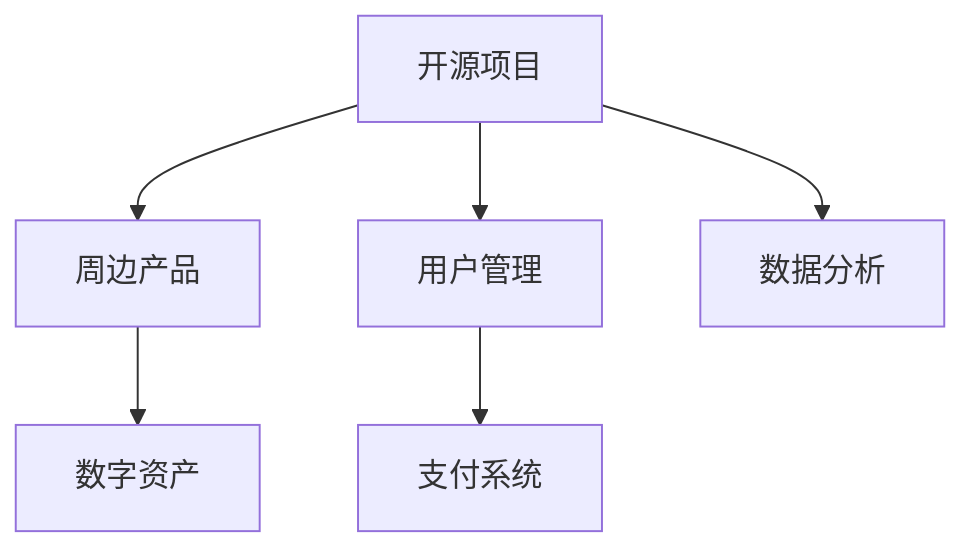

                 

# 创建开源项目的在线商店：周边产品和数字资产

> 关键词：开源项目, 在线商店, 周边产品, 数字资产, 开发者社区, 电商平台, 用户管理, 支付系统, 数据分析

## 1. 背景介绍

在当今数字化时代，开源社区和开源项目已成为技术创新和知识共享的重要平台。开源项目为开发者提供了丰富的资源和工具，促进了技术的快速发展和普及。然而，开源项目的维护和发展也面临着一系列挑战，如资金短缺、社区管理困难等。为了解决这些问题，许多开源项目开始探索如何将项目商业化，提升项目的可持续性和社区活跃度。其中，创建一个基于开源项目的在线商店，销售周边产品和数字资产，是一条行之有效的途径。

## 2. 核心概念与联系

### 2.1 核心概念概述

创建开源项目的在线商店，需要将开源项目与电商平台的商业模式相结合。这不仅包括销售周边产品和数字资产，还涉及用户管理、支付系统、数据分析等多个方面。

- **开源项目**：指在公共平台上公开分享源代码和开发文档，供他人使用和改进的软件项目。
- **周边产品**：指与开源项目相关的实物或虚拟产品，如书籍、T恤、贴纸等。
- **数字资产**：指与开源项目相关的软件、文档、教程、视频等数字产品。
- **用户管理**：指通过后台管理系统对用户进行注册、认证、权限管理等操作。
- **支付系统**：指用于处理用户支付请求的系统，包括支付网关、订单管理等。
- **数据分析**：指对用户行为、购买记录、销售数据等进行分析，为电商运营提供支持。

### 2.2 核心概念原理和架构的 Mermaid 流程图



### 2.3 核心概念之间的联系

- **开源项目**是整个系统的基础，是销售周边产品和数字资产的源泉。
- **周边产品和数字资产**是开源项目的延伸，为项目提供经济支持，同时也提升了项目的品牌价值和社区活跃度。
- **用户管理**和**支付系统**是商业化的关键环节，确保销售过程的安全和顺畅。
- **数据分析**则提供决策支持，帮助优化电商运营策略。

## 3. 核心算法原理 & 具体操作步骤

### 3.1 算法原理概述

创建开源项目的在线商店，其核心算法原理主要包括用户行为分析、推荐系统、支付网关安全、数据存储和处理等。

- **用户行为分析**：通过分析用户浏览、购买行为，预测用户需求，提高转化率。
- **推荐系统**：根据用户偏好和历史行为，推荐相关的周边产品和数字资产，提升用户体验。
- **支付网关安全**：确保支付过程的安全性，防止欺诈和信息泄露。
- **数据存储和处理**：高效存储和管理用户数据、订单数据、销售数据，为数据分析提供支撑。

### 3.2 算法步骤详解

1. **用户行为分析**：
   - 收集用户数据：记录用户浏览、点击、购买等行为，生成行为日志。
   - 数据预处理：清洗、去重、归一化处理行为数据。
   - 特征提取：提取用户行为特征，如浏览时长、点击频率、购买频率等。
   - 模型训练：选择适合的算法，如协同过滤、神经网络等，训练用户行为预测模型。
   - 预测分析：使用训练好的模型，预测用户可能感兴趣的产品，提升转化率。

2. **推荐系统**：
   - 数据收集：收集用户历史购买和浏览记录，生成用户画像。
   - 模型构建：选择适合的推荐算法，如基于内容的推荐、基于协同过滤的推荐等。
   - 推荐算法训练：训练推荐模型，优化推荐结果。
   - 实时推荐：根据用户实时行为，动态调整推荐结果，提升用户体验。

3. **支付网关安全**：
   - 安全协议：选择安全的支付协议，如SSL/TLS、OAuth等。
   - 支付网关选择：选择合适的支付网关，如Stripe、PayPal等。
   - 支付安全措施：实施支付安全措施，如双因素认证、防欺诈检测等。
   - 异常处理：处理支付异常情况，确保交易的顺利进行。

4. **数据存储和处理**：
   - 数据库选择：选择适合的数据库，如MySQL、MongoDB等。
   - 数据建模：设计合理的数据模型，确保数据的一致性和完整性。
   - 数据备份和恢复：定期备份数据，防止数据丢失。
   - 数据清洗和优化：定期清洗和优化数据库，提升查询效率。

### 3.3 算法优缺点

#### 优点

1. **提升项目可持续性**：通过销售周边产品和数字资产，开源项目可以获得稳定的资金来源，提高项目的可持续性。
2. **增强社区活跃度**：周边产品和数字资产的销售，可以增强开源项目的品牌影响力和社区活跃度。
3. **优化用户体验**：通过推荐系统和用户行为分析，提升用户购物体验，增加用户粘性。
4. **提升转化率**：通过精准的推荐和用户行为分析，提高用户的购买转化率。

#### 缺点

1. **复杂性高**：系统涉及多个模块，包括用户管理、支付系统、推荐系统等，开发和维护复杂度较高。
2. **安全性挑战**：支付网关和用户数据的存储和处理需要高度的安全保障措施。
3. **数据隐私问题**：收集和处理用户数据，需严格遵守数据隐私法律法规，防止信息泄露。
4. **性能要求高**：电商系统需要处理大量并发请求，性能要求较高。

### 3.4 算法应用领域

1. **开源社区**：为开源项目提供商业化路径，提升项目的可持续性和社区活跃度。
2. **软件企业**：通过销售软件和数字资产，提升企业收入和品牌价值。
3. **教育机构**：销售教育资源和工具，支持教学和科研活动。
4. **科技公司**：提供技术支持和解决方案，拓展市场和客户群。

## 4. 数学模型和公式 & 详细讲解 & 举例说明

### 4.1 数学模型构建

#### 用户行为分析模型

用户行为分析模型主要包含用户行为预测和推荐系统两部分。以协同过滤推荐系统为例，用户行为预测模型的公式如下：

$$
\hat{y} = \sum_{i=1}^{n} \alpha_i u_i x_i + \beta \sum_{j=1}^{m} \alpha_j v_j x_j
$$

其中，$u_i$ 和 $v_j$ 为预测模型的权重，$x_i$ 和 $x_j$ 为用户的特征向量，$\alpha_i$ 和 $\alpha_j$ 为特征的权重系数。

推荐系统模型的公式为：

$$
\hat{y} = \sum_{i=1}^{n} \alpha_i u_i x_i + \beta \sum_{j=1}^{m} \alpha_j v_j x_j
$$

其中，$u_i$ 和 $v_j$ 为推荐模型的权重，$x_i$ 和 $x_j$ 为用户和商品的特征向量，$\alpha_i$ 和 $\alpha_j$ 为特征的权重系数。

### 4.2 公式推导过程

用户行为预测模型的推导过程如下：

1. 数据收集：收集用户行为数据，包括浏览、点击、购买记录等。
2. 数据预处理：清洗和归一化处理数据，去除噪声和异常值。
3. 特征提取：提取用户行为特征，如浏览时长、点击频率、购买频率等。
4. 模型训练：使用协同过滤算法训练预测模型，优化权重系数。
5. 预测分析：使用训练好的模型，预测用户可能感兴趣的产品，提升转化率。

推荐系统模型的推导过程如下：

1. 数据收集：收集用户历史购买和浏览记录，生成用户画像。
2. 模型构建：选择适合的推荐算法，如基于内容的推荐、基于协同过滤的推荐等。
3. 模型训练：训练推荐模型，优化推荐结果。
4. 实时推荐：根据用户实时行为，动态调整推荐结果，提升用户体验。

### 4.3 案例分析与讲解

以某开源项目的在线商店为例，用户行为预测模型通过对用户历史行为的分析，预测其可能感兴趣的产品。模型训练过程中，需要选择适合的协同过滤算法，如基于用户的协同过滤和基于商品的协同过滤。推荐系统模型则根据用户画像和商品特征，动态调整推荐结果。推荐算法的选择和训练是推荐系统的核心，需要根据实际情况进行选择和优化。

## 5. 项目实践：代码实例和详细解释说明

### 5.1 开发环境搭建

开发环境搭建包括服务器硬件、操作系统、开发工具等配置。以下是一个示例：

1. 硬件配置：选择高性能服务器，支持高并发访问，具备良好IO性能。
2. 操作系统：选择Linux操作系统，如Ubuntu、CentOS等。
3. 开发工具：安装IDE开发环境，如Visual Studio Code、PyCharm等。
4. 数据库：选择关系型数据库MySQL，用于存储用户信息和订单信息。

### 5.2 源代码详细实现

以下是一个基于Flask框架的在线商店的示例代码：

```python
from flask import Flask, request, render_template
from flask_sqlalchemy import SQLAlchemy

app = Flask(__name__)
app.config['SQLALCHEMY_DATABASE_URI'] = 'sqlite://'
db = SQLAlchemy(app)

class User(db.Model):
    id = db.Column(db.Integer, primary_key=True)
    name = db.Column(db.String(100))
    email = db.Column(db.String(100))

class Order(db.Model):
    id = db.Column(db.Integer, primary_key=True)
    user_id = db.Column(db.Integer, db.ForeignKey('user.id'))
    product = db.Column(db.String(100))
    price = db.Column(db.Float)
    timestamp = db.Column(db.DateTime)

@app.route('/')
def home():
    users = User.query.all()
    return render_template('index.html', users=users)

@app.route('/order', methods=['POST'])
def place_order():
    user_id = request.form['user_id']
    product = request.form['product']
    price = float(request.form['price'])
    timestamp = datetime.datetime.now()
    order = Order(user_id=user_id, product=product, price=price, timestamp=timestamp)
    db.session.add(order)
    db.session.commit()
    return redirect('/')

if __name__ == '__main__':
    db.create_all()
    app.run(debug=True)
```

### 5.3 代码解读与分析

上述代码示例基于Flask框架，实现了一个简单的在线商店功能。主要包括以下部分：

1. 用户管理模块：定义User模型，用于存储用户信息。
2. 订单管理模块：定义Order模型，用于存储订单信息。
3. 路由处理：定义路由，处理用户的请求，展示用户列表和处理订单。

### 5.4 运行结果展示

运行代码后，可通过浏览器访问http://localhost:5000/，展示用户列表和订单处理界面。用户可以通过登录界面注册并浏览商品，选择商品并进行购买。订单信息会实时存储在数据库中，便于后续的分析和统计。

## 6. 实际应用场景

### 6.1 开源社区

开源社区可以借助在线商店，销售开源项目的周边产品和数字资产。例如，GitHub商店就是一个成功的案例。GitHub商店不仅销售开源项目的T恤、帽子等周边产品，还销售开源书籍、视频教程等数字资产。通过销售这些产品，开源社区可以获得稳定的资金支持，促进项目的持续发展和社区活跃度。

### 6.2 软件企业

软件企业可以通过在线商店，销售自己的软件产品和数字资源。例如，Red Hat商店就是一个典型的例子。Red Hat商店不仅销售软件安装包，还销售文档、手册、培训视频等资源。通过在线商店，软件企业可以拓展市场，提升品牌价值。

### 6.3 教育机构

教育机构可以借助在线商店，销售教育资源和工具。例如，Coursera和Udacity等在线教育平台，销售课程证书、培训视频、教学资源等。通过在线商店，教育机构可以拓展市场，提升教学质量，增强与学生和企业的互动。

## 7. 工具和资源推荐

### 7.1 学习资源推荐

1. **《Web应用开发实战》**：该书系统介绍了Web应用开发的流程和技术，包括前端、后端、数据库等方面的内容。
2. **《Python网络编程》**：该书深入浅出地介绍了Python网络编程的基础和高级技术。
3. **《Flask Web开发入门与实战》**：该书详细介绍了Flask框架的开发技巧和实践经验。
4. **《数据分析实战》**：该书介绍了数据分析的常用方法和工具，适合有数据分析背景的读者。
5. **《机器学习实战》**：该书介绍了机器学习的基本原理和常用算法，适合有机器学习基础的读者。

### 7.2 开发工具推荐

1. **Visual Studio Code**：轻量级、可扩展的开发环境，适合Web开发、数据分析、机器学习等多种任务。
2. **PyCharm**：功能丰富的Python IDE，支持项目管理和代码调试。
3. **Jupyter Notebook**：基于Web的交互式编程环境，适合数据科学和机器学习任务。
4. **SQLAlchemy**：Python ORM框架，支持多种数据库，方便数据存储和操作。
5. **Flask**：轻量级Web框架，适合快速开发小型Web应用。

### 7.3 相关论文推荐

1. **《推荐系统理论与实践》**：详细介绍了推荐系统的原理和算法，包括协同过滤、基于内容的推荐等。
2. **《Web安全技术》**：介绍了Web安全的基础知识和常用技术，如SSL/TLS、OAuth等。
3. **《数据分析与统计建模》**：介绍了数据分析的常用方法和技术，包括数据清洗、数据建模、数据可视化等。
4. **《数据科学实践》**：介绍了数据科学项目从需求分析到模型部署的流程，适合实际项目开发。
5. **《Web应用安全》**：介绍了Web应用安全的基础知识和常用技术，如SQL注入、跨站脚本等。

## 8. 总结：未来发展趋势与挑战

### 8.1 总结

创建开源项目的在线商店，是开源项目商业化的重要途径，可以有效提升项目的可持续性和社区活跃度。通过周边产品和数字资产的销售，开源项目可以拓展市场，提升品牌价值。然而，创建一个完整的在线商店系统，涉及用户管理、支付系统、推荐系统等多个模块，开发和维护复杂度较高。

### 8.2 未来发展趋势

1. **技术进步**：随着云计算和大数据技术的发展，在线商店的系统架构将更加灵活和高效。
2. **个性化推荐**：推荐系统将更加智能和个性化，根据用户行为和偏好提供精准推荐。
3. **用户管理**：用户管理将更加安全和便捷，支持多渠道登录和统一身份认证。
4. **支付安全**：支付网关将更加安全和可靠，支持多种支付方式和防欺诈检测。
5. **数据分析**：数据分析将更加深入和全面，支持实时监控和趋势预测。

### 8.3 面临的挑战

1. **复杂性高**：创建在线商店系统涉及多个模块，开发和维护复杂度较高。
2. **安全性挑战**：支付网关和用户数据的存储和处理需要高度的安全保障措施。
3. **数据隐私问题**：收集和处理用户数据，需严格遵守数据隐私法律法规，防止信息泄露。
4. **性能要求高**：电商系统需要处理大量并发请求，性能要求较高。

### 8.4 研究展望

1. **低代码平台**：开发低代码平台，简化在线商店的开发流程，降低开发难度。
2. **云服务集成**：将在线商店系统与云服务集成，提高系统的可扩展性和灵活性。
3. **数据隐私保护**：研究数据隐私保护技术，确保用户数据的隐私和安全。
4. **智能推荐系统**：研究智能推荐系统，提高推荐系统的精准度和个性化水平。
5. **高可用架构**：研究高可用架构，提高系统的稳定性和可靠性。

## 9. 附录：常见问题与解答

**Q1: 创建在线商店需要哪些技术和工具？**

A: 创建在线商店需要前端技术、后端技术、数据库技术、推荐系统技术、支付系统技术等多方面的技术。常用的技术和工具包括Flask、SQLAlchemy、推荐系统算法、SSL/TLS、OAuth等。

**Q2: 推荐系统的原理和算法有哪些？**

A: 推荐系统主要包含协同过滤和基于内容的推荐两种算法。协同过滤算法包括基于用户的协同过滤和基于商品的协同过滤，基于内容的推荐则根据用户画像和商品特征，动态调整推荐结果。

**Q3: 在线商店如何保障用户数据的安全性？**

A: 在线商店需要通过SSL/TLS协议加密数据传输，使用OAuth等授权机制保护用户数据，实施双因素认证和防欺诈检测等安全措施。

**Q4: 如何优化推荐系统的性能？**

A: 推荐系统的优化主要包括以下几个方面：优化算法选择，选择适合的数据集和特征，优化特征提取和模型训练等。同时，可以通过数据预处理、模型剪枝等技术，提升推荐系统的性能。

**Q5: 如何确保在线商店的系统稳定性和高可用性？**

A: 确保在线商店的系统稳定性和高可用性，需要设计合理的系统架构，如负载均衡、故障转移等机制，采用高可用数据库和缓存系统，定期进行系统备份和监控等措施。

---

作者：禅与计算机程序设计艺术 / Zen and the Art of Computer Programming

