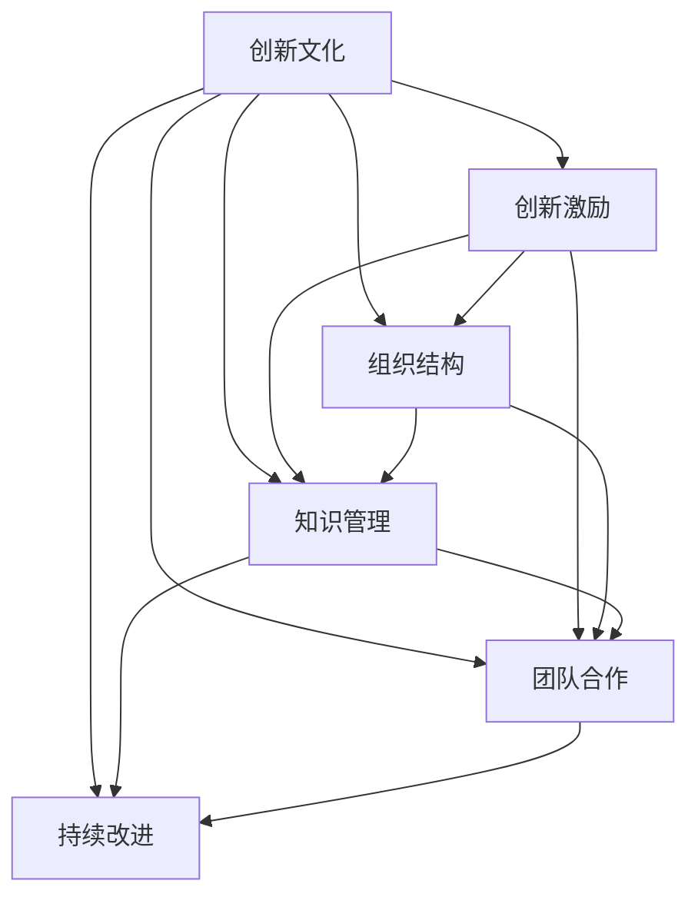

                 

# 创新文化建设：激发全员创新精神

> 关键词：创新文化, 创新激励, 组织结构, 知识管理, 团队合作, 持续改进

## 1. 背景介绍

### 1.1 问题由来
在当今快速变化的市场环境中，创新成为企业持续发展的关键驱动力。随着技术的进步和消费者需求的多样化，传统的线性、刚性的管理模式已经无法适应复杂多变的市场环境。如何激发员工创新精神，构建一个充满活力的创新文化，成为企业面临的一项重要挑战。

### 1.2 问题核心关键点
构建创新文化，关键在于营造一个鼓励创新、包容失败、快速迭代的企业环境。这需要企业高层管理者具备战略眼光，制定明确的创新目标和行动计划；中层管理者具备执行力，推动创新项目的落地实施；基层员工具备创新意识，积极参与创新活动。只有全员参与，上下协同，才能形成真正的创新文化。

### 1.3 问题研究意义
构建创新文化，有助于企业在激烈的市场竞争中占据优势，提升市场响应速度，满足消费者多样化需求，增加企业竞争力和盈利能力。同时，创新文化的建立还能提升员工满意度和忠诚度，增强团队凝聚力，推动企业长期健康发展。

## 2. 核心概念与联系

### 2.1 核心概念概述

为更好地理解如何构建创新文化，本节将介绍几个密切相关的核心概念：

- 创新文化：指企业内部广泛存在的一种价值观、思维方式和行为习惯，鼓励创新、容忍失败，追求卓越。
- 创新激励：通过物质和精神奖励，激发员工创新热情，推动创新活动进行。
- 组织结构：企业内部不同层级、不同部门之间的结构和相互关系，影响信息流通和资源配置。
- 知识管理：对企业内部和外部知识资源的收集、整理、共享和应用，提升企业知识创新能力。
- 团队合作：通过团队协作机制，发挥集体智慧，加速创新成果的实现和应用。
- 持续改进：在创新过程中不断反馈和优化，提升产品和服务质量，满足客户需求。

这些核心概念之间的逻辑关系可以通过以下Mermaid流程图来展示：



这个流程图展示了一些核心概念及其之间的关系：

1. 创新文化是其他概念的基础，驱动创新激励、组织结构、知识管理、团队合作和持续改进。
2. 创新激励是激发员工创新行为的重要手段，依赖组织结构和知识管理机制。
3. 组织结构决定了信息流通和资源配置的效率，影响知识共享和团队协作。
4. 知识管理有助于积累和利用企业内部和外部知识，支撑创新过程。
5. 团队合作是创新成果实现的关键，依赖于组织结构、知识管理和持续改进。
6. 持续改进是创新活动的反馈机制，推动创新文化的不断演进。

这些概念共同构成了企业创新文化建设的基本框架，为企业实现创新目标提供了理论指导。

## 3. 核心算法原理 & 具体操作步骤
### 3.1 算法原理概述

构建创新文化的算法原理基于系统论和组织行为学的理论，通过以下步骤逐步实现：

1. **创新目标设定**：明确企业的创新目标和方向，制定创新战略。
2. **创新激励设计**：设计合理的创新激励机制，包括物质激励和精神激励，激发员工创新意愿。
3. **组织结构调整**：优化组织结构，构建扁平化、灵活化的管理机制，促进信息流通和资源配置。
4. **知识管理实施**：建立知识管理系统，收集、整理和共享企业内外部的知识资源，提升创新能力。
5. **团队合作推动**：建立团队协作机制，通过跨部门、跨学科的协作，加速创新成果的实现。
6. **持续改进反馈**：建立持续改进机制，对创新活动进行评估和反馈，优化创新过程。

### 3.2 算法步骤详解

以下是构建创新文化的具体操作步骤：

**Step 1: 创新目标设定**
- 明确企业的创新方向和目标，如技术创新、产品创新、管理创新等。
- 制定创新战略，包括创新资源的投入、创新项目的优先级和实施路径。
- 通过公司会议、公告等方式，向全体员工传达创新目标和战略，统一思想。

**Step 2: 创新激励设计**
- 设计多样化的激励机制，包括奖金、股权激励、晋升机会等。
- 设立创新奖项，如“年度创新奖”、“最佳创新项目奖”等，表彰突出贡献。
- 提供创新培训，提升员工创新能力和素质。
- 营造创新氛围，如创新角、创新展示墙等，展示员工创新成果。

**Step 3: 组织结构调整**
- 优化管理层级，减少冗余层级，提高决策效率。
- 建立扁平化管理机制，打破部门壁垒，促进信息流通。
- 推行灵活工作制度，如弹性工作时间、远程办公等，提高员工工作效率。

**Step 4: 知识管理实施**
- 建立企业知识库，收集和整理企业内部文档、技术资料、创新案例等。
- 引入知识管理系统，如Confluence、SharePoint等，方便知识共享和检索。
- 定期组织知识分享会、技术交流会等，促进知识传播和应用。

**Step 5: 团队合作推动**
- 组建跨部门、跨学科的创新团队，整合各部门的资源和能力。
- 建立协作平台，如Slack、Microsoft Teams等，促进团队成员的沟通和协作。
- 设立团队项目，通过项目管理工具如JIRA、Trello等，跟踪项目进展和成果。

**Step 6: 持续改进反馈**
- 建立评估机制，定期评估创新项目的成果和效果。
- 通过员工反馈、市场调研等方式，获取创新活动的改进意见。
- 持续优化创新流程，提升创新效率和质量。

### 3.3 算法优缺点

构建创新文化的优点包括：
1. 提升企业创新能力。通过激励机制、知识管理、团队合作等手段，激发员工创新精神，提升企业竞争力。
2. 促进企业健康发展。创新文化的建立有助于解决传统管理模式的弊端，提升企业活力和适应性。
3. 增强员工满意度和忠诚度。通过提供发展机会和物质奖励，提高员工满意度和归属感。

同时，该方法也存在一些局限性：
1. 需要高层管理者支持。创新文化建设需要高层管理者的支持和推动，否则难以取得理想效果。
2. 成本较高。构建创新文化需要大量的资源投入，包括资金、时间、人力资源等。
3. 短期内可能效果不显著。创新文化的建设是一个长期过程，短期内可能难以看到显著的成果。
4. 面临组织文化冲突。创新文化与传统企业文化可能存在冲突，需要妥善处理。

尽管存在这些局限性，但构建创新文化对于提升企业创新能力、促进企业健康发展、增强员工满意度和忠诚度具有重要意义，值得企业长期投入和持续努力。

### 3.4 算法应用领域

创新文化构建方法在多个行业领域得到了广泛应用，如科技公司、制造企业、零售行业等。以下是几个典型应用场景：

**科技公司**
科技公司作为创新型企业的代表，通过构建创新文化，不断推出新技术、新产品，保持市场领先地位。如Google、Amazon、Tesla等公司，通过激励机制、知识管理、团队合作等手段，推动持续创新。

**制造企业**
制造企业通过构建创新文化，提升产品质量和生产效率。如BMW、Toyota、Dell等公司，通过优化组织结构、推动知识管理、组建跨部门团队等手段，促进产品创新和工艺改进。

**零售行业**
零售行业通过构建创新文化，提升客户体验和运营效率。如Zara、H&M、Amazon等公司，通过提供个性化服务、优化供应链管理、应用大数据分析等手段，不断提升客户满意度和企业竞争力。

## 4. 数学模型和公式 & 详细讲解 & 举例说明

### 4.1 数学模型构建

为更好地理解构建创新文化的数学模型，本节将使用数学语言对创新文化的构建过程进行更加严格的刻画。

记创新文化为 $C$，创新激励为 $I$，组织结构为 $S$，知识管理为 $K$，团队合作为 $T$，持续改进为 $C$。创新文化 $C$ 的构建过程可以表示为：

$$
C = f(I, S, K, T, C)
$$

其中 $f$ 为构建创新文化的函数，表示创新文化与其他因素之间的关系。

### 4.2 公式推导过程

以下我们以科技公司为例，推导创新文化构建的数学模型：

假设科技公司的创新能力 $I$ 由激励机制、组织结构、知识管理、团队合作、持续改进五个因素共同决定，则创新能力的计算公式为：

$$
I = w_1 \cdot I_1 + w_2 \cdot I_2 + w_3 \cdot I_3 + w_4 \cdot I_4 + w_5 \cdot I_5
$$

其中 $w_i$ 为各因素的权重，$I_i$ 为各因素的实际值。

假设创新激励 $I_1$ 的计算公式为：

$$
I_1 = S \cdot K \cdot T / C
$$

其中 $S$ 为组织结构参数，$K$ 为知识管理参数，$T$ 为团队合作参数，$C$ 为持续改进参数。

结合公式（1）和公式（2），可以得到：

$$
I = w_1 \cdot (S \cdot K \cdot T / C) + w_2 \cdot I_2 + w_3 \cdot I_3 + w_4 \cdot I_4 + w_5 \cdot I_5
$$

在实际应用中，通过收集和分析各因素的实际数据，可以计算出创新能力的实际值。

### 4.3 案例分析与讲解

假设某科技公司希望提升其创新能力，通过调研和分析，确定了激励机制、组织结构、知识管理、团队合作、持续改进五个因素，并赋予不同的权重，如表所示：

| 因素    | 权重   | 实际值       |
| -------- | ------ | ------------ |
| 激励机制 | 0.2    | 0.8          |
| 组织结构 | 0.3    | 0.7          |
| 知识管理 | 0.2    | 0.6          |
| 团队合作 | 0.2    | 0.6          |
| 持续改进 | 0.1    | 0.4          |

通过公式（3）计算得到：

$$
I = 0.2 \cdot (0.7 \cdot 0.6 \cdot 0.6 / 0.4) + 0.2 \cdot 0.9 + 0.2 \cdot 0.5 + 0.2 \cdot 0.5 + 0.1 \cdot 0.3
$$

$$
I = 0.2 \cdot 2.07 + 0.18 + 0.1 + 0.1 + 0.03
$$

$$
I = 0.414 + 0.18 + 0.1 + 0.1 + 0.03
$$

$$
I = 0.814
$$

通过计算，该科技公司的创新能力得分为0.814，表明其当前创新能力处于中等水平，需要进一步提升。

## 5. 项目实践：代码实例和详细解释说明
### 5.1 开发环境搭建

在进行创新文化构建实践前，我们需要准备好开发环境。以下是使用Python进行企业创新文化管理系统开发的环境配置流程：

1. 安装Anaconda：从官网下载并安装Anaconda，用于创建独立的Python环境。

2. 创建并激活虚拟环境：
```bash
conda create -n innovation-env python=3.8 
conda activate innovation-env
```

3. 安装必要的Python包：
```bash
pip install pandas numpy plotly flask
```

4. 搭建Web服务：
```bash
python3 -m http.server
```

5. 访问Web界面：
```bash
http://127.0.0.1:8000
```

完成上述步骤后，即可在`innovation-env`环境中开始创新文化构建系统的开发。

### 5.2 源代码详细实现

以下是使用Flask框架搭建的创新文化管理系统代码实现，包括用户管理、项目管理、知识管理等功能：

```python
from flask import Flask, request, render_template, redirect
from flask_sqlalchemy import SQLAlchemy
from flask_login import LoginManager, login_user, logout_user, login_required
from werkzeug.security import generate_password_hash, check_password_hash

app = Flask(__name__)
app.config['SQLALCHEMY_DATABASE_URI'] = 'sqlite:///innovations.db'
db = SQLAlchemy(app)
login_manager = LoginManager(app)

# 定义用户模型
class User(db.Model):
    id = db.Column(db.Integer, primary_key=True)
    username = db.Column(db.String(20), unique=True)
    password = db.Column(db.String(80))
    is_admin = db.Column(db.Boolean, default=False)

# 定义项目模型
class Innovation(db.Model):
    id = db.Column(db.Integer, primary_key=True)
    name = db.Column(db.String(80))
    description = db.Column(db.Text)
    initiator = db.Column(db.Integer, db.ForeignKey('user.id'))
    status = db.Column(db.String(20))

# 定义知识模型
class Knowledge(db.Model):
    id = db.Column(db.Integer, primary_key=True)
    title = db.Column(db.String(80))
    content = db.Column(db.Text)
    project = db.Column(db.Integer, db.ForeignKey('innovation.id'))

@login_manager.user_loader
def load_user(user_id):
    return User.query.get(int(user_id))

@app.route('/')
@login_required
def index():
    innovations = Innovation.query.all()
    return render_template('index.html', innovations=innovations)

@app.route('/innovation/new', methods=['GET', 'POST'])
@login_required
def new_innovation():
    if request.method == 'POST':
        name = request.form.get('name')
        description = request.form.get('description')
        initiator_id = current_user.id
        innovation = Innovation(name=name, description=description, initiator=initiator_id)
        db.session.add(innovation)
        db.session.commit()
        return redirect('/')
    return render_template('new_innovation.html')

@app.route('/innovation/<int:id>/delete')
@login_required
def delete_innovation(id):
    innovation = Innovation.query.get(id)
    db.session.delete(innovation)
    db.session.commit()
    return redirect('/')

@app.route('/knowledge/new', methods=['GET', 'POST'])
@login_required
def new_knowledge():
    if request.method == 'POST':
        title = request.form.get('title')
        content = request.form.get('content')
        project_id = request.form.get('project')
        project = Innovation.query.get(int(project_id))
        knowledge = Knowledge(title=title, content=content, project=project_id)
        db.session.add(knowledge)
        db.session.commit()
        return redirect('/')
    return render_template('new_knowledge.html')

@app.route('/knowledge/<int:id>/delete')
@login_required
def delete_knowledge(id):
    knowledge = Knowledge.query.get(id)
    db.session.delete(knowledge)
    db.session.commit()
    return redirect('/')

if __name__ == '__main__':
    db.create_all()
    app.run(debug=True)
```

以上代码实现了基本的用户管理、项目管理和知识管理功能，用户可以在Web界面上进行创新项目和知识的创建、编辑和删除等操作。

### 5.3 代码解读与分析

让我们再详细解读一下关键代码的实现细节：

**用户管理**
- `User`模型：用于存储用户信息，包括用户名、密码、是否为管理员等。
- `load_user`函数：用于用户登录后的加载，以便实现用户信息的持久化。
- `login_required`装饰器：用于保护需要登录才能访问的页面，如`index`函数。

**项目管理**
- `Innovation`模型：用于存储创新项目信息，包括项目名称、描述、发起人等。
- `new_innovation`函数：用于创建新的创新项目，用户可以在表单中输入项目名称和描述。
- `delete_innovation`函数：用于删除创新项目，管理员可以在Web界面上进行删除操作。

**知识管理**
- `Knowledge`模型：用于存储项目相关的知识资源，包括知识标题、内容、所属项目等。
- `new_knowledge`函数：用于创建新的知识资源，用户可以在表单中输入知识标题和内容。
- `delete_knowledge`函数：用于删除知识资源，管理员可以在Web界面上进行删除操作。

通过这些代码，可以初步构建一个企业级的创新文化管理系统，帮助企业进行创新项目的规划、实施和评估，同时进行知识资源的收集和共享。

## 6. 实际应用场景
### 6.1 智能制造企业

在智能制造领域，构建创新文化有助于企业快速响应市场需求变化，推动生产效率和产品质量的提升。通过构建创新文化，企业可以鼓励员工提出技术改进、流程优化等创新建议，推动企业不断进步。

具体而言，智能制造企业可以通过以下措施构建创新文化：
- 设立“精益生产”“智能制造”等主题，鼓励员工提出改进建议。
- 建立创新团队，定期召开创新分享会，促进知识交流和技术传播。
- 设立创新奖励机制，对提出并实现创新建议的员工给予物质和精神奖励。
- 引入知识管理系统，收集和整理企业内部的技术资料和创新案例，方便员工查阅和学习。

通过这些措施，智能制造企业可以激发员工创新精神，提升生产效率和产品质量，增强市场竞争力。

### 6.2 零售行业

在零售行业，构建创新文化有助于企业提升客户体验，增强市场响应速度，满足消费者多样化需求。通过构建创新文化，企业可以推动产品创新、服务创新、营销创新等，提升客户满意度和忠诚度。

具体而言，零售企业可以通过以下措施构建创新文化：
- 设立“顾客至上”“创新驱动”等主题，鼓励员工提出服务改进、产品创新等建议。
- 建立跨部门团队，定期召开创新工作坊，促进跨部门协作和知识共享。
- 设立创新奖励机制，对提出并实现创新建议的员工给予物质和精神奖励。
- 引入知识管理系统，收集和整理企业内部的营销策略、服务案例等，方便员工查阅和学习。

通过这些措施，零售企业可以激发员工创新精神，提升服务质量，增强市场竞争力，满足消费者多样化需求。

### 6.3 金融行业

在金融行业，构建创新文化有助于企业提升金融产品的创新能力，提升市场响应速度和风险管理水平。通过构建创新文化，企业可以推动金融产品的创新、金融服务的改进、风险管理的优化等，提升金融服务的质量和安全性。

具体而言，金融企业可以通过以下措施构建创新文化：
- 设立“金融科技”“风险管理”等主题，鼓励员工提出金融产品创新、风险管理优化等建议。
- 建立跨部门团队，定期召开创新工作坊，促进跨部门协作和知识共享。
- 设立创新奖励机制，对提出并实现创新建议的员工给予物质和精神奖励。
- 引入知识管理系统，收集和整理企业内部的金融产品和风险管理案例，方便员工查阅和学习。

通过这些措施，金融企业可以激发员工创新精神，提升金融产品的创新能力，增强市场响应速度和风险管理水平，提升金融服务的质量和安全性。

## 7. 工具和资源推荐
### 7.1 学习资源推荐

为了帮助开发者系统掌握构建创新文化的理论基础和实践技巧，这里推荐一些优质的学习资源：

1. 《创新领导力》系列书籍：由全球顶尖创新领袖撰写，涵盖创新理论、创新实践、创新管理等方方面面，提供全面的创新知识。
2. 《创新心理学》课程：斯坦福大学开设的心理学课程，研究创新心理和行为，帮助企业理解和激发员工创新精神。
3. 《敏捷开发》课程：Coursera上由INSEAD教授授课，介绍敏捷开发和创新项目管理的方法和工具，提升项目执行效率。
4. 《知识管理》书籍：由知识管理领域的专家撰写，介绍知识管理的理论和方法，帮助企业构建知识管理系统。
5. 《团队协作》书籍：介绍团队协作的理论和方法，帮助企业建立高效的团队协作机制，推动创新项目实施。

通过学习这些资源，相信你一定能够全面掌握构建创新文化的理论和实践，在企业中推动创新文化的建设，提升企业的创新能力和市场竞争力。

### 7.2 开发工具推荐

高效的开发离不开优秀的工具支持。以下是几款用于创新文化构建开发的常用工具：

1. JIRA：用于项目管理，支持敏捷开发和创新项目的跟踪和管理。
2. Slack：用于团队协作和知识共享，支持实时通信和文件共享。
3. Google Docs：用于文档编辑和共享，方便团队协作和知识传播。
4. Microsoft Teams：用于团队协作和知识共享，支持视频会议和实时通信。
5. Confluence：用于知识管理，支持文档的创建、编辑、版本控制和共享。
6. GitHub：用于版本控制和代码托管，方便团队协作和知识传播。

合理利用这些工具，可以显著提升创新文化构建的开发效率，加快创新文化的构建进程。

### 7.3 相关论文推荐

构建创新文化的思想和方法源自学术界的研究成果。以下是几篇奠基性的相关论文，推荐阅读：

1. 《创新心理学：理论与实践》（Innovation Psychology: Theory and Practice）：探讨创新心理学的理论和实践，研究如何激发员工创新精神。
2. 《知识管理与创新：新视野》（Knowledge Management and Innovation: A New Perspective）：介绍知识管理与创新的关系，探讨如何构建知识管理系统促进创新。
3. 《团队协作与创新：理论与实践》（Team Collaboration and Innovation: Theory and Practice）：研究团队协作对创新的影响，探讨如何建立高效的团队协作机制。
4. 《敏捷开发：原则、实践与模式》（Agile Development: Principles, Patterns, and Practices）：介绍敏捷开发和项目管理的理论和方法，提升创新项目的执行效率。
5. 《创新领导力：理论、实践与管理》（Innovation Leadership: Theory, Practice, and Management）：研究创新领导力的理论和实践，帮助企业提升创新领导力。

这些论文代表了大创新文化建设的研究方向，通过学习这些前沿成果，可以帮助研究者把握学科前进方向，激发更多的创新灵感。

## 8. 总结：未来发展趋势与挑战
### 8.1 总结

本文对构建创新文化的算法原理和操作步骤进行了全面系统的介绍。首先阐述了创新文化的重要性和构建过程，明确了创新文化对企业创新能力、市场竞争力和员工满意度的提升作用。其次，从原理到实践，详细讲解了创新文化的构建方法，提供了完整的代码实例和详细解释。同时，本文还探讨了创新文化在不同行业的应用场景，展示了创新文化建设的广阔前景。最后，本文精选了创新文化建设的学习资源、开发工具和相关论文，为读者提供了全方位的技术指引。

通过本文的系统梳理，可以看到，构建创新文化对于提升企业创新能力、促进企业健康发展、增强员工满意度和忠诚度具有重要意义，值得企业长期投入和持续努力。

### 8.2 未来发展趋势

展望未来，构建创新文化将呈现以下几个发展趋势：

1. **文化融合**：创新文化将与企业现有的文化逐步融合，形成更加和谐的组织氛围。
2. **跨界合作**：不同行业、不同领域的创新文化将相互借鉴，促进跨界合作和知识共享。
3. **持续优化**：创新文化将不断优化和演进，适应企业内外部环境的变化。
4. **数字化转型**：创新文化将借助数字化工具和技术手段，实现信息化、智能化转型。
5. **全球化发展**：创新文化将走向全球化，不同国家和地区的企业共享创新经验和方法。

这些趋势展示了创新文化建设的前景和潜力，为企业的创新发展提供了新的方向和机遇。

### 8.3 面临的挑战

尽管构建创新文化在企业中得到了广泛应用，但仍面临一些挑战：

1. **文化冲突**：创新文化与传统企业文化可能存在冲突，需要妥善处理。
2. **资源投入**：创新文化的构建需要大量的资源投入，包括时间、资金、人力资源等。
3. **组织变革**：创新文化的构建需要企业进行组织结构的变革，打破原有管理模式的束缚。
4. **人才流失**：创新文化往往吸引高素质人才，需要企业提供良好的发展机会和福利待遇。
5. **短期效益**：创新文化的建设是一个长期过程，短期内可能难以看到显著的成果。

尽管存在这些挑战，但构建创新文化对于提升企业创新能力、促进企业健康发展、增强员工满意度和忠诚度具有重要意义，值得企业长期投入和持续努力。

### 8.4 研究展望

未来的研究需要在以下几个方面寻求新的突破：

1. **文化融合机制**：研究如何通过文化融合机制，将创新文化与企业现有文化有机结合，提升整体创新能力。
2. **跨界合作模式**：研究跨界合作的创新模式，促进不同行业、不同领域的知识共享和技术传播。
3. **数字化工具**：研究如何借助数字化工具和技术手段，提升创新文化的构建效率和效果。
4. **全球化策略**：研究全球化背景下的创新文化建设策略，推动企业走向国际化。
5. **持续优化方法**：研究持续优化创新文化的方法，提升创新文化的适应性和生命力。

这些研究方向的探索，必将引领创新文化建设迈向更高的台阶，为企业的创新发展提供新的动力和方向。

## 9. 附录：常见问题与解答

**Q1：如何构建创新文化？**

A: 构建创新文化需要企业高层管理者的支持、中层管理者的执行、基层员工的参与。具体步骤如下：
1. 制定明确的创新目标和方向。
2. 设计合理的创新激励机制。
3. 优化组织结构，打破部门壁垒。
4. 建立知识管理系统，促进知识共享。
5. 组建跨部门团队，推动创新项目实施。

**Q2：如何应对创新文化建设中的挑战？**

A: 应对创新文化建设中的挑战需要采取以下措施：
1. 妥善处理文化冲突，推动文化融合。
2. 合理规划资源投入，优化资源配置。
3. 推动组织变革，打破原有管理模式的束缚。
4. 提供良好的发展机会和福利待遇，留住人才。
5. 重视短期效益和长期发展的平衡，持续优化创新文化。

**Q3：创新文化建设的短期效果如何？**

A: 创新文化建设是一个长期过程，短期内可能难以看到显著的成果。需要企业在制定目标和计划时，保持耐心和持续的努力。

通过本文的系统梳理，可以看到，构建创新文化对于提升企业创新能力、促进企业健康发展、增强员工满意度和忠诚度具有重要意义，值得企业长期投入和持续努力。

