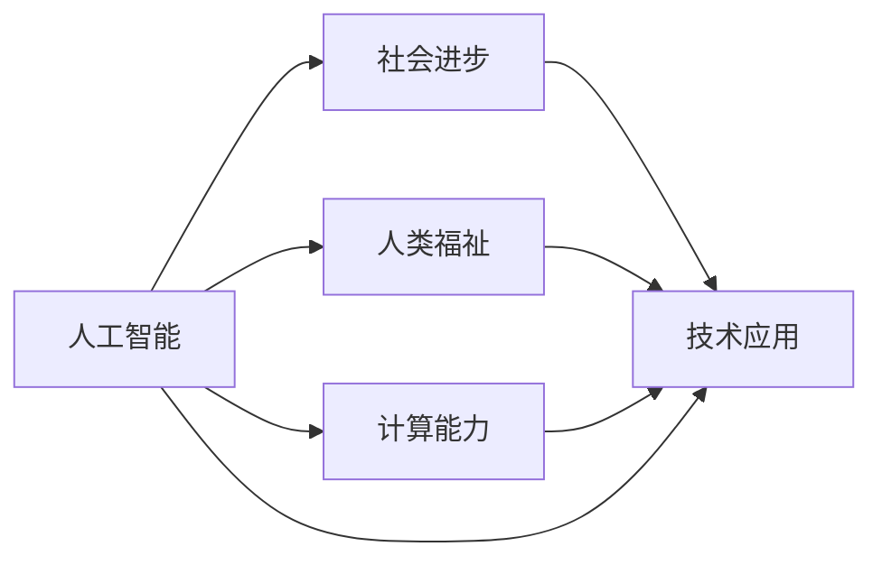

                 

# 创造更美好的世界：人类计算的终极目标

> 关键词：人工智能,计算,人类,未来,社会,技术,应用,创新,进步

## 1. 背景介绍

在过去几十年里，信息技术极大地改变了我们的生活方式和社会结构。从早期的计算机到如今的智能手机、物联网，计算技术已经渗透到我们生活的每一个角落。然而，我们对于计算的认识，从最初的物理运算，到早期的逻辑计算，再到今天的深度学习和大数据，始终在不断地演进和深化。

人工智能(AI)作为计算技术的重要分支，已经成为推动社会进步和发展的关键力量。尤其是深度学习和自然语言处理(NLP)技术的飞速发展，使得AI在图像识别、语音识别、自然语言理解等方面取得了重大突破。但正如伟大的计算机科学家图灵所说，AI的目标不仅仅是计算能力的提升，更重要的是计算所带来的社会福祉和人类文明的进步。

本文将从计算与人类福祉的关系出发，探讨人类计算的终极目标，即如何通过计算技术创造更美好的世界。我们将从核心概念、算法原理、实际应用、未来展望等多个方面进行详细阐述，希望能够为读者提供深入的思考和启示。

## 2. 核心概念与联系

### 2.1 核心概念概述

要理解人类计算的终极目标，首先要对其中的几个核心概念有所了解：

- **人工智能(AI)**：一种模拟人类智能行为的技术，包括学习、推理、感知、语言处理等能力。

- **计算能力**：指计算机处理信息的能力，包括计算速度、存储容量、并行处理等。

- **人类福祉**：计算技术对人类生活质量、健康、教育、工作、社交等方面的积极影响。

- **社会进步**：计算技术推动社会各领域的创新和变革，促进经济、政治、文化等各方面的发展。

- **技术应用**：将计算技术应用到实际场景中，解决具体问题，提升工作效率和生活质量。

### 2.2 核心概念原理和架构的 Mermaid 流程图

以下是一个关于计算与人类福祉的 Mermaid 流程图，展示了各概念之间的联系：



这个流程图展示了人工智能与计算能力、人类福祉、社会进步和技术应用之间的关系。计算能力的提升使得AI技术得以发展，而AI技术的进步又能够推动人类福祉和社会进步，最终通过技术应用转化为实际的福祉提升。

## 3. 核心算法原理 & 具体操作步骤

### 3.1 算法原理概述

人工智能的核心算法包括监督学习、无监督学习和强化学习等，这些算法在计算能力提升的背景下，得以不断优化和应用。监督学习通过标注数据训练模型，使其能够准确预测未知数据；无监督学习则通过无标注数据探索数据的潜在结构和模式；强化学习则通过模拟环境中的交互，学习最优策略。

在计算能力不断提升的今天，AI算法正在变得更加强大和智能。深度学习、自然语言处理、计算机视觉等技术的进步，使得AI能够在更广泛的场景中发挥作用，提升人类的生活质量和工作效率。

### 3.2 算法步骤详解

以深度学习为例，下面详细讲解其核心步骤：

1. **数据准备**：收集和清洗数据，进行预处理，如数据增强、归一化等。

2. **模型构建**：选择合适的模型架构，如卷积神经网络(CNN)、循环神经网络(RNN)、Transformer等，并进行模型初始化。

3. **训练过程**：使用训练数据进行模型训练，通过反向传播算法更新模型参数，使得模型能够准确预测未知数据。

4. **模型评估**：使用验证集和测试集对模型进行评估，确定模型的性能和泛化能力。

5. **模型应用**：将训练好的模型应用到实际场景中，如图像识别、语音识别、自然语言处理等。

### 3.3 算法优缺点

深度学习等AI算法在数据量大、计算能力强的情况下，能够取得非常出色的效果。但同时，它也面临着一些挑战：

- **数据依赖**：深度学习需要大量的标注数据进行训练，而标注数据的获取成本较高，且存在数据偏差问题。

- **计算资源消耗**：深度学习模型的训练和推理需要大量的计算资源，如GPU、TPU等，而其部署和运行成本较高。

- **模型解释性不足**：深度学习模型通常被视为"黑盒"，难以解释其决策过程，难以在特定场景中应用。

### 3.4 算法应用领域

深度学习和人工智能技术已经在各个领域得到了广泛应用，包括：

- **医疗健康**：AI在医学影像分析、病理诊断、个性化治疗等方面取得了重要进展，提高了医疗服务的质量和效率。

- **金融服务**：AI在风险控制、投资分析、客户服务等方面发挥了重要作用，帮助金融机构提升决策效率和客户满意度。

- **交通运输**：AI在自动驾驶、交通管理、智能物流等方面取得了显著成果，提升了交通系统的安全性、效率和可持续性。

- **教育培训**：AI在智能辅导、课程推荐、学习分析等方面进行了探索，为教育提供了个性化、高效的支持。

## 4. 数学模型和公式 & 详细讲解 & 举例说明

### 4.1 数学模型构建

以卷积神经网络(CNN)为例，介绍其数学模型构建：

- **输入层**：输入图像数据，通常为二维矩阵。

- **卷积层**：通过卷积核对输入数据进行卷积操作，提取特征。

- **池化层**：对卷积层输出的特征图进行下采样，减少计算量和参数量。

- **全连接层**：将池化层输出的特征图展开为向量，通过全连接层进行分类。

### 4.2 公式推导过程

以下是一个简单的卷积神经网络公式推导过程：

设输入图像大小为 $m \times n \times c$，卷积核大小为 $k \times k \times c$，卷积步长为 $s$，输出大小为 $o \times o \times k$，则卷积操作可以表示为：

$$
\mathbf{Z} = \mathbf{X} * \mathbf{W} + b
$$

其中 $\mathbf{X}$ 为输入特征图，$\mathbf{W}$ 为卷积核，$b$ 为偏置项。

### 4.3 案例分析与讲解

以ImageNet大规模视觉识别挑战为例，展示卷积神经网络的应用：

ImageNet是一个包含超过1000个类别的视觉识别数据集，其中每个类别有超过1000张图片。在2012年的ImageNet挑战中，AlexNet通过卷积神经网络首次取得了显著的性能提升。

AlexNet的架构如下：

- **卷积层**：8层卷积层，每层32个卷积核，5x5大小。

- **池化层**：3层最大池化层，2x2大小，步长为2。

- **全连接层**：3层全连接层，最后一层输出1000个类别。

AlexNet的训练过程使用了随机梯度下降算法，结合数据增强技术，显著提升了模型的泛化能力。

## 5. 项目实践：代码实例和详细解释说明

### 5.1 开发环境搭建

要搭建一个深度学习项目，需要以下开发环境：

1. **Python**：深度学习的主要编程语言，支持Python3及以上版本。

2. **深度学习框架**：如TensorFlow、PyTorch、Keras等。

3. **数据处理工具**：如Pandas、NumPy、Scikit-learn等。

4. **模型评估工具**：如TensorBoard、Weights & Biases等。

5. **版本控制系统**：如Git、GitHub等。

### 5.2 源代码详细实现

以TensorFlow为例，展示深度学习模型的实现：

```python
import tensorflow as tf

# 定义模型架构
model = tf.keras.Sequential([
    tf.keras.layers.Conv2D(32, (3, 3), activation='relu', input_shape=(28, 28, 1)),
    tf.keras.layers.MaxPooling2D((2, 2)),
    tf.keras.layers.Flatten(),
    tf.keras.layers.Dense(10, activation='softmax')
])

# 编译模型
model.compile(optimizer='adam',
              loss='categorical_crossentropy',
              metrics=['accuracy'])

# 训练模型
model.fit(train_images, train_labels, epochs=10, validation_data=(test_images, test_labels))
```

### 5.3 代码解读与分析

- **Sequential模型**：使用Sequential模型进行模型堆叠，方便添加层。

- **Conv2D层**：卷积层，提取图像特征。

- **MaxPooling2D层**：池化层，减少计算量和参数量。

- **Flatten层**：将池化层输出的特征图展开为向量。

- **Dense层**：全连接层，进行分类。

## 6. 实际应用场景

### 6.1 医疗健康

AI在医疗健康领域的应用包括：

- **医学影像分析**：通过卷积神经网络对医学影像进行分析和诊断，提高医生的工作效率和诊断准确性。

- **个性化治疗**：利用深度学习进行基因组分析，制定个性化的治疗方案。

- **智能助手**：通过自然语言处理技术，为患者提供智能咨询和健康管理。

### 6.2 金融服务

AI在金融服务领域的应用包括：

- **风险控制**：通过深度学习对金融数据进行分析和预测，提高风险管理能力。

- **投资分析**：利用强化学习进行智能投资策略，提高投资回报率。

- **客户服务**：通过自然语言处理技术，提供智能客服和金融咨询。

### 6.3 交通运输

AI在交通运输领域的应用包括：

- **自动驾驶**：通过计算机视觉和深度学习技术，实现自动驾驶车辆。

- **交通管理**：通过AI进行交通流量分析和预测，优化交通信号和道路规划。

- **智能物流**：通过AI进行路径规划和货物追踪，提高物流效率和安全性。

### 6.4 未来应用展望

未来，人工智能将在更多领域发挥重要作用，带来深刻变革：

- **智能制造**：通过AI进行质量检测、生产优化，提高制造业的智能化水平。

- **智慧城市**：通过AI进行城市管理、公共安全、环境监测等，提升城市治理水平。

- **虚拟现实**：通过AI进行虚拟环境构建和互动，创造新的娱乐和教育形式。

## 7. 工具和资源推荐

### 7.1 学习资源推荐

- **深度学习基础**：吴恩达的《深度学习》课程，涵盖了深度学习的基本概念和算法。

- **计算机视觉**：李宏毅的《计算机视觉基础》课程，介绍了计算机视觉的原理和应用。

- **自然语言处理**：斯坦福大学的《自然语言处理入门》课程，介绍了自然语言处理的理论和实践。

- **TensorFlow官方文档**：TensorFlow的官方文档，详细介绍了TensorFlow的使用方法和示例。

- **Kaggle**：Kaggle是一个数据科学竞赛平台，提供大量公开数据集和竞赛机会，适合学习者练习和应用。

### 7.2 开发工具推荐

- **Python**：Python是深度学习和AI的主要编程语言，支持丰富的科学计算库和数据处理工具。

- **TensorFlow**：由Google开发的深度学习框架，支持分布式计算和GPU加速，适合大规模模型训练。

- **PyTorch**：由Facebook开发的深度学习框架，支持动态计算图和GPU加速，适合研究和实验。

- **Jupyter Notebook**：Jupyter Notebook是一个交互式的开发环境，支持Python、R等多种语言，适合编写和调试代码。

- **GitHub**：GitHub是一个代码托管平台，支持版本控制和协作开发，适合团队合作和项目管理。

### 7.3 相关论文推荐

- **深度学习**：Hinton的《Deep Learning》书籍，介绍了深度学习的理论基础和实践方法。

- **自然语言处理**：Bengio的《The Representation of Knowledge in the Brain and in Computer Science》论文，探讨了语言处理的神经机制。

- **计算机视觉**：Simonyan和Zisserman的《Very Deep Convolutional Networks for Large-Scale Image Recognition》论文，介绍了卷积神经网络的原理和应用。

## 8. 总结：未来发展趋势与挑战

### 8.1 研究成果总结

在过去几十年里，人工智能技术取得了长足的进步，从最初的专家系统到深度学习，再到当前的自然语言处理和大规模视觉识别，展示了计算技术的巨大潜力。AI已经应用于医疗、金融、交通运输等多个领域，为人类社会的进步和发展做出了重要贡献。

### 8.2 未来发展趋势

未来，人工智能将进一步发展，其应用范围和影响将更加广泛：

- **智能交互**：通过自然语言处理和计算机视觉技术，实现更自然、更智能的人机交互。

- **智能决策**：通过深度学习和强化学习技术，提高决策的科学性和准确性。

- **跨领域融合**：将AI与其他技术进行融合，如物联网、区块链等，创造新的应用场景。

### 8.3 面临的挑战

尽管AI技术取得了重大进展，但在实际应用中仍然面临一些挑战：

- **数据隐私和安全**：AI应用需要大量数据，如何保护数据隐私和安全成为重要问题。

- **算法透明性和可解释性**：AI算法的黑盒特性使得其在某些场景下难以应用，如何提高算法的透明性和可解释性是未来研究方向。

- **伦理和社会影响**：AI技术的发展可能带来伦理和社会问题，如就业替代、隐私侵犯等，如何平衡技术和伦理的关系是重要课题。

### 8.4 研究展望

未来的AI研究需要在以下方面进行探索：

- **跨学科融合**：将AI与其他学科进行交叉融合，探索新的应用场景和技术路径。

- **多模态学习**：将视觉、语音、文本等不同模态的数据进行融合，提高AI的综合能力。

- **自主学习**：通过强化学习等技术，实现AI的自主学习，提升其适应性和泛化能力。

- **伦理和社会责任**：将伦理和社会责任纳入AI的研究和应用中，确保技术的发展和应用符合人类价值观和道德规范。

## 9. 附录：常见问题与解答

**Q1：如何理解AI对社会的影响？**

A: AI对社会的影响是多方面的，包括提高效率、降低成本、提升服务质量等积极影响，也存在就业替代、数据隐私等问题。关键在于如何平衡技术发展和伦理道德的关系，确保AI技术造福全人类。

**Q2：AI算法的透明性和可解释性如何实现？**

A: 透明性和可解释性是AI算法的重要研究方向，可以通过特征选择、可视化、解释性模型等方法实现。例如，使用LIME、SHAP等工具进行模型解释，可以帮助理解AI的决策过程。

**Q3：AI如何应对数据隐私和安全问题？**

A: 数据隐私和安全是AI应用的重要问题，可以通过数据匿名化、差分隐私、联邦学习等方法实现。例如，在数据传输和存储过程中，使用加密技术保护数据安全，避免数据泄露和滥用。

**Q4：AI未来如何更好地融入社会生活？**

A: AI未来将在更多领域发挥作用，提升社会生活的智能化水平。例如，在教育、医疗、交通等领域，AI可以提供个性化的服务和解决方案，提升生活质量和工作效率。

**Q5：AI如何应对伦理和社会问题？**

A: 伦理和社会问题是AI技术发展的重要课题，需要多方协作，包括政府、企业、学术界等。例如，制定AI伦理规范，建立数据共享和使用机制，确保AI技术的发展和应用符合人类价值观和道德规范。

总之，人类计算的终极目标不仅是提升计算能力，更重要的是通过计算技术创造更美好的世界。只有将AI技术融入社会生活，解决实际问题，才能实现其最大价值。未来，AI的发展需要更多跨学科的合作和创新，才能更好地服务于全人类。

---

作者：禅与计算机程序设计艺术 / Zen and the Art of Computer Programming

