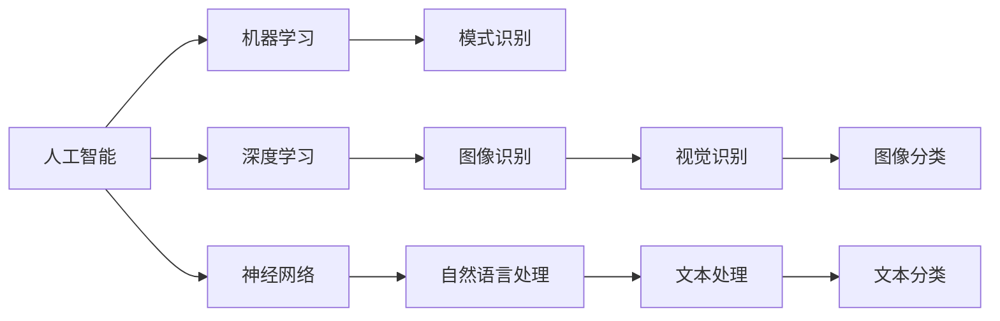

                 

# 创造更美好的明天：人类计算的积极作用

> 关键词：人工智能,人类计算,大数据,机器学习,深度学习,神经网络,自然语言处理,模式识别

## 1. 背景介绍

### 1.1 问题由来

在过去的几十年中，计算技术的迅猛发展极大地改变了我们的生活方式和思维方式。从个人计算机到互联网，从云计算到物联网，技术正不断渗透到人类社会的各个角落。计算技术的进步，不仅推动了经济社会的快速发展，也极大地提升了人类生活的质量。

然而，随着计算能力的不断提升，我们发现计算技术的应用也带来了新的挑战。如何在计算技术的迅猛发展中，既发挥其积极作用，又避免其负面影响，成为当前科技界和社会关注的热点问题。

### 1.2 问题核心关键点

本文将从以下几个核心关键点展开，探讨人类计算技术的积极作用：

- **人工智能与计算的结合**：人工智能（AI）作为计算技术的一个重要分支，正以惊人的速度发展，逐步渗透到各个行业，带来深刻的变化。
- **大数据与计算的互动**：大数据的爆发式增长，为计算技术提供了新的应用场景，同时也对计算能力提出了更高的要求。
- **机器学习与深度学习的应用**：机器学习（ML）和深度学习（DL）作为当前计算技术的前沿领域，已经在图像识别、自然语言处理、推荐系统等众多领域取得了显著的进展。
- **神经网络与模式识别的突破**：神经网络作为一种强大的计算模型，通过大量数据的训练，实现了对复杂模式的识别和处理，为计算技术的应用打开了新的天地。
- **人机协同的未来**：在人工智能、大数据、机器学习、深度学习等计算技术的推动下，人机协同成为可能，人类与计算技术的结合将迎来新的发展阶段。

通过理解这些核心关键点，我们可以更好地把握人类计算技术的发展方向，并思考如何在未来实现更加美好的明天。

## 2. 核心概念与联系

### 2.1 核心概念概述

为了更深入地理解人类计算技术的积极作用，我们将介绍一些核心概念，并探讨它们之间的联系：

- **人工智能（Artificial Intelligence, AI）**：一种模拟人类智能的技术，包括但不限于机器学习、深度学习、自然语言处理等子领域。
- **计算（Computing）**：指使用计算资源（如计算机、网络等）处理、存储和传输信息的过程。
- **大数据（Big Data）**：指规模庞大、种类繁多、速度快速的数据集，通常需要分布式计算资源来处理。
- **机器学习（Machine Learning, ML）**：一种使计算机系统能够自动改进并优化性能的技术，通过数据学习规律。
- **深度学习（Deep Learning, DL）**：一种特殊的机器学习技术，通过多层神经网络实现对复杂数据模式的识别和学习。
- **神经网络（Neural Networks）**：一种受生物神经网络启发的计算模型，通过多层连接实现数据模式的自动学习和识别。
- **模式识别（Pattern Recognition）**：一种通过计算技术自动识别和分类数据模式的技术，广泛应用于图像、语音、文本等领域。

这些核心概念相互联系，共同构成了人类计算技术的基础框架。

### 2.2 核心概念原理和架构的 Mermaid 流程图



这个流程图展示了人工智能、机器学习、深度学习、神经网络、模式识别等核心概念之间的联系和应用场景。

## 3. 核心算法原理 & 具体操作步骤

### 3.1 算法原理概述

人工智能、大数据、机器学习、深度学习等计算技术的核心在于算法。这些算法通过复杂的计算模型和数据处理流程，实现了对复杂问题的求解。

### 3.2 算法步骤详解

以深度学习算法为例，其基本步骤包括：

1. **数据准备**：收集和整理训练数据，确保数据的多样性和代表性。
2. **模型设计**：选择适当的神经网络结构，设计输入、隐藏和输出层的节点数。
3. **参数初始化**：随机初始化神经网络的权重和偏置，准备训练。
4. **前向传播**：将输入数据传递给神经网络，计算输出结果。
5. **损失计算**：计算模型输出与真实标签之间的差异，即损失函数。
6. **反向传播**：通过反向传播算法，将损失函数的梯度传递回网络，更新权重和偏置。
7. **迭代训练**：重复以上步骤，直到模型收敛或达到预设的训练轮数。
8. **模型评估**：在测试集上评估模型性能，验证模型的泛化能力。

### 3.3 算法优缺点

深度学习算法具有以下优点：

- **强大的表达能力**：能够处理复杂的数据模式和特征。
- **自动特征学习**：通过大量数据训练，自动提取数据特征。
- **高效优化**：结合优化算法，能够快速迭代训练，提升模型性能。

但其也存在一些缺点：

- **数据依赖性强**：需要大量标注数据，数据不足时效果不佳。
- **计算资源消耗大**：模型复杂度增加，计算资源需求上升。
- **可解释性差**：深度学习模型通常被视为"黑盒"，难以解释其内部工作机制。

### 3.4 算法应用领域

深度学习算法已经在图像识别、自然语言处理、语音识别、推荐系统等多个领域取得了显著的进展，具体应用包括：

- **计算机视觉**：如图像分类、目标检测、图像分割等。
- **自然语言处理**：如文本分类、情感分析、机器翻译等。
- **语音识别**：如语音转文本、语音合成等。
- **推荐系统**：如商品推荐、内容推荐等。

这些应用展示了深度学习算法的强大能力和广泛适用性。

## 4. 数学模型和公式 & 详细讲解 & 举例说明

### 4.1 数学模型构建

深度学习算法的数学模型通常包括以下几个部分：

- **输入层**：接收原始数据，如图片、文本等。
- **隐藏层**：通过多层神经元进行特征提取和抽象。
- **输出层**：根据隐藏层的特征输出最终结果。

### 4.2 公式推导过程

以简单的全连接神经网络为例，其基本公式如下：

$$
y = W^T \cdot x + b
$$

其中，$x$为输入向量，$y$为输出向量，$W$为权重矩阵，$b$为偏置向量。

### 4.3 案例分析与讲解

以图像识别为例，假设输入是一张28x28的灰度图像，输出是0-9之间的数字标签。通过多层卷积神经网络（CNN）的训练，模型可以自动学习到图像中的数字特征，最终输出正确的标签。

## 5. 项目实践：代码实例和详细解释说明

### 5.1 开发环境搭建

在进行深度学习项目开发前，需要准备以下开发环境：

1. 安装Python：从官网下载并安装最新版本的Python，确保支持深度学习库的运行。
2. 安装深度学习库：安装TensorFlow、PyTorch、Keras等深度学习库，便于进行模型开发。
3. 准备数据集：收集和整理训练数据集，如MNIST手写数字数据集。

### 5.2 源代码详细实现

以下是使用TensorFlow进行手写数字识别的Python代码：

```python
import tensorflow as tf
from tensorflow.keras.datasets import mnist
from tensorflow.keras.models import Sequential
from tensorflow.keras.layers import Dense, Flatten, Conv2D, MaxPooling2D

# 加载数据集
(x_train, y_train), (x_test, y_test) = mnist.load_data()

# 数据预处理
x_train = x_train.reshape(-1, 28, 28, 1).astype('float32') / 255.0
x_test = x_test.reshape(-1, 28, 28, 1).astype('float32') / 255.0

# 模型设计
model = Sequential([
    Conv2D(32, (3, 3), activation='relu', input_shape=(28, 28, 1)),
    MaxPooling2D((2, 2)),
    Flatten(),
    Dense(128, activation='relu'),
    Dense(10, activation='softmax')
])

# 编译模型
model.compile(optimizer='adam',
              loss='sparse_categorical_crossentropy',
              metrics=['accuracy'])

# 训练模型
model.fit(x_train, y_train, epochs=10, batch_size=128)

# 评估模型
test_loss, test_acc = model.evaluate(x_test, y_test)
print('Test accuracy:', test_acc)
```

### 5.3 代码解读与分析

这段代码实现了使用卷积神经网络进行手写数字识别的过程，具体步骤如下：

1. 加载MNIST数据集。
2. 对数据进行预处理，将图像数据归一化，并转化为TensorFlow需要的格式。
3. 设计卷积神经网络模型，包括卷积层、池化层、全连接层等。
4. 编译模型，选择合适的优化器和损失函数。
5. 训练模型，设置训练轮数和批大小。
6. 评估模型性能，计算测试集上的准确率。

## 6. 实际应用场景

### 6.1 计算机视觉

计算机视觉是深度学习的重要应用领域，涵盖图像分类、目标检测、图像分割等任务。深度学习算法在这些任务上取得了显著的进展，广泛应用于智能监控、自动驾驶、医疗影像分析等领域。

### 6.2 自然语言处理

自然语言处理是深度学习的另一个重要应用领域，涵盖文本分类、情感分析、机器翻译等任务。深度学习算法在这些任务上取得了显著的进展，广泛应用于智能客服、智能翻译、内容推荐等领域。

### 6.3 语音识别

语音识别是深度学习的又一重要应用领域，涵盖语音转文本、语音合成等任务。深度学习算法在这些任务上取得了显著的进展，广泛应用于智能助手、语音搜索、语音输入等领域。

### 6.4 未来应用展望

未来，深度学习算法将在更多的领域得到应用，带来更加深刻的变化。例如：

- **医疗影像分析**：深度学习算法在医疗影像分析上的应用将带来新的诊断方法和治疗方案。
- **自动驾驶**：深度学习算法在自动驾驶中的实时决策和感知能力，将推动自动驾驶技术的进一步发展。
- **智能家居**：深度学习算法在智能家居中的应用，将提升家庭自动化和智能化水平。
- **金融风控**：深度学习算法在金融风控中的应用，将提高金融系统的风险识别和防范能力。

## 7. 工具和资源推荐

### 7.1 学习资源推荐

为了帮助开发者系统掌握深度学习技术的理论基础和实践技巧，以下是一些优质的学习资源：

1. 《深度学习》书籍：由Ian Goodfellow等专家合著，全面介绍了深度学习的基本概念和算法。
2. CS231n《卷积神经网络》课程：斯坦福大学开设的深度学习课程，涵盖卷积神经网络的基本原理和应用。
3. 《Python深度学习》书籍：由Francois Chollet等专家合著，详细介绍了TensorFlow和Keras的使用方法和最佳实践。
4. PyTorch官方文档：PyTorch的官方文档，提供了完整的深度学习开发指南和样例代码。
5. Coursera深度学习课程：由深度学习专家Andrew Ng主讲的深度学习课程，涵盖深度学习的基本概念和应用。

### 7.2 开发工具推荐

高效的深度学习开发离不开优秀的工具支持。以下是几款常用的开发工具：

1. PyTorch：由Facebook开发的深度学习框架，支持动态计算图，适合快速迭代研究。
2. TensorFlow：由Google主导开发的深度学习框架，生产部署方便，适合大规模工程应用。
3. Keras：基于TensorFlow等深度学习框架的高层API，易于上手，适合快速开发原型。
4. Jupyter Notebook：开源的交互式开发环境，支持多种编程语言，适合快速迭代开发。
5. Google Colab：Google提供的在线Jupyter Notebook环境，免费提供GPU/TPU算力，适合快速实验最新模型。

### 7.3 相关论文推荐

深度学习技术的发展源于学界的持续研究。以下是几篇奠基性的相关论文，推荐阅读：

1. ImageNet Large Scale Visual Recognition Challenge（ILSVRC）：提出大规模视觉识别任务，推动了计算机视觉技术的发展。
2. AlexNet：提出AlexNet模型，开启深度学习在计算机视觉领域的突破。
3. VGGNet：提出VGGNet模型，进一步推动了深度学习在计算机视觉领域的应用。
4. ResNet：提出ResNet模型，突破了深度神经网络的训练瓶颈。
5. InceptionNet：提出InceptionNet模型，在计算机视觉领域取得了显著的进展。

这些论文代表了大深度学习的发展脉络。通过学习这些前沿成果，可以帮助研究者把握学科前进方向，激发更多的创新灵感。

## 8. 总结：未来发展趋势与挑战

### 8.1 总结

本文对深度学习技术的积极作用进行了全面系统的介绍。首先阐述了深度学习在人工智能、大数据、机器学习等领域的应用前景，明确了其对社会发展的重要意义。其次，从原理到实践，详细讲解了深度学习的数学模型和关键步骤，给出了深度学习任务开发的完整代码实例。同时，本文还探讨了深度学习在计算机视觉、自然语言处理、语音识别等领域的广泛应用，展示了其强大的能力。

通过本文的系统梳理，可以看到，深度学习技术在计算技术的应用中，正发挥着越来越重要的作用。它不仅推动了技术的发展，也为人类社会带来了深刻的变革。未来，随着深度学习技术的不断进步，相信计算技术将会在更多领域发挥更大的积极作用，引领人类进入更加美好的明天。

### 8.2 未来发展趋势

展望未来，深度学习技术将呈现以下几个发展趋势：

1. **多模态学习**：深度学习技术将更多地应用于多模态数据处理，如图像、语音、文本等多种模态的融合，提升信息处理的全面性和准确性。
2. **迁移学习**：深度学习模型将在不同领域之间进行迁移学习，提升模型泛化能力和适用性。
3. **联邦学习**：在数据分布不均衡的情况下，深度学习模型将采用联邦学习等方法，实现跨设备、跨场景的协同学习。
4. **边缘计算**：深度学习模型将更多地在边缘设备上进行计算，实现实时性、低延迟的数据处理。
5. **量子计算**：深度学习算法将结合量子计算技术，实现更高效、更强大的数据处理能力。
6. **自监督学习**：深度学习模型将更多地利用自监督学习方法，提升模型的自我学习和优化能力。

这些趋势凸显了深度学习技术的广阔前景。未来，深度学习技术将在更多领域得到应用，为人类社会带来更深远的变革。

### 8.3 面临的挑战

尽管深度学习技术取得了显著的进展，但在迈向更加智能化、普适化应用的过程中，仍面临诸多挑战：

1. **数据隐私和安全**：深度学习模型需要大量数据进行训练，但数据隐私和安全问题成为一大难题。如何保护数据隐私，防止数据泄露，将是未来需要重点解决的问题。
2. **计算资源消耗**：深度学习模型在训练和推理过程中，需要大量的计算资源，但计算资源的成本仍然较高。如何优化计算资源消耗，提升模型效率，是未来需要解决的问题。
3. **模型解释性**：深度学习模型通常被视为"黑盒"，难以解释其内部工作机制和决策逻辑。如何在保证模型性能的同时，提升模型的可解释性，将是未来需要解决的问题。
4. **公平性和偏见**：深度学习模型容易受到数据偏见的影响，导致不公平的输出结果。如何消除数据偏见，提升模型的公平性和鲁棒性，将是未来需要解决的问题。
5. **实时性要求**：深度学习模型在实时性要求较高的应用场景中，仍需进一步优化。如何实现更高效的模型部署和推理，提升模型的实时性，是未来需要解决的问题。
6. **跨领域应用**：深度学习模型在不同领域之间的跨领域应用，仍需进一步研究和优化。如何实现跨领域模型的高效迁移和融合，提升模型的通用性和适用性，是未来需要解决的问题。

### 8.4 研究展望

为了应对未来挑战，深度学习技术需要在以下几个方向进行深入研究：

1. **隐私保护技术**：研发隐私保护技术，如差分隐私、联邦学习等，确保数据隐私和安全。
2. **高效计算技术**：研发高效计算技术，如模型压缩、模型优化、边缘计算等，提升模型效率和实时性。
3. **可解释性技术**：研发可解释性技术，如模型可视化、可解释神经网络等，提升模型的透明性和可解释性。
4. **公平性技术**：研发公平性技术，如公平性约束、数据增强等，提升模型的公平性和鲁棒性。
5. **跨领域应用技术**：研发跨领域应用技术，如跨领域迁移学习、多模态融合等，提升模型的通用性和适用性。

这些研究方向的探索，将引领深度学习技术迈向更高的台阶，为构建安全、可靠、可解释、可控的智能系统铺平道路。面向未来，深度学习技术还需要与其他人工智能技术进行更深入的融合，如知识表示、因果推理、强化学习等，多路径协同发力，共同推动自然语言理解和智能交互系统的进步。只有勇于创新、敢于突破，才能不断拓展深度学习技术的边界，让计算技术更好地服务于人类社会。

## 9. 附录：常见问题与解答

**Q1：深度学习算法是否适用于所有NLP任务？**

A: 深度学习算法在大多数NLP任务上都能取得不错的效果，特别是对于数据量较小的任务。但对于一些特定领域的任务，如医学、法律等，仅依靠通用语料预训练的模型可能难以很好地适应。此时需要在特定领域语料上进一步预训练，再进行微调，才能获得理想效果。

**Q2：深度学习模型在落地部署时需要注意哪些问题？**

A: 将深度学习模型转化为实际应用，还需要考虑以下因素：

1. **模型裁剪**：去除不必要的层和参数，减小模型尺寸，加快推理速度。
2. **量化加速**：将浮点模型转为定点模型，压缩存储空间，提高计算效率。
3. **服务化封装**：将模型封装为标准化服务接口，便于集成调用。
4. **弹性伸缩**：根据请求流量动态调整资源配置，平衡服务质量和成本。
5. **监控告警**：实时采集系统指标，设置异常告警阈值，确保服务稳定性。
6. **安全防护**：采用访问鉴权、数据脱敏等措施，保障数据和模型安全。

深度学习模型在实际应用中，还需要进行多方面的优化，才能发挥其最大的潜力。

---

作者：禅与计算机程序设计艺术 / Zen and the Art of Computer Programming

