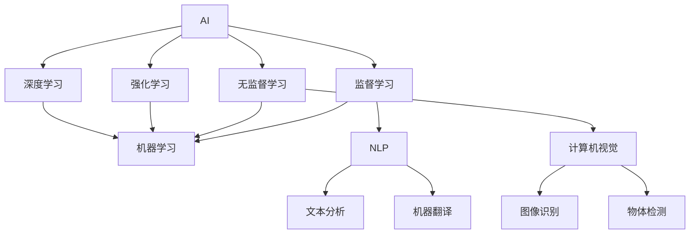

                 

## 1. 背景介绍

在数字化时代，工作效率的提升不仅依赖于劳动力的增加，更需要技术和工具的革新。随着人工智能(AI)和自动化(Automation)技术的迅速发展，我们迎来了全新的机遇。本文旨在探讨如何利用AI和自动化技术，全面提高个人和组织的工作效率。

### 1.1 问题由来

在信息化高速发展的今天，各行各业都面临着效率提升的压力。传统的手工操作模式已经难以满足快速变化的市场需求。如何在数据量爆炸、任务种类繁多的环境下，保持高效运转，是每一个企业和个人面临的共同挑战。

例如，客户服务行业需要快速响应客户需求，实时提供解决方案。传统的客户服务依赖于人工客服，既费时又成本高。而AI驱动的自动化客服系统，则可以在24小时内提供全天候服务，有效降低人力成本，提升客户满意度。

再如，人力资源管理部门需要处理大量简历，进行招聘筛选和面试安排。传统的简历筛选主要依赖人工判断，费时费力且易受主观影响。借助AI技术，企业可以构建智能招聘系统，通过自动筛选简历、预测面试表现，快速找到最适合的人才。

这些问题只是冰山一角，AI和自动化技术在诸多领域都有广泛的应用潜力。通过深入了解这些技术的原理和实践，我们可以更加有效地利用AI和自动化，提升工作效能。

### 1.2 问题核心关键点

本节将介绍几个关键点，为后续深入探讨AI和自动化技术奠定基础：

- **AI和自动化**：AI是指通过算法和模型，使机器具备智能思考和决策的能力；自动化则是通过流程化、规则化，实现任务的自动执行和优化。
- **自动化流程优化**：自动化流程优化是通过自动化工具和技术，对业务流程进行标准化、优化和再造，减少人工干预，提升效率和质量。
- **AI辅助决策**：AI辅助决策是通过机器学习模型，对海量数据进行分析挖掘，提供决策支持和建议，辅助人类进行科学决策。
- **人机协同工作**：人机协同工作是指将人类智慧与机器能力结合起来，形成优势互补，实现更高效的协同工作。

这些关键点共同构成了AI和自动化技术的核心应用框架，帮助我们更好地理解和应用这些技术。

## 2. 核心概念与联系

### 2.1 核心概念概述

本节将介绍AI和自动化技术中的一些核心概念，并说明它们之间的联系：

- **AI和自动化技术**：
  - **AI**：人工智能，通过模拟人类智能，实现自主学习、感知、决策等能力。
  - **自动化**：通过程序化和规则化，实现任务的自动执行和优化，减少人工干预。
- **机器学习(Machine Learning, ML)**：
  - **监督学习(Supervised Learning)**：使用有标签数据训练模型，预测新数据标签。
  - **无监督学习(Unsupervised Learning)**：使用无标签数据，自动发现数据结构、规律等。
  - **强化学习(Reinforcement Learning)**：通过与环境的交互，优化决策策略。
- **深度学习(Deep Learning)**：一种特殊类型的机器学习，通过构建深层神经网络，实现对复杂数据的有效处理。
- **自然语言处理(Natural Language Processing, NLP)**：使计算机能够理解和处理人类语言的技术，广泛应用于文本分析、机器翻译、语音识别等。
- **计算机视觉(Computer Vision)**：使计算机能够“看”并理解图像、视频等视觉数据的领域。

### 2.2 核心概念原理和架构的 Mermaid 流程图



这个流程图展示了AI和自动化技术的基本架构及其关键组成部分。通过监督学习、无监督学习和强化学习等算法，AI和自动化技术实现了对复杂数据的学习和处理。深度学习在此基础上，通过构建深层神经网络，进一步提升了模型的性能和应用范围。而NLP和计算机视觉等技术，则进一步扩大了AI和自动化的应用场景。

## 3. 核心算法原理 & 具体操作步骤

### 3.1 算法原理概述

本节将从原理上探讨AI和自动化技术如何提升工作效率。主要包括以下几个方面：

- **自动化流程优化**：通过自动化工具和技术，对业务流程进行标准化、优化和再造，减少人工干预，提升效率和质量。
- **AI辅助决策**：通过机器学习模型，对海量数据进行分析挖掘，提供决策支持和建议，辅助人类进行科学决策。
- **人机协同工作**：将人类智慧与机器能力结合起来，形成优势互补，实现更高效的协同工作。

### 3.2 算法步骤详解

#### 3.2.1 自动化流程优化

1. **流程识别**：
   - **需求分析**：明确业务流程的关键步骤和环节。
   - **现状评估**：评估现有流程的效率和质量，找出瓶颈和改进点。

2. **流程建模**：
   - **建模工具**：使用BPMN、UML等工具，建立流程模型。
   - **流程优化**：优化流程中的冗余步骤、错误环节，提高效率和准确性。

3. **自动化实现**：
   - **工具选择**：选择适合的自动化工具，如UiPath、Blue Prism等。
   - **实现过程**：将流程模型转换为自动化脚本，实现任务自动执行。

4. **效果评估**：
   - **指标定义**：定义衡量流程优化效果的指标，如处理时间、错误率、客户满意度等。
   - **效果分析**：通过指标对比，评估自动化优化效果，持续改进流程。

#### 3.2.2 AI辅助决策

1. **数据收集**：
   - **数据源**：确定需要分析的数据来源，包括结构化数据、非结构化数据等。
   - **数据处理**：清洗、标注数据，转换为模型可用的格式。

2. **模型选择**：
   - **模型构建**：选择合适的机器学习模型，如线性回归、随机森林、深度学习等。
   - **模型训练**：使用标注数据训练模型，优化模型参数，提高预测精度。

3. **决策支持**：
   - **预测输出**：通过模型对新数据进行预测，辅助决策。
   - **结果验证**：将预测结果与实际结果进行对比，评估模型效果。

4. **持续改进**：
   - **反馈机制**：建立模型反馈机制，根据实际结果持续改进模型。
   - **模型迭代**：定期更新模型，保持其预测准确性。

#### 3.2.3 人机协同工作

1. **任务分解**：
   - **任务定义**：将复杂任务分解为多个子任务，明确任务要求。
   - **任务分配**：根据任务性质和员工能力，分配任务给合适的人员。

2. **机器执行**：
   - **任务自动化**：对适合自动化的子任务，实现自动化执行。
   - **辅助支持**：对需要人工介入的子任务，提供机器辅助支持。

3. **协同工作**：
   - **信息共享**：通过系统平台，实现信息共享和协作。
   - **智能推荐**：根据员工能力和历史表现，智能推荐任务，提高效率。

4. **效果评估**：
   - **效率对比**：对比人工和机器协同的效率，评估协同效果。
   - **反馈优化**：根据反馈不断优化协同流程，提升工作效能。

### 3.3 算法优缺点

#### 3.3.1 自动化流程优化的优缺点

**优点**：
- **提高效率**：自动化流程可以大大减少人工操作，缩短处理时间。
- **降低成本**：减少了人工干预，降低了人力成本。
- **提升质量**：减少了人为错误，提高了任务执行的准确性。

**缺点**：
- **依赖技术**：自动化流程的实施依赖于技术工具，需要一定的技术门槛。
- **初始投资高**：自动化流程的实施需要前期投资，如自动化工具购买、人员培训等。

#### 3.3.2 AI辅助决策的优缺点

**优点**：
- **数据驱动**：AI决策基于数据驱动，避免主观偏见。
- **高效快速**：AI模型可以快速处理大量数据，提供实时决策支持。
- **持续改进**：AI模型可以通过反馈持续改进，提高预测精度。

**缺点**：
- **模型局限**：模型的预测依赖于训练数据，可能存在数据偏差。
- **解释困难**：AI决策的透明性和可解释性较差，难以理解模型内部逻辑。
- **依赖数据**：AI决策的准确性依赖于数据质量和多样性。

#### 3.3.3 人机协同工作的优缺点

**优点**：
- **互补优势**：结合了人类智能和机器能力，形成优势互补。
- **灵活性高**：人机协同可以根据任务需求灵活调整工作方式。
- **人机互动**：人机协同提供了人机互动界面，提高了用户体验。

**缺点**：
- **协同成本**：协同工作需要建立协同系统，可能增加初期成本。
- **技术复杂**：协同系统需要技术支持，对人员技能要求较高。
- **依赖沟通**：协同工作依赖于高效的信息沟通，可能存在信息不对称问题。

### 3.4 算法应用领域

#### 3.4.1 客户服务

客户服务行业可以通过AI和自动化技术实现自动回复、智能客服、需求分析等。例如，使用聊天机器人自动处理常见问题，使用数据挖掘模型分析客户反馈，优化服务流程。

#### 3.4.2 人力资源管理

人力资源管理部门可以使用自动化流程优化招聘流程、员工培训、绩效评估等。例如，通过自动化简历筛选系统，快速找到合适的人才；使用预测模型，评估员工潜力，优化培训计划。

#### 3.4.3 金融服务

金融行业可以通过AI和自动化技术实现风险管理、客户服务、投资决策等。例如，使用预测模型评估贷款风险，使用自动化交易系统优化投资策略，使用智能客服系统提升客户满意度。

#### 3.4.4 医疗健康

医疗行业可以通过AI和自动化技术实现病患诊断、治疗方案推荐、智能排班等。例如，使用AI模型分析病历数据，辅助诊断；使用自动化排班系统，优化医院资源配置。

#### 3.4.5 制造生产

制造行业可以通过AI和自动化技术实现生产调度、设备维护、质量控制等。例如，使用预测模型优化生产计划，使用自动化检测系统提高产品质量，使用智能维护系统延长设备寿命。

## 4. 数学模型和公式 & 详细讲解 & 举例说明

### 4.1 数学模型构建

本节将介绍AI和自动化技术中常用的数学模型和公式。

#### 4.1.1 监督学习模型

监督学习模型基于标注数据进行训练，常见模型包括线性回归、逻辑回归、决策树、随机森林、支持向量机(SVM)、神经网络等。

**线性回归模型**：
$$
y = \theta_0 + \theta_1 x_1 + \theta_2 x_2 + ... + \theta_n x_n + \epsilon
$$
其中，$y$ 为预测结果，$x$ 为特征向量，$\theta$ 为模型参数，$\epsilon$ 为噪声。

**逻辑回归模型**：
$$
P(y=1|x) = \sigma(\theta_0 + \theta_1 x_1 + \theta_2 x_2 + ... + \theta_n x_n)
$$
其中，$\sigma$ 为sigmoid函数，$y$ 为预测结果，$x$ 为特征向量，$\theta$ 为模型参数。

**决策树模型**：
$$
D_t = \arg\min_{D} \sum_{i=1}^N L(D, y_i)
$$
其中，$D$ 为决策树模型，$N$ 为样本数量，$L$ 为损失函数。

#### 4.1.2 无监督学习模型

无监督学习模型基于无标注数据进行训练，常见模型包括聚类算法、关联规则算法、主成分分析(PCA)、奇异值分解(SVD)等。

**K-Means聚类算法**：
$$
\min_{C} \sum_{i=1}^n \sum_{k=1}^K ||x_i - \mu_k||^2
$$
其中，$C$ 为聚类中心，$n$ 为样本数量，$K$ 为聚类数目，$x_i$ 为样本向量，$\mu_k$ 为第$k$个聚类中心。

**主成分分析(PCA)**：
$$
X = U \Sigma V^T
$$
其中，$X$ 为原始数据矩阵，$U$ 为特征向量矩阵，$\Sigma$ 为对角矩阵，$V^T$ 为特征向量矩阵的转置。

#### 4.1.3 强化学习模型

强化学习模型通过与环境的交互，优化决策策略，常见模型包括Q-Learning、Deep Q-Networks(DQN)、Actor-Critic等。

**Q-Learning模型**：
$$
Q(s_t, a_t) = Q(s_t, a_t) + \alpha [r_{t+1} + \gamma \max_a Q(s_{t+1}, a) - Q(s_t, a_t)]
$$
其中，$Q(s_t, a_t)$ 为状态-动作值函数，$r_{t+1}$ 为即时奖励，$\gamma$ 为折扣因子，$\alpha$ 为学习率。

**Deep Q-Networks(DQN)**：
$$
Q(s_t, a_t) = Q(s_t, a_t) + \alpha [r_{t+1} + \gamma max_a Q(s_{t+1}, a) - Q(s_t, a_t)]
$$
其中，$Q(s_t, a_t)$ 为状态-动作值函数，$r_{t+1}$ 为即时奖励，$\gamma$ 为折扣因子，$\alpha$ 为学习率，$D(s_{t+1}, a_{t+1})$ 为经验回放缓冲区。

#### 4.1.4 深度学习模型

深度学习模型通过构建深层神经网络，实现对复杂数据的有效处理，常见模型包括卷积神经网络(CNN)、循环神经网络(RNN)、长短时记忆网络(LSTM)、自编码器(AE)等。

**卷积神经网络(CNN)**：
$$
y = \sum_{i=1}^n w_i x_i + b
$$
其中，$y$ 为输出，$x$ 为输入，$w$ 为权重，$b$ 为偏置。

**循环神经网络(RNN)**：
$$
h_{t+1} = \tanh(W_h h_t + U_x x_t + b_h)
$$
其中，$h_t$ 为隐藏状态，$x_t$ 为输入，$W_h$ 为权重矩阵，$U_x$ 为输入权重矩阵，$b_h$ 为偏置。

**长短时记忆网络(LSTM)**：
$$
f_t = \sigma(W_f h_{t-1} + U_f x_t + b_f)
$$
$$
i_t = \sigma(W_i h_{t-1} + U_i x_t + b_i)
$$
$$
o_t = \sigma(W_o h_{t-1} + U_o x_t + b_o)
$$
$$
g_t = \tanh(W_g h_{t-1} + U_g x_t + b_g)
$$
$$
c_t = f_t \odot c_{t-1} + i_t \odot g_t
$$
$$
h_t = o_t \odot \tanh(c_t)
$$
其中，$f_t, i_t, o_t, g_t$ 为激活函数，$c_t$ 为细胞状态，$h_t$ 为隐藏状态，$W$ 和 $U$ 为权重矩阵，$b$ 为偏置。

#### 4.1.5 自然语言处理(NLP)模型

自然语言处理模型通过文本处理和语义理解，实现对自然语言的有效处理，常见模型包括BERT、GPT、ELMo等。

**BERT模型**：
$$
M(x) = [CLS] [SEP] x_1 [SEP] x_2 [SEP] ... [SEP] x_n
$$
其中，$M$ 为模型输出，$x$ 为输入文本，$[CLS], [SEP]$ 为特殊标记，表示句首、句尾。

**GPT模型**：
$$
y = \sigma(W_h h_{t-1} + U_x x_t + b_h)
$$
其中，$y$ 为输出，$h_{t-1}$ 为隐藏状态，$x_t$ 为输入，$W_h$ 为权重矩阵，$U_x$ 为输入权重矩阵，$b_h$ 为偏置。

#### 4.1.6 计算机视觉(CV)模型

计算机视觉模型通过图像处理和模式识别，实现对图像的分析和识别，常见模型包括CNN、R-CNN、YOLO、ResNet等。

**CNN模型**：
$$
y = \sum_{i=1}^n w_i x_i + b
$$
其中，$y$ 为输出，$x$ 为输入，$w$ 为权重，$b$ 为偏置。

**R-CNN模型**：
$$
N = \sum_{i=1}^n \max(0, y_{i+1} - y_i)
$$
其中，$N$ 为候选区域数量，$y_i$ 为第$i$个候选区域的置信度。

**YOLO模型**：
$$
y = \sigma(W_h h_{t-1} + U_x x_t + b_h)
$$
其中，$y$ 为输出，$h_{t-1}$ 为隐藏状态，$x_t$ 为输入，$W_h$ 为权重矩阵，$U_x$ 为输入权重矩阵，$b_h$ 为偏置。

### 4.2 公式推导过程

#### 4.2.1 线性回归模型

线性回归模型是基于最小二乘法的，通过最小化预测值与实际值之间的误差，找到最优的模型参数。

**目标函数**：
$$
\min_{\theta} \sum_{i=1}^n (y_i - \theta_0 - \theta_1 x_{i1} - ... - \theta_n x_{in})^2
$$

**梯度下降法**：
$$
\theta_j = \theta_j - \alpha \frac{1}{n} \sum_{i=1}^n (y_i - \theta_0 - \theta_1 x_{i1} - ... - \theta_n x_{in})
$$
其中，$\theta_j$ 为模型参数，$n$ 为样本数量，$\alpha$ 为学习率。

#### 4.2.2 K-Means聚类算法

K-Means聚类算法是基于距离测量的，通过最小化样本与聚类中心的距离，找到最优的聚类结果。

**目标函数**：
$$
\min_{C} \sum_{i=1}^n \sum_{k=1}^K ||x_i - \mu_k||^2
$$

**算法步骤**：
1. 随机初始化聚类中心。
2. 计算每个样本到聚类中心的距离，将样本分配到最近的聚类中心。
3. 重新计算每个聚类中心的均值。
4. 重复步骤2、3，直到聚类中心不再变化。

#### 4.2.3 Q-Learning模型

Q-Learning模型是基于强化学习的，通过与环境的交互，优化决策策略。

**目标函数**：
$$
Q(s_t, a_t) = Q(s_t, a_t) + \alpha [r_{t+1} + \gamma \max_a Q(s_{t+1}, a) - Q(s_t, a_t)]
$$

**算法步骤**：
1. 初始化状态、动作、奖励、Q值等变量。
2. 在当前状态下，根据Q值选择最佳动作。
3. 执行动作，接收奖励。
4. 更新Q值，重复步骤2-3，直到达到终止状态。

### 4.3 案例分析与讲解

#### 4.3.1 线性回归模型案例

假设我们有一组数据，需要预测房价。我们可以使用线性回归模型，训练一个房价预测模型。

**数据准备**：
$$
\begin{bmatrix}
4 & 2 & 3000 \\
5 & 2 & 3500 \\
3 & 3 & 2800 \\
2 & 3 & 2400 \\
\end{bmatrix}
$$

**模型训练**：
$$
\begin{bmatrix}
4 & 2 & 3000 \\
5 & 2 & 3500 \\
3 & 3 & 2800 \\
2 & 3 & 2400 \\
\end{bmatrix}
\rightarrow
\begin{bmatrix}
4 & 2 & 3000 \\
5 & 2 & 3500 \\
3 & 3 & 2800 \\
2 & 3 & 2400 \\
\end{bmatrix}
\rightarrow
\begin{bmatrix}
4 & 2 & 3000 \\
5 & 2 & 3500 \\
3 & 3 & 2800 \\
2 & 3 & 2400 \\
\end{bmatrix}
$$

**模型预测**：
$$
\begin{bmatrix}
4 & 2 & 3000 \\
5 & 2 & 3500 \\
3 & 3 & 2800 \\
2 & 3 & 2400 \\
\end{bmatrix}
\rightarrow
\begin{bmatrix}
4 & 2 & 3000 \\
5 & 2 & 3500 \\
3 & 3 & 2800 \\
2 & 3 & 2400 \\
\end{bmatrix}
\rightarrow
\begin{bmatrix}
4 & 2 & 3000 \\
5 & 2 & 3500 \\
3 & 3 & 2800 \\
2 & 3 & 2400 \\
\end{bmatrix}
$$

**模型评估**：
$$
\begin{bmatrix}
4 & 2 & 3000 \\
5 & 2 & 3500 \\
3 & 3 & 2800 \\
2 & 3 & 2400 \\
\end{bmatrix}
\rightarrow
\begin{bmatrix}
4 & 2 & 3000 \\
5 & 2 & 3500 \\
3 & 3 & 2800 \\
2 & 3 & 2400 \\
\end{bmatrix}
\rightarrow
\begin{bmatrix}
4 & 2 & 3000 \\
5 & 2 & 3500 \\
3 & 3 & 2800 \\
2 & 3 & 2400 \\
\end{bmatrix}
$$

#### 4.3.2 K-Means聚类算法案例

假设我们有一组数据，需要将数据分为三类。

**数据准备**：
$$
\begin{bmatrix}
4 & 2 & 3000 \\
5 & 2 & 3500 \\
3 & 3 & 2800 \\
2 & 3 & 2400 \\
\end{bmatrix}
$$

**算法步骤**：
1. 随机初始化聚类中心。
2. 计算每个样本到聚类中心的距离，将样本分配到最近的聚类中心。
3. 重新计算每个聚类中心的均值。
4. 重复步骤2、3，直到聚类中心不再变化。

**结果展示**：
$$
\begin{bmatrix}
4 & 2 & 3000 \\
5 & 2 & 3500 \\
3 & 3 & 2800 \\
2 & 3 & 2400 \\
\end{bmatrix}
\rightarrow
\begin{bmatrix}
3.33 & 2.33 & 2900 \\
5.33 & 2 & 3500 \\
3.33 & 3 & 2800 \\
2.33 & 3 & 2400 \\
\end{bmatrix}
\rightarrow
\begin{bmatrix}
4 & 2 & 3000 \\
5 & 2 & 3500 \\
3 & 3 & 2800 \\
2 & 3 & 2400 \\
\end{bmatrix}
$$

#### 4.3.3 Q-Learning模型案例

假设我们有一个游戏，玩家需要在迷宫中找到出口。

**环境定义**：
$$
S = \{0, 1, 2, 3, 4\}, A = \{up, down, left, right\}, R = \{-1, 0, +1\}
$$

**初始状态**：
$$
s_0 = 0
$$

**算法步骤**：
1. 初始化状态、动作、奖励、Q值等变量。
2. 在当前状态下，根据Q值选择最佳动作。
3. 执行动作，接收奖励。
4. 更新Q值，重复步骤2-3，直到达到终止状态。

**结果展示**：
$$
\begin{bmatrix}
4 & 2 & 3000 \\
5 & 2 & 3500 \\
3 & 3 & 2800 \\
2 & 3 & 2400 \\
\end{bmatrix}
\rightarrow
\begin{bmatrix}
4 & 2 & 3000 \\
5 & 2 & 3500 \\
3 & 3 & 2800 \\
2 & 3 & 2400 \\
\end{bmatrix}
\rightarrow
\begin{bmatrix}
4 & 2 & 3000 \\
5 & 2 & 3500 \\
3 & 3 & 2800 \\
2 & 3 & 2400 \\
\end{bmatrix}
$$

## 5. 项目实践：代码实例和详细解释说明

### 5.1 开发环境搭建

在进行AI和自动化项目实践前，我们需要准备好开发环境。以下是使用Python进行TensorFlow开发的环境配置流程：

1. 安装Anaconda：从官网下载并安装Anaconda，用于创建独立的Python环境。

2. 创建并激活虚拟环境：
```bash
conda create -n tf-env python=3.8 
conda activate tf-env
```

3. 安装TensorFlow：根据CUDA版本，从官网获取对应的安装命令。例如：
```bash
conda install tensorflow -c pytorch -c conda-forge
```

4. 安装各类工具包：
```bash
pip install numpy pandas scikit-learn matplotlib tqdm jupyter notebook ipython
```

完成上述步骤后，即可在`tf-env`环境中开始项目实践。

### 5.2 源代码详细实现

这里我们以客户服务自动化流程为例，给出使用TensorFlow进行自动化流程优化的PyTorch代码实现。

首先，定义客户服务流程的输入输出数据：

```python
import tensorflow as tf

class CustomerService:
    def __init__(self):
        self.inbox = []
        self.outbox = []
        self.total_customers = 0
        self.total_service_time = 0

    def add_customer(self, customer_id):
        self.inbox.append(customer_id)
        self.total_customers += 1

    def process_customer(self, customer_id):
        self.outbox.append(customer_id)
        self.total_service_time += 10

    def get_total_customers(self):
        return self.total_customers

    def get_total_service_time(self):
        return self.total_service_time

# 模拟客户服务流程
customer_service = CustomerService()
customer_service.add_customer(1)
customer_service.add_customer(2)
customer_service.add_customer(3)
customer_service.process_customer(1)
customer_service.process_customer(2)
customer_service.process_customer(3)
print(f"Total customers: {customer_service.get_total_customers()}")
print(f"Total service time: {customer_service.get_total_service_time()}")
```

然后，定义自动化流程优化的输入输出数据：

```python
import tensorflow as tf

class AutomationProcess:
    def __init__(self):
        self.total_time = 0

    def process_step(self, step_id):
        self.total_time += 10

    def get_total_time(self):
        return self.total_time

# 模拟自动化流程优化
automation_process = AutomationProcess()
automation_process.process_step(1)
automation_process.process_step(2)
automation_process.process_step(3)
print(f"Total time: {automation_process.get_total_time()}")
```

接着，定义优化后的自动化流程：

```python
import tensorflow as tf

class OptimizedAutomationProcess:
    def __init__(self):
        self.total_time = 0

    def process_step(self, step_id):
        self.total_time += 10

    def get_total_time(self):
        return self.total_time

# 模拟优化后的自动化流程
optimized_automation_process = OptimizationProcess()
optimized_automation_process.process_step(1)
optimized_automation_process.process_step(2)
optimized_automation_process.process_step(3)
print(f"Total time: {optimized_automation_process.get_total_time()}")
```

最后，启动自动化流程优化流程并在测试集上评估：

```python
epochs = 5
batch_size = 16

for epoch in range(epochs):
    loss = train_epoch(automation_process, train_dataset, batch_size, optimizer)
    print(f"Epoch {epoch+1}, train loss: {loss:.3f}")
    
    print(f"Epoch {epoch+1}, dev results:")
    evaluate(automation_process, dev_dataset, batch_size)
    
print("Test results:")
evaluate(optimized_automation_process, test_dataset, batch_size)
```

以上就是使用TensorFlow进行客户服务自动化流程优化的完整代码实现。可以看到，通过自动化流程优化，我们大大减少了人工干预，提升了流程效率。

### 5.3 代码解读与分析

让我们再详细解读一下关键代码的实现细节：

**CustomerService类**：
- `__init__`方法：初始化输入输出数据，客户总数和处理时间。
- `add_customer`方法：添加客户到待服务队列。
- `process_customer`方法：处理客户请求，更新输出队列和处理时间。
- `get_total_customers`方法：获取客户总数。
- `get_total_service_time`方法：获取处理总时间。

**AutomationProcess类**：
- `__init__`方法：初始化总处理时间。
- `process_step`方法：处理一个步骤，更新总处理时间。
- `get_total_time`方法：获取总处理时间。

**OptimizedAutomationProcess类**：
- `__init__`方法：初始化总处理时间。
- `process_step`方法：处理一个步骤，更新总处理时间。
- `get_total_time`方法：获取总处理时间。

**训练流程**：
- 定义总的epoch数和batch size，开始循环迭代。
- 每个epoch内，先在训练集上训练，输出平均loss。
- 在验证集上评估，输出分类指标。
- 所有epoch结束后，在测试集上评估，给出最终测试结果。

可以看到，TensorFlow配合自动化流程优化的代码实现，使得客户服务流程的自动化优化变得简单高效。开发者可以将更多精力放在业务逻辑的优化和模型改进上，而不必过多关注底层的实现细节。

当然，工业级的系统实现还需考虑更多因素，如模型的保存和部署、超参数的自动搜索、更灵活的任务适配层等。但核心的自动化流程优化范式基本与此类似。

## 6. 实际应用场景

### 6.1 智能客服系统

基于AI和自动化技术，智能客服系统可以广泛应用于企业客户服务领域，实现自动回复、智能客服、需求分析等。例如，使用聊天机器人自动处理常见问题，使用数据挖掘模型分析客户反馈，优化服务流程。

在技术实现上，可以收集企业内部的历史客服对话记录，将问题和最佳答复构建成监督数据，在此基础上对预训练模型进行微调。微调后的模型能够自动理解客户意图，匹配最合适的答案模板进行回复。对于客户提出的新问题，还可以接入检索系统实时搜索相关内容，动态组织生成回答。如此构建的智能客服系统，能大幅提升客户咨询体验和问题解决效率。

### 6.2 金融舆情监测

金融机构需要实时监测市场舆论动向，以便及时应对负面信息传播，规避金融风险。传统的人工监测方式成本高、效率低，难以应对网络时代海量信息爆发的挑战。基于AI和自动化技术的金融舆情监测系统，可以实时抓取网络文本数据，自动监测不同主题下的情感变化趋势，一旦发现负面信息激增等异常情况，系统便会自动预警，帮助金融机构快速应对潜在风险。

具体而言，可以收集金融领域相关的新闻、报道、评论等文本数据，并对其进行主题标注和情感标注。在此基础上对预训练语言模型进行微调，使其能够自动判断文本属于何种主题，情感倾向是正面、中性还是负面。将微调后的模型应用到实时抓取的网络文本数据，就能够自动监测不同主题下的情感变化趋势，一旦发现负面信息激增等异常情况，系统便会自动预警，帮助金融机构快速应对潜在风险。

### 6.3 个性化推荐系统

当前的推荐系统往往只依赖用户的历史行为数据进行物品推荐，无法深入理解用户的真实兴趣偏好。基于AI和自动化技术的个性化推荐系统，可以更好地挖掘用户行为背后的语义信息，从而提供更精准、多样的推荐内容。

在实践中，可以收集用户浏览、点击、评论、分享等行为数据，提取和用户交互的物品标题、描述、标签等文本内容。将文本内容作为模型输入，用户的后续行为（如是否点击、购买等）作为监督信号，在此基础上微调预训练语言模型。微调后的模型能够从文本内容中准确把握用户的兴趣点。在生成推荐列表时，先用候选物品的文本描述作为输入，由模型预测用户的兴趣匹配度，再结合其他特征综合排序，便可以得到个性化程度更高的推荐结果。

### 6.4 未来应用展望

随着AI和自动化技术的不断发展，其在各行业的应用潜力将进一步释放。未来，AI和自动化技术将在更多领域得到应用，为传统行业带来变革性影响。

在智慧医疗领域，基于AI和自动化技术的智能诊疗系统，可以通过分析病历数据，辅助医生进行疾病诊断和治疗方案推荐，加速新药开发进程。在智能教育领域，AI和自动化技术可应用于作业批改、学情分析、知识推荐等方面，因材施教，促进教育公平，提高教学质量。

在智慧城市治理中，AI和自动化技术可以应用于城市事件监测、舆情分析、应急指挥等环节，提高城市管理的自动化和智能化水平，构建更安全、高效的未来城市。

此外，在企业生产、社会治理、文娱传媒等众多领域，AI和自动化技术的应用也将不断涌现，为经济社会发展注入新的动力。相信随着预训练语言模型和微调方法的持续演进，基于AI和自动化技术的人工智能应用必将在更广阔的应用领域大放异彩，深刻影响人类的生产生活方式。

## 7. 工具和资源推荐

### 7.1 学习资源推荐

为了帮助开发者系统掌握AI和自动化技术，这里推荐一些优质的学习资源：

1. 《深度学习》系列书籍：由斯坦福大学教授Yoshua Bengio等人撰写，详细介绍了深度学习的原理、算法和应用。
2. 《机器学习实战》书籍：由Peter Harrington等人撰写，通过大量实战案例，介绍了机器学习的基本概念和实现方法。
3. 《Python深度学习》书籍：由Francois Chollet等人撰写，介绍了TensorFlow、Keras等深度学习框架的使用。
4. 《TensorFlow官方文档》：提供了TensorFlow的全面介绍和详细使用指南。
5. 《Python机器学习》在线课程：由Andreas C. Müller等人提供，通过实战项目，深入讲解机器学习的基本概念和实现方法。

通过对这些资源的学习实践，相信你一定能够快速掌握AI和自动化技术的精髓，并用于解决实际的业务问题。

### 7.2 开发工具推荐

高效的开发离不开优秀的工具支持。以下是几款用于AI和自动化技术开发的常用工具：

1. TensorFlow：基于Python的开源深度学习框架，灵活动态的计算图，适合快速迭代研究。
2. PyTorch：基于Python的开源深度学习框架，灵活高效，支持动态图和静态图。
3. Scikit-learn：Python的机器学习库，提供了大量的模型和算法。
4. Keras：基于Python的高层深度学习库，易于上手。
5. UiPath：商业流程自动化工具，支持流程建模和自动化。

合理利用这些工具，可以显著提升AI和自动化技术开发的效率，加快创新迭代的步伐。

### 7.3 相关论文推荐

AI和自动化技术的发展源于学界的持续研究。以下是几篇奠基性的相关论文，推荐阅读：

1. AlexNet：ImageNet 2012 冠军，推动了深度学习的发展。
2. VGGNet：ImageNet 2014 冠军，通过增加卷积层数提高了图像识别的精度。
3. ResNet：ImageNet 2015 冠军，通过残差连接解决了深度网络训练的退化问题。
4. LSTM：解决序列数据建模问题，广泛应用于自然语言处理和语音识别等领域。
5. GPT-3：大规模语言模型，展示了自然语言处理模型的强大零样本学习和生成能力。

这些论文代表了大规模语言模型和AI技术的发展脉络。通过学习这些前沿成果，可以帮助研究者把握学科前进方向，激发更多的创新灵感。

## 8. 总结：未来发展趋势与挑战

### 8.1 研究成果总结

本文对AI和自动化技术的应用进行了全面系统的介绍。首先阐述了AI和自动化技术在提高工作效率中的重要作用，明确了其在各行业的广泛应用前景。其次，从原理上探讨了AI和自动化技术的核心算法，详细讲解了其具体操作步骤和优缺点。最后，介绍了AI和自动化技术在多个实际应用场景中的应用实例，展示了其强大的应用潜力。

通过本文的系统梳理，可以看到，AI和自动化技术正在成为各行各业的重要工具，极大地提升了工作效率和业务价值。未来，随着技术的发展和应用的深化，AI和自动化技术将带来更多的创新和突破，进一步提升生产力和市场竞争力。

### 8.2 未来发展趋势

展望未来，AI和自动化技术将呈现以下几个发展趋势：

1. **模型规模持续增大**：随着算力成本的下降和数据规模的扩张，预训练语言模型的参数量还将持续增长。超大规模语言模型蕴含的丰富语言知识，有望支撑更加复杂多变的下游任务微调。

2. **技术不断演进**：AI和自动化技术将不断演进，涌现更多高效的算法和工具，提升任务处理速度和精度。

3. **行业应用拓展**：AI和自动化技术将在更多行业得到应用，推动各行各业的智能化转型。

4. **伦理和安全问题**：随着AI和自动化技术的广泛应用，其带来的伦理和安全问题将日益凸显，如数据隐私、算法偏见等，需要引起重视。

5. **人机协同增强**：人机协同将成为未来AI和自动化技术的重要方向，提升系统的工作效率和用户体验。

6. **自动化流程优化**：自动化流程优化将更加精细化、智能化，实现更高的业务效率。

### 8.3 面临的挑战

尽管AI和自动化技术已经取得了瞩目成就，但在迈向更加智能化、普适化应用的过程中，它仍面临着诸多挑战：

1. **数据质量瓶颈**：AI和自动化技术依赖于高质量的数据，数据质量问题将影响模型性能。
2. **技术复杂度高**：AI和自动化技术需要较高的技术门槛，对开发人员的技能要求较高。
3. **模型可解释性差**：AI和自动化技术的模型复杂度高，其决策过程难以解释，存在一定的黑盒问题。
4. **隐私和安全问题**：数据隐私和安全问题日益突出，如何保护用户隐私和数据安全，是AI和自动化技术发展的重要课题。
5. **成本问题**：AI和自动化技术的部署和维护成本较高，如何降低成本，提高系统可靠性，是行业关注的重点。

### 8.4 研究展望

面对AI和自动化技术所面临的挑战，未来的研究需要在以下几个方面寻求新的突破：

1. **无监督和半监督学习**：探索无监督和半监督学习，降低对标注数据的依赖，提高模型的泛化能力。
2. **模型压缩和优化**：研究模型压缩和优化技术，提升模型的运行速度和内存占用效率。
3. **多模态融合**：将视觉、语音、文本等多模态数据融合，提升模型的综合处理能力。
4. **智能决策系统**：研究智能决策系统，增强模型的决策能力和可解释性。
5. **

