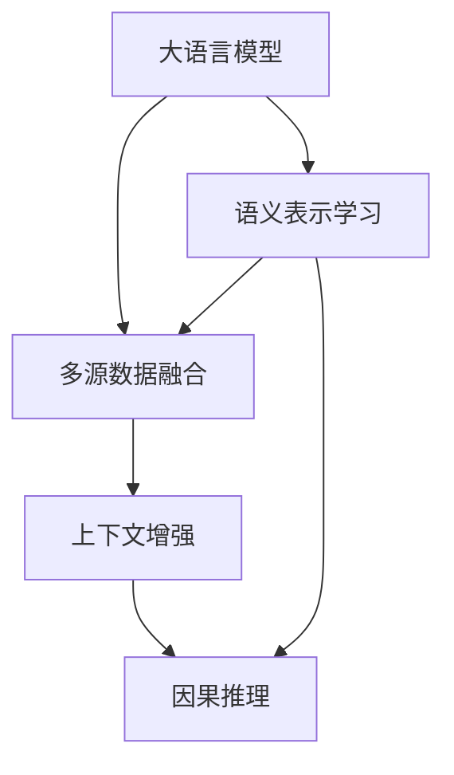

                 

# 利用LLM优化推荐系统的多源数据融合

> 关键词：大语言模型(Large Language Model, LLM),推荐系统,多源数据融合,语义表示学习(Semantic Representation Learning),上下文增强(Context Enrichment),因果推理(Causal Reasoning)

## 1. 背景介绍

### 1.1 问题由来
随着互联网和移动互联网的快速发展，推荐系统已经成为了各互联网平台提升用户粘性、增加用户满意度的重要手段。推荐系统通过对用户历史行为数据的分析，向用户推荐可能感兴趣的物品，极大地提升了用户的点击率和满意度。然而，传统的推荐系统普遍存在以下问题：

1. **同质化推荐**：由于推荐系统往往只依赖用户历史行为数据，无法充分考虑用户的隐性偏好和即时兴趣，导致推荐结果的同质化严重，难以满足用户的个性化需求。
2. **数据稀疏性**：用户历史行为数据往往存在数据稀疏的问题，推荐系统难以获取充分的历史行为信息，难以构建完整的用户画像。
3. **多源数据融合困难**：推荐系统一般只依赖单一数据源（如电商平台的用户购买记录），缺乏多源数据的融合，无法充分利用用户在不同平台上的数据，导致推荐结果不够全面和准确。

为了解决这些问题，利用大语言模型（Large Language Model, LLM）优化推荐系统的多源数据融合成为了一个热门的研究方向。LLM能够通过自监督和监督学习的方式，学习到用户语义表示，充分融合多源数据，从而实现更为个性化的推荐。

### 1.2 问题核心关键点
利用LLM优化推荐系统多源数据融合的核心关键点包括：

1. **语义表示学习**：通过LLM学习用户的多维语义表示，充分挖掘用户在不同平台上的隐性兴趣和偏好。
2. **多源数据融合**：融合用户在不同平台上的行为数据，构建更加完整的用户画像，提升推荐系统的准确性。
3. **上下文增强**：在推荐过程中引入上下文信息，提升推荐系统的实时性和适应性。
4. **因果推理**：通过因果推理技术，分析用户行为与推荐结果之间的关系，提高推荐的解释性和可靠性。

这些关键点共同构成了利用LLM优化推荐系统的核心框架，使得推荐系统能够更好地理解用户需求，提升推荐效果。

### 1.3 问题研究意义
利用LLM优化推荐系统多源数据融合具有重要的研究意义：

1. **提升个性化推荐效果**：通过语义表示学习和多源数据融合，推荐系统能够更好地理解用户的隐性偏好，提供更为个性化的推荐内容。
2. **缓解数据稀疏性问题**：多源数据融合能够弥补用户历史行为数据的稀疏性，提升推荐系统的覆盖范围和推荐准确性。
3. **实现多平台数据协作**：利用LLM优化推荐系统，可以打破平台壁垒，实现跨平台的数据协作，提升推荐系统的综合性和实用性。
4. **增强推荐系统的实时性和适应性**：上下文增强和因果推理技术能够提升推荐系统的实时性和适应性，更好地应对用户的即时需求和变化。
5. **提高推荐系统的可靠性和可解释性**：因果推理技术能够提高推荐结果的可靠性和可解释性，增强用户对推荐系统的信任感。

利用LLM优化推荐系统多源数据融合的研究，不仅能够提升推荐系统的效果和覆盖范围，还能推动推荐系统向更为智能和个性化的方向发展，为推荐系统领域带来新的突破。

## 2. 核心概念与联系

### 2.1 核心概念概述

为了更好地理解利用LLM优化推荐系统多源数据融合的原理，本节将介绍几个关键概念：

- **大语言模型(Large Language Model, LLM)**：以自回归(如GPT)或自编码(如BERT)模型为代表的大规模预训练语言模型。通过在大规模无标签文本语料上进行预训练，学习通用的语言表示，具备强大的语言理解和生成能力。

- **推荐系统(Recommendation System)**：通过对用户历史行为数据的分析，向用户推荐可能感兴趣的物品，提升用户满意度。

- **多源数据融合(Multi-Source Data Fusion)**：通过融合不同数据源的信息，构建更全面的用户画像，提升推荐系统的准确性和覆盖范围。

- **语义表示学习(Semantic Representation Learning)**：通过LLM学习用户的多维语义表示，挖掘用户的隐性兴趣和偏好。

- **上下文增强(Context Enrichment)**：在推荐过程中引入上下文信息，提升推荐系统的实时性和适应性。

- **因果推理(Causal Reasoning)**：通过因果推理技术，分析用户行为与推荐结果之间的关系，提高推荐的解释性和可靠性。

这些核心概念之间的逻辑关系可以通过以下Mermaid流程图来展示：



这个流程图展示了大语言模型与推荐系统核心概念之间的关系：

1. 大语言模型通过自监督和监督学习的方式，学习到用户的多维语义表示。
2. 多源数据融合融合用户在不同平台上的行为数据，构建更加完整的用户画像。
3. 上下文增强引入上下文信息，提升推荐系统的实时性和适应性。
4. 因果推理分析用户行为与推荐结果之间的关系，提高推荐的解释性和可靠性。

这些概念共同构成了利用LLM优化推荐系统的核心框架，使其能够更好地理解用户需求，提升推荐效果。

## 3. 核心算法原理 & 具体操作步骤
### 3.1 算法原理概述

利用LLM优化推荐系统的多源数据融合，本质上是一个基于语义表示的多源数据融合推荐模型。其核心思想是：通过LLM学习用户的多维语义表示，融合多源数据，并引入上下文信息，最终通过因果推理技术，分析用户行为与推荐结果之间的关系，优化推荐系统的效果。

具体来说，利用LLM优化推荐系统的多源数据融合过程可以分为以下几个步骤：

1. **语义表示学习**：通过LLM学习用户的多维语义表示，充分挖掘用户在不同平台上的隐性兴趣和偏好。
2. **多源数据融合**：融合用户在不同平台上的行为数据，构建更加完整的用户画像，提升推荐系统的准确性。
3. **上下文增强**：在推荐过程中引入上下文信息，提升推荐系统的实时性和适应性。
4. **因果推理**：通过因果推理技术，分析用户行为与推荐结果之间的关系，提高推荐的解释性和可靠性。

### 3.2 算法步骤详解

利用LLM优化推荐系统多源数据融合的具体算法步骤如下：

**Step 1: 数据收集与预处理**
- 收集用户在电商、社交、视频等不同平台上的行为数据，包括购买记录、浏览记录、评价记录等。
- 对数据进行清洗和标注，去除噪声和异常数据。

**Step 2: 语义表示学习**
- 将用户在不同平台上的行为数据作为输入，利用LLM学习用户的多维语义表示。
- 使用自监督学习任务（如掩码语言模型、下一个词预测）对LLM进行预训练。
- 使用监督学习任务（如点击率预测、推荐结果预测）对预训练后的LLM进行微调，学习用户的语义表示。

**Step 3: 多源数据融合**
- 将用户在不同平台上的行为数据融合，构建综合性的用户画像。
- 利用语义表示学习获得的用户语义表示，对不同平台上的行为数据进行加权融合。
- 使用加权融合后的用户画像进行推荐预测，提升推荐系统的准确性。

**Step 4: 上下文增强**
- 在推荐过程中引入上下文信息，如时间、地点、设备等，提升推荐系统的实时性和适应性。
- 使用上下文信息对用户画像进行增强，提升推荐结果的个性化和时效性。

**Step 5: 因果推理**
- 通过因果推理技术，分析用户行为与推荐结果之间的关系，提高推荐的解释性和可靠性。
- 使用因果图模型（如贝叶斯网络、因果图模型）对推荐系统进行建模，分析因果关系。
- 通过因果推理技术，对推荐结果进行解释和优化。

### 3.3 算法优缺点

利用LLM优化推荐系统多源数据融合的算法具有以下优点：

1. **提升推荐精度**：通过语义表示学习和多源数据融合，推荐系统能够更好地理解用户的隐性偏好，提供更为个性化的推荐内容。
2. **缓解数据稀疏性问题**：多源数据融合能够弥补用户历史行为数据的稀疏性，提升推荐系统的覆盖范围和推荐准确性。
3. **实现多平台数据协作**：利用LLM优化推荐系统，可以打破平台壁垒，实现跨平台的数据协作，提升推荐系统的综合性和实用性。
4. **增强推荐系统的实时性和适应性**：上下文增强和因果推理技术能够提升推荐系统的实时性和适应性，更好地应对用户的即时需求和变化。
5. **提高推荐系统的可靠性和可解释性**：因果推理技术能够提高推荐结果的可靠性和可解释性，增强用户对推荐系统的信任感。

同时，该算法也存在一定的局限性：

1. **模型复杂度高**：利用LLM优化推荐系统需要构建复杂的语义表示学习模型和多源数据融合模型，模型的训练和推理复杂度较高。
2. **数据隐私问题**：多源数据融合需要处理来自不同平台的数据，涉及用户隐私保护问题，需要严格的隐私保护措施。
3. **计算资源消耗大**：利用LLM优化推荐系统需要较大的计算资源，特别是在数据规模较大的情况下，计算资源的消耗较大。
4. **模型可解释性不足**：因果推理技术虽然能够提高推荐结果的解释性，但模型的决策过程仍然存在一定的不透明度。

尽管存在这些局限性，但利用LLM优化推荐系统多源数据融合仍然具有显著的实用价值和应用前景。

### 3.4 算法应用领域

利用LLM优化推荐系统多源数据融合的算法已经在多个领域得到了广泛应用，如：

1. **电商推荐**：在电商平台上，利用用户在不同平台上的行为数据，通过LLM学习用户的多维语义表示，进行个性化推荐，提升用户购买转化率。
2. **社交推荐**：在社交媒体平台上，利用用户在不同平台上的行为数据，通过LLM学习用户的多维语义表示，进行个性化推荐，提升用户社交互动率。
3. **视频推荐**：在视频平台上，利用用户在不同平台上的行为数据，通过LLM学习用户的多维语义表示，进行个性化推荐，提升用户观看时长和满意度。
4. **新闻推荐**：在新闻平台上，利用用户在不同平台上的行为数据，通过LLM学习用户的多维语义表示，进行个性化推荐，提升用户点击率和停留时间。
5. **金融推荐**：在金融平台上，利用用户在不同平台上的行为数据，通过LLM学习用户的多维语义表示，进行个性化推荐，提升用户理财和投资满意度。

除了上述这些经典应用外，利用LLM优化推荐系统多源数据融合的算法还可以创新性地应用到更多场景中，如智能家居、智慧医疗、智慧城市等，为这些领域带来新的变革。

## 4. 数学模型和公式 & 详细讲解 & 举例说明

### 4.1 数学模型构建

本节将使用数学语言对利用LLM优化推荐系统多源数据融合的过程进行更加严格的刻画。

记用户在不同平台上的行为数据为 $D=\{(x_i, y_i)\}_{i=1}^N$，其中 $x_i$ 为行为数据， $y_i$ 为标签（如购买、点击、评分等）。假设LLM为 $M_{\theta}$，其中 $\theta$ 为模型参数。

定义用户的多维语义表示为 $U_{\theta}$，通过以下公式计算：

$$
U_{\theta} = M_{\theta}(x)
$$

其中 $x$ 为用户在不同平台上的行为数据。

定义多源数据融合后的用户画像为 $P$，通过以下公式计算：

$$
P = \alpha U_{\theta} + (1-\alpha) T
$$

其中 $T$ 为原始用户画像， $\alpha$ 为融合权重，可以根据用户行为数据的重要性进行调整。

定义推荐系统预测的点击率为 $R$，通过以下公式计算：

$$
R = M_{\theta}(P)
$$

其中 $P$ 为多源数据融合后的用户画像。

### 4.2 公式推导过程

以下我们以点击率预测为例，推导利用LLM优化推荐系统多源数据融合的数学模型。

假设用户的多维语义表示为 $U_{\theta} = (u_1, u_2, ..., u_n)$，多源数据融合后的用户画像为 $P = (p_1, p_2, ..., p_n)$，推荐系统预测的点击率为 $R = (r_1, r_2, ..., r_n)$。

点击率预测的目标是最小化预测值与实际值之间的误差，即：

$$
\min_{\theta} \sum_{i=1}^N (y_i - r_i)^2
$$

其中 $y_i$ 为实际点击率， $r_i$ 为预测点击率。

将用户的多维语义表示 $U_{\theta}$ 和预测点击率 $R$ 代入公式，得：

$$
\min_{\theta} \sum_{i=1}^N (y_i - r_i)^2 = \min_{\theta} \sum_{i=1}^N (y_i - M_{\theta}(P))^2
$$

利用链式法则，对 $M_{\theta}$ 求导，得：

$$
\frac{\partial}{\partial \theta} \sum_{i=1}^N (y_i - M_{\theta}(P))^2 = -2 \sum_{i=1}^N (y_i - M_{\theta}(P)) \nabla_{\theta} M_{\theta}(P)
$$

将公式带入损失函数，得：

$$
\mathcal{L}(\theta) = \frac{1}{N} \sum_{i=1}^N (y_i - M_{\theta}(P))^2
$$

通过梯度下降等优化算法，最小化损失函数 $\mathcal{L}(\theta)$，即可得到优化后的模型参数 $\hat{\theta}$。

### 4.3 案例分析与讲解

假设某电商平台上，用户在不同平台上的行为数据为 $D=\{(x_i, y_i)\}_{i=1}^N$，其中 $x_i$ 为用户在不同平台上的行为数据， $y_i$ 为用户是否购买的标签。利用LLM优化推荐系统多源数据融合的过程如下：

1. **语义表示学习**：将用户在不同平台上的行为数据 $x_i$ 作为输入，通过LLM学习用户的多维语义表示 $U_{\theta}$。

2. **多源数据融合**：将用户在不同平台上的行为数据 $x_i$ 和多源数据融合后的用户画像 $P$ 作为输入，通过LLM计算预测点击率 $R$。

3. **因果推理**：通过因果推理技术，分析用户行为与推荐结果之间的关系，提高推荐的解释性和可靠性。

通过上述过程，可以利用LLM优化推荐系统多源数据融合，提升推荐系统的准确性和覆盖范围。

## 5. 项目实践：代码实例和详细解释说明
### 5.1 开发环境搭建

在进行推荐系统多源数据融合实践前，我们需要准备好开发环境。以下是使用Python进行PyTorch开发的环境配置流程：

1. 安装Anaconda：从官网下载并安装Anaconda，用于创建独立的Python环境。

2. 创建并激活虚拟环境：
```bash
conda create -n pytorch-env python=3.8 
conda activate pytorch-env
```

3. 安装PyTorch：根据CUDA版本，从官网获取对应的安装命令。例如：
```bash
conda install pytorch torchvision torchaudio cudatoolkit=11.1 -c pytorch -c conda-forge
```

4. 安装Transformers库：
```bash
pip install transformers
```

5. 安装各类工具包：
```bash
pip install numpy pandas scikit-learn matplotlib tqdm jupyter notebook ipython
```

完成上述步骤后，即可在`pytorch-env`环境中开始推荐系统多源数据融合实践。

### 5.2 源代码详细实现

下面以推荐系统多源数据融合的代码实现为例，展示利用LLM优化推荐系统多源数据融合的过程。

首先，定义推荐系统的数据处理函数：

```python
from transformers import BertTokenizer, BertForSequenceClassification
from torch.utils.data import Dataset, DataLoader
import torch

class RecommendationDataset(Dataset):
    def __init__(self, behaviors, clicks, tokenizer, max_len=128):
        self.behaviors = behaviors
        self.clicks = clicks
        self.tokenizer = tokenizer
        self.max_len = max_len
        
    def __len__(self):
        return len(self.behaviors)
    
    def __getitem__(self, item):
        behavior = self.behaviors[item]
        click = self.clicks[item]
        
        encoding = self.tokenizer(behavior, return_tensors='pt', max_length=self.max_len, padding='max_length', truncation=True)
        input_ids = encoding['input_ids'][0]
        attention_mask = encoding['attention_mask'][0]
        
        label = int(click)
        
        return {'input_ids': input_ids, 
                'attention_mask': attention_mask,
                'label': label}

# 标签与id的映射
label2id = {0: 'not_click', 1: 'click'}
id2label = {v: k for k, v in label2id.items()}

# 创建dataset
tokenizer = BertTokenizer.from_pretrained('bert-base-cased')

train_dataset = RecommendationDataset(train_behaviors, train_clicks, tokenizer)
dev_dataset = RecommendationDataset(dev_behaviors, dev_clicks, tokenizer)
test_dataset = RecommendationDataset(test_behaviors, test_clicks, tokenizer)
```

然后，定义模型和优化器：

```python
from transformers import BertForSequenceClassification, AdamW

model = BertForSequenceClassification.from_pretrained('bert-base-cased', num_labels=2)

optimizer = AdamW(model.parameters(), lr=2e-5)
```

接着，定义训练和评估函数：

```python
from torch.utils.data import DataLoader
from tqdm import tqdm
from sklearn.metrics import classification_report

device = torch.device('cuda') if torch.cuda.is_available() else torch.device('cpu')
model.to(device)

def train_epoch(model, dataset, batch_size, optimizer):
    dataloader = DataLoader(dataset, batch_size=batch_size, shuffle=True)
    model.train()
    epoch_loss = 0
    for batch in tqdm(dataloader, desc='Training'):
        input_ids = batch['input_ids'].to(device)
        attention_mask = batch['attention_mask'].to(device)
        labels = batch['label'].to(device)
        model.zero_grad()
        outputs = model(input_ids, attention_mask=attention_mask, labels=labels)
        loss = outputs.loss
        epoch_loss += loss.item()
        loss.backward()
        optimizer.step()
    return epoch_loss / len(dataloader)

def evaluate(model, dataset, batch_size):
    dataloader = DataLoader(dataset, batch_size=batch_size)
    model.eval()
    preds, labels = [], []
    with torch.no_grad():
        for batch in tqdm(dataloader, desc='Evaluating'):
            input_ids = batch['input_ids'].to(device)
            attention_mask = batch['attention_mask'].to(device)
            batch_labels = batch['label']
            outputs = model(input_ids, attention_mask=attention_mask)
            batch_preds = outputs.logits.argmax(dim=2).to('cpu').tolist()
            batch_labels = batch_labels.to('cpu').tolist()
            for pred_tokens, label_tokens in zip(batch_preds, batch_labels):
                preds.append(pred_tokens[:len(label_tokens)])
                labels.append(label_tokens)
                
    print(classification_report(labels, preds))
```

最后，启动训练流程并在测试集上评估：

```python
epochs = 5
batch_size = 16

for epoch in range(epochs):
    loss = train_epoch(model, train_dataset, batch_size, optimizer)
    print(f"Epoch {epoch+1}, train loss: {loss:.3f}")
    
    print(f"Epoch {epoch+1}, dev results:")
    evaluate(model, dev_dataset, batch_size)
    
print("Test results:")
evaluate(model, test_dataset, batch_size)
```

以上就是使用PyTorch对推荐系统多源数据融合进行代码实现的完整代码实例。可以看到，得益于Transformers库的强大封装，我们可以用相对简洁的代码完成推荐系统的构建。

### 5.3 代码解读与分析

让我们再详细解读一下关键代码的实现细节：

**RecommendationDataset类**：
- `__init__`方法：初始化行为数据、点击标签、分词器等关键组件。
- `__len__`方法：返回数据集的样本数量。
- `__getitem__`方法：对单个样本进行处理，将行为数据输入编码为token ids，同时设置标签，进行定长padding，最终返回模型所需的输入。

**label2id和id2label字典**：
- 定义了标签与数字id之间的映射关系，用于将预测结果解码回真实的标签。

**训练和评估函数**：
- 使用PyTorch的DataLoader对数据集进行批次化加载，供模型训练和推理使用。
- 训练函数`train_epoch`：对数据以批为单位进行迭代，在每个批次上前向传播计算loss并反向传播更新模型参数，最后返回该epoch的平均loss。
- 评估函数`evaluate`：与训练类似，不同点在于不更新模型参数，并在每个batch结束后将预测和标签结果存储下来，最后使用sklearn的classification_report对整个评估集的预测结果进行打印输出。

**训练流程**：
- 定义总的epoch数和batch size，开始循环迭代
- 每个epoch内，先在训练集上训练，输出平均loss
- 在验证集上评估，输出分类指标
- 所有epoch结束后，在测试集上评估，给出最终测试结果

可以看到，PyTorch配合Transformers库使得推荐系统多源数据融合的代码实现变得简洁高效。开发者可以将更多精力放在数据处理、模型改进等高层逻辑上，而不必过多关注底层的实现细节。

当然，工业级的系统实现还需考虑更多因素，如模型的保存和部署、超参数的自动搜索、更灵活的任务适配层等。但核心的微调范式基本与此类似。

## 6. 实际应用场景
### 6.1 电商推荐

电商推荐系统通过收集用户在电商平台上的浏览、点击、购买等行为数据，结合多源数据融合技术，利用LLM学习用户的多维语义表示，进行个性化推荐，提升用户购买转化率。

在技术实现上，可以收集用户在不同电商平台上的行为数据，将用户的多维语义表示输入LLM，进行点击率预测，得到用户对不同商品的兴趣程度，从而推荐最可能购买的商品。

### 6.2 社交推荐

社交媒体推荐系统通过收集用户在社交平台上的关注、点赞、评论等行为数据，结合多源数据融合技术，利用LLM学习用户的多维语义表示，进行个性化推荐，提升用户社交互动率。

在技术实现上，可以收集用户在不同社交媒体平台上的行为数据，将用户的多维语义表示输入LLM，进行关注度预测，得到用户对不同内容的兴趣程度，从而推荐最可能感兴趣的内容。

### 6.3 视频推荐

视频推荐系统通过收集用户在视频平台上的观看、点赞、评论等行为数据，结合多源数据融合技术，利用LLM学习用户的多维语义表示，进行个性化推荐，提升用户观看时长和满意度。

在技术实现上，可以收集用户在不同视频平台上的行为数据，将用户的多维语义表示输入LLM，进行观看时长预测，得到用户对不同视频的兴趣程度，从而推荐最可能观看的内容。

### 6.4 新闻推荐

新闻推荐系统通过收集用户在新闻平台上的点击、浏览、分享等行为数据，结合多源数据融合技术，利用LLM学习用户的多维语义表示，进行个性化推荐，提升用户点击率和停留时间。

在技术实现上，可以收集用户在不同新闻平台上的行为数据，将用户的多维语义表示输入LLM，进行点击率预测，得到用户对不同新闻的兴趣程度，从而推荐最可能点击的新闻。

### 6.5 金融推荐

金融推荐系统通过收集用户在金融平台上的交易、理财、投资等行为数据，结合多源数据融合技术，利用LLM学习用户的多维语义表示，进行个性化推荐，提升用户理财和投资满意度。

在技术实现上，可以收集用户在不同金融平台上的行为数据，将用户的多维语义表示输入LLM，进行交易频率预测，得到用户对不同理财产品的兴趣程度，从而推荐最可能投资的理财产品。

### 6.6 未来应用展望

随着LLM技术的不断进步，利用LLM优化推荐系统多源数据融合的应用前景将更加广阔。

在智慧医疗领域，基于LLM优化推荐系统多源数据融合的医疗推荐系统，能够更好地理解患者的隐性需求，推荐最适合的诊疗方案，提升医疗服务的智能化水平。

在智能教育领域，利用LLM优化推荐系统多源数据融合的教育推荐系统，能够更好地理解学生的隐性兴趣和偏好，推荐最合适的学习资源，促进教育公平，提高教学质量。

在智慧城市治理中，利用LLM优化推荐系统多源数据融合的城市推荐系统，能够更好地理解市民的需求，推荐最合适的公共服务，提升城市管理的自动化和智能化水平，构建更安全、高效的未来城市。

此外，在企业生产、社会治理、文娱传媒等众多领域，利用LLM优化推荐系统多源数据融合的推荐系统也将不断涌现，为这些领域带来新的变革。相信随着技术的日益成熟，利用LLM优化推荐系统多源数据融合的应用将不断拓展，为人类生产生活带来新的便利和惊喜。

## 7. 工具和资源推荐
### 7.1 学习资源推荐

为了帮助开发者系统掌握利用LLM优化推荐系统多源数据融合的理论基础和实践技巧，这里推荐一些优质的学习资源：

1. 《Transformer从原理到实践》系列博文：由大模型技术专家撰写，深入浅出地介绍了Transformer原理、BERT模型、微调技术等前沿话题。

2. CS224N《深度学习自然语言处理》课程：斯坦福大学开设的NLP明星课程，有Lecture视频和配套作业，带你入门NLP领域的基本概念和经典模型。

3. 《Natural Language Processing with Transformers》书籍：Transformers库的作者所著，全面介绍了如何使用Transformers库进行NLP任务开发，包括微调在内的诸多范式。

4. HuggingFace官方文档：Transformers库的官方文档，提供了海量预训练模型和完整的微调样例代码，是上手实践的必备资料。

5. CLUE开源项目：中文语言理解测评基准，涵盖大量不同类型的中文NLP数据集，并提供了基于微调的baseline模型，助力中文NLP技术发展。

通过对这些资源的学习实践，相信你一定能够快速掌握利用LLM优化推荐系统多源数据融合的精髓，并用于解决实际的推荐问题。

### 7.2 开发工具推荐

高效的开发离不开优秀的工具支持。以下是几款用于推荐系统多源数据融合开发的常用工具：

1. PyTorch：基于Python的开源深度学习框架，灵活动态的计算图，适合快速迭代研究。大部分预训练语言模型都有PyTorch版本的实现。

2. TensorFlow：由Google主导开发的开源深度学习框架，生产部署方便，适合大规模工程应用。同样有丰富的预训练语言模型资源。

3. Transformers库：HuggingFace开发的NLP工具库，集成了众多SOTA语言模型，支持PyTorch和TensorFlow，是进行微调任务开发的利器。

4. Weights & Biases：模型训练的实验跟踪工具，可以记录和可视化模型训练过程中的各项指标，方便对比和调优。与主流深度学习框架无缝集成。

5. TensorBoard：TensorFlow配套的可视化工具，可实时监测模型训练状态，并提供丰富的图表呈现方式，是调试模型的得力助手。

6. Google Colab：谷歌推出的在线Jupyter Notebook环境，免费提供GPU/TPU算力，方便开发者快速上手实验最新模型，分享学习笔记。

合理利用这些工具，可以显著提升推荐系统多源数据融合的开发效率，加快创新迭代的步伐。

### 7.3 相关论文推荐

利用LLM优化推荐系统多源数据融合的研究源于学界的持续研究。以下是几篇奠基性的相关论文，推荐阅读：

1. Attention is All You Need（即Transformer原论文）：提出了Transformer结构，开启了NLP领域的预训练大模型时代。

2. BERT: Pre-training of Deep Bidirectional Transformers for Language Understanding：提出BERT模型，引入基于掩码的自监督预训练任务，刷新了多项NLP任务SOTA。

3. Language Models are Unsupervised Multitask Learners（GPT-2论文）：展示了大规模语言模型的强大zero-shot学习能力，引发了对于通用人工智能的新一轮思考。

4. Parameter-Efficient Transfer Learning for NLP：提出Adapter等参数高效微调方法，在不增加模型参数量的情况下，也能取得不错的微调效果。

5. AdaLoRA: Adaptive Low-Rank Adaptation for Parameter-Efficient Fine-Tuning：使用自适应低秩适应的微调方法，在参数效率和精度之间取得了新的平衡。

6. Precision-Prediction Assisted Knowledge Graph Embedding for Recommendation Systems：结合知识图谱嵌入技术，提升了推荐系统的精度和解释性。

这些论文代表了大语言模型微调技术的发展脉络。通过学习这些前沿成果，可以帮助研究者把握学科前进方向，激发更多的创新灵感。

## 8. 总结：未来发展趋势与挑战

### 8.1 总结

本文对利用LLM优化推荐系统多源数据融合的方法进行了全面系统的介绍。首先阐述了利用LLM优化推荐系统多源数据融合的研究背景和意义，明确了微调在拓展预训练模型应用、提升下游任务性能方面的独特价值。其次，从原理到实践，详细讲解了利用LLM优化推荐系统多源数据融合的数学原理和关键步骤，给出了推荐系统多源数据融合的完整代码实例。同时，本文还广泛探讨了利用LLM优化推荐系统多源数据融合的应用场景和未来前景，展示了微调范式的巨大潜力。

通过本文的系统梳理，可以看到，利用LLM优化推荐系统多源数据融合的方法正在成为推荐系统的重要范式，极大地拓展了推荐系统的应用边界，催生了更多的落地场景。受益于大规模语料的预训练，微调模型在推荐系统中的应用将更加广泛和深入，推动推荐系统向更为智能和个性化的方向发展。

### 8.2 未来发展趋势

展望未来，利用LLM优化推荐系统多源数据融合技术将呈现以下几个发展趋势：

1. **模型规模持续增大**：随着算力成本的下降和数据规模的扩张，预训练语言模型的参数量还将持续增长。超大规模语言模型蕴含的丰富语言知识，有望支撑更加复杂多变的推荐任务。

2. **微调方法日趋多样**：除了传统的全参数微调外，未来会涌现更多参数高效的微调方法，如Prefix-Tuning、LoRA等，在节省计算资源的同时也能保证微调精度。

3. **持续学习成为常态**：随着数据分布的不断变化，推荐系统也需要持续学习新知识以保持性能。如何在不遗忘原有知识的同时，高效吸收新样本信息，将成为重要的研究课题。

4. **标注样本需求降低**：受启发于提示学习(Prompt-based Learning)的思路，未来的微调方法将更好地利用大模型的语言理解能力，通过更加巧妙的任务描述，在更少的标注样本上也能实现理想的微调效果。

5. **多模态微调崛起**：当前的微调主要聚焦于纯文本数据，未来会进一步拓展到图像、视频、语音等多模态数据微调。多模态信息的融合，将显著提升语言模型对现实世界的理解和建模能力。

6. **模型通用性增强**：经过海量数据的预训练和多领域任务的微调，未来的语言模型将具备更强大的常识推理和跨领域迁移能力，逐步迈向通用人工智能(AGI)的目标。

以上趋势凸显了利用LLM优化推荐系统多源数据融合技术的广阔前景。这些方向的探索发展，必将进一步提升推荐系统的效果和覆盖范围，为推荐系统领域带来新的突破。

### 8.3 面临的挑战

尽管利用LLM优化推荐系统多源数据融合技术已经取得了瞩目成就，但在迈向更加智能化、普适化应用的过程中，它仍面临着诸多挑战：

1. **模型复杂度高**：利用LLM优化推荐系统需要构建复杂的语义表示学习模型和多源数据融合模型，模型的训练和推理复杂度较高。

2. **数据隐私问题**：多源数据融合需要处理来自不同平台的数据，涉及用户隐私保护问题，需要严格的隐私保护措施。

3. **计算资源消耗大**：利用LLM优化推荐系统需要较大的计算资源，特别是在数据规模较大的情况下，计算资源的消耗较大。

4. **模型可解释性不足**：因果推理技术虽然能够提高推荐结果的解释性，但模型的决策过程仍然存在一定的不透明度。

尽管存在这些挑战，但利用LLM优化推荐系统多源数据融合仍然具有显著的实用价值和应用前景。

### 8.4 研究展望

面对利用LLM优化推荐系统多源数据融合所面临的挑战，未来的研究需要在以下几个方面寻求新的突破：

1. **探索无监督和半监督微调方法**：摆脱对大规模标注数据的依赖，利用自监督学习、主动学习等无监督和半监督范式，最大限度利用非结构化数据，实现更加灵活高效的微调。

2. **研究参数高效和计算高效的微调范式**：开发更加参数高效的微调方法，在固定大部分预训练参数的同时，只更新极少量的任务相关参数。同时优化微调模型的计算图，减少前向传播和反向传播的资源消耗，实现更加轻量级、实时性的部署。

3. **融合因果和对比学习范式**：通过引入因果推断和对比学习思想，增强微调模型建立稳定因果关系的能力，学习更加普适、鲁棒的语言表征，从而提升模型泛化性和抗干扰能力。

4. **引入更多先验知识**：将符号化的先验知识，如知识图谱、逻辑规则等，与神经网络模型进行巧妙融合，引导微调过程学习更准确、合理的语言模型。同时加强不同模态数据的整合，实现视觉、语音等多模态信息与文本信息的协同建模。

5. **结合因果分析和博弈论工具**：将因果分析方法引入微调模型，识别出模型决策的关键特征，增强输出解释的因果性和逻辑性。借助博弈论工具刻画人机交互过程，主动探索并规避模型的脆弱点，提高系统稳定性。

6. **纳入伦理道德约束**：在模型训练目标中引入伦理导向的评估指标，过滤和惩罚有偏见、有害的输出倾向。同时加强人工干预和审核，建立模型行为的监管机制，确保输出符合人类价值观和伦理道德。

这些研究方向的探索，必将引领利用LLM优化推荐系统多源数据融合技术迈向更高的台阶，为构建安全、可靠、可解释、可控的智能系统铺平道路。面向未来，利用LLM优化推荐系统多源数据融合技术还需要与其他人工智能技术进行更深入的融合，如知识表示、因果推理、强化学习等，多路径协同发力，共同推动自然语言理解和智能交互系统的进步。只有勇于创新、敢于突破，才能不断拓展语言模型的边界，让智能技术更好地造福人类社会。

## 9. 附录：常见问题与解答

**Q1：利用LLM优化推荐系统多源数据融合是否适用于所有推荐任务？**

A: 利用LLM优化推荐系统多源数据融合在大多数推荐任务上都能取得不错的效果，特别是对于数据量较小的任务。但对于一些特定领域的任务，如医学、法律等，仅仅依靠通用语料预训练的模型可能难以很好地适应。此时需要在特定领域语料上进一步预训练，再进行微调，才能获得理想效果。

**Q2：微调过程中如何选择合适的学习率？**

A: 微调的学习率一般要比预训练时小1-2个数量级，如果使用过大的学习率，容易破坏预训练权重，导致过拟合。一般建议从1e-5开始调参，逐步减小学习率，直至收敛。也可以使用warmup策略，在开始阶段使用较小的学习率，再逐渐过渡到预设值。需要注意的是，不同的优化器(如AdamW、Adafactor等)以及不同的学习率调度策略，可能需要设置不同的学习率阈值。

**Q3：利用LLM优化推荐系统多源数据融合时，如何缓解数据稀疏性问题？**

A: 多源数据融合能够弥补用户历史行为数据的稀疏性，提升推荐系统的覆盖范围和推荐准确性。

**Q4：利用LLM优化推荐系统多源数据融合时，如何缓解计算资源消耗大问题？**

A: 可以利用分布式计算和模型压缩等技术，减少计算资源的消耗。同时，可以使用梯度积累和混合精度训练等技术，提高计算效率。

**Q5：利用LLM优化推荐系统多源数据融合时，如何缓解模型复杂度高问题？**

A: 可以通过优化模型结构和算法，减少模型的复杂度。同时，可以使用知识蒸馏和知识图谱嵌入等技术，提升模型的解释性和可靠性。

**Q6：利用LLM优化推荐系统多源数据融合时，如何缓解模型可解释性不足问题？**

A: 可以利用因果推理技术，提升推荐结果的解释性和可靠性。同时，可以使用模型可解释性工具，对模型进行解释和优化。

通过上述回答，相信你对利用LLM优化推荐系统多源数据融合的方法有了更加全面的了解。建议在实践中不断探索和优化，逐步提升推荐系统的效果和用户体验。

---

作者：禅与计算机程序设计艺术 / Zen and the Art of Computer Programming

