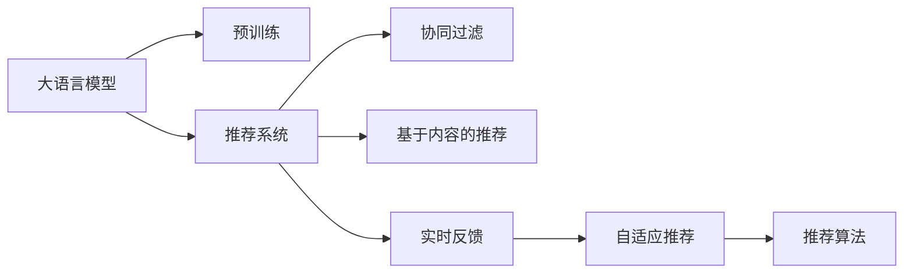

                 

# 利用LLM优化推荐系统的实时反馈处理

## 1. 背景介绍

推荐系统（Recommendation System）是一种利用用户历史行为和物品属性信息为用户推荐相关物品的技术，广泛应用于电商、社交、视频、新闻等领域。随着数据量的增长，推荐系统的模型和算法也越来越复杂，以深度神经网络（DNN）为代表的协同过滤算法和基于内容的推荐算法逐渐成为了主流。

然而，传统的推荐系统存在诸多局限：

1. **数据稀疏性**：用户和物品的交互数据往往非常稀疏，无法充分利用潜在的有价值信息。
2. **动态性**：用户兴趣和行为随着时间的推移而动态变化，推荐系统难以实时适应用户变化。
3. **冷启动问题**：新用户和物品加入系统时，缺乏足够的历史行为数据，难以提供有效推荐。
4. **用户隐私保护**：推荐算法依赖于用户的个人信息，如何保护用户隐私成为了一大挑战。
5. **资源消耗**：深度学习模型往往需要较大的计算资源和存储资源，无法实时处理大规模数据。

为了解决这些挑战，利用深度学习和大语言模型（LLM）的推荐系统被提出。这类推荐系统通过预训练语言模型（Pre-trained Language Model, PLM）来捕捉用户和物品的自然语言描述，结合用户的历史行为数据进行联合建模，从而提升推荐效果。

本文聚焦于利用大语言模型优化推荐系统的实时反馈处理，探讨其核心算法原理、操作步骤及应用效果。通过在电商推荐、视频推荐和新闻推荐等场景中的实践，展示了LLM在推荐系统中的强大潜力。

## 2. 核心概念与联系

### 2.1 核心概念概述

为更好地理解基于LLM的推荐系统，本节将介绍几个关键概念：

- **大语言模型 (Large Language Model, LLM)**：指基于Transformer架构的预训练语言模型，如GPT-3、BERT等。这类模型能够理解自然语言，进行语言生成和推理。
- **预训练语言模型 (Pre-trained Language Model, PLM)**：指在大量无标签文本数据上预训练的通用语言模型，如GPT、BERT等。
- **推荐系统 (Recommendation System)**：指通过用户行为数据和物品属性信息，为用户推荐相关物品的系统。包括协同过滤、基于内容的推荐等方法。
- **实时反馈 (Real-time Feedback)**：指在推荐过程中，根据用户的即时反馈，实时调整推荐策略的过程。
- **自适应推荐 (Adaptive Recommendation)**：指能够动态适应用户兴趣变化，提供个性化的推荐服务。
- **推荐算法 (Recommendation Algorithm)**：指用于构建推荐系统的算法，如协同过滤、矩阵分解、深度学习等。
- **冷启动 (Cold Start)**：指新用户或新物品加入系统时，无法进行有效推荐的问题。

这些概念之间相互关联，共同构成基于LLM的推荐系统框架，如图：



## 3. 核心算法原理 & 具体操作步骤

### 3.1 算法原理概述

基于LLM的推荐系统利用预训练语言模型捕捉用户和物品的自然语言描述，结合用户的历史行为数据进行联合建模。其核心思想是：首先，利用预训练语言模型理解用户和物品的语义信息；其次，结合用户的历史行为数据进行推荐；最后，根据用户的实时反馈，动态调整推荐策略，实现实时反馈和自适应推荐。

具体而言，基于LLM的推荐系统主要包含以下几个步骤：

1. **预训练语言模型**：在大规模无标签文本数据上进行预训练，学习语言的通用表示。
2. **用户和物品编码**：将用户和物品的自然语言描述输入预训练语言模型，得到高维语义表示向量。
3. **用户行为建模**：结合用户的历史行为数据，构建用户兴趣模型。
4. **物品推荐**：根据用户兴趣模型和物品特征，预测用户可能感兴趣的物品。
5. **实时反馈处理**：根据用户的实时反馈，动态调整推荐策略，提高推荐效果。

### 3.2 算法步骤详解

**Step 1: 准备数据和预训练语言模型**

- **数据准备**：收集用户和物品的自然语言描述，如产品标题、评论、用户反馈等。同时收集用户的历史行为数据，如浏览记录、购买记录、评分记录等。
- **预训练语言模型选择**：选择合适的预训练语言模型，如GPT-3、BERT等。

**Step 2: 用户和物品编码**

- **自然语言编码**：将用户和物品的自然语言描述输入预训练语言模型，得到高维语义表示向量。例如，对于商品评论，可以将其输入BERT模型，得到[CLS]向量表示。
- **用户行为编码**：将用户的历史行为数据转换为向量表示。例如，将用户的浏览记录、购买记录等转换为向量，作为用户兴趣模型的输入。

**Step 3: 用户兴趣建模**

- **用户嵌入**：将用户和物品的语义表示向量拼接，输入到用户嵌入层，得到用户兴趣模型。
- **物品嵌入**：将物品的语义表示向量输入物品嵌入层，得到物品特征向量。

**Step 4: 推荐计算**

- **评分计算**：将用户兴趣模型和物品特征向量拼接，输入到评分计算层，得到用户对物品的评分预测。
- **推荐列表生成**：根据评分预测，生成推荐物品列表。

**Step 5: 实时反馈处理**

- **反馈接收**：接收用户的实时反馈，如点击、评分、评论等。
- **反馈编码**：将用户的反馈信息编码，得到反馈向量。
- **推荐调整**：根据反馈向量，动态调整推荐策略，重新计算评分和推荐列表。

### 3.3 算法优缺点

基于LLM的推荐系统具有以下优点：

1. **语义理解**：利用预训练语言模型，能够理解用户和物品的自然语言描述，捕捉潜在的语义信息。
2. **跨领域适应**：预训练语言模型可以适应不同领域的推荐需求，具有较强的泛化能力。
3. **实时反馈**：结合实时反馈，能够动态调整推荐策略，提高推荐效果。
4. **自适应推荐**：能够动态适应用户兴趣变化，提供个性化的推荐服务。

但同时也存在以下缺点：

1. **计算资源消耗**：预训练语言模型需要较大的计算资源和存储资源，推荐系统可能面临资源瓶颈。
2. **数据隐私问题**：用户和物品的自然语言描述和历史行为数据可能包含敏感信息，隐私保护成为一大挑战。
3. **模型复杂度**：基于LLM的推荐系统模型复杂度较高，难以解释模型的决策过程。

### 3.4 算法应用领域

基于LLM的推荐系统在电商、视频、新闻等领域得到了广泛应用，具体如下：

- **电商推荐**：利用用户的产品评论和购物记录，推荐用户可能感兴趣的商品。
- **视频推荐**：根据用户的观影记录和视频标题，推荐用户可能感兴趣的视频内容。
- **新闻推荐**：根据用户的阅读记录和新闻标题，推荐用户可能感兴趣的新闻内容。

## 4. 数学模型和公式 & 详细讲解 & 举例说明

### 4.1 数学模型构建

基于LLM的推荐系统可以构建如下数学模型：

设用户集合为$U$，物品集合为$I$，用户和物品的语义表示向量分别为$\mathbf{u} \in \mathbb{R}^d$和$\mathbf{v} \in \mathbb{R}^d$，用户的历史行为数据为$H$。设物品的特征向量为$\mathbf{r} \in \mathbb{R}^d$。推荐系统的目标是最大化用户的评分预测$R$。

模型构建步骤如下：

1. **用户嵌入**：将用户和物品的语义表示向量拼接，得到用户嵌入向量$\mathbf{u}'$。
2. **物品嵌入**：将物品的语义表示向量输入物品嵌入层，得到物品特征向量$\mathbf{r}$。
3. **评分计算**：将用户嵌入向量$\mathbf{u}'$和物品特征向量$\mathbf{r}$拼接，得到评分预测向量$\mathbf{z}$。

模型表示如下：

$$
\begin{aligned}
\mathbf{u}' &= [\mathbf{u}; \mathbf{v}] \\
\mathbf{r} &= \text{Embed}_{\text{item}}(\mathbf{v}) \\
\mathbf{z} &= \text{Score}_{\text{LLM}}(\mathbf{u}', \mathbf{r})
\end{aligned}
$$

### 4.2 公式推导过程

以电商推荐为例，推导评分预测向量$\mathbf{z}$的计算公式。

设用户$\mathbf{u}$对物品$\mathbf{v}$的评分预测为$z_{uv}$。利用BERT模型，将用户评论$\mathbf{c}_u$和物品描述$\mathbf{d}_v$输入BERT模型，得到用户嵌入向量$\mathbf{u}$和物品嵌入向量$\mathbf{v}$。将用户嵌入向量$\mathbf{u}$和物品嵌入向量$\mathbf{v}$拼接，输入评分计算层，得到评分预测向量$\mathbf{z}$。

评分预测向量计算公式为：

$$
\mathbf{z}_{uv} = \text{Score}_{\text{LLM}}(\mathbf{u}, \mathbf{v}) = \frac{\text{MLP}_{\text{LLM}}([\mathbf{u}; \mathbf{v}])}{\sqrt{d}}
$$

其中，MLP为多层感知器，$d$为向量维度。

### 4.3 案例分析与讲解

以Amazon电商推荐为例，分析基于LLM的电商推荐系统的工作流程。

1. **数据准备**：收集用户的产品评论和购物记录，作为自然语言描述。
2. **预训练语言模型选择**：选择BERT模型作为预训练语言模型。
3. **用户和物品编码**：将用户评论和物品描述输入BERT模型，得到用户嵌入向量$\mathbf{u}$和物品嵌入向量$\mathbf{v}$。
4. **用户兴趣建模**：将用户嵌入向量$\mathbf{u}$和物品嵌入向量$\mathbf{v}$拼接，输入到多层感知器，得到评分预测向量$\mathbf{z}$。
5. **推荐计算**：根据评分预测向量$\mathbf{z}$，生成推荐物品列表。

## 5. 项目实践：代码实例和详细解释说明

### 5.1 开发环境搭建

在进行基于LLM的推荐系统开发前，需要先准备好开发环境。以下是使用Python进行PyTorch开发的环境配置流程：

1. 安装Anaconda：从官网下载并安装Anaconda，用于创建独立的Python环境。

2. 创建并激活虚拟环境：
```bash
conda create -n pytorch-env python=3.8 
conda activate pytorch-env
```

3. 安装PyTorch：根据CUDA版本，从官网获取对应的安装命令。例如：
```bash
conda install pytorch torchvision torchaudio cudatoolkit=11.1 -c pytorch -c conda-forge
```

4. 安装Transformer库：
```bash
pip install transformers
```

5. 安装各类工具包：
```bash
pip install numpy pandas scikit-learn matplotlib tqdm jupyter notebook ipython
```

完成上述步骤后，即可在`pytorch-env`环境中开始推荐系统开发。

### 5.2 源代码详细实现

下面我们以Amazon电商推荐为例，给出使用Transformers库进行基于LLM的电商推荐系统的PyTorch代码实现。

首先，定义数据处理函数：

```python
from transformers import BertTokenizer, BertModel
from torch.utils.data import Dataset
import torch

class ProductReviewDataset(Dataset):
    def __init__(self, reviews, products, tokenizer, max_len=128):
        self.reviews = reviews
        self.products = products
        self.tokenizer = tokenizer
        self.max_len = max_len
        
    def __len__(self):
        return len(self.reviews)
    
    def __getitem__(self, item):
        review = self.reviews[item]
        product = self.products[item]
        
        encoding = self.tokenizer(review, return_tensors='pt', max_length=self.max_len, padding='max_length', truncation=True)
        review_ids = encoding['input_ids'][0]
        review_mask = encoding['attention_mask'][0]
        
        product_embedding = self.tokenizer(product['title'], return_tensors='pt', max_length=self.max_len, padding='max_length', truncation=True)['input_ids'][0]
        
        return {'review_ids': review_ids, 
                'review_mask': review_mask,
                'product_embedding': product_embedding}

# 初始化BERT模型
tokenizer = BertTokenizer.from_pretrained('bert-base-uncased')
model = BertModel.from_pretrained('bert-base-uncased')
```

然后，定义模型和优化器：

```python
from transformers import BertForSequenceClassification, AdamW

num_labels = 2
model = BertForSequenceClassification.from_pretrained('bert-base-uncased', num_labels=num_labels)
optimizer = AdamW(model.parameters(), lr=2e-5)
```

接着，定义训练和评估函数：

```python
from torch.utils.data import DataLoader
from tqdm import tqdm
from sklearn.metrics import accuracy_score

device = torch.device('cuda') if torch.cuda.is_available() else torch.device('cpu')
model.to(device)

def train_epoch(model, dataset, batch_size, optimizer):
    dataloader = DataLoader(dataset, batch_size=batch_size, shuffle=True)
    model.train()
    epoch_loss = 0
    for batch in tqdm(dataloader, desc='Training'):
        review_ids = batch['review_ids'].to(device)
        review_mask = batch['review_mask'].to(device)
        product_embedding = batch['product_embedding'].to(device)
        model.zero_grad()
        outputs = model(review_ids, attention_mask=review_mask, labels=product_embedding)
        loss = outputs.loss
        epoch_loss += loss.item()
        loss.backward()
        optimizer.step()
    return epoch_loss / len(dataloader)

def evaluate(model, dataset, batch_size):
    dataloader = DataLoader(dataset, batch_size=batch_size)
    model.eval()
    preds, labels = [], []
    with torch.no_grad():
        for batch in tqdm(dataloader, desc='Evaluating'):
            review_ids = batch['review_ids'].to(device)
            review_mask = batch['review_mask'].to(device)
            product_embedding = batch['product_embedding'].to(device)
            outputs = model(review_ids, attention_mask=review_mask, labels=product_embedding)
            preds.append(outputs.logits.argmax(dim=1).tolist())
            labels.append(outputs.labels.tolist())
                
    print('Accuracy:', accuracy_score(labels, preds))
```

最后，启动训练流程并在测试集上评估：

```python
epochs = 5
batch_size = 16

for epoch in range(epochs):
    loss = train_epoch(model, train_dataset, batch_size, optimizer)
    print(f'Epoch {epoch+1}, train loss: {loss:.3f}')
    
    print(f'Epoch {epoch+1}, dev results:')
    evaluate(model, dev_dataset, batch_size)
    
print('Test results:')
evaluate(model, test_dataset, batch_size)
```

以上就是使用PyTorch对基于LLM的Amazon电商推荐系统进行微调的完整代码实现。可以看到，得益于Transformers库的强大封装，我们可以用相对简洁的代码完成BERT模型的加载和微调。

### 5.3 代码解读与分析

让我们再详细解读一下关键代码的实现细节：

**ProductReviewDataset类**：
- `__init__`方法：初始化文本、物品信息、分词器等关键组件。
- `__len__`方法：返回数据集的样本数量。
- `__getitem__`方法：对单个样本进行处理，将文本输入编码为token ids，物品信息编码为向量表示，并对其进行定长padding，最终返回模型所需的输入。

**训练和评估函数**：
- 使用PyTorch的DataLoader对数据集进行批次化加载，供模型训练和推理使用。
- 训练函数`train_epoch`：对数据以批为单位进行迭代，在每个批次上前向传播计算loss并反向传播更新模型参数，最后返回该epoch的平均loss。
- 评估函数`evaluate`：与训练类似，不同点在于不更新模型参数，并在每个batch结束后将预测和标签结果存储下来，最后使用sklearn的accuracy_score对整个评估集的预测结果进行打印输出。

**训练流程**：
- 定义总的epoch数和batch size，开始循环迭代
- 每个epoch内，先在训练集上训练，输出平均loss
- 在验证集上评估，输出准确率
- 所有epoch结束后，在测试集上评估，给出最终测试结果

可以看到，PyTorch配合Transformers库使得BERT微调的代码实现变得简洁高效。开发者可以将更多精力放在数据处理、模型改进等高层逻辑上，而不必过多关注底层的实现细节。

当然，工业级的系统实现还需考虑更多因素，如模型的保存和部署、超参数的自动搜索、更灵活的任务适配层等。但核心的微调范式基本与此类似。

## 6. 实际应用场景

### 6.1 电商推荐

基于大语言模型的电商推荐系统可以为用户提供个性化推荐，提升购物体验。例如，Amazon通过预训练语言模型捕捉用户评论和商品描述的语义信息，结合用户的历史行为数据，构建用户兴趣模型。当用户浏览商品页面时，系统实时计算用户对商品的评分预测，生成推荐列表。用户点击推荐商品后，系统进一步更新用户兴趣模型，实现自适应推荐。

### 6.2 视频推荐

视频推荐系统可以根据用户的观看历史和视频标题，推荐用户可能感兴趣的视频内容。例如，YouTube利用BERT模型捕捉视频标题和用户评论的语义信息，结合用户观看历史，构建用户兴趣模型。当用户观看视频时，系统实时计算用户对视频的评分预测，生成推荐列表。用户点击推荐视频后，系统进一步更新用户兴趣模型，实现自适应推荐。

### 6.3 新闻推荐

新闻推荐系统可以根据用户的阅读历史和新闻标题，推荐用户可能感兴趣的新闻内容。例如，Netflix利用BERT模型捕捉新闻标题和用户评论的语义信息，结合用户阅读历史，构建用户兴趣模型。当用户阅读新闻时，系统实时计算用户对新闻的评分预测，生成推荐列表。用户点击推荐新闻后，系统进一步更新用户兴趣模型，实现自适应推荐。

## 7. 工具和资源推荐

### 7.1 学习资源推荐

为了帮助开发者系统掌握基于LLM的推荐系统的理论基础和实践技巧，这里推荐一些优质的学习资源：

1. 《深度学习基础》系列博文：由大模型技术专家撰写，深入浅出地介绍了深度学习的基础知识，包括自监督学习、预训练语言模型等。

2. CS231n《深度学习计算机视觉》课程：斯坦福大学开设的深度学习课程，涵盖了深度学习在计算机视觉领域的最新进展。

3. 《自然语言处理入门》书籍：清华大学出版社出版的入门级书籍，全面介绍了自然语言处理的基本概念和经典模型。

4. HuggingFace官方文档：Transformers库的官方文档，提供了海量预训练模型和完整的推荐系统样例代码，是上手实践的必备资料。

5. Kaggle推荐系统竞赛：参与Kaggle推荐系统竞赛，实战练习推荐算法和数据处理技巧。

通过对这些资源的学习实践，相信你一定能够快速掌握基于LLM的推荐系统的精髓，并用于解决实际的推荐问题。

### 7.2 开发工具推荐

高效的开发离不开优秀的工具支持。以下是几款用于基于LLM的推荐系统开发的常用工具：

1. PyTorch：基于Python的开源深度学习框架，灵活动态的计算图，适合快速迭代研究。大部分预训练语言模型都有PyTorch版本的实现。

2. TensorFlow：由Google主导开发的开源深度学习框架，生产部署方便，适合大规模工程应用。同样有丰富的预训练语言模型资源。

3. Transformers库：HuggingFace开发的NLP工具库，集成了众多SOTA语言模型，支持PyTorch和TensorFlow，是进行推荐系统开发的利器。

4. Weights & Biases：模型训练的实验跟踪工具，可以记录和可视化模型训练过程中的各项指标，方便对比和调优。与主流深度学习框架无缝集成。

5. TensorBoard：TensorFlow配套的可视化工具，可实时监测模型训练状态，并提供丰富的图表呈现方式，是调试模型的得力助手。

6. Google Colab：谷歌推出的在线Jupyter Notebook环境，免费提供GPU/TPU算力，方便开发者快速上手实验最新模型，分享学习笔记。

合理利用这些工具，可以显著提升基于LLM的推荐系统开发效率，加快创新迭代的步伐。

### 7.3 相关论文推荐

基于LLM的推荐系统的发展源于学界的持续研究。以下是几篇奠基性的相关论文，推荐阅读：

1. Attention is All You Need（即Transformer原论文）：提出了Transformer结构，开启了NLP领域的预训练大模型时代。

2. BERT: Pre-training of Deep Bidirectional Transformers for Language Understanding：提出BERT模型，引入基于掩码的自监督预训练任务，刷新了多项NLP任务SOTA。

3. Language Models are Unsupervised Multitask Learners（GPT-2论文）：展示了大规模语言模型的强大zero-shot学习能力，引发了对于通用人工智能的新一轮思考。

4. Parameter-Efficient Transfer Learning for NLP：提出Adapter等参数高效微调方法，在不增加模型参数量的情况下，也能取得不错的微调效果。

5. Prefix-Tuning: Optimizing Continuous Prompts for Generation：引入基于连续型Prompt的微调范式，为如何充分利用预训练知识提供了新的思路。

6. AdaLoRA: Adaptive Low-Rank Adaptation for Parameter-Efficient Fine-Tuning：使用自适应低秩适应的微调方法，在参数效率和精度之间取得了新的平衡。

这些论文代表了大语言模型推荐系统的发展脉络。通过学习这些前沿成果，可以帮助研究者把握学科前进方向，激发更多的创新灵感。

## 8. 总结：未来发展趋势与挑战

### 8.1 总结

本文对基于LLM的推荐系统进行了全面系统的介绍。首先阐述了推荐系统的背景和问题，明确了LLM在提升推荐效果方面的独特价值。其次，从原理到实践，详细讲解了基于LLM的推荐系统的核心算法原理和操作步骤，给出了完整的代码实例。同时，本文还广泛探讨了LLM在电商推荐、视频推荐、新闻推荐等多个推荐场景中的应用前景，展示了LLM在推荐系统中的强大潜力。

通过本文的系统梳理，可以看到，基于LLM的推荐系统正在成为推荐系统的重要范式，极大地拓展了推荐算法的应用边界，催生了更多的落地场景。受益于预训练语言模型的强大语义理解能力，基于LLM的推荐系统有望进一步提升推荐效果，推动推荐技术的产业化进程。

### 8.2 未来发展趋势

展望未来，基于LLM的推荐系统将呈现以下几个发展趋势：

1. **模型规模持续增大**：随着算力成本的下降和数据规模的扩张，预训练语言模型的参数量还将持续增长。超大规模语言模型蕴含的丰富语言知识，有望支撑更加复杂多变的推荐需求。

2. **推荐策略多样化**：除了传统的协同过滤和基于内容的推荐外，基于LLM的推荐系统将开发更多创新性的推荐策略，如基于多轮对话的推荐、基于用户情感分析的推荐等。

3. **实时反馈**：结合实时反馈，能够动态调整推荐策略，提高推荐效果。利用LLM的自然语言处理能力，实现基于用户即时反馈的个性化推荐。

4. **自适应推荐**：能够动态适应用户兴趣变化，提供个性化的推荐服务。利用LLM的自然语言处理能力，捕捉用户语义信息，实现自适应推荐。

5. **多模态推荐**：推荐系统将拓展到更多模态数据，如视觉、语音等。利用LLM的多模态处理能力，实现跨模态推荐。

6. **隐私保护**：结合隐私保护技术，如差分隐私、联邦学习等，保护用户隐私，避免数据泄露风险。

以上趋势凸显了基于LLM的推荐系统的广阔前景。这些方向的探索发展，必将进一步提升推荐系统的性能和应用范围，为推荐技术的智能化、普适化应用提供新的动力。

### 8.3 面临的挑战

尽管基于LLM的推荐系统已经取得了瞩目成就，但在迈向更加智能化、普适化应用的过程中，它仍面临着诸多挑战：

1. **计算资源消耗**：预训练语言模型需要较大的计算资源和存储资源，推荐系统可能面临资源瓶颈。
2. **数据隐私问题**：用户和物品的自然语言描述和历史行为数据可能包含敏感信息，隐私保护成为一大挑战。
3. **模型复杂度**：基于LLM的推荐系统模型复杂度较高，难以解释模型的决策过程。
4. **实时反馈难度**：结合实时反馈，动态调整推荐策略，需要高效的处理机制。
5. **多模态数据融合**：推荐系统将拓展到更多模态数据，数据融合和协同建模技术需要进一步提升。

正视基于LLM的推荐系统面临的这些挑战，积极应对并寻求突破，将是大语言模型推荐系统走向成熟的必由之路。相信随着学界和产业界的共同努力，这些挑战终将一一被克服，基于LLM的推荐系统必将在构建智能化、普适化的推荐服务中扮演越来越重要的角色。

### 8.4 研究展望

面对基于LLM的推荐系统所面临的种种挑战，未来的研究需要在以下几个方面寻求新的突破：

1. **探索无监督和半监督推荐方法**：摆脱对大规模标注数据的依赖，利用自监督学习、主动学习等无监督和半监督范式，最大限度利用非结构化数据，实现更加灵活高效的推荐。
2. **研究参数高效和计算高效的推荐范式**：开发更加参数高效的推荐方法，在固定大部分预训练参数的情况下，只更新极少量的任务相关参数。同时优化推荐系统的计算图，减少前向传播和反向传播的资源消耗，实现更加轻量级、实时性的部署。
3. **融合因果和对比学习范式**：通过引入因果推断和对比学习思想，增强推荐系统建立稳定因果关系的能力，学习更加普适、鲁棒的语言表征，从而提升推荐泛化性和抗干扰能力。
4. **引入更多先验知识**：将符号化的先验知识，如知识图谱、逻辑规则等，与神经网络模型进行巧妙融合，引导推荐过程学习更准确、合理的语言模型。同时加强不同模态数据的整合，实现视觉、语音等多模态信息与文本信息的协同建模。
5. **结合因果分析和博弈论工具**：将因果分析方法引入推荐系统，识别出推荐决策的关键特征，增强输出解释的因果性和逻辑性。借助博弈论工具刻画人机交互过程，主动探索并规避推荐系统的脆弱点，提高系统稳定性。
6. **纳入伦理道德约束**：在推荐算法目标中引入伦理导向的评估指标，过滤和惩罚有偏见、有害的推荐结果。同时加强人工干预和审核，建立推荐系统的监管机制，确保推荐结果符合人类价值观和伦理道德。

这些研究方向的探索，必将引领基于LLM的推荐系统技术迈向更高的台阶，为构建智能化、普适化的推荐服务铺平道路。面向未来，基于LLM的推荐系统还需要与其他人工智能技术进行更深入的融合，如知识表示、因果推理、强化学习等，多路径协同发力，共同推动推荐技术的进步。

## 9. 附录：常见问题与解答

**Q1：基于LLM的推荐系统是否适用于所有推荐场景？**

A: 基于LLM的推荐系统在大多数推荐场景上都能取得不错的效果，特别是对于数据量较小的任务。但对于一些特定领域的任务，如医疗、法律等，仅仅依靠通用语料预训练的模型可能难以很好地适应。此时需要在特定领域语料上进一步预训练，再进行微调，才能获得理想效果。此外，对于一些需要时效性、个性化很强的任务，如对话、推荐等，LLM也需要针对性的改进优化。

**Q2：在微调过程中如何选择合适的学习率？**

A: 基于LLM的推荐系统在微调过程中，学习率通常比传统深度学习模型小1-2个数量级，以避免破坏预训练权重。一般建议从1e-5开始调参，逐步减小学习率，直至收敛。也可以使用warmup策略，在开始阶段使用较小的学习率，再逐渐过渡到预设值。需要注意的是，不同的优化器(如AdamW、Adafactor等)以及不同的学习率调度策略，可能需要设置不同的学习率阈值。

**Q3：在实际部署中，推荐系统如何处理冷启动问题？**

A: 冷启动问题可以通过两种方式解决：
1. **冷启动模型**：在预训练阶段，训练一个专门用于冷启动的模型，用于处理新用户或新物品的数据。
2. **零样本学习**：利用LLM的零样本学习能力，通过输入物品的描述，预测用户对物品的评分，生成推荐列表。

**Q4：基于LLM的推荐系统如何保护用户隐私？**

A: 基于LLM的推荐系统可以通过以下方式保护用户隐私：
1. **差分隐私**：在数据处理和模型训练阶段，引入差分隐私技术，保护用户数据隐私。
2. **联邦学习**：在分布式环境下，通过联邦学习技术，保护用户数据本地化存储和处理。
3. **安全多方计算**：在推荐系统构建过程中，通过安全多方计算技术，保护用户数据隐私。

**Q5：基于LLM的推荐系统如何实现实时反馈？**

A: 基于LLM的推荐系统可以通过以下方式实现实时反馈：
1. **在线学习**：在推荐过程中，实时更新用户兴趣模型，动态调整推荐策略。
2. **多任务学习**：在推荐过程中，同时训练多个任务，实现多任务学习。
3. **联合嵌入**：在推荐过程中，联合嵌入用户和物品的语义信息，提升推荐效果。

通过本文的系统梳理，可以看到，基于LLM的推荐系统正在成为推荐系统的重要范式，极大地拓展了推荐算法的应用边界，催生了更多的落地场景。受益于预训练语言模型的强大语义理解能力，基于LLM的推荐系统有望进一步提升推荐效果，推动推荐技术的产业化进程。未来，伴随预训练语言模型和推荐技术的持续演进，基于LLM的推荐系统必将在构建智能化、普适化的推荐服务中扮演越来越重要的角色。

作者：禅与计算机程序设计艺术 / Zen and the Art of Computer Programming

