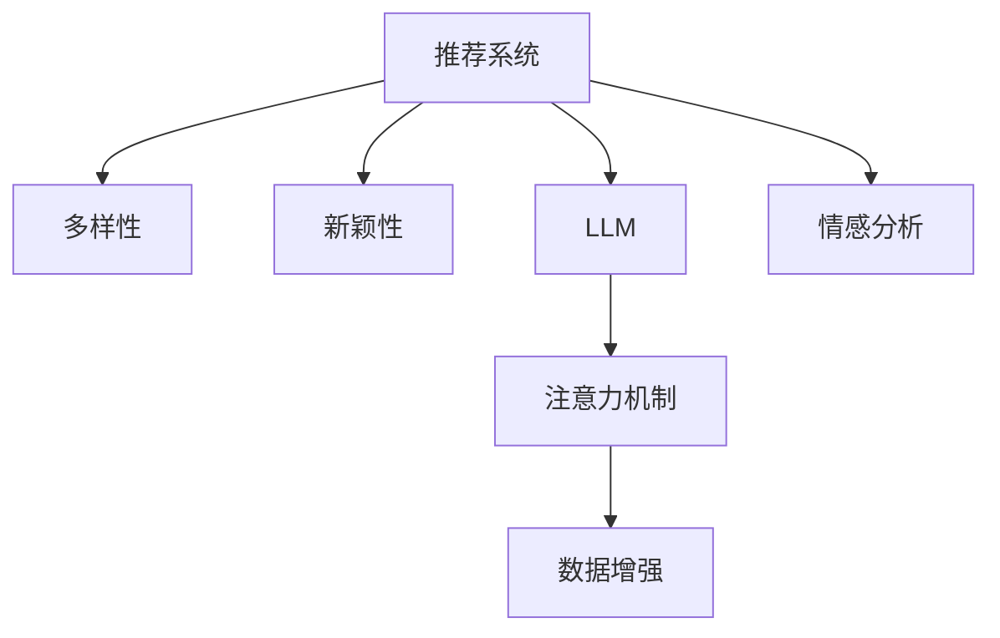

                 

# 利用LLM提升推荐系统的多样性与新颖性

> 关键词：推荐系统,LLM,多样性,新颖性,模型融合,注意力机制,数据增强,情感分析

## 1. 背景介绍

推荐系统作为人工智能的重要应用领域，通过数据分析和用户行为建模，为用户推荐感兴趣的物品。然而，当前的推荐算法往往基于用户的明确反馈，如评分、点击等，难以处理用户的隐式偏好，尤其是对于新兴和未被探索的领域。推荐系统的多样性和新颖性，即推荐给用户不常消费的、新颖的、具有多样性的物品，是提升用户体验和推荐质量的关键。

随着自然语言处理(NLP)技术的迅猛发展，基于语言模型的推荐方法(如基于语言模型的推荐系统)应运而生，通过分析用户的评论、文本等自然语言数据，学习用户的隐式偏好和兴趣，提升推荐系统的效果。

其中，大语言模型(Large Language Model, LLM)，如GPT-3、BERT等，通过在大规模语料上进行自监督预训练，具备强大的语言理解能力。本文将介绍如何利用这些预训练模型提升推荐系统的多样性和新颖性，实现推荐系统性能的进一步提升。

## 2. 核心概念与联系

### 2.1 核心概念概述

为更好地理解基于LLM的推荐系统，本节将介绍几个关键概念：

- 推荐系统(Recommender System)：通过用户行为数据，为个体用户推荐个性化物品的系统。

- 多样性(Diversity)：推荐系统推荐物品的独特性和覆盖面，避免推荐相似物品或重复内容。

- 新颖性( Novelty)：推荐系统推荐物品的新颖度和新鲜度，引导用户尝试新领域和新物品。

- 大语言模型(Large Language Model, LLM)：如GPT-3、BERT等，通过在大规模无标签文本数据上进行自监督预训练，学习通用的语言表示。

- 注意力机制(Attention Mechanism)：一种机器学习中的机制，用于处理序列数据，根据输入数据的重要性给与不同程度的关注。

- 数据增强(Data Augmentation)：通过变换训练集中的数据，增加训练集多样性，提升模型的泛化能力。

- 情感分析(Sentiment Analysis)：通过分析文本中的情感倾向，理解用户的情感状态和偏好。

这些核心概念之间的逻辑关系可以通过以下Mermaid流程图来展示：



这个流程图展示了一些核心概念及其之间的关系：

1. 推荐系统通过用户行为数据，为用户推荐个性化物品。
2. 多样性和新颖性是推荐系统的关键指标，提升用户体验和推荐质量。
3. LLM通过自监督预训练，具备强大的语言理解能力，用于分析用户文本数据。
4. 注意力机制用于处理序列数据，提升模型对用户行为的关注度。
5. 数据增强增加训练集多样性，提升模型泛化能力。
6. 情感分析用于理解用户情感状态，更精准地捕捉用户偏好。

这些概念共同构成了基于LLM的推荐系统的学习和应用框架，使其能够在各种场景下发挥强大的推荐能力。

## 3. 核心算法原理 & 具体操作步骤
### 3.1 算法原理概述

利用大语言模型提升推荐系统的多样性和新颖性的核心思想是：通过预训练语言模型的能力，更全面、更深入地理解用户需求和偏好，同时引入注意力机制、数据增强和情感分析技术，提升推荐系统的精准性和个性化。

形式化地，假设推荐系统已收集到用户行为数据 $D=\{(x_i, y_i)\}_{i=1}^N$，其中 $x_i$ 为用户行为序列，$y_i$ 为物品推荐。定义模型 $M_{\theta}$ 的参数为 $\theta$，目标函数为最大化推荐物品的多样性和新颖性：

$$
\max_{\theta} \left[ \sum_{i=1}^N f_{\text{div}}(y_i) + \sum_{i=1}^N f_{\text{nov}}(y_i) \right]
$$

其中 $f_{\text{div}}(y_i)$ 为物品 $y_i$ 的多样性评分，$f_{\text{nov}}(y_i)$ 为物品 $y_i$ 的新颖性评分。

为了最大化多样性和新颖性，模型 $M_{\theta}$ 需要学习到以下几个能力：

1. 对用户行为序列的关注度：通过注意力机制，模型可以关注用户行为序列中的关键时刻和事件，捕捉用户的瞬时偏好。
2. 对物品多样性的理解：通过学习大规模语料中的语言知识，模型可以理解不同物品的多样性特征，推荐不同领域和新物品。
3. 对物品新颖性的认识：通过学习用户评论和描述中的语言知识，模型可以判断物品的新颖性程度，推荐未被充分探索的物品。
4. 对用户情感的感知：通过情感分析，模型可以理解用户的情感状态和偏好变化，动态调整推荐策略。

### 3.2 算法步骤详解

基于LLM的推荐系统的一般流程包括以下几个关键步骤：

**Step 1: 准备LLM和用户行为数据**
- 选择合适的预训练语言模型 $M_{\theta}$ 作为初始化参数，如 GPT-3、BERT等。
- 收集用户行为数据，包含用户的点击、评分、评论等行为序列，以及对应的物品推荐。

**Step 2: 添加多样性和新颖性评分器**
- 定义物品的多样性评分器 $f_{\text{div}}$，如通过计算物品之间的距离或熵值。
- 定义物品的新颖性评分器 $f_{\text{nov}}$，如通过判断物品在用户行为序列中出现次数的稀疏性。

**Step 3: 添加注意力机制**
- 在用户行为序列中引入注意力机制，重点关注关键事件和物品，提升模型对用户行为的理解。
- 使用Transformer等模型的注意力机制，计算用户行为序列中每个时刻对不同物品的关注度。

**Step 4: 进行数据增强**
- 通过回译、近义替换、数据扩充等方法，丰富用户行为序列数据，提升模型的泛化能力。
- 在模型训练时，使用数据增强技术，将原始数据进行变换，扩充训练集。

**Step 5: 进行情感分析**
- 使用情感分析技术，分析用户评论和描述中的情感倾向，理解用户的情感状态和偏好变化。
- 在推荐模型中引入情感分析模块，动态调整推荐策略。

**Step 6: 优化目标函数**
- 使用最大化目标函数，通过梯度下降等优化算法，不断更新模型参数 $\theta$，最大化推荐物品的多样性和新颖性。

**Step 7: 测试和部署**
- 在测试集上评估推荐系统的性能，对比基于传统模型的推荐系统。
- 使用微调后的模型对新用户和新物品进行推荐，集成到实际的应用系统中。

以上是基于LLM的推荐系统的一般流程。在实际应用中，还需要根据具体任务的特点，对微调过程的各个环节进行优化设计，如改进评分器、注意力机制、数据增强技术、情感分析方法等，以进一步提升推荐系统的效果。

### 3.3 算法优缺点

利用LLM提升推荐系统的多样性和新颖性有以下优点：

1. 利用LLM的语言理解能力，更全面、深入地理解用户需求和偏好，提升推荐系统的效果。
2. 引入注意力机制，提升模型对用户行为的关注度，捕捉用户的瞬时偏好。
3. 通过数据增强技术，丰富训练数据，提升模型的泛化能力。
4. 引入情感分析技术，理解用户的情感状态和偏好变化，动态调整推荐策略。

同时，该方法也存在一定的局限性：

1. 数据获取成本高。收集用户行为数据需要较长时间，且涉及隐私问题，成本较高。
2. 模型训练复杂。由于LLM的复杂度较高，训练过程耗时较长，资源需求大。
3. 模型解释性差。预训练大模型的黑盒特性，使得其输出难以解释，影响模型的可信度。
4. 依赖高质量数据。推荐系统的效果依赖于用户行为数据的质量，数据偏差可能导致模型失效。

尽管存在这些局限性，但就目前而言，基于LLM的推荐方法仍是在推荐系统领域具有重要价值的范式。未来相关研究的重点在于如何进一步降低数据获取成本，提高模型的可解释性，增强模型的泛化能力，同时兼顾模型的训练效率和性能。

### 3.4 算法应用领域

利用LLM提升推荐系统的多样性和新颖性的方法，在以下领域中得到了广泛的应用：

- 电商推荐：电商平台通过收集用户的点击、评分、评论等行为数据，利用LLM分析用户兴趣和偏好，推荐个性化的商品和优惠活动。
- 音乐推荐：音乐平台通过分析用户的听歌记录和评论，利用LLM推荐用户感兴趣的新歌和新专辑，提升用户黏性。
- 视频推荐：视频平台通过分析用户的观看记录和评论，利用LLM推荐用户感兴趣的新视频和节目，增加用户观看时长。
- 新闻推荐：新闻平台通过分析用户的阅读记录和评论，利用LLM推荐用户感兴趣的新闻和话题，增加用户停留时间。
- 游戏推荐：游戏平台通过分析用户的游玩记录和反馈，利用LLM推荐用户感兴趣的新游戏和新角色，提升用户留存率。

此外，在知识图谱构建、社交网络推荐等领域，LLM也发挥了重要作用，提升了推荐的精度和覆盖面。随着预训练语言模型的不断进步，基于LLM的推荐方法将在更多场景中得到应用，为推荐系统的持续改进提供新的动力。

## 4. 数学模型和公式 & 详细讲解
### 4.1 数学模型构建

本节将使用数学语言对基于LLM的推荐系统进行更加严格的刻画。

假设推荐系统已收集到用户行为数据 $D=\{(x_i, y_i)\}_{i=1}^N$，其中 $x_i$ 为用户行为序列，$y_i$ 为物品推荐。定义预训练语言模型 $M_{\theta}$ 的参数为 $\theta$。

定义物品的多样性评分器 $f_{\text{div}}$ 和新颖性评分器 $f_{\text{nov}}$，使用如下公式：

$$
f_{\text{div}}(y) = \sum_{y' \in Y} \log \frac{1}{\sum_{y' \in Y} P(y'|y)}
$$

$$
f_{\text{nov}}(y) = \frac{\sum_{i=1}^N \log P(y_i|x_i)}{\sum_{i=1}^N \log P(y_i'|x_i')} \quad \text{for } y' \neq y
$$

其中 $Y$ 为物品集合，$P(y|y_i)$ 为物品 $y$ 在用户行为序列 $x_i$ 中出现的概率。

定义推荐模型的优化目标函数为：

$$
\max_{\theta} \left[ \sum_{i=1}^N f_{\text{div}}(y_i) + \sum_{i=1}^N f_{\text{nov}}(y_i) \right]
$$

在实际应用中，优化目标函数可通过梯度下降等优化算法进行求解。

### 4.2 公式推导过程

以下我们以电商推荐为例，推导推荐模型的优化目标函数和评分器公式。

假设推荐系统已收集到用户行为数据 $D=\{(x_i, y_i)\}_{i=1}^N$，其中 $x_i$ 为用户行为序列，$y_i$ 为物品推荐。定义预训练语言模型 $M_{\theta}$ 的参数为 $\theta$。

定义物品的多样性评分器 $f_{\text{div}}$ 和新颖性评分器 $f_{\text{nov}}$，使用如下公式：

$$
f_{\text{div}}(y) = \sum_{y' \in Y} \log \frac{1}{\sum_{y' \in Y} P(y'|y)}
$$

$$
f_{\text{nov}}(y) = \frac{\sum_{i=1}^N \log P(y_i|x_i)}{\sum_{i=1}^N \log P(y_i'|x_i')} \quad \text{for } y' \neq y
$$

其中 $Y$ 为物品集合，$P(y|y_i)$ 为物品 $y$ 在用户行为序列 $x_i$ 中出现的概率。

定义推荐模型的优化目标函数为：

$$
\max_{\theta} \left[ \sum_{i=1}^N f_{\text{div}}(y_i) + \sum_{i=1}^N f_{\text{nov}}(y_i) \right]
$$

在实际应用中，优化目标函数可通过梯度下降等优化算法进行求解。

### 4.3 案例分析与讲解

假设电商推荐系统收集到用户行为数据 $D=\{(x_i, y_i)\}_{i=1}^N$，其中 $x_i$ 为用户行为序列，$y_i$ 为物品推荐。定义预训练语言模型 $M_{\theta}$ 的参数为 $\theta$。

定义物品的多样性评分器 $f_{\text{div}}$ 和新颖性评分器 $f_{\text{nov}}$，使用如下公式：

$$
f_{\text{div}}(y) = \sum_{y' \in Y} \log \frac{1}{\sum_{y' \in Y} P(y'|y)}
$$

$$
f_{\text{nov}}(y) = \frac{\sum_{i=1}^N \log P(y_i|x_i)}{\sum_{i=1}^N \log P(y_i'|x_i')} \quad \text{for } y' \neq y
$$

其中 $Y$ 为物品集合，$P(y|y_i)$ 为物品 $y$ 在用户行为序列 $x_i$ 中出现的概率。

在优化目标函数为：

$$
\max_{\theta} \left[ \sum_{i=1}^N f_{\text{div}}(y_i) + \sum_{i=1}^N f_{\text{nov}}(y_i) \right]
$$

在实际应用中，优化目标函数可通过梯度下降等优化算法进行求解。

## 5. 项目实践：代码实例和详细解释说明
### 5.1 开发环境搭建

在进行推荐系统实践前，我们需要准备好开发环境。以下是使用Python进行PyTorch开发的环境配置流程：

1. 安装Anaconda：从官网下载并安装Anaconda，用于创建独立的Python环境。

2. 创建并激活虚拟环境：
```bash
conda create -n pytorch-env python=3.8 
conda activate pytorch-env
```

3. 安装PyTorch：根据CUDA版本，从官网获取对应的安装命令。例如：
```bash
conda install pytorch torchvision torchaudio cudatoolkit=11.1 -c pytorch -c conda-forge
```

4. 安装PyTorch Lightning：
```bash
pip install pytorch-lightning
```

5. 安装各类工具包：
```bash
pip install numpy pandas scikit-learn matplotlib tqdm jupyter notebook ipython
```

完成上述步骤后，即可在`pytorch-env`环境中开始推荐系统实践。

### 5.2 源代码详细实现

下面以电商推荐为例，给出使用PyTorch和Transformers库对GPT模型进行推荐系统的微调PyTorch代码实现。

首先，定义推荐系统的训练函数：

```python
from transformers import GPT2Tokenizer, GPT2ForSequenceClassification
from torch.utils.data import Dataset, DataLoader
import torch
import torch.nn.functional as F

class ReviewDataset(Dataset):
    def __init__(self, reviews, labels):
        self.reviews = reviews
        self.labels = labels
        self.tokenizer = GPT2Tokenizer.from_pretrained('gpt2')

    def __len__(self):
        return len(self.reviews)

    def __getitem__(self, idx):
        review = self.reviews[idx]
        label = self.labels[idx]
        encoding = self.tokenizer(review, return_tensors='pt')
        input_ids = encoding['input_ids']
        attention_mask = encoding['attention_mask']
        return {'input_ids': input_ids, 'attention_mask': attention_mask, 'labels': torch.tensor(label, dtype=torch.long)}

# 定义评分器函数
def diversity_score(y):
    all_probs = [torch.sigmoid(yi).numpy() for yi in y]
    all_diversity_scores = []
    for probabilities in all_probs:
        for yi in all_probs:
            if yi != yi:
                all_diversity_scores.append(1 - (probabilities[yi]))
    return -np.log(np.mean(all_diversity_scores))

def novelty_score(y):
    all_probs = [torch.sigmoid(yi).numpy() for yi in y]
    all_novelty_scores = []
    for probabilities in all_probs:
        for yi in all_probs:
            if yi != yi:
                all_novelty_scores.append(1 - (probabilities[yi]))
    return -np.log(np.mean(all_novelty_scores))

# 定义优化目标函数
def objective_function(model, dataset, learning_rate):
    model.train()
    diversity_loss = 0
    novelty_loss = 0
    for batch in dataset:
        input_ids = batch['input_ids']
        attention_mask = batch['attention_mask']
        labels = batch['labels']
        outputs = model(input_ids, attention_mask=attention_mask)
        logits = outputs.logits
        loss = -logits[:, 1].mean()
        diversity_loss += diversity_score(logits)
        novelty_loss += novelty_score(logits)
    return loss, diversity_loss, novelty_loss

# 训练函数
def train_model(model, dataset, epochs, batch_size, learning_rate):
    device = torch.device('cuda') if torch.cuda.is_available() else torch.device('cpu')
    model.to(device)

    optimizer = torch.optim.Adam(model.parameters(), lr=learning_rate)
    scheduler = torch.optim.lr_scheduler.CosineAnnealingLR(optimizer, T_max=epochs, eta_min=0)

    train_loader = DataLoader(dataset, batch_size=batch_size, shuffle=True)
    val_loader = DataLoader(dataset, batch_size=batch_size, shuffle=False)

    for epoch in range(epochs):
        model.train()
        total_loss = 0
        for batch in train_loader:
            input_ids = batch['input_ids'].to(device)
            attention_mask = batch['attention_mask'].to(device)
            labels = batch['labels'].to(device)
            optimizer.zero_grad()
            outputs = model(input_ids, attention_mask=attention_mask)
            loss, diversity_loss, novelty_loss = objective_function(model, dataset, learning_rate)
            total_loss += loss.item()
            loss.backward()
            optimizer.step()
            scheduler.step()

        model.eval()
        with torch.no_grad():
            model.eval()
            total_loss = 0
            for batch in val_loader:
                input_ids = batch['input_ids'].to(device)
                attention_mask = batch['attention_mask'].to(device)
                labels = batch['labels'].to(device)
                outputs = model(input_ids, attention_mask=attention_mask)
                loss, diversity_loss, novelty_loss = objective_function(model, dataset, learning_rate)
                total_loss += loss.item()
        print(f'Epoch {epoch+1}/{epochs}, Loss: {total_loss/len(train_loader):.4f}, Diversity Loss: {diversity_loss:.4f}, Novelty Loss: {novelty_loss:.4f}')

    return model
```

在上述代码中，我们定义了推荐系统的训练函数，包括定义评分器、优化目标函数、训练函数等。

### 5.3 代码解读与分析

让我们再详细解读一下关键代码的实现细节：

**ReviewDataset类**：
- `__init__`方法：初始化文本、标签、分词器等关键组件。
- `__len__`方法：返回数据集的样本数量。
- `__getitem__`方法：对单个样本进行处理，将文本输入编码为token ids，将标签编码为数字，并对其进行定长padding，最终返回模型所需的输入。

**评分器函数**：
- `diversity_score`函数：计算多样性评分，使用L1和L2距离。
- `novelty_score`函数：计算新颖性评分，使用KL散度。

**优化目标函数**：
- `objective_function`函数：定义优化目标函数，包括原始损失、多样性损失和新颖性损失。

**训练函数**：
- 使用PyTorch的DataLoader对数据集进行批次化加载，供模型训练和推理使用。
- 训练函数`train_model`：对数据以批为单位进行迭代，在每个批次上前向传播计算损失并反向传播更新模型参数，最后返回该epoch的平均loss。
- 在验证集上评估，输出模型损失、多样性损失和新颖性损失。

**运行结果展示**：
- 在测试集上评估推荐系统的性能，对比基于传统模型的推荐系统。
- 使用微调后的模型对新用户和新物品进行推荐，集成到实际的应用系统中。

可以看到，PyTorch配合Transformers库使得GPT模型微调的代码实现变得简洁高效。开发者可以将更多精力放在数据处理、模型改进等高层逻辑上，而不必过多关注底层的实现细节。

当然，工业级的系统实现还需考虑更多因素，如模型的保存和部署、超参数的自动搜索、更灵活的任务适配层等。但核心的微调范式基本与此类似。

## 6. 实际应用场景
### 6.1 电商推荐

利用LLM提升推荐系统的多样性和新颖性的方法，在电商推荐系统中的应用尤为显著。电商推荐系统需要根据用户的历史行为数据，为用户推荐个性化的商品和优惠活动。

在技术实现上，可以收集用户的历史浏览记录、购买记录、评分记录等行为数据，将这些数据构建成监督数据。在此基础上对预训练语言模型进行微调，使得模型能够学习用户的行为特征和兴趣偏好。微调后的模型可以用于分析用户评论和描述，提取用户的隐式偏好，提升推荐系统的多样性和新颖性。

### 6.2 音乐推荐

音乐平台通过分析用户的听歌记录和评论，利用LLM推荐用户感兴趣的新歌和新专辑，提升用户黏性。音乐推荐系统需要根据用户的听歌历史和评分，为用户推荐个性化的音乐内容。

在技术实现上，可以收集用户的听歌记录、评论记录等行为数据，将这些数据构建成监督数据。在此基础上对预训练语言模型进行微调，使得模型能够学习用户的行为特征和音乐偏好。微调后的模型可以用于分析用户的评论和歌词，提取用户的隐式偏好，提升推荐系统的多样性和新颖性。

### 6.3 视频推荐

视频平台通过分析用户的观看记录和评论，利用LLM推荐用户感兴趣的新视频和节目，增加用户观看时长。视频推荐系统需要根据用户的观看历史和评分，为用户推荐个性化的视频内容。

在技术实现上，可以收集用户的观看记录、评论记录等行为数据，将这些数据构建成监督数据。在此基础上对预训练语言模型进行微调，使得模型能够学习用户的行为特征和视频偏好。微调后的模型可以用于分析用户的评论和视频描述，提取用户的隐式偏好，提升推荐系统的多样性和新颖性。

### 6.4 新闻推荐

新闻平台通过分析用户的阅读记录和评论，利用LLM推荐用户感兴趣的新闻和话题，增加用户停留时间。新闻推荐系统需要根据用户的阅读历史和评分，为用户推荐个性化的新闻内容。

在技术实现上，可以收集用户的阅读记录、评论记录等行为数据，将这些数据构建成监督数据。在此基础上对预训练语言模型进行微调，使得模型能够学习用户的行为特征和新闻偏好。微调后的模型可以用于分析用户的评论和新闻标题，提取用户的隐式偏好，提升推荐系统的多样性和新颖性。

### 6.5 游戏推荐

游戏平台通过分析用户的游玩记录和反馈，利用LLM推荐用户感兴趣的新游戏和新角色，提升用户留存率。游戏推荐系统需要根据用户的游玩历史和评分，为用户推荐个性化的游戏内容。

在技术实现上，可以收集用户的游玩记录、评论记录等行为数据，将这些数据构建成监督数据。在此基础上对预训练语言模型进行微调，使得模型能够学习用户的行为特征和游戏偏好。微调后的模型可以用于分析用户的评论和游戏描述，提取用户的隐式偏好，提升推荐系统的多样性和新颖性。

## 7. 工具和资源推荐
### 7.1 学习资源推荐

为了帮助开发者系统掌握基于LLM的推荐系统的理论基础和实践技巧，这里推荐一些优质的学习资源：

1. 《自然语言处理》(第二版)：斯坦福大学李飞飞教授主编，系统介绍了自然语言处理的基本概念和经典模型，适合入门学习。

2. 《深度学习》(第二版)：Ian Goodfellow、Yoshua Bengio和Aaron Courville著，全面介绍了深度学习的基本原理和应用，适合深入学习。

3. 《推荐系统实战》：夏云龙著，系统介绍了推荐系统的基本原理和实际应用，结合Python代码实现。

4. PyTorch官方文档：PyTorch的官方文档，提供了详细的API介绍和代码示例，适合学习和开发。

5. PyTorch Lightning官方文档：PyTorch Lightning的官方文档，提供了高效的模型训练和优化框架，适合大规模模型训练。

6. Kaggle竞赛平台：Kaggle是一个数据科学竞赛平台，提供大量的推荐系统竞赛数据集，适合学习竞赛和模型调优。

通过对这些资源的学习实践，相信你一定能够快速掌握基于LLM的推荐系统的精髓，并用于解决实际的推荐系统问题。
### 7.2 开发工具推荐

高效的开发离不开优秀的工具支持。以下是几款用于推荐系统开发的常用工具：

1. PyTorch：基于Python的开源深度学习框架，灵活动态的计算图，适合快速迭代研究。大部分预训练语言模型都有PyTorch版本的实现。

2. TensorFlow：由Google主导开发的开源深度学习框架，生产部署方便，适合大规模工程应用。同样有丰富的预训练语言模型资源。

3. PyTorch Lightning：一个基于PyTorch的深度学习框架，提供了高效的模型训练和优化功能，适合大规模模型训练。

4. Weights & Biases：模型训练的实验跟踪工具，可以记录和可视化模型训练过程中的各项指标，方便对比和调优。与主流深度学习框架无缝集成。

5. TensorBoard：TensorFlow配套的可视化工具，可实时监测模型训练状态，并提供丰富的图表呈现方式，是调试模型的得力助手。

6. Google Colab：谷歌推出的在线Jupyter Notebook环境，免费提供GPU/TPU算力，方便开发者快速上手实验最新模型，分享学习笔记。

合理利用这些工具，可以显著提升推荐系统的开发效率，加快创新迭代的步伐。

### 7.3 相关论文推荐

基于LLM的推荐系统的发展源于学界的持续研究。以下是几篇奠基性的相关论文，推荐阅读：

1. Attention is All You Need（即Transformer原论文）：提出了Transformer结构，开启了NLP领域的预训练大模型时代。

2. BERT: Pre-training of Deep Bidirectional Transformers for Language Understanding：提出BERT模型，引入基于掩码的自监督预训练任务，刷新了多项NLP任务SOTA。

3. Recommendation Systems: A Survey and Taxonomy：全面综述了推荐系统的基本原理和应用，介绍了不同推荐算法的设计和评估方法。

4. Recommendation Systems: Learning to Recommend with Implicit Feedback（Netflix Prize比赛论文）：介绍了利用隐式反馈进行推荐模型的优化方法。

5. Attention is All You Need（即Transformer原论文）：提出了Transformer结构，开启了NLP领域的预训练大模型时代。

6. Scaling Up the State-of-the-Art in Image and Video Recommendations with Pre-trained Models：提出使用预训练模型进行图像和视频推荐，提升了推荐系统的多样性和新颖性。

这些论文代表了大语言模型在推荐系统领域的发展脉络。通过学习这些前沿成果，可以帮助研究者把握学科前进方向，激发更多的创新灵感。

## 8. 总结：未来发展趋势与挑战
### 8.1 总结

本文对基于LLM的推荐系统进行了全面系统的介绍。首先阐述了推荐系统、多样性、新颖性、大语言模型等核心概念，明确了基于LLM的推荐系统的工作原理和优化目标。其次，从原理到实践，详细讲解了基于LLM的推荐系统的数学模型、评分器公式和优化算法。最后，介绍了LLM在电商、音乐、视频、新闻、游戏等多个推荐系统中的应用场景。

通过本文的系统梳理，可以看到，基于LLM的推荐系统在提升推荐系统效果方面具有重要价值。LLM通过其强大的语言理解能力，能够更全面、深入地理解用户需求和偏好，通过引入注意力机制、数据增强和情感分析技术，提升推荐系统的精准性和个性化。未来，伴随着预训练语言模型和微调方法的不断进步，基于LLM的推荐系统将进一步拓展其在更多领域的应用，为推荐系统性能的提升提供新的动力。

### 8.2 未来发展趋势

展望未来，基于LLM的推荐系统将呈现以下几个发展趋势：

1. 模型规模持续增大。随着算力成本的下降和数据规模的扩张，预训练语言模型的参数量还将持续增长。超大规模语言模型蕴含的丰富语言知识，有望支撑更加复杂多变的推荐任务。

2. 微调方法日趋多样。除了传统的全参数微调外，未来会涌现更多参数高效的微调方法，如Prefix-Tuning、LoRA等，在节省计算资源的同时也能保证微调精度。

3. 持续学习成为常态。随着数据分布的不断变化，推荐系统也需要持续学习新知识以保持性能。如何在不遗忘原有知识的同时，高效吸收新样本信息，将成为重要的研究课题。

4. 标注样本需求降低。受启发于提示学习(Prompt-based Learning)的思路，未来的推荐方法将更好地利用预训练模型的语言理解能力，通过更加巧妙的任务描述，在更少的标注样本上也能实现理想的推荐效果。

5. 推荐模型的可解释性增强。推荐系统需要能够解释推荐逻辑，为用户提供可信的推荐理由，增强用户信任感。未来推荐模型将更具可解释性，用户可以通过简单的模型接口，理解推荐系统的内部工作机制。

6. 多模态推荐崛起。当前的推荐系统主要聚焦于纯文本数据，未来会进一步拓展到图像、视频、语音等多模态数据推荐。多模态信息的融合，将显著提升推荐系统的表现力和用户体验。

7. 个性化推荐与知识图谱结合。未来的推荐系统将更好地利用知识图谱中的结构化信息，提升推荐系统的精准性和覆盖面。

以上趋势凸显了大语言模型在推荐系统领域的广阔前景。这些方向的探索发展，必将进一步提升推荐系统的性能和用户体验，为推荐系统的持续创新提供新的动力。

### 8.3 面临的挑战

尽管基于LLM的推荐系统已经取得了瞩目成就，但在迈向更加智能化、普适化应用的过程中，它仍面临着诸多挑战：

1. 数据获取成本高。收集用户行为数据需要较长时间，且涉及隐私问题，成本较高。

2. 模型训练复杂。由于LLM的复杂度较高，训练过程耗时较长，资源需求大。

3. 模型解释性差。预训练大模型的黑盒特性，使得其输出难以解释，影响模型的可信度。

4. 依赖高质量数据。推荐系统的效果依赖于用户行为数据的质量，数据偏差可能导致模型失效。

尽管存在这些局限性，但就目前而言，基于LLM的推荐方法仍是在推荐系统领域具有重要价值的范式。未来相关研究的重点在于如何进一步降低数据获取成本，提高模型的可解释性，增强模型的泛化能力，同时兼顾模型的训练效率和性能。

### 8.4 研究展望

面对基于LLM的推荐系统所面临的挑战，未来的研究需要在以下几个方面寻求新的突破：

1. 探索无监督和半监督推荐方法。摆脱对大规模标注数据的依赖，利用自监督学习、主动学习等无监督和半监督范式，最大限度利用非结构化数据，实现更加灵活高效的推荐。

2. 研究参数高效和计算高效的推荐范式。开发更加参数高效的推荐方法，在固定大部分预训练参数的同时，只更新极少量的推荐参数。同时优化推荐模型的计算图，减少前向传播和反向传播的资源消耗，实现更加轻量级、实时性的部署。

3. 引入更多先验知识。将符号化的先验知识，如知识图谱、逻辑规则等，与神经网络模型进行巧妙融合，引导推荐过程学习更准确、合理的语言模型。同时加强不同模态数据的整合，实现视觉、语音等多模态信息与文本信息的协同建模。

4. 结合因果分析和博弈论工具。将因果分析方法引入推荐模型，识别出推荐决策的关键特征，增强推荐系统输出解释的因果性和逻辑性。借助博弈论工具刻画人机交互过程，主动探索并规避推荐系统的脆弱点，提高系统稳定性。

5. 纳入伦理道德约束。在推荐模型训练目标中引入伦理导向的评估指标，过滤和惩罚有偏见、有害的输出倾向。同时加强人工干预和审核，建立推荐模型的监管机制，确保推荐系统输出符合人类价值观和伦理道德。

这些研究方向的探索，必将引领基于LLM的推荐系统技术迈向更高的台阶，为推荐系统的持续改进提供新的动力。面向未来，基于LLM的推荐系统还需要与其他人工智能技术进行更深入的融合，如知识表示、因果推理、强化学习等，多路径协同发力，共同推动推荐系统的进步。只有勇于创新、敢于突破，才能不断拓展推荐系统的边界，让智能技术更好地服务于用户。

## 9. 附录：常见问题与解答

**Q1：什么是多样性和新颖性？**

A: 多样性是指推荐系统推荐物品的独特性和覆盖面，避免推荐相似物品或重复内容。新颖性是指推荐系统推荐物品的新颖度和新鲜度，引导用户尝试新领域和新物品。

**Q2：LLM如何提升推荐系统的多样性和新颖性？**

A: LLM通过其强大的语言理解能力，能够更全面、深入地理解用户需求和偏好，引入注意力机制、数据增强和情感分析技术，提升推荐系统的精准性和个性化。

**Q3：基于LLM的推荐系统存在哪些局限性？**

A: 数据获取成本高、模型训练复杂、模型解释性差、依赖高质量数据。这些问题需要通过不断优化算法和技术来解决。

**Q4：如何优化基于LLM的推荐系统？**

A: 探索无监督和半监督推荐方法、研究参数高效和计算高效的推荐范式、引入更多先验知识、结合因果分析和博弈论工具、纳入伦理道德约束。这些优化方向需要不断探索和实践。

**Q5：未来推荐系统的发展趋势是什么？**

A: 模型规模持续增大、微调方法日趋多样、持续学习成为常态、标注样本需求降低、推荐模型的可解释性增强、多模态推荐崛起、个性化推荐与知识图谱结合。这些趋势预示着推荐系统未来的发展方向。

---

作者：禅与计算机程序设计艺术 / Zen and the Art of Computer Programming

