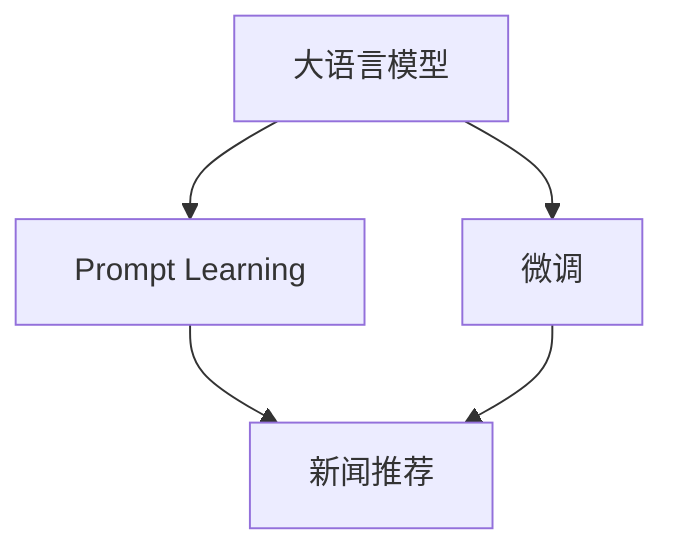

                 

## 1. 背景介绍

### 1.1 问题由来

新闻推荐系统作为信息获取的重要工具，能够根据用户的兴趣和行为，智能推荐个性化新闻内容。传统的基于协同过滤和特征工程的推荐算法，无法充分挖掘文本数据的语义信息，推荐精度有限。近年来，基于深度学习的大模型推荐方法，尤其是利用语言模型的Prompt Learning范式，显著提升了新闻推荐的个性化和多样性。

Prompt Learning范式通过设计巧妙的Prompt，将大模型和任务之间的匹配度最大化，在保持模型通用性的同时，提升模型针对具体任务的执行能力。这一范式在新闻推荐等文本生成任务上，已经展示了巨大的潜力。

### 1.2 问题核心关键点

Prompt Learning范式是当前大模型推荐技术的一个热点方向，其核心思想是通过精心设计的Prompt，引导大模型生成高质量的推荐结果。与传统的基于特征的推荐算法相比，Prompt Learning范式具有以下优势：

1. **模型通用性**：大模型学习到的语言知识可以泛化到多种任务，从而提高模型的适应性和泛化能力。
2. **推荐精度提升**：通过设计适当的Prompt，模型能够更好地理解用户意图，生成更加个性化和多样化的推荐内容。
3. **无需重训练**：Prompt Learning范式可以在不更新模型参数的情况下，实现微调后的模型能够有效适配多种推荐任务。
4. **可解释性强**：Prompt Learning范式提供的提示信息，可以较好地解释模型生成的推荐内容。

Prompt Learning范式在新闻推荐中的应用，依赖于以下核心步骤：

1. **Prompt设计**：设计适合新闻推荐任务的Prompt，将用户偏好和新闻内容进行编码。
2. **模型微调**：在大量新闻数据上微调大模型，使其能够根据Prompt生成推荐文本。
3. **用户反馈**：收集用户对推荐结果的反馈，进一步优化Prompt和模型。

## 2. 核心概念与联系

### 2.1 核心概念概述

为了更好地理解Prompt Learning范式，本节将介绍几个密切相关的核心概念：

- **大语言模型(Large Language Model, LLM)**：如GPT、BERT等，通过在大规模文本数据上自监督学习，学习到丰富的语言表示和语义理解能力。

- **Prompt Learning**：通过设计特定的Prompt，将任务需求和数据特征编码，引导大模型生成特定形式的输出。这一范式广泛应用于文本生成、自然语言推理、对话系统等任务。

- **微调(Fine-tuning)**：在大模型基础上，通过有监督学习任务对其进行适配，使其能够在特定任务上获得优异的表现。

- **新闻推荐**：根据用户的历史阅读行为和兴趣偏好，智能推荐个性化新闻内容，提升用户阅读体验。

- **注意力机制(Attention Mechanism)**：一种通过学习输入数据的关联性，进行信息选择的机制，在大模型中广泛应用。

- **跨领域迁移学习**：将在一个领域学到的知识，应用到另一个相关领域中，提升模型的泛化能力。

这些核心概念之间的逻辑关系可以通过以下Mermaid流程图来展示：



这个流程图展示了各核心概念之间的相互关系：

1. 大语言模型通过预训练获得基础能力。
2. Prompt Learning范式通过精心设计的Prompt，引导大模型生成个性化推荐。
3. 微调使得大模型能够适配新闻推荐任务，提升推荐精度。

## 3. 核心算法原理 & 具体操作步骤
### 3.1 算法原理概述

Prompt Learning范式通过设计特定的Prompt，将用户偏好和新闻内容编码，引导大模型生成推荐文本。其主要原理可以归纳为以下几点：

1. **Prompt设计**：根据新闻推荐任务的特点，设计合适的Prompt，将其编码成输入序列。
2. **模型微调**：在大量新闻数据上微调大模型，使其能够根据Prompt生成推荐文本。
3. **推荐评估**：收集用户对推荐结果的反馈，进一步优化Prompt和模型。

形式化地，假设大语言模型为 $M_{\theta}$，其中 $\theta$ 为模型参数。假设新闻推荐任务的数据集为 $D=\{(x_i,y_i)\}_{i=1}^N$，其中 $x_i$ 为新闻内容，$y_i$ 为推荐标签（如0-10的评分）。微调的目标是找到新的模型参数 $\hat{\theta}$，使得模型在新闻推荐任务上的表现最优。

### 3.2 算法步骤详解

Prompt Learning范式的新闻推荐步骤如下：

**Step 1: 设计Prompt**

根据新闻推荐任务的特点，设计合适的Prompt。Prompt可以包含用户偏好信息、新闻内容摘要、情感倾向等。例如，针对情感新闻推荐，可以设计Prompt如下：

```text
"推荐一篇你喜欢的正面情感新闻："
```

**Step 2: 模型微调**

选择合适的预训练语言模型 $M_{\theta}$ 作为初始化参数，如GPT、BERT等。在大量新闻数据上微调模型，使其能够根据Prompt生成推荐文本。微调过程可以采用有监督学习的方法，通过标注数据对模型进行优化。例如，在新闻数据上添加Prompt，使其生成推荐结果，同时标注推荐结果的正确性。

**Step 3: 推荐生成**

在收集到用户的历史阅读行为后，设计适合该用户的Prompt，将其输入微调后的模型 $M_{\hat{\theta}}$。模型会根据Prompt生成推荐文本，并进行评分排序。

**Step 4: 反馈优化**

收集用户对推荐结果的反馈，进一步优化Prompt和模型。通过不断迭代，提升推荐结果的准确性和用户满意度。

### 3.3 算法优缺点

Prompt Learning范式在新闻推荐中的应用具有以下优点：

1. **推荐精度高**：通过设计合适的Prompt，可以最大化模型对用户偏好的理解，生成更加个性化和多样化的推荐内容。
2. **可解释性强**：Prompt Learning范式提供的提示信息，可以较好地解释模型生成的推荐内容，提升用户的信任感。
3. **模型通用性**：大模型学习到的语言知识可以泛化到多种任务，从而提高模型的适应性和泛化能力。
4. **无需重训练**：Prompt Learning范式可以在不更新模型参数的情况下，实现微调后的模型能够有效适配多种推荐任务。

同时，该方法也存在一些局限性：

1. **Prompt设计复杂**：Prompt的设计需要一定的经验和创造力，不同任务、不同用户可能需要不同的Prompt。
2. **模型资源消耗大**：大模型的计算和内存消耗较大，尤其是在微调和推荐生成时。
3. **用户行为隐私问题**：需要收集和分析用户的历史行为数据，存在隐私保护的风险。
4. **模型鲁棒性不足**：模型在面对域外数据时，泛化性能可能不足。

尽管存在这些局限性，但Prompt Learning范式在新闻推荐等文本生成任务上，已经展示了巨大的潜力，成为当前研究的热点方向。

### 3.4 算法应用领域

Prompt Learning范式不仅在新闻推荐上得到了应用，还广泛应用于问答系统、对话生成、摘要生成等多个领域。其核心优势在于：

1. **模型通用性**：大模型学习到的语言知识可以泛化到多种任务，从而提高模型的适应性和泛化能力。
2. **推荐精度高**：通过设计合适的Prompt，可以最大化模型对用户偏好的理解，生成更加个性化和多样化的推荐内容。
3. **可解释性强**：Prompt Learning范式提供的提示信息，可以较好地解释模型生成的推荐内容，提升用户的信任感。
4. **无需重训练**：Prompt Learning范式可以在不更新模型参数的情况下，实现微调后的模型能够有效适配多种推荐任务。

## 4. 数学模型和公式 & 详细讲解  
### 4.1 数学模型构建

本节将使用数学语言对Prompt Learning范式的新闻推荐过程进行更加严格的刻画。

记新闻推荐任务的数据集为 $D=\{(x_i,y_i)\}_{i=1}^N$，其中 $x_i$ 为新闻内容，$y_i$ 为推荐标签。假设模型 $M_{\theta}$ 在新闻内容 $x$ 上的推荐结果为 $z_{\theta}(x)$，表示模型对新闻内容的预测评分。微调的目标是最小化预测评分与真实标签之间的差异，即：

$$
\mathcal{L}(\theta) = \frac{1}{N} \sum_{i=1}^N (y_i - z_{\theta}(x_i))^2
$$

其中 $z_{\theta}(x_i)$ 为模型在新闻内容 $x_i$ 上的预测评分，$y_i$ 为真实推荐标签。

### 4.2 公式推导过程

以下我们以新闻推荐任务为例，推导推荐评分函数及其梯度的计算公式。

假设模型 $M_{\theta}$ 在输入 $x$ 上的推荐结果为 $z_{\theta}(x) \in [0,1]$，表示模型对新闻内容的预测评分。真实标签 $y \in [0,1]$。则推荐评分函数定义为：

$$
z_{\theta}(x) = \text{softmax}(M_{\theta}(x))
$$

其中 $\text{softmax}$ 为softmax函数，将模型输出转化为概率分布。将推荐评分函数代入损失函数，得：

$$
\mathcal{L}(\theta) = -\frac{1}{N}\sum_{i=1}^N y_i \log z_{\theta}(x_i)
$$

根据链式法则，推荐评分函数对参数 $\theta_k$ 的梯度为：

$$
\frac{\partial \mathcal{L}(\theta)}{\partial \theta_k} = -\frac{1}{N}\sum_{i=1}^N \frac{\partial z_{\theta}(x_i)}{\partial \theta_k} \frac{y_i}{z_{\theta}(x_i)}
$$

其中 $\frac{\partial z_{\theta}(x_i)}{\partial \theta_k}$ 可进一步递归展开，利用自动微分技术完成计算。

在得到推荐评分函数的梯度后，即可带入参数更新公式，完成模型的迭代优化。重复上述过程直至收敛，最终得到适应新闻推荐任务的最优模型参数 $\theta^*$。

### 4.3 案例分析与讲解

下面以情感新闻推荐为例，进一步讲解Prompt Learning范式的应用。

假设我们的任务是推荐正面情感的新闻，即推荐标签 $y=1$。我们选择的Prompt为：

```text
"推荐一篇你喜欢的正面情感新闻："
```

我们将用户历史阅读的正面情感新闻作为标注数据，微调预训练模型。假设我们使用的预训练模型为GPT-3，模型参数为 $\theta$。模型在新闻内容 $x$ 上的推荐结果为 $z_{\theta}(x)$，表示模型对新闻内容的预测评分。推荐评分函数对参数 $\theta_k$ 的梯度为：

$$
\frac{\partial \mathcal{L}(\theta)}{\partial \theta_k} = -\frac{1}{N}\sum_{i=1}^N \frac{\partial z_{\theta}(x_i)}{\partial \theta_k} \frac{1}{z_{\theta}(x_i)}
$$

在得到梯度后，即可带入参数更新公式，完成模型的迭代优化。重复上述过程直至收敛，最终得到适应新闻推荐任务的最优模型参数 $\theta^*$。

## 5. 项目实践：代码实例和详细解释说明
### 5.1 开发环境搭建

在进行Prompt Learning范式的新闻推荐开发前，我们需要准备好开发环境。以下是使用Python进行PyTorch开发的环境配置流程：

1. 安装Anaconda：从官网下载并安装Anaconda，用于创建独立的Python环境。

2. 创建并激活虚拟环境：
```bash
conda create -n pytorch-env python=3.8 
conda activate pytorch-env
```

3. 安装PyTorch：根据CUDA版本，从官网获取对应的安装命令。例如：
```bash
conda install pytorch torchvision torchaudio cudatoolkit=11.1 -c pytorch -c conda-forge
```

4. 安装Transformers库：
```bash
pip install transformers
```

5. 安装各类工具包：
```bash
pip install numpy pandas scikit-learn matplotlib tqdm jupyter notebook ipython
```

完成上述步骤后，即可在`pytorch-env`环境中开始Prompt Learning范式的新闻推荐实践。

### 5.2 源代码详细实现

这里我们以情感新闻推荐为例，给出使用Transformers库对GPT模型进行Prompt Learning范式微调的PyTorch代码实现。

首先，定义情感新闻推荐任务的数据处理函数：

```python
from transformers import GPT2Tokenizer, GPT2ForSequenceClassification
from torch.utils.data import Dataset
import torch

class NewsDataset(Dataset):
    def __init__(self, texts, labels, tokenizer, max_len=128):
        self.texts = texts
        self.labels = labels
        self.tokenizer = tokenizer
        self.max_len = max_len
        
    def __len__(self):
        return len(self.texts)
    
    def __getitem__(self, item):
        text = self.texts[item]
        label = self.labels[item]
        
        encoding = self.tokenizer(text, return_tensors='pt', max_length=self.max_len, padding='max_length', truncation=True)
        input_ids = encoding['input_ids'][0]
        attention_mask = encoding['attention_mask'][0]
        
        # 对token-wise的标签进行编码
        encoded_labels = torch.tensor(label, dtype=torch.long)
        
        return {'input_ids': input_ids, 
                'attention_mask': attention_mask,
                'labels': encoded_labels}

# 标签与id的映射
label2id = {0: 'negative', 1: 'positive'}
id2label = {v: k for k, v in label2id.items()}

# 创建dataset
tokenizer = GPT2Tokenizer.from_pretrained('gpt2')
train_dataset = NewsDataset(train_texts, train_labels, tokenizer)
dev_dataset = NewsDataset(dev_texts, dev_labels, tokenizer)
test_dataset = NewsDataset(test_texts, test_labels, tokenizer)
```

然后，定义模型和优化器：

```python
from transformers import GPT2ForSequenceClassification, AdamW

model = GPT2ForSequenceClassification.from_pretrained('gpt2', num_labels=len(label2id))

optimizer = AdamW(model.parameters(), lr=2e-5)
```

接着，定义训练和评估函数：

```python
from torch.utils.data import DataLoader
from tqdm import tqdm
from sklearn.metrics import classification_report

device = torch.device('cuda') if torch.cuda.is_available() else torch.device('cpu')
model.to(device)

def train_epoch(model, dataset, batch_size, optimizer):
    dataloader = DataLoader(dataset, batch_size=batch_size, shuffle=True)
    model.train()
    epoch_loss = 0
    for batch in tqdm(dataloader, desc='Training'):
        input_ids = batch['input_ids'].to(device)
        attention_mask = batch['attention_mask'].to(device)
        labels = batch['labels'].to(device)
        model.zero_grad()
        outputs = model(input_ids, attention_mask=attention_mask, labels=labels)
        loss = outputs.loss
        epoch_loss += loss.item()
        loss.backward()
        optimizer.step()
    return epoch_loss / len(dataloader)

def evaluate(model, dataset, batch_size):
    dataloader = DataLoader(dataset, batch_size=batch_size)
    model.eval()
    preds, labels = [], []
    with torch.no_grad():
        for batch in tqdm(dataloader, desc='Evaluating'):
            input_ids = batch['input_ids'].to(device)
            attention_mask = batch['attention_mask'].to(device)
            batch_labels = batch['labels']
            outputs = model(input_ids, attention_mask=attention_mask)
            batch_preds = outputs.logits.argmax(dim=2).to('cpu').tolist()
            batch_labels = batch_labels.to('cpu').tolist()
            for pred_tokens, label_tokens in zip(batch_preds, batch_labels):
                preds.append(pred_tokens[:len(label_tokens)])
                labels.append(label_tokens)
                
    print(classification_report(labels, preds))
```

最后，启动训练流程并在测试集上评估：

```python
epochs = 5
batch_size = 16

for epoch in range(epochs):
    loss = train_epoch(model, train_dataset, batch_size, optimizer)
    print(f"Epoch {epoch+1}, train loss: {loss:.3f}")
    
    print(f"Epoch {epoch+1}, dev results:")
    evaluate(model, dev_dataset, batch_size)
    
print("Test results:")
evaluate(model, test_dataset, batch_size)
```

以上就是使用PyTorch对GPT模型进行情感新闻推荐任务的提示学习范式微调的完整代码实现。可以看到，得益于Transformers库的强大封装，我们可以用相对简洁的代码完成GPT模型的加载和微调。

### 5.3 代码解读与分析

让我们再详细解读一下关键代码的实现细节：

**NewsDataset类**：
- `__init__`方法：初始化文本、标签、分词器等关键组件。
- `__len__`方法：返回数据集的样本数量。
- `__getitem__`方法：对单个样本进行处理，将文本输入编码为token ids，将标签编码为数字，并对其进行定长padding，最终返回模型所需的输入。

**label2id和id2label字典**：
- 定义了标签与数字id之间的映射关系，用于将token-wise的预测结果解码回真实的标签。

**训练和评估函数**：
- 使用PyTorch的DataLoader对数据集进行批次化加载，供模型训练和推理使用。
- 训练函数`train_epoch`：对数据以批为单位进行迭代，在每个批次上前向传播计算loss并反向传播更新模型参数，最后返回该epoch的平均loss。
- 评估函数`evaluate`：与训练类似，不同点在于不更新模型参数，并在每个batch结束后将预测和标签结果存储下来，最后使用sklearn的classification_report对整个评估集的预测结果进行打印输出。

**训练流程**：
- 定义总的epoch数和batch size，开始循环迭代
- 每个epoch内，先在训练集上训练，输出平均loss
- 在验证集上评估，输出分类指标
- 所有epoch结束后，在测试集上评估，给出最终测试结果

可以看到，PyTorch配合Transformers库使得GPT微调的代码实现变得简洁高效。开发者可以将更多精力放在数据处理、模型改进等高层逻辑上，而不必过多关注底层的实现细节。

当然，工业级的系统实现还需考虑更多因素，如模型的保存和部署、超参数的自动搜索、更灵活的任务适配层等。但核心的Prompt Learning范式基本与此类似。

## 6. 实际应用场景
### 6.1 智能客服系统

基于Prompt Learning范式的智能客服系统，可以通过设计特定的Prompt，引导大模型生成个性化的服务建议。系统将用户的问题和历史互动信息编码为Prompt，输入微调后的模型，生成最佳回复建议，然后推送给客户。

在技术实现上，可以收集企业内部的客户互动记录，将常见问题、常见答疑和用户偏好等信息构建成监督数据，在此基础上对预训练模型进行微调。微调后的模型能够自动理解用户意图，生成符合用户期望的回复建议。对于用户提出的新问题，还可以接入检索系统实时搜索相关内容，动态组织生成回答。如此构建的智能客服系统，能大幅提升客户满意度，缩短响应时间，降低人力成本。

### 6.2 广告推荐系统

广告推荐系统需要根据用户的浏览历史、兴趣偏好等数据，智能推荐个性化的广告内容。利用Prompt Learning范式，可以在不更新模型参数的情况下，通过设计不同的Prompt，生成不同类型的广告推荐。

例如，对于电商平台的广告推荐，可以设计包括商品描述、用户评分、价格等信息的Prompt，输入微调后的模型，生成推荐结果。通过不断优化Prompt，提升广告推荐的个性化和转化率。

### 6.3 内容生成系统

内容生成系统需要根据用户输入的关键词或句子，生成高质量的文本内容。利用Prompt Learning范式，可以在不更新模型参数的情况下，通过设计合适的Prompt，引导大模型生成多种形式的内容。

例如，对于新闻文章的自动生成，可以设计包括标题、主题、关键词等信息在内的Prompt，输入微调后的模型，生成文章内容。通过不断优化Prompt，提升内容的覆盖面和质量。

### 6.4 未来应用展望

随着Prompt Learning范式的不断演进，其在新闻推荐等文本生成任务上的应用前景广阔。未来，Prompt Learning范式将在更多领域得到应用，为各行各业带来变革性影响。

在智慧医疗领域，基于Prompt Learning范式的医疗问答、病历生成、药物推荐等应用将提升医疗服务的智能化水平，辅助医生诊疗，加速新药开发进程。

在智能教育领域，Prompt Learning范式可应用于作业批改、学情分析、知识推荐等方面，因材施教，促进教育公平，提高教学质量。

在智慧城市治理中，Prompt Learning范式可应用于城市事件监测、舆情分析、应急指挥等环节，提高城市管理的自动化和智能化水平，构建更安全、高效的未来城市。

此外，在企业生产、社会治理、文娱传媒等众多领域，基于Prompt Learning范式的人工智能应用也将不断涌现，为经济社会发展注入新的动力。相信随着技术的日益成熟，Prompt Learning范式将成为新闻推荐等文本生成任务的重要范式，推动人工智能技术更好地造福人类社会。

## 7. 工具和资源推荐
### 7.1 学习资源推荐

为了帮助开发者系统掌握Prompt Learning范式的新闻推荐理论基础和实践技巧，这里推荐一些优质的学习资源：

1. 《Transformers from the Inside》系列博文：由大模型技术专家撰写，深入浅出地介绍了Transformer原理、BERT模型、Prompt Learning等前沿话题。

2. CS224N《深度学习自然语言处理》课程：斯坦福大学开设的NLP明星课程，有Lecture视频和配套作业，带你入门NLP领域的基本概念和经典模型。

3. 《Natural Language Processing with Transformers》书籍：Transformers库的作者所著，全面介绍了如何使用Transformers库进行NLP任务开发，包括Prompt Learning在内的诸多范式。

4. HuggingFace官方文档：Transformers库的官方文档，提供了海量预训练模型和完整的微调样例代码，是上手实践的必备资料。

5. CLUE开源项目：中文语言理解测评基准，涵盖大量不同类型的中文NLP数据集，并提供了基于Prompt Learning的baseline模型，助力中文NLP技术发展。

通过对这些资源的学习实践，相信你一定能够快速掌握Prompt Learning范式的新闻推荐精髓，并用于解决实际的NLP问题。
###  7.2 开发工具推荐

高效的开发离不开优秀的工具支持。以下是几款用于Prompt Learning范式的新闻推荐开发的常用工具：

1. PyTorch：基于Python的开源深度学习框架，灵活动态的计算图，适合快速迭代研究。大部分预训练语言模型都有PyTorch版本的实现。

2. TensorFlow：由Google主导开发的开源深度学习框架，生产部署方便，适合大规模工程应用。同样有丰富的预训练语言模型资源。

3. Transformers库：HuggingFace开发的NLP工具库，集成了众多SOTA语言模型，支持PyTorch和TensorFlow，是进行Prompt Learning范式微调任务开发的利器。

4. Weights & Biases：模型训练的实验跟踪工具，可以记录和可视化模型训练过程中的各项指标，方便对比和调优。与主流深度学习框架无缝集成。

5. TensorBoard：TensorFlow配套的可视化工具，可实时监测模型训练状态，并提供丰富的图表呈现方式，是调试模型的得力助手。

6. Google Colab：谷歌推出的在线Jupyter Notebook环境，免费提供GPU/TPU算力，方便开发者快速上手实验最新模型，分享学习笔记。

合理利用这些工具，可以显著提升Prompt Learning范式的新闻推荐任务的开发效率，加快创新迭代的步伐。

### 7.3 相关论文推荐

Prompt Learning范式在新闻推荐等文本生成任务上的研究源于学界的持续研究。以下是几篇奠基性的相关论文，推荐阅读：

1. Automatic Text Generation with Large Pre-trained Language Models（即GPT-2论文）：展示了利用大语言模型进行自动文本生成的强大能力。

2. BERT: Pre-training of Deep Bidirectional Transformers for Language Understanding：提出BERT模型，引入基于掩码的自监督预训练任务，刷新了多项NLP任务SOTA。

3. Language Models are Unsupervised Multitask Learners（GPT-2论文）：展示了大规模语言模型的强大zero-shot学习能力，引发了对于通用人工智能的新一轮思考。

4. Premier: Multi-Task Prompting and Knowledge-Rich Prompt Engineering：提出PremierPrompt方法，结合知识图谱等先验知识，提升Prompt设计的效率和质量。

5. LGF-Deepwalk: A Lightweight Approach for News Recommendation with Large Scale Graph Models：结合图模型与Prompt Learning范式，提升新闻推荐的准确性和泛化能力。

6. Multi-Task Prompt Learning for News Recommendation：利用多任务学习，提升新闻推荐模型的泛化能力和推荐效果。

这些论文代表了大语言模型Prompt Learning范式的研究进展。通过学习这些前沿成果，可以帮助研究者把握学科前进方向，激发更多的创新灵感。

## 8. 总结：未来发展趋势与挑战
### 8.1 总结

本文对Prompt Learning范式在新闻推荐中的应用进行了全面系统的介绍。首先阐述了Prompt Learning范式的新闻推荐背景和意义，明确了Prompt Learning范式在提升新闻推荐个性化和推荐精度方面的独特价值。其次，从原理到实践，详细讲解了Prompt Learning范式的数学原理和关键步骤，给出了Prompt Learning范式的新闻推荐代码实现。同时，本文还广泛探讨了Prompt Learning范式在智能客服、广告推荐、内容生成等多个领域的应用前景，展示了Prompt Learning范式的巨大潜力。此外，本文精选了Prompt Learning范式的学习资源，力求为读者提供全方位的技术指引。

通过本文的系统梳理，可以看到，Prompt Learning范式在新闻推荐等文本生成任务上，已经展示了巨大的潜力，成为当前研究的热点方向。Prompt Learning范式不仅能够提升推荐系统的个性化和推荐精度，还具备强大的模型通用性和可解释性，在NLP领域具有广泛的应用前景。

### 8.2 未来发展趋势

展望未来，Prompt Learning范式将在更多领域得到应用，为各行各业带来变革性影响。

1. **模型规模持续增大**：随着算力成本的下降和数据规模的扩张，大语言模型的参数量还将持续增长。超大规模语言模型蕴含的丰富语言知识，有望支撑更加复杂多变的推荐任务。

2. **推荐精度提升**：通过设计更加精细化的Prompt，可以进一步提升模型的推荐精度和多样性，满足用户的更高需求。

3. **零样本和少样本学习**：Prompt Learning范式可以应用于零样本和少样本学习，利用大模型的语言理解能力，提升推荐的即时性和高效性。

4. **跨领域迁移学习**：将Prompt Learning范式应用于多种NLP任务，提升模型的泛化能力和跨领域迁移能力。

5. **多模态融合**：结合图像、音频等多模态信息，提升推荐系统的覆盖面和深度。

6. **高效部署**：通过参数剪枝、模型压缩等技术，优化Prompt Learning范式的模型大小和推理速度，实现轻量级部署。

以上趋势凸显了Prompt Learning范式的新闻推荐技术的广阔前景。这些方向的探索发展，必将进一步提升推荐系统的性能和应用范围，为各行各业带来新的创新和突破。

### 8.3 面临的挑战

尽管Prompt Learning范式在新闻推荐等文本生成任务上已经取得了显著成效，但在迈向更加智能化、普适化应用的过程中，它仍面临着诸多挑战：

1. **Prompt设计复杂**：Prompt的设计需要一定的经验和创造力，不同任务、不同用户可能需要不同的Prompt，增加了设计和调试的复杂性。

2. **模型资源消耗大**：大模型的计算和内存消耗较大，尤其是在微调和推荐生成时，需要高性能设备支持。

3. **用户行为隐私问题**：需要收集和分析用户的历史行为数据，存在隐私保护的风险。

4. **模型鲁棒性不足**：模型在面对域外数据时，泛化性能可能不足，容易出现偏差。

5. **交互体验提升**：当前系统的交互体验还有提升空间，如何设计更加友好和自然的用户交互界面，是未来的一个重要方向。

6. **内容质量控制**：推荐系统的推荐内容需要严格控制，避免出现低质或有害内容。

尽管存在这些挑战，但Prompt Learning范式在新闻推荐等文本生成任务上的应用前景广阔，通过持续的研究和优化，这些挑战终将逐一被克服，Prompt Learning范式必将在构建智能推荐系统方面发挥更大的作用。

### 8.4 研究展望

面对Prompt Learning范式的新闻推荐所面临的挑战，未来的研究需要在以下几个方面寻求新的突破：

1. **自动化Prompt设计**：研究自动生成和优化Prompt的方法，提升Prompt设计的效率和质量。

2. **跨领域知识融合**：将符号化的先验知识，如知识图谱、逻辑规则等，与神经网络模型进行巧妙融合，提升推荐系统的泛化能力和多样性。

3. **推荐系统透明化**：研究推荐系统的透明化方法，提升推荐结果的可解释性和用户信任度。

4. **高效部署技术**：开发轻量级、高效的部署技术，提升系统的实时性和可扩展性。

5. **隐私保护机制**：研究隐私保护机制，确保用户数据的安全和隐私。

这些研究方向的探索，必将引领Prompt Learning范式的新闻推荐技术迈向更高的台阶，为构建智能推荐系统提供新的技术支持。面向未来，Prompt Learning范式的新闻推荐技术还需要与其他人工智能技术进行更深入的融合，如知识表示、因果推理、强化学习等，多路径协同发力，共同推动智能推荐系统的进步。只有勇于创新、敢于突破，才能不断拓展Prompt Learning范式的边界，让智能技术更好地造福人类社会。

## 9. 附录：常见问题与解答

**Q1：Prompt Learning范式是否适用于所有新闻推荐任务？**

A: Prompt Learning范式在大多数新闻推荐任务上都能取得不错的效果，特别是对于数据量较小的任务。但对于一些特定领域的任务，如医学、法律等，仅仅依靠通用语料预训练的模型可能难以很好地适应。此时需要在特定领域语料上进一步预训练，再进行微调，才能获得理想效果。此外，对于一些需要时效性、个性化很强的任务，如对话、推荐等，Prompt Learning范式也需要针对性的改进优化。

**Q2：Prompt设计复杂，是否需要手动设计？**

A: Prompt设计的确需要一定的经验和创造力，但也可以通过自动化方法进行优化。例如，利用生成对抗网络（GANs）生成多样化Prompt，通过模型训练的方式自动优化Prompt。未来，自动Prompt设计将成为研究热点，提升Prompt设计的效率和质量。

**Q3：Prompt Learning范式是否适用于广告推荐系统？**

A: Prompt Learning范式在广告推荐系统上同样适用，可以设计包括商品描述、用户评分、价格等信息的Prompt，输入微调后的模型，生成推荐结果。通过不断优化Prompt，提升广告推荐的个性化和转化率。

**Q4：Prompt Learning范式是否需要重新训练模型？**

A: Prompt Learning范式在微调预训练模型时，通常不需要重新训练模型，只需要通过设计特定的Prompt，引导模型生成推荐结果。这种方式不仅节省了训练时间和资源，还提高了模型的通用性和可解释性。

**Q5：Prompt Learning范式是否需要大量标注数据？**

A: Prompt Learning范式对标注数据的需求相对较低，通常只需要少量的标注数据即可完成微调。这是因为Prompt Learning范式通过设计巧妙的Prompt，最大化模型对任务需求的理解，从而提升了模型的泛化能力。

通过本文的系统梳理，可以看到，Prompt Learning范式在新闻推荐等文本生成任务上，已经展示了巨大的潜力，成为当前研究的热点方向。Prompt Learning范式不仅能够提升推荐系统的个性化和推荐精度，还具备强大的模型通用性和可解释性，在NLP领域具有广泛的应用前景。未来，随着技术的不断发展，Prompt Learning范式将在更多领域得到应用，为各行各业带来新的创新和突破。

