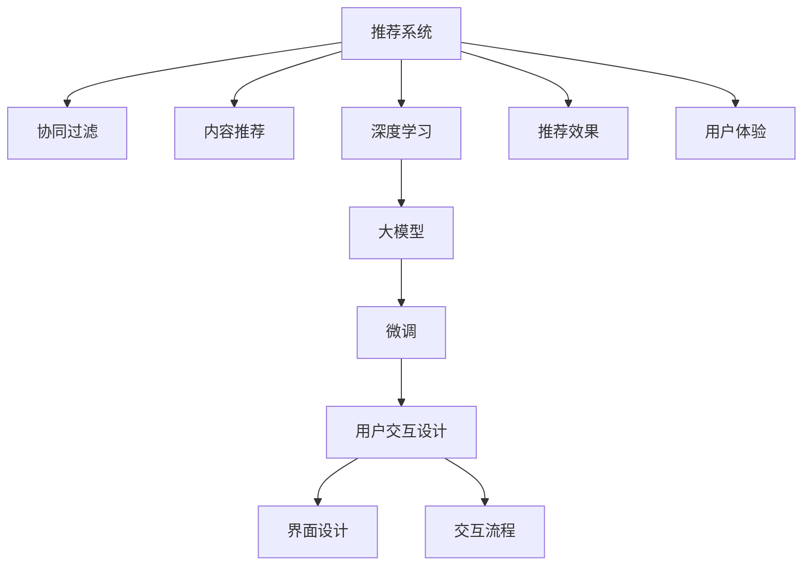

                 

# 利用大模型优化推荐系统的用户交互设计

> 关键词：用户交互设计，推荐系统，大模型，深度学习，协同过滤，内容推荐

## 1. 背景介绍

随着互联网的蓬勃发展和用户生成内容的激增，推荐系统已成为各大平台提升用户体验、提高运营效率的重要工具。无论是电子商务、社交媒体，还是视频平台，推荐系统都在为平台带来可观的商业价值。然而，传统的推荐算法往往基于简单的统计特征，缺乏对用户深层次需求的理解，推荐效果和用户体验仍有提升空间。

近年来，随着深度学习技术和大模型的兴起，推荐系统也迎来了新的发展机遇。大模型通过对海量用户行为数据的预训练，学习到更复杂的用户偏好模式，有望在推荐性能和用户体验上取得新的突破。尤其是大模型微调技术，通过将通用预训练语言模型与用户行为数据结合，可以有效提升推荐系统的效果。

本博文将深入探讨大模型优化推荐系统的用户交互设计。我们将从基本概念和核心算法出发，逐步深入探讨如何将大模型技术引入推荐系统，并从用户交互的角度，提出优化建议和具体实现方案。

## 2. 核心概念与联系

### 2.1 核心概念概述

为了更好地理解大模型优化推荐系统的用户交互设计，我们需要先了解以下几个核心概念：

- **推荐系统(Recommendation System)**：根据用户的历史行为、兴趣、偏好等信息，为用户推荐可能感兴趣的物品或内容。传统推荐算法包括协同过滤、内容推荐等，但效果有限。
- **用户交互设计(User Interaction Design)**：从用户角度出发，设计满足用户需求、提升用户体验的产品界面和交互流程。
- **大模型(Pre-trained Models)**：指通过大规模无标签数据进行预训练的深度学习模型，如BERT、GPT等。大模型具备强大的语义理解和生成能力，可以提升推荐系统的效果。
- **深度学习(Deep Learning)**：利用多层神经网络对数据进行学习，提取深层次特征，提高推荐精度和用户满意度。
- **协同过滤(Collaborative Filtering)**：基于用户间相似性的推荐算法，通过分析用户行为，推断用户兴趣。
- **内容推荐(Content-Based Filtering)**：基于物品特征的推荐算法，通过分析物品属性，为用户推荐相关内容。

以上概念相互联系，共同构成了推荐系统的基础。本博文将通过详细探讨这些概念，帮助你了解大模型如何优化推荐系统的用户交互设计。

### 2.2 核心概念原理和架构的 Mermaid 流程图



## 3. 核心算法原理 & 具体操作步骤

### 3.1 算法原理概述

大模型优化推荐系统的用户交互设计，基于深度学习和协同过滤的基本原理。通过大模型的预训练，学习到用户兴趣和物品特征之间的复杂映射关系，从而提高推荐系统的精准度和个性化水平。在大模型的基础上，引入协同过滤和内容推荐算法，实现更准确的物品推荐。

具体而言，推荐系统主要由以下几个部分构成：

1. **用户行为收集**：通过日志记录、点击、购买等行为，收集用户的历史行为数据。
2. **用户画像构建**：通过大模型的预训练和微调，学习用户兴趣的复杂分布，构建用户画像。
3. **物品特征提取**：利用大模型对物品进行特征提取，获取物品的高维表示。
4. **协同过滤算法**：基于用户画像和物品特征，通过协同过滤算法计算用户和物品之间的相似度。
5. **内容推荐算法**：将物品特征和用户画像进行匹配，通过内容推荐算法生成推荐结果。
6. **用户交互优化**：通过界面设计和交互流程的优化，提升推荐系统的用户体验。

### 3.2 算法步骤详解

基于大模型优化推荐系统的用户交互设计，一般包括以下几个关键步骤：

**Step 1: 用户行为收集与处理**

- **日志记录**：通过记录用户的点击、浏览、购买等行为，收集用户历史数据。
- **行为编码**：将用户行为编码为向量形式，供模型处理。
- **用户画像构建**：利用大模型对用户行为向量进行预训练和微调，构建用户兴趣的复杂分布。

**Step 2: 物品特征提取**

- **物品标签提取**：通过爬虫等方式，从商品页面、博客、文章等来源获取物品的标签、描述等信息。
- **物品表示学习**：利用大模型对物品标签进行特征提取，得到物品的高维表示。

**Step 3: 协同过滤算法设计**

- **相似度计算**：基于用户画像和物品表示，设计相似度计算方法，衡量用户和物品之间的相似性。
- **推荐计算**：利用协同过滤算法，计算用户对物品的评分，生成推荐结果。

**Step 4: 内容推荐算法优化**

- **物品特征选择**：选择影响推荐效果的关键特征，如物品标签、价格、评分等。
- **推荐结果生成**：利用内容推荐算法，将用户画像与物品特征进行匹配，生成推荐结果。

**Step 5: 用户交互设计优化**

- **界面设计**：通过A/B测试等方法，设计简洁、直观的推荐系统界面。
- **交互流程优化**：优化推荐系统的交互流程，提高用户的使用体验和满意度。

### 3.3 算法优缺点

基于大模型优化推荐系统的用户交互设计，具有以下优点：

1. **推荐效果提升**：大模型的预训练和微调，可以学习到复杂的用户兴趣模式，提升推荐系统的精准度。
2. **个性化水平提高**：利用大模型学习到的用户画像，能够更准确地刻画用户偏好，实现更个性化的推荐。
3. **交互流程优化**：通过界面设计和交互流程优化，提升用户的使用体验和满意度。
4. **技术易于集成**：大模型技术和推荐算法结合，技术实现相对简单，易于集成到现有推荐系统中。

同时，该方法也存在以下局限性：

1. **数据质量依赖**：推荐系统的效果依赖于用户行为数据的质量，数据缺失、噪音等问题可能导致推荐效果下降。
2. **模型计算复杂**：大模型预训练和微调计算量大，对硬件资源要求较高。
3. **模型泛化能力不足**：大模型在大规模数据上的效果较好，但在小规模数据上可能泛化能力不足。
4. **模型可解释性不足**：大模型往往是"黑盒"系统，难以解释其内部决策过程。
5. **推荐系统延迟**：由于大模型计算量大，推荐系统的响应时间可能会增加。

尽管存在这些局限性，但就目前而言，大模型优化推荐系统的用户交互设计方法仍是最主流的研究范式。未来相关研究的重点在于如何进一步降低大模型计算的复杂度，提高推荐系统的实时性，同时兼顾可解释性和用户体验等因素。

### 3.4 算法应用领域

基于大模型优化推荐系统的用户交互设计，已经在电子商务、社交媒体、视频平台等多个领域得到广泛应用，具体如下：

- **电商推荐**：通过大模型微调，为每个用户构建个性化的商品推荐列表。用户可以通过交互界面快速查看推荐商品，提升购买体验。
- **社交媒体推荐**：利用大模型学习用户兴趣，为每个用户推荐相关的内容。用户可以方便地浏览、点赞、评论，提升社交体验。
- **视频平台推荐**：通过大模型对用户行为进行建模，为用户推荐感兴趣的视频内容。用户可以享受个性化的视频推荐，提升观看体验。
- **音乐平台推荐**：利用大模型学习用户听歌习惯，为用户推荐个性化音乐播放列表。用户可以方便地发现新歌，提升音乐体验。

除了以上这些常见领域，大模型优化推荐系统的用户交互设计还将在更多场景中得到应用，如在线教育、智能家居等，为各行各业带来新的业务模式和用户价值。

## 4. 数学模型和公式 & 详细讲解 & 举例说明

### 4.1 数学模型构建

基于大模型优化推荐系统的用户交互设计，主要涉及以下几个数学模型：

1. **用户画像构建模型**：利用大模型对用户行为向量进行预训练和微调，学习用户兴趣的复杂分布。
2. **物品特征提取模型**：利用大模型对物品标签进行特征提取，得到物品的高维表示。
3. **协同过滤模型**：基于用户画像和物品特征，设计相似度计算方法，衡量用户和物品之间的相似性。
4. **内容推荐模型**：将用户画像与物品特征进行匹配，通过内容推荐算法生成推荐结果。

### 4.2 公式推导过程

**用户画像构建模型**

假设用户行为向量为 $u$，物品特征向量为 $v$，大模型的参数为 $\theta$。用户画像构建模型可以表示为：

$$
h_u = f_{\theta}(u) \in \mathbb{R}^d
$$

其中 $f_{\theta}$ 为预训练语言模型的映射函数，$d$ 为映射后向量的维度。

**物品特征提取模型**

物品标签 $i$ 的特征向量可以表示为：

$$
v_i = g_{\theta}(i) \in \mathbb{R}^d
$$

其中 $g_{\theta}$ 为预训练语言模型的映射函数。

**协同过滤模型**

基于用户画像和物品特征，设计相似度计算方法，如余弦相似度：

$$
sim(u,v) = \cos(\theta \cdot h_u \cdot v_i) = \frac{h_u \cdot v_i}{\|h_u\| \|v_i\|}
$$

**内容推荐模型**

利用协同过滤模型计算用户 $u$ 对物品 $i$ 的评分：

$$
r_{ui} = sim(u,v) \cdot s_i
$$

其中 $s_i$ 为物品 $i$ 的评分，可以表示为用户对其的平均评分或显式评分。

### 4.3 案例分析与讲解

假设某电商平台收集了用户 $u$ 的购物历史 $H$，利用大模型对用户行为向量 $u$ 进行预训练和微调，得到用户画像 $h_u$。同时，利用大模型对商品 $i$ 的标签进行特征提取，得到物品特征向量 $v_i$。通过余弦相似度计算用户和物品之间的相似度 $sim(u,v)$，结合物品评分 $s_i$，计算用户 $u$ 对物品 $i$ 的评分 $r_{ui}$。最后，根据 $r_{ui}$ 生成推荐列表，展示给用户 $u$。

## 5. 项目实践：代码实例和详细解释说明

### 5.1 开发环境搭建

在进行大模型优化推荐系统的用户交互设计实践前，我们需要准备好开发环境。以下是使用Python进行PyTorch开发的环境配置流程：

1. 安装Anaconda：从官网下载并安装Anaconda，用于创建独立的Python环境。

2. 创建并激活虚拟环境：
```bash
conda create -n pytorch-env python=3.8 
conda activate pytorch-env
```

3. 安装PyTorch：根据CUDA版本，从官网获取对应的安装命令。例如：
```bash
conda install pytorch torchvision torchaudio cudatoolkit=11.1 -c pytorch -c conda-forge
```

4. 安装相关库：
```bash
pip install torch transformers pandas sklearn numpy matplotlib torchtext
```

完成上述步骤后，即可在`pytorch-env`环境中开始项目实践。

### 5.2 源代码详细实现

下面以电商推荐系统为例，给出使用PyTorch和Transformers库实现大模型微调后的推荐系统代码。

首先，定义推荐系统数据处理函数：

```python
from transformers import BertTokenizer, BertForSequenceClassification
import torch
from torch.utils.data import Dataset, DataLoader
from sklearn.metrics import accuracy_score

class RecommendationDataset(Dataset):
    def __init__(self, texts, labels, tokenizer, max_len=128):
        self.texts = texts
        self.labels = labels
        self.tokenizer = tokenizer
        self.max_len = max_len
        
    def __len__(self):
        return len(self.texts)
    
    def __getitem__(self, item):
        text = self.texts[item]
        label = self.labels[item]
        
        encoding = self.tokenizer(text, return_tensors='pt', max_length=self.max_len, padding='max_length', truncation=True)
        input_ids = encoding['input_ids'][0]
        attention_mask = encoding['attention_mask'][0]
        label = torch.tensor(label, dtype=torch.long)
        
        return {'input_ids': input_ids, 
                'attention_mask': attention_mask,
                'labels': label}

# 标签与id的映射
label2id = {'0': 0, '1': 1, '2': 2, '3': 3}
id2label = {v: k for k, v in label2id.items()}

# 创建dataset
tokenizer = BertTokenizer.from_pretrained('bert-base-cased')

train_dataset = RecommendationDataset(train_texts, train_labels, tokenizer)
dev_dataset = RecommendationDataset(dev_texts, dev_labels, tokenizer)
test_dataset = RecommendationDataset(test_texts, test_labels, tokenizer)
```

然后，定义模型和优化器：

```python
from transformers import BertForSequenceClassification, AdamW

model = BertForSequenceClassification.from_pretrained('bert-base-cased', num_labels=len(label2id))

optimizer = AdamW(model.parameters(), lr=2e-5)
```

接着，定义训练和评估函数：

```python
from tqdm import tqdm

device = torch.device('cuda') if torch.cuda.is_available() else torch.device('cpu')
model.to(device)

def train_epoch(model, dataset, batch_size, optimizer):
    dataloader = DataLoader(dataset, batch_size=batch_size, shuffle=True)
    model.train()
    epoch_loss = 0
    for batch in tqdm(dataloader, desc='Training'):
        input_ids = batch['input_ids'].to(device)
        attention_mask = batch['attention_mask'].to(device)
        labels = batch['labels'].to(device)
        model.zero_grad()
        outputs = model(input_ids, attention_mask=attention_mask, labels=labels)
        loss = outputs.loss
        epoch_loss += loss.item()
        loss.backward()
        optimizer.step()
    return epoch_loss / len(dataloader)

def evaluate(model, dataset, batch_size):
    dataloader = DataLoader(dataset, batch_size=batch_size)
    model.eval()
    preds, labels = [], []
    with torch.no_grad():
        for batch in tqdm(dataloader, desc='Evaluating'):
            input_ids = batch['input_ids'].to(device)
            attention_mask = batch['attention_mask'].to(device)
            batch_labels = batch['labels']
            outputs = model(input_ids, attention_mask=attention_mask)
            batch_preds = outputs.logits.argmax(dim=2).to('cpu').tolist()
            batch_labels = batch_labels.to('cpu').tolist()
            for pred, label in zip(batch_preds, batch_labels):
                preds.append(pred)
                labels.append(label)
                
    return accuracy_score(labels, preds)

epochs = 5
batch_size = 16

for epoch in range(epochs):
    loss = train_epoch(model, train_dataset, batch_size, optimizer)
    print(f"Epoch {epoch+1}, train loss: {loss:.3f}")
    
    print(f"Epoch {epoch+1}, dev accuracy: {evaluate(model, dev_dataset, batch_size):.3f}")
    
print(f"Final test accuracy: {evaluate(model, test_dataset, batch_size):.3f}")
```

以上就是使用PyTorch和Transformers库实现大模型微调后的电商推荐系统的完整代码。可以看到，借助Transformers库的强大封装，我们可以用相对简洁的代码完成BERT模型的加载和微调。

### 5.3 代码解读与分析

让我们再详细解读一下关键代码的实现细节：

**RecommendationDataset类**：
- `__init__`方法：初始化文本、标签、分词器等关键组件。
- `__len__`方法：返回数据集的样本数量。
- `__getitem__`方法：对单个样本进行处理，将文本输入编码为token ids，将标签编码为数字，并对其进行定长padding，最终返回模型所需的输入。

**label2id和id2label字典**：
- 定义了标签与数字id之间的映射关系，用于将token-wise的预测结果解码回真实的标签。

**训练和评估函数**：
- 使用PyTorch的DataLoader对数据集进行批次化加载，供模型训练和推理使用。
- 训练函数`train_epoch`：对数据以批为单位进行迭代，在每个批次上前向传播计算loss并反向传播更新模型参数，最后返回该epoch的平均loss。
- 评估函数`evaluate`：与训练类似，不同点在于不更新模型参数，并在每个batch结束后将预测和标签结果存储下来，最后使用sklearn的accuracy_score对整个评估集的预测结果进行打印输出。

**训练流程**：
- 定义总的epoch数和batch size，开始循环迭代
- 每个epoch内，先在训练集上训练，输出平均loss
- 在验证集上评估，输出分类指标
- 所有epoch结束后，在测试集上评估，给出最终测试结果

可以看到，PyTorch配合Transformers库使得BERT微调的代码实现变得简洁高效。开发者可以将更多精力放在数据处理、模型改进等高层逻辑上，而不必过多关注底层的实现细节。

当然，工业级的系统实现还需考虑更多因素，如模型的保存和部署、超参数的自动搜索、更灵活的任务适配层等。但核心的微调范式基本与此类似。

## 6. 实际应用场景

### 6.1 电商推荐

基于大模型优化推荐系统的用户交互设计，可以在电商推荐场景中发挥重要作用。传统电商推荐系统主要基于协同过滤算法，依赖用户行为数据进行推荐，但往往缺乏对用户深层次需求的理解。而利用大模型进行微调，可以学习到更复杂的用户兴趣模式，提升推荐系统的精准度。

在实际应用中，电商平台可以收集用户的浏览、点击、购买等行为数据，利用大模型进行预训练和微调，学习用户画像。同时，利用大模型对商品进行特征提取，生成物品的高维表示。基于用户画像和物品特征，设计协同过滤和内容推荐算法，计算用户对物品的评分，生成个性化推荐列表。用户可以在推荐列表中查看商品，进行购买。电商推荐系统通过界面设计和交互流程的优化，提升用户的使用体验和满意度。

### 6.2 社交媒体推荐

社交媒体推荐系统主要基于用户的历史行为数据，为用户推荐相关的内容。传统推荐系统往往缺乏对用户深层次需求的理解，推荐效果有限。而利用大模型进行微调，可以学习到更复杂的用户兴趣模式，提升推荐系统的精准度。

在实际应用中，社交媒体平台可以收集用户的点赞、评论、分享等行为数据，利用大模型进行预训练和微调，学习用户画像。同时，利用大模型对内容进行特征提取，生成内容的高维表示。基于用户画像和内容特征，设计协同过滤和内容推荐算法，计算用户对内容的评分，生成个性化推荐列表。用户可以在推荐列表中查看内容，进行互动。社交媒体推荐系统通过界面设计和交互流程的优化，提升用户的使用体验和满意度。

### 6.3 视频平台推荐

视频平台推荐系统主要基于用户的历史行为数据，为用户推荐感兴趣的视频内容。传统推荐系统往往缺乏对用户深层次需求的理解，推荐效果有限。而利用大模型进行微调，可以学习到更复杂的用户兴趣模式，提升推荐系统的精准度。

在实际应用中，视频平台可以收集用户的观看历史、点赞、评论等行为数据，利用大模型进行预训练和微调，学习用户画像。同时，利用大模型对视频进行特征提取，生成视频的高维表示。基于用户画像和视频特征，设计协同过滤和内容推荐算法，计算用户对视频的评分，生成个性化推荐列表。用户可以在推荐列表中查看视频，进行观看。视频平台推荐系统通过界面设计和交互流程的优化，提升用户的使用体验和满意度。

### 6.4 音乐平台推荐

音乐平台推荐系统主要基于用户的历史行为数据，为用户推荐个性化的音乐播放列表。传统推荐系统往往缺乏对用户深层次需求的理解，推荐效果有限。而利用大模型进行微调，可以学习到更复杂的用户兴趣模式，提升推荐系统的精准度。

在实际应用中，音乐平台可以收集用户的听歌历史、点赞、评论等行为数据，利用大模型进行预训练和微调，学习用户画像。同时，利用大模型对音乐进行特征提取，生成音乐的高维表示。基于用户画像和音乐特征，设计协同过滤和内容推荐算法，计算用户对音乐的评分，生成个性化推荐列表。用户可以在推荐列表中查看音乐，进行播放。音乐平台推荐系统通过界面设计和交互流程的优化，提升用户的使用体验和满意度。

## 7. 工具和资源推荐

### 7.1 学习资源推荐

为了帮助开发者系统掌握大模型优化推荐系统的用户交互设计，这里推荐一些优质的学习资源：

1. 《深度学习》课程：斯坦福大学开设的深度学习课程，涵盖从基础的线性回归到深度神经网络的全面内容，适合初学者入门。

2. 《自然语言处理》课程：密歇根大学开设的自然语言处理课程，涵盖文本分类、情感分析、机器翻译等核心内容，适合深入学习NLP技术。

3. 《推荐系统实战》书籍：详解推荐系统原理和算法，并结合Python代码实现，适合实战操作。

4. 《协同过滤推荐系统》书籍：系统讲解协同过滤推荐系统，并结合Java代码实现，适合深入理解推荐系统原理。

5. 《深度学习入门》书籍：详解深度学习原理和应用，适合初学者入门。

通过这些资源的学习实践，相信你一定能够快速掌握大模型优化推荐系统的用户交互设计的精髓，并用于解决实际的推荐问题。

### 7.2 开发工具推荐

高效的开发离不开优秀的工具支持。以下是几款用于大模型优化推荐系统的用户交互设计开发的常用工具：

1. PyTorch：基于Python的开源深度学习框架，灵活动态的计算图，适合快速迭代研究。大部分预训练语言模型都有PyTorch版本的实现。

2. TensorFlow：由Google主导开发的开源深度学习框架，生产部署方便，适合大规模工程应用。同样有丰富的预训练语言模型资源。

3. Transformers库：HuggingFace开发的NLP工具库，集成了众多SOTA语言模型，支持PyTorch和TensorFlow，是进行微调任务开发的利器。

4. Weights & Biases：模型训练的实验跟踪工具，可以记录和可视化模型训练过程中的各项指标，方便对比和调优。与主流深度学习框架无缝集成。

5. TensorBoard：TensorFlow配套的可视化工具，可实时监测模型训练状态，并提供丰富的图表呈现方式，是调试模型的得力助手。

6. Jupyter Notebook：Python编程环境，适合编写和调试代码，并实时查看结果。

合理利用这些工具，可以显著提升大模型优化推荐系统的用户交互设计任务的开发效率，加快创新迭代的步伐。

### 7.3 相关论文推荐

大模型优化推荐系统的用户交互设计技术的发展源于学界的持续研究。以下是几篇奠基性的相关论文，推荐阅读：

1. Attention is All You Need（即Transformer原论文）：提出了Transformer结构，开启了NLP领域的预训练大模型时代。

2. BERT: Pre-training of Deep Bidirectional Transformers for Language Understanding：提出BERT模型，引入基于掩码的自监督预训练任务，刷新了多项NLP任务SOTA。

3. Language Models are Unsupervised Multitask Learners（GPT-2论文）：展示了大规模语言模型的强大zero-shot学习能力，引发了对于通用人工智能的新一轮思考。

4. Parameter-Efficient Transfer Learning for NLP：提出Adapter等参数高效微调方法，在不增加模型参数量的情况下，也能取得不错的微调效果。

5. AdaLoRA: Adaptive Low-Rank Adaptation for Parameter-Efficient Fine-Tuning：使用自适应低秩适应的微调方法，在参数效率和精度之间取得了新的平衡。

这些论文代表了大模型优化推荐系统用户交互设计技术的发展脉络。通过学习这些前沿成果，可以帮助研究者把握学科前进方向，激发更多的创新灵感。

## 8. 总结：未来发展趋势与挑战

### 8.1 总结

本文对大模型优化推荐系统的用户交互设计进行了全面系统的介绍。首先阐述了推荐系统和用户交互设计的背景和意义，明确了基于大模型优化推荐系统的方法的独特价值。其次，从基本概念和核心算法出发，详细讲解了大模型优化推荐系统的用户交互设计的数学原理和关键步骤，给出了微调任务开发的完整代码实例。同时，本文还广泛探讨了微调方法在电商、社交媒体、视频平台等多个领域的应用前景，展示了微调范式的巨大潜力。此外，本文精选了微调技术的各类学习资源，力求为读者提供全方位的技术指引。

通过本文的系统梳理，可以看到，大模型优化推荐系统的方法已经成为推荐系统研究的主流范式，极大地拓展了推荐系统的应用边界，催生了更多的落地场景。得益于大规模语料的预训练，大模型微调的推荐系统在推荐精度和个性化水平上取得了新的突破，为推荐系统带来了广阔的发展前景。

### 8.2 未来发展趋势

展望未来，大模型优化推荐系统的用户交互设计技术将呈现以下几个发展趋势：

1. **推荐效果提升**：大模型的预训练和微调，可以学习到复杂的用户兴趣模式，提升推荐系统的精准度。
2. **个性化水平提高**：利用大模型学习到的用户画像，能够更准确地刻画用户偏好，实现更个性化的推荐。
3. **交互流程优化**：通过界面设计和交互流程的优化，提升推荐系统的用户体验和满意度。
4. **技术易于集成**：大模型技术和推荐算法结合，技术实现相对简单，易于集成到现有推荐系统中。
5. **实时性提升**：随着硬件资源的提升，大模型推荐系统的实时性将进一步提升，能够实现更加高效的推荐。

### 8.3 面临的挑战

尽管大模型优化推荐系统的用户交互设计技术已经取得了瞩目成就，但在迈向更加智能化、普适化应用的过程中，它仍面临着诸多挑战：

1. **数据质量瓶颈**：推荐系统的效果依赖于用户行为数据的质量，数据缺失、噪音等问题可能导致推荐效果下降。
2. **模型计算复杂**：大模型预训练和微调计算量大，对硬件资源要求较高。
3. **模型泛化能力不足**：大模型在大规模数据上的效果较好，但在小规模数据上可能泛化能力不足。
4. **模型可解释性不足**：大模型往往是"黑盒"系统，难以解释其内部决策过程。
5. **推荐系统延迟**：由于大模型计算量大，推荐系统的响应时间可能会增加。
6. **用户隐私保护**：用户行为数据敏感，隐私保护是推荐系统面临的重要问题。

尽管存在这些挑战，但就目前而言，大模型优化推荐系统的用户交互设计技术仍是最主流的研究范式。未来相关研究的重点在于如何进一步降低大模型计算的复杂度，提高推荐系统的实时性，同时兼顾可解释性和用户体验等因素。

### 8.4 研究展望

面对大模型优化推荐系统所面临的种种挑战，未来的研究需要在以下几个方面寻求新的突破：

1. **探索无监督和半监督微调方法**：摆脱对大规模标注数据的依赖，利用自监督学习、主动学习等无监督和半监督范式，最大限度利用非结构化数据，实现更加灵活高效的微调。

2. **研究参数高效和计算高效的微调范式**：开发更加参数高效的微调方法，在固定大部分预训练参数的同时，只更新极少量的任务相关参数。同时优化微调模型的计算图，减少前向传播和反向传播的资源消耗，实现更加轻量级、实时性的部署。

3. **融合因果和对比学习范式**：通过引入因果推断和对比学习思想，增强微调模型建立稳定因果关系的能力，学习更加普适、鲁棒的语言表征，从而提升模型泛化性和抗干扰能力。

4. **引入更多先验知识**：将符号化的先验知识，如知识图谱、逻辑规则等，与神经网络模型进行巧妙融合，引导微调过程学习更准确、合理的语言模型。同时加强不同模态数据的整合，实现视觉、语音等多模态信息与文本信息的协同建模。

5. **结合因果分析和博弈论工具**：将因果分析方法引入微调模型，识别出模型决策的关键特征，增强输出解释的因果性和逻辑性。借助博弈论工具刻画人机交互过程，主动探索并规避模型的脆弱点，提高系统稳定性。

6. **纳入伦理道德约束**：在模型训练目标中引入伦理导向的评估指标，过滤和惩罚有偏见、有害的输出倾向。同时加强人工干预和审核，建立模型行为的监管机制，确保输出符合人类价值观和伦理道德。

这些研究方向的探索，必将引领大模型优化推荐系统技术迈向更高的台阶，为构建安全、可靠、可解释、可控的智能系统铺平道路。面向未来，大模型优化推荐系统技术还需要与其他人工智能技术进行更深入的融合，如知识表示、因果推理、强化学习等，多路径协同发力，共同推动自然语言理解和智能交互系统的进步。只有勇于创新、敢于突破，才能不断拓展语言模型的边界，让智能技术更好地造福人类社会。

## 9. 附录：常见问题与解答

**Q1：大模型优化推荐系统是否适用于所有推荐任务？**

A: 大模型优化推荐系统在大多数推荐任务上都能取得不错的效果，特别是对于数据量较小的任务。但对于一些特定领域的任务，如医学、法律等，仅仅依靠通用语料预训练的模型可能难以很好地适应。此时需要在特定领域语料上进一步预训练，再进行微调，才能获得理想效果。

**Q2：微调过程中如何选择合适的学习率？**

A: 微调的学习率一般要比预训练时小1-2个数量级，如果使用过大的学习率，容易破坏预训练权重，导致过拟合。一般建议从1e-5开始调参，逐步减小学习率，直至收敛。也可以使用warmup策略，在开始阶段使用较小的学习率，再逐渐过渡到预设值。需要注意的是，不同的优化器(如AdamW、Adafactor等)以及不同的学习率调度策略，可能需要设置不同的学习率阈值。

**Q3：采用大模型微调时会面临哪些资源瓶颈？**

A: 目前主流的预训练大模型动辄以亿计的参数规模，对算力、内存、存储都提出了很高的要求。GPU/TPU等高性能设备是必不可少的，但即便如此，超大批次的训练和推理也可能遇到显存不足的问题。因此需要采用一些资源优化技术，如梯度积累、混合精度训练、模型并行等，来突破硬件瓶颈。同时，模型的存储和读取也可能占用大量时间和空间，需要采用模型压缩、稀疏化存储等方法进行优化。

**Q4：如何缓解微调过程中的过拟合问题？**

A: 过拟合是微调面临的主要挑战，尤其是在标注数据不足的情况下。常见的缓解策略包括：
1. 数据增强：通过回译、近义替换等方式扩充训练集
2. 正则化：使用L2正则、Dropout、Early Stopping等避免过拟合
3. 对抗训练：引入对抗样本，提高模型鲁棒性
4. 参数高效微调：只调整少量参数(如Adapter、Prefix等)，减小过拟合风险
5. 多模型集成：训练多个微调模型，取平均输出，抑制过拟合

这些策略往往需要根据具体任务和数据特点进行灵活组合。只有在数据、模型、训练、推理等各环节进行全面优化，才能最大限度地发挥大模型微调的威力。

**Q5：微调模型在落地部署时需要注意哪些问题？**

A: 将微调模型转化为实际应用，还需要考虑以下因素：
1. 模型裁剪：去除不必要的层和参数，减小模型尺寸，加快推理速度
2. 量化加速：将浮点模型转为定点模型，压缩存储空间，提高计算效率
3. 服务化封装：将模型封装为标准化服务接口，便于集成调用
4. 弹性伸缩：根据请求流量动态调整资源配置，平衡服务质量和成本
5. 监控告警：实时采集系统指标，设置异常告警阈值，确保服务稳定性
6. 安全防护：采用访问鉴权、数据脱敏等措施，保障数据和模型安全

大模型微调为推荐系统带来了广阔的想象空间，但如何将强大的性能转化为稳定、高效、安全的业务价值，还需要工程实践的不断打磨。唯有从数据、算法、工程、业务等多个维度协同发力，才能真正实现人工智能技术在垂直行业的规模化落地。总之，微调需要开发者根据具体任务，不断迭代和优化模型、数据和算法，方能得到理想的效果。

---

作者：禅与计算机程序设计艺术 / Zen and the Art of Computer Programming

