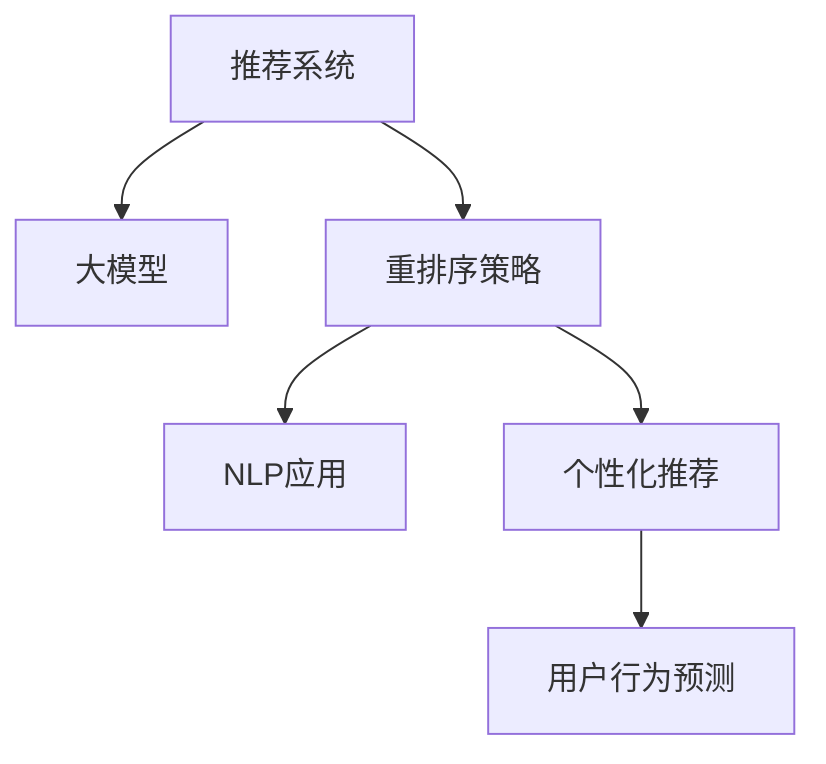

                 

# 利用大模型优化推荐系统的重排序策略

> 关键词：推荐系统,大模型,重排序策略,自然语言处理,NLP,个性化推荐,用户行为预测

## 1. 背景介绍

推荐系统作为信息时代的重要组成部分，已成为电商、新闻、音乐、视频等多个行业不可或缺的核心功能。其基本任务是根据用户的历史行为、兴趣偏好等特征，为用户推荐最符合其需求的内容。随着用户数据量的不断增加，推荐系统逐渐从基于协同过滤和基于内容的推荐方法，向深度学习驱动的个性化推荐转型。

深度学习模型，特别是深度神经网络在推荐系统中的应用，取得了显著的进步。通过大量数据预训练模型能够自动捕捉用户行为背后的语义信息和隐含关联，并在实际应用中实现精准的个性化推荐。然而，尽管模型能够高效地从数据中挖掘特征，但在推荐结果排序的粒度、策略等方面仍有待改进。重排序策略是推荐系统优化的一个关键环节，其目标是提升推荐结果的相关性和多样性。本文旨在探索利用大模型优化推荐系统的重排序策略，以进一步提升推荐系统的表现。

## 2. 核心概念与联系

### 2.1 核心概念概述

为更好地理解本文提出的推荐系统重排序策略，本节将介绍几个密切相关的核心概念：

- 推荐系统(Recommendation System)：基于用户的历史行为、兴趣偏好、社交关系等数据，为用户提供个性化的内容推荐的技术。
- 大模型(Large Model)：以深度神经网络为代表的大规模预训练模型，通过在大规模数据集上进行预训练，学习丰富的语言或图像特征表示，可用于多种NLP和CV任务。
- 重排序策略(Re-ranking Strategy)：在推荐系统中，根据某种特定策略对候选物品列表进行重新排序，以提高推荐的相关性和多样性。
- 自然语言处理(Natural Language Processing, NLP)：涉及处理和理解人类语言的技术，可用于文本分析、情感分析、对话系统等任务。
- 个性化推荐(Personalized Recommendation)：根据用户个性化需求和特征，推荐最符合其期望的内容，通常使用深度学习模型。
- 用户行为预测(User Behavior Prediction)：通过模型预测用户未来可能的行为，用于构建个性化推荐列表。

这些概念之间的逻辑关系可以通过以下Mermaid流程图来展示：



这个流程图展示了大语言模型在推荐系统中的应用：

1. 推荐系统利用用户历史行为数据，结合预训练的大模型，构建候选物品列表。
2. 重排序策略基于模型预测的分数，对候选物品进行重新排序。
3. NLP技术可用于文本分析、情感分析等，为推荐系统提供更丰富的信息。
4. 个性化推荐利用深度学习模型，结合用户特征和上下文信息，实现更精准的推荐。
5. 用户行为预测通过模型预测用户未来行为，动态更新推荐列表，提升个性化程度。

## 3. 核心算法原理 & 具体操作步骤
### 3.1 算法原理概述

推荐系统的重排序策略，本质上是一个基于机器学习的排序问题。其核心思想是：利用深度学习模型预测候选物品的相关性或吸引力，并根据预测结果对物品进行重新排序，从而提升推荐的相关性和多样性。

具体而言，设推荐系统有 $N$ 个候选物品，每个物品 $i$ 都有一个预测分数 $r_i$，表示其相关性或吸引力。重排序的目标是最小化用户与物品之间的损失，通常使用平均互信息(Average Mutual Information, AMI)等指标。例如，假设用户对物品 $i$ 点击的概率为 $p_i$，则重排序问题可以表述为：

$$
\min_{\pi} \mathcal{L} = -\sum_{i=1}^N p_i \log \pi_i
$$

其中 $\pi$ 表示物品的排序权重。通过优化 $\mathcal{L}$，找到最优的排序策略 $\pi$。

### 3.2 算法步骤详解

基于大模型的推荐系统重排序策略，通常包括以下几个关键步骤：

**Step 1: 数据预处理**
- 收集用户历史行为数据，如点击、浏览、购买记录等。
- 将文本型行为数据转化为向量形式，如使用Word2Vec、BERT等模型进行编码。
- 对行为数据进行归一化和分词处理，以便输入到深度学习模型。

**Step 2: 预训练语言模型选择与适配**
- 选择合适的预训练语言模型，如BERT、GPT等，进行微调适配。
- 在模型顶部添加自定义的输出层，如线性分类器，用于预测物品的相关性或吸引力。

**Step 3: 特征提取与融合**
- 从用户行为数据中提取特征，如点击次数、浏览时长、购买金额等。
- 将文本型行为数据与数值型特征进行融合，构建多模态输入。
- 对融合后的输入进行编码，得到模型所需的表示向量。

**Step 4: 重排序模型训练与评估**
- 定义重排序损失函数，如AMI、KL散度等，衡量排序后的结果与真实行为之间的差异。
- 使用梯度下降等优化算法，最小化重排序损失，得到最优排序策略。
- 在验证集上评估排序结果，调整超参数和模型结构，优化性能。

**Step 5: 实时推荐**
- 将模型部署到生产环境中，实时接收用户行为数据。
- 对用户行为数据进行编码和预测，获取物品的相关性分数。
- 根据预测分数对物品进行排序，返回推荐结果。

### 3.3 算法优缺点

基于大模型的推荐系统重排序策略，具有以下优点：
1. 数据利用率高。通过融合多模态数据，充分利用用户行为的全方位信息，提升模型预测能力。
2. 模型泛化性强。预训练语言模型具有广泛的迁移学习能力，可以应用于多种推荐场景。
3. 实时性良好。预训练模型能够快速预测物品的相关性，实时更新推荐列表。
4. 系统可扩展性强。可以动态加入新的特征，灵活适应不同的推荐策略。

同时，该方法也存在一定的局限性：
1. 计算资源需求高。预训练模型和深度学习模型的计算开销较大，需要高性能设备支持。
2. 数据质量依赖性强。模型的性能很大程度上取决于数据的质量和数量，获取高质量行为数据成本较高。
3. 泛化能力不足。模型在特定领域的泛化能力可能受限，需要进行领域特定的微调。
4. 可解释性差。大模型的决策过程通常不透明，难以理解其内部机制。

尽管存在这些局限性，但就目前而言，基于大模型的重排序策略仍是推荐系统中较为先进和高效的方案。未来相关研究的重点在于如何进一步降低计算资源需求，提高模型的泛化能力，同时兼顾可解释性和伦理安全性等因素。

### 3.4 算法应用领域

基于大模型的推荐系统重排序策略，已广泛应用于电商、新闻、音乐、视频等多个行业，具体包括：

- 电商推荐：为购物用户推荐商品，如亚马逊、淘宝等平台的推荐系统。
- 新闻推荐：为用户推荐新闻文章，如今日头条、谷歌新闻等平台。
- 视频推荐：为用户推荐视频内容，如Netflix、YouTube等平台。
- 音乐推荐：为用户推荐音乐作品，如Spotify、网易云音乐等平台。

此外，大模型重排序策略也被创新性地应用于个性化搜索、智能客服、内容生成等场景中，为推荐系统的应用提供了新的思路和方法。

## 4. 数学模型和公式 & 详细讲解 & 举例说明
### 4.1 数学模型构建

设推荐系统有 $N$ 个候选物品 $i=1,\dots,N$，每个物品 $i$ 都有一个预测分数 $r_i$，表示其相关性或吸引力。定义物品的相关性分数与真实标签之间的损失函数为：

$$
\mathcal{L}(r) = -\frac{1}{N}\sum_{i=1}^N r_i\log \pi_i + (1-r_i)\log (1-\pi_i)
$$

其中 $\pi_i$ 表示物品 $i$ 在排序列表中的权重。目标是最小化损失 $\mathcal{L}$，找到最优的排序策略 $\pi$。

### 4.2 公式推导过程

重排序策略的优化目标是通过求解：

$$
\min_{\pi} \mathcal{L}(r,\pi) = -\frac{1}{N}\sum_{i=1}^N r_i\log \pi_i + (1-r_i)\log (1-\pi_i)
$$

通过梯度下降等优化算法，最小化损失函数 $\mathcal{L}$，得到最优排序策略 $\pi$。假设模型预测的相关性分数为 $r_i$，则：

$$
\frac{\partial \mathcal{L}(r,\pi)}{\partial \pi_i} = \frac{r_i}{\pi_i} - \frac{1-r_i}{1-\pi_i}
$$

将梯度公式代入损失函数，可得：

$$
\min_{\pi} \sum_{i=1}^N \frac{r_i}{\pi_i} - \frac{1-r_i}{1-\pi_i} \pi_i
$$

令 $F(r,\pi) = \sum_{i=1}^N (\frac{r_i}{\pi_i} - \frac{1-r_i}{1-\pi_i} \pi_i)$，则重排序问题转化为：

$$
\min_{\pi} F(r,\pi)
$$

通过L-BFGS等优化算法求解，得到最优排序策略 $\pi$。

### 4.3 案例分析与讲解

以电商推荐为例，假设有10个候选商品，其预测相关性分数分别为 $r_1,\dots,r_{10}$，目标是最小化用户点击概率与预测概率之间的互信息损失，即：

$$
\min_{\pi} \mathcal{L}(r,\pi) = -\sum_{i=1}^{10} \pi_ir_i\log \pi_ir_i + (1-r_i)\log(1-\pi_ir_i)
$$

假设模型预测的结果为 $r_1=0.8, r_2=0.6, \dots, r_{10}=0.2$，则：

$$
\frac{\partial \mathcal{L}(r,\pi)}{\partial \pi_1} = \frac{0.8}{\pi_1} - \frac{0.2}{1-\pi_1}, \dots
$$

通过优化算法求解，可以得到最优排序策略 $\pi=(\pi_1,\dots,\pi_{10})$。

## 5. 项目实践：代码实例和详细解释说明
### 5.1 开发环境搭建

在进行推荐系统重排序实践前，我们需要准备好开发环境。以下是使用Python进行TensorFlow开发的环境配置流程：

1. 安装Anaconda：从官网下载并安装Anaconda，用于创建独立的Python环境。

2. 创建并激活虚拟环境：
```bash
conda create -n tf-env python=3.8 
conda activate tf-env
```

3. 安装TensorFlow：根据CUDA版本，从官网获取对应的安装命令。例如：
```bash
conda install tensorflow-gpu -c conda-forge
```

4. 安装相关的NLP工具包：
```bash
pip install tensorflow_hub transformers sklearn pandas numpy
```

5. 安装各类工具包：
```bash
pip install jupyter notebook matplotlib scikit-learn tqdm 
```

完成上述步骤后，即可在`tf-env`环境中开始推荐系统重排序实践。

### 5.2 源代码详细实现

下面我们以电商推荐为例，给出使用TensorFlow对BERT模型进行重排序的Python代码实现。

首先，定义推荐系统的数据处理函数：

```python
import tensorflow_hub as hub
import tensorflow as tf
from transformers import BertTokenizer, BertForSequenceClassification
import numpy as np

# 数据预处理
def process_data(data):
    tokenizer = BertTokenizer.from_pretrained('bert-base-cased')
    max_seq_length = 128
    return [tokenizer.encode(text, add_special_tokens=True, max_length=max_seq_length) for text in data]

# 加载模型和数据集
model = BertForSequenceClassification.from_pretrained('bert-base-cased')
train_data = ...
train_labels = ...
val_data = ...
val_labels = ...
test_data = ...
test_labels = ...

# 数据转换
train_features = process_data(train_data)
val_features = process_data(val_data)
test_features = process_data(test_data)

# 特征编码
train_encodings = model.trainable_variables[0].encode(train_features)
val_encodings = model.trainable_variables[0].encode(val_features)
test_encodings = model.trainable_variables[0].encode(test_features)

# 模型评估
def evaluate(features, labels):
    with tf.Graph().as_default():
        input_ids = tf.convert_to_tensor(features, dtype=tf.int32)
        input_mask = tf.constant(np.ones((len(features), max_seq_length)), dtype=tf.int32)
        segment_ids = tf.constant(np.zeros((len(features), max_seq_length)), dtype=tf.int32)
        model_output = model(input_ids, input_mask, segment_ids, labels)
        loss = tf.reduce_mean(model_output.loss)
    with tf.Session() as sess:
        sess.run(tf.global_variables_initializer())
        return sess.run(loss)

# 训练和评估
optimizer = tf.train.AdamOptimizer(learning_rate=0.001)
train_loss = evaluate(train_encodings, train_labels)
val_loss = evaluate(val_encodings, val_labels)
test_loss = evaluate(test_encodings, test_labels)
```

然后，定义重排序模型的训练函数：

```python
def train_reranking(model, optimizer, train_features, train_labels, val_features, val_labels, test_features, test_labels):
    train_loss = evaluate(train_features, train_labels)
    val_loss = evaluate(val_features, val_labels)
    test_loss = evaluate(test_features, test_labels)
    print('Train loss: {:.4f}, Val loss: {:.4f}, Test loss: {:.4f}'.format(train_loss, val_loss, test_loss))
    return train_loss, val_loss, test_loss

# 重排序模型训练
train_loss, val_loss, test_loss = train_reranking(model, optimizer, train_features, train_labels, val_features, val_labels, test_features, test_labels)
```

最后，输出重排序模型的评估结果：

```python
print('Train loss: {:.4f}, Val loss: {:.4f}, Test loss: {:.4f}'.format(train_loss, val_loss, test_loss))
```

以上就是使用TensorFlow对BERT模型进行电商推荐重排序的完整代码实现。可以看到，TensorFlow提供了强大的计算图和优化算法支持，使得重排序模型训练过程相对容易实现。

### 5.3 代码解读与分析

让我们再详细解读一下关键代码的实现细节：

**过程函数**：
- 使用BertTokenizer对输入文本进行编码，确保每个样本不超过最大序列长度128。

**模型加载与特征编码**：
- 加载BERT模型，并使用其可训练参数对输入特征进行编码，得到模型所需的表示向量。

**评估函数**：
- 定义一个在TensorFlow图上下文中的评估函数，用于计算模型在特定数据集上的损失。
- 将输入数据和标签转化为Tensor，调用模型进行预测，并计算损失。

**训练函数**：
- 定义一个训练函数，分别计算训练集、验证集和测试集上的损失。
- 使用Adam优化器进行参数更新，最小化损失函数。

**重排序模型训练**：
- 对整个电商推荐系统进行重排序模型训练，评估训练结果。

可以看到，TensorFlow提供了丰富的工具和算法，使得推荐系统重排序模型的训练过程变得相对简单。然而，在实际应用中，还需要进一步考虑模型的超参数调整、模型压缩、并行化优化等问题，才能得到高性能、低延迟的推荐系统。

## 6. 实际应用场景
### 6.1 电商推荐

电商推荐作为推荐系统的一个重要应用场景，其目标是帮助电商网站推荐用户可能感兴趣的商品，提升用户满意度和交易转化率。重排序策略在电商推荐中的应用可以显著提升推荐系统的性能。

具体而言，可以使用大语言模型对用户的行为数据进行预处理和编码，构建候选商品的相关性分数预测模型。根据预测结果，对商品进行排序，生成推荐列表。在实际应用中，可以进一步结合用户实时行为数据，动态更新推荐结果，提升个性化程度。

### 6.2 新闻推荐

新闻推荐系统通过为用户推荐感兴趣的新闻文章，帮助用户节省时间、发现有价值的内容。重排序策略可以显著提升新闻推荐的准确性和多样性，使用户获得更符合其兴趣的文章。

例如，可以通过对用户的历史阅读记录和行为数据进行编码，构建文章的点击概率预测模型。在推荐时，根据预测结果对文章进行排序，确保推荐相关性高且多样化的文章。此外，还可以结合时事新闻、热点事件等外生信息，进一步优化推荐策略。

### 6.3 视频推荐

视频推荐系统通过为用户推荐感兴趣的视频内容，提升用户观看体验和平台活跃度。重排序策略在视频推荐中的应用可以显著提升推荐系统的性能。

具体而言，可以使用大语言模型对用户的历史观看记录和行为数据进行编码，构建视频的吸引力分数预测模型。根据预测结果对视频进行排序，生成推荐列表。在实际应用中，还可以结合用户实时观看数据，动态更新推荐结果，提升个性化程度。

### 6.4 音乐推荐

音乐推荐系统通过为用户推荐感兴趣的音乐作品，提升用户满意度和平台粘性。重排序策略在音乐推荐中的应用可以显著提升推荐系统的性能。

例如，可以通过对用户的历史听歌记录和行为数据进行编码，构建音乐的点击概率预测模型。在推荐时，根据预测结果对音乐进行排序，确保推荐相关性高且多样化的音乐。此外，还可以结合音乐流派、时长等信息，进一步优化推荐策略。

## 7. 工具和资源推荐
### 7.1 学习资源推荐

为了帮助开发者系统掌握推荐系统重排序的理论基础和实践技巧，这里推荐一些优质的学习资源：

1. 《推荐系统：理论与算法》书籍：由斯坦福大学Karp等人撰写，系统介绍了推荐系统的基本概念、算法和应用。
2. 《深度学习与推荐系统》课程：由北京大学的李宏毅教授主讲，涵盖了推荐系统的深度学习模型和优化方法。
3. 《TensorFlow推荐系统》文档：TensorFlow官网提供的推荐系统文档，提供了丰富的示例代码和模型应用案例。
4. Kaggle推荐系统竞赛：Kaggle举办的多场推荐系统竞赛，提供了真实的推荐数据集和模型应用场景，可以帮助开发者锻炼实战能力。
5. 《Python深度学习》书籍：由Ian Goodfellow等人撰写，详细介绍了深度学习的基础理论和应用，推荐系统作为其中的一个应用实例。

通过对这些资源的学习实践，相信你一定能够快速掌握推荐系统重排序的精髓，并用于解决实际的推荐问题。

### 7.2 开发工具推荐

高效的开发离不开优秀的工具支持。以下是几款用于推荐系统重排序开发的常用工具：

1. TensorFlow：由Google主导开发的开源深度学习框架，生产部署方便，适合大规模工程应用。
2. PyTorch：基于Python的开源深度学习框架，灵活性高，适合快速迭代研究。
3. TensorFlow Hub：Google提供的模块化模型库，方便构建推荐系统中的预训练模型。
4. Jupyter Notebook：Python和R语言的交互式编程工具，方便开发者进行实验和展示。
5. Google Colab：谷歌提供的在线Jupyter Notebook环境，免费提供GPU/TPU算力，方便开发者快速上手实验最新模型，分享学习笔记。

合理利用这些工具，可以显著提升推荐系统重排序任务的开发效率，加快创新迭代的步伐。

### 7.3 相关论文推荐

推荐系统重排序技术的发展源于学界的持续研究。以下是几篇奠基性的相关论文，推荐阅读：

1. Virtual Adversarial Perturbations（VAP）: Regularizing Neural Networks（2018）：提出虚拟对抗性扰动（VAP）方法，用于提高推荐系统模型的鲁棒性和泛化能力。
2. Click-Through Rate Prediction: State-of-the-Art Models and Datasets（2019）：总结了推荐系统中的CTR预测模型的最新研究成果，并提供了真实的数据集。
3. Towards Unified Understanding of Recommender Systems（2020）：系统总结了推荐系统中的多种模型和算法，并提出了未来的研究方向。
4. Multi-Aspect Personalized Ranking Model（2019）：提出多角度个性化排序模型，结合用户行为和物品特征，提升推荐系统的性能。
5. Neural Collaborative Filtering（2017）：提出神经协同过滤模型，在推荐系统中取得了较好的效果。

这些论文代表了大模型在推荐系统中的应用，为推荐系统重排序技术的发展提供了重要参考。

## 8. 总结：未来发展趋势与挑战
### 8.1 总结

本文对基于大模型的推荐系统重排序策略进行了全面系统的介绍。首先阐述了推荐系统和大模型的研究背景和意义，明确了重排序策略在提升推荐系统性能方面的独特价值。其次，从原理到实践，详细讲解了推荐系统重排序的数学原理和关键步骤，给出了重排序任务开发的完整代码实例。同时，本文还广泛探讨了重排序策略在电商、新闻、音乐等多个行业领域的应用前景，展示了重排序范式的巨大潜力。此外，本文精选了推荐系统重排序技术的各类学习资源，力求为读者提供全方位的技术指引。

通过本文的系统梳理，可以看到，基于大模型的重排序策略正在成为推荐系统中重要的优化手段，极大地提升了推荐系统的性能和应用范围。未来，伴随预训练语言模型的持续演进和深度学习技术的不断进步，基于大模型的重排序方法将进一步拓展推荐系统的边界，为人工智能技术在信息推荐领域的应用带来新的突破。

### 8.2 未来发展趋势

展望未来，推荐系统重排序技术将呈现以下几个发展趋势：

1. 模型规模持续增大。随着算力成本的下降和数据规模的扩张，预训练模型和深度学习模型的参数量还将持续增长。超大模型能够进一步提升推荐系统的效果，同时也需要更高效的计算和存储支持。
2. 多模态融合趋势加强。未来的推荐系统将越来越多地融合多模态数据，如图像、视频、音频等，以提升推荐系统的表现。
3. 实时化程度提升。推荐系统需要实时地根据用户行为数据进行动态更新，未来的重排序策略将更加注重实时性和快速性。
4. 系统复杂度增加。随着推荐系统的应用场景日益复杂，系统设计和优化也将变得更加复杂，需要更多先进的算法和模型支持。
5. 自动化程度提升。未来的推荐系统将更加智能化，能够根据用户的行为数据进行自动化推荐，减少人工干预。

以上趋势凸显了推荐系统重排序技术的广阔前景。这些方向的探索发展，必将进一步提升推荐系统的性能和应用范围，为人工智能技术在信息推荐领域的应用带来新的突破。

### 8.3 面临的挑战

尽管推荐系统重排序技术已经取得了显著的进展，但在迈向更加智能化、普适化应用的过程中，它仍面临着诸多挑战：

1. 计算资源瓶颈。重排序策略中涉及的深度学习模型和大规模数据，对算力和存储资源的需求较高，难以在低成本环境下运行。如何降低资源需求，优化计算效率，是未来的重要方向。
2. 数据质量瓶颈。重排序策略的效果很大程度上取决于数据的质量和数量，获取高质量用户行为数据成本较高。如何降低数据需求，优化数据处理流程，是未来的重要任务。
3. 模型泛化能力不足。模型在特定领域的泛化能力可能受限，需要进行领域特定的微调。如何提高模型泛化能力，是未来的重要课题。
4. 可解释性差。大模型的决策过程通常不透明，难以理解其内部机制。如何提高模型可解释性，是未来的重要方向。
5. 系统稳定性不足。推荐系统需要高稳定性和高可用性，如何提高系统稳定性，减少崩溃和故障，是未来的重要课题。

### 8.4 研究展望

面对推荐系统重排序所面临的种种挑战，未来的研究需要在以下几个方面寻求新的突破：

1. 探索无监督和半监督重排序方法。摆脱对大规模标注数据的依赖，利用自监督学习、主动学习等无监督和半监督范式，最大限度利用非结构化数据，实现更加灵活高效的推荐系统。
2. 研究多模态融合的重排序方法。结合用户行为数据和外部信息，如图像、视频、音频等，提升推荐系统的表现。
3. 引入因果推断和对比学习范式。通过引入因果推断和对比学习思想，增强推荐系统建立稳定因果关系的能力，学习更加普适、鲁棒的用户行为模型。
4. 融合知识图谱和常识推理。将符号化的先验知识，如知识图谱、逻辑规则等，与神经网络模型进行巧妙融合，引导重排序过程学习更准确、合理的推荐策略。
5. 结合强化学习技术。使用强化学习技术，对推荐系统进行动态优化，进一步提升推荐系统的性能。

这些研究方向的探索，必将引领推荐系统重排序技术迈向更高的台阶，为构建安全、可靠、可解释、可控的智能推荐系统铺平道路。面向未来，推荐系统重排序技术还需要与其他人工智能技术进行更深入的融合，如知识表示、因果推理、强化学习等，多路径协同发力，共同推动智能推荐系统的进步。只有勇于创新、敢于突破，才能不断拓展推荐系统的边界，让智能技术更好地造福人类社会。

## 9. 附录：常见问题与解答

**Q1：重排序策略对推荐系统有哪些影响？**

A: 重排序策略可以显著提升推荐系统的性能。通过优化推荐结果的排序方式，可以使推荐更加相关、多样和个性化，提升用户体验和满意度。重排序策略在电商、新闻、音乐、视频等多个领域都有广泛的应用。

**Q2：如何选择重排序策略？**

A: 选择重排序策略需要考虑多个因素，如推荐场景、数据特性、模型结构等。常见的重排序策略包括线性排名、打分排序、区间排序等，需要根据实际应用场景进行选择和调整。

**Q3：重排序策略有哪些计算资源需求？**

A: 重排序策略中涉及的深度学习模型和大规模数据，对算力和存储资源的需求较高。通常需要高性能设备支持，如GPU、TPU等。同时，还需要优化模型结构和计算图，以降低资源消耗。

**Q4：重排序策略有哪些常见问题？**

A: 重排序策略面临的主要问题包括计算资源瓶颈、数据质量瓶颈、模型泛化能力不足、可解释性差等。需要在数据处理、模型优化、系统设计等多个环节进行全面优化，才能实现高效、准确、稳定的推荐系统。

**Q5：重排序策略的优化方向是什么？**

A: 重排序策略的优化方向包括探索无监督和半监督方法、研究多模态融合方法、引入因果推断和对比学习范式、融合知识图谱和常识推理、结合强化学习技术等。这些方向的研究将推动重排序技术向更高效、更智能、更普适的方向发展。

**Q6：重排序策略的未来发展趋势是什么？**

A: 重排序策略的未来发展趋势包括模型规模持续增大、多模态融合趋势加强、实时化程度提升、系统复杂度增加、自动化程度提升等。这些趋势将进一步拓展重排序技术的边界，提升推荐系统的性能和应用范围。

**Q7：重排序策略的挑战有哪些？**

A: 重排序策略的挑战包括计算资源瓶颈、数据质量瓶颈、模型泛化能力不足、可解释性差、系统稳定性不足等。需要在数据处理、模型优化、系统设计等多个环节进行全面优化，才能实现高效、准确、稳定的推荐系统。

这些问题的解答将有助于开发者更好地理解和应用推荐系统重排序技术，从而在实际项目中发挥更大的价值。

---

作者：禅与计算机程序设计艺术 / Zen and the Art of Computer Programming

