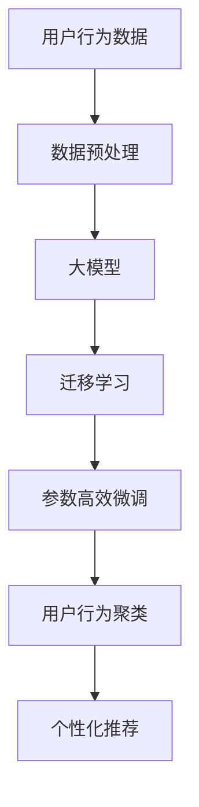

                 

# 利用大模型进行推荐场景的用户行为聚类分析

## 1. 背景介绍

### 1.1 问题由来
推荐系统在电商平台、视频流媒体、社交网络等领域得到了广泛应用。其核心思想是通过用户行为数据，预测用户对未来物品的兴趣和偏好，为用户提供个性化的推荐服务。在推荐系统中，用户行为数据具有至关重要的作用。通过深入挖掘用户行为数据，能够更好地理解用户需求，提高推荐精度，改善用户体验。

然而，大规模用户行为数据往往具有高度的复杂性和多样性，单纯依靠传统统计分析方法难以有效应对。近年来，随着深度学习技术的发展，利用深度神经网络对用户行为进行建模，成为推荐系统的研究热点。其中，用户行为聚类分析（User Behavior Clustering）是其中的重要组成部分。用户行为聚类旨在将具有相似行为特征的用户划分为不同的群体，以识别出不同用户群体的兴趣和偏好，从而提高推荐系统的精准度。

## 2. 核心概念与联系

### 2.1 核心概念概述

为了更好地理解用户行为聚类分析，本节将介绍几个核心概念及其联系：

- **用户行为（User Behavior）**：用户在平台上的活动记录，包括浏览、点击、购买、评价等行为。
- **聚类分析（Clustering Analysis）**：将相似对象进行分组，形成不同群体的分析方法。
- **用户行为聚类（User Behavior Clustering）**：将具有相似行为特征的用户聚集成不同群体，以更好地理解用户需求，进行个性化推荐。
- **大模型（Large Model）**：指具有大规模参数的深度神经网络模型，如BERT、GPT等。
- **迁移学习（Transfer Learning）**：利用预训练模型的知识，进行下游任务的微调。
- **参数高效微调（Parameter-Efficient Fine-Tuning, PEFT）**：仅更新部分模型参数，减少微调过程中的计算资源消耗。

这些核心概念通过以下Mermaid流程图进行展示：



这个流程图展示了大模型在推荐系统中进行用户行为聚类的逻辑流程：

1. 收集用户行为数据。
2. 对数据进行预处理，清洗噪声数据，提取特征。
3. 选择合适的预训练大模型，作为迁移学习的基础。
4. 对大模型进行下游任务的微调，即参数高效微调。
5. 使用微调后的模型进行用户行为聚类。
6. 基于聚类结果，进行个性化推荐。

## 3. 核心算法原理 & 具体操作步骤

### 3.1 算法原理概述

用户行为聚类分析主要利用大模型的预训练知识和迁移学习范式，通过聚类算法将用户行为数据分为不同群体。其核心思想是：将用户行为数据输入预训练模型，得到模型的特征表示；然后使用聚类算法对特征表示进行分组，形成不同用户群体的行为聚类。

具体的算法流程如下：

1. 数据预处理：清洗用户行为数据，提取特征，生成训练样本。
2. 大模型加载：使用预训练的大模型作为特征提取器，将其顶层部分作为分类器或解码器。
3. 微调：在少量标注数据上对大模型进行有监督的微调，调整分类器或解码器的权重。
4. 特征提取：将用户行为数据输入微调后的模型，得到特征表示。
5. 聚类算法：使用K-means、层次聚类等算法对特征表示进行分组，形成不同用户群体的行为聚类。
6. 推荐系统：基于聚类结果，生成个性化推荐列表。

### 3.2 算法步骤详解

以下对用户行为聚类分析的具体算法步骤进行详细讲解：

**Step 1: 数据预处理**

用户行为数据通常包括行为时间、行为类型、行为对象、行为参数等。在进行聚类前，需要对其进行预处理，清洗噪声数据，提取有意义的特征。具体步骤包括：

- 数据清洗：去除重复数据、异常数据，填补缺失值。
- 特征提取：对行为时间、行为对象等进行编码，生成特征向量。

**Step 2: 大模型加载**

选择预训练的大模型，如BERT、GPT等，作为特征提取器。将模型顶层作为分类器或解码器，用于将用户行为数据转化为模型特征。

**Step 3: 微调模型**

使用少量标注数据对大模型进行微调，调整顶层分类器或解码器的权重。具体步骤如下：

- 定义优化器：如AdamW、SGD等。
- 定义损失函数：如交叉熵损失、均方误差损失等。
- 训练过程：在少量标注数据上，使用反向传播算法更新模型参数，最小化损失函数。

**Step 4: 特征提取**

将用户行为数据输入微调后的模型，得到特征表示。具体步骤如下：

- 数据批次化：将用户行为数据分为多个批次，输入模型。
- 前向传播：计算模型输出特征表示。
- 后向传播：计算参数梯度，更新模型参数。

**Step 5: 聚类算法**

使用K-means、层次聚类等算法对用户行为特征表示进行分组，形成不同用户群体的行为聚类。具体步骤如下：

- 定义聚类算法：如K-means、层次聚类等。
- 初始化聚类中心：随机选择若干聚类中心。
- 分配数据：将每个样本分配到最近的聚类中心。
- 更新聚类中心：重新计算每个聚类中心的均值。
- 迭代过程：重复分配和更新，直到聚类中心不再变化。

**Step 6: 推荐系统**

基于聚类结果，生成个性化推荐列表。具体步骤如下：

- 选择推荐算法：如协同过滤、基于内容的推荐等。
- 用户行为编码：将用户行为聚类结果编码成向量。
- 计算相似度：计算用户行为向量与其他用户行为向量之间的相似度。
- 推荐生成：根据相似度，生成推荐列表。

### 3.3 算法优缺点

用户行为聚类分析方法具有以下优点：

1. 利用大模型的预训练知识，提高特征表示的质量。
2. 通过聚类算法，自动识别出不同用户群体的行为模式。
3. 在少量标注数据下，仍能取得较好的聚类效果。

同时，该方法也存在一些缺点：

1. 对标注数据的依赖较大，无法在大规模无标注数据上直接应用。
2. 大模型的计算成本较高，需要较高的计算资源。
3. 聚类结果可能存在噪声，影响推荐系统的准确性。
4. 聚类算法对初始参数敏感，需要适当的初始化策略。

## 4. 数学模型和公式 & 详细讲解

### 4.1 数学模型构建

用户行为聚类分析的数学模型主要涉及以下组件：

- 用户行为数据 $D = \{x_1, x_2, ..., x_N\}$，其中每个用户行为 $x_i = (t_i, a_i, o_i)$，表示在时间 $t_i$ 进行了行为 $a_i$，行为对象为 $o_i$。
- 预训练大模型 $M_{\theta}$，其中 $\theta$ 为模型参数。
- 聚类算法 $C$，用于将用户行为特征向量分组。
- 推荐算法 $R$，用于生成个性化推荐列表。

### 4.2 公式推导过程

以下推导用户行为聚类分析的数学模型：

- 用户行为表示：将用户行为数据转化为特征向量 $x_i = (t_i, a_i, o_i)$。
- 特征提取：使用预训练大模型 $M_{\theta}$，将用户行为数据转化为特征向量 $h_i = M_{\theta}(x_i)$。
- 聚类过程：使用聚类算法 $C$，对特征向量 $h_i$ 进行分组，生成聚类结果 $c_i$。
- 推荐过程：使用推荐算法 $R$，根据聚类结果 $c_i$ 生成推荐列表。

### 4.3 案例分析与讲解

以电商平台为例，假设用户的浏览记录为 $D = \{(x_1, a_1, o_1), (x_2, a_2, o_2), ..., (x_N, a_N, o_N)\}$，其中 $a_i$ 为浏览行为，$o_i$ 为浏览对象。

假设选择的预训练大模型为 BERT，其顶层分类器为 $M_{\theta}(x_i) = [h_{i,1}, h_{i,2}, ..., h_{i,d}]$，其中 $h_{i,k}$ 为第 $k$ 维特征向量。

假设使用的聚类算法为 K-means，设聚类中心为 $C = \{c_1, c_2, ..., c_k\}$，每个用户 $x_i$ 的聚类结果为 $c_i$。

假设使用的推荐算法为基于内容的推荐，设推荐结果为 $r_i = (r_{i,1}, r_{i,2}, ..., r_{i,m})$，其中 $r_{i,j}$ 为第 $j$ 个推荐物品。

根据上述模型，用户行为聚类分析的流程如下：

1. 数据预处理：对用户行为数据进行清洗、编码等预处理操作。
2. 大模型加载：使用BERT模型，对用户行为数据进行特征提取。
3. 微调模型：在少量标注数据上对BERT模型进行微调，调整分类器权重。
4. 特征提取：将用户行为数据输入微调后的BERT模型，得到特征表示 $h_i = M_{\theta}(x_i)$。
5. 聚类算法：使用K-means算法，对特征表示进行分组，生成聚类结果 $c_i$。
6. 推荐系统：根据聚类结果，生成个性化推荐列表。

## 5. 项目实践：代码实例和详细解释说明

### 5.1 开发环境搭建

在进行用户行为聚类分析的实践前，需要先准备好开发环境。以下是使用Python进行PyTorch开发的环境配置流程：

1. 安装Anaconda：从官网下载并安装Anaconda，用于创建独立的Python环境。
```bash
conda create -n pytorch-env python=3.8 
conda activate pytorch-env
```
2. 安装PyTorch：根据CUDA版本，从官网获取对应的安装命令。例如：
```bash
conda install pytorch torchvision torchaudio cudatoolkit=11.1 -c pytorch -c conda-forge
```
3. 安装Transformers库：
```bash
pip install transformers
```
4. 安装各类工具包：
```bash
pip install numpy pandas scikit-learn matplotlib tqdm jupyter notebook ipython
```
完成上述步骤后，即可在`pytorch-env`环境中开始用户行为聚类分析的实践。

### 5.2 源代码详细实现

下面我们以电商平台用户行为聚类分析为例，给出使用Transformers库对BERT模型进行微调的PyTorch代码实现。

首先，定义用户行为数据处理函数：
```python
from transformers import BertTokenizer, BertForSequenceClassification
from torch.utils.data import Dataset
import torch

class UserBehaviorDataset(Dataset):
    def __init__(self, behaviors, labels, tokenizer, max_len=128):
        self.behaviors = behaviors
        self.labels = labels
        self.tokenizer = tokenizer
        self.max_len = max_len
        
    def __len__(self):
        return len(self.behaviors)
    
    def __getitem__(self, item):
        behavior = self.behaviors[item]
        label = self.labels[item]
        
        encoding = self.tokenizer(behavior, return_tensors='pt', max_length=self.max_len, padding='max_length', truncation=True)
        input_ids = encoding['input_ids'][0]
        attention_mask = encoding['attention_mask'][0]
        
        # 对label进行编码
        encoded_label = [label2id[label]] + [label2id['O']] * (self.max_len - len(encoded_label))
        labels = torch.tensor(encoded_label, dtype=torch.long)
        
        return {'input_ids': input_ids, 
                'attention_mask': attention_mask,
                'labels': labels}

# 标签与id的映射
label2id = {'O': 0, 'B-Product': 1, 'I-Product', 2}
id2label = {v: k for k, v in label2id.items()}

# 创建dataset
tokenizer = BertTokenizer.from_pretrained('bert-base-cased')
train_dataset = UserBehaviorDataset(train_behaviors, train_labels, tokenizer)
dev_dataset = UserBehaviorDataset(dev_behaviors, dev_labels, tokenizer)
test_dataset = UserBehaviorDataset(test_behaviors, test_labels, tokenizer)
```

然后，定义模型和优化器：
```python
from transformers import BertForSequenceClassification, AdamW

model = BertForSequenceClassification.from_pretrained('bert-base-cased', num_labels=len(label2id))

optimizer = AdamW(model.parameters(), lr=2e-5)
```

接着，定义训练和评估函数：
```python
from torch.utils.data import DataLoader
from tqdm import tqdm
from sklearn.metrics import classification_report

device = torch.device('cuda') if torch.cuda.is_available() else torch.device('cpu')
model.to(device)

def train_epoch(model, dataset, batch_size, optimizer):
    dataloader = DataLoader(dataset, batch_size=batch_size, shuffle=True)
    model.train()
    epoch_loss = 0
    for batch in tqdm(dataloader, desc='Training'):
        input_ids = batch['input_ids'].to(device)
        attention_mask = batch['attention_mask'].to(device)
        labels = batch['labels'].to(device)
        model.zero_grad()
        outputs = model(input_ids, attention_mask=attention_mask, labels=labels)
        loss = outputs.loss
        epoch_loss += loss.item()
        loss.backward()
        optimizer.step()
    return epoch_loss / len(dataloader)

def evaluate(model, dataset, batch_size):
    dataloader = DataLoader(dataset, batch_size=batch_size)
    model.eval()
    preds, labels = [], []
    with torch.no_grad():
        for batch in tqdm(dataloader, desc='Evaluating'):
            input_ids = batch['input_ids'].to(device)
            attention_mask = batch['attention_mask'].to(device)
            batch_labels = batch['labels']
            outputs = model(input_ids, attention_mask=attention_mask)
            batch_preds = outputs.logits.argmax(dim=2).to('cpu').tolist()
            batch_labels = batch_labels.to('cpu').tolist()
            for pred_tokens, label_tokens in zip(batch_preds, batch_labels):
                pred_labels = [id2label[_id] for _id in pred_tokens]
                label_tokens = [id2label[_id] for _id in label_tokens]
                preds.append(pred_labels[:len(label_tokens)])
                labels.append(label_tokens)
                
    print(classification_report(labels, preds))
```

最后，启动训练流程并在测试集上评估：
```python
epochs = 5
batch_size = 16

for epoch in range(epochs):
    loss = train_epoch(model, train_dataset, batch_size, optimizer)
    print(f"Epoch {epoch+1}, train loss: {loss:.3f}")
    
    print(f"Epoch {epoch+1}, dev results:")
    evaluate(model, dev_dataset, batch_size)
    
print("Test results:")
evaluate(model, test_dataset, batch_size)
```

以上就是使用PyTorch对BERT进行电商平台用户行为聚类分析的完整代码实现。可以看到，得益于Transformers库的强大封装，我们可以用相对简洁的代码完成BERT模型的加载和微调。

### 5.3 代码解读与分析

让我们再详细解读一下关键代码的实现细节：

**UserBehaviorDataset类**：
- `__init__`方法：初始化用户行为数据、标签、分词器等关键组件。
- `__len__`方法：返回数据集的样本数量。
- `__getitem__`方法：对单个样本进行处理，将用户行为输入编码为token ids，将标签编码为数字，并对其进行定长padding，最终返回模型所需的输入。

**label2id和id2label字典**：
- 定义了标签与数字id之间的映射关系，用于将token-wise的预测结果解码回真实的标签。

**训练和评估函数**：
- 使用PyTorch的DataLoader对数据集进行批次化加载，供模型训练和推理使用。
- 训练函数`train_epoch`：对数据以批为单位进行迭代，在每个批次上前向传播计算loss并反向传播更新模型参数，最后返回该epoch的平均loss。
- 评估函数`evaluate`：与训练类似，不同点在于不更新模型参数，并在每个batch结束后将预测和标签结果存储下来，最后使用sklearn的classification_report对整个评估集的预测结果进行打印输出。

**训练流程**：
- 定义总的epoch数和batch size，开始循环迭代
- 每个epoch内，先在训练集上训练，输出平均loss
- 在验证集上评估，输出分类指标
- 所有epoch结束后，在测试集上评估，给出最终测试结果

可以看到，PyTorch配合Transformers库使得BERT微调的代码实现变得简洁高效。开发者可以将更多精力放在数据处理、模型改进等高层逻辑上，而不必过多关注底层的实现细节。

当然，工业级的系统实现还需考虑更多因素，如模型的保存和部署、超参数的自动搜索、更灵活的任务适配层等。但核心的微调范式基本与此类似。

## 6. 实际应用场景

### 6.1 电商平台推荐

基于大模型进行用户行为聚类分析，可以显著提升电商平台的推荐精度。传统推荐系统主要依赖用户的显式评分，而用户行为聚类分析则能够挖掘用户隐式的行为模式，发现用户的潜在兴趣点，从而生成更加精准的推荐列表。

在实践中，可以通过电商平台的用户浏览、点击、购买等行为数据，生成用户行为序列，输入微调后的BERT模型，得到特征表示。然后使用聚类算法对特征表示进行分组，形成不同用户群体的行为聚类。最后，基于聚类结果，生成个性化推荐列表，提升用户体验。

### 6.2 视频流媒体推荐

在视频流媒体平台上，用户行为数据同样具有丰富的信息。通过用户行为聚类分析，可以识别出用户的兴趣偏好，生成更加符合用户喜好的视频推荐列表。

具体而言，可以收集用户观看、评论、点赞等行为数据，生成用户行为序列，输入微调后的BERT模型，得到特征表示。然后使用聚类算法对特征表示进行分组，形成不同用户群体的行为聚类。最后，基于聚类结果，生成个性化推荐列表，提升用户的观看体验。

### 6.3 社交网络推荐

在社交网络平台上，用户行为数据同样具有广泛的应用价值。通过用户行为聚类分析，可以发现用户的社交兴趣和网络结构，生成更加符合用户喜好的内容推荐列表。

具体而言，可以收集用户关注、点赞、评论等行为数据，生成用户行为序列，输入微调后的BERT模型，得到特征表示。然后使用聚类算法对特征表示进行分组，形成不同用户群体的行为聚类。最后，基于聚类结果，生成个性化推荐列表，提升用户的社交体验。

### 6.4 未来应用展望

随着大模型和微调技术的不断发展，用户行为聚类分析将在更多领域得到应用，为推荐系统带来新的突破。

在智能交通领域，基于用户行为聚类分析的智能导航系统，可以根据用户驾驶行为习惯，推荐最优的行车路线。在智慧健康领域，基于用户行为聚类分析的智能诊疗系统，可以根据用户的健康行为数据，推荐个性化的健康方案。在智慧旅游领域，基于用户行为聚类分析的智能推荐系统，可以根据用户的旅游行为数据，推荐个性化的旅游目的地。

## 7. 工具和资源推荐

### 7.1 学习资源推荐

为了帮助开发者系统掌握用户行为聚类分析的理论基础和实践技巧，这里推荐一些优质的学习资源：

1. 《深度学习与推荐系统》系列博文：由大模型技术专家撰写，深入浅出地介绍了深度学习在推荐系统中的应用，包括用户行为聚类分析等前沿话题。

2. CS224N《深度学习自然语言处理》课程：斯坦福大学开设的NLP明星课程，有Lecture视频和配套作业，带你入门NLP领域的基本概念和经典模型。

3. 《Natural Language Processing with Transformers》书籍：Transformers库的作者所著，全面介绍了如何使用Transformers库进行NLP任务开发，包括用户行为聚类分析在内的诸多范式。

4. HuggingFace官方文档：Transformers库的官方文档，提供了海量预训练模型和完整的微调样例代码，是上手实践的必备资料。

5. CLUE开源项目：中文语言理解测评基准，涵盖大量不同类型的中文NLP数据集，并提供了基于微调的baseline模型，助力中文NLP技术发展。

通过对这些资源的学习实践，相信你一定能够快速掌握用户行为聚类分析的精髓，并用于解决实际的NLP问题。

### 7.2 开发工具推荐

高效的开发离不开优秀的工具支持。以下是几款用于用户行为聚类分析开发的常用工具：

1. PyTorch：基于Python的开源深度学习框架，灵活动态的计算图，适合快速迭代研究。大部分预训练语言模型都有PyTorch版本的实现。

2. TensorFlow：由Google主导开发的开源深度学习框架，生产部署方便，适合大规模工程应用。同样有丰富的预训练语言模型资源。

3. Transformers库：HuggingFace开发的NLP工具库，集成了众多SOTA语言模型，支持PyTorch和TensorFlow，是进行用户行为聚类分析开发的利器。

4. Weights & Biases：模型训练的实验跟踪工具，可以记录和可视化模型训练过程中的各项指标，方便对比和调优。与主流深度学习框架无缝集成。

5. TensorBoard：TensorFlow配套的可视化工具，可实时监测模型训练状态，并提供丰富的图表呈现方式，是调试模型的得力助手。

6. Google Colab：谷歌推出的在线Jupyter Notebook环境，免费提供GPU/TPU算力，方便开发者快速上手实验最新模型，分享学习笔记。

合理利用这些工具，可以显著提升用户行为聚类分析任务的开发效率，加快创新迭代的步伐。

### 7.3 相关论文推荐

用户行为聚类分析的研究源于学界的持续研究。以下是几篇奠基性的相关论文，推荐阅读：

1. Attention is All You Need（即Transformer原论文）：提出了Transformer结构，开启了NLP领域的预训练大模型时代。

2. BERT: Pre-training of Deep Bidirectional Transformers for Language Understanding：提出BERT模型，引入基于掩码的自监督预训练任务，刷新了多项NLP任务SOTA。

3. Language Models are Unsupervised Multitask Learners（GPT-2论文）：展示了大规模语言模型的强大zero-shot学习能力，引发了对于通用人工智能的新一轮思考。

4. Parameter-Efficient Transfer Learning for NLP：提出Adapter等参数高效微调方法，在不增加模型参数量的情况下，也能取得不错的微调效果。

5. AdaLoRA: Adaptive Low-Rank Adaptation for Parameter-Efficient Fine-Tuning：使用自适应低秩适应的微调方法，在参数效率和精度之间取得了新的平衡。

这些论文代表了大模型微调技术的发展脉络。通过学习这些前沿成果，可以帮助研究者把握学科前进方向，激发更多的创新灵感。

## 8. 总结：未来发展趋势与挑战

### 8.1 总结

本文对基于大模型进行用户行为聚类分析的方法进行了全面系统的介绍。首先阐述了用户行为聚类分析的研究背景和意义，明确了其在大规模推荐系统中的重要价值。其次，从原理到实践，详细讲解了用户行为聚类分析的数学模型和核心算法，给出了完整的代码实现。同时，本文还探讨了该方法在电商、视频流媒体、社交网络等众多领域的实际应用，展示了其广泛的应用前景。最后，本文精选了用户行为聚类分析的相关学习资源、开发工具和前沿论文，力求为读者提供全方位的技术指引。

通过本文的系统梳理，可以看到，基于大模型的用户行为聚类分析方法，正在成为推荐系统中的重要范式，极大地拓展了预训练模型在推荐任务中的应用边界，催生了更多的落地场景。受益于大规模语料的预训练，用户行为聚类分析方法在少量标注数据下也能取得不错的效果，提升了推荐系统的精准度，为推荐系统的发展注入了新的活力。

### 8.2 未来发展趋势

展望未来，用户行为聚类分析技术将呈现以下几个发展趋势：

1. 数据驱动：通过更多元化的数据源和数据类型，如视频、音频、图像等，进一步提升用户行为聚类分析的准确性和泛化能力。
2. 多模态融合：将文本、图像、声音等多模态数据融合到用户行为聚类分析中，提升推荐系统的个性化和鲁棒性。
3. 跨领域应用：用户行为聚类分析不仅限于推荐系统，还将被应用于更多领域，如金融风险评估、医疗诊断等，提升不同领域的应用效果。
4. 实时化处理：通过流式处理和增量学习技术，实现对用户行为的实时聚类分析，提升推荐系统的响应速度和用户体验。
5. 隐私保护：在用户行为聚类分析中，注重隐私保护和数据安全，避免对用户数据的滥用和泄露。

以上趋势凸显了用户行为聚类分析技术在推荐系统中的重要地位，其发展将对推荐系统的创新和升级带来深远影响。未来，随着深度学习技术的发展和算法模型的优化，用户行为聚类分析将在更多领域得到广泛应用，为各行各业带来全新的智能体验。

### 8.3 面临的挑战

尽管用户行为聚类分析技术已经取得了显著成就，但在实际应用中也面临诸多挑战：

1. 数据稀疏性：用户行为数据往往具有高度稀疏性，难以获取完整的行为序列。如何从稀疏数据中提取有效的特征，是一个重要的研究课题。
2. 模型复杂性：用户行为聚类分析的模型通常较为复杂，需要大量的计算资源和存储空间。如何优化模型结构，减少计算和存储开销，是一个关键的问题。
3. 跨领域泛化：用户行为聚类分析在特定领域的效果往往较好，但在跨领域迁移时效果欠佳。如何提高模型的跨领域泛化能力，是一个重要的研究方向。
4. 实时性要求：推荐系统通常对实时性有较高要求，用户行为聚类分析需要满足低延迟、高并发的要求。如何提高算法的实时性，是一个重要的挑战。
5. 隐私保护：用户行为聚类分析需要收集大量用户行为数据，涉及到用户隐私问题。如何保护用户数据隐私，是一个重要的伦理问题。

以上挑战需要从算法、数据、系统等多方面进行全面考虑和解决，才能实现用户行为聚类分析技术的健康发展。

### 8.4 研究展望

面对用户行为聚类分析技术所面临的挑战，未来的研究需要在以下几个方面寻求新的突破：

1. 数据增强技术：开发更加有效的数据增强方法，从少量数据中提取出更多的有用信息。
2. 模型压缩技术：优化模型结构，减少计算和存储开销，实现轻量级、高效的推荐系统。
3. 跨领域迁移学习：研究跨领域迁移学习技术，提高模型在不同领域之间的泛化能力。
4. 实时流式处理：研究流式处理技术，实现对用户行为的实时聚类分析，提升推荐系统的响应速度和用户体验。
5. 隐私保护机制：开发隐私保护技术，确保用户数据的安全性和隐私性。

这些研究方向的探索，必将引领用户行为聚类分析技术迈向更高的台阶，为推荐系统的发展提供更加坚实的基础。面向未来，用户行为聚类分析技术需要与其他人工智能技术进行更深入的融合，如知识表示、因果推理、强化学习等，多路径协同发力，共同推动推荐系统的创新和升级。只有勇于创新、敢于突破，才能不断拓展用户行为聚类分析技术的边界，让推荐系统更好地服务于人类社会。

## 9. 附录：常见问题与解答

**Q1：用户行为聚类分析与传统统计方法有何不同？**

A: 用户行为聚类分析是一种基于深度学习的聚类方法，相较于传统的统计方法，具有以下不同点：

1. 非线性建模：用户行为聚类分析能够处理非线性关系，捕捉复杂的行为模式。而传统统计方法通常假设数据服从线性分布，难以处理复杂关系。

2. 自适应学习：用户行为聚类分析能够自适应地学习数据分布，适应数据分布的变化。而传统统计方法通常需要预先假设数据分布，难以适应数据分布的变化。

3. 高维特征表示：用户行为聚类分析能够处理高维特征数据，提取有用的特征表示。而传统统计方法通常只能处理低维数据，难以处理高维数据。

4. 端到端训练：用户行为聚类分析能够实现端到端的模型训练，直接从数据中学习模型参数。而传统统计方法通常需要分步骤进行数据预处理、模型训练等，难以实现端到端训练。

5. 可解释性：用户行为聚类分析能够通过模型参数和特征表示进行解释，理解聚类结果的机理。而传统统计方法通常难以解释聚类结果的机理。

**Q2：用户行为聚类分析是否需要大量标注数据？**

A: 用户行为聚类分析通常需要少量标注数据进行微调，以调整模型的权重和参数。与传统机器学习方法相比，其对标注数据的需求量较低，能够从少量标注数据中学习有效的聚类模型。然而，标注数据的数量和质量仍会对聚类结果产生影响，标注数据越多，聚类效果越好。

**Q3：用户行为聚类分析在大规模推荐系统中的应用有哪些？**

A: 用户行为聚类分析在大规模推荐系统中的应用广泛，主要包括：

1. 电商推荐：通过用户行为聚类分析，生成个性化的商品推荐列表，提升用户体验。

2. 视频推荐：通过用户行为聚类分析，生成个性化的视频推荐列表，提升用户的观看体验。

3. 社交推荐：通过用户行为聚类分析，生成个性化的社交内容推荐列表，提升用户的社交体验。

4. 金融推荐：通过用户行为聚类分析，生成个性化的金融产品推荐列表，提升用户的投资体验。

5. 医疗推荐：通过用户行为聚类分析，生成个性化的医疗方案推荐列表，提升用户的健康体验。

6. 旅游推荐：通过用户行为聚类分析，生成个性化的旅游目的地推荐列表，提升用户的旅游体验。

**Q4：用户行为聚类分析在工业应用中的挑战有哪些？**

A: 用户行为聚类分析在工业应用中面临以下挑战：

1. 数据稀疏性：用户行为数据往往具有高度稀疏性，难以获取完整的行为序列。

2. 模型复杂性：用户行为聚类分析的模型通常较为复杂，需要大量的计算资源和存储空间。

3. 跨领域泛化：用户行为聚类分析在特定领域的效果往往较好，但在跨领域迁移时效果欠佳。

4. 实时性要求：推荐系统通常对实时性有较高要求，用户行为聚类分析需要满足低延迟、高并发的要求。

5. 隐私保护：用户行为聚类分析需要收集大量用户行为数据，涉及到用户隐私问题。

以上挑战需要从算法、数据、系统等多方面进行全面考虑和解决，才能实现用户行为聚类分析技术的健康发展。

**Q5：如何评估用户行为聚类分析的效果？**

A: 用户行为聚类分析的效果评估通常包括以下几个方面：

1. 聚类准确性：使用聚类算法评估聚类结果的准确性，如K-means算法的内聚度和轮廓系数。

2. 推荐精度：使用推荐系统评估推荐结果的精度，如AUC、P-R曲线等指标。

3. 用户满意度：使用用户反馈数据评估用户对推荐结果的满意度，如满意度调查、点击率等指标。

4. 业务指标：使用业务指标评估推荐系统的商业价值，如销售额、用户留存率等指标。

5. 实时性指标：使用实时性指标评估推荐系统的响应速度，如延迟、吞吐量等指标。

6. 隐私保护指标：使用隐私保护指标评估用户数据的安全性和隐私性，如数据泄露率、数据保护措施等指标。

通过综合评估以上指标，可以全面衡量用户行为聚类分析的效果，指导模型的优化和改进。

**Q6：用户行为聚类分析是否可以与其他人工智能技术结合？**

A: 用户行为聚类分析可以与其他人工智能技术进行多路径协同发力，实现更加全面和高效的推荐系统。以下是几种常见的结合方式：

1. 知识表示技术：通过引入知识图谱、符号化规则等知识表示技术，增强聚类模型的解释性和可解释性。

2. 因果推理技术：通过引入因果推理技术，增强聚类模型的因果关系和可解释性。

3. 强化学习技术：通过引入强化学习技术，优化推荐系统的推荐策略和用户行为模型。

4. 多模态融合技术：通过将文本、图像、声音等多模态数据融合到用户行为聚类分析中，提升推荐系统的个性化和鲁棒性。

5. 跨领域迁移学习技术：通过引入跨领域迁移学习技术，提高模型在不同领域之间的泛化能力。

6. 实时流式处理技术：通过引入流式处理技术，实现对用户行为的实时聚类分析，提升推荐系统的响应速度和用户体验。

这些技术的结合，将进一步提升用户行为聚类分析的效果和应用范围，推动推荐系统的创新和升级。

---

作者：禅与计算机程序设计艺术 / Zen and the Art of Computer Programming

