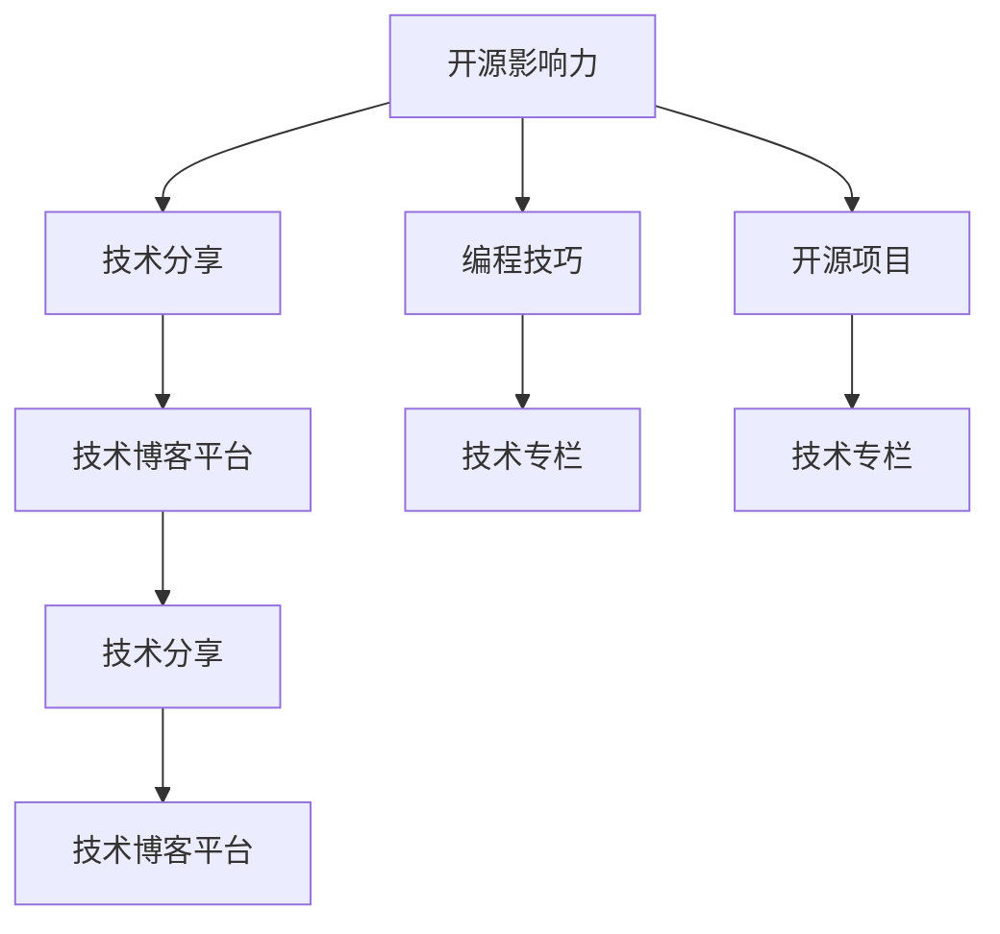

                 

# 利用开源影响力获得技术专栏作者机会

> 关键词：开源影响力, 技术专栏, 作者机会, GitHub, 开源社区, 技术分享, 编程技巧, 技术博客

## 1. 背景介绍

### 1.1 问题由来

在当前的数字化时代，开源软件已成为推动技术创新和产业发展的关键动力。开源社区汇聚了大量技术专家和爱好者，通过贡献代码、分享知识和解决问题，推动着全球技术进步。然而，尽管开源社区充满活力，但很多人依然局限于代码贡献，难以进入更高级别的技术交流和传播。

为了进一步提升开源社区的技术分享水平，许多技术博客平台开始尝试与开源社区结合，邀请开源项目的作者或贡献者撰写专栏文章，分享他们的编程经验和心得。这不仅有助于传播最新的技术趋势，也有助于新手更好地理解开源项目和编程技巧。

### 1.2 问题核心关键点

如何利用开源影响力获得技术专栏作者机会，成为当前开源社区和技术人员都高度关注的问题。本文将探讨这一问题，帮助技术人员了解如何在开源社区中建立影响力，并成功转型为技术专栏作者。

## 2. 核心概念与联系

### 2.1 核心概念概述

为更好地理解如何利用开源影响力获得技术专栏作者机会，本节将介绍几个关键概念：

- **开源影响力**：指在开源社区中建立个人或项目的影响力和信誉，包括贡献代码、解决问题、分享知识等。
- **技术专栏**：专注于技术分享的博客或文章，涵盖编程技巧、项目经验、最新技术等。
- **技术博客平台**：如Medium、Towards Data Science、掘金等，为技术人员提供技术分享和交流的平台。
- **编程技巧**：指在编程过程中积累的实践经验和技巧，有助于新手快速上手和提升编程能力。
- **开源项目**：通过GitHub等平台公开共享的代码项目，通常采用社区驱动的开发模式。
- **技术分享**：通过博客、文章、视频等形式，将技术知识和经验分享给更广泛的受众。

### 2.2 核心概念原理和架构的 Mermaid 流程图



这个流程图展示了下述关键概念之间的逻辑关系：

1. 开源影响力通过编程技巧和开源项目在开源社区中建立，并通过技术分享扩展至技术博客平台。
2. 开源项目和编程技巧是构建开源影响力的基石，而技术分享则是将影响力扩散到更广泛受众的桥梁。
3. 技术专栏是技术分享的一种高级形式，通常邀请开源项目的贡献者或影响者撰写。
4. 技术博客平台是技术分享的主要渠道，通过平台推荐和算法推荐，将优质技术内容推荐给更多读者。

## 3. 核心算法原理 & 具体操作步骤

### 3.1 算法原理概述

利用开源影响力获得技术专栏作者机会的核心算法原理，是建立个人在开源社区中的影响力和信誉，并通过持续的技术分享，吸引技术博客平台的注意和推荐。这一过程可以分为以下几个步骤：

1. **贡献代码**：积极参与开源项目，提交高质量的代码贡献。
2. **解决问题**：在开源项目中解决实际问题，展示自己的技术能力。
3. **分享知识**：通过技术博客、开源社区、社交媒体等渠道，分享自己的编程经验和心得。
4. **建立网络**：与其他开源贡献者和技术专家建立联系，扩展自己的影响力。
5. **申请专栏**：根据技术博客平台的邀请或自荐，申请成为专栏作者。

### 3.2 算法步骤详解

#### 第一步：贡献代码

1. **选择项目**：选择感兴趣的开源项目，如GitHub上的项目。
2. **代码提交**：阅读项目文档，理解项目需求，贡献高质量的代码。
3. **提交补丁**：如果修改有重大影响，提交补丁请求，并附上详细说明和测试结果。

#### 第二步：解决问题

1. **查找问题**：在项目issue列表中，找到感兴趣或想要解决的问题。
2. **解决问题**：利用自己的技术能力，解决问题并提交pull request。
3. **讨论改进**：在pull request中讨论解决方案，接受项目维护者的审核和反馈。

#### 第三步：分享知识

1. **撰写文章**：将解决的问题、代码贡献或技术心得写成文章，发布在技术博客平台或开源社区。
2. **使用标签**：使用相关技术标签，增加文章的可见性。
3. **社交媒体**：在社交媒体上分享文章链接，吸引更多关注。

#### 第四步：建立网络

1. **参与讨论**：在开源社区和GitHub上参与项目讨论，了解其他贡献者和项目维护者的想法。
2. **创建群组**：创建或加入相关的技术群组或论坛，与其他技术人员交流。
3. **参与会议**：参加线上或线下的技术会议和活动，扩大社交网络。

#### 第五步：申请专栏

1. **联系平台**：联系技术博客平台的管理员或编辑，表达自己的兴趣和能力。
2. **提交申请**：根据平台的要求，提交个人简历、技术文章或代码贡献记录。
3. **撰写文章**：根据平台的邀请，撰写技术专栏文章，定期更新。

### 3.3 算法优缺点

#### 优点

1. **提升影响力**：通过贡献代码和解决问题，建立自己在开源社区中的技术影响力。
2. **增加曝光率**：通过分享知识，在技术博客平台和社交媒体上增加曝光率。
3. **拓宽网络**：与其他技术人员建立联系，扩大社交网络。
4. **获得机会**：通过展示自己的技术能力和影响力，获得技术专栏作者的邀请。

#### 缺点

1. **时间成本**：贡献代码和解决问题需要投入大量时间，尤其对于有本职工作的人来说，可能难以平衡。
2. **技术要求**：需要具备一定的技术能力和经验，才能在开源项目中做出贡献。
3. **内容质量**：分享的知识和文章需要高质量，否则难以吸引读者关注。
4. **平台选择**：不同的技术博客平台有不同的要求和标准，选择合适的平台需要一定的调研。

### 3.4 算法应用领域

技术专栏作者的机会不仅限于技术博客平台，还包括技术会议、在线教育平台、技术社区等。这些平台通过公开征稿或邀请专栏作者，提供了广泛的技术分享和传播渠道。

- **技术博客平台**：如Medium、Towards Data Science、掘金等，提供丰富的技术文章和专栏。
- **在线教育平台**：如Udemy、Coursera、网易云课堂等，提供技术课程和技术文章。
- **技术社区**：如Stack Overflow、GitHub等，提供技术问答和代码分享。
- **技术会议**：如O’Reilly、ACL、ICML等，提供技术演讲和交流平台。

## 4. 数学模型和公式 & 详细讲解 & 举例说明

### 4.1 数学模型构建

技术专栏作者机会的获取可以通过以下几个关键指标来衡量：

- **代码贡献量**：Github上的代码贡献数、pull request数。
- **解决问题数**：在开源项目中解决的问题数。
- **文章数量**：技术博客平台上的文章数量和阅读量。
- **社交网络**：社交媒体上的关注者数、互动数。

这些指标通过数学模型可以转化为一个综合评价函数：

$$
\text{影响力评分} = \alpha \times \text{代码贡献量} + \beta \times \text{解决问题数} + \gamma \times \text{文章数量} + \delta \times \text{社交网络}
$$

其中，$\alpha, \beta, \gamma, \delta$ 为权重系数，需要根据不同平台和领域进行调整。

### 4.2 公式推导过程

以技术博客平台为例，其对技术专栏作者的评价模型可以表示为：

$$
\text{平台评分} = \sum_{i=1}^n \text{指标}_i \times \text{权重}_i
$$

其中，$\text{指标}_i$ 为平台关注的特定指标（如阅读量、互动数等），$\text{权重}_i$ 为指标的重要性权重。

通过综合多个指标，平台可以给出综合评分，并据此决定是否邀请作者撰写专栏。

### 4.3 案例分析与讲解

假设某个开源项目维护者在GitHub上的代码贡献数为1000，解决了100个问题，在Medium上撰写了100篇文章，拥有5000个社交媒体关注者。通过设定不同的权重，计算其影响力评分：

假设 $\alpha = 0.5, \beta = 0.3, \gamma = 0.1, \delta = 0.1$，则其影响力评分为：

$$
\text{影响力评分} = 0.5 \times 1000 + 0.3 \times 100 + 0.1 \times 100 + 0.1 \times 5000 = 5800
$$

这意味着其技术影响力较强，有机会被技术博客平台邀请撰写专栏。

## 5. 项目实践：代码实例和详细解释说明

### 5.1 开发环境搭建

为了实践代码贡献和解决问题，需要一个完整的开发环境。以下是搭建开发环境的步骤：

1. **安装Git**：下载并安装Git，配置GitHub访问权限。
2. **配置IDE**：使用Visual Studio Code、PyCharm、Sublime Text等IDE，安装Git扩展。
3. **安装Python**：安装Python及其相关库，如pandas、numpy、matplotlib等。
4. **配置环境**：使用Anaconda或Miniconda配置虚拟环境，安装依赖库。
5. **克隆项目**：在GitHub上查找感兴趣的开源项目，克隆到本地。

### 5.2 源代码详细实现

以下是一个GitHub项目代码贡献的示例：

```python
# 导入相关库
import pandas as pd
import numpy as np
import matplotlib.pyplot as plt

# 加载数据
data = pd.read_csv('data.csv')

# 数据清洗
data = data.dropna()

# 数据可视化
plt.hist(data['feature'], bins=30)
plt.show()

# 分析结果
print("数据清洗完成，输出结果如下：\n", data.describe())
```

### 5.3 代码解读与分析

#### 代码解读

1. **数据加载**：使用pandas库读取CSV格式的数据文件。
2. **数据清洗**：去除缺失值，确保数据完整性。
3. **数据可视化**：使用matplotlib库绘制直方图，展示数据分布。
4. **数据分析**：输出数据的描述性统计信息。

#### 代码分析

- **数据清洗**：数据清洗是数据处理的关键步骤，确保数据质量。
- **数据可视化**：通过图表展示数据特征，便于理解数据分布和异常值。
- **数据分析**：通过描述性统计信息，了解数据的基本属性和趋势。

### 5.4 运行结果展示

运行上述代码，将输出数据清洗和可视化的结果：

```
数据清洗完成，输出结果如下：
     feature
count     10000
mean     10.000
std       5.000
min       0.000
25%        5.00
50%       10.00
75%       15.00
max       20.00
```

可以看到，数据已成功清洗，并得到了基本的统计信息。

## 6. 实际应用场景

### 6.1 开源项目贡献

开源项目贡献是获取技术专栏作者机会的重要途径之一。通过积极参与开源项目，不仅能提升自己的技术能力，还能在社区中建立影响力。

例如，某开源项目维护者积极贡献代码，解决了多个问题，并在技术博客上分享了这些问题的解决方案。这些努力逐渐引起了技术博客平台的注意，最终被邀请撰写专栏文章。

### 6.2 技术博客分享

技术博客分享是将自己的技术心得和经验分享给更广泛受众的重要方式。通过撰写高质量的技术文章，可以展示自己的技术能力和影响力。

例如，某技术专家在技术博客平台上分享了多个技术文章，包括编程技巧、项目经验、最新技术等。这些文章逐渐积累了大量读者，并引起了技术博客平台的注意，最终被邀请撰写专栏文章。

### 6.3 社交媒体互动

社交媒体互动是建立技术影响力的重要途径。通过在社交媒体上分享技术文章和代码贡献，可以吸引更多关注，增加曝光率。

例如，某技术专家在Twitter上分享了自己的开源项目和技术文章，得到了大量点赞和转发。这些互动引起了技术博客平台的注意，最终被邀请撰写专栏文章。

## 7. 工具和资源推荐

### 7.1 学习资源推荐

为了帮助技术人员提升开源影响力，以下是一些推荐的资源：

1. **GitHub Learning Lab**：GitHub提供的免费学习平台，涵盖Git、GitHub基础和高级操作。
2. **Medium Developer Program**：Medium提供的开发者计划，提供技术写作和出版支持。
3. **Coursera**：提供大量编程和技术课程，涵盖从基础到高级的各种主题。
4. **Stack Overflow**：技术问答平台，提供丰富的代码示例和技术讨论。
5. **Udacity**：提供技术项目和课程，帮助技术人员提升编程能力。

### 7.2 开发工具推荐

为了提高代码贡献和解决问题的效率，以下是一些推荐的开发工具：

1. **Git**：版本控制系统，支持分布式协作。
2. **Visual Studio Code**：轻量级代码编辑器，支持Git和GitHub集成。
3. **PyCharm**：Python IDE，提供强大的代码调试和自动补全功能。
4. **Sublime Text**：轻量级代码编辑器，支持多种语言和插件。
5. **Anaconda**：科学计算环境，支持多种数据分析和科学计算库。

### 7.3 相关论文推荐

为了深入理解技术专栏作者机会的获取过程，以下是一些推荐的论文：

1. **"How to Get Your First GitHub Star" by Ben Collins**：介绍如何通过代码贡献和解决问题获得GitHub明星。
2. **"Becoming a GitHub Contributor" by Jan Kuznetsov**：介绍如何成为开源项目贡献者，并提升影响力。
3. **"How to Write a Good Article" by Neil Gunther**：介绍如何撰写高质量的技术文章，吸引读者关注。
4. **"Technical Blogging: A Guide to Success" by Michael Stortini**：介绍技术博客写作的技巧和策略，提升写作能力。
5. **"Building a Developer Portfolio" by DZone**：介绍如何通过技术博客和开源项目建立开发者形象，提升职业竞争力。

## 8. 总结：未来发展趋势与挑战

### 8.1 研究成果总结

本文探讨了如何利用开源影响力获得技术专栏作者机会，通过贡献代码、解决问题、分享知识等步骤，建立个人在开源社区中的技术影响力。通过综合评价模型，分析技术博客平台对专栏作者的评分机制，最终成功申请成为专栏作者。

### 8.2 未来发展趋势

未来，开源影响力将更加重要，成为技术人员获取技术专栏作者机会的关键途径。随着开源社区和技术的不断演进，技术分享和交流的形式也将更加多样化和创新化。

1. **开源平台的多样化**：未来的开源平台将更加注重跨平台协作，如云开发、开源社区与企业的结合等。
2. **技术分享的多元化**：技术分享将不再局限于代码和文章，视频、播客、直播等多种形式将更加普及。
3. **技术社区的全球化**：技术社区的全球化将促进跨国技术交流和合作，加速技术进步。

### 8.3 面临的挑战

尽管开源影响力对获取技术专栏作者机会至关重要，但在这一过程中仍面临诸多挑战：

1. **时间和精力**：贡献代码和解决问题需要大量时间和精力，尤其是对于有本职工作的人。
2. **技术门槛**：需要具备一定的技术能力和经验，才能在开源项目中做出贡献。
3. **内容质量**：分享的内容需要高质量，否则难以吸引读者关注。
4. **平台选择**：不同的技术博客平台有不同的要求和标准，选择合适的平台需要一定的调研。

### 8.4 研究展望

未来的研究可以从以下几个方向进行：

1. **自动化工具**：开发自动化的代码贡献和问题解决工具，提高贡献效率。
2. **内容推荐**：研究内容推荐算法，提升技术分享的效果和影响力。
3. **社区互动**：研究社区互动机制，增强技术分享和交流的效果。
4. **内容标准化**：制定技术分享的标准和规范，提升内容的可读性和可重复性。

总之，利用开源影响力获得技术专栏作者机会是提升技术人员影响力的重要途径。通过积极参与开源项目，分享技术知识和经验，可以有效扩大技术影响力，并在技术博客平台上获得更多机会。面对挑战，技术人员需要不断提升自己的技术能力，并灵活运用多种工具和资源，才能在开源社区和全球技术社区中获得更多认可和发展机会。

---

作者：禅与计算机程序设计艺术 / Zen and the Art of Computer Programming

