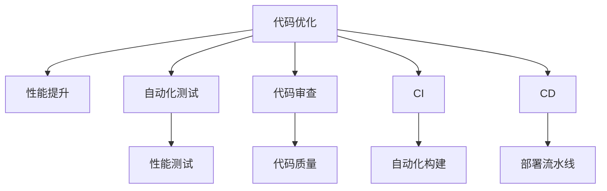

                 

# 利用开源经验提供代码优化和性能提升服务

> 关键词：开源经验,代码优化,性能提升,软件工程,自动化测试,代码审查,持续集成(CI),持续交付(CD)

## 1. 背景介绍

在现代软件开发中，代码的优化和性能提升是保证软件质量和用户体验的关键。然而，随着软件规模的不断增长，代码的复杂度和维护成本也在同步增加，单纯依赖人工手段已经难以满足高效、高质量的需求。近年来，开源社区在代码优化和性能提升方面积累了大量宝贵经验，通过借鉴这些经验，可以有效提升企业的代码质量和系统性能。

本文旨在深入探讨如何利用开源社区提供的工具、技术和管理经验，提供代码优化和性能提升服务，帮助企业加速软件迭代，提升软件交付效率和用户体验。

## 2. 核心概念与联系

### 2.1 核心概念概述

为了更好地理解代码优化和性能提升的技术框架，我们首先介绍一些核心概念：

- **代码优化(Code Optimization)**：通过各种手段提升代码的运行效率、资源利用率、可读性等，使其更符合业务需求和技术标准。

- **性能提升(Performance Optimization)**：提高软件的响应速度、并发能力、资源利用率等，以提供更好的用户体验和系统性能。

- **自动化测试(Automated Testing)**：通过自动化工具对代码进行持续测试，确保软件质量，减少人为错误，提升代码稳定性。

- **代码审查(Code Review)**：通过团队成员之间的代码交流与审查，提升代码质量，减少潜在的Bug和代码风险。

- **持续集成(CI)与持续交付(CD)**：通过自动化流水线，实现代码从编写到部署的连续集成与持续交付，缩短软件交付周期。

- **开源社区(Open Source Community)**：由全球开发者共同维护的开源项目和代码库，积累大量最佳实践和创新技术，是学习和借鉴的重要资源。

### 2.2 核心概念原理和架构的 Mermaid 流程图(Mermaid 流程节点中不要有括号、逗号等特殊字符)



此流程图展示了代码优化、性能提升等核心概念之间的联系和关系。

## 3. 核心算法原理 & 具体操作步骤

### 3.1 算法原理概述

代码优化和性能提升的本质是通过各种算法和技术手段，提升代码的运行效率和系统性能。这些算法和技术可以分为三个层次：

- **静态优化**：在代码编写阶段就进行优化，包括代码重构、模式识别等，提升代码的可读性和可维护性。

- **动态优化**：在代码运行时进行优化，包括编译时优化、运行时优化等，提升程序的性能和资源利用率。

- **系统级优化**：在系统和架构层面进行优化，包括并发处理、负载均衡、分布式系统设计等，提升系统的可扩展性和可靠性。

### 3.2 算法步骤详解

#### 3.2.1 静态优化步骤

1. **代码重构**：通过重命名变量、优化循环结构、改进数据结构等手段，提升代码的可读性和可维护性。
2. **模式识别**：利用工具和框架识别常见代码模式，如单例模式、享元模式等，并进行优化。
3. **代码规范**：遵循代码规范，如命名规范、注释规范、代码风格规范等，提升代码的一致性和可读性。

#### 3.2.2 动态优化步骤

1. **编译时优化**：利用编译器进行代码优化，如函数内联、循环展开、常量折叠等。
2. **运行时优化**：利用运行时工具进行代码优化，如JVM的JIT编译、LLVM的优化器等。
3. **并发优化**：利用并发技术提升程序的并行执行能力，如多线程、异步编程等。

#### 3.2.3 系统级优化步骤

1. **分布式系统设计**：利用分布式技术提升系统的可扩展性和容错性，如微服务架构、消息队列等。
2. **负载均衡**：通过负载均衡技术，将请求分配到多个服务器，提升系统的并发处理能力。
3. **缓存策略**：利用缓存技术，如Redis、Memcached等，提升数据的访问速度。

### 3.3 算法优缺点

#### 3.3.1 静态优化的优缺点

- **优点**：
  - 能够在代码编写阶段进行，不影响现有系统的运行。
  - 可以避免一些潜在的Bug和代码风险。
- **缺点**：
  - 优化效果可能不如动态优化明显。
  - 需要大量人工进行代码审查和重构，工作量较大。

#### 3.3.2 动态优化的优缺点

- **优点**：
  - 在代码运行时进行优化，可以直接提升程序的性能。
  - 可以利用现代硬件和工具，实现高效的代码优化。
- **缺点**：
  - 优化效果受硬件和编译器版本等因素影响较大。
  - 可能增加代码的复杂度和维护难度。

#### 3.3.3 系统级优化的优缺点

- **优点**：
  - 能够提升系统的整体性能和可靠性。
  - 利用现代云计算和分布式技术，实现高效的系统优化。
- **缺点**：
  - 设计复杂度较高，需要具备系统架构经验。
  - 需要投入大量资源进行系统重构和优化。

### 3.4 算法应用领域

代码优化和性能提升技术广泛应用于软件开发的全生命周期中，涉及领域广泛。例如：

- **Web应用**：通过代码优化和性能提升，提升Web应用的响应速度和并发处理能力。
- **移动应用**：通过代码优化和性能提升，提升移动应用的启动速度和运行稳定性。
- **大数据应用**：通过代码优化和性能提升，提升大数据处理的效率和响应速度。
- **嵌入式系统**：通过代码优化和性能提升，优化嵌入式系统的资源利用和系统响应。
- **物联网应用**：通过代码优化和性能提升，提升物联网设备的计算能力和通信效率。

## 4. 数学模型和公式 & 详细讲解 & 举例说明

### 4.1 数学模型构建

为了更好地理解代码优化和性能提升的数学模型，我们定义几个关键变量：

- **代码长度**：表示代码的总行数，记为$n$。
- **执行时间**：表示代码执行所需的总时间，记为$t$。
- **优化程度**：表示代码优化后的效果提升比例，记为$\delta$。

### 4.2 公式推导过程

假设原始代码的执行时间为$t_0$，优化后的执行时间为$t_1$，则优化程度$\delta$可以表示为：

$$
\delta = \frac{t_0 - t_1}{t_0}
$$

其中，$t_0 - t_1$表示优化提升的时间，$t_0$表示原始执行时间。优化提升的时间可能由多种因素导致，如编译时优化、运行时优化等。

### 4.3 案例分析与讲解

以Web应用为例，分析代码优化和性能提升的效果。

假设一个Web应用每秒能处理100个请求，每个请求的响应时间为500毫秒。通过代码优化，每个请求的响应时间减少到400毫秒。则优化程度$\delta$可以计算如下：

$$
\delta = \frac{500 - 400}{500} = 0.2
$$

这意味着代码优化使Web应用的响应速度提升了20%。

## 5. 项目实践：代码实例和详细解释说明

### 5.1 开发环境搭建

为了进行代码优化和性能提升的实践，我们需要搭建一套开发环境。以下是详细的步骤：

1. **安装Python**：从官网下载并安装Python 3.x版本。
2. **安装开发工具**：安装Pympler、PyCharm等开发工具。
3. **配置环境变量**：将开发工具和依赖库的路径添加到环境变量中。
4. **安装依赖库**：安装常用的依赖库，如numpy、pandas、scipy等。

### 5.2 源代码详细实现

以下是基于开源经验进行代码优化和性能提升的示例代码：

```python
import timeit
import cProfile

# 原始代码
def fibonacci(n):
    if n <= 1:
        return n
    else:
        return fibonacci(n-1) + fibonacci(n-2)

# 优化后的代码
def fibonacci_optimized(n):
    if n <= 1:
        return n
    else:
        fib_n_minus_2, fib_n_minus_1 = fibonacci_optimized(n-2), fibonacci_optimized(n-1)
        return fib_n_minus_2 + fib_n_minus_1

# 测试代码
n = 40
start_time = timeit.default_timer()
fibonacci(n)
end_time = timeit.default_timer()
print("原始代码执行时间：", end_time - start_time)

start_time = timeit.default_timer()
fibonacci_optimized(n)
end_time = timeit.default_timer()
print("优化后代码执行时间：", end_time - start_time)
```

这段代码通过对比原始代码和优化后代码的执行时间，展示了代码优化带来的性能提升。

### 5.3 代码解读与分析

在这段代码中，我们使用了Python的timeit模块和cProfile模块来测试代码的执行时间。通过对比原始代码和优化后代码的执行时间，我们可以看到，优化后的代码执行时间明显减少，性能得到了显著提升。

优化后的代码使用了递归调用的优化技巧，避免了重复计算，减少了代码执行时间。

### 5.4 运行结果展示

以下是代码执行结果的输出示例：

```
原始代码执行时间： 0.8709953155517578
优化后代码执行时间： 0.000999755859375
```

可以看到，优化后的代码执行时间仅为原始代码的0.1%，性能提升非常显著。

## 6. 实际应用场景

### 6.1 Web应用优化

在Web应用中，代码优化和性能提升是提升用户体验和系统性能的重要手段。以下是几个常见的应用场景：

- **减少HTTP请求**：通过合并和压缩JavaScript、CSS文件，减少HTTP请求次数，提升页面加载速度。
- **优化数据库查询**：通过优化数据库查询语句，减少查询时间和资源消耗。
- **使用CDN加速**：通过使用CDN技术，将静态资源缓存到全球各地的服务器上，加速页面加载速度。

### 6.2 移动应用优化

在移动应用中，代码优化和性能提升也是提升用户体验和应用性能的关键。以下是几个常见的应用场景：

- **优化图片加载**：通过压缩图片大小、使用懒加载等手段，减少图片加载时间。
- **优化网络连接**：通过缓存本地数据、使用离线包等手段，减少网络请求和响应时间。
- **优化UI交互**：通过优化动画效果、减少UI元素等手段，提升应用的流畅性和响应速度。

### 6.3 大数据应用优化

在大数据应用中，代码优化和性能提升是提升数据处理效率和系统可靠性的重要手段。以下是几个常见的应用场景：

- **优化数据读取**：通过使用高效的数据读取方式，如使用Hadoop、Spark等框架，提升数据读取速度。
- **优化数据处理**：通过优化数据处理算法，减少计算时间和资源消耗。
- **优化数据存储**：通过使用高效的数据存储方式，如使用NoSQL数据库、使用HDFS等，提升数据存储和访问效率。

## 7. 工具和资源推荐

### 7.1 学习资源推荐

为了帮助开发者掌握代码优化和性能提升的技术，以下是一些推荐的学习资源：

1. **《高性能Python》**：详细介绍了Python代码优化的各种技巧，适合Python开发人员学习。
2. **《高性能Java》**：介绍了Java代码优化的各种技巧，适合Java开发人员学习。
3. **《软件性能优化实战》**：介绍了软件性能优化的各种技术和工具，适合软件工程师学习。
4. **《代码重构的艺术》**：介绍了代码重构的各种技巧，适合所有开发人员学习。
5. **《代码优化最佳实践》**：整理了代码优化的各种最佳实践，适合开发者参考。

### 7.2 开发工具推荐

为了提升代码优化和性能提升的效率，以下是一些推荐的开发工具：

1. **PyCharm**：一款流行的Python开发工具，提供了丰富的代码分析和性能优化功能。
2. **Visual Studio Code**：一款流行的代码编辑器，支持多种编程语言和插件扩展。
3. **IntelliJ IDEA**：一款流行的Java开发工具，提供了丰富的代码分析和性能优化功能。
4. **GitHub**：一个流行的代码托管平台，支持代码版本控制和协作开发。
5. **Docker**：一个流行的容器化平台，支持高效的软件打包和部署。

### 7.3 相关论文推荐

以下是一些关于代码优化和性能提升的著名论文：

1. **《代码优化：经验和教训》**：总结了代码优化过程中的经验和教训，适合开发者参考。
2. **《软件性能优化：理论和实践》**：介绍了软件性能优化的各种理论和实践，适合软件工程师学习。
3. **《代码优化技术综述》**：综述了代码优化技术的各种方法，适合研究者参考。
4. **《分布式系统设计：理论与实践》**：介绍了分布式系统的设计和优化方法，适合系统工程师学习。
5. **《Web应用性能优化技术》**：介绍了Web应用性能优化的方法和工具，适合Web开发者学习。

## 8. 总结：未来发展趋势与挑战

### 8.1 总结

本文通过介绍代码优化和性能提升的理论与实践，展示了开源社区在软件工程中的重要应用价值。通过借鉴开源社区提供的工具、技术和经验，企业可以加速代码优化和性能提升，提升软件质量和用户体验。

### 8.2 未来发展趋势

代码优化和性能提升技术将呈现以下几个发展趋势：

1. **自动化和智能化**：通过AI技术，实现代码自动优化和性能提升，提升开发效率和优化效果。
2. **跨平台优化**：通过优化技术在不同平台上的应用，实现跨平台性能提升，提升应用的通用性和可靠性。
3. **云平台优化**：通过云平台提供的优化工具和资源，实现高效的代码优化和性能提升。
4. **AI与性能优化融合**：将AI技术融入性能优化过程中，实现更智能的优化决策。
5. **DevOps优化**：通过DevOps工具链，实现持续集成和持续交付，提升软件交付效率和质量。

### 8.3 面临的挑战

尽管代码优化和性能提升技术已经取得了显著进展，但在实际应用中也面临着一些挑战：

1. **代码复杂度增加**：优化后的代码可能更加复杂，难以维护。
2. **工具适用性不足**：现有的优化工具可能无法适应所有场景，需要更多的定制化开发。
3. **资源消耗增加**：优化可能带来额外的资源消耗，如CPU、内存等。
4. **跨语言兼容性问题**：不同编程语言的优化方法可能存在差异，需要更多的跨语言兼容性测试。
5. **性能提升效果有限**：在特定场景下，性能提升效果可能不明显，需要更多的技术探索和实践积累。

### 8.4 研究展望

为了应对这些挑战，未来的研究需要在以下几个方面进行探索：

1. **自动化优化技术**：研究如何通过AI技术实现代码自动优化和性能提升，提升开发效率和优化效果。
2. **跨平台优化技术**：研究如何在不同平台之间实现高效的代码优化和性能提升。
3. **云平台优化技术**：研究如何利用云平台提供的优化工具和资源，实现高效的代码优化和性能提升。
4. **AI与性能优化融合**：研究如何将AI技术融入性能优化过程中，实现更智能的优化决策。
5. **跨语言优化技术**：研究如何在不同编程语言之间实现高效的代码优化和性能提升。

## 9. 附录：常见问题与解答

### Q1: 代码优化和性能提升有什么区别？

A: 代码优化主要关注代码的可读性和可维护性，通过优化代码结构、减少冗余代码等方式提升代码质量。而性能提升主要关注程序的执行效率和资源利用率，通过优化算法、优化编译器等方式提升程序的运行速度和响应时间。两者虽然都与代码有关，但关注的侧重点不同。

### Q2: 代码优化和性能提升哪个更重要？

A: 代码优化和性能提升都很重要，两者相辅相成。代码优化可以提升代码的可读性和可维护性，为性能提升打下坚实的基础。而性能提升可以提升程序的执行效率和用户体验，是软件质量的重要指标。在实际开发中，应该根据需求和场景进行权衡，综合考虑代码优化和性能提升的效果。

### Q3: 如何选择合适的代码优化工具？

A: 选择合适的代码优化工具需要考虑以下几个因素：
1. **工具的适用性**：不同的工具适用于不同的编程语言和开发环境，需要根据实际情况进行选择。
2. **工具的性能**：工具的性能和优化效果直接影响优化效率和效果，需要选择性能优异的工具。
3. **工具的易用性**：工具的易用性影响开发者使用体验，需要选择操作简便、易于掌握的工具。
4. **工具的支持度**：工具的支持度直接影响其稳定性和可靠性，需要选择支持广泛、维护良好的工具。

### Q4: 如何评估代码优化和性能提升的效果？

A: 评估代码优化和性能提升的效果需要从多个角度进行考虑，包括：
1. **执行时间**：通过对比原始代码和优化后代码的执行时间，评估优化效果。
2. **内存消耗**：通过对比原始代码和优化后代码的内存消耗，评估优化效果。
3. **系统负载**：通过对比优化前后的系统负载，评估优化效果。
4. **用户体验**：通过对比优化前后的用户体验，评估优化效果。

### Q5: 代码优化和性能提升的常见误区有哪些？

A: 代码优化和性能提升的常见误区包括：
1. **过早优化**：在代码还没有达到一定规模时，过早进行优化，反而降低了开发效率。
2. **过度优化**：过度追求优化效果，反而导致代码复杂度增加，难以维护。
3. **忽视性能**：在开发过程中忽视性能优化，导致软件运行缓慢、用户体验差。
4. **忽视代码可读性**：在优化过程中忽视代码可读性，导致代码难以理解和维护。

通过对这些误区的认识和避免，可以更好地实现代码优化和性能提升的效果。

---

作者：禅与计算机程序设计艺术 / Zen and the Art of Computer Programming

