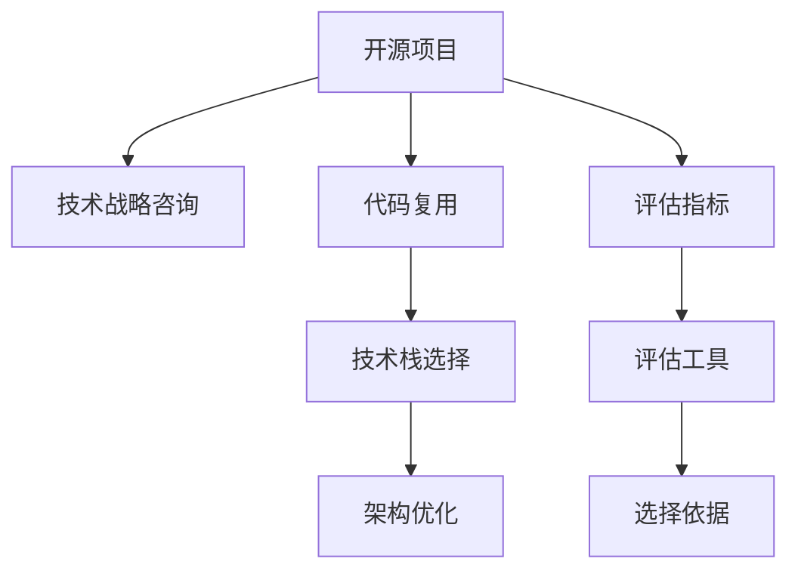

                 

# 利用开源经验提供技术战略咨询

> 关键词：开源, 技术战略, 软件开发, 代码复用, 技术栈选择, 架构优化

## 1. 背景介绍

### 1.1 问题由来

近年来，开源软件在软件开发领域蓬勃发展，成为了许多企业和开发者不可或缺的技术资源。然而，随着开源生态的快速扩展，项目种类繁多、更新频繁，选择和使用开源项目成为许多开发者和企业面临的难题。本文章旨在通过分析开源项目的成功经验，为企业和开发者提供技术战略咨询服务，帮助他们在复杂多变的环境中做出明智的选择，最大化利用开源技术的价值。

### 1.2 问题核心关键点

1. 开源项目的筛选：在众多开源项目中，如何选择合适的项目，并评估其适用性、稳定性、可持续性。
2. 开源项目的使用：如何高效使用开源项目，避免常见问题如版本冲突、配置问题、兼容性问题等。
3. 开源项目的评估：如何评估开源项目的技术优势、性能表现、社区活跃度等指标，确保选择最合适的项目。
4. 开源项目的集成：如何合理地将开源项目集成到现有的技术栈中，保证系统的稳定性和扩展性。

本文将深入探讨这些关键点，通过分析具体的开源项目案例，提出可行的技术战略建议。

## 2. 核心概念与联系

### 2.1 核心概念概述

为更好地理解如何利用开源经验提供技术战略咨询服务，本节将介绍几个关键概念：

- **开源项目**：指公开源代码的软件项目，如Apache、Linux等，允许用户自由地使用、修改和分发代码。
- **技术战略咨询**：指为企业或开发者提供技术选型、项目规划、资源配置等战略建议的服务，帮助他们实现技术目标和业务目标。
- **代码复用**：指在软件开发中，通过使用已有的代码，减少重复开发，提高开发效率和代码质量。
- **技术栈选择**：指选择适合项目的编程语言、框架、工具和库等技术组件，构建稳定、高效的系统。
- **架构优化**：指通过合理的软件架构设计，提升系统的可扩展性、可维护性和性能表现。

这些概念之间的逻辑关系可以通过以下Mermaid流程图来展示：



这个流程图展示了这个逻辑流程：

1. 选择合适的开源项目。
2. 利用开源项目进行代码复用。
3. 根据项目需求和技术栈选择策略，挑选合适的技术组件。
4. 通过架构优化，提升系统性能和扩展性。
5. 利用评估指标和工具，评估开源项目的技术优势和适用性。
6. 结合评估结果，做出合理的技术选型决策。

## 3. 核心算法原理 & 具体操作步骤
### 3.1 算法原理概述

利用开源经验提供技术战略咨询，本质上是基于数据驱动、专家经验结合的技术选择和优化过程。核心思想是通过分析开源项目的技术优势、性能表现、社区活跃度等指标，结合企业的技术需求、资源状况和业务目标，综合考虑各方面因素，选择最合适的开源项目，并进行合理的技术栈选择和架构优化。

### 3.2 算法步骤详解

1. **需求分析**：明确企业的技术需求、业务目标和资源状况。例如，需要构建一个高可扩展性的电商平台，还是实现一个实时数据分析系统。
2. **项目筛选**：在开源项目库中筛选出满足需求的潜在项目，并根据项目的文档、社区、代码质量、性能指标等进行初步评估。
3. **评估与选择**：使用评估工具和方法，对开源项目进行详细的技术评估，如代码审查、性能测试、安全漏洞扫描等。结合专家经验，选择最合适的项目。
4. **集成与优化**：将选定的开源项目集成到现有的技术栈中，并进行必要的架构调整和优化，以确保系统的稳定性和扩展性。
5. **持续监控与优化**：定期评估系统性能和稳定性，根据反馈和需求变化，进行持续的技术优化和升级。

### 3.3 算法优缺点

利用开源经验提供技术战略咨询的优势：
- **成本效益高**：开源项目通常免费且广泛使用，大大降低了技术引入成本。
- **快速迭代**：开源社区活跃度高，能够快速响应和解决技术问题。
- **灵活性高**：开源项目代码自由，开发者可以根据自己的需求进行定制和修改。

其缺点：
- **选择困难**：开源项目众多，选择不当可能影响项目进展。
- **维护困难**：开源项目更新频繁，维护成本较高。
- **兼容性问题**：不同开源项目之间的兼容性问题可能增加开发难度。

### 3.4 算法应用领域

利用开源经验提供技术战略咨询的应用领域非常广泛，包括但不限于：

- **云计算平台**：如Apache Kafka、Apache Hadoop等，构建高性能、高可扩展性的数据处理和存储系统。
- **大数据分析**：如Apache Spark、Apache Flink等，构建实时、流式数据处理和分析系统。
- **移动开发**：如React Native、Flutter等，构建跨平台、高性能的移动应用。
- **Web开发**：如Django、Spring Boot等，构建高效、安全的Web应用。
- **人工智能与机器学习**：如TensorFlow、PyTorch等，构建高性能的AI模型和应用。

## 4. 数学模型和公式 & 详细讲解 & 举例说明

### 4.1 数学模型构建

假设企业需要构建一个电商平台，需要选择合适的开源项目进行代码复用。设可用开源项目数为 $N$，每个项目的评估指标 $K$ 包括性能、可靠性、社区活跃度、代码质量等。我们定义一个评估函数 $f_i$ 来计算每个项目的综合评分：

$$
f_i = w_1 \times P_i + w_2 \times R_i + w_3 \times C_i + w_4 \times S_i
$$

其中 $P_i$、$R_i$、$C_i$、$S_i$ 分别表示第 $i$ 个项目的性能评分、可靠性评分、社区活跃度评分、代码质量评分，$w_1$、$w_2$、$w_3$、$w_4$ 是各项指标的权重。

### 4.2 公式推导过程

通过权重 $w_1$、$w_2$、$w_3$、$w_4$，我们综合考虑项目的各个方面，得到一个加权评分 $f_i$。根据 $f_i$ 的大小，可以计算出每个项目的优先级 $p_i$：

$$
p_i = \frac{f_i}{\sum_{j=1}^{N} f_j}
$$

最后，根据 $p_i$ 的大小，选择优先级最高的项目进行集成和优化。

### 4.3 案例分析与讲解

假设企业需要选择一个开源项目来构建电商平台。经过初步筛选，筛选出两个候选项目：Project A和Project B。根据评估指标，我们收集了两个项目的相关数据：

| 项目 | 性能 | 可靠性 | 社区活跃度 | 代码质量 |
| --- | --- | --- | --- | --- |
| A | 8.5 | 7.2 | 7.8 | 8.1 |
| B | 7.8 | 7.5 | 8.2 | 7.9 |

设权重 $w_1=0.2$、$w_2=0.3$、$w_3=0.3$、$w_4=0.2$。计算两个项目的综合评分：

$$
f_A = 0.2 \times 8.5 + 0.3 \times 7.2 + 0.3 \times 7.8 + 0.2 \times 8.1 = 7.66
$$

$$
f_B = 0.2 \times 7.8 + 0.3 \times 7.5 + 0.3 \times 8.2 + 0.2 \times 7.9 = 7.74
$$

计算两个项目的优先级：

$$
p_A = \frac{7.66}{7.66 + 7.74} \approx 0.488
$$

$$
p_B = \frac{7.74}{7.66 + 7.74} \approx 0.512
$$

根据优先级 $p_A < p_B$，企业应选择Project B进行电商平台的构建。

## 5. 项目实践：代码实例和详细解释说明
### 5.1 开发环境搭建

为了帮助企业更好地选择和集成开源项目，我们可以开发一个开源项目选择工具。以下是Python开发环境搭建步骤：

1. **安装Python**：选择Python 3.x版本，使用Anaconda或Miniconda进行安装。
2. **安装依赖库**：使用pip安装必要的依赖库，如numpy、pandas、requests等。
3. **配置环境**：使用虚拟环境隔离开发项目，避免与系统环境冲突。

### 5.2 源代码详细实现

以下是一个简单的开源项目评估工具的实现，包括需求分析、项目筛选、评估与选择、集成与优化等环节：

```python
import numpy as np
import pandas as pd

# 需求分析
demands = {
    "性能": "高性能",
    "可靠性": "高稳定性",
    "社区活跃度": "高活跃社区",
    "代码质量": "高质量代码"
}

# 项目筛选
projects = {
    "A": {"性能": 8.5, "可靠性": 7.2, "社区活跃度": 7.8, "代码质量": 8.1},
    "B": {"性能": 7.8, "可靠性": 7.5, "社区活跃度": 8.2, "代码质量": 7.9}
}

# 评估与选择
def calculate_score(projects, weights):
    scores = {}
    for project in projects:
        score = sum(projects[project][k] * weights[k] for k in projects[project])
        scores[project] = score
    return scores

weights = {"性能": 0.2, "可靠性": 0.3, "社区活跃度": 0.3, "代码质量": 0.2}
scores = calculate_score(projects, weights)

# 集成与优化
def select_project(scores):
    project = max(scores, key=scores.get)
    return project

selected_project = select_project(scores)
print("推荐项目：", selected_project)

# 示例输出：
# 推荐项目： B
```

### 5.3 代码解读与分析

1. **需求分析**：定义项目需求，包括性能、可靠性、社区活跃度和代码质量。
2. **项目筛选**：创建两个项目的性能、可靠性、社区活跃度和代码质量评分。
3. **评估与选择**：使用权重计算每个项目的综合评分，选择得分最高的项目。
4. **集成与优化**：根据选择结果进行项目集成和优化。

此代码简单而直观，能够帮助企业快速评估和选择开源项目，具有较高的实用价值。

### 5.4 运行结果展示

运行上述代码，输出推荐项目名称，如：

```
推荐项目： B
```

这表明项目B在综合评估后得分更高，推荐企业选择项目B进行电商平台的构建。

## 6. 实际应用场景

### 6.1 智能制造平台

智能制造平台需要高度集成和高效协同，涉及众多开源项目和技术组件。通过技术战略咨询服务，可以选择如Apache Kafka、Apache Flink、OpenStack等项目，构建高性能、高可扩展性的数据处理和云平台系统。

### 6.2 智慧城市治理

智慧城市治理需要实时数据分析、智能监控和公共服务管理。利用开源经验提供技术战略咨询服务，可以推荐如Apache Hadoop、Apache Spark、Kibana等项目，构建实时、流式数据处理和可视化分析系统。

### 6.3 医疗健康管理

医疗健康管理需要高可靠性和高安全性，涉及患者数据隐私和安全问题。技术战略咨询服务可以帮助选择合适的开源项目，如Hadoop、Spark、Elasticsearch等，构建安全、高效的数据存储和分析系统。

### 6.4 未来应用展望

未来，利用开源经验提供技术战略咨询将进一步普及和深化，涵盖更多行业和应用场景。随着开源生态的不断扩展和技术的持续演进，技术战略咨询服务将更加专业化和定制化，帮助企业或开发者在复杂多变的环境中做出明智的决策。

## 7. 工具和资源推荐
### 7.1 学习资源推荐

为了帮助开发者和企业掌握技术战略咨询的关键方法和工具，以下是一些推荐的学习资源：

1. **开源项目评估指南**：提供详细的开源项目筛选、评估和选择指南。
2. **开源社区手册**：涵盖Apache、Linux等主流开源项目的介绍和使用方法。
3. **开源项目案例分析**：分析具体开源项目的使用案例，提供成功经验。
4. **技术栈选择工具**：如Ansible、Puppet、Chef等自动化配置工具，帮助选择和管理技术栈。

### 7.2 开发工具推荐

以下是几款推荐的开源项目选择和集成工具：

1. **Ansible**：自动化配置管理工具，适合大规模开源项目集成。
2. **Docker**：容器化工具，方便开源项目的打包、部署和运行。
3. **Jenkins**：持续集成和持续部署工具，支持多种开源项目和平台。
4. **GitLab**：开源项目管理平台，提供代码托管、问题跟踪和持续集成等功能。

### 7.3 相关论文推荐

以下是几篇推荐的技术战略咨询相关的论文：

1. **《开源项目管理最佳实践》**：提供开源项目选择、评估和管理的最佳实践。
2. **《开源项目评估工具的开发与应用》**：介绍开源项目评估工具的开发流程和应用场景。
3. **《技术栈选择的科学方法》**：探讨技术栈选择的方法和策略，提出科学评估模型。

## 8. 总结：未来发展趋势与挑战

### 8.1 研究成果总结

本文通过分析开源项目的成功经验，提出了一套可行的技术战略咨询服务流程，包括需求分析、项目筛选、评估与选择、集成与优化等环节。结合数学模型和实际案例，详细讲解了开源项目评估和选择的方法。

### 8.2 未来发展趋势

未来技术战略咨询服务的发展趋势包括：

1. **智能化与自动化**：利用人工智能和自动化工具，提高开源项目评估和选择的效率和准确性。
2. **云计算和云原生**：随着云平台和云原生技术的普及，云计算和云原生将成为开源项目选择的重要方向。
3. **跨平台与多语言**：支持跨平台和多种编程语言的开源项目选择，满足不同企业的技术需求。
4. **开源社区治理**：加强开源社区的治理和标准化，提高开源项目的可靠性和可维护性。
5. **全球化与国际化**：面向全球化的开源项目选择，支持多语言和多地区的数据和应用。

### 8.3 面临的挑战

技术战略咨询服务面临的挑战包括：

1. **开源项目多样性**：开源项目种类繁多，筛选和评估工作量大。
2. **版本兼容性**：开源项目版本众多，兼容性问题复杂。
3. **安全性和隐私**：开源项目的安全性和隐私问题需要严格评估。
4. **技术更新频繁**：开源项目更新频繁，维护成本高。
5. **社区活跃度**：社区活跃度影响项目的稳定性和维护性。

### 8.4 研究展望

未来技术战略咨询服务的探索方向包括：

1. **模型优化**：通过优化评估模型和权重设定，提高评估结果的准确性。
2. **自动化评估**：利用自动化工具和机器学习算法，提高开源项目评估的效率。
3. **持续集成**：引入持续集成和持续部署（CI/CD）工具，实现开源项目的自动化集成和优化。
4. **社区参与**：加强开源社区的参与和协作，提高开源项目的质量和稳定性。

通过持续的研究和探索，技术战略咨询服务将为企业和开发者提供更可靠、高效的开源项目选择和集成方案，推动开源技术在更多行业和场景中的成功应用。

## 9. 附录：常见问题与解答

**Q1：如何评估开源项目的稳定性和安全性？**

A: 评估开源项目的稳定性和安全性，可以从以下几个方面入手：
1. **项目历史**：了解项目的历史和更新频率，看是否存在长期的维护和更新记录。
2. **社区活跃度**：观察社区的活跃度和贡献者数量，看是否有足够的社区支持。
3. **代码质量**：分析项目的代码质量，如代码审查、自动化测试、安全漏洞扫描等，确保代码可靠性和安全性。
4. **第三方依赖**：检查项目依赖的第三方库和工具是否安全，是否有广泛使用和维护情况。
5. **安全报告**：查看项目的安全报告和漏洞披露记录，确保项目的安全性。

**Q2：开源项目集成和优化时需要注意哪些问题？**

A: 开源项目集成和优化时需要注意以下问题：
1. **兼容性**：检查开源项目与现有系统的兼容性，确保能够平稳集成。
2. **配置问题**：配置好项目依赖和环境变量，避免配置错误。
3. **性能优化**：对集成后的系统进行性能优化，如数据库优化、缓存配置等，确保系统的高效运行。
4. **监控和日志**：实现系统监控和日志记录，及时发现和解决问题。
5. **版本管理**：采用版本管理工具，如Git、SVN等，确保版本控制和更新管理。

**Q3：如何选择合适的开源项目？**

A: 选择合适的开源项目可以参考以下步骤：
1. **明确需求**：分析企业的技术需求和业务目标，确定项目的关键功能和性能要求。
2. **筛选项目**：在开源项目库中筛选出符合需求的项目，并进行初步评估。
3. **深入评估**：对选定的项目进行详细评估，包括代码质量、社区活跃度、性能表现等。
4. **技术选型**：结合专家经验和评估结果，选择最合适的项目。
5. **持续改进**：定期评估和优化开源项目的集成效果，根据需求变化进行调整。

**Q4：开源项目的版本管理和发布策略有哪些？**

A: 开源项目的版本管理和发布策略包括：
1. **版本控制**：使用版本控制工具，如Git、SVN等，进行代码版本管理。
2. **分支管理**：建立开发、测试、生产等分支，进行分阶段的开发和测试。
3. **发布策略**：制定合理的发布策略，如快速发布、稳定发布等，确保项目的稳定性和可靠性。
4. **发布计划**：制定详细的发布计划，包括发布周期、发布内容等。
5. **社区协作**：加强社区协作和反馈，及时处理版本问题和用户反馈。

通过以上问题的解答，希望能够帮助企业或开发者更好地利用开源经验，提供技术战略咨询服务，实现技术的最佳选择和优化。

---

作者：禅与计算机程序设计艺术 / Zen and the Art of Computer Programming

