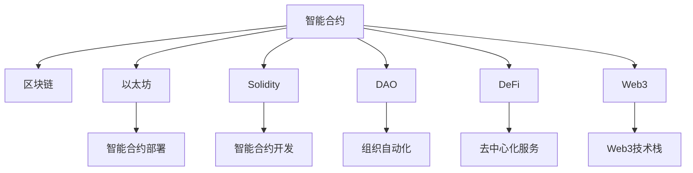

                 

# 利用技术优势进行智能合约开发

> 关键词：智能合约,区块链,以太坊,Solidity,DAO,DeFi,Web3

## 1. 背景介绍

### 1.1 问题由来

近年来，随着区块链技术的兴起，智能合约作为去中心化应用(DApps)的基础设施，开始广泛应用于金融、供应链、医疗等多个领域。智能合约通过区块链的不可篡改性和可编程性，可以实现无需信任的自动化执行，具有广泛的应用前景。

然而，智能合约的开发难度较高，需要开发者具备深厚的密码学、分布式系统等知识。同时，智能合约运行在去中心化的区块链上，部署、调试和维护都具有挑战性。如何利用技术优势，降低智能合约开发的门槛，提升智能合约的开发效率和安全性，是当前智能合约开发领域需要解决的关键问题。

### 1.2 问题核心关键点

智能合约开发的核心在于如何利用区块链的技术优势，实现安全、高效的自动化执行。具体而言，需要解决以下几个关键点：

1. 选择合适的区块链平台。不同的区块链平台有不同的特性，开发智能合约时需要根据具体需求选择合适的平台。
2. 设计安全的合约结构。智能合约的设计需要充分考虑安全性和可扩展性，防止漏洞和安全风险。
3. 实现高效的合约功能。智能合约的功能开发需要利用区块链的特性，实现高效的自动化执行。
4. 自动化测试和调试。智能合约的开发和维护需要依赖自动化测试和调试工具，提升开发效率。
5. 治理机制的设计。智能合约需要设计合理的治理机制，确保合同的执行和变更具有可操作性。

本文将围绕智能合约开发的核心问题，深入探讨如何利用区块链的技术优势，实现高效、安全的智能合约开发。

## 2. 核心概念与联系

### 2.1 核心概念概述

为了更好地理解智能合约开发的方法，本节将介绍几个密切相关的核心概念：

- 智能合约：区块链上可执行的代码，具有自动执行、透明、不可篡改等特性，常用于自动化交易、自动化治理等场景。
- 区块链：去中心化的分布式账本技术，通过共识机制保证数据的可信性，具有不可篡改、可追溯等特性。
- 以太坊：当前主流的区块链平台，支持智能合约的开发和部署。
- Solidity：以太坊上最常用的智能合约编程语言，具备丰富的功能库和开发工具。
- DAO：去中心化自治组织，通过智能合约实现组织内部的自动化决策和执行。
- DeFi：去中心化金融，利用智能合约实现去中心化的金融服务，如借贷、交易、保险等。
- Web3：基于区块链技术的互联网，强调数据的透明性和用户的主权。

这些核心概念之间的逻辑关系可以通过以下Mermaid流程图来展示：



这个流程图展示了一个智能合约从设计、开发到部署的完整过程，以及与各类区块链相关概念的联系。

## 3. 核心算法原理 & 具体操作步骤
### 3.1 算法原理概述

智能合约的开发和部署基于区块链的特性，利用编程语言实现自动化执行的代码。其核心原理包括：

1. 利用区块链的不可篡改性，实现数据的透明和可信。
2. 利用编程语言实现复杂的逻辑和自动化执行。
3. 利用区块链的共识机制，确保合约的执行具有去中心化的特性。

智能合约的开发通常分为以下几个步骤：

1. 确定合约目标。明确智能合约需要实现的具体功能。
2. 设计合约结构。确定合约的模块、函数、变量等。
3. 实现合约功能。根据需求编写具体的智能合约代码。
4. 部署和测试。将智能合约部署到区块链上，并进行自动化测试和调试。
5. 治理和维护。根据实际需求，设计智能合约的治理机制，进行合同的执行和变更。

### 3.2 算法步骤详解

智能合约的开发步骤通常如下：

**Step 1: 确定合约目标**
- 确定智能合约需要实现的具体功能，如自动化交易、自动化投票等。
- 分析合约的功能需求，划分为多个子模块，确定各模块的功能目标。

**Step 2: 设计合约结构**
- 根据功能需求，设计合约的模块、函数、变量等。
- 确定各模块之间的接口和交互方式，保证合约的可扩展性。
- 利用区块链的特性，设计数据存储和访问方式，确保数据的安全性和隐私性。

**Step 3: 实现合约功能**
- 选择合适的区块链平台和编程语言。例如，以太坊上常用的编程语言为Solidity。
- 根据合约结构和功能需求，编写智能合约代码。例如：

```solidity
contract MyContract {
    address public owner;
    uint256 public balance;

    function MyContract() public {
        owner = msg.sender;
        balance = 0;
    }

    function transfer(address _to, uint256 _value) public returns (bool success) {
        require(msg.sender == owner);
        require(_value > 0);
        balance -= _value;
        balanceOf(_to).add(_value);
        return true;
    }

    function balanceOf(address _user) public view returns (uint256 balance) {
        return balances[_user];
    }
}
```

**Step 4: 部署和测试**
- 将智能合约编译成可部署的ABI字节码，并部署到区块链上。例如，在以太坊上使用`deployContract`函数。
- 使用自动化测试工具进行合约的测试。例如，使用Truffle框架，编写测试用例。
- 对测试结果进行分析和调试，确保合约的正确性和安全性。

**Step 5: 治理和维护**
- 设计合理的治理机制，确保合约的执行和变更具有可操作性。例如，利用投票机制确定合约的修改方案。
- 根据实际需求，设计合约的权限控制和访问方式，确保合约的安全性和隐私性。
- 定期对合约进行审计和维护，修复潜在的安全漏洞和性能问题。

### 3.3 算法优缺点

智能合约开发利用区块链的技术优势，具备以下优点：

1. 去中心化：智能合约的执行依赖区块链，无需中心化的机构，提高了系统的可靠性和可信任度。
2. 不可篡改：智能合约的代码和数据存储在区块链上，具有不可篡改的特性，保证了数据的透明和可信。
3. 自动化执行：智能合约通过编程语言实现自动化执行，降低了手工操作的风险和成本。
4. 可扩展性：智能合约可以通过模块化设计，实现复杂的功能和可扩展性。
5. 跨平台性：智能合约可以跨区块链平台迁移和部署，具备跨链互操作性。

同时，智能合约开发也存在一些局限性：

1. 复杂性高：智能合约的开发难度较高，需要深厚的密码学和区块链知识。
2. 安全性风险：智能合约的漏洞和安全风险较高，一旦出现漏洞可能导致严重的后果。
3. 可维护性差：智能合约一旦部署到区块链上，修改和维护的难度较大。
4. 计算资源消耗高：智能合约的执行和调用可能消耗大量的计算资源，影响区块链的性能。
5. 法律风险：智能合约的法律地位尚未完全明确，存在一定的法律风险。

尽管存在这些局限性，但区块链的特性使得智能合约具备了广泛的应用前景，尤其在金融、供应链、公共服务等领域，利用智能合约可以实现更高的效率和透明度。

### 3.4 算法应用领域

智能合约的开发技术在多个领域得到了广泛应用，例如：

- 金融领域：利用智能合约实现自动化的交易、借贷、保险等金融服务。
- 供应链管理：利用智能合约实现供应链的溯源、交易、结算等环节的自动化。
- 公共服务：利用智能合约实现公共服务的自动化管理，如投票、投票、招标等。
- 版权保护：利用智能合约实现版权的登记、授权、监控等环节的自动化。
- 能源管理：利用智能合约实现能源的自动交易、结算和管理。

除了上述这些经典应用外，智能合约还被创新性地应用到更多场景中，如数字身份验证、去中心化投票系统、去中心化市场等，为多个行业带来了新的发展机遇。

## 4. 数学模型和公式 & 详细讲解 & 举例说明
### 4.1 数学模型构建

本节将使用数学语言对智能合约开发的过程进行更加严格的刻画。

假设智能合约的目标是实现自动化交易，其数学模型可以表示为：

1. 输入变量：交易双方账号、交易金额、交易类型等。
2. 输出变量：交易结果、交易记录等。
3. 输入变量和输出变量之间的关系：根据交易类型，执行相应的交易逻辑，计算交易结果，更新交易记录。

数学模型可以表示为：

$$
Y = f(X; \theta)
$$

其中 $Y$ 表示输出变量，$X$ 表示输入变量，$f(\cdot)$ 表示函数映射关系，$\theta$ 表示模型的参数。

### 4.2 公式推导过程

以一个简单的自动化转账为例，其数学模型可以表示为：

$$
Y = f(X; \theta) = \left\{
\begin{array}{ll}
0, & \text{转账失败} \\
1, & \text{转账成功}
\end{array}
\right.
$$

其中 $X$ 包括转账方账号、转账金额、接收方账号等，$f(\cdot)$ 表示是否成功的判断函数，$\theta$ 表示函数的参数。

假设智能合约的代码如下：

```solidity
contract Transfer {
    function transfer(address _from, address _to, uint256 _value) public returns (bool success) {
        require(_from.balance >= _value);
        require(toCheck(_to));
        _from.balance -= _value;
        _to.balance.add(_value);
        return true;
    }
}
```

其中 `toCheck` 函数用于检查接收方账号是否有效。

### 4.3 案例分析与讲解

假设智能合约的参数 $\theta$ 已经通过预训练确定，智能合约的输入变量 $X$ 为 `(0x1234567890, 100, 0x9876543210)`，即转账方账号为 `0x1234567890`，转账金额为 `100`，接收方账号为 `0x9876543210`。

根据智能合约的代码和输入变量，输出变量 $Y$ 为 `true`，表示转账成功。

## 5. 项目实践：代码实例和详细解释说明
### 5.1 开发环境搭建

在进行智能合约开发前，我们需要准备好开发环境。以下是使用Solidity进行以太坊智能合约开发的环境配置流程：

1. 安装Node.js：从官网下载并安装Node.js，用于安装和配置Truffle框架。
2. 安装Truffle框架：使用npm安装Truffle，并配置项目目录。
3. 安装以太坊钱包：使用MetaMask或其他以太坊钱包进行测试网或主网的连接。
4. 编写智能合约：使用Solidity编写智能合约代码，并使用Truffle编译生成字节码。
5. 部署智能合约：使用Truffle在测试网或主网部署智能合约。
6. 测试和调试：使用Truffle进行自动化测试，使用REMIX等工具进行调试。

### 5.2 源代码详细实现

下面我以一个简单的自动化转账为例，给出使用Solidity进行以太坊智能合约开发的完整代码实现。

首先，定义智能合约的基本结构：

```solidity
pragma solidity ^0.8.0;

contract Transfer {
    address owner;

    constructor() {
        owner = msg.sender;
    }

    function transfer(address _to, uint256 _value) public returns (bool success) {
        require(_from.balance >= _value);
        require(toCheck(_to));
        _from.balance -= _value;
        _to.balance.add(_value);
        return true;
    }

    function balanceOf(address _user) public view returns (uint256 balance) {
        return balances[_user];
    }

    function toCheck(address _user) private view returns (bool success) {
        // 检查用户是否存在
        if (balances[_user] == 0) {
            return false;
        }
        // 检查用户是否有足够的余额
        if (_from.balance < _value) {
            return false;
        }
        return true;
    }

    mapping(address => uint256) balances;
}
```

在构造函数中，将合约的创建者作为所有者。

`transfer` 函数用于执行转账操作，需要检查转账方余额和接收方账号的有效性。

`balanceOf` 函数用于获取指定账号的余额。

`toCheck` 函数用于检查转账的合法性，包括检查账号是否存在和余额是否充足。

然后，进行合约的自动化测试：

```solidity
pragma solidity ^0.8.0;

contract TestTransfer {
    address public transfer;

    constructor(address _transfer) {
        transfer = _transfer;
    }

    function runTest(address _from, address _to, uint256 _value) public {
        transfer.transfer(_from, _to, _value);
        require(_from.balance == 0);
        require(_to.balance == _value);
    }
}
```

在 `runTest` 函数中，模拟转账操作，并检查转账前后的余额是否符合预期。

最后，进行合约的部署和调试：

1. 在测试网中，使用 Truffle 的 `truffle develop` 命令启动本地测试网。
2. 编写测试用例，使用 Truffle 的 `truffle test` 命令运行测试用例。
3. 使用 MetaMask 或其他以太坊钱包，在测试网中部署智能合约。
4. 使用 Truffle 的 `truffle migrate` 命令将合约部署到主网。
5. 在主网中，使用 MetaMask 或其他以太坊钱包调用合约的函数进行测试。

### 5.3 代码解读与分析

让我们再详细解读一下关键代码的实现细节：

**Transfer合约**：
- `owner` 变量用于记录合约的创建者。
- `transfer` 函数用于执行转账操作，检查转账方余额和接收方账号的有效性，并更新余额。
- `balanceOf` 函数用于获取指定账号的余额。
- `toCheck` 函数用于检查转账的合法性，包括检查账号是否存在和余额是否充足。

**TestTransfer合约**：
- `transfer` 变量用于记录待测试的智能合约地址。
- `runTest` 函数用于模拟转账操作，并检查转账前后的余额是否符合预期。

通过以上代码实现，可以看出智能合约的开发需要考虑安全性、可扩展性和可维护性，同时利用区块链的特性，实现自动化执行和透明性。

## 6. 实际应用场景
### 6.1 智能合约在金融领域的应用

在金融领域，智能合约可以用于自动化交易、借贷、保险等多种场景，提升金融服务的效率和透明度。

**自动化交易**：智能合约可以实现自动化的交易执行，无需人工干预。例如，在股票交易中，利用智能合约自动执行买入或卖出操作，减少交易成本，提升交易速度。

**自动化借贷**：智能合约可以实现自动化的借贷操作，根据借贷规则自动执行还款和利息计算。例如，在P2P借贷中，利用智能合约自动计算还款金额和利息，减少人工干预的风险。

**自动化保险**：智能合约可以实现自动化的保险理赔操作，根据保险条款自动计算理赔金额。例如，在汽车保险中，利用智能合约自动检测车辆事故，并根据保险条款计算理赔金额。

### 6.2 智能合约在供应链领域的应用

在供应链领域，智能合约可以用于自动化交易、溯源、结算等多种场景，提升供应链的效率和透明度。

**自动化交易**：智能合约可以实现自动化的供应链交易操作，无需人工干预。例如，在供应链管理中，利用智能合约自动执行订单执行、货物配送等操作。

**供应链溯源**：智能合约可以实现供应链的溯源操作，确保货物的来源和流向透明可追溯。例如，在食品供应链中，利用智能合约记录食品的生产、加工、运输等环节，确保食品安全。

**供应链结算**：智能合约可以实现供应链的自动结算操作，确保结算过程透明公正。例如，在零售供应链中，利用智能合约自动结算货款和物流费用，提升供应链的效率。

### 6.3 智能合约在公共服务领域的应用

在公共服务领域，智能合约可以用于自动化投票、招标、合同执行等多种场景，提升公共服务的效率和透明度。

**自动化投票**：智能合约可以实现自动化的投票操作，确保投票过程透明公正。例如，在社区选举中，利用智能合约自动统计选票，确保选举过程透明可追溯。

**招标管理**：智能合约可以实现自动化的招标管理，确保招标过程透明公正。例如，在政府招标中，利用智能合约自动发布招标信息、收集投标信息、评标打分等操作。

**合同执行**：智能合约可以实现合同的自动执行，确保合同的执行过程透明公正。例如，在房地产合同中，利用智能合约自动记录交易过程、支付款项、过户等操作。

### 6.4 未来应用展望

随着区块链技术的发展和智能合约应用的深入，未来智能合约将具备更广泛的应用前景：

1. 去中心化身份验证：智能合约可以实现去中心化的身份验证，确保身份信息的真实性和不可篡改。例如，在数字身份认证中，利用智能合约自动验证身份信息，确保身份的真实性。

2. 去中心化版权保护：智能合约可以实现去中心化的版权保护，确保版权信息的透明和可追溯。例如，在数字版权管理中，利用智能合约自动记录版权信息、授权和管理等操作。

3. 去中心化医疗管理：智能合约可以实现去中心化的医疗管理，确保医疗信息的透明和可信。例如，在医疗记录管理中，利用智能合约自动记录医疗信息、授权和管理等操作。

4. 去中心化教育管理：智能合约可以实现去中心化的教育管理，确保教育信息的透明和可信。例如，在学术成果管理中，利用智能合约自动记录学术成果、授权和管理等操作。

5. 去中心化供应链管理：智能合约可以实现去中心化的供应链管理，确保供应链信息的透明和可信。例如，在食品供应链中，利用智能合约自动记录食品的生产、加工、运输等环节，确保食品安全。

6. 去中心化投票系统：智能合约可以实现去中心化的投票系统，确保投票过程透明公正。例如，在数字货币投票中，利用智能合约自动统计选票，确保选举过程透明可追溯。

通过以上未来应用展望，可以看出智能合约的应用范围将不断拓展，为各行业带来新的发展机遇。

## 7. 工具和资源推荐
### 7.1 学习资源推荐

为了帮助开发者系统掌握智能合约开发的技术基础和实践技巧，这里推荐一些优质的学习资源：

1. Solidity官方文档：以太坊官方提供的Solidity文档，详细介绍了Solidity语言的基础语法、标准库、智能合约开发最佳实践等。

2. Truffle官方文档：Truffle官方提供的智能合约开发工具文档，详细介绍了Truffle框架的安装、配置、使用等。

3. Remix官方文档：Remix官方提供的智能合约开发工具文档，详细介绍了Remix IDE的安装、使用、调试等。

4. Solidity开发指南：一本关于Solidity语言开发的指南书籍，介绍了Solidity语言的语法、功能和开发技巧。

5. 《以太坊智能合约实战》：一本实战性较强的智能合约开发书籍，介绍了以太坊和Solidity的基础知识、智能合约开发流程和案例分析等。

通过以上资源的学习实践，相信你一定能够快速掌握智能合约开发的技术要点，并用于解决实际的智能合约开发问题。

### 7.2 开发工具推荐

高效的开发离不开优秀的工具支持。以下是几款用于智能合约开发常用的工具：

1. Solidity：以太坊上最常用的智能合约编程语言，具备丰富的功能库和开发工具。

2. Truffle：Truffle是智能合约开发的主流工具，提供了丰富的开发框架和自动化工具。

3. Remix：Remix是一个智能合约开发和调试的IDE，提供了友好的开发环境和调试工具。

4. MetaMask：MetaMask是一个以太坊钱包，支持智能合约的测试和部署。

5. Web3.js：Web3.js是用于开发以太坊智能合约的JavaScript库，支持智能合约的交互和调用。

合理利用这些工具，可以显著提升智能合约开发的效率，加快创新迭代的步伐。

### 7.3 相关论文推荐

智能合约开发的技术不断进步，相关的研究论文也层出不穷。以下是几篇奠基性的相关论文，推荐阅读：

1. Ethereum: A Secure Blockchain-Based Platform for Decentralized Applications：以太坊的原始论文，详细介绍了以太坊的技术架构和智能合约开发的基础。

2. Solidity: The Smart Contract Programming Language for Ethereum：以太坊官方文档，介绍了Solidity语言的基础语法和标准库。

3. Decentralized Autonomous Organizations：关于DAO的研究论文，介绍了DAO的基本概念、治理机制和应用场景。

4. The Economics of Trust：关于区块链和智能合约的经济学的研究论文，介绍了区块链和智能合约的经济模型和应用案例。

5. Smart Contracts: Blockchain-based Smart Contracts and Their Relevance for Secure Distributed Systems：关于智能合约的学术论文，介绍了智能合约的基础概念、应用场景和技术挑战。

这些论文代表了大规模智能合约开发技术的发展脉络。通过学习这些前沿成果，可以帮助研究者把握学科前进方向，激发更多的创新灵感。

## 8. 总结：未来发展趋势与挑战
### 8.1 总结

本文对智能合约开发的方法进行了全面系统的介绍。首先阐述了智能合约开发的核心问题和技术优势，明确了智能合约开发在各个行业中的应用前景。其次，从原理到实践，详细讲解了智能合约开发的步骤和方法，给出了智能合约开发和测试的完整代码实例。同时，本文还广泛探讨了智能合约在金融、供应链、公共服务等多个领域的应用场景，展示了智能合约技术的巨大潜力。此外，本文精选了智能合约开发的各类学习资源，力求为读者提供全方位的技术指引。

通过本文的系统梳理，可以看出，智能合约开发技术已经成为区块链技术的重要组成部分，具有广泛的应用前景。利用区块链的特性，智能合约可以构建去中心化的自动化系统，提升各行业的效率和透明度。未来，伴随区块链技术的发展和智能合约应用的深入，智能合约必将在更多的场景中大放异彩，为各行业带来新的发展机遇。

### 8.2 未来发展趋势

展望未来，智能合约开发技术将呈现以下几个发展趋势：

1. 去中心化身份验证：智能合约可以实现去中心化的身份验证，确保身份信息的真实性和不可篡改。例如，在数字身份认证中，利用智能合约自动验证身份信息，确保身份的真实性。

2. 去中心化版权保护：智能合约可以实现去中心化的版权保护，确保版权信息的透明和可追溯。例如，在数字版权管理中，利用智能合约自动记录版权信息、授权和管理等操作。

3. 去中心化医疗管理：智能合约可以实现去中心化的医疗管理，确保医疗信息的透明和可信。例如，在医疗记录管理中，利用智能合约自动记录医疗信息、授权和管理等操作。

4. 去中心化教育管理：智能合约可以实现去中心化的教育管理，确保教育信息的透明和可信。例如，在学术成果管理中，利用智能合约自动记录学术成果、授权和管理等操作。

5. 去中心化供应链管理：智能合约可以实现去中心化的供应链管理，确保供应链信息的透明和可信。例如，在食品供应链中，利用智能合约自动记录食品的生产、加工、运输等环节，确保食品安全。

6. 去中心化投票系统：智能合约可以实现去中心化的投票系统，确保投票过程透明公正。例如，在数字货币投票中，利用智能合约自动统计选票，确保选举过程透明可追溯。

通过以上未来应用展望，可以看出智能合约的应用范围将不断拓展，为各行业带来新的发展机遇。

### 8.3 面临的挑战

尽管智能合约开发技术已经取得了瞩目成就，但在迈向更加智能化、普适化应用的过程中，它仍面临着诸多挑战：

1. 开发难度高：智能合约的开发难度较高，需要深厚的密码学和区块链知识。例如，在智能合约的开发过程中，需要设计合理的合约结构和逻辑，确保合约的安全性和可扩展性。

2. 安全性风险：智能合约的漏洞和安全风险较高，一旦出现漏洞可能导致严重的后果。例如，在智能合约的开发过程中，需要充分考虑安全性问题，防止智能合约的攻击和篡改。

3. 可维护性差：智能合约一旦部署到区块链上，修改和维护的难度较大。例如，在智能合约的开发过程中，需要充分考虑可维护性问题，确保合约的修改和升级能够顺利进行。

4. 计算资源消耗高：智能合约的执行和调用可能消耗大量的计算资源，影响区块链的性能。例如，在智能合约的开发过程中，需要考虑计算资源的使用情况，确保合约的性能和效率。

5. 法律风险：智能合约的法律地位尚未完全明确，存在一定的法律风险。例如，在智能合约的开发过程中，需要考虑法律风险问题，确保合约的合法性和合规性。

尽管存在这些挑战，但智能合约的开发技术仍在不断进步，相关社区和标准也在不断完善。相信随着技术的不断发展，智能合约的开发难度将逐渐降低，安全性问题也将逐步得到解决，智能合约必将在更多的场景中得到广泛应用。

### 8.4 研究展望

面对智能合约开发所面临的挑战，未来的研究需要在以下几个方面寻求新的突破：

1. 去中心化身份验证：探索如何利用智能合约实现去中心化的身份验证，确保身份信息的真实性和不可篡改。

2. 去中心化版权保护：探索如何利用智能合约实现去中心化的版权保护，确保版权信息的透明和可追溯。

3. 去中心化医疗管理：探索如何利用智能合约实现去中心化的医疗管理，确保医疗信息的透明和可信。

4. 去中心化教育管理：探索如何利用智能合约实现去中心化的教育管理，确保教育信息的透明和可信。

5. 去中心化供应链管理：探索如何利用智能合约实现去中心化的供应链管理，确保供应链信息的透明和可信。

6. 去中心化投票系统：探索如何利用智能合约实现去中心化的投票系统，确保投票过程透明公正。

通过以上研究方向的探索，将引领智能合约开发技术迈向更高的台阶，为各行业带来新的发展机遇。面向未来，智能合约开发技术还需要与其他人工智能技术进行更深入的融合，如知识表示、因果推理、强化学习等，多路径协同发力，共同推动区块链技术的进步。

## 9. 附录：常见问题与解答

**Q1: 什么是智能合约？**

A: 智能合约是区块链上可执行的代码，具有自动执行、透明、不可篡改等特性，常用于自动化交易、自动化治理等场景。

**Q2: 智能合约的优势是什么？**

A: 智能合约的优势在于其去中心化、不可篡改、自动化执行的特性，能够降低手工操作的风险和成本，提升系统的可靠性和可信任度。

**Q3: 如何部署智能合约？**

A: 智能合约的部署需要选择合适的区块链平台，如以太坊，并编写 Solidity 代码。然后，通过 Truffle 等工具进行编译和部署，将合约代码部署到区块链上。

**Q4: 智能合约的安全性问题如何解决？**

A: 智能合约的安全性问题可以通过以下方式解决：
1. 代码审查：对智能合约的代码进行严格审查，确保代码的正确性和安全性。
2. 测试和验证：对智能合约进行自动化测试和验证，确保合约的正确性和安全性。
3. 审计和评估：对智能合约进行专业审计和评估，确保合约的安全性和可信任度。

**Q5: 智能合约的应用场景有哪些？**

A: 智能合约的应用场景包括：
1. 自动化交易：利用智能合约实现自动化的交易执行，无需人工干预。
2. 自动化投票：利用智能合约实现自动化的投票操作，确保投票过程透明公正。
3. 自动化借贷：利用智能合约实现自动化的借贷操作，根据借贷规则自动执行还款和利息计算。
4. 供应链溯源：利用智能合约实现供应链的溯源操作，确保货物的来源和流向透明可追溯。
5. 供应链结算：利用智能合约实现供应链的自动结算操作，确保结算过程透明公正。

通过以上常见问题的解答，可以看出智能合约开发技术的核心问题和应用前景。通过不断探索和优化，智能合约必将在更多场景中发挥更大的作用，为各行业带来新的发展机遇。

---

作者：禅与计算机程序设计艺术 / Zen and the Art of Computer Programming

