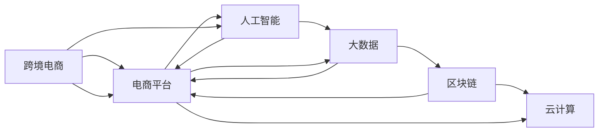

                 

# 利用技术优势进行跨境电商创业

> 关键词：跨境电商,电商平台,人工智能,大数据,区块链,云计算,电商平台开发,电子商务,技术创新

## 1. 背景介绍

### 1.1 问题由来
随着全球经济的快速发展，跨境电商已成为一个充满潜力的新兴市场。根据市场研究机构eMarketer的预测，2024年全球跨境电商市场规模将达到4.9万亿美元，同比增长13%。然而，跨境电商的物流、支付、税务等复杂流程，以及文化差异、语言障碍等问题，仍然给企业带来较大挑战。

为了应对这些挑战，众多企业开始利用技术手段优化电商流程，提升用户体验。其中，人工智能、大数据、区块链、云计算等技术的应用，不仅改善了电商平台的用户体验，也极大提高了运营效率，成为跨境电商创业的重要引擎。

### 1.2 问题核心关键点
跨境电商的核心在于：
- **用户体验**：高效、便捷的购物体验。
- **运营效率**：高效的供应链管理、库存控制、支付流程等。
- **数据驱动**：通过大数据分析指导决策，优化运营策略。
- **安全保障**：数据安全、交易安全、跨境物流安全。

这些关键点都与技术密不可分，技术不仅是跨境电商创业的“利器”，更是提升竞争力的重要驱动力。

## 2. 核心概念与联系

### 2.1 核心概念概述

本节将介绍几个与跨境电商创业紧密相关的核心概念：

- **跨境电商**：指跨越国界进行商品或服务买卖的电子商务模式，包括B2B、B2C、C2C等形式。
- **电商平台**：指提供商品展示、交易、支付、物流等服务的在线平台。
- **人工智能**：指通过模拟人类智能活动，实现信息处理、推理、学习等能力的计算技术。
- **大数据**：指通过海量数据采集、存储、分析，揭示数据背后规律的技术。
- **区块链**：指一种去中心化、不可篡改、分布式的数据库技术。
- **云计算**：指基于互联网提供动态、可扩展的计算资源，供用户按需使用。

这些核心概念通过以下Mermaid流程图展示了它们之间的联系：



以上流程图展示了各技术对跨境电商平台的支撑作用：

1. **电商平台**：作为核心支撑平台，提供商品展示、交易、支付、物流等功能。
2. **人工智能**：提升用户体验和运营效率，如智能推荐、聊天机器人等。
3. **大数据**：驱动精准营销、库存管理等，提升决策效率。
4. **区块链**：保障交易安全，提升信任度。
5. **云计算**：提供高效、弹性的计算资源，支撑大流量和业务增长。

这些技术相辅相成，共同构建了高效的跨境电商系统。

## 3. 核心算法原理 & 具体操作步骤
### 3.1 算法原理概述

跨境电商的运营涉及多方面的技术，包括但不限于以下几个核心算法原理：

- **推荐算法**：根据用户历史行为、兴趣偏好，推荐相关商品。
- **自然语言处理(NLP)**：处理多语言环境下的用户查询、商品描述等，提升搜索和展示效果。
- **机器学习模型**：用于预测用户行为、优化库存、自动化定价等。
- **图像识别**：识别产品图片，进行质量检测、分类等。
- **物流优化**：优化跨境物流路径、库存管理等，提升配送效率。

### 3.2 算法步骤详解

以**推荐算法**为例，详细介绍其操作步骤：

**Step 1: 数据收集与预处理**
- 收集用户的历史行为数据，如浏览、购买、评分等。
- 清洗数据，去除异常值和噪声。
- 对数据进行特征工程，提取有意义的特征，如用户兴趣、商品属性等。

**Step 2: 模型选择与训练**
- 选择合适的推荐算法模型，如协同过滤、基于内容的推荐、深度学习推荐等。
- 在清洗后的数据集上训练模型，使用交叉验证等技术进行调优。
- 保存模型，用于后续实时推荐。

**Step 3: 实时推荐**
- 在用户每次访问平台时，使用训练好的推荐模型计算相关商品，实时更新展示内容。
- 使用A/B测试等方法，评估推荐效果，不断优化模型。

### 3.3 算法优缺点

推荐算法具有以下优点：
- **提升用户体验**：根据用户兴趣推荐商品，增加购买意愿。
- **增加销售量**：有效匹配用户需求，提高转化率。
- **个性化营销**：实现精准营销，提高广告投资回报率。

同时，算法也存在以下缺点：
- **冷启动问题**：新用户没有足够的历史数据，推荐效果不佳。
- **数据隐私**：收集用户行为数据可能引发隐私问题。
- **模型复杂**：深度学习等复杂模型需要大量计算资源和数据。

### 3.4 算法应用领域

推荐算法广泛应用于：
- **个性化推荐**：如电商平台商品推荐、视频平台内容推荐等。
- **广告投放**：精准投放广告，提高广告效果。
- **供应链管理**：优化库存和供应链，减少缺货和积压。
- **金融风控**：评估用户信用，控制风险。

## 4. 数学模型和公式 & 详细讲解 & 举例说明

### 4.1 数学模型构建

推荐算法常用的数学模型包括协同过滤和基于内容的推荐模型。以下以协同过滤为例，进行详细构建：

设用户集合为 $U$，商品集合为 $I$，用户与商品之间的评分矩阵为 $R$。协同过滤的目标是找到用户 $u$ 对商品 $i$ 的评分 $r_{ui}$，具体模型如下：

$$
r_{ui} = \mathbf{w}_u \cdot \mathbf{v}_i + b
$$

其中，$\mathbf{w}_u$ 和 $\mathbf{v}_i$ 分别为用户 $u$ 和商品 $i$ 的向量表示，$b$ 为偏置项。

### 4.2 公式推导过程

在上述模型中，评分 $r_{ui}$ 由用户 $u$ 的特征向量 $\mathbf{w}_u$ 和商品 $i$ 的特征向量 $\mathbf{v}_i$ 的加权和，加上偏置项 $b$ 共同决定。

设 $\mathbf{X}_u$ 和 $\mathbf{Y}_i$ 分别为用户 $u$ 和商品 $i$ 的特征向量，模型可以表示为：

$$
r_{ui} = \mathbf{w}_u \cdot \mathbf{v}_i + b = \mathbf{X}_u \cdot \mathbf{Y}_i^T + b
$$

其中，$\mathbf{X}_u$ 为 $n_u \times d_u$ 的矩阵，$\mathbf{Y}_i$ 为 $d_i \times m_i$ 的矩阵，$n_u$ 和 $d_u$ 分别为用户 $u$ 的特征数和特征维数，$m_i$ 为商品 $i$ 的特征数。

### 4.3 案例分析与讲解

以亚马逊的推荐系统为例，详细说明其应用场景和效果。亚马逊使用协同过滤算法，根据用户的历史行为数据和商品特征，计算用户对商品的相关评分，生成个性化推荐列表。用户每次浏览商品时，系统都会根据当前行为动态调整推荐内容，提升用户体验和购物转化率。

## 5. 项目实践：代码实例和详细解释说明

### 5.1 开发环境搭建

开发环境搭建包括以下步骤：

1. 选择编程语言：如Python，并准备所需开发工具，如PyCharm、VSCode等。
2. 安装依赖库：如numpy、pandas、scikit-learn等，用于数据处理和模型训练。
3. 配置服务器：如AWS、Google Cloud等，搭建数据存储、模型训练和服务的云环境。

### 5.2 源代码详细实现

以下是一个简单的推荐算法代码实现，详细讲解其功能和使用场景：

```python
import numpy as np
from sklearn.metrics.pairwise import cosine_similarity

def collaborative_filtering(R, k):
    # 构建用户-商品评分矩阵R
    R = R + np.eye(R.shape[0])
    # 计算用户-用户相似度矩阵
    user_similarity = cosine_similarity(R)
    # 计算商品-商品相似度矩阵
    item_similarity = cosine_similarity(R.T)
    # 计算用户对商品的评分
    user_score = user_similarity @ item_similarity
    # 计算商品对用户的评分
    item_score = item_similarity @ user_similarity
    # 预测用户对商品的评分
    score = (user_score / np.linalg.norm(user_score, axis=1)) @ (item_score / np.linalg.norm(item_score, axis=0))
    return score

# 示例数据
R = np.array([[5, 0, 4, 0],
              [0, 4, 0, 0],
              [0, 0, 5, 4],
              [4, 0, 0, 5]])

# 预测用户对商品的评分
score = collaborative_filtering(R, k=2)
print(score)
```

以上代码实现了基于协同过滤的推荐算法，通过计算用户-商品相似度矩阵和商品-用户相似度矩阵，预测用户对商品的评分。

### 5.3 代码解读与分析

**协同过滤算法**：
- **评分矩阵**：构建用户-商品评分矩阵 $R$，利用numpy库生成，用于存储用户对商品的评分。
- **相似度矩阵**：通过scikit-learn库的cosine_similarity函数计算用户-用户和商品-商品相似度矩阵，用于捕捉用户和商品之间的关系。
- **评分预测**：利用相似度矩阵计算用户对商品的评分，使用余弦相似度计算用户-商品和商品-用户相似度矩阵。
- **效果输出**：输出预测的用户对商品的评分，用于后续推荐。

## 6. 实际应用场景

### 6.1 电商平台推荐系统

电商平台利用推荐算法提升用户体验和销售额。以淘宝为例，淘宝通过收集用户行为数据和商品属性数据，训练推荐模型，生成个性化推荐列表。用户每次浏览商品时，系统都会根据当前行为动态调整推荐内容，提升用户体验和购物转化率。

### 6.2 金融风控系统

金融公司利用推荐算法进行信用评估和风险控制。通过分析用户的历史行为和交易记录，训练推荐模型，预测用户信用风险。高风险用户将受到限制，低风险用户则获得更高信用额度。

### 6.3 智能客服系统

智能客服系统利用自然语言处理和推荐算法，提升用户体验和问题解决效率。通过分析用户咨询内容和历史记录，训练推荐模型，推荐最合适的解决方案，帮助用户快速解决问题。

## 7. 工具和资源推荐

### 7.1 学习资源推荐

为了帮助开发者掌握推荐算法和相关技术，推荐以下学习资源：

1. 《推荐系统实战》：详细讲解了协同过滤、基于内容的推荐、深度学习推荐等多种推荐算法。
2. 《自然语言处理综论》：介绍自然语言处理的基本概念和常见算法，如分词、词性标注、命名实体识别等。
3. Coursera《机器学习》课程：由斯坦福大学开设，涵盖机器学习的基本原理和应用。
4. Coursera《深度学习专项课程》：涵盖深度学习的基本概念和应用，包括神经网络、卷积神经网络、循环神经网络等。

通过以上学习资源，开发者可以系统掌握推荐算法和相关技术，提升跨境电商创业的技术能力。

### 7.2 开发工具推荐

为了提高跨境电商平台的开发效率，推荐以下开发工具：

1. PyCharm：Python开发集成环境，提供丰富的插件和调试功能。
2. VSCode：轻量级开发环境，支持多种编程语言和扩展。
3. AWS Lambda：基于云的函数计算服务，快速部署和扩展推荐算法服务。
4. Google Cloud Functions：类似AWS Lambda，支持快速部署和扩展推荐算法服务。
5. Docker：容器化工具，方便部署和扩展推荐算法服务。

### 7.3 相关论文推荐

为了深入了解推荐算法的最新研究进展，推荐以下相关论文：

1. <a href="https://www.kdd.org/kdd2020/papers/view/p0164">《Structural-Aware Recommender Systems: A Survey》</a>：由新加坡国立大学的研究团队撰写，全面回顾了推荐系统的最新进展。
2. <a href="https://arxiv.org/abs/1904.07291">《Generative Adversarial Networks》</a>：由Ian Goodfellow等人撰写，介绍生成对抗网络的基本原理和应用。
3. <a href="https://arxiv.org/abs/1706.05285">《Attention Is All You Need》</a>：由Google的研究团队撰写，介绍Transformer模型的基本原理和应用。

## 8. 总结：未来发展趋势与挑战

### 8.1 总结

本文对利用技术优势进行跨境电商创业进行了全面系统的介绍。首先，阐述了跨境电商创业的背景和意义，明确了技术在提升用户体验、运营效率和数据驱动决策中的核心作用。其次，从原理到实践，详细讲解了推荐算法的数学模型和操作步骤，给出了代码实现和详细解释。同时，本文还广泛探讨了推荐算法在电商、金融、客服等多个行业领域的应用前景，展示了技术手段的巨大潜力。

### 8.2 未来发展趋势

展望未来，跨境电商创业的技术将呈现以下几个发展趋势：

1. **个性化推荐**：利用深度学习、生成对抗网络等技术，实现更精准的用户推荐。
2. **大数据分析**：通过大数据分析和机器学习模型，提升运营决策的科学性和效率。
3. **区块链技术**：利用区块链技术保障交易安全和数据隐私，提升跨境电商的可信度。
4. **云计算**：利用云计算技术实现弹性计算和高效服务，支持大规模用户和业务。
5. **跨模态学习**：结合图像、语音、文本等多种模态数据，实现更全面的用户理解。
6. **智能化客服**：利用自然语言处理和推荐算法，提升客服系统的智能化水平，提升用户满意度。

这些趋势将推动跨境电商技术的不断进步，带来更高效、更智能、更安全的电商体验。

### 8.3 面临的挑战

尽管技术手段在跨境电商创业中已经取得了显著成果，但在迈向更加智能化、普适化应用的过程中，仍面临诸多挑战：

1. **数据隐私**：跨境电商涉及跨国数据流动，如何保障用户隐私和数据安全，是一个重要问题。
2. **模型复杂度**：深度学习等复杂模型需要大量计算资源和数据，如何高效训练和部署模型，是一个技术挑战。
3. **文化差异**：跨境电商需要处理多语言环境，如何提升多语言环境的推荐效果，是一个重要挑战。
4. **法规合规**：跨境电商涉及多国法律和政策，如何符合各国法规和标准，是一个复杂问题。
5. **市场竞争**：跨境电商市场竞争激烈，如何提升竞争力，保持市场领先地位，是一个商业挑战。

### 8.4 研究展望

面对跨境电商创业的技术挑战，未来的研究需要在以下几个方面寻求新的突破：

1. **数据隐私保护**：研究数据加密、匿名化、去标识化等技术，保护用户隐私和数据安全。
2. **高效模型训练**：研究分布式训练、量化加速、模型压缩等技术，提高模型训练和推理效率。
3. **多语言推荐**：研究多语言推荐算法，提升多语言环境下的推荐效果。
4. **法规合规**：研究跨境电商法规合规的自动化解决方案，提高合规效率。
5. **市场竞争**：研究用户行为分析和市场预测模型，提升市场竞争能力。

这些研究方向的探索，将引领跨境电商技术不断进步，为跨境电商创业带来新的突破。

## 9. 附录：常见问题与解答

**Q1：跨境电商创业需要哪些技术支持？**

A: 跨境电商创业需要以下技术支持：
1. **电商平台**：提供商品展示、交易、支付、物流等功能。
2. **人工智能**：提升用户体验和运营效率，如智能推荐、聊天机器人等。
3. **大数据**：驱动精准营销、库存管理等，提升决策效率。
4. **区块链**：保障交易安全，提升信任度。
5. **云计算**：提供高效、弹性的计算资源，支撑大流量和业务增长。

**Q2：推荐算法的优缺点是什么？**

A: 推荐算法具有以下优点：
1. **提升用户体验**：根据用户兴趣推荐商品，增加购买意愿。
2. **增加销售量**：有效匹配用户需求，提高转化率。
3. **个性化营销**：实现精准营销，提高广告投资回报率。

同时，算法也存在以下缺点：
1. **冷启动问题**：新用户没有足够的历史数据，推荐效果不佳。
2. **数据隐私**：收集用户行为数据可能引发隐私问题。
3. **模型复杂**：深度学习等复杂模型需要大量计算资源和数据。

**Q3：如何保障跨境电商的交易安全？**

A: 跨境电商交易安全的保障可以通过以下方式：
1. **加密传输**：使用SSL/TLS等加密协议，保障数据传输安全。
2. **数字签名**：使用数字签名技术，验证交易双方的身份和数据完整性。
3. **区块链**：利用区块链技术，保障交易记录的不可篡改性和透明性。
4. **第三方支付**：使用第三方支付平台，保障交易安全性和可靠性。
5. **多因素认证**：使用多因素认证技术，提高交易安全性。

**Q4：如何进行跨境电商的市场分析？**

A: 跨境电商市场分析可以通过以下方式：
1. **市场调研**：通过问卷调查、数据分析等手段，了解市场需求和用户行为。
2. **竞争对手分析**：分析竞争对手的产品、价格、市场策略等，了解市场竞争格局。
3. **趋势预测**：利用大数据和机器学习模型，预测市场趋势和用户需求。
4. **用户画像**：分析用户数据，构建用户画像，指导产品设计和市场策略。
5. **SWOT分析**：分析企业的优势、劣势、机会和威胁，制定市场策略。

通过以上学习资源、开发工具和研究展望，相信您已经对利用技术优势进行跨境电商创业有了全面的了解。只有在技术、市场、运营等多方面协同发力，才能真正实现跨境电商创业的成功。希望本文能为您的创业之路提供有价值的参考和帮助。

---

作者：禅与计算机程序设计艺术 / Zen and the Art of Computer Programming

