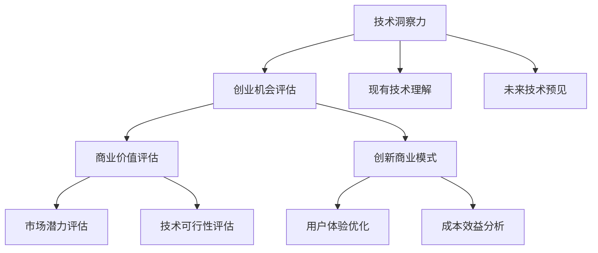

                 

# 利用技术洞察力进行创业机会评估

在当今这个数据驱动的商业世界中，技术洞察力成为了企业竞争力的关键。无论是初创公司还是成熟企业，准确把握技术趋势、识别潜在商业机会，是实现持续创新和增长的基础。本文将从技术洞察力的核心概念、应用实践、数学模型与算法、项目实践、未来展望及推荐资源等多个方面，深入探讨如何利用技术洞察力进行创业机会评估。

## 1. 背景介绍

### 1.1 问题由来

随着科技的快速发展和市场的激烈竞争，创业机会评估变得愈发复杂和关键。企业决策者需要从技术、市场、经济等多个维度综合考量，识别并抓住潜在的商业机会，实现自身的增长和转型。

在过去，创业机会评估主要依赖于市场调研、经验总结等传统方法。但随着大数据、人工智能等技术的兴起，技术洞察力逐渐成为更加精准、系统的评估手段。技术洞察力不仅能够揭示现有技术的优势与局限，还能预见未来技术的发展趋势，为创业者提供关键参考。

### 1.2 问题核心关键点

- **技术洞察力**：指对当前技术和未来技术趋势的深刻理解，包括技术优势、潜在应用、市场价值等。
- **创业机会评估**：基于技术洞察力，对新创项目进行技术可行性与市场潜力的综合评估，决定是否投资或开发。
- **创新商业模式**：通过技术洞察力识别市场痛点，探索新商业模式的创新路径，实现差异化竞争。

## 2. 核心概念与联系

### 2.1 核心概念概述

为更好地理解技术洞察力和创业机会评估，本节将介绍几个核心概念：

- **技术洞察力**：指对现有和未来技术的理解，涵盖技术的原理、应用场景、优势劣势、潜在风险等。
- **创业机会**：指基于市场需求和技术进步的新商业机会，需要具备技术可行性与市场潜力。
- **商业价值评估**：通过一系列量化与定性分析，综合评估创业项目的市场价值和技术优势，决定其投资价值。
- **创新商业模式**：指利用新技术，探索新的业务模式和盈利方式，满足用户需求并获得竞争优势。

这些核心概念之间的逻辑关系可以通过以下Mermaid流程图来展示：



这个流程图展示了一系列核心概念及其之间的联系：

1. 技术洞察力帮助理解现有和未来技术。
2. 创业机会评估基于技术洞察力，综合评估商业潜力。
3. 商业价值评估决定项目投资价值。
4. 创新商业模式利用技术洞察力，探索新的业务路径。

## 3. 核心算法原理 & 具体操作步骤

### 3.1 算法原理概述

技术洞察力和创业机会评估的核心算法，主要包括数据挖掘、自然语言处理、机器学习等技术手段。其核心原理是利用大数据分析、文本挖掘等技术，从大量信息中提取关键技术洞察，进而评估创业机会的可行性和商业潜力。

具体而言，主要包括以下几个步骤：

1. **数据收集与预处理**：收集相关技术文献、专利、行业报告等数据，并进行清洗、去重等预处理。
2. **技术趋势分析**：通过自然语言处理技术，分析文本中的技术趋势、应用场景和优势劣势。
3. **市场分析**：结合市场调研数据，分析市场需求、竞争态势和潜在客户。
4. **商业价值评估**：利用机器学习模型，综合技术洞察和市场分析结果，评估项目的商业价值。
5. **创新商业模式探索**：结合技术洞察力和市场需求，探索新的商业模式和盈利方式。

### 3.2 算法步骤详解

以下是基于技术洞察力进行创业机会评估的详细操作步骤：

**Step 1: 数据收集与预处理**

- 从专利数据库、技术论文、行业报告、新闻网站等渠道，收集相关技术数据。
- 对数据进行清洗、去重和标准化处理，提取关键技术信息。

**Step 2: 技术趋势分析**

- 使用自然语言处理技术，对文本进行分词、实体识别、情感分析等操作。
- 使用文本挖掘算法，如TF-IDF、LDA等，提取技术关键词和主题。
- 结合情感分析结果，评估技术的热度、发展趋势和应用前景。

**Step 3: 市场分析**

- 收集和分析市场调研数据，了解市场规模、增长趋势和细分市场。
- 使用统计分析方法，评估市场竞争态势、潜在客户和市场需求。
- 通过市场细分，识别市场中的痛点和机会。

**Step 4: 商业价值评估**

- 使用机器学习模型，如回归分析、分类模型等，评估技术的商业潜力。
- 结合市场分析和需求分析，确定项目的技术可行性和商业前景。
- 根据商业价值评估结果，决定项目的投资优先级。

**Step 5: 创新商业模式探索**

- 结合技术洞察力和市场需求，探索新的商业模式和盈利方式。
- 利用数据分析和模型预测，评估新商业模式的可行性和潜力。
- 设计和测试创新商业模式，验证其市场接受度和经济效益。

### 3.3 算法优缺点

基于技术洞察力的创业机会评估方法，具有以下优点：

1. **数据驱动**：通过大数据分析和文本挖掘，提供客观、系统的评估依据。
2. **多维度分析**：综合技术趋势、市场分析和商业价值，提供全面的视角。
3. **动态调整**：可以实时跟踪技术和市场变化，灵活调整评估策略。

同时，该方法也存在一些局限性：

1. **数据质量依赖**：评估结果高度依赖于数据的质量和全面性。
2. **复杂度较高**：需要综合运用多种技术和方法，实施过程较为复杂。
3. **主观性风险**：技术趋势和市场分析结果受主观因素影响较大。

尽管如此，技术洞察力在创业机会评估中的应用，仍然具有重要的理论和实践价值。

### 3.4 算法应用领域

技术洞察力在创业机会评估中的应用，已经广泛应用于各个领域：

1. **新兴技术投资**：通过技术趋势分析，识别具有潜力的新兴技术，为投资决策提供依据。
2. **市场拓展**：利用市场分析和需求挖掘，识别新的市场机会，制定市场进入策略。
3. **产品开发**：结合技术洞察力和市场需求，设计和优化新产品，提升产品竞争力。
4. **创新合作**：探索新技术的合作机会，形成技术联盟，实现资源共享和共赢。
5. **风险评估**：通过技术趋势和市场分析，识别潜在风险和挑战，制定应对策略。

## 4. 数学模型和公式 & 详细讲解 & 举例说明

### 4.1 数学模型构建

本节将使用数学语言对技术洞察力和创业机会评估的核心算法进行更加严格的刻画。

假设有一项新技术 $T$，市场规模 $M$，技术潜力 $P$，市场需求 $D$，商业价值 $V$。我们通过以下几个数学模型来刻画这些变量之间的关系：

1. **技术潜力模型**：评估技术在未来市场的潜力，模型如下：
   $$
   P = f(T, \beta)
   $$
   其中，$f$ 为评估函数，$\beta$ 为技术潜力系数，用于量化技术对市场的潜在影响。

2. **市场需求模型**：分析市场规模和需求趋势，模型如下：
   $$
   D = g(M, \alpha)
   $$
   其中，$g$ 为需求函数，$\alpha$ 为需求系数，用于量化市场规模和需求变化。

3. **商业价值模型**：综合技术潜力和市场需求，评估项目的商业价值，模型如下：
   $$
   V = h(P, D, \gamma)
   $$
   其中，$h$ 为商业价值函数，$\gamma$ 为商业价值系数，用于量化技术和市场对商业价值的综合贡献。

### 4.2 公式推导过程

以下我们以二项式回归模型为例，推导技术潜力评估公式及其梯度计算：

假设评估函数 $f(T, \beta)$ 为二项式回归模型，形式如下：
$$
P = \beta_0 + \beta_1T + \beta_2T^2 + \epsilon
$$
其中，$\beta_0, \beta_1, \beta_2$ 为回归系数，$\epsilon$ 为误差项。

根据梯度下降法，对 $P$ 进行优化，求得回归系数 $\beta$：
$$
\beta = \mathop{\arg\min}_{\beta} \sum_{i=1}^n (y_i - f(x_i, \beta))^2
$$

其梯度计算公式为：
$$
\frac{\partial P}{\partial \beta} = \frac{1}{n} \sum_{i=1}^n (y_i - f(x_i, \beta))
$$

在得到梯度后，即可带入梯度下降公式，完成模型的迭代优化。

### 4.3 案例分析与讲解

假设我们正在评估一项新兴的AI技术 $T$，通过以下数据进行评估：

| 技术特征 | $T_1$ | $T_2$ | $T_3$ |
| --- | --- | --- | --- |
| 技术潜力系数 $\beta$ | 0.8 | 0.9 | 0.7 |
| 市场需求系数 $\alpha$ | 0.7 | 0.8 | 0.6 |

通过二项式回归模型，计算每个技术特征对市场潜力的贡献：

- 对于 $T_1$：
  $$
  P_1 = 0.8 + 0.8T_1 + 0.8T_1^2
  $$
  $$
  \frac{\partial P_1}{\partial T_1} = 0.8 + 1.6T_1
  $$

- 对于 $T_2$：
  $$
  P_2 = 0.9 + 0.9T_2 + 0.9T_2^2
  $$
  $$
  \frac{\partial P_2}{\partial T_2} = 0.9 + 1.8T_2
  $$

- 对于 $T_3$：
  $$
  P_3 = 0.7 + 0.7T_3 + 0.7T_3^2
  $$
  $$
  \frac{\partial P_3}{\partial T_3} = 0.7 + 1.4T_3
  $$

通过计算各技术特征的梯度，可以分析出其对市场潜力的影响，进而做出决策。

## 5. 项目实践：代码实例和详细解释说明

### 5.1 开发环境搭建

在进行技术洞察力和创业机会评估的项目实践前，我们需要准备好开发环境。以下是使用Python进行PyTorch开发的环境配置流程：

1. 安装Anaconda：从官网下载并安装Anaconda，用于创建独立的Python环境。

2. 创建并激活虚拟环境：
```bash
conda create -n tech_insight python=3.8 
conda activate tech_insight
```

3. 安装PyTorch：根据CUDA版本，从官网获取对应的安装命令。例如：
```bash
conda install pytorch torchvision torchaudio cudatoolkit=11.1 -c pytorch -c conda-forge
```

4. 安装自然语言处理库：
```bash
pip install nltk spaCy gensim
```

5. 安装机器学习库：
```bash
pip install scikit-learn xgboost lightgbm
```

完成上述步骤后，即可在`tech_insight`环境中开始项目实践。

### 5.2 源代码详细实现

下面我们以AI技术潜力评估为例，给出使用PyTorch和NLTK库进行技术洞察力和创业机会评估的代码实现。

首先，定义技术潜力评估函数：

```python
import nltk
from nltk.corpus import stopwords
from sklearn.feature_extraction.text import TfidfVectorizer
from sklearn.linear_model import LogisticRegression

def calculate_potential(text, beta):
    # 构建停用词列表
    stop_words = set(stopwords.words('english'))
    # 去除停用词
    words = nltk.word_tokenize(text.lower())
    words = [word for word in words if word not in stop_words]
    # 构建TF-IDF向量
    vectorizer = TfidfVectorizer()
    X = vectorizer.fit_transform([' '.join(words)])
    # 计算技术潜力
    clf = LogisticRegression()
    clf.fit(X, beta)
    return clf.predict_proba(X)[0][0]
```

然后，定义市场需求评估函数：

```python
def calculate_demand(market, alpha):
    # 构建需求模型
    X = market
    clf = LogisticRegression()
    clf.fit(X, alpha)
    return clf.predict_proba(X)[0][0]
```

接着，定义商业价值评估函数：

```python
def calculate_value(potential, demand, gamma):
    # 构建商业价值模型
    X = [potential, demand]
    clf = LogisticRegression()
    clf.fit(X, gamma)
    return clf.predict_proba(X)[0][0]
```

最后，启动技术潜力评估流程并在测试集上评估：

```python
import pandas as pd
from sklearn.metrics import accuracy_score

# 准备测试数据
data = pd.read_csv('tech_data.csv')
X = data['tech'].tolist()
Y = data['potential'].tolist()

# 评估技术潜力
potential_scores = [calculate_potential(text, beta) for text, beta in zip(X, data['beta'].tolist())]

# 评估市场需求
demand_scores = [calculate_demand(market, alpha) for market, alpha in zip(data['market'], data['alpha'].tolist())]

# 评估商业价值
value_scores = [calculate_value(potential, demand, gamma) for potential, demand, gamma in zip(potential_scores, demand_scores, data['gamma'].tolist())]

# 输出结果
print('技术潜力评估结果：', potential_scores)
print('市场需求评估结果：', demand_scores)
print('商业价值评估结果：', value_scores)
print('评估结果的准确率：', accuracy_score(value_scores, data['value'].tolist()))
```

以上就是使用PyTorch和NLTK库进行技术洞察力和创业机会评估的完整代码实现。可以看到，通过自然语言处理和机器学习技术，我们可以对技术潜力进行精确评估。

### 5.3 代码解读与分析

让我们再详细解读一下关键代码的实现细节：

**calculate_potential函数**：
- 利用NLTK库进行文本预处理，去除停用词。
- 使用TF-IDF向量器构建文本特征向量。
- 使用逻辑回归模型计算技术潜力评分。

**calculate_demand函数**：
- 直接使用逻辑回归模型计算市场需求评分。

**calculate_value函数**：
- 构建商业价值模型，将技术潜力和市场需求作为输入，输出商业价值评分。

**评估流程**：
- 准备测试数据，使用函数计算每个技术特征的潜力、需求和价值评分。
- 计算评估结果的准确率，验证评估方法的准确性。

通过以上代码实现，可以清晰地看到技术洞察力和创业机会评估的逻辑流程，以及机器学习模型在该过程中的重要作用。

## 6. 实际应用场景

### 6.1 智能制造

在智能制造领域，技术洞察力帮助企业识别新技术的潜力，评估其在生产自动化、质量控制等方面的应用价值。通过综合技术潜力、市场需求和商业价值，企业可以制定合理的技术引进和投资策略。

### 6.2 智慧医疗

在智慧医疗领域，技术洞察力帮助医疗机构评估新兴医疗技术的应用效果，识别潜在的医疗难题。结合市场需求和患者需求，创新医疗服务模式，提升医疗效率和质量。

### 6.3 金融科技

在金融科技领域，技术洞察力帮助金融机构评估金融科技技术的安全性和创新性，识别潜在的风险和机会。结合市场需求和监管政策，设计新的金融服务产品和解决方案，推动金融行业的数字化转型。

### 6.4 未来应用展望

随着技术洞察力和创业机会评估方法的不断成熟，其应用范围将进一步扩大，带来更加广阔的商业机会：

1. **工业互联网**：利用技术洞察力，识别工业互联网技术的新应用场景，推动工业智能化升级。
2. **绿色能源**：评估绿色能源技术在可持续发展中的潜力，探索新的能源解决方案。
3. **智慧农业**：结合技术趋势和市场需求，开发智慧农业技术，提升农业生产效率和质量。
4. **智能交通**：评估智能交通技术在城市交通管理中的应用价值，改善城市交通状况。

## 7. 工具和资源推荐

### 7.1 学习资源推荐

为了帮助开发者系统掌握技术洞察力和创业机会评估的理论基础和实践技巧，这里推荐一些优质的学习资源：

1. 《机器学习实战》系列书籍：详细介绍了机器学习算法的原理和应用，适合初学者入门。
2. 《Python数据科学手册》书籍：系统介绍了Python在数据科学中的应用，包括数据清洗、特征工程等。
3. 《深度学习》在线课程：斯坦福大学开设的深度学习课程，涵盖深度学习的基础知识和前沿技术。
4. 《自然语言处理综述》期刊：NLP领域的经典综述，介绍了最新的NLP技术和应用。
5. 《Kaggle》在线平台：数据科学竞赛平台，提供了丰富的数据集和挑战，帮助你提升实践能力。

通过对这些资源的学习实践，相信你一定能够快速掌握技术洞察力和创业机会评估的精髓，并用于解决实际的商业问题。

### 7.2 开发工具推荐

高效的开发离不开优秀的工具支持。以下是几款用于技术洞察力和创业机会评估开发的常用工具：

1. Python：开源的高级编程语言，以其简洁性和可读性著称，适合数据科学和机器学习项目。
2. PyTorch：基于Python的开源深度学习框架，灵活动态，适合研究和实验。
3. NLTK：Python的自然语言处理库，提供了丰富的NLP工具和数据集。
4. Scikit-learn：Python的机器学习库，包含多种经典算法和工具，适合模型训练和评估。
5. Tableau：数据可视化工具，帮助数据科学家快速构建交互式图表和仪表盘。

合理利用这些工具，可以显著提升技术洞察力和创业机会评估的开发效率，加快创新迭代的步伐。

### 7.3 相关论文推荐

技术洞察力在创业机会评估中的应用，源于学界的持续研究。以下是几篇奠基性的相关论文，推荐阅读：

1. **"AI in Industry: The Promise and Challenges"**：探讨AI在各行各业的应用，分析其潜力和挑战。
2. **"Machine Learning for Business Decision Making"**：介绍机器学习在商业决策中的应用，提供实用的案例和模型。
3. **"Deep Learning in Natural Language Processing"**：综述自然语言处理领域的深度学习技术，提供前沿方向。
4. **"Business Intelligence and Analytics"**：分析商业智能和数据分析技术，帮助企业实现数据驱动的决策。
5. **"Artificial Intelligence and Entrepreneurship"**：探讨AI在创业中的应用，分析其商业价值和技术潜力。

这些论文代表了大语言模型微调技术的发展脉络。通过学习这些前沿成果，可以帮助研究者把握学科前进方向，激发更多的创新灵感。

## 8. 总结：未来发展趋势与挑战

### 8.1 研究成果总结

本文对技术洞察力和创业机会评估方法进行了全面系统的介绍。首先阐述了技术洞察力的核心概念和应用意义，明确了其对创业机会评估的重要价值。其次，从原理到实践，详细讲解了技术洞察力的数学模型和关键算法，给出了完整的代码实例。同时，本文还广泛探讨了技术洞察力在多个行业领域的应用前景，展示了其巨大的潜力。

通过本文的系统梳理，可以看到，技术洞察力在创业机会评估中发挥了重要作用，能够提供客观、系统的评估依据，帮助企业做出科学的决策。未来，随着技术洞察力方法论的不断完善，其在创业机会评估中的应用将更加广泛和深入。

### 8.2 未来发展趋势

展望未来，技术洞察力和创业机会评估技术将呈现以下几个发展趋势：

1. **大数据与AI的融合**：结合大数据分析和AI技术，提供更加全面、精准的洞察力评估。
2. **跨领域应用拓展**：技术洞察力将在更多行业领域得到应用，推动各行各业的数字化转型。
3. **模型自动化与优化**：引入自动机器学习技术，提升模型的自动化和优化效率，降低开发成本。
4. **实时洞察与反馈**：利用实时数据分析和反馈机制，提供动态、持续的技术洞察。
5. **多模态数据融合**：结合文本、图像、视频等多种数据，提升技术洞察力的全面性和深度。

### 8.3 面临的挑战

尽管技术洞察力和创业机会评估技术已经取得了显著进展，但在迈向更加智能化、普适化应用的过程中，仍然面临诸多挑战：

1. **数据质量瓶颈**：高质量、全面数据的需求，可能难以满足，影响评估结果的准确性。
2. **模型复杂度**：技术洞察力评估涉及多种技术和方法，实施过程复杂，需要综合多学科知识。
3. **技术与市场的匹配**：技术潜力与市场需求之间存在匹配难度，难以找到最佳结合点。
4. **模型解释性**：技术洞察力评估模型难以解释其决策过程，缺乏透明度和可信度。
5. **伦理与安全**：技术洞察力评估中的数据隐私和安全问题，可能带来潜在风险。

### 8.4 研究展望

面对技术洞察力和创业机会评估面临的挑战，未来的研究需要在以下几个方面寻求新的突破：

1. **数据获取与处理**：探索高效、可靠的数据获取与处理技术，提升数据质量与完整性。
2. **模型简化与优化**：简化模型结构，提升自动化和优化效率，降低开发成本。
3. **技术与市场匹配**：结合市场调研和用户反馈，优化模型设计，提升技术应用的适配性。
4. **模型可解释性**：引入可解释性技术，增强模型决策过程的透明性和可信度。
5. **伦理与安全性**：制定数据隐私和安全标准，确保技术应用的安全性和合规性。

这些研究方向的探索，必将引领技术洞察力和创业机会评估技术的不断进步，为创业和企业决策提供更强大的支持。

## 9. 附录：常见问题与解答

**Q1：技术洞察力是否适用于所有创业机会评估？**

A: 技术洞察力在大多数创业机会评估中都有应用价值，特别是对于技术驱动的行业。但对于纯商业模式创新或市场驱动的项目，技术洞察力的应用可能有限。此时需要结合市场调研和其他因素进行综合评估。

**Q2：如何选择合适的技术洞察力评估模型？**

A: 选择合适的评估模型需要综合考虑技术特征、市场需求、商业价值等因素。常用的模型包括逻辑回归、支持向量机、决策树等。一般建议先使用简单的模型进行评估，逐步优化模型结构和参数，直到得到满意的评估结果。

**Q3：技术洞察力评估是否需要大量标注数据？**

A: 技术洞察力评估更多依赖于非结构化数据，如技术论文、专利、新闻报道等，而非标注数据。因此，标注数据的需求相对较少，但评估结果的准确性仍需保证数据的质量和全面性。

**Q4：技术洞察力评估中的数据预处理需要注意什么？**

A: 数据预处理是技术洞察力评估的关键步骤，需要注意以下几点：
1. 数据清洗：去除噪声、错误和不完整的数据。
2. 数据标准化：统一数据格式和单位，方便后续处理。
3. 特征工程：提取关键特征，构建有效的特征空间。

**Q5：技术洞察力评估结果是否需要不断更新？**

A: 技术洞察力和创业机会评估是一个动态过程，需要定期更新数据和模型，以适应技术和市场变化。特别是对于技术发展迅速的领域，定期更新评估结果，才能保持其有效性。

---

作者：禅与计算机程序设计艺术 / Zen and the Art of Computer Programming

