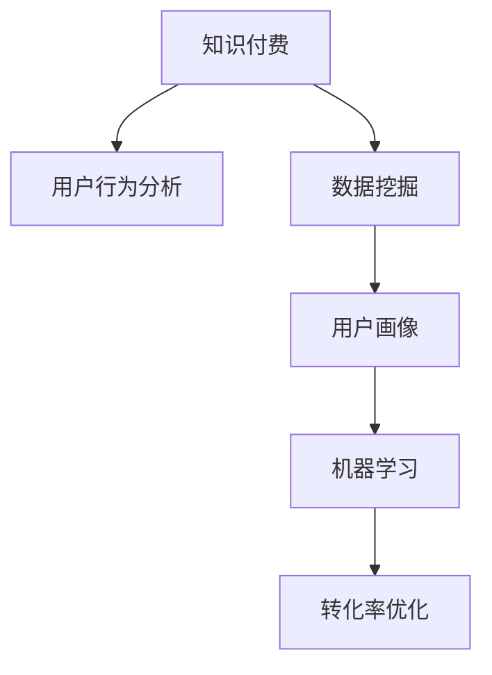

                 

# 利用数据分析优化知识付费转化率

> 关键词：知识付费,用户行为分析,数据挖掘,机器学习,用户画像,转化率优化

## 1. 背景介绍

### 1.1 问题由来

在知识付费领域，如何将用户从免费内容吸引到付费内容，并促使他们完成购买行为，是平台和内容创作者面临的共同挑战。传统的做法是通过市场调研和人工分析来理解用户需求和行为模式，但这种方法往往耗时耗力，且难以全面覆盖所有用户群体。

随着大数据和人工智能技术的发展，利用数据分析方法进行精准用户画像描绘和行为预测，已经成为提升知识付费转化率的重要手段。本文将从数据分析的角度出发，介绍如何通过数据挖掘和机器学习技术，对知识付费用户的转化行为进行全面分析，并提出有效的转化策略。

### 1.2 问题核心关键点

数据分析在知识付费转化率优化中的应用，主要体现在以下几个方面：

- **用户画像**：通过收集和分析用户行为数据，构建详细的用户画像，理解用户的兴趣、需求和购买偏好。
- **行为预测**：利用机器学习算法，对用户未来的购买行为进行预测，识别出高潜用户和购买决策周期。
- **内容推荐**：根据用户的画像和行为数据，提供个性化的内容推荐，提高用户满意度和转化率。
- **用户细分**：将用户划分为不同的细分群体，针对不同群体设计针对性的营销策略。
- **转化路径优化**：分析用户在购买过程中每个环节的表现，优化用户体验和转化路径，减少流失。

这些核心关键点构成了基于数据分析的知识付费转化率优化的框架，帮助我们更好地理解用户行为和需求，制定有效的营销策略。

### 1.3 问题研究意义

利用数据分析优化知识付费转化率，不仅能够提升平台的收入和用户粘性，还能够在激烈的市场竞争中保持领先地位。具体而言：

- **提升收入**：通过精准营销和个性化推荐，最大化用户购买率，增加平台的收入来源。
- **提高用户满意度**：个性化内容推荐和及时行为预测，帮助用户发现和购买自己真正感兴趣的内容，提升用户体验。
- **增强竞争力**：深入分析用户行为数据，洞察市场趋势，及时调整营销策略，保持竞争优势。

本文旨在系统介绍如何通过数据分析技术，实现知识付费平台的高效运营和用户转化。

## 2. 核心概念与联系

### 2.1 核心概念概述

为了更好地理解基于数据分析的知识付费转化率优化方法，本节将介绍几个关键概念：

- **知识付费**：用户为获取专有知识和技能而支付费用的服务模式，包括在线课程、专栏、电子书等。
- **用户行为分析**：通过记录和分析用户在平台上的各种操作，理解用户需求、兴趣和行为模式。
- **数据挖掘**：从大量数据中提取有用信息和知识的过程，常用于用户画像构建和行为预测。
- **机器学习**：使用数据和算法构建预测模型，实现自动化决策和行为预测。
- **用户画像**：基于用户行为数据，构建用户特征和兴趣的详细描述，用于个性化推荐和精准营销。
- **转化率**：用户在接触产品后的购买转化比例，即完成支付行为的用户比例。

这些概念之间的联系可以通过以下Mermaid流程图来展示：



这个流程图展示了大数据分析在知识付费转化率优化中的应用逻辑：

1. 通过用户行为分析，收集和整理用户的数据。
2. 运用数据挖掘技术，提取有价值的用户特征和行为模式。
3. 利用机器学习算法，建立预测模型，识别高潜用户和行为模式。
4. 根据用户画像和行为预测，实现个性化推荐和精准营销。
5. 最终通过转化率优化，提升平台的收入和用户粘性。

## 3. 核心算法原理 & 具体操作步骤
### 3.1 算法原理概述

基于数据分析的知识付费转化率优化方法，本质上是一个数据驱动的用户行为分析和预测过程。其核心思想是：通过数据挖掘和机器学习技术，分析用户行为数据，建立用户画像和行为预测模型，进而优化内容推荐和精准营销，提升用户转化率。

具体来说，该方法分为以下几个步骤：

1. **数据收集与预处理**：收集用户行为数据，包括访问记录、购买记录、互动记录等，并进行清洗和特征提取。
2. **用户画像构建**：基于用户行为数据，构建用户画像，描述用户的兴趣、需求和行为特征。
3. **行为预测模型构建**：利用机器学习算法，构建用户行为预测模型，识别高潜用户和购买决策周期。
4. **个性化推荐**：根据用户画像和行为预测，提供个性化的内容推荐，提高用户满意度和转化率。
5. **用户细分与营销策略设计**：将用户划分为不同细分群体，设计针对性的营销策略，优化转化路径。

### 3.2 算法步骤详解

基于数据分析的知识付费转化率优化，一般包括以下几个关键步骤：

**Step 1: 数据收集与预处理**

- **数据来源**：
  - **平台内部数据**：包括用户访问记录、购买记录、互动记录、用户评价等。
  - **第三方数据**：如用户的人口统计特征、社会媒体行为、历史搜索记录等。
  - **外部数据**：如市场调研、行业报告等。
  
- **数据清洗**：
  - **缺失值处理**：填补缺失值，删除异常值。
  - **数据标准化**：对不同来源的数据进行统一格式和单位。
  - **特征选择**：选择与转化率相关的关键特征，如用户活跃度、浏览时长、购买频率等。

**Step 2: 用户画像构建**

- **用户画像框架**：
  - **人口统计特征**：年龄、性别、职业、教育背景等。
  - **行为特征**：访问频率、浏览时间、购买记录、互动方式等。
  - **兴趣特征**：偏好内容类型、常购买类别、关注话题等。
  
- **画像构建方法**：
  - **聚类分析**：使用K-means、DBSCAN等算法，将用户分为不同群体。
  - **分类分析**：使用决策树、随机森林等算法，预测用户行为和兴趣。
  - **关联规则**：使用Apriori等算法，发现用户行为之间的关联关系。

**Step 3: 行为预测模型构建**

- **预测目标**：
  - **购买意向**：预测用户是否会在未来某个时间点购买内容。
  - **购买时间**：预测用户完成购买的具体时间点。
  - **购买金额**：预测用户的单次购买金额。
  
- **预测算法**：
  - **监督学习**：包括逻辑回归、支持向量机、随机森林等。
  - **非监督学习**：包括聚类分析、异常检测等。
  - **强化学习**：如Q-learning、DQN等，用于优化推荐策略。

**Step 4: 个性化推荐**

- **推荐模型**：
  - **协同过滤**：基于用户行为矩阵进行推荐，如基于用户的协同过滤、基于物品的协同过滤。
  - **内容推荐**：使用深度学习模型，如基于BERT、RNN等，构建用户-内容关联矩阵。
  - **混合推荐**：结合协同过滤和内容推荐，提升推荐效果。
  
- **推荐策略**：
  - **时间相关性**：根据用户历史行为和未来行为预测，推荐最合适的购买时机。
  - **个性化推荐**：根据用户画像和兴趣特征，提供个性化的内容和推荐。
  - **多样性推荐**：保持推荐内容的多样性，避免信息茧房。

**Step 5: 用户细分与营销策略设计**

- **用户细分方法**：
  - **RFM模型**：基于用户最近一次访问(R)、访问频率(F)和消费金额(M)进行细分。
  - **聚类分析**：使用K-means等算法，将用户分为不同群体。
  - **用户行为模式**：识别出不同群体的购买行为模式和偏好。
  
- **营销策略设计**：
  - **高价值用户策略**：针对高价值用户，设计个性化营销活动，提升转化率。
  - **流失用户策略**：分析流失用户的行为特征，制定挽留策略。
  - **低价值用户策略**：提供入门优惠和增值服务，提高用户粘性。

**Step 6: 转化路径优化**

- **转化路径分析**：
  - **漏斗分析**：分析用户从接触到购买的每个环节，识别出流失点。
  - **用户路径图**：绘制用户行为路径图，识别出行为路径中的关键节点。
  
- **优化策略**：
  - **提升关键节点体验**：优化关键节点的界面设计、内容推荐等，提高用户满意度。
  - **减少流失率**：通过个性化推荐和精准营销，降低用户流失率。
  - **增加转化率**：优化支付流程、提供即时反馈等，提高转化率。

### 3.3 算法优缺点

基于数据分析的知识付费转化率优化方法，具有以下优点：

- **数据驱动**：通过系统性分析用户行为数据，做出更科学、精准的决策。
- **个性化推荐**：提高用户满意度和转化率，提升平台的用户粘性。
- **预测精准**：利用机器学习算法，实现高精度的行为预测，识别高潜用户。

但该方法也存在以下局限性：

- **数据隐私**：数据收集和使用过程中，需要严格遵守隐私法规，保护用户数据安全。
- **数据质量**：数据收集和处理过程中，容易引入噪声和错误，影响分析结果。
- **算法复杂**：需要设计复杂的机器学习模型和算法，对技术要求较高。
- **成本较高**：数据收集、算法开发和系统部署等成本较高，中小型平台难以负担。

尽管存在这些局限性，但数据分析方法在知识付费转化率优化中的应用，已展现出巨大的潜力和价值。

### 3.4 算法应用领域

基于数据分析的知识付费转化率优化方法，已经在知识付费平台、在线教育、内容分发等多个领域得到了广泛应用。具体包括：

- **知识付费平台**：如得到、知乎、网易云课堂等，通过数据分析提升用户转化率。
- **在线教育**：如Coursera、Udacity、网易公开课等，通过个性化推荐和精准营销，提高用户购买率。
- **内容分发**：如腾讯新闻、今日头条、搜狐新闻等，通过行为分析，推荐最适合的内容给用户。

## 4. 数学模型和公式 & 详细讲解 & 举例说明

### 4.1 数学模型构建

本节将使用数学语言对基于数据分析的知识付费转化率优化方法进行更加严格的刻画。

记用户行为数据集为 $D=\{(x_i,y_i)\}_{i=1}^N$，其中 $x_i$ 为特征向量，表示用户的行为特征，$y_i \in \{0,1\}$ 为转化标签，表示用户是否完成了购买行为。

定义用户行为预测模型为 $f(x)$，预测用户是否会购买内容。模型的训练目标是最小化预测误差，即：

$$
\min_{f} \frac{1}{N} \sum_{i=1}^N (f(x_i) - y_i)^2
$$

其中 $f(x_i)$ 为模型对样本 $x_i$ 的预测值，$y_i$ 为样本的真实标签。

### 4.2 公式推导过程

以逻辑回归模型为例，推导用户行为预测的公式。

假设 $f(x)$ 为逻辑回归模型的输出，形式为：

$$
f(x) = \beta_0 + \beta_1 x_1 + \beta_2 x_2 + \cdots + \beta_k x_k
$$

其中 $\beta_0, \beta_1, \beta_2, \cdots, \beta_k$ 为模型的参数。模型对样本 $x_i$ 的预测概率为：

$$
p(y_i=1|x_i) = \frac{1}{1+\exp(-f(x_i))}
$$

定义损失函数为交叉熵损失：

$$
\mathcal{L}(f) = -\frac{1}{N} \sum_{i=1}^N (y_i \log p(y_i=1|x_i) + (1-y_i) \log (1-p(y_i=1|x_i)))
$$

通过对 $f(x)$ 求偏导数，得到模型参数的更新公式：

$$
\beta_j = \beta_j - \eta \frac{1}{N} \sum_{i=1}^N (p(y_i=1|x_i) - y_i) x_{ij}
$$

其中 $\eta$ 为学习率，$x_{ij}$ 为特征 $j$ 在样本 $i$ 中的值。

### 4.3 案例分析与讲解

以Coursera平台为例，分析其如何利用数据分析优化用户转化率：

**数据来源**：
- **平台内部数据**：包括课程访问记录、购买记录、互动记录、用户评价等。
- **用户社交数据**：用户在微信、微博等社交平台的互动数据。
- **市场调研数据**：用户调研问卷、行业报告等。

**数据预处理**：
- **缺失值处理**：使用均值填补缺失值，删除异常值。
- **数据标准化**：对不同来源的数据进行统一格式和单位。
- **特征选择**：选择与转化率相关的关键特征，如用户活跃度、浏览时长、购买频率等。

**用户画像构建**：
- **人口统计特征**：年龄、性别、职业、教育背景等。
- **行为特征**：访问频率、浏览时间、购买记录、互动方式等。
- **兴趣特征**：偏好内容类型、常购买类别、关注话题等。

**行为预测模型构建**：
- **监督学习**：使用逻辑回归、随机森林等算法，构建用户行为预测模型。
- **非监督学习**：使用K-means、Apriori等算法，发现用户行为之间的关联关系。

**个性化推荐**：
- **协同过滤**：基于用户行为矩阵进行推荐。
- **内容推荐**：使用BERT等深度学习模型，构建用户-内容关联矩阵。
- **混合推荐**：结合协同过滤和内容推荐，提升推荐效果。

**用户细分与营销策略设计**：
- **RFM模型**：根据用户最近一次访问(R)、访问频率(F)和消费金额(M)进行细分。
- **聚类分析**：使用K-means等算法，将用户分为不同群体。
- **用户行为模式**：识别出不同群体的购买行为模式和偏好。

**营销策略设计**：
- **高价值用户策略**：针对高价值用户，设计个性化营销活动，提升转化率。
- **流失用户策略**：分析流失用户的行为特征，制定挽留策略。
- **低价值用户策略**：提供入门优惠和增值服务，提高用户粘性。

**转化路径优化**：
- **漏斗分析**：分析用户从接触到购买的每个环节，识别出流失点。
- **用户路径图**：绘制用户行为路径图，识别出行为路径中的关键节点。
- **优化策略**：优化关键节点的界面设计、内容推荐等，提高用户满意度。

通过以上步骤，Coursera平台能够根据用户行为数据，构建详细的用户画像，识别高潜用户，提供个性化的推荐和精准的营销策略，优化转化路径，提升平台的收入和用户粘性。

## 5. 项目实践：代码实例和详细解释说明

### 5.1 开发环境搭建

在进行数据分析实践前，我们需要准备好开发环境。以下是使用Python进行Pandas和Scikit-Learn开发的环境配置流程：

1. 安装Anaconda：从官网下载并安装Anaconda，用于创建独立的Python环境。

2. 创建并激活虚拟环境：
```bash
conda create -n analytics-env python=3.8 
conda activate analytics-env
```

3. 安装Pandas和Scikit-Learn：
```bash
pip install pandas scikit-learn
```

4. 安装相关依赖包：
```bash
pip install numpy matplotlib seaborn pydot graphviz
```

完成上述步骤后，即可在`analytics-env`环境中开始数据分析实践。

### 5.2 源代码详细实现

这里我们以用户行为数据分析为例，给出使用Pandas和Scikit-Learn进行用户画像和行为预测的代码实现。

首先，定义数据预处理函数：

```python
import pandas as pd
from sklearn.preprocessing import MinMaxScaler

def preprocess_data(data):
    # 处理缺失值
    data.fillna(method='ffill', inplace=True)
    # 标准化数据
    scaler = MinMaxScaler()
    data['特征1'] = scaler.fit_transform(data['特征1'].values.reshape(-1, 1))
    data['特征2'] = scaler.fit_transform(data['特征2'].values.reshape(-1, 1))
    # 转换分类特征为数值特征
    data['特征3'] = pd.Categorical(data['特征3']).codes
    return data
```

然后，定义用户画像构建函数：

```python
from sklearn.cluster import KMeans

def build_user_profile(data, num_clusters=5):
    # 聚类分析
    X = data[['特征1', '特征2', '特征3']]
    kmeans = KMeans(n_clusters=num_clusters)
    kmeans.fit(X)
    labels = kmeans.labels_
    return pd.DataFrame({'用户ID': data['用户ID'],
                        '标签': labels,
                        '特征1': data['特征1'].values.reshape(-1, 1),
                        '特征2': data['特征2'].values.reshape(-1, 1),
                        '特征3': data['特征3'].values.reshape(-1, 1)})
```

接着，定义行为预测模型函数：

```python
from sklearn.linear_model import LogisticRegression
from sklearn.metrics import accuracy_score

def predict_user_behavior(data, num_clusters=5):
    # 构建聚类特征
    X = data[['特征1', '特征2', '特征3']]
    # 训练逻辑回归模型
    clf = LogisticRegression()
    clf.fit(X, data['转化标签'])
    # 预测新样本的行为
    y_pred = clf.predict(X)
    # 计算预测准确率
    accuracy = accuracy_score(data['转化标签'], y_pred)
    return accuracy
```

最后，启动数据分析流程并在测试集上评估：

```python
# 读取数据集
data = pd.read_csv('user_data.csv')

# 数据预处理
data = preprocess_data(data)

# 用户画像构建
user_profile = build_user_profile(data)

# 行为预测
accuracy = predict_user_behavior(user_profile)

# 输出预测准确率
print(f'用户行为预测准确率为: {accuracy:.2f}')
```

以上就是使用Pandas和Scikit-Learn进行用户行为数据分析的完整代码实现。可以看到，Pandas和Scikit-Learn的强大封装使得数据分析任务变得简洁高效。

### 5.3 代码解读与分析

让我们再详细解读一下关键代码的实现细节：

**preprocess_data函数**：
- `fillna`方法：填补缺失值，使用前向填充。
- `MinMaxScaler`：标准化数据，将特征值缩放到[0,1]之间。
- `pd.Categorical`：将分类特征转换为数值特征。

**build_user_profile函数**：
- `KMeans`：使用K-means算法对用户进行聚类，构建用户画像。
- `labels`：将聚类结果添加到用户画像数据中。

**predict_user_behavior函数**：
- `LogisticRegression`：训练逻辑回归模型，预测用户行为。
- `accuracy_score`：计算预测准确率，评估模型性能。

**启动数据分析流程**：
- 首先，读取数据集。
- 对数据进行预处理，包括缺失值处理、数据标准化和分类特征转换。
- 利用聚类算法构建用户画像。
- 利用逻辑回归模型预测用户行为，并输出预测准确率。

可以看到，通过Pandas和Scikit-Learn的配合使用，用户行为数据分析任务变得非常高效。开发者可以专注于数据处理和模型优化，而不必过多关注底层的实现细节。

当然，工业级的系统实现还需考虑更多因素，如模型的保存和部署、超参数的自动搜索、更灵活的任务适配层等。但核心的数据分析方法基本与此类似。

## 6. 实际应用场景

### 6.1 智能客服系统

基于用户行为数据分析的智能客服系统，可以通过分析用户的历史交互记录和行为数据，构建详细的用户画像，实现个性化推荐和精准营销，提高用户满意度和服务效率。具体而言：

- **用户画像构建**：通过收集用户的聊天记录、点击记录、评分反馈等，构建用户画像。
- **行为预测**：预测用户的常见问题和需求，及时进行智能解答。
- **个性化推荐**：根据用户画像和行为预测，推荐最适合的解决方案和相关产品。
- **实时互动**：通过自然语言处理技术，实现智能问答和对话，提升用户体验。

### 6.2 金融产品推荐

金融产品推荐系统可以通过分析用户的行为数据，识别出用户的风险偏好和理财需求，推荐最适合的产品，提高用户的购买率和满意度。具体而言：

- **用户画像构建**：通过收集用户的交易记录、账户信息、理财偏好等，构建用户画像。
- **行为预测**：预测用户的购买行为和风险偏好，推荐适合的理财产品。
- **个性化推荐**：根据用户画像和行为预测，提供个性化的理财建议和产品推荐。
- **风险控制**：通过行为分析，识别高风险用户，提供针对性的风险提示和防控措施。

### 6.3 电商个性化推荐

电商平台的个性化推荐系统可以通过分析用户的行为数据，推荐最适合的商品，提高用户的购买率和平台销售额。具体而言：

- **用户画像构建**：通过收集用户的浏览记录、购买记录、评价反馈等，构建用户画像。
- **行为预测**：预测用户的购买行为和偏好，推荐适合的商品。
- **个性化推荐**：根据用户画像和行为预测，提供个性化的商品推荐。
- **商品召回**：通过行为分析，识别用户的流失风险，提供及时的召回策略。

### 6.4 未来应用展望

随着数据分析技术的不断发展，基于数据分析的知识付费转化率优化方法将在更多领域得到应用，为传统行业带来变革性影响。

在智慧医疗领域，可以通过分析用户的行为数据，构建详细的用户画像，实现个性化推荐和精准营销，提高用户满意度和服务效率。

在智能教育领域，可以通过分析用户的学习行为数据，推荐最适合的课程和资料，提升学习效果和用户粘性。

在智慧城市治理中，可以通过分析用户的出行、生活行为数据，提供个性化的城市服务，提升用户体验。

此外，在企业生产、社会治理、文娱传媒等众多领域，基于数据分析的知识付费转化率优化方法也将不断涌现，为经济社会发展注入新的动力。相信随着技术的日益成熟，数据分析方法将成为各行各业的重要技术手段，推动人工智能技术更好地服务于社会和经济。

## 7. 工具和资源推荐
### 7.1 学习资源推荐

为了帮助开发者系统掌握数据分析技术，这里推荐一些优质的学习资源：

1. 《Python数据科学手册》：由Jake VanderPlas编写，全面介绍了Python数据科学库的使用，包括Pandas、Scikit-Learn等。

2. 《机器学习实战》：由Peter Harrington编写，通过实际案例介绍了机器学习算法的实现和应用，适合初学者入门。

3. Coursera的《数据科学专项课程》：由约翰霍普金斯大学提供，涵盖了数据科学和机器学习的核心课程，包括Pandas、Scikit-Learn、TensorFlow等。

4. Kaggle的机器学习竞赛：通过参加Kaggle的机器学习竞赛，实战演练数据分析和机器学习技术，积累经验。

5. GitHub上的开源项目：查找并学习GitHub上优秀的数据分析和机器学习项目，了解最佳实践和最新技术。

通过对这些资源的学习实践，相信你一定能够快速掌握数据分析的核心技术，并用于解决实际的NLP问题。

### 7.2 开发工具推荐

高效的开发离不开优秀的工具支持。以下是几款用于数据分析开发的常用工具：

1. Jupyter Notebook：开源的交互式数据科学环境，支持多种编程语言，适合数据分析和机器学习任务的实验和分享。

2. Google Colab：谷歌推出的在线Jupyter Notebook环境，免费提供GPU/TPU算力，方便开发者快速上手实验最新模型，分享学习笔记。

3. Tableau：商业化的数据可视化工具，支持复杂的数据分析报表，适合快速制作和分享数据报告。

4. Power BI：微软推出的商业智能工具，支持多种数据源连接，提供强大的数据可视化和分析功能。

5. Apache Superset：开源的数据可视化平台，支持多数据源和多种图表展示，适合构建内部数据分析仪表盘。

合理利用这些工具，可以显著提升数据分析任务的开发效率，加快创新迭代的步伐。

### 7.3 相关论文推荐

数据分析技术的发展源于学界的持续研究。以下是几篇奠基性的相关论文，推荐阅读：

1. "The Elements of Statistical Learning"（《统计学习方法》）：由Tibshirani、Hastie和Friedman编写，全面介绍了统计学习的基本概念和算法，适合深入学习数据分析的理论基础。

2. "Hands-On Data Analysis with Pandas"（《动手学数据科学》）：由Stefanie Molin和Kyle Speight编写，通过实例讲解Pandas库的使用，适合数据分析的实践操作。

3. "Pattern Recognition and Machine Learning"（《模式识别与机器学习》）：由Christopher Bishop编写，详细介绍了机器学习算法的设计和实现，适合进一步提升数据分析和机器学习的技能。

4. "Data Mining: Concepts and Techniques"（《数据挖掘概念和技术》）：由Joachim M. Küppers和Michael R. Titsche编写，涵盖了数据挖掘的各个方面，适合全面了解数据分析技术。

这些论文代表了大数据分析技术的发展脉络。通过学习这些前沿成果，可以帮助研究者把握学科前进方向，激发更多的创新灵感。

## 8. 总结：未来发展趋势与挑战

### 8.1 总结

本文对基于数据分析的知识付费转化率优化方法进行了全面系统的介绍。首先阐述了数据分析在知识付费转化率优化中的应用背景和意义，明确了数据分析技术在提升用户转化率中的独特价值。其次，从原理到实践，详细讲解了数据分析技术在用户行为分析、用户画像构建、行为预测、个性化推荐等方面的核心步骤，给出了详细的代码实例和解释说明。同时，本文还广泛探讨了数据分析技术在多个行业领域的应用前景，展示了数据分析技术的巨大潜力。

通过本文的系统梳理，可以看到，基于数据分析的技术在知识付费转化率优化中已经展现出重要的作用。数据驱动的决策方式，显著提高了用户转化率和平台收益，并为NLP技术的落地应用提供了有力支持。未来，伴随数据科学和机器学习技术的不断进步，数据分析方法将在更广泛的应用场景中发挥更大作用，推动NLP技术的进一步发展。

### 8.2 未来发展趋势

展望未来，基于数据分析的知识付费转化率优化方法将呈现以下几个发展趋势：

1. **数据获取能力提升**：随着数据采集技术和基础设施的不断完善，数据获取成本将进一步降低，数据质量将显著提升。更多的高质量数据将为数据分析提供更可靠的基础。

2. **算法模型优化**：机器学习算法和模型的不断优化，将使得数据分析技术的准确性和鲁棒性不断提高，更好地适应复杂的业务需求。

3. **实时分析能力增强**：实时数据流的分析技术，将使得数据分析结果能够实时反馈到业务决策中，提升响应用户需求的速度和效率。

4. **多模态融合**：融合图像、视频、音频等多模态数据，将使得数据分析结果更加全面和准确，提升用户转化率和平台收入。

5. **自动化和智能化**：自动化数据分析流程和智能数据分析系统，将使得数据分析工作更加高效和准确，降低人力成本，提高业务决策的速度和精度。

6. **伦理和安全保障**：数据分析过程中，如何保护用户隐私和数据安全，将成为重要的研究课题。未来数据分析方法将更加注重数据隐私和伦理安全，确保用户信息的安全和合规使用。

### 8.3 面临的挑战

尽管基于数据分析的知识付费转化率优化方法已经取得了显著成效，但在迈向更加智能化、普适化应用的过程中，仍面临诸多挑战：

1. **数据隐私和安全**：在数据分析过程中，如何保护用户隐私和数据安全，避免数据泄露和滥用，将成为重要的研究课题。

2. **数据质量控制**：数据收集和处理过程中，容易引入噪声和错误，影响数据分析结果的准确性。如何确保数据质量，将是一大难题。

3. **算法复杂度**：数据分析过程中，需要设计复杂的机器学习模型和算法，对技术要求较高。如何简化算法，提高算法的可解释性和可操作性，将是重要的研究方向。

4. **资源消耗**：数据分析过程中，需要大量的计算资源和时间成本，如何优化资源消耗，提高数据分析效率，将是重要的优化方向。

5. **业务适用性**：数据分析技术在实际应用中，需要考虑业务的复杂性和多样性，如何设计通用的数据分析框架和工具，适应不同的业务需求，将是重要的研究方向。

6. **用户接受度**：数据分析结果的可视化和使用方式，需要符合用户的接受度和习惯，如何提高用户对数据分析结果的使用和反馈，将是重要的研究课题。

尽管存在这些挑战，但数据分析技术在知识付费转化率优化中的应用前景广阔，相信在学界和产业界的共同努力下，这些挑战终将一一被克服，数据分析技术将在各行各业中发挥更大的作用。

### 8.4 研究展望

面向未来，基于数据分析的知识付费转化率优化技术需要在以下几个方面寻求新的突破：

1. **数据隐私保护**：开发更加高效的数据隐私保护技术，确保用户数据在分析过程中的安全性和合规性。

2. **数据质量提升**：研究更先进的数据清洗和预处理技术，提高数据的准确性和可靠性。

3. **算法简化和优化**：开发更加简洁和高效的机器学习算法，提高算法的可解释性和可操作性。

4. **实时分析技术**：研究实时数据流的分析技术，使得数据分析结果能够实时反馈到业务决策中。

5. **多模态融合**：研究多模态数据融合技术，将图像、视频、音频等数据与文本数据进行综合分析，提升数据分析的全面性和准确性。

6. **自动化数据分析**：开发自动化数据分析工具和系统，提高数据分析的效率和准确性。

7. **伦理和安全保障**：研究数据分析中的伦理和安全问题，确保数据分析技术的安全性和合规性。

8. **用户参与和反馈**：研究用户参与和反馈机制，提高数据分析结果的实用性和用户满意度。

这些研究方向将引领数据分析技术在知识付费转化率优化中的应用，为构建高效、智能、安全的知识付费平台提供有力的技术支撑。

## 9. 附录：常见问题与解答

**Q1：数据分析和机器学习有什么区别？**

A: 数据分析和机器学习都是基于数据的应用技术，但侧重点不同。数据分析主要关注数据的描述和解释，通过可视化、统计分析等方法，揭示数据的规律和趋势。机器学习则通过数据训练模型，进行预测和分类，实现自动化决策。数据分析是机器学习的基础，机器学习是数据分析的深化和应用。

**Q2：数据分析需要哪些关键步骤？**

A: 数据分析需要以下关键步骤：
1. 数据收集：从各种渠道获取原始数据。
2. 数据清洗：处理数据中的缺失值、异常值和重复值。
3. 数据探索：通过可视化、统计分析等方法，理解数据的特征和分布。
4. 数据建模：使用机器学习算法，建立预测模型，进行数据分析。
5. 结果解读：对分析结果进行解释和应用，提供决策支持。

**Q3：数据分析和知识付费转化率优化之间的关系是什么？**

A: 数据分析通过收集和分析用户行为数据，构建详细的用户画像，识别高潜用户和购买决策周期，提供个性化的内容和推荐，优化转化路径，从而提升知识付费平台的转化率和用户满意度。数据分析是知识付费转化率优化的重要手段，通过数据分析，能够更好地理解用户需求和行为，制定精准的营销策略，提升平台收益。

**Q4：数据分析在知识付费转化率优化中的作用是什么？**

A: 数据分析在知识付费转化率优化中的作用包括：
1. 用户画像构建：通过收集和分析用户行为数据，构建详细的用户画像，描述用户的兴趣、需求和行为特征。
2. 行为预测：利用机器学习算法，预测用户是否会购买内容，识别高潜用户。
3. 个性化推荐：根据用户画像和行为预测，提供个性化的内容推荐，提高用户满意度和转化率。
4. 用户细分与营销策略设计：将用户划分为不同细分群体，设计针对性的营销策略，优化转化路径。

**Q5：数据分析在实际应用中的局限性是什么？**

A: 数据分析在实际应用中的局限性包括：
1. 数据隐私和安全：在数据分析过程中，如何保护用户隐私和数据安全，避免数据泄露和滥用，是一大挑战。
2. 数据质量控制：数据收集和处理过程中，容易引入噪声和错误，影响数据分析结果的准确性。
3. 算法复杂度：数据分析过程中，需要设计复杂的机器学习模型和算法，对技术要求较高。
4. 资源消耗：数据分析过程中，需要大量的计算资源和时间成本，如何优化资源消耗，提高数据分析效率，是重要的优化方向。
5. 业务适用性：数据分析技术在实际应用中，需要考虑业务的复杂性和多样性，如何设计通用的数据分析框架和工具，适应不同的业务需求，是一大挑战。
6. 用户接受度：数据分析结果的可视化和使用方式，需要符合用户的接受度和习惯，如何提高用户对数据分析结果的使用和反馈，是一大挑战。

尽管存在这些挑战，但数据分析技术在知识付费转化率优化中的应用前景广阔，相信在学界和产业界的共同努力下，这些挑战终将一一被克服，数据分析技术将在各行各业中发挥更大的作用。

---

作者：禅与计算机程序设计艺术 / Zen and the Art of Computer Programming

