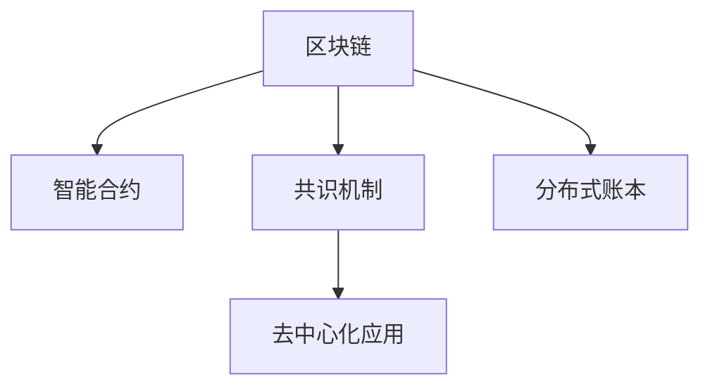

                 

# 区块链技术：去中心化应用开发

> 关键词：区块链,去中心化,智能合约,共识机制,分布式账本,去中心化应用

## 1. 背景介绍

### 1.1 问题由来
随着互联网的快速发展和数字化进程的加速，数字资产、在线交易、供应链管理等场景对安全、透明、可信的记录和交易需求日益增长。传统的中心化解决方案面临着数据隐私、单点故障、信任机制薄弱等诸多问题。区块链技术的出现，通过其去中心化的特性，为这些问题提供了一种全新的解决思路。

区块链技术（Blockchain Technology）是一种分布式账本技术，它通过在多个节点之间分布式记录和验证交易，确保数据的透明性、不可篡改性和安全性。最早由中本聪（Satoshi Nakamoto）在2009年提出，最初用于比特币的数字货币系统。随着技术的发展，区块链已逐渐应用到金融、供应链、医疗、教育等多个领域，推动了去中心化应用（Decentralized Applications, dApps）的兴起。

### 1.2 问题核心关键点
基于区块链的去中心化应用开发（DApp Development），核心关键点包括：

- **去中心化架构**：通过区块链网络实现去中心化存储和计算，减少对中心化服务器的依赖，提高系统的可靠性和安全性。
- **智能合约（Smart Contracts）**：自动化执行的代码片段，在区块链上运行，无需第三方干预即可实现交易、数据存储和逻辑判断等功能。
- **共识机制（Consensus Mechanism）**：确保网络中各节点达成一致的规则和机制，防止数据篡改和双重支付等问题。
- **分布式账本（Distributed Ledger）**：每个节点维护一个完整的账本副本，确保数据的一致性和完整性。
- **隐私保护**：通过密码学算法（如哈希、非对称加密等）保护交易和数据的安全性。

这些核心关键点共同构成了去中心化应用的基础架构和技术体系，使其能够提供传统中心化系统难以实现的特性。

## 2. 核心概念与联系

### 2.1 核心概念概述

为更好地理解基于区块链的去中心化应用开发方法，本节将介绍几个密切相关的核心概念：

- **区块链（Blockchain）**：由多个区块（Block）组成的去中心化分布式账本，每个区块包含一定时间范围内发生的所有交易记录，并通过密码学算法确保不可篡改。
- **智能合约（Smart Contracts）**：运行在区块链上的代码，可实现自动化的交易、逻辑判断和数据存储等功能，其执行过程透明且不可篡改。
- **共识机制（Consensus Mechanism）**：通过分布式算法，确保网络中各节点达成一致的规则和决策，如工作量证明（Proof of Work, PoW）、权益证明（Proof of Stake, PoS）等。
- **去中心化应用（DApps）**：运行在区块链网络上的应用程序，具有去中心化、透明、安全和高效的特点。
- **分布式账本（Distributed Ledger）**：区块链上各节点维护的账本副本，确保数据的一致性和完整性。

这些核心概念之间的逻辑关系可以通过以下Mermaid流程图来展示：



这个流程图展示了大语言模型的核心概念及其之间的关系：

1. 区块链通过共识机制，确保交易和数据的安全性和不可篡改性。
2. 智能合约基于区块链技术，实现自动化的交易逻辑和数据存储。
3. 分布式账本记录并验证交易，确保数据的透明性和一致性。
4. 去中心化应用基于上述区块链技术，提供高效、安全、透明的服务。

## 3. 核心算法原理 & 具体操作步骤

### 3.1 算法原理概述

去中心化应用开发基于区块链技术，主要包括以下几个关键算法和步骤：

- **智能合约编译与部署**：将开发者编写的智能合约代码编译成字节码，并部署到区块链网络中。
- **交易验证与共识**：网络中的各节点对交易进行验证和共识，确保交易的有效性和一致性。
- **状态更新与分布式账本**：根据共识结果，更新区块链上的分布式账本，记录交易信息。
- **状态查询与访问**：用户和应用可以通过查询接口获取区块链上的数据和状态信息。

这些算法和步骤共同构成了去中心化应用开发的核心技术流程，使其能够安全、高效地运行在区块链网络上。

### 3.2 算法步骤详解

以下是去中心化应用开发的具体步骤：

**Step 1: 准备开发环境与工具**

1. **选择区块链平台**：如以太坊（Ethereum）、EOS、Hyperledger等。
2. **安装区块链开发工具**：如Solidity IDE、Truffle、Remix等。
3. **配置区块链节点**：安装并配置区块链节点，确保其正常运行。

**Step 2: 编写智能合约**

1. **设计智能合约功能**：定义智能合约的功能和逻辑，如自动转账、自动化交易、数据存储等。
2. **编写智能合约代码**：使用Solidity等智能合约编程语言编写代码，确保语法正确、逻辑清晰。
3. **进行合约测试**：在测试环境中测试智能合约的功能，确保其正确性和安全性。

**Step 3: 部署智能合约**

1. **编译智能合约**：将Solidity代码编译成字节码。
2. **部署智能合约**：将字节码部署到区块链网络中，生成合约地址。

**Step 4: 编写DApp客户端**

1. **设计用户界面**：设计DApp的前端界面，确保用户体验良好。
2. **编写前端代码**：使用HTML、CSS、JavaScript等技术实现用户界面和交互逻辑。
3. **连接智能合约**：通过API调用智能合约，实现前端与后端的交互。

**Step 5: 测试与优化**

1. **进行全面测试**：在测试环境中测试DApp的功能和性能，确保其稳定性和可靠性。
2. **优化性能**：根据测试结果优化代码，减少交易手续费，提高交易速度。

**Step 6: 上线与维护**

1. **上线DApp**：将DApp部署到生产环境中，供用户使用。
2. **持续维护**：定期检查DApp的运行状态，处理用户反馈和异常情况，确保其正常运行。

### 3.3 算法优缺点

基于区块链的去中心化应用开发具有以下优点：

1. **去中心化与去信任**：避免了中心化服务器的单点故障和信任问题，提高了系统的可靠性和安全性。
2. **透明性与可审计性**：所有交易和数据都公开记录在区块链上，可追溯和审计。
3. **智能合约自动执行**：减少了人为干预，提高了交易和数据的处理速度和准确性。
4. **低交易成本**：基于区块链的交易成本较低，适合处理小额交易。

同时，也存在以下缺点：

1. **性能瓶颈**：区块链的读写速度和吞吐量有限，不适合处理大规模数据和高频交易。
2. **开发门槛高**：需要掌握区块链技术和智能合约编程语言，学习成本较高。
3. **扩展性受限**：当前区块链网络扩展性有限，难以支持大规模应用的部署。
4. **隐私保护问题**：虽然区块链提供了较强的安全性，但在某些场景下仍存在隐私泄露的风险。

### 3.4 算法应用领域

基于区块链的去中心化应用开发在多个领域已得到广泛应用，例如：

- **金融领域**：如去中心化交易所（Decentralized Exchange, DEX）、智能合约借贷、DeFi应用等。
- **供应链管理**：如供应链金融、物流追踪、溯源系统等。
- **身份认证**：如区块链电子身份、去中心化钱包、数字身份认证等。
- **版权保护**：如数字版权管理、版权交易平台、内容溯源等。
- **医疗领域**：如电子病历、药品追溯、医疗数据共享等。

这些应用场景展示了区块链技术的强大潜力，推动了去中心化应用的广泛落地。

## 4. 数学模型和公式 & 详细讲解 & 举例说明

### 4.1 数学模型构建

区块链的数学模型主要涉及密码学算法和共识机制，以下介绍其基本数学模型：

- **哈希函数（Hash Function）**：用于生成唯一的散列值，确保数据不可篡改。常用的哈希算法包括SHA-256、SHA-3等。
- **非对称加密算法（Asymmetric Encryption）**：通过公钥和私钥对数据进行加密和解密，确保数据的安全性。常用的非对称加密算法包括RSA、ECC等。
- **共识机制数学模型**：用于描述网络中各节点达成共识的过程。以工作量证明（PoW）为例，其数学模型如下：

$$
\text{PoW} = \text{hash}(区块链历史数据) < \text{目标值}
$$

其中，`hash`函数生成散列值，`目标值`为预设的难度值，通常设置为一定的0x开头的16进制数。

### 4.2 公式推导过程

以SHA-256哈希算法为例，其基本数学模型为：

$$
H(M) = \text{SHA-256}(M) = \text{Hash}_{256}(M)
$$

其中，`M`为输入的数据，`H(M)`为输出的散列值。SHA-256算法的核心步骤如下：

1. 将`M`表示为比特串，长度为`L`。
2. 将`M`分成512比特的块，填充0使其长度为`L+1`。
3. 将填充后的块`M`分成16个32比特的子块`M_1, M_2, ..., M_{16}`。
4. 通过若干次迭代计算，生成最终散列值`H(M)`。

迭代计算过程如下：

1. 初始化若干个状态变量`W_i`。
2. 对每个子块`M_i`，计算若干个中间变量`A_i, B_i, C_i, D_i`。
3. 对每个中间变量`W_i`，计算新的值`W'_i`。
4. 最终散列值`H(M)`为`W'_i`的拼接。

### 4.3 案例分析与讲解

以以太坊智能合约为例，分析其工作原理和数学模型：

1. **智能合约部署**：以太坊使用Solidity语言编写智能合约，编译后生成字节码，并通过以太坊虚拟机（EVM）运行。
2. **交易验证**：以太坊采用工作量证明（PoW）共识机制，每个节点通过计算哈希值进行工作量竞争，选择第一个计算出有效解的节点进行验证和共识。
3. **状态更新**：根据共识结果，以太坊更新分布式账本，记录交易信息和智能合约状态。
4. **智能合约执行**：当智能合约被调用时，EVM运行其字节码，根据预先定义的逻辑进行计算和操作。

通过上述案例，可以看出，以太坊智能合约的运行过程涉及哈希算法、非对称加密和PoW共识机制，确保了交易的安全性和不可篡改性。

## 5. 项目实践：代码实例和详细解释说明

### 5.1 开发环境搭建

在进行区块链开发之前，需要准备好开发环境。以下是使用Solidity进行以太坊智能合约开发的环境配置流程：

1. **安装Node.js**：从官网下载并安装Node.js，用于安装和管理区块链开发工具。
2. **安装Ganache**：从官网下载并安装Ganache，用于本地测试智能合约。
3. **配置开发工具**：安装并配置Solidity IDE、Truffle等开发工具。

### 5.2 源代码详细实现

下面以智能合约实现自动转账功能为例，给出使用Solidity进行以太坊智能合约开发的PyTorch代码实现。

首先，定义智能合约代码：

```solidity
pragma solidity ^0.6.0;

contract AutoTransfer {
    address payable public owner;
    uint256 public threshold;
    
    constructor(address payable _owner, uint256 _threshold) {
        owner = _owner;
        threshold = _threshold;
        owner.transfer(owner.balance);
    }
    
    function transfer(address payable _to, uint256 _value) public {
        require(owner == msg.sender);
        require(_value > 0);
        require(msg.value > 0);
        
        uint256 totalValue = msg.value + _value;
        require(totalValue >= threshold);
        
        payable(msg.sender).transfer(totalValue);
        payable(_to).transfer(_value);
    }
}
```

然后，进行智能合约编译和部署：

1. **编写编译器指令**：在命令行中执行`truffle compile`命令，编译智能合约。
2. **部署智能合约**：在Ganache中创建新账户，并在命令行中执行`truffle migrate`命令，将智能合约部署到Ganache网络中。

### 5.3 代码解读与分析

让我们再详细解读一下关键代码的实现细节：

**AutoTransfer合约代码**：
- `pragma solidity`：指定Solidity版本。
- `constructor`方法：初始化合约，接收转账门限值，将初始余额转移给合约所有者。
- `transfer`方法：实现自动转账功能，需要满足一定的转账门槛。

**编译与部署过程**：
- `truffle compile`：编译智能合约，生成字节码。
- `truffle migrate`：部署智能合约，生成合约地址。

**前端交互**：
1. **编写前端界面**：使用HTML、CSS、JavaScript等技术实现用户界面和交互逻辑。
2. **连接智能合约**：通过API调用智能合约的`transfer`方法，实现自动转账功能。

完成上述步骤后，即可在Ganache环境中测试智能合约的功能。

### 5.4 运行结果展示

在Ganache中创建两个账户，并进行如下操作：

1. **初始化合约**：使用`truffle migrate`命令部署合约，设置转账门槛为`100`。
2. **发起转账**：使用第一个账户调用`transfer`方法，将`50`个以太币转移给第二个账户，并设置`50`个以太币的转账门槛。
3. **验证结果**：通过Ganache界面查看交易记录和账户余额，确认转账成功。

## 6. 实际应用场景

### 6.1 智能合约借贷

基于区块链的去中心化应用开发在金融领域得到了广泛应用。智能合约借贷（DeFi Lending）通过智能合约自动执行借贷逻辑，实现了去中心化、透明、自动化的借贷服务。

以 Compound 为例，其智能合约借贷平台允许用户自动借入和借出以太币，并通过智能合约自动计算利息。用户只需在平台上注册账户，设置借入和借出金额，系统即可自动执行借贷操作。这种去中心化的借贷方式，不仅降低了交易成本，还提高了借贷的效率和透明度。

### 6.2 供应链金融

区块链的去中心化特性，使其在供应链金融中具有独特优势。通过智能合约和区块链技术，可以实现供应链各环节的透明化、去中介化和自动化管理。

以IBM和Linux基金会共同开发的TradeLens项目为例，其智能合约和区块链系统实现了货物追踪、单据管理、融资等功能。通过区块链的不可篡改性，确保了货物和交易记录的真实性，提高了供应链的效率和可信度。

### 6.3 数字身份认证

去中心化身份认证（Decentralized Identity, DId）通过区块链技术，提供了一种安全的数字身份解决方案，避免了中心化身份认证系统的单点故障和隐私泄露风险。

以Huobi数字身份认证系统为例，其智能合约和区块链系统实现了用户身份的注册、验证和授权。用户通过区块链钱包生成私钥和公钥，并在智能合约中注册身份信息。平台使用哈希函数和数字签名算法，确保身份信息的安全性和不可篡改性。

### 6.4 未来应用展望

随着区块链技术的不断发展和应用场景的拓展，未来去中心化应用开发将呈现以下几个发展趋势：

1. **跨链技术发展**：跨链技术的发展将打破区块链网络的孤岛效应，实现不同区块链之间的互联互通，提高系统的可扩展性和互操作性。
2. **二层解决方案优化**：二层解决方案（Layer 2）如Rollup、Plasma等，通过将交易批量处理，大幅提高区块链的吞吐量和扩展性，解决当前的性能瓶颈问题。
3. **DeFi生态建设**：DeFi生态的不断完善，将推动区块链在金融领域的应用，实现去中心化金融服务的全面普及。
4. **智能合约优化**：智能合约的性能和安全性不断提升，新的语言和工具不断涌现，将进一步推动去中心化应用开发。
5. **多方协作模式**：多方协作模式（Multi-Party Computation, MPC）结合区块链技术，实现了多方参与的安全计算，为复杂的业务场景提供了解决方案。

这些趋势将推动区块链技术的不断进步，促进去中心化应用开发在更多领域的应用。

## 7. 工具和资源推荐

### 7.1 学习资源推荐

为了帮助开发者系统掌握区块链技术和去中心化应用开发，这里推荐一些优质的学习资源：

1. **《区块链技术与应用》**：一本系统介绍区块链技术原理和应用的书籍，适合初学者入门。
2. **《Solidity编程语言》**：一本详细介绍Solidity智能合约编程语言的书籍，适合开发者学习智能合约开发。
3. **《以太坊官方文档》**：以太坊官方提供的开发文档，涵盖智能合约开发、DApp部署、交易验证等方面的详细信息。
4. **《DeFi全栈开发指南》**：一本详细介绍DeFi应用开发和部署的书籍，适合开发者学习DeFi应用开发。
5. **《Blockchain for Developers》**：一本详细介绍区块链技术和开发的书籍，适合开发者系统学习区块链技术。

通过对这些资源的学习实践，相信你一定能够快速掌握区块链技术和去中心化应用开发的核心内容，并用于解决实际的区块链问题。

### 7.2 开发工具推荐

高效的开发离不开优秀的工具支持。以下是几款用于区块链开发和去中心化应用开发的常用工具：

1. **Solidity IDE**：如Remix，用于智能合约编写和调试。
2. **Truffle**：一款智能合约开发和测试框架，支持多种区块链平台。
3. **Ganache**：一款本地区块链测试工具，用于测试智能合约和区块链网络。
4. **Metamask**：一款区块链钱包，支持以太坊等区块链平台，方便开发者进行交易和管理。
5. **IPFS**：一种分布式文件存储系统，用于实现区块链数据的分布式存储和访问。

合理利用这些工具，可以显著提升区块链开发和去中心化应用开发的效率，加快创新迭代的步伐。

### 7.3 相关论文推荐

区块链技术的发展离不开学界的持续研究。以下是几篇奠基性的相关论文，推荐阅读：

1. **《比特币：一种点对点电子现金系统》**：中本聪（Satoshi Nakamoto）撰写的比特币白皮书，介绍了比特币系统的基本原理和机制。
2. **《以太坊白皮书》**：以太坊的创始人Vitalik Buterin撰写的以太坊白皮书，介绍了以太坊的共识机制和智能合约技术。
3. **《PoS共识机制原理与实现》**：一篇详细介绍权益证明（PoS）共识机制原理和实现的论文。
4. **《跨链技术综述》**：一篇详细介绍跨链技术原理和应用的综述论文。
5. **《智能合约安全分析与防护》**：一篇详细介绍智能合约安全分析与防护的论文，揭示了智能合约常见的安全漏洞和防护方法。

这些论文代表了大语言模型微调技术的发展脉络。通过学习这些前沿成果，可以帮助研究者把握学科前进方向，激发更多的创新灵感。

## 8. 总结：未来发展趋势与挑战

### 8.1 总结

本文对基于区块链的去中心化应用开发方法进行了全面系统的介绍。首先阐述了区块链技术和去中心化应用开发的研究背景和意义，明确了大语言模型微调在拓展区块链应用边界、提升系统性能方面的独特价值。其次，从原理到实践，详细讲解了智能合约编译与部署、交易验证与共识、状态更新与分布式账本等核心技术流程，给出了智能合约开发和DApp部署的完整代码实例。同时，本文还广泛探讨了智能合约在金融、供应链、数字身份等诸多领域的应用前景，展示了去中心化应用开发的巨大潜力。

通过本文的系统梳理，可以看到，基于区块链的去中心化应用开发技术正在成为金融、供应链、医疗等多个领域的重要范式，极大地拓展了区块链技术的应用边界，催生了更多的落地场景。得益于区块链技术的开放性和可扩展性，未来去中心化应用开发必将进一步推动传统行业数字化转型升级，带来新的技术变革和商业机会。

### 8.2 未来发展趋势

展望未来，区块链技术将呈现以下几个发展趋势：

1. **去中心化生态体系建设**：随着区块链技术的不断成熟，去中心化生态体系将逐渐完善，促进区块链在更多领域的应用。
2. **跨链互操作性提升**：跨链互操作性技术将不断提升，实现不同区块链之间的互联互通，提高系统的可扩展性和互操作性。
3. **DeFi生态多样化**：DeFi生态将进一步扩展，涵盖更多金融应用场景，如稳定币、保险、去中心化交易所等。
4. **智能合约自动化水平提高**：智能合约的自动化水平将进一步提高，推动更多的自动化业务流程的实现。
5. **隐私保护与匿名性增强**：隐私保护和匿名性技术将不断提升，保护用户数据的安全和隐私。
6. **分布式身份认证普及**：数字身份认证技术将逐步普及，为用户提供安全、便捷的身份认证服务。

这些趋势将推动区块链技术的不断进步，促进去中心化应用开发在更多领域的应用。

### 8.3 面临的挑战

尽管区块链技术已经取得了瞩目成就，但在迈向更加智能化、普适化应用的过程中，它仍面临着诸多挑战：

1. **扩展性瓶颈**：区块链的读写速度和吞吐量有限，难以支持大规模应用和海量数据的处理。
2. **性能优化**：现有的区块链技术在性能上仍有不足，需要进一步优化。
3. **共识机制的公平性**：一些共识机制（如PoW）面临中心化、能源消耗高的问题，需要新的共识机制来替代。
4. **隐私保护问题**：区块链技术在隐私保护方面仍存在一定的局限性，需要进一步提升。
5. **法律与监管问题**：区块链技术的快速发展对现有法律和监管体系提出了新的挑战，需要制定相应的法律法规。

### 8.4 研究展望

面对区块链技术面临的种种挑战，未来的研究需要在以下几个方面寻求新的突破：

1. **跨链互操作性研究**：研究跨链互操作性技术，实现不同区块链之间的安全、高效的数据交换和协同。
2. **共识机制创新**：开发新的共识机制，提高系统的去中心化程度和性能，降低能源消耗。
3. **智能合约优化**：开发更高效的智能合约语言和工具，提高智能合约的性能和安全性。
4. **隐私保护技术研究**：研究新的隐私保护技术，提高区块链技术的隐私保护能力。
5. **区块链治理研究**：研究区块链治理模型和机制，制定合理的区块链法律法规。

这些研究方向将推动区块链技术向更高的台阶发展，为去中心化应用开发提供新的突破口。

## 9. 附录：常见问题与解答

**Q1：区块链和中心化系统的区别是什么？**

A: 区块链通过去中心化的分布式账本，避免了中心化系统的单点故障和信任问题。区块链上的所有交易和数据公开记录，透明且不可篡改。而中心化系统则依赖单一的服务器进行数据存储和处理，容易受到攻击，数据安全性较低。

**Q2：智能合约有哪些常见安全漏洞？**

A: 智能合约常见的安全漏洞包括重入攻击、溢出攻击、代码漏洞等。重入攻击是指在合约执行过程中，攻击者通过不断调用其他合约，导致合约陷入无限循环；溢出攻击是指合约内存不足，导致数据溢出；代码漏洞则是指合约中的逻辑漏洞，如未处理异常、未授权访问等。

**Q3：智能合约开发过程中有哪些常见问题？**

A: 智能合约开发过程中常见的问题包括代码复杂度高、调试困难、跨平台兼容性问题等。由于智能合约的代码需要在不同的区块链平台上运行，需要对其进行测试和优化，以确保其正确性和稳定性。

**Q4：区块链的发展前景如何？**

A: 区块链技术的发展前景广阔。随着去中心化生态体系的不断完善和跨链互操作性技术的提升，区块链将逐渐普及到各个领域，推动传统行业的数字化转型升级。同时，区块链的隐私保护、智能合约等技术也将不断进步，带来更多创新应用场景。

**Q5：区块链技术在实际应用中面临哪些挑战？**

A: 区块链技术在实际应用中面临的主要挑战包括扩展性瓶颈、性能优化、共识机制的公平性、隐私保护问题以及法律与监管问题。需要进一步研究和创新，解决这些问题，推动区块链技术的广泛应用。

---

作者：禅与计算机程序设计艺术 / Zen and the Art of Computer Programming

