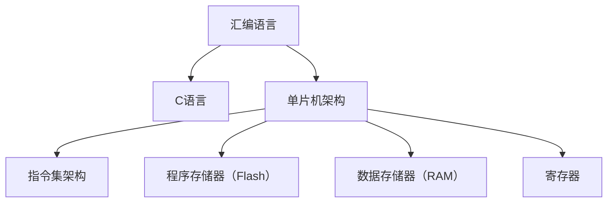

                 

## 1. 背景介绍

### 1.1 问题由来

现代电子设备对计算效率和速度的需求日益增加，传统的基于PC架构的计算方式已无法满足这些需求。嵌入式系统、物联网设备、工业控制等场景要求硬件资源有限且实时性强，因此对计算芯片的性能和效率提出了更高要求。为了适应这种需求，单片机应运而生。

单片机（Microcontroller Unit，MCU）是将CPU、存储器、外设等多种功能集成在一个芯片上的微控制器。它们广泛应用于汽车电子、智能家居、工业自动化等领域。单片机编程通常使用汇编语言或高级语言，其中汇编语言因其性能优越，在实时性要求高的场景中被广泛采用。

### 1.2 问题核心关键点

单片机编程的关键在于理解硬件架构和指令集，以及如何在有限的资源下实现高效的程序设计。汇编语言直接操作计算机硬件，可以实现更加精细的指令控制，但难度较高且不易维护。C语言作为高级语言，提供了一层抽象，便于开发复杂应用，但性能略逊于汇编语言。

如何平衡性能和开发效率，如何在不同场景中灵活运用编程语言，以及如何应对单片机编程中遇到的常见问题，成为本节讨论的核心。

## 2. 核心概念与联系

### 2.1 核心概念概述

为更好地理解单片机编程，本节将介绍几个关键概念：

- **汇编语言**：一种低级编程语言，与机器语言直接对应，可实现高效的程序执行。
- **C语言**：一种广泛应用于嵌入式系统的高级编程语言，提供抽象的编程接口。
- **单片机**：集成CPU、存储器和外设等多种功能的微控制器。
- **指令集架构**：定义单片机可以执行的所有指令，以及它们的编码格式。
- **程序存储器（Flash）**：用于存储程序代码的只读存储器，支持随机访问。
- **数据存储器（RAM）**：用于存储变量的随机访问存储器，支持读写操作。
- **寄存器**：单片机内部的高速缓存，用于存储程序中的关键数据和指令。

这些核心概念构成了单片机编程的基础，理解它们有助于开发高效且可靠的程序。

### 2.2 核心概念原理和架构的 Mermaid 流程图



这个流程图展示了单片机编程中涉及的关键概念及其之间的关系：

- 汇编语言和C语言都可以用于单片机编程，汇编语言与机器语言直接对应，C语言提供更高层的抽象。
- 单片机架构定义了硬件组成，包括指令集架构、程序存储器和数据存储器。
- 程序存储器用于存储程序代码，数据存储器用于存储变量。
- 寄存器是单片机内部用于存储关键数据和指令的高速缓存。

## 3. 核心算法原理 & 具体操作步骤

### 3.1 算法原理概述

单片机编程的算法原理主要涉及指令集的理解和程序优化。汇编语言需要精确控制指令的执行顺序和数据流向，而C语言则需要考虑如何通过高级语言特性实现高效的代码结构。

### 3.2 算法步骤详解

#### 3.2.1 汇编语言编程步骤

1. **选择单片机型号**：根据应用需求选择适合的单片机型号，如AVR、ARM、MIPS等。
2. **设计程序逻辑**：确定程序的主要功能模块和算法流程。
3. **编写汇编代码**：根据单片机指令集编写汇编代码，实现程序逻辑。
4. **调试和优化**：使用仿真器或实际硬件调试程序，优化代码性能和可维护性。

#### 3.2.2 C语言编程步骤

1. **选择开发环境**：根据单片机型号选择合适的开发环境，如GCC、Keil、IAR等。
2. **设计程序逻辑**：与汇编语言类似，确定程序的主要功能模块和算法流程。
3. **编写C代码**：使用C语言实现程序逻辑，利用函数和结构体等抽象概念简化代码。
4. **编译和链接**：使用开发环境将C代码编译为单片机可执行代码，并进行链接处理。
5. **调试和优化**：使用仿真器或实际硬件调试程序，优化代码性能和可维护性。

### 3.3 算法优缺点

#### 3.3.1 汇编语言优点

- **高效性**：汇编语言直接操作硬件，可以实现极高的指令执行效率。
- **精确控制**：汇编语言可以精确控制每个指令的执行细节，适用于低级硬件编程。

#### 3.3.2 汇编语言缺点

- **难度高**：汇编语言需要深入理解硬件架构和指令集，开发难度较大。
- **可读性差**：汇编代码难以阅读和理解，维护性较差。

#### 3.3.3 C语言优点

- **可读性好**：C语言提供抽象编程接口，代码易于阅读和理解。
- **开发效率高**：C语言支持函数和结构体等高级特性，便于模块化开发。

#### 3.3.4 C语言缺点

- **性能稍逊**：与汇编语言相比，C语言的执行效率稍低，但通常可以满足实际需求。
- **资源消耗较大**：C语言程序的内存占用较大，需要合理管理内存资源。

### 3.4 算法应用领域

汇编语言和C语言在单片机编程中都有广泛的应用：

- **实时控制**：在需要精确控制硬件的实时系统，如传感器、控制器等，汇编语言是首选。
- **数据处理**：在数据密集型应用中，如加密算法、信号处理等，C语言提供更好的性能和灵活性。
- **系统编程**：在操作系统和嵌入式系统编程中，C语言作为系统编程语言，是主流选择。

## 4. 数学模型和公式 & 详细讲解 & 举例说明

### 4.1 数学模型构建

单片机编程的数学模型主要涉及指令集和存储器模型的构建。假设单片机型号为AVR，程序存储器容量为32KB，数据存储器容量为1KB。

### 4.2 公式推导过程

#### 4.2.1 程序存储器模型

假设程序存储器容量为32KB，每个字节（byte）可存储数据。程序存储器的地址空间为0x0000至0xFFFF。

- **存储单元地址计算**：使用偏移量表示程序存储器中的地址，即$0x0000 + offset$，其中$offset$为偏移量。
- **存储单元访问**：使用指针或偏移量访问程序存储器中的数据。

#### 4.2.2 数据存储器模型

假设数据存储器容量为1KB，每个字节可存储数据。数据存储器的地址空间为0x0000至0x0FFF。

- **存储单元地址计算**：使用偏移量表示数据存储器中的地址，即$0x0000 + offset$，其中$offset$为偏移量。
- **存储单元访问**：使用指针或偏移量访问数据存储器中的数据。

### 4.3 案例分析与讲解

#### 4.3.1 循环计数器

假设程序需要实现一个简单的循环计数器，计数范围为0~9。使用汇编语言和C语言分别编写代码，并进行对比分析。

##### 汇编语言实现

```assembly
LOOP:
    PUSHZ PC
    LDS R0, [0x0100]
    STZ R0
    CMP R0, 0x09
    JLE LOOP
```

- **代码解释**：
  - 使用`PUSHZ PC`将程序计数器（PC）的值压入堆栈。
  - 使用`LDS R0, [0x0100]`将0x0100处的程序存储器内容加载到寄存器R0中。
  - 使用`STZ R0`将寄存器R0的值存回程序存储器0x0100处。
  - 使用`CMP R0, 0x09`比较R0与0x09的大小关系。
  - 使用`JLE LOOP`在R0小于等于0x09时跳转到LOOP标签。

##### C语言实现

```c
#include <avr/io.h>

int main(void) {
    uint8_t counter = 0;
    while (counter <= 9) {
        *(volatile uint8_t*)0x0100 = counter;
        counter++;
    }
    return 0;
}
```

- **代码解释**：
  - 使用`uint8_t`定义计数器变量`counter`。
  - 使用`while`循环实现计数器循环。
  - 使用`*(volatile uint8_t*)0x0100`访问程序存储器0x0100处的地址，将`counter`的值存储到该地址中。

##### 对比分析

- **性能**：汇编语言实现略优于C语言实现，因为汇编语言更接近硬件，能够直接操作内存地址。
- **可读性和可维护性**：C语言实现更易于阅读和维护，因为使用了高级语言特性。

## 5. 项目实践：代码实例和详细解释说明

### 5.1 开发环境搭建

#### 5.1.1 硬件环境

- **单片机开发板**：如AVR、ARM等型号的开发板。
- **仿真器**：Keil、IAR等集成开发环境（IDE）。

#### 5.1.2 软件环境

- **编译器**：GCC、Keil等编译器。
- **调试器**：GDB、OpenOCD等调试工具。

### 5.2 源代码详细实现

#### 5.2.1 汇编语言实现

```assembly
; AVR汇编语言代码
; 定义程序入口
ENTRY:
    ; 初始化程序计数器
    PC = 0x1000
    ; 初始化数据指针
    DPTR = 0x0100
    ; 跳转到主函数
    CALL main
    ; 设置标志寄存器
    SET_EI
    ; 进入无限循环
    LOOP:
        ; 这里放置循环体代码
        ; 跳转到LOOP标签
        JMP LOOP
```

- **代码解释**：
  - `ENTRY:`定义程序入口。
  - `PC = 0x1000`初始化程序计数器PC。
  - `DPTR = 0x0100`初始化数据指针DPTR。
  - `CALL main`调用主函数。
  - `SET_EI`设置全局中断使能。
  - `JMP LOOP`进入无限循环。

#### 5.2.2 C语言实现

```c
// AVR C语言代码
#include <avr/io.h>

void main(void) {
    // 初始化程序计数器和数据指针
    PC = 0x1000;
    DPTR = 0x0100;
    
    // 进入主函数
    main();
    
    // 设置标志寄存器
    SET_EI();
    
    // 进入无限循环
    for (; ;);
}
```

- **代码解释**：
  - `main(void)`定义主函数。
  - `PC = 0x1000`初始化程序计数器PC。
  - `DPTR = 0x0100`初始化数据指针DPTR。
  - `main()`调用主函数。
  - `SET_EI()`设置全局中断使能。
  - `for (; ;)`进入无限循环。

### 5.3 代码解读与分析

#### 5.3.1 汇编语言代码解读

- **初始化PC和DPTR**：确保程序和数据指针正确初始化。
- **调用主函数**：将控制权交给主函数。
- **设置中断使能**：使能全局中断，以处理中断请求。
- **进入无限循环**：确保程序不会终止。

#### 5.3.2 C语言代码解读

- **初始化PC和DPTR**：确保程序和数据指针正确初始化。
- **调用主函数**：将控制权交给主函数。
- **设置中断使能**：使能全局中断，以处理中断请求。
- **进入无限循环**：确保程序不会终止。

#### 5.3.3 代码差异

- **汇编语言**：指令直接操作硬件，代码紧凑，但可读性较差。
- **C语言**：提供高级抽象，易于阅读和维护，但执行效率稍低。

### 5.4 运行结果展示

#### 5.4.1 汇编语言

- **编译和链接**：使用编译器将汇编代码编译为可执行文件，并进行链接处理。
- **运行结果**：单片机运行程序，进入无限循环，保持程序稳定运行。

#### 5.4.2 C语言

- **编译和链接**：使用编译器将C代码编译为可执行文件，并进行链接处理。
- **运行结果**：单片机运行程序，进入无限循环，保持程序稳定运行。

## 6. 实际应用场景

### 6.1 工业控制

单片机在工业控制中的应用非常广泛，如PLC（可编程逻辑控制器）、DCS（分布式控制系统）等。汇编语言和C语言在工业控制中都有广泛应用。

#### 6.1.1 汇编语言

在实时性要求高的场景，如电机控制、信号采集等，汇编语言因其高效性和精确控制被广泛应用。

#### 6.1.2 C语言

在需要复杂算法和数据处理的应用中，如传感器数据处理、数据采集等，C语言提供更好的性能和灵活性。

### 6.2 嵌入式系统

嵌入式系统广泛应用于智能家居、汽车电子等领域，汇编语言和C语言在嵌入式系统开发中都有广泛应用。

#### 6.2.1 汇编语言

在需要精确控制硬件的实时系统，如传感器、控制器等，汇编语言是首选。

#### 6.2.2 C语言

在数据密集型应用中，如加密算法、信号处理等，C语言提供更好的性能和灵活性。

### 6.3 数据采集

数据采集系统需要高效的数据处理和实时性，汇编语言和C语言在数据采集中都有广泛应用。

#### 6.3.1 汇编语言

在实时性要求高的场景，如工业传感器、医疗设备等，汇编语言因其高效性和精确控制被广泛应用。

#### 6.3.2 C语言

在需要复杂算法和数据处理的应用中，如传感器数据处理、数据采集等，C语言提供更好的性能和灵活性。

## 7. 工具和资源推荐

### 7.1 学习资源推荐

#### 7.1.1 汇编语言

1. **《AVR汇编语言程序设计》**：介绍AVR单片机的汇编语言编程，适合初学者学习。
2. **《嵌入式汇编语言编程》**：涵盖嵌入式系统的汇编语言编程，提供丰富的实例和练习。

#### 7.1.2 C语言

1. **《C语言程序设计》**：介绍C语言的编程基础，适合初学者学习。
2. **《嵌入式C语言编程》**：涵盖嵌入式系统的C语言编程，提供丰富的实例和练习。

### 7.2 开发工具推荐

#### 7.2.1 汇编语言

1. **AVR Studio**：Keil开发的AVR单片机IDE，提供集成的开发环境。
2. **GCC**：开源编译器，支持多种目标平台，包括AVR单片机。

#### 7.2.2 C语言

1. **Keil MDK**：Keil开发的C语言IDE，支持多种单片机平台。
2. **IAR Embedded Workbench**：IAR开发的C语言IDE，支持多种单片机平台。

### 7.3 相关论文推荐

#### 7.3.1 汇编语言

1. **《AVR单片机汇编语言程序设计》**：介绍AVR单片机的汇编语言编程，提供详细的实例和代码。
2. **《嵌入式系统汇编语言编程》**：涵盖嵌入式系统的汇编语言编程，提供丰富的实例和练习。

#### 7.3.2 C语言

1. **《C语言程序设计》**：介绍C语言的编程基础，提供详细的实例和代码。
2. **《嵌入式系统C语言编程》**：涵盖嵌入式系统的C语言编程，提供丰富的实例和练习。

## 8. 总结：未来发展趋势与挑战

### 8.1 研究成果总结

单片机编程的汇编语言和C语言各有优劣，两者在实际应用中应根据具体需求灵活选择。汇编语言因其高效性和精确控制，适用于实时性和精度要求高的场景；C语言因其可读性和开发效率，适用于复杂算法和数据处理的应用。

### 8.2 未来发展趋势

未来单片机编程将更加注重硬件优化和性能提升，同时在开发效率和可维护性方面也有新的要求。随着AI和物联网技术的不断发展，单片机将越来越多地应用于智能家居、工业控制等场景，对编程的灵活性和可扩展性提出更高的要求。

### 8.3 面临的挑战

单片机编程面临的挑战主要集中在硬件优化和资源管理上：

1. **硬件优化**：单片机硬件资源有限，如何设计高效的算法和数据结构，实现最优的硬件利用率。
2. **资源管理**：单片机内存资源有限，如何合理分配和管理内存，避免内存泄漏和资源浪费。
3. **实时性要求**：单片机系统需要实时响应，如何在保证实时性的前提下，优化代码性能和可读性。

### 8.4 研究展望

未来单片机编程的研究方向将主要集中在以下几个方面：

1. **硬件加速**：利用硬件加速器，如DSP、GPU等，提高单片机的计算性能。
2. **优化编译器**：开发更加高效的编译器，进一步提升代码执行效率。
3. **编程语言扩展**：设计更适合单片机编程的语言特性，提高开发效率和可读性。
4. **跨平台开发**：实现单片机编程的跨平台开发，简化开发流程，提高开发效率。

## 9. 附录：常见问题与解答

### 9.1 常见问题

#### Q1: 汇编语言和C语言有什么区别？

A1: 汇编语言是低级编程语言，直接操作硬件；C语言是高级编程语言，提供抽象的编程接口。

#### Q2: 单片机编程常用的编译器有哪些？

A2: 单片机编程常用的编译器有GCC、Keil、IAR等。

#### Q3: 单片机编程中如何实现高效的算法？

A3: 单片机编程中，高效的算法设计需要考虑硬件资源有限的特点，使用位运算、查表等硬件友好的技术。

#### Q4: 单片机编程中如何进行数据存储和访问？

A4: 单片机编程中，程序存储器和数据存储器分别用于存储程序代码和变量。程序存储器采用只读方式，数据存储器采用读写方式。数据存储器访问可以使用指针或偏移量进行。

#### Q5: 单片机编程中如何进行调试和优化？

A5: 单片机编程中，可以使用仿真器或实际硬件进行调试，优化代码性能和可维护性。

---

作者：禅与计算机程序设计艺术 / Zen and the Art of Computer Programming

