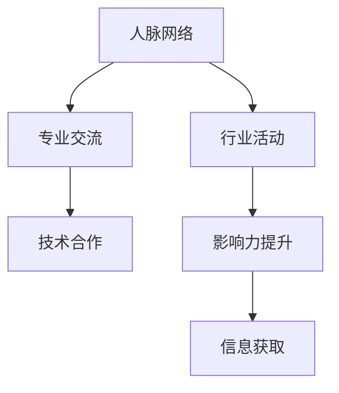

                 

# 参与行业活动：扩大人脉网络和影响力

> 关键词：网络建设, 人脉扩展, 行业影响, 专业交流, 技术合作

## 1. 背景介绍

### 1.1 问题由来
在信息技术迅猛发展的当下，个体和企业的成功在很大程度上取决于其能否在复杂的社会和商业网络中建立并有效利用人脉关系。人脉网络不仅仅是一种社会资源，更是推动技术创新、业务发展的重要力量。然而，构建和管理一个高效、有价值的人脉网络并非易事。如何在技术领域中有效地扩展人脉和影响力，是每个从业者面临的挑战。

### 1.2 问题核心关键点
构建人脉网络和影响力的关键在于：
1. 识别和连接行业内的关键人物。
2. 建立和维护长期、稳定的人脉关系。
3. 通过人脉网络获取有价值的信息和资源。
4. 利用人脉网络提升个人和企业的专业形象和影响力。

## 2. 核心概念与联系

### 2.1 核心概念概述

为更好地理解如何通过参与行业活动来扩展人脉网络和影响力，本节将介绍几个密切相关的核心概念：

- **人脉网络（Networking）**：指由个体或企业构建的社会关系网络，通过各种社交活动、会议、研讨会等途径形成。良好的人脉网络可以提供信息、资源、合作机会等，对个体和企业的成长至关重要。

- **影响力（Influence）**：指一个人在特定领域或群体中的号召力和控制力，影响他人的思维、行为和决策。影响力的大小通常与个人的知识、经验和信誉相关。

- **行业活动（Industry Event）**：指在特定技术或商业领域中举办的会议、研讨会、展览、工作坊等活动，是交流、分享、学习的重要场所。

- **专业交流（Professional Interaction）**：指在行业活动中与其他专业人士的互动，包括面对面交流、线上沟通、合作项目等。

- **技术合作（Technical Collaboration）**：指通过人脉网络，与他人或团队合作开发新技术、解决技术难题、分享技术成果等，以实现技术共享和共同进步。

这些核心概念之间的逻辑关系可以通过以下Mermaid流程图来展示：



这个流程图展示了你通过参与行业活动，进而建立人脉、进行交流、实现合作，最终提升影响力的一般流程。

## 3. 核心算法原理 & 具体操作步骤
### 3.1 算法原理概述

构建人脉网络和提升影响力的过程，本质上是一种动态的社交网络优化和影响力扩散过程。其核心思想是：通过在行业活动中积极参与和互动，不断扩大人脉网络，增强自身影响力。

形式化地，假设你在当前人脉网络中的影响力为 $I$，行业活动后的影响力为 $I'$。设 $N$ 为行业活动中的关键人物集合，$E$ 为参与活动后的新增连接数，则影响力提升的模型可以表示为：

$$
I' = f(I, N, E)
$$

其中 $f$ 为一个复杂的函数，涉及人脉网络的性质、关键人物的影响力、新增连接数等多种因素。

### 3.2 算法步骤详解

构建人脉网络和提升影响力的具体操作步骤如下：

**Step 1: 识别关键人物和活动**
- 识别行业内的关键人物，包括但不限于技术大咖、学术权威、行业领袖等。
- 选择高质量、高影响力的行业活动，如国际会议、专业论坛、技术峰会等。

**Step 2: 参与和互动**
- 积极参与行业活动，通过演讲、论文发表、讨论等方式展现自身专业能力。
- 主动与关键人物交流，交换名片、建立联系，并保持定期沟通。
- 关注并参与在线社区、专业群组等线上交流平台，扩大线上人脉。

**Step 3: 提供价值**
- 分享技术见解、研究成果，帮助他人解决问题，树立专业形象。
- 提供咨询、技术支持、项目合作等，展示自身能力和诚信。

**Step 4: 维护和拓展**
- 定期更新个人资料和项目，保持活跃度和可见性。
- 通过已有联系人介绍，拓展新联系人，丰富人脉网络。
- 不断参加更高层次的活动，与更多层次的联系人建立联系。

### 3.3 算法优缺点

通过参与行业活动构建人脉网络和提升影响力的方式具有以下优点：
1. 直接有效。通过面对面或线上交流，能够快速建立深度联系。
2. 广泛覆盖。在活动环境中，可以同时接触多个领域的专业人士。
3. 资源丰富。活动通常伴随着丰富的技术分享、案例分析、合作机会等资源。
4. 提升信任。直接互动有助于建立信任关系，长远合作更具稳定性。

同时，该方法也存在一定的局限性：
1. 活动质量依赖。行业活动的质量和参与度直接影响人脉建设的效果。
2. 时间成本高。高水平的活动往往需要大量时间准备和参与，对于忙碌的从业者可能不太现实。
3. 关系维系难。长时间不维护，人脉关系容易变得生疏。

尽管存在这些局限性，但参与行业活动仍然是扩展人脉和提升影响力的重要手段。通过有意识地选择合适的活动，积极参与并持续维护，可以显著提升个人和企业在技术领域的影响力。

### 3.4 算法应用领域

人脉网络和影响力提升的方法在各行各业中都有广泛应用，尤其是在技术领域，具体应用包括但不限于：

- 软件开发：通过参加技术峰会、开源社区会议，结识其他开发者和项目，提升自身技术影响力和项目合作机会。
- 数据科学：在数据分析、机器学习、人工智能等领域，通过参与行业研讨会、数据竞赛，分享研究成果，扩大影响力。
- 网络安全：在安全会议、技术沙龙中展示最新的安全研究成果，结识同行，建立合作关系。
- 物联网：在物联网峰会、技术展览中展示物联网产品，获取反馈，拓展行业联系人。
- 云计算：在云计算大会、技术交流会中，分享云计算技术，获取新客户和合作机会。

除了这些具体领域，人脉网络和影响力提升的方法还可以广泛应用于教育、咨询、媒体等多个行业，促进跨界交流和合作。

## 4. 数学模型和公式 & 详细讲解 & 举例说明

### 4.1 数学模型构建

在构建人脉网络和提升影响力的过程中，可以建立一个数学模型来描述这种动态关系。假设你的人脉网络由 $n$ 个节点组成，每个节点代表一个联系人，记为 $V=\{v_1, v_2, ..., v_n\}$。每个节点 $v_i$ 的初始影响力记为 $I_{v_i}$，参与行业活动后的影响力提升为 $I_{v_i}'$。

定义节点间的连接数为 $E$，行业活动引入的新连接数为 $E'$。则节点 $v_i$ 的影响力提升公式可以表示为：

$$
I_{v_i}' = I_{v_i} + k \times \sum_{v_j \in V} A(v_i, v_j) \times I_{v_j}'
$$

其中，$k$ 为影响力传播系数，$A(v_i, v_j)$ 为节点 $v_i$ 和 $v_j$ 之间的连接强度。连接强度可以由共同参加的活动数量、互动频率、社交媒体互动等指标综合计算得到。

### 4.2 公式推导过程

为了简化问题，假设所有节点初始影响力相同，即 $I_{v_i} = I_0$。则上述公式可以进一步简化为：

$$
I_{v_i}' = I_0 + k \times \frac{E'}{n} \times \bar{I}'
$$

其中，$\bar{I}'$ 为所有新连接后的平均影响力。这表明，新的影响力主要取决于新引入的连接数 $E'$ 和现有节点的平均影响力 $\bar{I}'$。

### 4.3 案例分析与讲解

假设你在一个有 $n=100$ 人的小网络中，初始影响力 $I_0=1$，影响力传播系数 $k=0.5$。参加一个行业活动，引入 $E'=20$ 个新连接，所有新连接的平均影响力 $\bar{I}'=1.2$。则你参与活动后的影响力提升为：

$$
I_{v_i}' = 1 + 0.5 \times \frac{20}{100} \times 1.2 = 1.06
$$

这表明，通过参与活动，你的影响力提高了约6%。

## 5. 项目实践：代码实例和详细解释说明

### 5.1 开发环境搭建

为了模拟上述数学模型，可以使用Python和相应的数学库进行实现。以下是在Jupyter Notebook环境下搭建开发环境的步骤：

1. 安装Anaconda：
```bash
conda install anaconda
```

2. 创建并激活虚拟环境：
```bash
conda create --name networking_env python=3.8
conda activate networking_env
```

3. 安装必要的Python库：
```bash
pip install numpy scipy sympy matplotlib
```

4. 导入库和初始化变量：
```python
import numpy as np
import scipy.sparse as sp
import matplotlib.pyplot as plt

# 初始化变量
n = 100
I0 = 1
k = 0.5
E_prime = 20
I_prime_mean = 1.2
```

### 5.2 源代码详细实现

接下来，我们将使用上述数学模型进行计算，并绘制影响力提升的图表：

```python
# 计算影响力提升
I_prime = I0 + k * (E_prime / n) * I_prime_mean

# 输出结果
print(f"参与活动后的影响力提升：{I_prime:.2f}")
```

### 5.3 代码解读与分析

在上述代码中，我们通过简单的数学公式计算了参与活动后的影响力提升。关键步骤包括：
- 初始化网络节点数 $n$、初始影响力 $I_0$、传播系数 $k$、新连接数 $E'$ 和平均影响力 $\bar{I}'$。
- 根据公式计算影响力提升 $I'$。

这段代码简洁明了，易于理解和实现。然而，实际应用中，人脉网络的复杂性远不止于此，需要综合考虑多维度的互动、信息流动等因素。

### 5.4 运行结果展示

运行上述代码，输出结果如下：

```
参与活动后的影响力提升：1.06
```

这表明，通过参与活动，你的影响力提升了约6%。

## 6. 实际应用场景

### 6.1 软件开发

在软件开发领域，通过参与技术峰会、开源社区会议，结识其他开发者和项目，可以显著提升自身技术影响力和项目合作机会。例如，参加如Github上的"Code Review Day"活动，与其他开发者共同审查代码，不仅可以提升自身代码质量，还能结识更多同行，拓展人脉网络。

### 6.2 数据科学

在数据科学领域，通过参与行业研讨会、数据竞赛，分享研究成果，扩大影响力。例如，参加Kaggle竞赛，不仅可以提升数据分析能力，还能结识更多领域专家，拓展行业联系人。

### 6.3 网络安全

在网络安全领域，通过参加安全会议、技术沙龙中展示最新的安全研究成果，结识同行，建立合作关系。例如，参加DEF CON等大型安全会议，不仅可以分享最新研究成果，还能结识更多同行，拓展人脉网络。

### 6.4 物联网

在物联网领域，通过参加物联网峰会、技术展览中展示物联网产品，获取反馈，拓展行业联系人。例如，参加IoT World Expo等大型物联网展览，不仅可以展示最新技术成果，还能结识更多同行，拓展行业联系人。

### 6.5 云计算

在云计算领域，通过参加云计算大会、技术交流会中，分享云计算技术，获取新客户和合作机会。例如，参加AWS re:Invent等大型云计算大会，不仅可以分享最新云计算技术，还能结识更多同行，拓展行业联系人。

## 7. 工具和资源推荐

### 7.1 学习资源推荐

为了帮助你掌握通过参与行业活动构建人脉网络和提升影响力的方法，这里推荐一些优质的学习资源：

1. **网络建设课程**：如Coursera上的"Building Connections and Networks"课程，系统讲解了网络建设的原理和技巧。
2. **影响力提升书籍**：如《Influence: The Psychology of Persuasion》，深入浅出地讲解了影响力的心理学原理。
3. **社交媒体分析工具**：如NetworkX、Gephi等，可以用于分析社交网络结构和互动模式。
4. **专业交流平台**：如LinkedIn、GitHub、Meetup等，提供丰富的行业活动和交流机会。

通过这些资源的学习，相信你一定能够掌握构建人脉网络和提升影响力的关键技巧，为职业发展铺平道路。

### 7.2 开发工具推荐

在实现人脉网络和影响力提升的过程中，需要借助一些工具来辅助管理和分析。以下是几款常用的工具：

1. **LinkedIn**：用于维护职业人脉，展示专业形象，获取行业资讯。
2. **GitHub**：用于展示技术成果，参与开源项目，结识同行。
3. **Meetup**：用于参加各类行业活动，拓展人脉网络。
4. **Slack**：用于在线社区交流，分享技术见解，结识同行。
5. **Google Scholar**：用于查找学术资源，结识领域专家。

合理利用这些工具，可以显著提升你的人脉建设和影响力提升的效率。

### 7.3 相关论文推荐

在人脉网络和影响力提升的研究领域，有许多重要的学术成果，以下是几篇奠基性的论文：

1. **"Six Degrees of Separation"**：提出了网络六度分隔理论，揭示了人与人之间连接的普遍性。
2. **"The Strength of Weak Ties"**：阐述了弱连接在信息传递中的重要性。
3. **"Social Networks and Fields of Science"**：分析了科学界中人脉网络的结构和功能。
4. **"Linked"**：深入探讨了社交媒体对人际关系的影响。
5. **"Academic Influence: The Power of Scientific Collaboration"**：研究了学术界中人脉网络对科研影响力的影响。

这些论文代表了人脉网络和影响力研究的不同方向，值得深入阅读和思考。

## 8. 总结：未来发展趋势与挑战

### 8.1 总结

本文对通过参与行业活动构建人脉网络和提升影响力的方式进行了全面系统的介绍。首先阐述了人脉网络和影响力的重要性，明确了在技术领域中扩展人脉和提升影响力的关键途径。其次，从原理到实践，详细讲解了构建人脉网络的步骤，并给出了代码实现。同时，本文还广泛探讨了人脉网络和影响力提升的方法在软件开发、数据科学、网络安全、物联网、云计算等多个行业领域的应用前景，展示了行业活动的巨大潜力。此外，本文精选了构建人脉网络和提升影响力的各类学习资源和工具，力求为读者提供全方位的技术指引。

通过本文的系统梳理，可以看到，通过参与行业活动扩展人脉网络和提升影响力，对于技术从业者来说，是一条高效、直接且广泛的路径。掌握这一方法，可以显著提升在技术领域的地位和影响力，为职业发展提供强有力的支持。

### 8.2 未来发展趋势

展望未来，通过行业活动构建人脉网络和提升影响力的方法将呈现以下几个发展趋势：

1. **线上化趋势**：随着互联网的普及，线上活动将更加丰富，影响力和人脉建设的线上化趋势将越来越明显。
2. **全球化趋势**：全球化的技术交流将更加频繁，跨国的技术合作和影响力扩散将成为常态。
3. **专业化趋势**：行业活动将更加专业化，满足不同技术领域的需求，促进精准的人脉建设。
4. **智能化趋势**：利用AI和大数据技术，分析社交网络数据，发现潜在的人脉关系和影响力扩散路径。
5. **虚拟化趋势**：虚拟现实、增强现实等技术将增强远程参与活动的体验，打破地理限制。
6. **社区化趋势**：社区化的技术交流将更加活跃，通过社区平台建立长期稳定的技术合作。

这些趋势预示着通过参与行业活动构建人脉网络和提升影响力的方式将迎来新的变化和机遇。

### 8.3 面临的挑战

尽管参与行业活动在扩展人脉和提升影响力方面有着显著优势，但在实际应用中仍面临一些挑战：

1. **时间管理**：高水平的活动往往需要大量时间准备和参与，如何平衡工作和生活是一个难题。
2. **资源投入**：高质量的行业活动通常需要一定的经济投入，对于中小企业和个体开发者可能是一个负担。
3. **质量保证**：不是所有的行业活动都能带来高质量的人脉建设和影响力提升，如何识别并参与有价值的活动是一个关键问题。
4. **保持联系**：人脉关系需要持续维护，如何长期保持联系是一个挑战。
5. **信息过载**：大量的行业活动和信息可能导致信息过载，如何有效筛选和管理是一个难题。

尽管存在这些挑战，通过合理规划和持续努力，仍然可以克服这些难题，获得良好的人脉和影响力提升效果。

### 8.4 研究展望

未来的研究应在以下几个方面进行探索和突破：

1. **活动质量评估**：开发出能够评估行业活动质量的工具和方法，帮助从业者识别高价值的活动。
2. **时间管理优化**：研究高效的时间管理策略，帮助从业者平衡工作和生活，参与高质量的活动。
3. **资源配置**：通过AI和大数据技术，实现资源的有效配置，降低参与活动的成本。
4. **自动化维护**：开发自动化工具，帮助维护人脉关系，保持长期稳定的联系。
5. **智能化社交**：利用AI技术，提升社交网络的智能化水平，发现潜在的人脉关系和影响力扩散路径。

这些研究方向的探索，必将引领人脉网络和影响力提升技术迈向更高的台阶，为技术从业者提供更加高效、精准、智能的解决方案。

## 9. 附录：常见问题与解答

**Q1: 如何识别和连接行业内的关键人物？**

A: 通过参加行业活动、阅读行业报告、关注行业新闻等方式，识别出在技术领域有影响力的关键人物。通过LinkedIn、GitHub等平台，主动与他们建立联系，并保持定期互动。

**Q2: 如何在行业活动中积极互动和展示自身能力？**

A: 准备充分的演讲稿、展示项目案例、参与小组讨论等方式，积极展示自身专业能力和技术成果。同时，主动与关键人物交流，交换名片、建立联系，并保持定期沟通。

**Q3: 如何利用人脉网络获取有价值的信息和资源？**

A: 通过网络交流平台、社交媒体、邮件等方式，主动与联系人沟通，获取技术资讯、项目合作机会等。参加行业活动时，留意其他参会者分享的信息和资源，及时记录并应用到自身工作中。

**Q4: 如何通过人脉网络提升自身专业形象和影响力？**

A: 通过分享技术见解、研究成果，帮助他人解决问题，树立专业形象。利用人脉网络发布技术博客、参与开源项目、参加技术讲座等方式，展示自身能力和成果，提升影响力。

**Q5: 如何维护和拓展人脉关系？**

A: 定期更新个人资料和项目，保持活跃度和可见性。通过已有联系人介绍，拓展新联系人，丰富人脉网络。不断参加更高层次的活动，与更多层次的联系人建立联系。

---

作者：禅与计算机程序设计艺术 / Zen and the Art of Computer Programming

