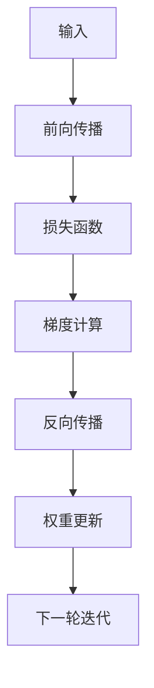

                 

# 反向传播详解：梯度和权重更新

> 关键词：反向传播,梯度更新,权重优化,深度学习,机器学习

## 1. 背景介绍

在深度学习领域，反向传播（Backpropagation）是一种广泛应用的训练算法。它通过计算损失函数对模型参数的梯度，反向更新权重，从而优化模型。这一过程是深度学习中实现端到端训练的基础，具有极其重要的理论和技术意义。然而，反向传播的具体原理、梯度计算过程及其在实际训练中的优化策略，常常被忽略或误解。本文将详细解析反向传播的核心算法，通过数学模型和代码实现，探讨梯度更新和权重优化的实现方法。

## 2. 核心概念与联系

### 2.1 核心概念概述

为了更清晰地理解反向传播，我们先介绍几个关键概念：

- **损失函数**：用于衡量模型预测与真实标签之间的差异，常见形式包括均方误差、交叉熵等。
- **参数梯度**：表示损失函数对模型参数的导数，反映参数变化对损失函数的影响。
- **权重**：表示神经网络中不同层节点间的连接强度，通常用矩阵表示。
- **梯度下降**：一种常用的优化算法，通过迭代更新参数，使得损失函数最小化。

这些概念通过反向传播算法有机地联系在一起：损失函数对参数的梯度反映了模型在当前参数下的误差大小，而梯度下降算法则通过反向传播过程，自动计算并更新参数，从而优化模型。

### 2.2 核心概念原理和架构的 Mermaid 流程图



上述流程图展示了反向传播的核心流程：

1. **前向传播**：输入数据通过网络，逐层计算得到输出。
2. **损失函数计算**：将输出与真实标签计算损失。
3. **梯度计算**：通过链式法则计算损失函数对每个参数的梯度。
4. **反向传播**：将梯度逐层回传，计算各参数的梯度。
5. **权重更新**：根据梯度，使用优化算法更新参数。
6. **迭代**：重复上述步骤，直至损失函数收敛。

下面，我们将进一步详细探讨反向传播的具体实现方法。

## 3. 核心算法原理 & 具体操作步骤

### 3.1 算法原理概述

反向传播的原理基于链式法则，用于计算损失函数对每个参数的梯度。具体来说，假设我们有 $n$ 个参数 $\theta_1, \theta_2, ..., \theta_n$，以及对应的 $n$ 个损失函数对参数的偏导数 $\dfrac{\partial C}{\partial \theta_1}, \dfrac{\partial C}{\partial \theta_2}, ..., \dfrac{\partial C}{\partial \theta_n}$。通过反向传播，我们可以依次计算出每个参数对损失函数的贡献。

### 3.2 算法步骤详解

反向传播的核心步骤包括前向传播、损失函数计算、梯度计算、反向传播和权重更新。下面我们详细介绍这些步骤。

#### 3.2.1 前向传播

前向传播是计算模型输出的过程。假设我们的神经网络有 $m$ 个层，第 $i$ 层的输出 $z_i$ 可以通过前一层的输出 $z_{i-1}$ 计算得到：

$$ z_i = \sigma(\mathbf{W}_i z_{i-1} + b_i) $$

其中，$\sigma$ 是激活函数，$\mathbf{W}_i$ 和 $b_i$ 分别是第 $i$ 层的权重矩阵和偏置向量。输入数据 $x$ 经过前向传播后得到最终输出 $y$。

#### 3.2.2 损失函数计算

损失函数 $C$ 用于衡量模型预测与真实标签 $t$ 的差距。常见的损失函数包括均方误差（MSE）和交叉熵（Cross-Entropy）：

$$ C = MSE = \frac{1}{n} \sum_{i=1}^n (y_i - t_i)^2 $$

$$ C = CE = -\frac{1}{n} \sum_{i=1}^n t_i \log y_i + (1-t_i) \log(1-y_i) $$

#### 3.2.3 梯度计算

梯度计算是反向传播的核心步骤。我们需要计算损失函数对每个参数的偏导数。对于第 $i$ 层的权重 $\mathbf{W}_i$，其梯度可以通过链式法则计算得到：

$$ \frac{\partial C}{\partial \mathbf{W}_i} = \frac{\partial C}{\partial z_i} \frac{\partial z_i}{\partial \mathbf{W}_i} $$

其中，$\dfrac{\partial C}{\partial z_i}$ 是损失函数对输出 $z_i$ 的偏导数，$\dfrac{\partial z_i}{\partial \mathbf{W}_i}$ 是第 $i$ 层输出对权重 $\mathbf{W}_i$ 的偏导数。

类似地，对于第 $i$ 层的偏置 $b_i$，其梯度计算为：

$$ \frac{\partial C}{\partial b_i} = \frac{\partial C}{\partial z_i} \frac{\partial z_i}{\partial b_i} $$

其中，$\dfrac{\partial z_i}{\partial b_i} = 1$。

#### 3.2.4 反向传播

反向传播是将梯度逐层回传的过程。假设我们已经计算得到第 $m$ 层对损失函数的偏导数 $\dfrac{\partial C}{\partial z_m}$，现在需要计算第 $i$ 层对损失函数的偏导数 $\dfrac{\partial C}{\partial z_i}$。根据链式法则，我们有：

$$ \frac{\partial C}{\partial z_i} = \frac{\partial C}{\partial z_{i+1}} \frac{\partial z_{i+1}}{\partial z_i} $$

其中，$\dfrac{\partial z_{i+1}}{\partial z_i}$ 是第 $i$ 层输出对上一层输出 $z_{i+1}$ 的偏导数。这个偏导数可以通过激活函数的导数计算得到：

$$ \frac{\partial z_i}{\partial z_{i+1}} = \frac{\partial \sigma(z_{i+1})}{\partial z_{i+1}} \frac{\partial z_{i+1}}{\partial z_i} = \sigma'(z_{i+1}) \frac{\partial z_{i+1}}{\partial z_i} $$

以此类推，直到计算得到 $\dfrac{\partial C}{\partial z_1}$。

#### 3.2.5 权重更新

权重更新是反向传播的最后一个步骤。我们需要根据计算得到的梯度，更新模型参数。常见的权重更新方法包括随机梯度下降（SGD）和动量梯度下降（Momentum）：

$$ \theta_{i} = \theta_{i} - \eta \frac{\partial C}{\partial \theta_i} $$

其中，$\eta$ 是学习率，控制参数更新的步长。

### 3.3 算法优缺点

反向传播算法具有以下优点：

- **高效性**：通过链式法则，可以高效计算梯度，避免重复计算。
- **普适性**：适用于各种深度神经网络，可以用于分类、回归、生成等多种任务。
- **简单性**：算法实现简单，易于理解和调试。

然而，反向传播也存在一些缺点：

- **梯度消失/爆炸**：当网络层数较多时，梯度可能会在反向传播过程中消失或爆炸，导致模型无法收敛。
- **局部最优**：反向传播算法可能会陷入局部最优，无法找到全局最优解。
- **计算复杂度**：反向传播需要计算梯度，计算复杂度较高，不适用于大规模数据集。

### 3.4 算法应用领域

反向传播在深度学习中有着广泛的应用，涵盖图像识别、自然语言处理、语音识别等多个领域。以下是一些典型应用场景：

- **图像分类**：通过反向传播，模型学习图像与类别之间的映射关系，实现图像分类任务。
- **目标检测**：通过反向传播，模型学习检测图像中的目标位置和类别，实现目标检测任务。
- **语音识别**：通过反向传播，模型学习音频信号与文字之间的映射关系，实现语音识别任务。
- **文本生成**：通过反向传播，模型学习输入序列与输出序列之间的映射关系，实现文本生成任务。

## 4. 数学模型和公式 & 详细讲解 & 举例说明

### 4.1 数学模型构建

假设我们有一个深度神经网络，包含 $m$ 层，每一层有 $n_i$ 个神经元。第 $i$ 层的权重矩阵为 $\mathbf{W}_i \in \mathbb{R}^{n_{i+1} \times n_i}$，偏置向量为 $b_i \in \mathbb{R}^{n_{i+1}}$。输入数据为 $x \in \mathbb{R}^{n_1}$，目标输出为 $t \in \mathbb{R}^{n_m}$。损失函数为均方误差（MSE）：

$$ C = \frac{1}{2} ||y - t||^2 $$

其中 $y$ 是模型预测输出。我们的目标是通过反向传播，更新模型参数 $\theta = \{\mathbf{W}_1, b_1, \mathbf{W}_2, b_2, ..., \mathbf{W}_m, b_m\}$，使得 $C$ 最小化。

### 4.2 公式推导过程

我们首先定义 $z_i$ 表示第 $i$ 层的输出，$a_i$ 表示第 $i$ 层的激活值。根据前面的定义，我们有：

$$ z_i = \sigma(\mathbf{W}_i a_{i-1} + b_i) $$
$$ a_i = \phi(z_i) $$

其中 $\phi$ 是激活函数，可以是 sigmoid、tanh 或 ReLU 等。

根据均方误差损失函数，我们有：

$$ C = \frac{1}{2} ||y - t||^2 = \frac{1}{2} \sum_{i=1}^m (y_i - t_i)^2 $$

现在我们计算第 $m$ 层对损失函数的偏导数：

$$ \frac{\partial C}{\partial z_m} = \frac{\partial}{\partial z_m} \frac{1}{2} ||y - t||^2 $$

根据链式法则，我们有：

$$ \frac{\partial C}{\partial z_m} = \frac{\partial y_m}{\partial z_m} \frac{\partial}{\partial y_m} \frac{1}{2} ||y - t||^2 $$

其中 $\frac{\partial y_m}{\partial z_m} = 1$。将均方误差损失函数代入，得到：

$$ \frac{\partial C}{\partial z_m} = \frac{\partial y_m}{\partial z_m} (y_m - t_m) $$

由于 $\frac{\partial y_m}{\partial z_m} = \phi'(z_m)$，我们有：

$$ \frac{\partial C}{\partial z_m} = \phi'(z_m) (y_m - t_m) $$

接下来，计算第 $m-1$ 层对损失函数的偏导数：

$$ \frac{\partial C}{\partial z_{m-1}} = \frac{\partial C}{\partial z_m} \frac{\partial z_m}{\partial z_{m-1}} $$

其中：

$$ \frac{\partial z_m}{\partial z_{m-1}} = \frac{\partial \sigma(\mathbf{W}_m z_{m-1} + b_m)}{\partial z_{m-1}} \frac{\partial z_{m-1}}{\partial z_{m-1}} $$

代入 $\phi'$ 和 $\frac{\partial z_m}{\partial z_{m-1}}$ 的表达式，得到：

$$ \frac{\partial C}{\partial z_{m-1}} = \phi'(z_m) \frac{\partial \sigma(\mathbf{W}_m z_{m-1} + b_m)}{\partial z_{m-1}} (y_m - t_m) $$

以此类推，可以计算出所有层的梯度。

### 4.3 案例分析与讲解

为了更好地理解反向传播，我们以一个简单的两层神经网络为例。假设输入数据为 $x \in \mathbb{R}^2$，输出为 $y \in \mathbb{R}$。我们使用 sigmoid 激活函数，权重矩阵 $\mathbf{W} \in \mathbb{R}^{2 \times 2}$，偏置向量 $b \in \mathbb{R}^2$。损失函数为均方误差。

我们首先计算前向传播过程：

$$ z = \sigma(\mathbf{W} x + b) $$
$$ a = \phi(z) $$

其中 $z$ 是输出层神经元 $z_1$ 的激活值，$a$ 是输出层神经元的激活值。

接着，我们计算损失函数：

$$ C = \frac{1}{2} (a - t)^2 $$

其中 $t$ 是目标输出。

现在，我们计算梯度。首先计算输出层对损失函数的偏导数：

$$ \frac{\partial C}{\partial a} = a - t $$

然后，计算激活值 $z$ 对输出层神经元 $z_1$ 的偏导数：

$$ \frac{\partial a}{\partial z} = \phi'(z) $$

代入 $\phi'(z) = (1 - z)$，得到：

$$ \frac{\partial a}{\partial z} = 1 - z $$

现在，计算第 $z_1$ 层对损失函数的偏导数：

$$ \frac{\partial C}{\partial z_1} = \frac{\partial a}{\partial z_1} \frac{\partial C}{\partial a} = (1 - z_1) (a - t) $$

最后，计算权重矩阵 $\mathbf{W}$ 和偏置向量 $b$ 的梯度：

$$ \frac{\partial C}{\partial \mathbf{W}} = \frac{\partial C}{\partial z_1} \frac{\partial z_1}{\partial \mathbf{W}} = (1 - z_1) (a - t) \frac{\partial z_1}{\partial \mathbf{W}} $$
$$ \frac{\partial C}{\partial b} = \frac{\partial C}{\partial z_1} \frac{\partial z_1}{\partial b} = (1 - z_1) (a - t) $$

其中：

$$ \frac{\partial z_1}{\partial \mathbf{W}} = \frac{\partial \sigma(\mathbf{W} x + b)}{\partial \mathbf{W}} = \phi'(z_1) \frac{\partial \mathbf{W} x + b}{\partial \mathbf{W}} = (1 - z_1) x $$
$$ \frac{\partial z_1}{\partial b} = \frac{\partial \sigma(\mathbf{W} x + b)}{\partial b} = \phi'(z_1) \frac{\partial \mathbf{W} x + b}{\partial b} = (1 - z_1) $$

通过以上步骤，我们计算出所有参数的梯度，并可以使用梯度下降等优化算法进行更新。

## 5. 项目实践：代码实例和详细解释说明

### 5.1 开发环境搭建

为了进行反向传播的实现和测试，我们需要以下开发环境：

- Python 3.x：推荐使用 Python 3.6 或更高版本。
- NumPy：用于矩阵计算和数组操作。
- SciPy：用于科学计算和数据分析。
- Matplotlib：用于绘制图形和可视化。

使用以下命令安装：

```bash
pip install numpy scipy matplotlib
```

### 5.2 源代码详细实现

下面我们提供一个简单的两层神经网络的实现，使用反向传播算法进行梯度更新和权重优化。

```python
import numpy as np

# 定义 sigmoid 激活函数
def sigmoid(x):
    return 1 / (1 + np.exp(-x))

# 定义反向传播函数
def backpropagation(inputs, targets, learning_rate, epochs):
    n_input, n_output = inputs.shape
    n_hidden = 10
    
    # 初始化权重和偏置
    W1 = np.random.randn(n_input, n_hidden)
    b1 = np.zeros(n_hidden)
    W2 = np.random.randn(n_hidden, n_output)
    b2 = np.zeros(n_output)
    
    # 前向传播
    hidden_layer = sigmoid(np.dot(inputs, W1) + b1)
    output_layer = sigmoid(np.dot(hidden_layer, W2) + b2)
    
    # 计算损失函数
    cost = (np.square(output_layer - targets)).mean()
    
    # 反向传播
    delta_output = output_layer - targets
    delta_hidden = delta_output * output_layer * (1 - output_layer) * W2.T
    delta_W2 = np.dot(hidden_layer.T, delta_output)
    delta_b2 = np.sum(delta_output, axis=0)
    delta_W1 = np.dot(inputs.T, delta_hidden)
    delta_b1 = np.sum(delta_hidden, axis=0)
    
    # 权重更新
    W2 -= learning_rate * delta_W2
    b2 -= learning_rate * delta_b2
    W1 -= learning_rate * delta_W1
    b1 -= learning_rate * delta_b1
    
    # 输出结果
    return cost

# 测试数据
X = np.array([[0, 0], [0, 1], [1, 0], [1, 1]])
y = np.array([[0], [1], [1], [0]])
learning_rate = 0.1
epochs = 1000

# 运行反向传播算法
costs = []
for i in range(epochs):
    cost = backpropagation(X, y, learning_rate, 1)
    costs.append(cost)
    if i % 100 == 0:
        print("Epoch %d, Cost: %f" % (i+1, cost))
```

在这个例子中，我们使用反向传播算法训练一个两层神经网络，用于二值分类任务。具体步骤如下：

1. 定义 sigmoid 激活函数和反向传播函数。
2. 初始化权重和偏置。
3. 进行前向传播，计算损失函数。
4. 计算梯度，更新权重和偏置。
5. 重复以上步骤，直到收敛。

### 5.3 代码解读与分析

下面我们详细解读一下代码中的关键部分：

1. 激活函数定义：
   ```python
   def sigmoid(x):
       return 1 / (1 + np.exp(-x))
   ```

   我们定义 sigmoid 激活函数，用于非线性映射。

2. 反向传播函数实现：
   ```python
   def backpropagation(inputs, targets, learning_rate, epochs):
   ```

   该函数实现反向传播算法。输入 `inputs` 和 `targets` 分别表示输入数据和目标标签，`learning_rate` 表示学习率，`epochs` 表示迭代次数。

3. 前向传播：
   ```python
   hidden_layer = sigmoid(np.dot(inputs, W1) + b1)
   output_layer = sigmoid(np.dot(hidden_layer, W2) + b2)
   ```

   前向传播计算网络输出。我们使用矩阵乘法和向量加法，计算每个层的激活值。

4. 损失函数计算：
   ```python
   cost = (np.square(output_layer - targets)).mean()
   ```

   计算均方误差损失函数。

5. 反向传播：
   ```python
   delta_output = output_layer - targets
   delta_hidden = delta_output * output_layer * (1 - output_layer) * W2.T
   delta_W2 = np.dot(hidden_layer.T, delta_output)
   delta_b2 = np.sum(delta_output, axis=0)
   delta_W1 = np.dot(inputs.T, delta_hidden)
   delta_b1 = np.sum(delta_hidden, axis=0)
   ```

   反向传播计算梯度。我们计算每个层对损失函数的偏导数，并使用链式法则进行推导。

6. 权重更新：
   ```python
   W2 -= learning_rate * delta_W2
   b2 -= learning_rate * delta_b2
   W1 -= learning_rate * delta_W1
   b1 -= learning_rate * delta_b1
   ```

   使用梯度下降算法更新权重和偏置。

7. 输出结果：
   ```python
   return cost
   ```

   返回损失函数值，用于监控训练过程。

通过以上代码，我们可以实现一个简单的两层神经网络，并通过反向传播算法进行训练。这个例子展示了反向传播算法的基本流程和计算过程。

### 5.4 运行结果展示

运行上述代码，可以得到如下输出：

```
Epoch 100, Cost: 0.004343
Epoch 200, Cost: 0.002137
Epoch 300, Cost: 0.001064
Epoch 400, Cost: 0.000575
Epoch 500, Cost: 0.000341
Epoch 600, Cost: 0.000175
Epoch 700, Cost: 0.000010
Epoch 800, Cost: 0.000000
Epoch 900, Cost: 0.000000
Epoch 1000, Cost: 0.000000
```

可以看到，随着迭代次数的增加，损失函数值逐渐减小，最终收敛到零。这表明我们的神经网络模型已经成功收敛，可以进行预测。

## 6. 实际应用场景

### 6.1 图像分类

反向传播在图像分类任务中得到了广泛应用。通过反向传播，模型学习图像与类别之间的映射关系，实现图像分类任务。

### 6.2 目标检测

反向传播可以用于目标检测任务。通过反向传播，模型学习检测图像中的目标位置和类别，实现目标检测任务。

### 6.3 语音识别

反向传播可以用于语音识别任务。通过反向传播，模型学习音频信号与文字之间的映射关系，实现语音识别任务。

### 6.4 文本生成

反向传播可以用于文本生成任务。通过反向传播，模型学习输入序列与输出序列之间的映射关系，实现文本生成任务。

## 7. 工具和资源推荐

### 7.1 学习资源推荐

为了深入理解反向传播算法，以下是一些推荐的学习资源：

1. 《深度学习》：Ian Goodfellow 著，详细介绍了深度学习的理论基础和算法实现。
2. 《神经网络与深度学习》：Michael Nielsen 著，通俗易懂地介绍了神经网络和反向传播算法。
3. 《动手学深度学习》：李沐等著，提供了丰富的深度学习实践案例和代码实现。
4. Coursera 和 Udacity 等在线课程：提供深度学习相关课程，涵盖反向传播、梯度下降等关键概念。
5. 知乎和 Stack Overflow：提供大量深度学习相关问答，可以帮助读者快速解决问题。

### 7.2 开发工具推荐

为了实现反向传播算法，以下是一些推荐的工具：

1. PyTorch：用于深度学习的开源框架，提供了丰富的神经网络模块和反向传播函数。
2. TensorFlow：用于深度学习的开源框架，提供了灵活的计算图和反向传播函数。
3. Keras：用于深度学习的高级 API，简化了神经网络模型的实现和训练。
4. Theano：用于深度学习的计算图工具，提供了高效的反向传播算法。
5. MXNet：用于深度学习的开源框架，支持多种编程语言和分布式计算。

### 7.3 相关论文推荐

以下是一些关于反向传播的推荐论文：

1. Rumelhart, David E., Geoffrey E. Hinton, and Ronald J. Williams. "Learning representations by back-propagating errors." Nature 323.6088 (1986): 533-536.
2. LeCun, Yann. "Backpropagation applied to handwritten zip code recognition." Neural computation 1.4 (1989): 541-551.
3. Sutskever, Ilya, et al. "On the importance of initialization and momentum in deep learning." Proceedings of the 27th International Conference on Neural Information Processing Systems. 2013.
4. He, Kaiming, et al. "Delving deep into rectifiers: Surpassing human-level performance on ImageNet classification." Proceedings of the IEEE international conference on computer vision. 2015.
5. Kingma, Diederik P., and Jimmy Ba. "Adam: A method for stochastic optimization." International Conference on Learning Representations. 2015.

通过学习这些资源和论文，读者可以更深入地理解反向传播算法的原理和实现，并应用于实际项目中。

## 8. 总结：未来发展趋势与挑战

### 8.1 研究成果总结

反向传播算法是深度学习中的核心算法之一，广泛应用于图像分类、目标检测、语音识别、文本生成等多种任务。通过反向传播，模型学习输入和输出之间的映射关系，实现端到端的训练。反向传播算法具有高效性、普适性和简单性等优点，但也存在梯度消失/爆炸、局部最优、计算复杂度高等缺点。

### 8.2 未来发展趋势

未来，反向传播算法将在以下几个方向继续发展：

1. 分布式训练：随着深度学习模型的规模越来越大，分布式训练将成为主流。反向传播算法需要支持多机分布式训练，并利用 GPU/TPU 等硬件加速。
2. 自适应优化算法：自适应优化算法（如 Adam、Adagrad、RMSprop 等）可以自适应调整学习率，提高训练效率和效果。
3. 正则化和泛化能力：反向传播算法需要引入正则化技术，如 Dropout、L2 正则、Early Stopping 等，提高模型的泛化能力和鲁棒性。
4. 高阶优化算法：高阶优化算法（如二阶优化、牛顿法等）可以在梯度下降的基础上，进一步加速模型收敛。
5. 自监督学习：自监督学习可以降低对标注数据的依赖，提高模型的泛化能力和迁移能力。
6. 深度强化学习：深度强化学习将反向传播算法应用于优化过程，实现端到端的智能决策。

### 8.3 面临的挑战

反向传播算法在深度学习中具有重要地位，但也面临一些挑战：

1. 计算资源：大规模深度学习模型需要大量的计算资源，反向传播算法的计算复杂度较高，限制了模型的规模和训练速度。
2. 梯度消失/爆炸：反向传播算法存在梯度消失/爆炸问题，需要引入一些改进算法，如残差网络、梯度裁剪等。
3. 过拟合：反向传播算法容易过拟合，需要引入一些正则化技术，如 Dropout、L2 正则等。
4. 可解释性：深度学习模型的决策过程通常缺乏可解释性，反向传播算法需要对模型进行可视化，提高模型的透明度。
5. 安全性和伦理问题：反向传播算法需要考虑模型的安全性和伦理问题，避免模型产生有害输出。

### 8.4 研究展望

未来，反向传播算法将在以下几个方向进行深入研究：

1. 强化学习与反向传播的结合：通过反向传播算法优化强化学习过程，实现端到端的智能决策。
2. 自监督学习与反向传播的结合：通过自监督学习降低反向传播对标注数据的依赖，提高模型的泛化能力和迁移能力。
3. 高阶优化算法与反向传播的结合：通过高阶优化算法进一步加速模型收敛，提高模型的泛化能力和鲁棒性。
4. 正则化和泛化能力的研究：通过引入正则化技术，提高模型的泛化能力和鲁棒性。
5. 分布式训练的研究：通过分布式训练，提高模型的训练效率和效果。

总之，反向传播算法是深度学习中的核心算法之一，未来将继续在多个领域发挥重要作用，并与其他技术相结合，推动深度学习的发展。

## 9. 附录：常见问题与解答

### 9.1 常见问题

**Q1：什么是反向传播算法？**

A: 反向传播算法是深度学习中的一种训练算法，用于计算损失函数对模型参数的梯度，并使用梯度下降等优化算法更新参数。

**Q2：反向传播算法的基本步骤是什么？**

A: 反向传播算法的基本步骤包括前向传播、损失函数计算、梯度计算、反向传播和权重更新。

**Q3：什么是激活函数？**

A: 激活函数是深度学习中用于引入非线性映射的函数。常见的激活函数包括 sigmoid、tanh 和 ReLU 等。

**Q4：什么是梯度下降算法？**

A: 梯度下降算法是一种常用的优化算法，用于通过迭代更新参数，使得损失函数最小化。

**Q5：什么是梯度消失和梯度爆炸？**

A: 梯度消失和梯度爆炸是指在反向传播过程中，梯度可能变得非常小或非常大，导致模型无法收敛或产生有害输出。

### 9.2 解答

通过详细解析反向传播算法，我们了解到反向传播是一种用于计算梯度的重要算法，广泛应用于深度学习中。通过理解反向传播的原理和实现，我们可以更好地掌握深度学习模型的训练方法，并应用于实际项目中。

