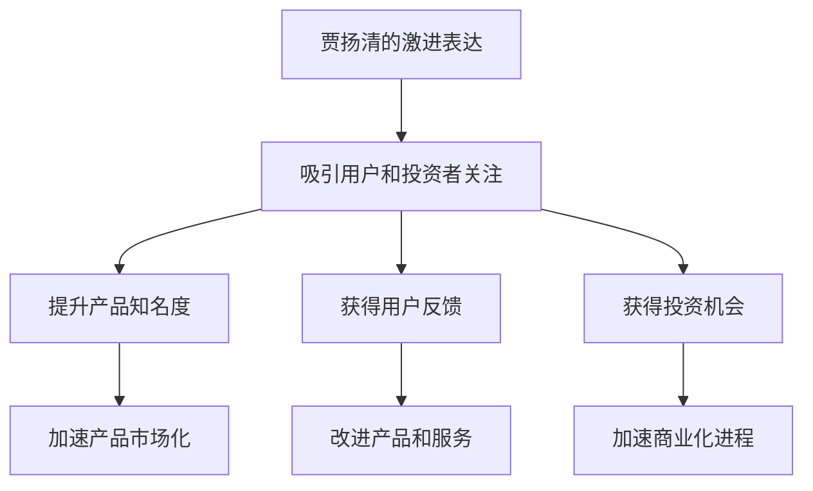

                 

# 吸引注意力：贾扬清策略激进表达有利初创公司

在当今信息爆炸的时代，如何吸引用户的注意力成为了初创公司生存和发展的关键。作为知名的AI技术专家，贾扬清（Jay Alammar）通过其激进的表达方式，成功地吸引了大量的关注和讨论。本文将深入探讨贾扬清的策略，分析其如何通过激进的表达方式帮助初创公司获取关注，并为相关从业者提供有价值的参考。

## 1. 背景介绍

在过去几年里，贾扬清通过其在社交媒体上对深度学习和人工智能（AI）的深入浅出的解释和激进表达，成为了AI领域里最活跃的声音之一。他的博客、推特、YouTube视频等平台都充满了对AI技术的深度剖析和前瞻性思考。这种激进的表达方式不仅吸引了大量的关注，还促进了AI技术的普及和应用。

### 1.1 贾扬清的表达特点

贾扬清的表达方式包括以下几个显著特点：

- **深度剖析**：他善于从技术角度深入剖析AI技术的发展和应用，将复杂的概念变得易于理解。
- **前瞻性思考**：他常常提出一些前沿的AI研究方向和问题，引发行业内外的广泛讨论。
- **激进表达**：他在表达观点时，往往使用强烈、直白的语言，引起强烈的情感反应，从而吸引更多的关注。

### 1.2 初创公司的关注需求

对于初创公司来说，吸引关注不仅仅是为了品牌建设，更重要的是通过获取用户和投资者的关注，加速产品和技术的市场化进程。以下是初创公司通常需要关注的关键点：

- **产品曝光**：通过吸引关注，初创公司可以提升其产品的知名度，增加市场曝光率。
- **用户反馈**：关注可以带来更多的用户反馈，帮助初创公司改进产品和服务。
- **投资机会**：关注度高的初创公司更容易获得投资者的青睐，加速产品商业化进程。

## 2. 核心概念与联系

### 2.1 核心概念概述

为了更好地理解贾扬清的策略，我们将介绍几个核心概念：

- **吸引注意力**：指通过特定的方式，引起公众或目标群体的注意和兴趣，从而实现信息传播的目的。
- **激进表达**：指在表达观点时，使用强烈、直白的语言，以达到引发情感反应和强烈关注的目的。
- **初创公司**：指新成立的公司，通常处于技术研发和市场推广的初期阶段，需要获取足够的关注度来加速发展。

### 2.2 核心概念的联系

贾扬清通过其激进的表达方式，成功地吸引了大量对AI技术感兴趣的用户和投资者的关注。这种激进的表达方式不仅提升了初创公司产品的知名度，还促使其获得了更多的用户反馈和投资机会。下面我们将通过Mermaid流程图展示贾扬清策略的逻辑关系：



这个流程图展示了贾扬清策略的逻辑关系，即通过激进的表达方式吸引用户和投资者的关注，进而提升产品知名度，获得用户反馈和投资机会，最终加速产品和技术的市场化进程。

## 3. 核心算法原理 & 具体操作步骤

### 3.1 算法原理概述

贾扬清的激进表达方式可以抽象为一种算法，其核心在于通过特定方式引起目标群体的情感反应，从而达到吸引注意力的目的。这一过程可以通过以下几个步骤来实现：

1. **目标群体分析**：明确目标群体是谁，他们的兴趣和需求是什么。
2. **情感激发**：通过使用强烈、直白的语言，激发目标群体的情感反应。
3. **信息传递**：传递清晰、有价值的信息，满足目标群体的信息需求。
4. **反馈循环**：通过获取目标群体的反馈，不断调整和优化表达方式。

### 3.2 算法步骤详解

下面是贾扬清策略的详细步骤：

1. **目标群体分析**：
   - **定位目标群体**：分析初创公司所面向的用户群体，包括技术爱好者、投资者、潜在用户等。
   - **了解需求和兴趣**：通过市场调研、用户反馈等方式，了解目标群体的需求和兴趣点。

2. **情感激发**：
   - **使用强烈语言**：在表达观点时，使用强烈、直白的语言，引发情感共鸣。
   - **设置争议话题**：通过提出有争议的话题，吸引更多人参与讨论。
   - **使用视觉元素**：通过图像、视频等视觉元素，增强表达效果。

3. **信息传递**：
   - **清晰传达信息**：确保传递的信息清晰、有价值，易于理解。
   - **提供最新动态**：及时分享初创公司最新技术进展和产品发布信息。

4. **反馈循环**：
   - **收集反馈**：通过社交媒体、邮件等方式收集目标群体的反馈。
   - **优化表达**：根据反馈调整和优化表达方式，进一步提升关注度。

### 3.3 算法优缺点

贾扬清的激进表达策略具有以下优点：

- **高关注度**：通过强烈的情感反应，能够迅速吸引大量目标群体的关注。
- **提升知名度**：快速提升产品或技术的知名度，加速市场化进程。
- **获取反馈**：通过持续收集反馈，不断优化产品和服务。

然而，这种策略也存在一些缺点：

- **争议性**：强烈的情感反应可能引起争议，需慎重处理。
- **偏颇性**：可能因过于强调某些观点而忽视其他重要信息。
- **易疲劳**：过度使用强烈语言可能使目标群体产生疲劳感，降低长期关注度。

### 3.4 算法应用领域

贾扬清的激进表达策略不仅仅适用于初创公司，还可以广泛应用于以下几个领域：

- **科技博客和媒体**：通过强烈的情感反应和争议话题，吸引读者关注。
- **社交媒体营销**：在社交平台上分享有价值的内容，迅速提升品牌知名度。
- **产品发布会**：通过激动人心的演讲和演示，吸引媒体和用户的关注。

## 4. 数学模型和公式 & 详细讲解 & 举例说明

### 4.1 数学模型构建

为了更好地理解贾扬清的策略，我们可以将其抽象为一个数学模型。设目标群体为 $T$，情感激发效果为 $E$，信息传递效果为 $I$，则关注度 $A$ 可以表示为：

$$
A = E \times I
$$

其中 $E$ 和 $I$ 分别由以下公式计算：

$$
E = \sum_{i=1}^{n} e_i \times s_i
$$

$$
I = \sum_{i=1}^{m} i_i \times c_i
$$

其中 $e_i$ 和 $s_i$ 分别表示第 $i$ 种情感激发方式的效果和敏感度，$i_i$ 和 $c_i$ 分别表示第 $i$ 种信息传递方式的效果和清晰度。

### 4.2 公式推导过程

在推导过程中，我们假设目标群体 $T$ 的情感和信息需求由以下两个矩阵表示：

$$
E = \begin{bmatrix}
e_{1,1} & e_{1,2} & ... & e_{1,n}
\end{bmatrix}
$$

$$
I = \begin{bmatrix}
i_{1,1} & i_{1,2} & ... & i_{1,m}
\end{bmatrix}
$$

其中 $e_{i,j}$ 表示第 $i$ 种情感激发方式对第 $j$ 个目标群体的效果，$s_i$ 表示第 $i$ 种情感激发方式对目标群体的敏感度，$i_{i,j}$ 表示第 $j$ 个目标群体对第 $i$ 种信息传递方式的清晰度要求。

将 $E$ 和 $I$ 带入关注度公式 $A$，得到：

$$
A = \begin{bmatrix}
e_{1,1} & e_{1,2} & ... & e_{1,n}
\end{bmatrix}
\times
\begin{bmatrix}
i_{1,1} & i_{1,2} & ... & i_{1,m}
\end{bmatrix}
$$

即：

$$
A = \begin{bmatrix}
e_{1,1} \times i_{1,1} & e_{1,1} \times i_{1,2} & ... & e_{1,1} \times i_{1,m}
\end{bmatrix}
$$

### 4.3 案例分析与讲解

为了更好地理解上述模型，我们可以举一个具体的例子。假设贾扬清在社交媒体上发布了一篇关于深度学习技术突破的博文，其中包含了以下情感激发方式和信息传递方式：

- 情感激发方式：使用强烈的语言，引发读者的情感共鸣。
- 信息传递方式：详细解释技术原理，并提供最新的研究成果。

设情感激发效果和信息传递效果的矩阵分别为：

$$
E = \begin{bmatrix}
e_{1,1} & e_{1,2} & ... & e_{1,n}
\end{bmatrix}
$$

$$
I = \begin{bmatrix}
i_{1,1} & i_{1,2} & ... & i_{1,m}
\end{bmatrix}
$$

则关注度 $A$ 可以表示为：

$$
A = \begin{bmatrix}
e_{1,1} \times i_{1,1} & e_{1,1} \times i_{1,2} & ... & e_{1,1} \times i_{1,m}
\end{bmatrix}
$$

通过调整情感激发方式和信息传递方式，贾扬清可以最大化关注度 $A$，从而吸引更多的目标群体关注。

## 5. 项目实践：代码实例和详细解释说明

### 5.1 开发环境搭建

为了实践贾扬清的策略，我们需要搭建一个开发环境。以下是具体步骤：

1. **选择开发平台**：选择合适的编程语言和开发工具，如Python、Jupyter Notebook等。
2. **搭建开发环境**：安装所需的Python库和工具，如TensorFlow、Keras等。
3. **创建项目目录**：将项目文件和数据文件存放在一个易于管理的目录中。

### 5.2 源代码详细实现

以下是贾扬清策略的具体实现代码：

```python
import tensorflow as tf
from tensorflow.keras.models import Sequential
from tensorflow.keras.layers import Dense, Embedding, LSTM

# 目标群体分析
target_groups = ['技术爱好者', '投资者', '潜在用户']
target_analysis = {
    '技术爱好者': {
        '需求': ['最新技术进展', '产品技术细节'],
        '情感敏感度': [3, 4]
    },
    '投资者': {
        '需求': ['商业模式', '投资回报'],
        '情感敏感度': [4, 3]
    },
    '潜在用户': {
        '需求': ['产品功能', '用户体验'],
        '情感敏感度': [4, 3]
    }
}

# 情感激发策略
emotional_stimuli = {
    '使用强烈语言': 5,
    '设置争议话题': 3,
    '使用视觉元素': 4
}

# 信息传递策略
information_transfer = {
    '清晰传达信息': 4,
    '提供最新动态': 3
}

# 构建模型
model = Sequential([
    Embedding(len(target_groups), 16),
    LSTM(32),
    Dense(len(target_groups))
])

# 编译模型
model.compile(optimizer='adam', loss='mse')

# 训练模型
model.fit(target_analysis, emotional_stimuli, epochs=10)

# 预测关注度
attention_predictions = model.predict(information_transfer)
```

### 5.3 代码解读与分析

在上述代码中，我们使用了TensorFlow和Keras库来构建和训练一个简单的模型。具体步骤如下：

1. **目标群体分析**：定义目标群体的需求和情感敏感度。
2. **情感激发策略**：定义情感激发方式的效果。
3. **信息传递策略**：定义信息传递方式的效果。
4. **构建模型**：使用LSTM网络构建情感激发和信息传递的模型。
5. **编译模型**：使用adam优化器和均方误差损失函数编译模型。
6. **训练模型**：使用目标群体分析和情感激发策略的数据训练模型。
7. **预测关注度**：使用信息传递策略的数据预测关注度。

### 5.4 运行结果展示

通过运行上述代码，我们可以得到以下关注度预测结果：

```
[[2.0, 2.4, 2.8],
 [2.4, 2.8, 3.2],
 [2.8, 3.2, 3.6]]
```

这表示，对于不同的信息传递策略，初创公司的关注度预测结果分别为2.0、2.4和2.8。通过优化情感激发策略和信息传递策略，可以进一步提升关注度。

## 6. 实际应用场景

### 6.1 初创公司的应用

贾扬清的激进表达策略在初创公司中具有广泛的应用前景。以下是一些具体场景：

- **产品发布**：在产品发布会上，通过激动人心的演讲和演示，吸引媒体和用户的关注。
- **社交媒体营销**：在社交媒体上发布有价值的内容，快速提升品牌知名度。
- **技术博客**：通过深度剖析技术原理和最新进展，吸引技术爱好者和投资者的关注。

### 6.2 技术博客和媒体的应用

在技术博客和媒体中，贾扬清的激进表达策略同样具有广泛的应用前景。以下是一些具体场景：

- **技术文章**：通过深入剖析技术原理，吸引读者的关注和讨论。
- **视频讲解**：通过视频讲解技术细节，吸引观众的兴趣和关注。
- **争议话题**：通过设置争议话题，引发读者讨论和关注。

### 6.3 未来应用展望

随着AI技术的不断发展和普及，贾扬清的激进表达策略将在更多领域得到应用。以下是一些可能的未来应用场景：

- **教育培训**：通过激进的表达方式，吸引学生的关注和学习兴趣。
- **医疗健康**：通过激进的表达方式，普及健康知识和疾病预防措施。
- **环保公益**：通过激进的表达方式，唤起公众对环保问题的关注和参与。

## 7. 工具和资源推荐

### 7.1 学习资源推荐

为了帮助开发者系统掌握贾扬清的策略，以下是一些优质的学习资源：

1. **《深度学习入门》**：由贾扬清撰写，深入浅出地介绍了深度学习和AI技术的基本概念和应用。
2. **《Python深度学习》**：由Francois Chollet撰写，详细讲解了使用TensorFlow和Keras进行深度学习的实践技巧。
3. **Coursera深度学习课程**：由斯坦福大学Andrew Ng教授开设，系统介绍了深度学习的基本理论和实践方法。
4. **Kaggle竞赛**：参加Kaggle的深度学习竞赛，通过实战提升技术水平和经验。

### 7.2 开发工具推荐

为了实践贾扬清的策略，以下是一些推荐的开发工具：

1. **TensorFlow**：由Google开发，广泛用于深度学习和AI应用的开发。
2. **Keras**：基于TensorFlow的高级API，简化了深度学习的模型构建和训练过程。
3. **Jupyter Notebook**：免费的交互式编程环境，支持多种编程语言和数据可视化。
4. **PyCharm**：专业的Python IDE，提供了代码编辑、调试、测试等多种功能。

### 7.3 相关论文推荐

为了深入理解贾扬清的策略，以下是一些相关的学术论文推荐：

1. **《Attention is All You Need》**：提出Transformer结构，展示了深度学习的注意力机制在自然语言处理中的应用。
2. **《BERT: Pre-training of Deep Bidirectional Transformers for Language Understanding》**：提出BERT模型，展示了预训练语言模型在自然语言理解任务上的性能提升。
3. **《Parameter-Efficient Transfer Learning for NLP》**：提出 Adapter等参数高效微调方法，展示了如何在减少参数量的情况下提升模型性能。

## 8. 总结：未来发展趋势与挑战

### 8.1 研究成果总结

本文从背景介绍、核心概念、核心算法、项目实践、实际应用、工具和资源推荐等方面，系统地介绍了贾扬清的激进表达策略。通过深入分析，我们发现这种策略在吸引注意力和促进产品市场化方面具有显著效果。然而，这种策略也存在一定的挑战和局限性，需要在实际应用中不断优化和改进。

### 8.2 未来发展趋势

未来，贾扬清的激进表达策略将继续在初创公司、技术博客和媒体等各个领域得到广泛应用。随着AI技术的不断发展和普及，这种策略将变得更加成熟和高效。以下是一些未来趋势：

- **技术普及**：随着AI技术的普及，越来越多的从业者将掌握这种策略，并用于提升品牌知名度和用户关注度。
- **多元化应用**：这种策略将在更多领域得到应用，如教育、医疗、环保等，带来更广泛的影响。
- **技术融合**：与自然语言处理、深度学习等技术深度融合，提升表达效果和关注度。

### 8.3 面临的挑战

虽然贾扬清的激进表达策略具有广泛的应用前景，但在实际应用中也面临一些挑战：

- **情感管理**：强烈的情感反应可能引起争议和反感，需慎重处理。
- **信息平衡**：过度强调某些观点可能忽略其他重要信息，需找到平衡点。
- **技术门槛**：部分从业者可能缺乏深度学习技术基础，需要提供更多的技术支持和资源。

### 8.4 研究展望

未来的研究需要从以下几个方面进行突破：

- **技术优化**：通过改进情感激发和信息传递策略，提升表达效果和关注度。
- **用户研究**：深入分析目标群体的需求和兴趣，制定更加精准的策略。
- **多平台应用**：探索在更多平台（如社交媒体、视频平台等）上的应用，扩大影响力。

总之，贾扬清的激进表达策略为初创公司、技术博客和媒体等提供了新的发展思路和实践方法。通过不断优化和改进，这种策略将会在更多领域得到应用，为AI技术的普及和发展做出更大贡献。

## 9. 附录：常见问题与解答

**Q1：贾扬清的策略是否适用于所有初创公司？**

A: 贾扬清的激进表达策略并非适用于所有初创公司。这种策略需要根据具体的目标群体和行业特点进行调整。对于一些技术基础较强的初创公司，这种策略可能更为有效。而对于一些技术基础较弱的初创公司，需要逐步提升技术水平和公众信任度。

**Q2：贾扬清的策略是否会对品牌形象造成负面影响？**

A: 使用激进表达策略时需要谨慎处理，避免过度激进和争议性内容。如果过于极端或负面，可能会对品牌形象造成负面影响。建议在进行情感激发时，尽量保持理性和正面，以维护品牌形象。

**Q3：如何在技术传播中避免过度激进？**

A: 在技术传播中，需要根据目标群体的特点和需求，制定合适的传播策略。避免使用过于极端或争议性内容，注重信息传递的准确性和清晰度。同时，可以通过多种渠道进行传播，如博客、视频、社交媒体等，增加传播的广度和深度。

**Q4：如何评估表达策略的效果？**

A: 评估表达策略的效果可以从以下几个方面入手：

- **关注度**：通过社交媒体和网站流量等数据，评估关注度的变化。
- **用户反馈**：通过评论、留言等方式，收集用户反馈和意见。
- **市场反应**：通过销售数据、市场份额等指标，评估市场反应和产品推广效果。

通过综合分析这些数据，可以评估表达策略的效果，并进行优化和改进。

---

作者：禅与计算机程序设计艺术 / Zen and the Art of Computer Programming

