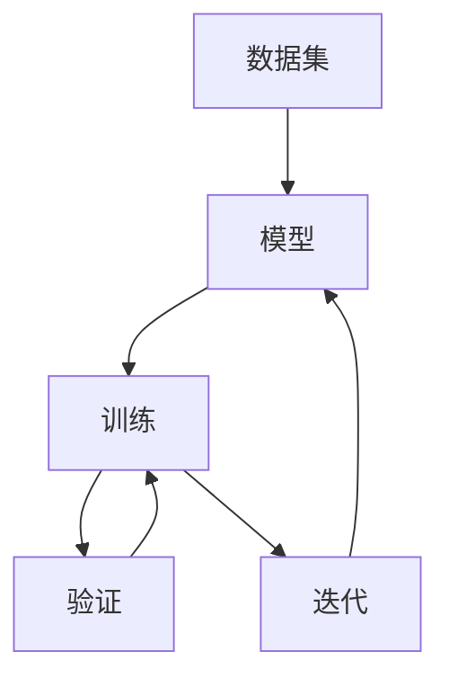

                 

# 国内AI的优势：庞大的用户基数与积极尝试新事物，有利于产品验证与迭代

## 1. 背景介绍

近年来，人工智能（AI）技术在全球范围内迅速发展，各国在AI领域的投入和研究不断增加。中国作为全球最大的互联网和移动设备市场，拥有庞大的用户基数，这也为国内AI技术的发展提供了独特优势。

### 1.1 庞大用户基数带来的数据优势

中国的互联网和移动设备普及率高，用户数据丰富。例如，微信、支付宝等社交和支付平台的用户数量庞大，这些数据为AI模型的训练提供了丰富的标注样本，尤其是在自然语言处理（NLP）、计算机视觉（CV）等领域的模型训练中，中国的数据资源尤为丰富。

### 1.2 积极尝试新事物的工作文化

中国的企业和技术工作者对新技术的接受度和探索精神强，能够迅速接受并尝试使用新的AI技术。这种积极的态度使得中国的AI技术在短时间内快速迭代和验证。

## 2. 核心概念与联系

### 2.1 核心概念概述

在AI技术中，数据和模型是两大核心。数据的质量和多样性直接影响模型的表现，而模型的复杂度和泛化能力则是衡量其性能的关键指标。

- **数据集**：用于训练模型的数据集，可以是结构化数据或非结构化数据，如图像、文本、语音等。
- **模型**：用于处理和预测数据的算法框架，如深度神经网络、支持向量机等。
- **训练**：使用数据集对模型进行参数调整，以提高其在特定任务上的表现。
- **验证**：在验证集上评估模型的性能，以确保模型泛化能力良好。
- **迭代**：不断优化模型，通过多次训练和验证，逐步提升模型效果。

这些概念之间的关系可以用以下Mermaid流程图来展示：



### 2.2 核心概念原理和架构

AI模型通常通过深度学习框架如TensorFlow、PyTorch等进行训练和优化。其基本流程包括：

1. **数据准备**：将原始数据转化为模型可以处理的形式，如分词、特征提取等。
2. **模型构建**：选择合适的模型架构，如卷积神经网络（CNN）、循环神经网络（RNN）等，并设置相关参数。
3. **模型训练**：使用训练集对模型进行参数优化，最小化损失函数。
4. **模型验证**：在验证集上评估模型性能，调整模型参数。
5. **模型应用**：将优化后的模型应用于实际场景中，进行预测或分类等任务。

## 3. 核心算法原理 & 具体操作步骤

### 3.1 算法原理概述

AI模型的训练和优化通常使用梯度下降等优化算法，通过不断调整模型参数，最小化损失函数，提高模型在特定任务上的表现。

### 3.2 算法步骤详解

1. **数据预处理**：包括数据清洗、特征提取、归一化等步骤，确保数据符合模型要求。
2. **模型选择**：根据任务类型选择合适的模型架构，如CNN用于图像识别，RNN用于文本处理等。
3. **损失函数选择**：根据任务类型选择合适的损失函数，如交叉熵、均方误差等。
4. **模型训练**：使用训练集对模型进行参数优化，最小化损失函数。
5. **模型验证**：在验证集上评估模型性能，调整模型参数。
6. **模型应用**：将优化后的模型应用于实际场景中，进行预测或分类等任务。

### 3.3 算法优缺点

- **优点**：数据多样性丰富，模型表现更好；积极的工作文化，技术迭代速度快；丰富的工业应用案例，验证效果显著。
- **缺点**：数据隐私和安全问题；模型复杂度高，资源消耗大；缺乏标准化，技术成熟度不一。

### 3.4 算法应用领域

AI技术在国内广泛应用于多个领域，如智能客服、金融风控、医疗诊断、智能推荐等。

## 4. 数学模型和公式 & 详细讲解 & 举例说明

### 4.1 数学模型构建

以图像分类任务为例，基本模型架构为卷积神经网络（CNN），其数学模型如下：

$$
y = Wx + b
$$

其中，$y$ 为输出，$x$ 为输入，$W$ 为权重，$b$ 为偏置。

### 4.2 公式推导过程

以图像分类任务为例，假设输入为 $x$，输出为 $y$，则模型的损失函数为交叉熵损失：

$$
L(y, \hat{y}) = -\frac{1}{N} \sum_{i=1}^N y_i \log \hat{y}_i
$$

其中，$N$ 为样本数，$y_i$ 为真实标签，$\hat{y}_i$ 为模型预测的概率分布。

### 4.3 案例分析与讲解

以医疗影像分类为例，假设输入为医疗影像，输出为疾病类型，则可以使用卷积神经网络对影像进行特征提取，再使用全连接层进行分类。通过多次训练和验证，模型能够逐渐提升对不同疾病的识别能力。

## 5. 项目实践：代码实例和详细解释说明

### 5.1 开发环境搭建

首先需要安装Python和相关库，如TensorFlow、Keras等。以TensorFlow为例，可以使用以下命令安装：

```bash
pip install tensorflow
```

### 5.2 源代码详细实现

以下是一个简单的图像分类任务的代码实现：

```python
import tensorflow as tf
from tensorflow.keras import datasets, layers, models

# 加载数据集
(train_images, train_labels), (test_images, test_labels) = datasets.cifar10.load_data()

# 数据预处理
train_images, test_images = train_images / 255.0, test_images / 255.0

# 构建模型
model = models.Sequential([
    layers.Conv2D(32, (3, 3), activation='relu', input_shape=(32, 32, 3)),
    layers.MaxPooling2D((2, 2)),
    layers.Conv2D(64, (3, 3), activation='relu'),
    layers.MaxPooling2D((2, 2)),
    layers.Conv2D(64, (3, 3), activation='relu'),
    layers.Flatten(),
    layers.Dense(64, activation='relu'),
    layers.Dense(10)
])

# 编译模型
model.compile(optimizer='adam',
              loss=tf.keras.losses.SparseCategoricalCrossentropy(from_logits=True),
              metrics=['accuracy'])

# 训练模型
history = model.fit(train_images, train_labels, epochs=10, 
                    validation_data=(test_images, test_labels))

# 评估模型
test_loss, test_acc = model.evaluate(test_images,  test_labels, verbose=2)
print(test_acc)
```

### 5.3 代码解读与分析

- **数据加载**：使用Keras内置的CIFAR-10数据集，加载图像和标签。
- **数据预处理**：将图像像素值归一化到0-1之间，以保证模型训练效果。
- **模型构建**：使用多个卷积层和池化层进行特征提取，再使用全连接层进行分类。
- **模型编译**：选择合适的优化器和损失函数，并进行模型编译。
- **模型训练**：使用训练集对模型进行参数优化，最小化损失函数。
- **模型评估**：在测试集上评估模型性能。

## 6. 实际应用场景

### 6.1 智能客服系统

智能客服系统是AI技术在国内应用广泛的场景之一。通过收集用户的历史对话记录，使用预训练的NLP模型进行微调，使模型能够自动理解用户意图，匹配最佳答案，从而提供高效、准确的客服服务。

### 6.2 金融风控

金融风控是AI技术在金融领域的重要应用之一。通过收集用户的交易记录和行为数据，使用预训练的NLP模型进行微调，使模型能够自动识别异常交易，预测潜在风险，从而提高金融系统的安全性。

### 6.3 医疗诊断

医疗诊断是AI技术在医疗领域的重要应用之一。通过收集患者的病历和影像数据，使用预训练的图像识别模型进行微调，使模型能够自动识别疾病类型，提高诊断准确率。

### 6.4 未来应用展望

未来，AI技术在国内的应用将更加广泛，将涵盖更多的领域和行业。

## 7. 工具和资源推荐

### 7.1 学习资源推荐

- **Kaggle**：全球最大的数据科学竞赛平台，提供丰富的数据集和模型代码，适合学习数据处理和模型训练。
- **Coursera**：提供多门AI相关课程，涵盖深度学习、机器学习、NLP等方向。
- **GitHub**：全球最大的开源平台，提供丰富的AI模型代码，适合学习新技术和实践项目。

### 7.2 开发工具推荐

- **PyTorch**：深度学习框架，支持动态计算图，适合研究新技术和快速迭代。
- **TensorFlow**：深度学习框架，支持静态计算图，适合生产环境部署。
- **Jupyter Notebook**：交互式编程环境，适合数据处理和模型训练。

### 7.3 相关论文推荐

- **《深度学习》**：Ian Goodfellow等著，全面介绍深度学习理论和实践。
- **《Python深度学习》**：Francois Chollet等著，涵盖深度学习模型的设计和优化。
- **《自然语言处理综述》**：Yoshua Bengio等著，涵盖NLP领域的研究进展和应用。

## 8. 总结：未来发展趋势与挑战

### 8.1 研究成果总结

国内AI技术在数据资源、工作文化等方面具有独特优势，广泛应用于智能客服、金融风控、医疗诊断等多个领域。这些应用场景的成功验证和迭代，提升了AI技术的实际应用效果。

### 8.2 未来发展趋势

未来，AI技术在国内的应用将更加广泛，涵盖更多的领域和行业。随着数据量的增加和技术的进步，AI模型的表现将更加出色。

### 8.3 面临的挑战

尽管国内AI技术发展迅速，但也面临一些挑战，如数据隐私和安全问题、模型复杂度高、标准化不统一等。

### 8.4 研究展望

未来，国内AI技术需要加强数据隐私保护，提高模型效率和标准化水平，推动AI技术在更多领域的应用和落地。

## 9. 附录：常见问题与解答

**Q1：国内AI技术是否依赖于西方技术？**

A: 国内AI技术虽然借鉴了许多西方先进技术，但也在很多领域形成了独特的技术优势，如大规模数据处理和深度学习框架的开发等。

**Q2：国内AI技术是否有未来发展潜力？**

A: 国内AI技术在数据资源、工作文化等方面具有独特优势，未来在更多领域的应用前景广阔。

**Q3：国内AI技术是否存在技术瓶颈？**

A: 国内AI技术在一些领域如大数据、深度学习框架等方面仍存在技术瓶颈，需要持续优化和改进。

**Q4：国内AI技术是否需要更多的合作？**

A: 国内AI技术需要加强国内外合作，借鉴国际先进经验，提升自身技术水平。

**Q5：国内AI技术是否有标准化问题？**

A: 国内AI技术需要加强标准化建设，提升模型效率和可复用性。

---

作者：禅与计算机程序设计艺术 / Zen and the Art of Computer Programming

