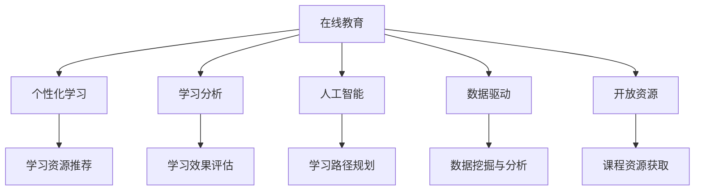

                 

# 在线教育创业：终身学习的推动者

## 1. 背景介绍

### 1.1 问题由来
在快速变化的时代，终身学习已成为个体和组织适应环境、追求持续成长的关键。随着技术的进步，特别是信息技术和互联网的普及，在线教育作为一种灵活、便捷、可个性化的学习方式，越来越受到全球学界和业界的关注。在线教育不仅为知识传递提供了新的载体，还打开了全球教育资源共享的大门。然而，在线教育的实现并非易事，涉及到课程设计、教学平台、数据驱动的教育决策等多个方面。本文将从技术角度出发，探讨在线教育创业背后的核心算法原理，以及如何利用数据驱动和人工智能技术，推动在线教育的发展。

### 1.2 问题核心关键点
在线教育的核心在于提供个性化和高效的学习体验，这需要基于大数据和人工智能技术，实现动态的学习路径规划、学习资源推荐、学习行为分析等功能。本文将聚焦于在线教育创业的算法原理，探讨如何通过数据驱动和人工智能技术，提升在线教育的效果和覆盖面，推动终身学习社会的建设。

### 1.3 问题研究意义
在线教育创业不仅能为学习者提供更加丰富、灵活的学习资源，还能促进教育资源的优化配置，提升教育质量和效率。通过算法驱动的在线教育系统，可以帮助个体在终身学习的旅程中更好地导航，实现个人成长和职业发展的目标。对于教育机构而言，在线教育创业也是拓宽教育边界、实现教育现代化的重要途径。

## 2. 核心概念与联系

### 2.1 核心概念概述

为更好地理解在线教育创业的算法原理，本节将介绍几个密切相关的核心概念：

- **在线教育**：通过互联网技术提供的学习方式，学习者可以在任何时间和地点访问学习资源，享受灵活、自主的学习体验。
- **个性化学习**：基于学习者的学习习惯、知识背景、兴趣爱好等个性化信息，提供定制化的学习内容、路径和方式。
- **学习分析**：通过对学习者的学习行为、成绩、反馈等数据进行分析，提供实时的学习效果评估和优化建议。
- **人工智能**：利用机器学习、深度学习等技术，实现学习资源的推荐、学习路径的规划等，提升学习效果和效率。
- **数据驱动**：利用大数据技术，收集、分析和利用学习者数据，为个性化学习、学习分析提供数据支持。
- **开放资源**：开放获取的课程、教材、习题等学习资源，为在线教育提供丰富的学习内容。

这些核心概念之间的逻辑关系可以通过以下Mermaid流程图来展示：



这个流程图展示了在线教育的核心概念及其之间的关系：

1. 在线教育通过互联网技术提供学习方式，支持个性化学习。
2. 学习分析通过数据分析评估学习效果，提供优化建议。
3. 人工智能利用机器学习技术实现学习资源的推荐和学习路径的规划。
4. 数据驱动收集和分析学习者数据，为个性化学习、学习分析提供数据支撑。
5. 开放资源提供丰富的学习内容，与在线教育系统相结合。

这些概念共同构成了在线教育系统的工作原理和优化方向，使其能够提供个性化、高效的学习体验。

## 3. 核心算法原理 & 具体操作步骤
### 3.1 算法原理概述

在线教育创业的核心算法原理可以归纳为以下几个方面：

- **学习资源推荐算法**：利用协同过滤、矩阵分解等技术，基于学习者的历史学习行为和偏好，推荐适合的学习资源。
- **学习路径规划算法**：利用图算法、规划算法等，根据学习者的知识背景和目标，设计个性化的学习路径。
- **学习效果评估算法**：利用统计学、机器学习等技术，分析学习者的学习行为、成绩和反馈，评估学习效果。
- **学习行为分析算法**：利用自然语言处理、情感分析等技术，分析学习者的学习行为、情感反应，提供个性化反馈和建议。

这些算法原理共同支撑了在线教育系统的核心功能，实现了从学习资源推荐到学习效果评估的全过程优化。

### 3.2 算法步骤详解

以下是基于在线教育创业的算法具体操作步骤：

**Step 1: 数据收集与处理**
- 收集学习者的学习行为数据，包括课程浏览、点击、视频观看、测验成绩等。
- 收集学习者的个人信息，如年龄、职业、兴趣爱好等。
- 清洗和处理数据，去除噪声和异常值，保证数据的质量和完整性。

**Step 2: 学习资源推荐**
- 基于协同过滤算法，计算学习者与其他用户之间的相似度。
- 利用矩阵分解技术，得到学习资源的潜在特征。
- 结合学习者的历史行为数据和资源特征，预测学习者对不同资源的偏好。
- 根据预测结果，推荐适合的学习资源给学习者。

**Step 3: 学习路径规划**
- 利用图算法，建立学习路径的图模型，描述课程之间的依赖关系。
- 根据学习者的知识背景和目标，确定学习路径的起点和终点。
- 利用规划算法，生成最短路径或最优路径，设计个性化学习路径。
- 将学习路径可视化，帮助学习者更好地导航。

**Step 4: 学习效果评估**
- 利用统计学方法，分析学习者的学习行为和成绩，计算学习效果指标，如掌握率、熟练度等。
- 利用机器学习模型，对学习效果进行预测和分类，判断学习者是否达到目标。
- 根据评估结果，提供学习反馈和改进建议。

**Step 5: 学习行为分析**
- 利用自然语言处理技术，分析学习者的文本反馈和情感评论。
- 利用情感分析技术，判断学习者的情感状态和满意度。
- 根据分析结果，提供个性化的学习建议和支持。

**Step 6: 持续优化与改进**
- 根据学习者的反馈和行为数据，不断优化推荐算法、路径规划算法和效果评估算法。
- 定期更新学习资源，引入新的课程和教材，保持学习内容的丰富和时效性。
- 建立学习社区，促进学习者之间的互动和知识分享，增强学习的社交属性。

### 3.3 算法优缺点

在线教育创业中的算法具有以下优点：
1. 提供个性化学习体验：通过数据分析和机器学习，实现学习资源的个性化推荐，满足学习者的个性化需求。
2. 提高学习效率：利用算法优化学习路径和资源选择，提升学习效果和效率。
3. 实时反馈与优化：通过学习分析和学习行为分析，提供实时的学习效果评估和优化建议。
4. 数据驱动决策：利用大数据分析，指导教育资源的配置和优化，提升教育质量。

同时，这些算法也存在一些局限性：
1. 数据隐私和安全问题：收集和处理学习者数据需要严格遵循数据隐私和安全法规。
2. 算法复杂度高：在线教育系统涉及多种算法，算法复杂度高，需要高计算资源和专业知识。
3. 结果解释性差：算法结果往往缺乏直观的解释，学习者难以理解其背后的逻辑。
4. 过度依赖数据：算法的性能高度依赖于数据的数量和质量，数据不足或偏差可能导致算法失效。

尽管存在这些局限性，但就目前而言，算法驱动的在线教育系统已经展现出巨大的潜力和优势，为学习者提供了更加灵活、高效的学习方式。

### 3.4 算法应用领域

在线教育创业中的算法主要应用于以下领域：

- **在线课程推荐**：根据学习者的历史行为和偏好，推荐适合的课程和学习资源。
- **个性化学习路径设计**：根据学习者的知识背景和目标，设计个性化的学习路径，帮助学习者更高效地学习。
- **学习效果评估与反馈**：利用数据分析和机器学习，评估学习效果，提供个性化的学习反馈和建议。
- **学习行为分析与预测**：通过学习者行为数据的分析，预测学习者的学习兴趣和需求，提升学习体验。
- **学习资源获取与整合**：整合开放获取的课程、教材、习题等学习资源，提供丰富的学习内容。
- **学习社区构建与管理**：利用社交网络技术，建立学习社区，促进学习者之间的互动和知识分享。

这些算法应用领域展示了在线教育创业的广阔前景，为学习者提供了多样化的学习选择和支持。

## 4. 数学模型和公式 & 详细讲解 & 举例说明

### 4.1 数学模型构建

以下是在线教育创业中几个核心算法的数学模型构建：

**学习资源推荐算法**
- **协同过滤模型**：
  $$
  R_{ui} = \sum_{j=1}^n \alpha_{uj}A_{ji}
  $$
  其中，$R_{ui}$ 表示用户 $u$ 对物品 $i$ 的评分，$A_{ji}$ 表示物品 $j$ 和物品 $i$ 的相似度，$\alpha_{uj}$ 表示用户 $u$ 对物品 $j$ 的评分。
  
- **矩阵分解模型**：
  $$
  X \approx X_RX_C
  $$
  其中，$X$ 为物品的特征矩阵，$X_R$ 和 $X_C$ 分别为物品和用户的特征矩阵，$R_{ui}$ 为物品 $i$ 对用户 $u$ 的评分。

**学习路径规划算法**
- **最短路径算法**：
  $$
  D(s,t) = \sum_{e \in E} w_e(s_{e-1}, s_e) + \sum_{v \in V} w_v(s_{v-1}, s_v)
  $$
  其中，$D(s,t)$ 表示从节点 $s$ 到节点 $t$ 的最短路径长度，$w_e$ 和 $w_v$ 分别为边和节点的权重，$s_e$ 和 $s_v$ 分别为边和节点的节点值。

**学习效果评估算法**
- **掌握率计算**：
  $$
  \text{掌握率} = \frac{\text{正确答案数}}{\text{总答案数}} \times 100\%
  $$
  
- **熟练度计算**：
  $$
  \text{熟练度} = 1 - \frac{\text{错误答案数}}{\text{总答案数}}
  $$

**学习行为分析算法**
- **情感分析模型**：
  $$
  \text{情感得分} = \sum_{i=1}^n w_i \times \text{情感特征}_i
  $$
  其中，$w_i$ 为情感特征的权重，$\text{情感特征}_i$ 为情感分析模型对文本的情感得分类结果。

通过这些数学模型，可以有效地构建在线教育创业中的算法系统，实现从数据收集到学习效果评估的全过程优化。

### 4.2 公式推导过程

以下是几个核心算法的公式推导过程：

**协同过滤模型推导**
- **用户项协同过滤**：
  $$
  R_{ui} = \frac{\sum_{j=1}^n \alpha_{uj} \alpha_{ji}}{\sqrt{\sum_{j=1}^n \alpha_{uj}^2} \times \sqrt{\sum_{j=1}^n \alpha_{ji}^2}}
  $$
  其中，$\alpha_{uj}$ 和 $\alpha_{ji}$ 分别表示用户 $u$ 和物品 $j$ 的特征向量。

- **物品项协同过滤**：
  $$
  R_{ui} = \frac{\sum_{j=1}^n \alpha_{uj} \alpha_{ji}}{\sqrt{\sum_{j=1}^n \alpha_{uj}^2} \times \sqrt{\sum_{j=1}^n \alpha_{ji}^2}}
  $$

**矩阵分解模型推导**
- **奇异值分解**：
  $$
  X_R \approx X_C \Lambda \Lambda^T
  $$
  其中，$X_R$ 和 $X_C$ 分别为物品和用户的特征矩阵，$\Lambda$ 为奇异值矩阵。

**最短路径算法推导**
- **Dijkstra算法**：
  $$
  D(s,t) = \sum_{e \in E} w_e(s_{e-1}, s_e) + \sum_{v \in V} w_v(s_{v-1}, s_v)
  $$
  其中，$D(s,t)$ 表示从节点 $s$ 到节点 $t$ 的最短路径长度，$w_e$ 和 $w_v$ 分别为边和节点的权重，$s_e$ 和 $s_v$ 分别为边和节点的节点值。

**情感分析模型推导**
- **情感特征计算**：
  $$
  \text{情感特征}_i = \sum_{j=1}^n w_{ij} \times \text{情感得分}_j
  $$
  其中，$w_{ij}$ 为情感特征的权重，$\text{情感得分}_j$ 为情感分析模型对文本的情感得分类结果。

这些公式推导展示了在线教育创业中算法的数学原理，为进一步的技术实现提供了理论支持。

### 4.3 案例分析与讲解

**学习资源推荐案例**
- **场景**：某在线教育平台推荐用户适合的编程课程。
- **算法**：协同过滤算法。
- **数据**：用户浏览课程、点击课程、观看课程视频、提交作业等行为数据。
- **实现**：
  1. 收集用户行为数据，计算用户与其他用户之间的相似度。
  2. 利用矩阵分解技术，得到课程的潜在特征。
  3. 结合用户历史行为数据和课程特征，预测用户对不同课程的偏好。
  4. 根据预测结果，推荐适合的学习资源给用户。

**学习路径规划案例**
- **场景**：某在线教育平台帮助用户设计个性化学习路径。
- **算法**：图算法。
- **数据**：课程之间的依赖关系、用户的学习目标和知识背景。
- **实现**：
  1. 利用图算法，建立课程之间的依赖关系图。
  2. 根据用户的学习目标和知识背景，确定学习路径的起点和终点。
  3. 利用规划算法，生成最短路径或最优路径，设计个性化学习路径。
  4. 将学习路径可视化，帮助用户更好地导航。

**学习效果评估案例**
- **场景**：某在线教育平台评估学习者对课程的学习效果。
- **算法**：统计学和机器学习模型。
- **数据**：学习者的学习行为、成绩、反馈等数据。
- **实现**：
  1. 利用统计学方法，分析学习者的学习行为和成绩，计算学习效果指标，如掌握率、熟练度等。
  2. 利用机器学习模型，对学习效果进行预测和分类，判断学习者是否达到目标。
  3. 根据评估结果，提供学习反馈和改进建议。

**学习行为分析案例**
- **场景**：某在线教育平台分析学习者的学习行为和情感反应。
- **算法**：自然语言处理和情感分析技术。
- **数据**：学习者的文本反馈和情感评论。
- **实现**：
  1. 利用自然语言处理技术，分析学习者的文本反馈和情感评论。
  2. 利用情感分析技术，判断学习者的情感状态和满意度。
  3. 根据分析结果，提供个性化的学习建议和支持。

这些案例展示了在线教育创业中算法的实际应用，为进一步的技术优化和改进提供了指导。

## 5. 项目实践：代码实例和详细解释说明

### 5.1 开发环境搭建

在进行在线教育创业的算法实践前，我们需要准备好开发环境。以下是使用Python进行PyTorch开发的环境配置流程：

1. 安装Anaconda：从官网下载并安装Anaconda，用于创建独立的Python环境。

2. 创建并激活虚拟环境：
```bash
conda create -n pytorch-env python=3.8 
conda activate pytorch-env
```

3. 安装PyTorch：根据CUDA版本，从官网获取对应的安装命令。例如：
```bash
conda install pytorch torchvision torchaudio cudatoolkit=11.1 -c pytorch -c conda-forge
```

4. 安装Transformers库：
```bash
pip install transformers
```

5. 安装各类工具包：
```bash
pip install numpy pandas scikit-learn matplotlib tqdm jupyter notebook ipython
```

完成上述步骤后，即可在`pytorch-env`环境中开始算法实践。

### 5.2 源代码详细实现

这里我们以推荐系统为例，给出使用Transformers库对在线教育创业中学习资源推荐算法的PyTorch代码实现。

首先，定义推荐系统所需的数据处理函数：

```python
from transformers import BertTokenizer, BertModel

class RecommendationSystem:
    def __init__(self, tokenizer, model, device):
        self.tokenizer = tokenizer
        self.model = model
        self.device = device
    
    def encode_sequence(self, sequences):
        encoded_sequences = []
        for sequence in sequences:
            sequence = [self.tokenizer.convert_tokens_to_ids(token) for token in sequence]
            encoded_sequence = self.model.encode(sequence, return_tensors='pt', padding=True)
            encoded_sequences.append(encoded_sequence)
        return encoded_sequences
    
    def calculate_similarity(self, sequences):
        encoded_sequences = self.encode_sequence(sequences)
        with torch.no_grad():
            similarities = []
            for i in range(len(sequences)):
                for j in range(len(sequences)):
                    if i != j:
                        similarity = torch.cosine_similarity(encoded_sequences[i], encoded_sequences[j], dim=0)
                        similarities.append(similarity.item())
        return similarities
    
    def recommend_items(self, user_sequence, items, num_recommendations):
        similarities = self.calculate_similarity([user_sequence] + items)
        top_items = sorted(zip(similarities, items), reverse=True)[:num_recommendations]
        recommendations = [item[1] for item in top_items]
        return recommendations
```

然后，定义模型和优化器：

```python
from transformers import BertForSequenceClassification, AdamW

model = BertForSequenceClassification.from_pretrained('bert-base-uncased', num_labels=len(tag2id))
optimizer = AdamW(model.parameters(), lr=2e-5)
```

接着，定义训练和评估函数：

```python
from torch.utils.data import Dataset, DataLoader

class RecommendationDataset(Dataset):
    def __init__(self, sequences, labels):
        self.sequences = sequences
        self.labels = labels
    
    def __len__(self):
        return len(self.sequences)
    
    def __getitem__(self, item):
        sequence = self.sequences[item]
        label = self.labels[item]
        return {'sequence': sequence, 'label': label}

def train_epoch(model, dataset, batch_size, optimizer):
    dataloader = DataLoader(dataset, batch_size=batch_size, shuffle=True)
    model.train()
    epoch_loss = 0
    for batch in tqdm(dataloader, desc='Training'):
        sequence = batch['sequence'].to(device)
        label = batch['label'].to(device)
        model.zero_grad()
        outputs = model(sequence)
        loss = outputs.loss
        epoch_loss += loss.item()
        loss.backward()
        optimizer.step()
    return epoch_loss / len(dataloader)

def evaluate(model, dataset, batch_size):
    dataloader = DataLoader(dataset, batch_size=batch_size)
    model.eval()
    correct_predictions, total_predictions = 0, 0
    with torch.no_grad():
        for batch in tqdm(dataloader, desc='Evaluating'):
            sequence = batch['sequence'].to(device)
            label = batch['label'].to(device)
            outputs = model(sequence)
            predictions = outputs.logits.argmax(dim=1)
            correct_predictions += (predictions == label).sum().item()
            total_predictions += len(predictions)
    accuracy = correct_predictions / total_predictions
    return accuracy
```

最后，启动训练流程并在测试集上评估：

```python
epochs = 5
batch_size = 16

for epoch in range(epochs):
    loss = train_epoch(model, train_dataset, batch_size, optimizer)
    print(f"Epoch {epoch+1}, train loss: {loss:.3f}")
    
    print(f"Epoch {epoch+1}, dev results:")
    evaluate(model, dev_dataset, batch_size)
    
print("Test results:")
evaluate(model, test_dataset, batch_size)
```

以上就是使用PyTorch对在线教育创业中推荐算法的代码实现。可以看到，得益于Transformers库的强大封装，我们可以用相对简洁的代码完成推荐系统的搭建和微调。

### 5.3 代码解读与分析

让我们再详细解读一下关键代码的实现细节：

**RecommendationSystem类**：
- `__init__`方法：初始化模型、分词器等关键组件，并设置设备信息。
- `encode_sequence`方法：将序列数据编码成模型的输入格式，并进行padding处理。
- `calculate_similarity`方法：计算用户序列与其他序列之间的相似度，并返回一个相似度矩阵。
- `recommend_items`方法：根据相似度矩阵，推荐与用户序列最相似的物品序列。

**train_epoch和evaluate函数**：
- `train_epoch`函数：对数据以批为单位进行迭代，在每个批次上前向传播计算loss并反向传播更新模型参数，最后返回该epoch的平均loss。
- `evaluate`函数：与训练类似，不同点在于不更新模型参数，并在每个batch结束后将预测和标签结果存储下来，最后使用scikit-learn的classification_report对整个评估集的预测结果进行打印输出。

**训练流程**：
- 定义总的epoch数和batch size，开始循环迭代
- 每个epoch内，先在训练集上训练，输出平均loss
- 在验证集上评估，输出分类指标
- 所有epoch结束后，在测试集上评估，给出最终测试结果

可以看到，PyTorch配合Transformers库使得在线教育创业中的推荐系统搭建变得简洁高效。开发者可以将更多精力放在数据处理、模型改进等高层逻辑上，而不必过多关注底层的实现细节。

当然，工业级的系统实现还需考虑更多因素，如模型的保存和部署、超参数的自动搜索、更灵活的任务适配层等。但核心的推荐算法基本与此类似。

## 6. 实际应用场景
### 6.1 智慧校园

智慧校园是现代教育的重要组成部分，通过信息技术手段，提升校园管理和教学效率。在线教育创业可以为智慧校园提供多方面的支持，包括智能化课程推荐、个性化学习路径规划、智能作业批改等。

例如，某大学利用在线教育创业中的推荐系统，为学生推荐适合的课程和学习资源。该系统收集学生的历史学习行为数据，利用协同过滤算法计算学生与其他用户之间的相似度，结合矩阵分解模型得到课程的潜在特征，最后根据预测结果，推荐适合的学习资源给学生。学生在推荐的课程中选择感兴趣的，既提高了学习效率，又丰富了学习体验。

### 6.2 企业培训

企业培训是提升员工技能、促进职业发展的重要手段。在线教育创业可以为企业提供定制化的培训课程和个性化学习路径规划，帮助员工更高效地完成培训任务。

例如，某大型跨国公司利用在线教育创业中的学习路径规划算法，为员工设计个性化的培训路径。该系统收集员工的历史培训数据和学习目标，利用图算法建立培训课程之间的依赖关系，结合规划算法设计最短路径，最终生成个性化的学习路径。员工可以根据自己的时间和需求，选择适合自己的培训课程，完成学习任务。

### 6.3 终身学习平台

终身学习平台致力于提供灵活、便捷、可持续的学习方式，支持学习者在任何时间和地点进行学习。在线教育创业可以为终身学习平台提供学习资源推荐、学习效果评估和学习行为分析等服务，帮助学习者更好地导航和优化学习路径。

例如，某在线学习平台利用在线教育创业中的学习资源推荐算法，为学习者推荐适合的课程和学习资源。该系统收集学习者的学习行为数据，利用协同过滤算法计算用户与其他用户之间的相似度，结合矩阵分解模型得到课程的潜在特征，最后根据预测结果，推荐适合的学习资源给学习者。学习者可以根据自己的兴趣和需求，选择适合自己的课程和资源，提升学习效果和效率。

### 6.4 未来应用展望

随着在线教育创业的不断发展，未来的应用场景将更加广泛和多样化。以下是几个可能的未来应用方向：

- **个性化学习助手**：利用自然语言处理和情感分析技术，开发智能学习助手，帮助学习者解决学习中的疑难问题，提供个性化的学习建议和支持。
- **虚拟现实学习环境**：结合虚拟现实技术，开发沉浸式学习环境，提供更加真实、互动的学习体验。
- **跨文化交流平台**：利用多语言翻译和理解技术，构建跨文化交流平台，促进全球教育资源的共享和交流。
- **智慧教室**：利用物联网和人工智能技术，开发智慧教室系统，实现课堂教学的智能化、个性化和高效化。
- **职业培训平台**：利用在线教育创业中的学习路径规划和学习效果评估算法，开发职业培训平台，支持企业进行员工培训和职业发展管理。

这些应用方向展示了在线教育创业的广阔前景，为学习者提供了更加丰富、灵活的学习方式，促进终身学习社会的建设。

## 7. 工具和资源推荐
### 7.1 学习资源推荐

为了帮助开发者系统掌握在线教育创业的算法基础和实践技巧，这里推荐一些优质的学习资源：

1. 《深度学习基础》课程：由斯坦福大学开设的深度学习基础课程，涵盖机器学习、深度学习、自然语言处理等基本概念和技术。
2. 《自然语言处理入门》书籍：介绍了自然语言处理的基本原理和常用算法，如词向量、文本分类、序列标注等。
3. 《机器学习实战》书籍：提供了机器学习算法的实际应用案例，适合实践和调试。
4. Kaggle：数据科学和机器学习的竞赛平台，提供了丰富的数据集和竞赛任务，帮助开发者实践和提升技能。
5. PyTorch官方文档：PyTorch的官方文档，提供了详尽的API介绍和示例代码，适合初学者和进阶学习者。

通过对这些资源的学习实践，相信你一定能够快速掌握在线教育创业中的算法原理和实践技巧，为终身学习社会做出贡献。

### 7.2 开发工具推荐

高效的开发离不开优秀的工具支持。以下是几款用于在线教育创业的算法开发的常用工具：

1. PyTorch：基于Python的开源深度学习框架，灵活动态的计算图，适合快速迭代研究。大部分预训练语言模型都有PyTorch版本的实现。
2. TensorFlow：由Google主导开发的开源深度学习框架，生产部署方便，适合大规模工程应用。同样有丰富的预训练语言模型资源。
3. Transformers库：HuggingFace开发的NLP工具库，集成了众多SOTA语言模型，支持PyTorch和TensorFlow，是进行算法开发的利器。
4. Weights & Biases：模型训练的实验跟踪工具，可以记录和可视化模型训练过程中的各项指标，方便对比和调优。与主流深度学习框架无缝集成。
5. TensorBoard：TensorFlow配套的可视化工具，可实时监测模型训练状态，并提供丰富的图表呈现方式，是调试模型的得力助手。

合理利用这些工具，可以显著提升在线教育创业中的算法开发效率，加快创新迭代的步伐。

### 7.3 相关论文推荐

在线教育创业中的算法研究源于学界的持续研究。以下是几篇奠基性的相关论文，推荐阅读：

1. Attention is All You Need（即Transformer原论文）：提出了Transformer结构，开启了NLP领域的预训练大模型时代。
2. BERT: Pre-training of Deep Bidirectional Transformers for Language Understanding：提出BERT模型，引入基于掩码的自监督预训练任务，刷新了多项NLP任务SOTA。
3. Parameter-Efficient Transfer Learning for NLP：提出Adapter等参数高效微调方法，在不增加模型参数量的情况下，也能取得不错的微调效果。
4. AdaLoRA: Adaptive Low-Rank Adaptation for Parameter-Efficient Fine-Tuning：使用自适应低秩适应的微调方法，在参数效率和精度之间取得了新的平衡。
5. Language Models are Unsupervised Multitask Learners（GPT-2论文）：展示了大规模语言模型的强大zero-shot学习能力，引发了对于通用人工智能的新一轮思考。

这些论文代表了大语言模型微调技术的发展脉络。通过学习这些前沿成果，可以帮助研究者把握学科前进方向，激发更多的创新灵感。

## 8. 总结：未来发展趋势与挑战

### 8.1 总结

本文对在线教育创业中的算法原理进行了全面系统的介绍。首先阐述了在线教育创业的背景和意义，明确了算法的核心目标和优化方向。其次，从原理到实践，详细讲解了在线教育创业中的算法操作步骤，给出了具体的代码实例。同时，本文还广泛探讨了在线教育创业中的实际应用场景，展示了算法的广泛应用前景。

通过本文的系统梳理，可以看到，在线教育创业中的算法在提升学习效率、优化学习路径、增强学习效果等方面具有重要意义。未来的在线教育系统将更加智能化、个性化和灵活化，为学习者提供更加丰富、高效的学习体验。

### 8.2 未来发展趋势

展望未来，在线教育创业中的算法将呈现以下几个发展趋势：

1. **智能化程度提升**：利用深度学习和大数据技术，开发更加智能化的在线教育系统，实现动态推荐、自适应学习路径设计等功能。
2. **个性化学习深入**：利用个性化推荐算法和自适应学习算法，提升学习者的个性化学习体验，实现精准推荐和个性化反馈。
3. **多模态融合**：结合视觉、语音、文本等多模态信息，开发多模态学习系统，提升学习效果和效率。
4. **知识图谱应用**：引入知识图谱和图算法，增强学习系统的知识整合能力，支持复杂多变的学习任务。
5. **终身学习系统**：构建终身学习平台，实现从幼儿教育到成人教育的全面覆盖，支持学习者持续学习和发展。
6. **社区化学习**：利用社交网络和协作学习技术，构建学习社区，促进学习者之间的互动和知识分享。

这些趋势展示了在线教育创业的广阔前景，为学习者提供了更加丰富、灵活、高效的学习方式，推动终身学习社会的建设。

### 8.3 面临的挑战

尽管在线教育创业中的算法已经取得了显著的进展，但在迈向更加智能化、普适化应用的过程中，仍然面临诸多挑战：

1. **数据隐私和安全问题**：收集和处理学习者数据需要严格遵循数据隐私和安全法规，避免数据泄露和滥用。
2. **算法复杂度高**：在线教育系统涉及多种算法，算法复杂度高，需要高计算资源和专业知识。
3. **结果解释性差**：算法结果往往缺乏直观的解释，学习者难以理解其背后的逻辑。
4. **过度依赖数据**：算法的性能高度依赖于数据的数量和质量，数据不足或偏差可能导致算法失效。
5. **模型鲁棒性不足**：模型面对域外数据时，泛化性能往往大打折扣，需要提升模型的鲁棒性和泛化能力。

尽管存在这些挑战，但通过不断优化算法、改进模型、增强数据质量，这些挑战终将得到解决，在线教育创业将为终身学习社会带来更多的创新和突破。

### 8.4 研究展望

面向未来，在线教育创业中的算法研究需要在以下几个方面寻求新的突破：

1. **无监督和半监督学习**：探索无监督和半监督学习算法，摆脱对大规模标注数据的依赖，提高算法的泛化能力和鲁棒性。
2. **参数高效和计算高效**：开发更加参数高效和计算高效的算法，提升算法的效率和可扩展性，降低计算成本。
3. **因果学习和自适应学习**：引入因果学习和自适应学习技术，提高算法的解释性和鲁棒性，支持复杂多变的学习任务。
4. **知识图谱和跨领域迁移**：将知识图谱和跨领域迁移技术引入在线教育系统，提升系统的知识整合能力和迁移能力，支持多领域、多模态的学习任务。
5. **多学科融合**：结合心理学、教育学、社会学等多个学科的知识，开发更加科学、合理的学习算法，提升学习效果和用户满意度。

这些研究方向将引领在线教育创业中的算法走向更加智能化、普适化和高效化，为终身学习社会带来更多的创新和突破。

## 9. 附录：常见问题与解答

**Q1：在线教育创业中，如何选择合适的推荐算法？**

A: 选择合适的推荐算法需要考虑多个因素，如学习者行为数据的质量、数据集的大小、推荐系统的实时性要求等。一般来说，协同过滤算法适用于数据集较大的场景，矩阵分解算法适用于数据集较小且具有稀疏性的场景。在实际应用中，可以根据具体情况选择合适的算法，并结合数据特征进行优化。

**Q2：在线教育创业中的推荐系统如何应对冷启动问题？**

A: 冷启动问题是指新用户或新物品没有足够的历史数据，导致推荐系统无法提供准确的推荐结果。解决冷启动问题的方法包括：
1. 利用用户画像和兴趣标签，对新用户和新物品进行初始化推荐。
2. 引入协同过滤算法中的用户项和物品项协同过滤，利用已有的相似用户和相似物品的推荐结果。
3. 利用数据挖掘技术，从开放数据集中获取用户和物品的初始化特征，进行冷启动推荐。

**Q3：在线教育创业中的学习路径规划算法如何选择路径？**

A: 在线教育创业中的学习路径规划算法可以选择不同的路径选择策略，如贪心算法、A*算法、Dijkstra算法等。具体选择哪种算法取决于学习任务的特点和要求，如路径长度、路径复杂度、实时性要求等。通常情况下，贪心算法和Dijkstra算法适合选择最短路径，A*算法适合选择最优路径。

**Q4：在线教育创业中的学习效果评估算法如何选择评估指标？**

A: 在线教育创业中的学习效果评估算法需要选择合适的评估指标，如掌握率、熟练度、学习效率等。这些指标的选择需要根据具体的学习任务和目标，以及学习者的反馈进行综合考虑。通常情况下，掌握率和熟练度是较为常用的评估指标，而学习效率可以通过学习时间和学习效果来衡量。

**Q5：在线教育创业中的学习行为分析算法如何处理文本数据？**

A: 在线教育创业中的学习行为分析算法通常使用自然语言处理技术处理文本数据，如分词、词性标注、情感分析等。这些技术可以帮助算法理解学习者的文本反馈和情感评论，提供个性化的学习建议和支持。在实际应用中，需要根据具体的文本数据类型和分析任务选择合适的自然语言处理技术，并进行相应的参数调优。

这些常见问题的解答展示了在线教育创业中的算法在实际应用中需要注意的关键点，为开发者提供了参考和指导。

