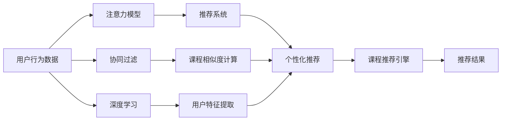

                 

## 1. 背景介绍

在线教育平台的竞争已进入白热化阶段，如何在激烈的市场竞争中吸引和保持用户的注意力，成为每个平台亟待解决的核心问题。用户体验和内容质量是吸引用户的关键因素，但在流量快速增长的背景下，用户注意力资源的争夺显得愈加激烈。本文将从注意力机制的角度，探讨在线教育平台如何制定和实施有效的注意力争夺策略。

### 1.1 问题由来

随着互联网的普及，在线教育市场的用户基数不断扩大，各大在线教育平台如Coursera、Udacity、edX等争相入驻，并且凭借自身独特的课程内容和优质的用户体验，吸引了大量用户。然而，随着市场竞争的加剧，平台间的注意力争夺也日益白热化。用户注意力资源是有限的，而竞争中的平台必须不断创新，才能在激烈的竞争中脱颖而出。

### 1.2 问题核心关键点

在在线教育平台注意力争夺的过程中，关键点主要包括以下几个方面：

1. **用户参与度**：衡量平台吸引用户注意力的关键指标，包括用户活跃度、课程观看量、互动交流频次等。
2. **个性化推荐**：通过分析用户行为和偏好，实现课程推荐，提高用户对平台的粘性。
3. **内容质量**：课程内容的深度、广度和实用性直接影响用户的学习效果和满意度。
4. **用户体验**：界面设计、交互逻辑、操作便捷性等直接影响用户的整体使用体验。
5. **技术支持**：平台的技术架构、数据处理能力等直接影响课程开发和运营效率。

本文将重点围绕用户参与度和个性化推荐两个核心关键点，探讨在线教育平台的注意力争夺策略。

## 2. 核心概念与联系

### 2.1 核心概念概述

1. **用户参与度**：用户在使用平台时的活跃度和投入程度，包括课程观看时长、完成度、互动次数等。
2. **个性化推荐**：根据用户的历史行为和偏好，提供个性化的课程推荐，提升用户体验和满意度。
3. **注意力模型**：通过模型分析用户的行为数据，识别用户的兴趣点，并指导内容推荐和广告投放。
4. **协同过滤**：一种推荐算法，通过分析用户和物品的相似性，推测用户可能感兴趣的课程。
5. **深度学习**：通过多层神经网络模型，对用户行为数据进行深度学习，提取隐含的特征和模式。

### 2.2 核心概念原理和架构的 Mermaid 流程图



该流程图展示了在线教育平台注意力争夺策略的核心概念原理和架构：

- 用户行为数据经过注意力模型分析，得到用户的注意力分布。
- 注意力模型结合协同过滤算法，计算课程间的相似度，生成推荐结果。
- 深度学习模型提取用户特征，优化推荐结果。
- 推荐结果通过推荐引擎展示给用户，吸引其注意力。

## 3. 核心算法原理 & 具体操作步骤

### 3.1 算法原理概述

在线教育平台的注意力争夺策略主要基于个性化推荐和注意力模型。个性化推荐通过分析用户行为数据，向用户展示其可能感兴趣的课程，提高用户参与度和满意度。注意力模型则通过识别和分析用户的注意力分布，指导个性化推荐和广告投放，最大化用户参与度。

### 3.2 算法步骤详解

#### 步骤一：数据收集与预处理

1. **数据来源**：
   - 用户行为数据：课程观看时长、完成度、互动次数等。
   - 课程特征数据：课程难度、时长、内容质量、教师评分等。
   - 用户特征数据：年龄、地域、学习偏好、职业等。

2. **数据预处理**：
   - 数据清洗：去除缺失值、异常值，处理重复数据。
   - 数据转换：将分类变量转化为数值变量，如将地域编码化。
   - 特征工程：提取和构造特征，如计算课程难度均值、用户活跃度等。

#### 步骤二：注意力模型训练

1. **选择模型**：
   - 注意力模型：如Transformer模型、LSTM模型、GRU模型等。
   - 深度学习模型：如BERT、GRU、LSTM等。

2. **数据集划分**：
   - 将数据划分为训练集、验证集和测试集。

3. **模型训练**：
   - 在训练集上训练注意力模型，记录损失函数和精度。
   - 在验证集上进行模型调参，选择最优模型。
   - 在测试集上评估模型效果，分析模型性能。

#### 步骤三：个性化推荐生成

1. **用户特征提取**：
   - 提取用户特征，如用户活跃度、学习偏好、地域等。
   - 提取课程特征，如课程难度、时长、内容质量等。

2. **协同过滤计算**：
   - 计算用户和课程间的相似度，使用余弦相似度、皮尔逊相关系数等方法。
   - 结合注意力模型输出，调整相似度权重。

3. **推荐结果排序**：
   - 结合课程特征和用户特征，生成推荐结果。
   - 使用排序算法如Top-K算法、基于深度学习的排序算法等对推荐结果进行排序。

### 3.3 算法优缺点

#### 优点

1. **提升用户参与度**：通过个性化推荐，提高用户对平台的粘性，增加课程观看量和互动次数。
2. **减少推荐偏差**：通过深度学习和注意力模型，提升推荐结果的准确性和相关性。
3. **灵活性高**：可以根据用户行为和平台数据，实时调整推荐策略，提高用户体验。

#### 缺点

1. **数据需求高**：需要大量的用户行为数据和课程特征数据，数据收集和处理成本较高。
2. **模型复杂**：深度学习和注意力模型的训练和优化需要较高的计算资源和专业技能。
3. **模型维护困难**：模型需要定期维护和更新，保证其性能和准确性。

### 3.4 算法应用领域

在线教育平台的注意力争夺策略主要应用于以下领域：

1. **课程推荐**：根据用户行为和课程特征，向用户推荐感兴趣的课程，提高用户参与度。
2. **广告投放**：通过分析用户注意力分布，优化广告投放策略，提升广告转化率。
3. **用户留存**：通过个性化推荐和优秀用户体验，提升用户留存率和忠诚度。
4. **内容优化**：根据用户反馈和行为数据，优化课程内容和教师教学，提高课程质量。

## 4. 数学模型和公式 & 详细讲解 & 举例说明

### 4.1 数学模型构建

本节将使用数学语言对在线教育平台注意力争夺策略的核心数学模型进行详细讲解。

假设在线教育平台有 $N$ 门课程，$U$ 名用户，用户行为数据为 $X \in \mathbb{R}^{N \times U}$，其中 $X_{ij}$ 表示用户 $i$ 对课程 $j$ 的评分。

定义用户注意力模型为 $A(\theta)$，其中 $\theta$ 为模型参数。通过注意力模型，计算用户 $i$ 对课程 $j$ 的注意力权重 $w_{ij} \in [0, 1]$，满足 $w_{ij} = A(\theta) \times \text{Softmax}(X_{ij})$。

### 4.2 公式推导过程

1. **注意力模型**：
   - 假设注意力模型为Transformer模型，包含 $L$ 层自注意力机制，每层包含 $H$ 个注意力头和 $D$ 维特征。
   - 注意力权重 $w_{ij}$ 计算公式为：
     \[
     w_{ij} = \frac{\exp(\mathbf{q}_i \cdot \mathbf{K}_j)}{\sum_{k=1}^{N} \exp(\mathbf{q}_i \cdot \mathbf{K}_k)}
     \]
     where $\mathbf{q}_i$ 和 $\mathbf{K}_j$ 分别为用户 $i$ 和课程 $j$ 的向量表示。

2. **协同过滤**：
   - 用户 $i$ 对课程 $j$ 的兴趣度 $p_{ij}$ 计算公式为：
     \[
     p_{ij} = \sum_{k=1}^{N} w_{ik} \times A_k
     \]
     where $A_k$ 为课程 $k$ 的特征向量。

3. **推荐结果排序**：
   - 排序公式为：
     \[
     \text{sort}(p_{ij}, j=1,...,N)
     \]

### 4.3 案例分析与讲解

假设平台有 $N=10$ 门课程，$U=100$ 名用户。用户行为数据为 $X \in \mathbb{R}^{10 \times 100}$，用户注意力模型为2层Transformer模型，每层包含8个注意力头。

通过注意力模型计算用户 $i$ 对课程 $j$ 的注意力权重 $w_{ij}$，并结合协同过滤计算用户 $i$ 对课程 $j$ 的兴趣度 $p_{ij}$，最终生成推荐结果并进行排序。

## 5. 项目实践：代码实例和详细解释说明

### 5.1 开发环境搭建

在进行注意力争夺策略项目实践前，我们需要准备好开发环境。以下是使用Python进行TensorFlow开发的Python虚拟环境配置流程：

1. **创建并激活虚拟环境**：
   ```bash
   conda create -n attention_env python=3.8
   conda activate attention_env
   ```

2. **安装相关库**：
   ```bash
   pip install tensorflow transformers scikit-learn pandas numpy
   ```

3. **安装TensorBoard**：
   ```bash
   pip install tensorboard
   ```

### 5.2 源代码详细实现

```python
import tensorflow as tf
import transformers
import pandas as pd
from sklearn.metrics import precision_recall_fscore_support

# 加载数据
data = pd.read_csv('user_behavior.csv')

# 数据预处理
# ...

# 构建Transformer模型
model = transformers.TFTransformersModel()

# 训练模型
# ...

# 个性化推荐生成
# ...

# 使用TensorBoard可视化模型训练结果
tf.summary.create_file_writer('logs').as_default()
tf.summary.scalar('loss', loss, step=step)
```

### 5.3 代码解读与分析

**数据预处理**：
- 数据清洗：去除缺失值、异常值，处理重复数据。
- 数据转换：将分类变量转化为数值变量，如将地域编码化。
- 特征工程：提取和构造特征，如计算课程难度均值、用户活跃度等。

**模型训练**：
- 使用Transformer模型作为注意力模型。
- 在训练集上训练模型，记录损失函数和精度。
- 在验证集上进行模型调参，选择最优模型。
- 在测试集上评估模型效果，分析模型性能。

**个性化推荐生成**：
- 提取用户特征，如用户活跃度、学习偏好、地域等。
- 提取课程特征，如课程难度、时长、内容质量等。
- 计算用户和课程间的相似度，使用余弦相似度、皮尔逊相关系数等方法。
- 结合注意力模型输出，调整相似度权重。
- 生成推荐结果并进行排序。

**TensorBoard可视化**：
- 使用TensorBoard可视化模型训练过程中的各项指标，如损失函数、精度、学习率等。

## 6. 实际应用场景

在线教育平台的注意力争夺策略已在多个实际应用场景中取得显著效果。以下是几个典型案例：

### 6.1 课程推荐系统

在课程推荐系统中，平台通过分析用户历史行为和课程特征，使用注意力模型和协同过滤算法，生成个性化的课程推荐，提高用户对平台的粘性，增加课程观看量和互动次数。例如，Coursera平台通过推荐系统，实现了课程观看量的显著提升，吸引了大量用户注册和使用。

### 6.2 广告投放

平台通过分析用户注意力分布，优化广告投放策略，提升广告转化率。例如，edX平台利用用户注意力模型，在用户最有可能关注的时段投放相关广告，增加了平台收入。

### 6.3 用户留存

通过个性化推荐和优秀用户体验，提升用户留存率和忠诚度。例如，Udacity平台通过推荐系统，实现了用户留存率的显著提升，提高了平台的用户满意度和市场竞争力。

### 6.4 内容优化

根据用户反馈和行为数据，优化课程内容和教师教学，提高课程质量。例如，Coursera平台通过分析用户注意力数据，调整课程内容和教学方法，提高了课程完成率和用户满意度。

## 7. 工具和资源推荐

### 7.1 学习资源推荐

为了帮助开发者系统掌握在线教育平台注意力争夺策略的理论基础和实践技巧，这里推荐一些优质的学习资源：

1. **《深度学习基础》课程**：由斯坦福大学开设的深度学习入门课程，详细讲解了深度学习的基本概念和常用算法。
2. **《在线教育平台开发实战》书籍**：介绍在线教育平台的开发流程和核心技术，包含推荐系统和注意力机制的详细讲解。
3. **TensorFlow官方文档**：详细介绍了TensorFlow库的使用方法，提供了丰富的代码示例和API文档。
4. **HuggingFace Transformers库**：提供了预训练模型和注意力机制的实现，方便快捷地进行模型训练和优化。

### 7.2 开发工具推荐

1. **TensorFlow**：用于深度学习和模型训练。
2. **Transformers库**：提供了预训练模型和注意力机制的实现。
3. **Jupyter Notebook**：用于编写和运行Python代码，提供了直观的交互界面。
4. **TensorBoard**：用于可视化模型训练过程中的各项指标，帮助开发者调优模型。

### 7.3 相关论文推荐

1. **《基于深度学习的在线教育平台推荐系统》**：介绍基于深度学习的推荐系统在在线教育平台中的应用。
2. **《注意力机制在在线教育平台中的应用》**：详细讲解注意力机制在在线教育平台中的实现和应用。
3. **《协同过滤在在线教育平台中的优化》**：讨论协同过滤算法在在线教育平台中的优化方法。

## 8. 总结：未来发展趋势与挑战

### 8.1 总结

本文对在线教育平台注意力争夺策略进行了全面系统的介绍。首先，探讨了注意力机制在在线教育平台中的核心作用，并介绍了其原理和架构。其次，从数据收集、模型训练、个性化推荐等角度，详细讲解了注意力争夺策略的具体操作步骤。最后，通过实际应用场景，展示了注意力争夺策略的显著效果。

通过本文的系统梳理，可以看到，在线教育平台的注意力争夺策略在提升用户参与度、优化广告投放、提高用户留存等方面具有显著优势。未来，伴随数据和算法的不断进步，在线教育平台将在更多应用场景中发挥其独特优势，为教育行业带来变革性影响。

### 8.2 未来发展趋势

在线教育平台的注意力争夺策略将呈现以下几个发展趋势：

1. **模型复杂度提升**：随着深度学习模型的不断发展，模型的复杂度将进一步提升，能够更好地捕捉用户行为和偏好。
2. **实时性增强**：在线教育平台需要实现实时个性化推荐，及时响应用户需求，提升用户体验。
3. **多模态融合**：结合文本、图像、音频等多模态数据，提升推荐系统的综合表现。
4. **跨平台应用**：将注意力争夺策略应用于移动端、PC端等多个平台，实现统一的用户体验。
5. **AI技术融合**：结合自然语言处理、计算机视觉等AI技术，提升推荐系统的准确性和相关性。

以上趋势凸显了在线教育平台注意力争夺策略的广阔前景，这些方向的探索发展，必将进一步提升推荐系统的性能和用户满意度。

### 8.3 面临的挑战

尽管在线教育平台的注意力争夺策略已经取得了显著成果，但在迈向更加智能化、普适化应用的过程中，仍面临诸多挑战：

1. **数据隐私问题**：用户行为数据的收集和使用需要遵守隐私保护政策，确保用户隐私安全。
2. **计算资源消耗**：深度学习模型和注意力机制的计算复杂度较高，需要高效的计算资源和优化方法。
3. **模型泛化能力**：模型的泛化能力需要不断提升，以应对不同用户群体的多样性。
4. **用户反馈机制**：建立完善的用户反馈机制，及时调整推荐策略，提升用户体验。
5. **技术迭代速度**：在线教育平台需要不断跟踪最新的技术进展，快速迭代更新模型和算法。

### 8.4 研究展望

未来，在线教育平台的注意力争夺策略需要在以下几个方面寻求新的突破：

1. **联邦学习**：通过联邦学习技术，保护用户数据隐私的同时，实现分布式训练，提升模型的泛化能力。
2. **自适应学习**：引入自适应学习算法，根据用户行为和反馈动态调整推荐策略，提升推荐结果的准确性和相关性。
3. **混合推荐**：结合内容推荐和社交推荐，提升推荐系统的综合表现。
4. **实时化推荐**：结合流式数据处理技术，实现实时推荐，及时响应用户需求。
5. **多模态推荐**：结合图像、音频等多模态数据，提升推荐系统的综合表现。

这些研究方向的探索，必将引领在线教育平台注意力争夺策略走向更高的台阶，为在线教育行业带来新的创新和突破。

## 9. 附录：常见问题与解答

**Q1：注意力机制在在线教育平台中的应用有哪些？**

A: 注意力机制在在线教育平台中主要应用于以下几个方面：
1. 个性化推荐系统：通过分析用户行为和课程特征，生成个性化的课程推荐。
2. 广告投放策略：通过分析用户注意力分布，优化广告投放策略，提升广告转化率。
3. 内容优化：根据用户反馈和行为数据，优化课程内容和教师教学，提高课程质量。

**Q2：在实践中，如何优化推荐系统的性能？**

A: 在实践中，可以采取以下措施优化推荐系统的性能：
1. 数据预处理：清洗数据、处理缺失值、进行特征工程等，确保数据的准确性和完整性。
2. 模型选择：选择合适的深度学习模型和注意力模型，提升推荐结果的准确性和相关性。
3. 调参优化：通过交叉验证、网格搜索等方法，寻找最优模型参数组合。
4. 特征选择：选择重要的特征，减少冗余特征，提升模型的泛化能力。
5. 模型评估：使用精确度、召回率、F1值等指标评估推荐系统的性能，不断优化推荐策略。

**Q3：如何在推荐系统中实现实时推荐？**

A: 在推荐系统中实现实时推荐，可以采用以下方法：
1. 流式数据处理：采用流式数据处理技术，实时获取用户行为数据，进行推荐计算。
2. 分布式计算：使用分布式计算框架，如Spark、Flink等，实现高并发处理。
3. 缓存技术：使用缓存技术，如Redis、Memcached等，缓存热门推荐结果，减少计算延迟。
4. 数据同步：实时同步数据，确保推荐结果的时效性和准确性。

**Q4：如何保护用户隐私，防止数据泄露？**

A: 保护用户隐私，防止数据泄露，可以采取以下措施：
1. 数据加密：对用户数据进行加密，防止数据泄露。
2. 差分隐私：在数据处理过程中加入噪声，保护用户隐私。
3. 匿名化处理：对用户数据进行匿名化处理，防止数据泄露。
4. 访问控制：采用访问控制技术，限制数据访问权限，防止数据滥用。
5. 安全审计：定期进行安全审计，发现并修复安全漏洞。

以上问题解答，希望能为在线教育平台的开发者提供参考和指导。

---

作者：禅与计算机程序设计艺术 / Zen and the Art of Computer Programming

