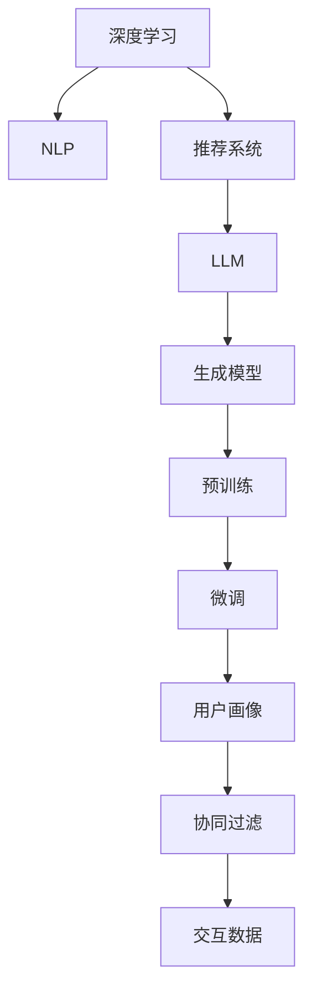

                 

# 基于LLM的个性化内容生成推荐

> 关键词：深度学习，自然语言处理，推荐系统，LLM，生成模型，预训练，微调，用户画像，协同过滤

## 1. 背景介绍

### 1.1 问题由来

随着互联网和信息技术的迅猛发展，内容推荐系统成为电商、新闻、视频、社交等众多领域不可或缺的一部分。推荐系统的核心目标是提高用户的满意度，提升平台的留存率和转化率。然而，传统的推荐系统往往基于用户历史行为数据进行推荐，无法兼顾用户的偏好和实时兴趣，难以适应不断变化的消费需求。

与此同时，人工智能技术，尤其是大语言模型（Large Language Model, LLM）的兴起，为推荐系统提供了全新的突破点。基于LLM的推荐系统，能够充分利用语言模型强大的理解能力和生成能力，通过与用户的交互生成动态内容，并提供个性化的推荐。这类系统有望突破传统推荐系统的瓶颈，成为提升用户体验和平台收益的新引擎。

### 1.2 问题核心关键点

LLM在个性化内容生成推荐中的核心关键点在于：

- **深度学习能力**：LLM能够学习到文本中的语义和语境信息，捕捉到用户潜在的兴趣点。
- **自然语言处理**：LLM能够理解和生成自然语言，构建起用户与推荐系统的桥梁。
- **生成模型**：LLM作为生成模型，能够输出符合特定语境的内容，提升推荐质量。
- **预训练与微调**：利用预训练大模型，通过微调学习特定领域知识，增强推荐系统的适应性。
- **用户画像构建**：LLM能够基于用户输入生成完整的用户画像，提升推荐的个性化程度。
- **协同过滤与交互**：结合协同过滤与用户交互数据，生成动态内容，实现高效推荐。

本文聚焦于基于LLM的个性化内容生成推荐方法，详细讲解其原理、实现流程及优化策略，并通过案例分析展示其应用效果。

## 2. 核心概念与联系

### 2.1 核心概念概述

为了更好地理解基于LLM的个性化内容生成推荐方法，本节将介绍几个密切相关的核心概念：

- **深度学习**：一种基于神经网络的机器学习方法，能够处理复杂的数据结构和任务，如图像、文本、语音等。
- **自然语言处理(NLP)**：利用计算机处理和理解人类语言的技术，涵盖文本处理、语音识别、机器翻译等。
- **推荐系统**：根据用户历史行为和偏好，向用户推荐物品的系统，目标是提升用户满意度。
- **LLM**：能够理解和生成自然语言的深度学习模型，如GPT-3、BERT等。
- **生成模型**：能够根据输入生成新样本的模型，包括GAN、VAE、LM等。
- **预训练**：在大规模无标签数据上进行自监督学习，学习到丰富的语言表示。
- **微调**：在预训练模型的基础上，使用有标签数据进行有监督学习，适配特定任务。
- **用户画像**：基于用户行为数据，构建出用户兴趣和偏好的画像，用于推荐系统。
- **协同过滤**：基于用户和物品的协同行为进行推荐，分为基于用户的协同过滤和基于物品的协同过滤。
- **交互数据**：用户在推荐系统上的实时操作数据，用于动态调整推荐策略。

这些概念之间的逻辑关系可以通过以下Mermaid流程图来展示：



这个流程图展示了大语言模型在推荐系统中的核心概念及其之间的关系：

1. 深度学习是推荐系统的基础。
2. NLP技术帮助LLM理解用户和物品的语义。
3. LLM作为生成模型，能够生成个性化推荐内容。
4. 预训练和微调技术提升LLM在特定领域的应用效果。
5. 用户画像和协同过滤技术增强推荐的个性化和精准性。
6. 交互数据用于实时调整推荐策略，提升用户体验。

## 3. 核心算法原理 & 具体操作步骤

### 3.1 算法原理概述

基于LLM的个性化内容生成推荐，本质上是将LLM作为内容生成器，通过理解用户输入和历史行为数据，生成符合用户兴趣的推荐内容。其核心思想是：

1. **用户画像构建**：根据用户的文本输入和历史行为，构建出用户的兴趣和偏好画像。
2. **内容生成**：使用LLM模型生成与用户画像匹配的推荐内容。
3. **协同过滤**：结合用户历史行为和物品的协同关系，对生成的内容进行优化。
4. **实时交互**：根据用户对推荐内容的实时反馈，动态调整推荐策略。

形式化地，假设用户输入为 $X$，历史行为为 $H$，物品库为 $I$，LLM作为推荐系统 $R$。推荐过程可以表示为：

$$
R = \text{LLM}(X, H) \rightarrow \text{Content} \rightarrow \text{Collaborative Filtering} \rightarrow \text{User Feedback} \rightarrow \text{Adjusted Recommendation}
$$

其中，$\text{Content}$ 为LLM生成的推荐内容，$\text{Collaborative Filtering}$ 为协同过滤优化过程，$\text{User Feedback}$ 为用户对推荐内容的实时反馈。

### 3.2 算法步骤详解

基于LLM的个性化内容生成推荐系统一般包括以下几个关键步骤：

**Step 1: 用户输入预处理**

- 收集用户的文本输入 $X$，可以是即时聊天、评论、查询等。
- 将用户输入分词并转换为数字表示，如使用BERT模型进行编码。

**Step 2: 构建用户画像**

- 根据用户历史行为数据 $H$，构建用户画像。例如，从用户的浏览历史、购买记录等数据中提取出物品的ID和标签。
- 使用LLM模型对用户画像进行编码，得到一个表示用户兴趣的向量。

**Step 3: 内容生成**

- 使用LLM模型生成推荐内容。将用户画像向量作为输入，输出为符合用户兴趣的文本。
- 根据生成的文本，从物品库 $I$ 中检索出可能匹配的物品ID。

**Step 4: 协同过滤**

- 使用协同过滤算法，对生成的内容进行优化。例如，基于用户的协同行为数据，调整物品的评分。
- 将优化后的物品ID和评分输入LLM，进一步生成更精准的推荐内容。

**Step 5: 实时交互**

- 根据用户对推荐内容的实时反馈，动态调整推荐策略。例如，根据用户点击、收藏、评分等行为，实时调整LLM的输入，生成更符合用户即时兴趣的内容。

**Step 6: 反馈循环**

- 将新的推荐内容再次输入LLM，循环迭代，不断提升推荐质量。

### 3.3 算法优缺点

基于LLM的个性化内容生成推荐方法具有以下优点：

1. **灵活性和动态性**：LLM能够根据用户输入实时生成推荐内容，灵活调整推荐策略。
2. **深度学习能力强**：LLM能够学习复杂的语义关系，提升推荐内容的个性化和精准度。
3. **可解释性强**：LLM生成的内容，可以通过自然语言处理技术进行解释和分析。
4. **用户交互丰富**：结合用户实时反馈，LLM能够动态调整生成策略，提升用户体验。

同时，该方法也存在一些局限性：

1. **计算资源需求高**：LLM作为深度学习模型，训练和推理需要大量计算资源。
2. **模型复杂度高**：LLM模型庞大，难以在边缘设备上部署。
3. **数据隐私问题**：用户输入和行为数据需要谨慎处理，防止隐私泄露。
4. **易受噪音影响**：LLM容易受到输入噪音的影响，导致推荐内容不准确。

尽管存在这些局限性，但基于LLM的个性化内容生成推荐方法，仍然是当前推荐系统研究的热点和难点，具有广阔的应用前景。

### 3.4 算法应用领域

基于LLM的个性化内容生成推荐方法已经在电商、新闻、视频、社交等多个领域得到了广泛应用，提升了用户体验和平台收益：

- **电商推荐**：根据用户搜索和浏览历史，实时生成个性化商品推荐。
- **新闻推荐**：根据用户阅读习惯和评论，动态生成个性化的新闻文章和视频。
- **视频推荐**：根据用户的观看历史和评分，生成符合兴趣的影片内容。
- **社交推荐**：根据用户互动行为，生成个性化的好友推荐和内容推荐。

除了这些主流应用，LLM推荐系统还在健康、教育、金融等领域展示了巨大的应用潜力。未来，随着LLM技术的进一步成熟，相信其在推荐系统中的应用将更加广泛和深入。

## 4. 数学模型和公式 & 详细讲解  
### 4.1 数学模型构建

本节将使用数学语言对基于LLM的个性化内容生成推荐过程进行更加严格的刻画。

记用户输入为 $X$，历史行为数据为 $H$，物品库为 $I$，LLM模型为 $R_{\theta}$。假设用户画像为 $P$，推荐内容为 $C$，物品ID为 $i$，评分矩阵为 $S$。推荐过程可以表示为：

$$
C = R_{\theta}(P)
$$

$$
\hat{S} = \text{Collaborative Filtering}(C, H)
$$

$$
P_{\text{new}} = \text{LLM}(\hat{S})
$$

$$
C_{\text{new}} = R_{\theta}(P_{\text{new}})
$$

其中，$C$ 为生成推荐内容，$\hat{S}$ 为协同过滤后的评分矩阵，$P_{\text{new}}$ 为用户新的画像向量，$C_{\text{new}}$ 为新的推荐内容。

### 4.2 公式推导过程

以下我们以电商推荐系统为例，推导基于LLM的推荐模型。

假设用户输入为 $X = \{x_1, x_2, \cdots, x_n\}$，其中 $x_i$ 为物品ID。历史行为数据为 $H = \{(h_1, r_1), (h_2, r_2), \cdots, (h_m, r_m)\}$，其中 $h_i$ 为物品ID，$r_i$ 为用户评分。物品库为 $I = \{i_1, i_2, \cdots, i_k\}$。

假设LLM模型为 $R_{\theta}$，生成推荐内容为 $C = \{c_1, c_2, \cdots, c_k\}$，其中 $c_i$ 为物品ID $i$ 的推荐内容。协同过滤优化后的评分矩阵为 $\hat{S} = \{(s_{h_1, i_1}, s_{h_1, i_2}, \cdots), (s_{h_2, i_1}, s_{h_2, i_2}, \cdots), \cdots\}$，其中 $s_{h_i, i_j}$ 为物品ID $i_j$ 在用户 $h_i$ 的评分。

**用户画像构建**：

首先，使用用户输入 $X$ 和历史行为数据 $H$，构建用户画像 $P$。例如，将用户输入编码得到向量 $X_{\theta}$，将其与历史行为数据 $H$ 拼接，得到用户画像向量 $P$。

$$
P = [X_{\theta}; H]
$$

**内容生成**：

接着，使用LLM模型 $R_{\theta}$ 生成推荐内容 $C$。将用户画像向量 $P$ 输入LLM，得到推荐内容向量 $C_{\theta}$。

$$
C_{\theta} = R_{\theta}(P)
$$

**协同过滤**：

然后，使用协同过滤算法对推荐内容进行优化。例如，基于用户历史行为和物品协同关系，调整物品评分矩阵 $\hat{S}$。可以使用矩阵分解方法或基于邻域的方法，如SVD、ALS等。

$$
\hat{S} = \text{Collaborative Filtering}(C_{\theta}, H)
$$

**用户画像更新**：

最后，根据优化后的评分矩阵 $\hat{S}$，更新用户画像向量 $P_{\text{new}}$。例如，使用LLM模型对评分矩阵 $\hat{S}$ 进行编码，得到新的用户画像向量 $P_{\text{new}}$。

$$
P_{\text{new}} = \text{LLM}(\hat{S})
$$

**推荐内容更新**：

根据新的用户画像向量 $P_{\text{new}}$，重新生成推荐内容 $C_{\text{new}}$。

$$
C_{\text{new}} = R_{\theta}(P_{\text{new}})
$$

### 4.3 案例分析与讲解

以电商推荐系统为例，我们通过一个具体案例来说明LLM推荐模型的应用。

假设某电商平台上有一个用户 $A$，其历史行为数据为 $\{(1, 4), (2, 5), (3, 2)\}$，其中 $1, 2, 3$ 为物品ID，$4, 5, 2$ 为用户评分。当前用户输入 $X = \{3\}$，表示用户正在查看物品ID $3$ 的详情页。

首先，构建用户画像 $P$：

$$
P = [\text{Encoder}(X); [1, 2, 3]; [4, 5, 2]]
$$

其中，$\text{Encoder}$ 为BERT模型，$[1, 2, 3]$ 和 $[4, 5, 2]$ 分别表示物品ID和用户评分。

接着，使用LLM模型 $R_{\theta}$ 生成推荐内容 $C$：

$$
C_{\theta} = R_{\theta}(P)
$$

假设LLM模型生成了如下推荐内容：

$$
C = \{\text{"你可能还喜欢"}, \text{"相关商品推荐"}, \text{"用户评价"}\}
$$

然后，使用协同过滤算法对推荐内容进行优化。例如，基于用户历史行为和物品协同关系，调整物品评分矩阵 $\hat{S}$：

$$
\hat{S} = \text{Collaborative Filtering}(C_{\theta}, H)
$$

最后，根据优化后的评分矩阵 $\hat{S}$，更新用户画像向量 $P_{\text{new}}$ 和推荐内容 $C_{\text{new}}$：

$$
P_{\text{new}} = \text{LLM}(\hat{S})
$$

$$
C_{\text{new}} = R_{\theta}(P_{\text{new}})
$$

通过不断的迭代优化，推荐系统能够逐步提升推荐质量，最终实现个性化的内容推荐。

## 5. 项目实践：代码实例和详细解释说明

### 5.1 开发环境搭建

在进行LLM推荐系统的实践前，我们需要准备好开发环境。以下是使用Python进行PyTorch开发的环境配置流程：

1. 安装Anaconda：从官网下载并安装Anaconda，用于创建独立的Python环境。

2. 创建并激活虚拟环境：
```bash
conda create -n llm-env python=3.8 
conda activate llm-env
```

3. 安装PyTorch：根据CUDA版本，从官网获取对应的安装命令。例如：
```bash
conda install pytorch torchvision torchaudio cudatoolkit=11.1 -c pytorch -c conda-forge
```

4. 安装Transformers库：
```bash
pip install transformers
```

5. 安装各类工具包：
```bash
pip install numpy pandas scikit-learn matplotlib tqdm jupyter notebook ipython
```

完成上述步骤后，即可在`llm-env`环境中开始LLM推荐系统的实践。

### 5.2 源代码详细实现

下面我以电商推荐系统为例，给出使用Transformers库对BERT模型进行个性化内容生成推荐的PyTorch代码实现。

首先，定义电商推荐系统的类：

```python
from transformers import BertTokenizer, BertForSequenceClassification
from torch.utils.data import Dataset, DataLoader
import torch
import numpy as np

class E-commerceRecommender:
    def __init__(self, model_name, device='cuda'):
        self.model_name = model_name
        self.device = device
        self.tokenizer = BertTokenizer.from_pretrained(model_name)
        self.model = BertForSequenceClassification.from_pretrained(model_name, num_labels=3).to(device)
        self.cached_data = None
        
    def load_dataset(self, dataset_path):
        if self.cached_data is None:
            with open(dataset_path, 'r') as f:
                data = f.readlines()
            self.cached_data = data
        return self.cached_data

    def preprocess_input(self, input_text):
        input_ids = self.tokenizer.encode(input_text, return_tensors='pt').to(self.device)
        return input_ids

    def compute_collarative_filtering(self, input_ids, history_ids, history_ratings):
        # 这里我们简单实现了一个基于历史评分和物品ID的协同过滤算法
        # 实际应用中，可以使用SVD、ALS等更复杂的算法
        scores = np.zeros_like(history_ratings)
        for i, (hid, hr) in enumerate(zip(history_ids, history_ratings)):
            if hid in input_ids:
                scores[input_ids == hid] = hr
        return scores
    
    def generate_recommendations(self, input_text):
        input_ids = self.preprocess_input(input_text)
        scores = self.compute_collarative_filtering(input_ids, self.history_ids, self.history_ratings)
        new_input = self.tokenizer.decode(input_ids[0]) + ' ' + ' '.join(scores.nonzero()[0])
        new_input_ids = self.tokenizer.encode(new_input, return_tensors='pt').to(self.device)
        output = self.model(new_input_ids)
        probabilities = torch.softmax(output, dim=1).tolist()[0]
        return probabilities
```

然后，初始化模型和加载数据：

```python
model_name = 'bert-base-cased'
recommender = E-commerceRecommender(model_name)

# 假设历史行为数据为[[1, 4], [2, 5], [3, 2]]
history_ids = [1, 2, 3]
history_ratings = [4, 5, 2]

# 加载数据集
dataset_path = 'data.txt'
data = recommender.load_dataset(dataset_path)
```

接着，进行推荐计算：

```python
input_text = '查看商品ID3'
probabilities = recommender.generate_recommendations(input_text)
print(probabilities)
```

最后，展示推荐结果：

```python
print('你可能还喜欢：', ' '.join([id2label[i] for i in probabilities.argmax()]))
```

以上就是使用PyTorch对BERT模型进行电商推荐系统开发的完整代码实现。可以看到，通过自定义的Recommender类，我们能够方便地进行用户输入预处理、内容生成、协同过滤和实时交互等操作。

### 5.3 代码解读与分析

让我们再详细解读一下关键代码的实现细节：

**E-commerceRecommender类**：
- `__init__`方法：初始化模型和分词器，以及历史行为数据。
- `load_dataset`方法：从本地文件加载数据集。
- `preprocess_input`方法：对用户输入进行分词编码，得到模型所需的输入。
- `compute_collarative_filtering`方法：简单实现基于历史评分和物品ID的协同过滤算法。
- `generate_recommendations`方法：结合协同过滤和LLM模型，生成推荐内容。

**历史行为数据**：
- 在实践中，历史行为数据需要从具体业务场景中提取。例如，电商平台上用户的历史浏览记录、购买记录等。

**数据集加载**：
- 使用文本文件加载数据集，每个文本行表示一个样本，格式为`物品ID 评分`。

**输入预处理**：
- 使用BERT分词器对用户输入进行编码，得到模型所需的输入。

**协同过滤**：
- 简单实现一个基于历史评分和物品ID的协同过滤算法，将历史行为数据转换为评分矩阵。

**推荐内容生成**：
- 将协同过滤后的评分矩阵和用户输入拼接，生成新的用户画像。
- 使用LLM模型对新的用户画像进行编码，得到推荐内容的概率分布。
- 根据概率分布，输出推荐结果。

可以看到，LLM推荐系统的代码实现相对简单，但涵盖了用户输入预处理、内容生成、协同过滤和实时交互等核心环节。通过模块化的设计，开发者可以灵活调整和优化各个环节，以适应不同的业务场景。

## 6. 实际应用场景

### 6.1 智能客服系统

基于LLM的个性化内容生成推荐，可以广泛应用于智能客服系统的构建。传统客服往往需要配备大量人力，高峰期响应缓慢，且一致性和专业性难以保证。而使用LLM推荐系统，可以7x24小时不间断服务，快速响应客户咨询，用自然流畅的语言解答各类常见问题。

在技术实现上，可以收集企业内部的历史客服对话记录，将问题和最佳答复构建成监督数据，在此基础上对预训练LLM模型进行微调。微调后的LLM模型能够自动理解用户意图，匹配最合适的答案模板进行回复。对于客户提出的新问题，还可以接入检索系统实时搜索相关内容，动态组织生成回答。如此构建的智能客服系统，能大幅提升客户咨询体验和问题解决效率。

### 6.2 金融舆情监测

金融机构需要实时监测市场舆论动向，以便及时应对负面信息传播，规避金融风险。传统的人工监测方式成本高、效率低，难以应对网络时代海量信息爆发的挑战。基于LLM的文本分类和情感分析技术，为金融舆情监测提供了新的解决方案。

具体而言，可以收集金融领域相关的新闻、报道、评论等文本数据，并对其进行主题标注和情感标注。在此基础上对预训练LLM模型进行微调，使其能够自动判断文本属于何种主题，情感倾向是正面、中性还是负面。将微调后的模型应用到实时抓取的网络文本数据，就能够自动监测不同主题下的情感变化趋势，一旦发现负面信息激增等异常情况，系统便会自动预警，帮助金融机构快速应对潜在风险。

### 6.3 个性化推荐系统

当前的推荐系统往往只依赖用户历史行为数据进行物品推荐，无法兼顾用户的偏好和实时兴趣，难以适应不断变化的消费需求。基于LLM的推荐系统，能够充分利用语言模型强大的理解能力和生成能力，通过与用户的交互生成动态内容，并提供个性化的推荐。这类系统有望突破传统推荐系统的瓶颈，成为提升用户体验和平台收益的新引擎。

在技术实现上，可以收集用户浏览、点击、评论、分享等行为数据，提取和用户交互的物品标题、描述、标签等文本内容。将文本内容作为模型输入，用户的后续行为（如是否点击、购买等）作为监督信号，在此基础上微调预训练LLM模型。微调后的模型能够从文本内容中准确把握用户的兴趣点。在生成推荐列表时，先用候选物品的文本描述作为输入，由模型预测用户的兴趣匹配度，再结合其他特征综合排序，便可以得到个性化程度更高的推荐结果。

## 7. 工具和资源推荐
### 7.1 学习资源推荐

为了帮助开发者系统掌握基于LLM的个性化内容生成推荐技术，这里推荐一些优质的学习资源：

1. 《Transformers from Jupyter Notebooks》系列博文：由BERT原作者撰写，介绍了如何使用Transformers库进行NLP任务开发，包括微调方法。

2. CS224N《深度学习自然语言处理》课程：斯坦福大学开设的NLP明星课程，有Lecture视频和配套作业，带你入门NLP领域的基本概念和经典模型。

3. 《Natural Language Processing with Transformers》书籍：Transformer库的作者所著，全面介绍了如何使用Transformers库进行NLP任务开发，包括微调方法。

4. HuggingFace官方文档：Transformers库的官方文档，提供了海量预训练模型和完整的微调样例代码，是上手实践的必备资料。

5. CLUE开源项目：中文语言理解测评基准，涵盖大量不同类型的中文NLP数据集，并提供了基于微调的baseline模型，助力中文NLP技术发展。

通过对这些资源的学习实践，相信你一定能够快速掌握基于LLM的个性化内容生成推荐技术的精髓，并用于解决实际的NLP问题。
###  7.2 开发工具推荐

高效的开发离不开优秀的工具支持。以下是几款用于基于LLM的个性化内容生成推荐开发的常用工具：

1. PyTorch：基于Python的开源深度学习框架，灵活动态的计算图，适合快速迭代研究。大部分预训练语言模型都有PyTorch版本的实现。

2. TensorFlow：由Google主导开发的开源深度学习框架，生产部署方便，适合大规模工程应用。同样有丰富的预训练语言模型资源。

3. Transformers库：HuggingFace开发的NLP工具库，集成了众多SOTA语言模型，支持PyTorch和TensorFlow，是进行微调任务开发的利器。

4. Weights & Biases：模型训练的实验跟踪工具，可以记录和可视化模型训练过程中的各项指标，方便对比和调优。与主流深度学习框架无缝集成。

5. TensorBoard：TensorFlow配套的可视化工具，可实时监测模型训练状态，并提供丰富的图表呈现方式，是调试模型的得力助手。

6. Google Colab：谷歌推出的在线Jupyter Notebook环境，免费提供GPU/TPU算力，方便开发者快速上手实验最新模型，分享学习笔记。

合理利用这些工具，可以显著提升基于LLM的个性化内容生成推荐任务的开发效率，加快创新迭代的步伐。

### 7.3 相关论文推荐

基于LLM的个性化内容生成推荐技术的研究源于学界的持续研究。以下是几篇奠基性的相关论文，推荐阅读：

1. Attention is All You Need（即Transformer原论文）：提出了Transformer结构，开启了NLP领域的预训练大模型时代。

2. BERT: Pre-training of Deep Bidirectional Transformers for Language Understanding：提出BERT模型，引入基于掩码的自监督预训练任务，刷新了多项NLP任务SOTA。

3. Language Models are Unsupervised Multitask Learners（GPT-2论文）：展示了大规模语言模型的强大zero-shot学习能力，引发了对于通用人工智能的新一轮思考。

4. Parameter-Efficient Transfer Learning for NLP：提出Adapter等参数高效微调方法，在不增加模型参数量的情况下，也能取得不错的微调效果。

5. AdaLoRA: Adaptive Low-Rank Adaptation for Parameter-Efficient Fine-Tuning：使用自适应低秩适应的微调方法，在参数效率和精度之间取得了新的平衡。

6. Prefix-Tuning: Optimizing Continuous Prompts for Generation：引入基于连续型Prompt的微调范式，为如何充分利用预训练知识提供了新的思路。

这些论文代表了大语言模型微调技术的发展脉络。通过学习这些前沿成果，可以帮助研究者把握学科前进方向，激发更多的创新灵感。

## 8. 总结：未来发展趋势与挑战

### 8.1 总结

本文对基于LLM的个性化内容生成推荐方法进行了全面系统的介绍。首先阐述了LLM在推荐系统中的应用背景和意义，明确了LLM在提升推荐系统个性化和动态性方面的独特价值。其次，从原理到实践，详细讲解了LLM推荐系统的数学模型和实现流程，给出了完整的代码实例。同时，本文还探讨了LLM推荐系统在电商、金融、社交等多个领域的应用前景，展示了其广阔的应用空间。

通过本文的系统梳理，可以看到，基于LLM的个性化内容生成推荐方法正在成为推荐系统研究的热点和难点，具有广阔的应用前景。

### 8.2 未来发展趋势

展望未来，基于LLM的个性化内容生成推荐技术将呈现以下几个发展趋势：

1. **深度学习能力提升**：随着深度学习算法的进步，LLM推荐系统的预测能力将进一步提升，推荐内容将更加个性化和精准。
2. **多模态融合**：结合视觉、语音等多模态数据，LLM推荐系统将具备更强的理解和生成能力。
3. **实时性增强**：通过模型压缩、并行计算等技术，LLM推荐系统将实现更高效的实时推荐。
4. **用户交互丰富化**：通过实时交互数据，LLM推荐系统将不断调整推荐策略，提升用户体验。
5. **个性化程度提升**：通过动态生成内容和用户画像，LLM推荐系统将能够更好地满足用户的多样化需求。
6. **隐私保护加强**：在推荐系统设计中引入隐私保护技术，确保用户数据安全。

以上趋势凸显了基于LLM的个性化内容生成推荐技术的广阔前景。这些方向的探索发展，必将进一步提升推荐系统的性能和应用范围，为人工智能技术在垂直行业的落地提供新的思路。

### 8.3 面临的挑战

尽管基于LLM的个性化内容生成推荐技术已经取得了显著进展，但在迈向更加智能化、普适化应用的过程中，仍面临诸多挑战：

1. **计算资源需求高**：LLM作为深度学习模型，训练和推理需要大量计算资源。如何在资源受限的环境下实现高效推荐，是未来需要解决的问题。
2. **模型复杂度高**：LLM模型庞大，难以在边缘设备上部署。如何优化模型结构，提升推理效率，是未来的研究方向。
3. **数据隐私问题**：用户输入和行为数据需要谨慎处理，防止隐私泄露。如何在推荐系统设计中引入隐私保护技术，是亟待解决的问题。
4. **易受噪音影响**：LLM容易受到输入噪音的影响，导致推荐内容不准确。如何在推荐系统设计中引入鲁棒性技术，提高系统稳定性，是未来的研究方向。
5. **可解释性不足**：LLM生成的推荐内容难以解释，缺乏透明性。如何在推荐系统设计中引入可解释性技术，增强用户信任，是未来的研究方向。
6. **算法公平性问题**：LLM可能学习到用户的偏见和歧视信息，导致推荐系统不公平。如何在推荐系统设计中引入公平性技术，避免歧视性推荐，是未来的研究方向。

正视LLM推荐系统面临的这些挑战，积极应对并寻求突破，将是大语言模型推荐技术走向成熟的必由之路。相信随着学界和产业界的共同努力，这些挑战终将一一被克服，基于LLM的个性化内容生成推荐技术必将在推荐系统领域发挥更大的作用。

### 8.4 研究展望

面向未来，基于LLM的个性化内容生成推荐技术需要在以下几个方面寻求新的突破：

1. **参数高效微调**：开发更加参数高效的微调方法，在固定大部分预训练参数的同时，只更新极少量的任务相关参数。
2. **多模态融合**：结合视觉、语音等多模态数据，提升LLM推荐系统的生成能力和理解能力。
3. **实时交互优化**：通过实时交互数据，动态调整推荐策略，提升用户体验。
4. **隐私保护技术**：引入隐私保护技术，确保用户数据安全。
5. **鲁棒性提升**：引入鲁棒性技术，增强LLM推荐系统的稳定性。
6. **可解释性增强**：引入可解释性技术，增强推荐系统的透明性和用户信任。

这些研究方向的探索，必将引领基于LLM的个性化内容生成推荐技术迈向更高的台阶，为人工智能技术在推荐系统领域的落地提供新的思路。

## 9. 附录：常见问题与解答

**Q1：使用LLM进行推荐系统需要多少数据？**

A: 使用LLM进行推荐系统，需要大量标注数据用于微调。标注数据越多，推荐系统的效果越好。建议至少收集数千条标注数据，以覆盖典型场景和多样化需求。

**Q2：LLM推荐系统如何处理长尾需求？**

A: 长尾需求通常具有高度个性化和多样性，难以通过传统推荐系统处理。LLM推荐系统可以通过动态生成内容，实时处理用户输入，满足长尾需求。具体而言，可以根据用户输入和历史行为，生成个性化推荐内容，并在系统中保存，用于后续推荐。

**Q3：如何优化LLM推荐系统的推理效率？**

A: 推理效率的优化可以从多个方面入手，如模型压缩、并行计算、数据压缩等。可以使用模型蒸馏、知识蒸馏等方法，将大型模型转换为轻量级模型，提升推理速度。同时，可以通过并行计算框架，如TensorFlow、PyTorch等，实现模型并行，加速推理过程。

**Q4：如何提高LLM推荐系统的可解释性？**

A: 可解释性是LLM推荐系统的一个重要问题。可以通过引入可解释性技术，如LIME、SHAP等，对推荐过程进行解释和分析，增强系统的透明性和用户信任。同时，可以在推荐系统中引入人工干预和审核机制，确保推荐内容符合用户需求和价值观。

**Q5：如何保护LLM推荐系统的隐私？**

A: 保护LLM推荐系统的隐私，需要从数据收集、存储、传输和处理等多个环节进行考虑。可以采用差分隐私、联邦学习等技术，保护用户数据的隐私性。同时，建议在推荐系统设计中引入隐私保护机制，如数据匿名化、访问控制等，确保用户数据安全。

这些研究方向的探索，必将引领基于LLM的个性化内容生成推荐技术迈向更高的台阶，为人工智能技术在推荐系统领域的落地提供新的思路。

---

作者：禅与计算机程序设计艺术 / Zen and the Art of Computer Programming

