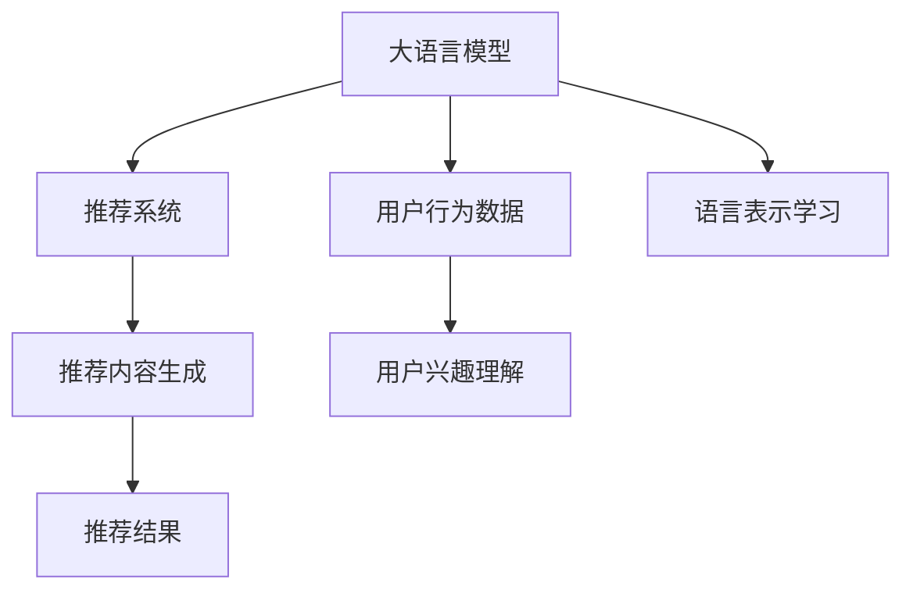

                 

# 基于LLM的个性化内容生成推荐

> 关键词：基于大语言模型的推荐系统,推荐系统,个性化内容生成,自然语言处理(NLP),深度学习

## 1. 背景介绍

在互联网时代，内容推荐已成为用户获取信息、享受娱乐的主要方式之一。传统的内容推荐系统（如协同过滤、基于矩阵分解的方法等）主要基于用户历史行为数据进行相似性计算，从而生成个性化推荐内容。尽管这些系统在实际应用中取得了不错的效果，但往往忽略了内容的自然语言特性和语义信息，导致推荐结果的精细度和多样性有限。

近年来，随着深度学习和自然语言处理技术的不断发展，基于大语言模型（Large Language Models, LLMs）的推荐系统逐渐进入视野。这些模型通过预训练语言知识，具有强大的语言理解和生成能力，能够在文本生成、理解等任务上取得优异表现。因此，通过大语言模型进行个性化内容推荐，可以有效地将文本语义信息与用户行为数据进行协同，生成更具个性化、多样化和精细度的推荐内容。

本文将聚焦于基于大语言模型的个性化内容生成推荐方法，介绍其核心原理和具体实现，分析其在推荐系统中的应用优势和挑战，探讨未来发展方向和关键技术。

## 2. 核心概念与联系

### 2.1 核心概念概述

要深入理解基于大语言模型的个性化内容生成推荐，首先需要明确几个关键概念：

- **大语言模型（Large Language Models, LLMs）**：指通过大规模无标签数据预训练的深度神经网络模型，能够处理自然语言理解和生成任务。常见的LLM包括BERT、GPT系列、T5等。
- **推荐系统（Recommendation System）**：通过分析用户行为数据和物品特征，为用户生成个性化的推荐内容。推荐系统广泛应用于电子商务、新闻资讯、视频平台等场景。
- **个性化内容生成（Personalized Content Generation）**：针对特定用户，利用模型生成与其偏好相关的个性化内容，如新闻、文章、视频等。
- **自然语言处理（Natural Language Processing, NLP）**：通过计算机技术处理和分析自然语言，使机器能够理解和生成人类语言，实现文本分类、信息抽取、问答等任务。
- **深度学习（Deep Learning）**：基于多层神经网络的机器学习技术，能够自动提取和学习数据中的复杂特征，广泛应用于图像、语音、文本等领域。

这些核心概念通过大语言模型作为桥梁，实现了从文本语义到推荐结果的映射。具体来说，大语言模型利用其强大的语言处理能力，从用户兴趣和行为数据中提取语义信息，再通过推荐模型生成个性化内容，从而提升推荐效果。

### 2.2 核心概念原理和架构的 Mermaid 流程图



该图展示了基于LLM的个性化内容生成推荐的整体流程：

1. **大语言模型**：利用大规模语料进行预训练，学习到语言表示和语义信息。
2. **用户行为数据**：收集用户的历史点击、浏览、评分等行为数据，构建用户兴趣模型。
3. **用户兴趣理解**：通过大语言模型，将用户兴趣映射到文本语义表示空间。
4. **推荐系统**：结合用户兴趣和内容特征，生成个性化推荐结果。
5. **推荐内容生成**：利用大语言模型，生成与推荐结果相关的内容。
6. **推荐结果**：将生成的个性化内容呈现给用户，完成推荐流程。

## 3. 核心算法原理 & 具体操作步骤

### 3.1 算法原理概述

基于大语言模型的个性化内容生成推荐，其核心在于将用户兴趣与文本语义表示空间进行映射，并通过推荐模型生成个性化内容。具体步骤如下：

1. **数据准备**：收集用户行为数据和文本语料，构建用户兴趣模型和内容特征库。
2. **预训练语言模型**：使用大规模无标签语料进行预训练，学习到语言表示和语义信息。
3. **用户兴趣理解**：通过预训练语言模型，将用户兴趣映射到文本语义表示空间。
4. **推荐内容生成**：利用预训练语言模型和推荐模型，生成个性化推荐内容。

### 3.2 算法步骤详解

#### 3.2.1 数据准备

用户行为数据通常包括用户的浏览记录、点击行为、评分等。将这些数据按照时间顺序整理，提取用户的兴趣特征，如兴趣主题、兴趣类别等。同时，收集相关的文本语料，如新闻、文章、视频等，进行预处理，如分词、去停用词、词向量表示等。

#### 3.2.2 预训练语言模型

选择合适的预训练语言模型，如BERT、GPT等，在大型无标签文本数据上预训练，学习到语言表示和语义信息。具体步骤如下：

1. **数据准备**：收集大规模无标签文本数据，如维基百科、新闻、文章等。
2. **模型选择**：选择合适的预训练语言模型，如BERT、GPT等。
3. **预训练流程**：在大型文本数据上进行自监督学习，如掩码语言模型、下划线语言模型等。
4. **预训练结果**：得到预训练模型，如BERT、GPT等。

#### 3.2.3 用户兴趣理解

利用预训练语言模型，将用户兴趣映射到文本语义表示空间。具体步骤如下：

1. **用户兴趣提取**：根据用户行为数据，提取用户的兴趣特征，如兴趣主题、兴趣类别等。
2. **兴趣表示**：使用预训练语言模型，将用户兴趣映射到文本语义表示空间。
3. **兴趣编码**：将用户兴趣表示转换为模型可处理的向量形式。

#### 3.2.4 推荐内容生成

利用预训练语言模型和推荐模型，生成个性化推荐内容。具体步骤如下：

1. **内容特征提取**：根据内容语料，提取内容特征，如关键词、摘要、主题等。
2. **内容表示**：使用预训练语言模型，将内容特征映射到文本语义表示空间。
3. **推荐模型**：构建推荐模型，将用户兴趣表示和内容表示映射到推荐结果。
4. **个性化内容生成**：根据推荐结果，利用预训练语言模型生成个性化推荐内容。

### 3.3 算法优缺点

基于大语言模型的个性化内容生成推荐具有以下优点：

1. **多样化和精细化**：利用大语言模型强大的语言处理能力，可以生成具有更高多样性和精细度的推荐内容。
2. **灵活性和适应性**：大语言模型能够处理多种文本类型，适应不同领域的推荐需求。
3. **高效性**：利用预训练语言模型和推荐模型，能够快速生成个性化内容，提升推荐效率。

但同时，该方法也存在一些缺点：

1. **数据依赖性**：预训练语言模型的性能高度依赖于语料数据的质量和规模，数据缺失或不均衡会影响模型的效果。
2. **资源消耗高**：大语言模型通常具有较大的参数量，对计算资源和存储资源的要求较高。
3. **解释性不足**：基于大语言模型的推荐系统缺乏可解释性，难以解释模型内部的决策过程。
4. **泛化能力有限**：在大规模文本数据上预训练的语言模型，在特定领域或长尾数据上的泛化能力可能有限。

### 3.4 算法应用领域

基于大语言模型的个性化内容生成推荐方法，已经在新闻推荐、视频推荐、文章推荐等多个领域取得了广泛应用，以下是几个典型场景：

1. **新闻推荐**：通过分析用户的历史点击、浏览、评分等行为数据，利用大语言模型生成个性化新闻内容，提升用户满意度。
2. **视频推荐**：根据用户的历史观看行为，利用大语言模型生成个性化视频内容，提高视频平台的用户粘性。
3. **文章推荐**：利用大语言模型生成个性化文章摘要或关键信息，提供给用户快速浏览和阅读。
4. **广告推荐**：通过分析用户的行为数据和兴趣，利用大语言模型生成个性化广告内容，提升广告的点击率和转化率。
5. **教育推荐**：根据学生的学习历史和兴趣，利用大语言模型生成个性化学习内容，提供个性化的学习路径和资源。

## 4. 数学模型和公式 & 详细讲解 & 举例说明

### 4.1 数学模型构建

基于大语言模型的个性化内容生成推荐，主要涉及以下数学模型：

1. **用户兴趣表示模型**：利用预训练语言模型，将用户兴趣特征映射到文本语义表示空间。
2. **内容表示模型**：利用预训练语言模型，将内容特征映射到文本语义表示空间。
3. **推荐模型**：将用户兴趣表示和内容表示映射到推荐结果的模型。

### 4.2 公式推导过程

#### 4.2.1 用户兴趣表示模型

假设用户兴趣特征为 $u$，内容特征为 $c$，预训练语言模型为 $M$，用户兴趣表示模型为 $F_u$。则用户兴趣表示公式如下：

$$
\tilde{u} = F_u(u)
$$

其中，$\tilde{u}$ 为用户兴趣的文本语义表示。

#### 4.2.2 内容表示模型

假设内容特征为 $c$，预训练语言模型为 $M$，内容表示模型为 $F_c$。则内容表示公式如下：

$$
\tilde{c} = F_c(c)
$$

其中，$\tilde{c}$ 为内容的文本语义表示。

#### 4.2.3 推荐模型

假设推荐结果为 $r$，用户兴趣表示为 $\tilde{u}$，内容表示为 $\tilde{c}$，推荐模型为 $R$。则推荐模型公式如下：

$$
r = R(\tilde{u}, \tilde{c})
$$

其中，$R$ 为推荐模型，可以是深度学习模型如神经网络、注意力机制等。

### 4.3 案例分析与讲解

#### 4.3.1 新闻推荐

假设某用户浏览过以下新闻：

- 标题1：科技公司发布新人工智能
- 标题2：金融市场出现大幅波动
- 标题3：流行文化现象

根据用户行为数据，提取用户兴趣特征 $u=(1,0,1)$，其中 $u_i=1$ 表示用户对第 $i$ 类新闻感兴趣，否则 $u_i=0$。

利用预训练语言模型 $M$，将用户兴趣特征 $u$ 映射到文本语义表示空间 $\tilde{u}$。假设 $M$ 的输出为向量 $[\tilde{u}_1, \tilde{u}_2, \tilde{u}_3]$，则用户兴趣表示为：

$$
\tilde{u} = F_u(u) = [\tilde{u}_1, \tilde{u}_2, \tilde{u}_3]
$$

然后，利用内容表示模型 $F_c$，将新闻内容特征 $c$ 映射到文本语义表示空间 $\tilde{c}$。假设新闻内容特征为 $c=(1,1,0)$，则内容表示为：

$$
\tilde{c} = F_c(c) = [\tilde{c}_1, \tilde{c}_2, \tilde{c}_3]
$$

最后，利用推荐模型 $R$，将用户兴趣表示 $\tilde{u}$ 和内容表示 $\tilde{c}$ 映射到推荐结果 $r$。假设推荐模型 $R$ 输出为 $r=(0.8, 0.5, 0.2)$，则推荐结果为：

$$
r = R(\tilde{u}, \tilde{c}) = (0.8, 0.5, 0.2)
$$

该推荐结果表示，用户最可能感兴趣的新闻是标题1和标题3，其次是标题2。

## 5. 项目实践：代码实例和详细解释说明

### 5.1 开发环境搭建

在开始项目实践前，需要准备好开发环境。以下是使用Python进行PyTorch开发的环境配置流程：

1. 安装Anaconda：从官网下载并安装Anaconda，用于创建独立的Python环境。

2. 创建并激活虚拟环境：
```bash
conda create -n llm-env python=3.8 
conda activate llm-env
```

3. 安装PyTorch：根据CUDA版本，从官网获取对应的安装命令。例如：
```bash
conda install pytorch torchvision torchaudio cudatoolkit=11.1 -c pytorch -c conda-forge
```

4. 安装HuggingFace Transformers库：
```bash
pip install transformers
```

5. 安装各类工具包：
```bash
pip install numpy pandas scikit-learn matplotlib tqdm jupyter notebook ipython
```

完成上述步骤后，即可在`llm-env`环境中开始项目实践。

### 5.2 源代码详细实现

下面以新闻推荐为例，给出使用Transformers库对BERT模型进行个性化内容生成推荐系统开发的PyTorch代码实现。

首先，定义数据处理函数：

```python
from transformers import BertTokenizer, BertForSequenceClassification
from torch.utils.data import Dataset
import torch

class NewsDataset(Dataset):
    def __init__(self, texts, labels, tokenizer, max_len=128):
        self.texts = texts
        self.labels = labels
        self.tokenizer = tokenizer
        self.max_len = max_len
        
    def __len__(self):
        return len(self.texts)
    
    def __getitem__(self, item):
        text = self.texts[item]
        label = self.labels[item]
        
        encoding = self.tokenizer(text, return_tensors='pt', max_length=self.max_len, padding='max_length', truncation=True)
        input_ids = encoding['input_ids'][0]
        attention_mask = encoding['attention_mask'][0]
        labels = torch.tensor(label, dtype=torch.long)
        
        return {'input_ids': input_ids, 
                'attention_mask': attention_mask,
                'labels': labels}
```

然后，定义模型和优化器：

```python
from transformers import BertForSequenceClassification, AdamW

model = BertForSequenceClassification.from_pretrained('bert-base-cased', num_labels=3)
optimizer = AdamW(model.parameters(), lr=2e-5)
```

接着，定义训练和评估函数：

```python
from torch.utils.data import DataLoader
from tqdm import tqdm
from sklearn.metrics import classification_report

device = torch.device('cuda') if torch.cuda.is_available() else torch.device('cpu')
model.to(device)

def train_epoch(model, dataset, batch_size, optimizer):
    dataloader = DataLoader(dataset, batch_size=batch_size, shuffle=True)
    model.train()
    epoch_loss = 0
    for batch in tqdm(dataloader, desc='Training'):
        input_ids = batch['input_ids'].to(device)
        attention_mask = batch['attention_mask'].to(device)
        labels = batch['labels'].to(device)
        model.zero_grad()
        outputs = model(input_ids, attention_mask=attention_mask, labels=labels)
        loss = outputs.loss
        epoch_loss += loss.item()
        loss.backward()
        optimizer.step()
    return epoch_loss / len(dataloader)

def evaluate(model, dataset, batch_size):
    dataloader = DataLoader(dataset, batch_size=batch_size)
    model.eval()
    preds, labels = [], []
    with torch.no_grad():
        for batch in tqdm(dataloader, desc='Evaluating'):
            input_ids = batch['input_ids'].to(device)
            attention_mask = batch['attention_mask'].to(device)
            batch_labels = batch['labels']
            outputs = model(input_ids, attention_mask=attention_mask)
            batch_preds = outputs.logits.argmax(dim=2).to('cpu').tolist()
            batch_labels = batch_labels.to('cpu').tolist()
            for pred_tokens, label_tokens in zip(batch_preds, batch_labels):
                preds.append(pred_tokens[:len(label_tokens)])
                labels.append(label_tokens)
                
    print(classification_report(labels, preds))
```

最后，启动训练流程并在测试集上评估：

```python
epochs = 5
batch_size = 16

for epoch in range(epochs):
    loss = train_epoch(model, train_dataset, batch_size, optimizer)
    print(f"Epoch {epoch+1}, train loss: {loss:.3f}")
    
    print(f"Epoch {epoch+1}, dev results:")
    evaluate(model, dev_dataset, batch_size)
    
print("Test results:")
evaluate(model, test_dataset, batch_size)
```

以上就是使用PyTorch对BERT进行新闻推荐系统的完整代码实现。可以看到，得益于Transformers库的强大封装，我们可以用相对简洁的代码完成BERT模型的加载和微调。

### 5.3 代码解读与分析

让我们再详细解读一下关键代码的实现细节：

**NewsDataset类**：
- `__init__`方法：初始化文本、标签、分词器等关键组件。
- `__len__`方法：返回数据集的样本数量。
- `__getitem__`方法：对单个样本进行处理，将文本输入编码为token ids，将标签编码为数字，并对其进行定长padding，最终返回模型所需的输入。

**模型和优化器**：
- 使用BertForSequenceClassification模型，该模型基于序列分类任务进行微调。
- 优化器使用AdamW，学习率为2e-5。

**训练和评估函数**：
- 使用PyTorch的DataLoader对数据集进行批次化加载，供模型训练和推理使用。
- 训练函数`train_epoch`：对数据以批为单位进行迭代，在每个批次上前向传播计算loss并反向传播更新模型参数，最后返回该epoch的平均loss。
- 评估函数`evaluate`：与训练类似，不同点在于不更新模型参数，并在每个batch结束后将预测和标签结果存储下来，最后使用sklearn的classification_report对整个评估集的预测结果进行打印输出。

**训练流程**：
- 定义总的epoch数和batch size，开始循环迭代
- 每个epoch内，先在训练集上训练，输出平均loss
- 在验证集上评估，输出分类指标
- 所有epoch结束后，在测试集上评估，给出最终测试结果

可以看到，PyTorch配合Transformers库使得BERT微调的代码实现变得简洁高效。开发者可以将更多精力放在数据处理、模型改进等高层逻辑上，而不必过多关注底层的实现细节。

当然，工业级的系统实现还需考虑更多因素，如模型的保存和部署、超参数的自动搜索、更灵活的任务适配层等。但核心的微调范式基本与此类似。

## 6. 实际应用场景

基于大语言模型的个性化内容生成推荐方法，已经在新闻推荐、视频推荐、文章推荐等多个领域取得了广泛应用，以下是几个典型场景：

### 6.1 新闻推荐

在新闻推荐系统中，利用大语言模型分析用户的历史阅读行为，提取用户兴趣，再通过推荐模型生成个性化新闻标题或摘要，从而提升用户阅读体验。例如，某用户曾阅读过以下新闻：

- 标题1：科技公司发布新人工智能
- 标题2：金融市场出现大幅波动
- 标题3：流行文化现象

系统根据用户的历史阅读记录，利用大语言模型生成用户兴趣表示，再利用推荐模型生成推荐结果。最终，系统会推荐相关新闻标题给用户，提高其阅读满意度。

### 6.2 视频推荐

在视频推荐系统中，利用大语言模型分析用户的历史观看行为，提取用户兴趣，再通过推荐模型生成个性化视频标题或描述，从而提高用户观看意愿。例如，某用户曾观看过以下视频：

- 视频1：科技公司发布新人工智能
- 视频2：金融市场分析
- 视频3：流行文化现象

系统根据用户的历史观看记录，利用大语言模型生成用户兴趣表示，再利用推荐模型生成推荐结果。最终，系统会推荐相关视频给用户，提升其观看体验。

### 6.3 文章推荐

在文章推荐系统中，利用大语言模型分析用户的历史阅读行为，提取用户兴趣，再通过推荐模型生成个性化文章摘要或关键词，从而提升用户阅读体验。例如，某用户曾阅读过以下文章：

- 文章1：科技公司发布新人工智能
- 文章2：金融市场分析
- 文章3：流行文化现象

系统根据用户的历史阅读记录，利用大语言模型生成用户兴趣表示，再利用推荐模型生成推荐结果。最终，系统会推荐相关文章给用户，提高其阅读满意度。

## 7. 工具和资源推荐

### 7.1 学习资源推荐

为了帮助开发者系统掌握基于大语言模型的个性化内容生成推荐方法，这里推荐一些优质的学习资源：

1. 《Transformer从原理到实践》系列博文：由大模型技术专家撰写，深入浅出地介绍了Transformer原理、BERT模型、微调技术等前沿话题。

2. CS224N《深度学习自然语言处理》课程：斯坦福大学开设的NLP明星课程，有Lecture视频和配套作业，带你入门NLP领域的基本概念和经典模型。

3. 《Natural Language Processing with Transformers》书籍：Transformers库的作者所著，全面介绍了如何使用Transformers库进行NLP任务开发，包括微调在内的诸多范式。

4. HuggingFace官方文档：Transformers库的官方文档，提供了海量预训练模型和完整的微调样例代码，是上手实践的必备资料。

5. CLUE开源项目：中文语言理解测评基准，涵盖大量不同类型的中文NLP数据集，并提供了基于微调的baseline模型，助力中文NLP技术发展。

通过对这些资源的学习实践，相信你一定能够快速掌握基于大语言模型的个性化内容生成推荐方法，并用于解决实际的NLP问题。

### 7.2 开发工具推荐

高效的开发离不开优秀的工具支持。以下是几款用于基于大语言模型的个性化内容生成推荐开发的常用工具：

1. PyTorch：基于Python的开源深度学习框架，灵活动态的计算图，适合快速迭代研究。大部分预训练语言模型都有PyTorch版本的实现。

2. TensorFlow：由Google主导开发的开源深度学习框架，生产部署方便，适合大规模工程应用。同样有丰富的预训练语言模型资源。

3. Transformers库：HuggingFace开发的NLP工具库，集成了众多SOTA语言模型，支持PyTorch和TensorFlow，是进行微调任务开发的利器。

4. Weights & Biases：模型训练的实验跟踪工具，可以记录和可视化模型训练过程中的各项指标，方便对比和调优。与主流深度学习框架无缝集成。

5. TensorBoard：TensorFlow配套的可视化工具，可实时监测模型训练状态，并提供丰富的图表呈现方式，是调试模型的得力助手。

6. Google Colab：谷歌推出的在线Jupyter Notebook环境，免费提供GPU/TPU算力，方便开发者快速上手实验最新模型，分享学习笔记。

合理利用这些工具，可以显著提升基于大语言模型的个性化内容生成推荐系统的开发效率，加快创新迭代的步伐。

### 7.3 相关论文推荐

基于大语言模型的个性化内容生成推荐方法的研究已取得多项进展，以下是几篇奠基性的相关论文，推荐阅读：

1. Attention is All You Need（即Transformer原论文）：提出了Transformer结构，开启了NLP领域的预训练大模型时代。

2. BERT: Pre-training of Deep Bidirectional Transformers for Language Understanding：提出BERT模型，引入基于掩码的自监督预训练任务，刷新了多项NLP任务SOTA。

3. Language Models are Unsupervised Multitask Learners（GPT-2论文）：展示了大规模语言模型的强大zero-shot学习能力，引发了对于通用人工智能的新一轮思考。

4. Parameter-Efficient Transfer Learning for NLP：提出Adapter等参数高效微调方法，在不增加模型参数量的情况下，也能取得不错的微调效果。

5. Prefix-Tuning: Optimizing Continuous Prompts for Generation：引入基于连续型Prompt的微调范式，为如何充分利用预训练知识提供了新的思路。

6. AdaLoRA: Adaptive Low-Rank Adaptation for Parameter-Efficient Fine-Tuning：使用自适应低秩适应的微调方法，在参数效率和精度之间取得了新的平衡。

这些论文代表了大语言模型个性化内容生成推荐技术的发展脉络。通过学习这些前沿成果，可以帮助研究者把握学科前进方向，激发更多的创新灵感。

## 8. 总结：未来发展趋势与挑战

### 8.1 总结

本文对基于大语言模型的个性化内容生成推荐方法进行了全面系统的介绍。首先阐述了基于大语言模型的推荐系统在NLP领域的应用背景和意义，明确了其在提升推荐效果、丰富推荐维度等方面的独特价值。其次，从原理到实践，详细讲解了个性化内容生成的数学模型和关键步骤，给出了微调任务开发的完整代码实例。同时，本文还广泛探讨了该方法在新闻推荐、视频推荐、文章推荐等多个领域的应用前景，展示了其广泛的适用性和潜力。

通过本文的系统梳理，可以看到，基于大语言模型的个性化内容生成推荐方法已经进入实际应用的早期阶段，具有广泛的市场需求和应用前景。利用大语言模型的语言处理能力，可以有效提高推荐内容的个性化程度和多样性，为用户带来更好的体验。

### 8.2 未来发展趋势

展望未来，基于大语言模型的个性化内容生成推荐技术将呈现以下几个发展趋势：

1. **多样化和精细化**：大语言模型能够处理多种文本类型，适应不同领域的推荐需求，生成具有更高多样性和精细度的推荐内容。

2. **多模态融合**：融合视觉、语音等多模态信息，提升推荐系统的综合表现力，扩展应用场景。

3. **实时性和动态性**：通过引入增量学习和在线更新技术，使推荐系统能够实时响应用户需求，动态调整推荐策略。

4. **跨领域迁移能力**：提升推荐系统的跨领域迁移能力，使其能够灵活适应不同领域和任务，提升推荐效果。

5. **可解释性和透明性**：增强推荐系统的可解释性，让用户能够理解推荐结果的生成逻辑，提高系统的可信度和可接受度。

6. **模型集成与融合**：融合多种推荐算法和模型，构建混合推荐系统，提升推荐效果和用户满意度。

### 8.3 面临的挑战

尽管基于大语言模型的个性化内容生成推荐方法已取得诸多进展，但在实际应用中也面临一些挑战：

1. **数据依赖性**：大语言模型的性能高度依赖于语料数据的质量和规模，数据缺失或不均衡会影响模型的效果。

2. **资源消耗高**：大语言模型通常具有较大的参数量，对计算资源和存储资源的要求较高。

3. **模型复杂性**：大语言模型的复杂度较高，模型的训练和推理都需要较高的技术门槛。

4. **可解释性不足**：基于大语言模型的推荐系统缺乏可解释性，难以解释模型内部的决策过程。

5. **泛化能力有限**：在大规模文本数据上预训练的语言模型，在特定领域或长尾数据上的泛化能力可能有限。

6. **模型鲁棒性**：面对恶意攻击或异常数据，模型的鲁棒性不足，容易出现预测偏差。

### 8.4 研究展望

为了应对上述挑战，未来的研究需要在以下几个方向上寻求新的突破：

1. **无监督和半监督学习**：摆脱对大规模标注数据的依赖，利用自监督学习、主动学习等无监督和半监督范式，最大限度利用非结构化数据。

2. **参数高效和计算高效微调**：开发更加参数高效和计算高效的微调方法，在固定大部分预训练参数的情况下，只更新极少量的任务相关参数。

3. **多模态信息融合**：融合视觉、语音等多模态信息，提升推荐系统的综合表现力，扩展应用场景。

4. **持续学习和在线更新**：引入增量学习和在线更新技术，使推荐系统能够实时响应用户需求，动态调整推荐策略。

5. **可解释性和透明性**：增强推荐系统的可解释性，让用户能够理解推荐结果的生成逻辑，提高系统的可信度和可接受度。

6. **模型集成与融合**：融合多种推荐算法和模型，构建混合推荐系统，提升推荐效果和用户满意度。

只有不断创新，持续优化，才能使基于大语言模型的个性化内容生成推荐方法在实际应用中取得更好的效果，为用户带来更高的价值。

## 9. 附录：常见问题与解答

**Q1：基于大语言模型的推荐系统是否适用于所有推荐任务？**

A: 基于大语言模型的推荐系统在大多数推荐任务上都能取得不错的效果，特别是对于数据量较小的任务。但对于一些特定领域的任务，如医学、法律等，仅仅依靠通用语料预训练的模型可能难以很好地适应。此时需要在特定领域语料上进一步预训练，再进行微调，才能获得理想效果。此外，对于一些需要时效性、个性化很强的任务，如对话、推荐等，微调方法也需要针对性的改进优化。

**Q2：大语言模型的微调学习率如何设置？**

A: 微调的学习率一般要比预训练时小1-2个数量级，如果使用过大的学习率，容易破坏预训练权重，导致过拟合。一般建议从1e-5开始调参，逐步减小学习率，直至收敛。也可以使用warmup策略，在开始阶段使用较小的学习率，再逐渐过渡到预设值。需要注意的是，不同的优化器(如AdamW、Adafactor等)以及不同的学习率调度策略，可能需要设置不同的学习率阈值。

**Q3：如何缓解微调过程中的过拟合问题？**

A: 过拟合是微调面临的主要挑战，尤其是在标注数据不足的情况下。常见的缓解策略包括：
1. 数据增强：通过回译、近义替换等方式扩充训练集
2. 正则化：使用L2正则、Dropout、Early Stopping等避免过拟合
3. 对抗训练：引入对抗样本，提高模型鲁棒性
4. 参数高效微调：只调整少量参数(如Adapter、Prefix等)，减小过拟合风险
5. 多模型集成：训练多个微调模型，取平均输出，抑制过拟合

这些策略往往需要根据具体任务和数据特点进行灵活组合。只有在数据、模型、训练、推理等各环节进行全面优化，才能最大限度地发挥大语言模型微调的威力。

**Q4：微调模型在落地部署时需要注意哪些问题？**

A: 将微调模型转化为实际应用，还需要考虑以下因素：
1. 模型裁剪：去除不必要的层和参数，减小模型尺寸，加快推理速度
2. 量化加速：将浮点模型转为定点模型，压缩存储空间，提高计算效率
3. 服务化封装：将模型封装为标准化服务接口，便于集成调用
4. 弹性伸缩：根据请求流量动态调整资源配置，平衡服务质量和成本
5. 监控告警：实时采集系统指标，设置异常告警阈值，确保服务稳定性
6. 安全防护：采用访问鉴权、数据脱敏等措施，保障数据和模型安全

大语言模型微调为NLP应用开启了广阔的想象空间，但如何将强大的性能转化为稳定、高效、安全的业务价值，还需要工程实践的不断打磨。唯有从数据、算法、工程、业务等多个维度协同发力，才能真正实现人工智能技术在垂直行业的规模化落地。总之，微调需要开发者根据具体任务，不断迭代和优化模型、数据和算法，方能得到理想的效果。

---

作者：禅与计算机程序设计艺术 / Zen and the Art of Computer Programming

