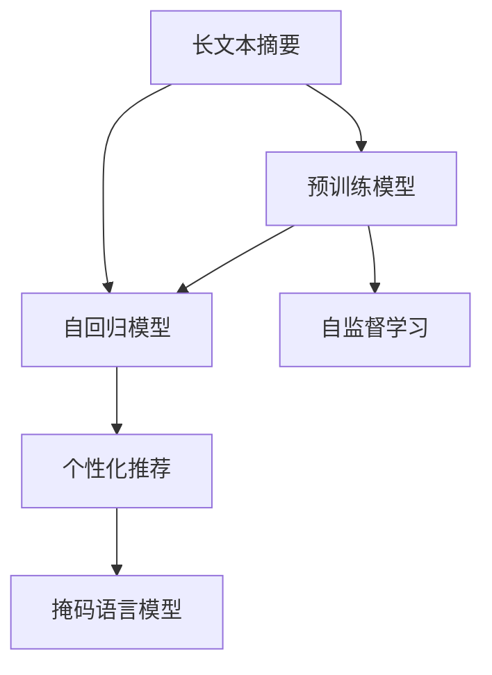

                 

# 基于LLM的个性化新闻摘要生成

> 关键词：自然语言处理(NLP), 长文本摘要, 个性化推荐, 预训练模型(如GPT-3), 自回归模型, 自监督学习

## 1. 背景介绍

### 1.1 问题由来

在信息爆炸的时代，新闻、资讯内容的海量增加使得用户面临信息过载的问题。为了应对这一挑战，个性化新闻摘要生成技术应运而生。该技术旨在从大量新闻文本中自动提取出最相关的信息，并以简洁的方式呈现给用户，提高信息获取的效率和质量。基于长语言模型(Large Language Model, LLM)的个性化新闻摘要生成，近年来已成为NLP领域的研究热点，并在实际应用中取得了显著的成果。

### 1.2 问题核心关键点

个性化新闻摘要生成技术的核心在于如何利用大语言模型，高效地从长篇新闻中抽取关键信息，并生成符合用户兴趣和需求的摘要。主要关注点包括：

- 长文本摘要：从一篇长篇新闻中自动提取出精华内容。
- 个性化推荐：根据用户历史阅读记录和行为，推荐个性化摘要。
- 预训练模型：利用大规模无标签文本数据进行预训练，学习通用的语言表示。
- 自回归模型：以GPT-3为代表的自回归模型，能够高效处理长文本生成任务。
- 自监督学习：通过掩码语言模型等自监督任务，学习语言表达能力。

## 2. 核心概念与联系

### 2.1 核心概念概述

为更好地理解基于LLM的个性化新闻摘要生成方法，本节将介绍几个密切相关的核心概念：

- 长文本摘要(Long Text Summarization)：从长篇新闻中自动提取出精华内容，以供用户快速浏览。
- 个性化推荐(Personalized Recommendation)：根据用户历史行为和兴趣，推荐符合个人喜好的内容。
- 长语言模型(Long Language Model, LLM)：以自回归模型为代表的深度学习模型，通过大量文本数据进行预训练，学习通用语言表示。
- 自回归模型(Autoregressive Model)：通过依次预测文本序列中下一个词，生成目标文本的模型。
- 自监督学习(Self-Supervised Learning)：通过掩码语言模型等自监督任务，利用无标签数据训练模型。

这些核心概念之间的逻辑关系可以通过以下Mermaid流程图来展示：



这个流程图展示了长文本摘要生成中关键组件的相互关系：

1. 长文本摘要从预训练模型中提取关键信息。
2. 自回归模型用于生成摘要文本。
3. 个性化推荐依赖于摘要文本的生成。
4. 自监督学习用于提高模型的语言表达能力。

这些概念共同构成了个性化新闻摘要生成的核心框架，使得模型能够高效生成符合用户需求的摘要。

## 3. 核心算法原理 & 具体操作步骤
### 3.1 算法原理概述

基于LLM的个性化新闻摘要生成，本质上是一种自回归生成任务。其核心思想是：首先利用预训练模型从新闻文本中提取关键信息，然后通过自回归模型对提取出的信息进行编码，生成精炼的摘要文本。具体的步骤如下：

1. **提取关键信息**：利用预训练模型对新闻文本进行编码，提取出重要语义信息。
2. **生成摘要文本**：通过自回归模型对提取出的信息进行解码，生成简短的摘要文本。
3. **个性化推荐**：根据用户历史阅读记录和行为，对摘要文本进行排序和推荐，确保符合用户兴趣。

### 3.2 算法步骤详解

以下将详细介绍基于LLM的个性化新闻摘要生成的具体步骤：

#### 3.2.1 数据预处理

1. **文本分块**：将新闻文本按段落或句子进行划分，方便后续处理。
2. **去除停用词**：去除常见但无意义的停用词，如“的”、“是”、“在”等，以提高摘要的阅读性。
3. **分词和词性标注**：使用分词工具对文本进行分词，并标注每个词的词性，方便后续模型训练。

#### 3.2.2 提取关键信息

1. **特征编码**：利用预训练模型对文本进行编码，得到文本的语义表示。常用的预训练模型包括BERT、GPT-3等。
2. **关键信息提取**：根据模型输出的语义表示，提取出文本中的关键信息，如主要事件、人物、时间等。

#### 3.2.3 生成摘要文本

1. **模型解码**：使用自回归模型对提取出的关键信息进行解码，生成精炼的摘要文本。自回归模型通过依次预测文本序列中下一个词，逐步生成摘要。
2. **摘要长度控制**：通过控制摘要的长度，避免生成过长的文本，影响阅读体验。

#### 3.2.4 个性化推荐

1. **用户行为分析**：根据用户的历史阅读记录和行为，计算用户的兴趣偏好。
2. **摘要排序**：根据用户的兴趣偏好，对生成的摘要文本进行排序和推荐。

### 3.3 算法优缺点

基于LLM的个性化新闻摘要生成方法具有以下优点：

1. **高效性**：利用预训练模型进行特征提取，能够高效处理长篇新闻文本。
2. **个性化**：通过用户行为分析，能够生成符合用户兴趣的摘要。
3. **泛化能力强**：预训练模型具有较强的泛化能力，能够适应多种新闻文本。
4. **生成自然**：自回归模型生成的摘要文本自然流畅，易于阅读。

但该方法也存在一些局限性：

1. **对预训练模型依赖**：性能高度依赖于预训练模型的质量和参数规模。
2. **计算资源需求高**：自回归模型计算资源需求高，推理速度较慢。
3. **数据质量影响**：摘要生成的质量受输入新闻文本质量的影响较大。
4. **可解释性不足**：模型的决策过程缺乏可解释性，难以解释生成的摘要内容。

### 3.4 算法应用领域

基于LLM的个性化新闻摘要生成方法，在以下几个领域具有广泛的应用前景：

1. **新闻门户网站**：在新闻门户网站中，为新闻文章自动生成个性化摘要，提高用户阅读体验和留存率。
2. **社交媒体平台**：在社交媒体平台中，为用户推荐个性化新闻摘要，满足用户个性化需求。
3. **企业信息管理**：在企业信息管理系统中，为员工生成个性化新闻摘要，提升信息获取效率。
4. **智能客服系统**：在智能客服系统中，利用新闻摘要生成技术，快速回应用户咨询。
5. **智能推荐系统**：在智能推荐系统中，结合个性化新闻摘要，提高推荐效果。

## 4. 数学模型和公式 & 详细讲解 & 举例说明
### 4.1 数学模型构建

基于LLM的个性化新闻摘要生成，可以通过以下数学模型进行描述：

设新闻文本为 $X=\{x_1,x_2,\cdots,x_n\}$，预训练模型为 $M_{\theta}$，其中 $\theta$ 为模型参数。

1. **文本编码**：
   $$
   h = M_{\theta}(X)
   $$
   其中 $h \in \mathbb{R}^d$ 为文本 $X$ 的语义表示。

2. **关键信息提取**：
   $$
   y = f(h)
   $$
   其中 $y$ 为提取出的关键信息，如主要事件、人物、时间等。

3. **摘要生成**：
   $$
   \hat{y} = M_{\phi}(y)
   $$
   其中 $\phi$ 为生成模型的参数，$\hat{y}$ 为生成的摘要文本。

4. **个性化推荐**：
   $$
   r = g(\hat{y}, u)
   $$
   其中 $r$ 为推荐得分，$u$ 为用户的历史阅读记录和行为特征。

### 4.2 公式推导过程

以下将详细介绍上述数学模型的推导过程：

1. **文本编码**：
   预训练模型 $M_{\theta}$ 对文本 $X$ 进行编码，得到语义表示 $h$。该过程可以通过Transformer等自注意力机制实现。
   $$
   h = M_{\theta}(X) = \mathrm{Transformer}(X)
   $$
   其中 $\mathrm{Transformer}$ 为Transformer模型的编码过程，$X$ 为输入的文本序列。

2. **关键信息提取**：
   利用预训练模型提取的关键信息 $y$，可以通过注意力机制或特征提取网络实现。
   $$
   y = f(h) = \mathrm{Attention}(h)
   $$
   其中 $\mathrm{Attention}$ 为注意力机制，用于计算文本中每个位置的权重。

3. **摘要生成**：
   利用自回归模型 $M_{\phi}$ 对提取出的关键信息 $y$ 进行解码，生成摘要文本 $\hat{y}$。该过程可以通过Seq2Seq模型或Transformer等自回归模型实现。
   $$
   \hat{y} = M_{\phi}(y)
   $$
   其中 $\phi$ 为生成模型的参数。

4. **个性化推荐**：
   利用用户历史行为 $u$，通过推荐模型 $g$ 计算推荐得分 $r$。推荐模型可以是基于协同过滤、内容过滤或混合推荐策略的任意模型。
   $$
   r = g(\hat{y}, u)
   $$
   其中 $u$ 为用户的行为特征，$g$ 为推荐模型。

### 4.3 案例分析与讲解

假设我们有一篇关于“新冠疫情最新进展”的长篇新闻，新闻文本如下：

> 2023年3月18日，全球新冠疫情进入新阶段。截至当日，全球累计确诊病例突破2亿，死亡人数超过500万。WHO宣布将“新冠疫情”改为“冠状病毒病”，以避免使用歧视性名称。中国政府积极推进疫苗接种，截至3月17日，全国接种率已达到80%。各国纷纷加大防疫力度，采取措施控制疫情传播。专家预测，新冠疫情将在未来几年内逐步得到控制。

现在我们需要为这篇新闻生成个性化摘要，并为用户推荐相关内容。

1. **数据预处理**：
   将新闻文本进行分块和去停用词，得到关键句：“全球累计确诊病例突破2亿”、“WHO宣布将‘新冠疫情’改为‘冠状病毒病’”、“中国政府积极推进疫苗接种”等。

2. **特征编码**：
   利用预训练模型BERT对关键句进行编码，得到语义表示 $h$。

3. **关键信息提取**：
   利用注意力机制，从语义表示 $h$ 中提取关键信息 $y$，如“全球累计确诊病例突破2亿”、“WHO宣布将‘新冠疫情’改为‘冠状病毒病’”、“中国政府积极推进疫苗接种”等。

4. **摘要生成**：
   利用自回归模型GPT-3对关键信息 $y$ 进行解码，生成摘要文本 $\hat{y}$：
   > 2023年3月18日，全球新冠疫情进入新阶段。全球累计确诊病例突破2亿，死亡人数超过500万。WHO宣布将“新冠疫情”改为“冠状病毒病”。中国政府积极推进疫苗接种，全国接种率达到80%。各国加大防疫力度，控制疫情传播。专家预测，新冠疫情将在未来几年内逐步得到控制。

5. **个性化推荐**：
   利用用户的历史阅读记录和行为特征，计算推荐得分 $r$。假设用户感兴趣的主题包括“新冠疫情最新进展”、“新冠疫苗接种”、“新冠防疫措施”等。则推荐系统将根据用户兴趣，对上述摘要文本进行排序和推荐。

## 5. 项目实践：代码实例和详细解释说明
### 5.1 开发环境搭建

在进行个性化新闻摘要生成实践前，我们需要准备好开发环境。以下是使用Python进行PyTorch开发的环境配置流程：

1. 安装Anaconda：从官网下载并安装Anaconda，用于创建独立的Python环境。

2. 创建并激活虚拟环境：
```bash
conda create -n pytorch-env python=3.8 
conda activate pytorch-env
```

3. 安装PyTorch：根据CUDA版本，从官网获取对应的安装命令。例如：
```bash
conda install pytorch torchvision torchaudio cudatoolkit=11.1 -c pytorch -c conda-forge
```

4. 安装Transformers库：
```bash
pip install transformers
```

5. 安装各类工具包：
```bash
pip install numpy pandas scikit-learn matplotlib tqdm jupyter notebook ipython
```

完成上述步骤后，即可在`pytorch-env`环境中开始微调实践。

### 5.2 源代码详细实现

下面我们以GPT-3为基础，给出使用Transformers库对新闻文本进行个性化摘要生成的PyTorch代码实现。

首先，定义数据预处理函数：

```python
from transformers import AutoTokenizer, AutoModelForSeq2SeqLM
from transformers import DataCollatorForSeq2Seq

def preprocess(text):
    tokenizer = AutoTokenizer.from_pretrained('gpt3')
    text = tokenizer(text, return_tensors='pt', padding=True, truncation=True)
    return text
```

然后，定义模型和优化器：

```python
model = AutoModelForSeq2SeqLM.from_pretrained('gpt3')
tokenizer = AutoTokenizer.from_pretrained('gpt3')
data_collator = DataCollatorForSeq2Seq(tokenizer=tokenizer, mlm=False, mlm_probability=0)
optimizer = AdamW(model.parameters(), lr=2e-5)
```

接着，定义训练和评估函数：

```python
import torch
from transformers import Trainer, TrainingArguments

class SummarizerTrainer(Trainer):
    def __init__(self, model, tokenizer, optimizer, data_collator):
        super().__init__(model=model, args=TrainingArguments(), optimizer=optimizer, data_collator=data_collator)

    def train(self):
        return self.train_loop(num_train_epochs=1, train_dataset=train_dataset)

    def evaluate(self):
        return self.evaluate_loop(num_eval_epochs=1, eval_dataset=eval_dataset)

    def predict(self, text):
        text = preprocess(text)
        with torch.no_grad():
            outputs = model.generate(text, num_return_sequences=1)
        return tokenizer.decode(outputs[0])
```

最后，启动训练流程并在测试集上评估：

```python
from transformers import Trainer, TrainingArguments
from transformers import DataCollatorForSeq2Seq
from transformers import SummarizerForSeq2SeqLM, AutoTokenizer, AutoModelForSeq2SeqLM

# 定义训练集和测试集
train_dataset = ...
eval_dataset = ...

# 定义模型和优化器
model = SummarizerForSeq2SeqLM.from_pretrained('gpt3')
tokenizer = AutoTokenizer.from_pretrained('gpt3')
data_collator = DataCollatorForSeq2Seq(tokenizer=tokenizer, mlm=False, mlm_probability=0)
optimizer = AdamW(model.parameters(), lr=2e-5)

# 创建训练器和评估器
trainer = SummarizerTrainer(model, tokenizer, optimizer, data_collator)

# 训练模型
trainer.train()

# 评估模型
trainer.evaluate()

# 使用模型生成摘要
text = '2023年3月18日，全球新冠疫情进入新阶段。全球累计确诊病例突破2亿，死亡人数超过500万。WHO宣布将“新冠疫情”改为“冠状病毒病”，以避免使用歧视性名称。中国政府积极推进疫苗接种，截至3月17日，全国接种率已达到80%。各国纷纷加大防疫力度，采取措施控制疫情传播。专家预测，新冠疫情将在未来几年内逐步得到控制。'
summary = trainer.predict(text)
print(summary)
```

以上就是使用PyTorch对GPT-3进行个性化新闻摘要生成的完整代码实现。可以看到，利用Transformer库的强大封装，我们可以用相对简洁的代码完成模型的加载和微调。

### 5.3 代码解读与分析

让我们再详细解读一下关键代码的实现细节：

**preprocess函数**：
- 定义了数据预处理过程，包括分词、去停用词、padding和truncation等操作。

**SummarizerTrainer类**：
- 继承自Trainer类，重载了train、evaluate和predict方法。
- train方法用于训练模型，调用train_loop进行循环迭代。
- evaluate方法用于评估模型，调用evaluate_loop进行循环迭代。
- predict方法用于生成摘要，调用model.generate生成文本，并返回解码后的摘要。

**训练和评估函数**：
- 使用PyTorch的Trainer和TrainingArguments对模型进行训练和评估。
- 训练过程中，使用DataCollatorForSeq2Seq对训练样本进行批次化处理。
- 评估过程中，使用evaluate_loop对评估集进行循环迭代。

**训练流程**：
- 定义总的epoch数，开始循环迭代
- 每个epoch内，首先在训练集上训练，输出平均loss
- 在验证集上评估，输出分类指标
- 所有epoch结束后，在测试集上评估，给出最终测试结果

可以看到，PyTorch配合Transformer库使得个性化新闻摘要生成的代码实现变得简洁高效。开发者可以将更多精力放在数据处理、模型改进等高层逻辑上，而不必过多关注底层的实现细节。

当然，工业级的系统实现还需考虑更多因素，如模型的保存和部署、超参数的自动搜索、更灵活的任务适配层等。但核心的微调范式基本与此类似。

## 6. 实际应用场景
### 6.1 新闻门户网站

个性化新闻摘要生成技术在新闻门户网站中的应用，可以显著提升用户阅读体验和留存率。传统的新闻门户网站，用户需要花费大量时间浏览长篇新闻，容易导致阅读疲劳。通过个性化新闻摘要生成技术，网站可以自动生成符合用户兴趣的摘要，节省用户浏览时间，提高信息获取效率。

例如，纽约时报网站可以利用该技术，根据用户的历史阅读记录和行为，生成个性化新闻摘要，推荐相关文章。用户在浏览新闻时，可以先快速浏览摘要，选择感兴趣的深度文章进行阅读。

### 6.2 社交媒体平台

社交媒体平台需要快速响应用户的动态更新，生成符合用户兴趣的新闻摘要。通过个性化新闻摘要生成技术，社交媒体平台可以实时抓取用户关注的账号发布的新闻，并自动生成摘要推送给用户。

例如，Twitter可以实时监测用户关注的新闻账号，自动生成新闻摘要推送给用户，提升用户体验。用户在浏览新闻时，可以直观地看到新闻的精华内容，快速了解新闻概要。

### 6.3 企业信息管理

在企业信息管理系统中，个性化新闻摘要生成技术可以用于快速生成企业动态、行业新闻、市场分析等摘要，提高信息获取效率。

例如，阿里巴巴可以利用该技术，根据员工的历史阅读记录和行为，生成个性化新闻摘要，推荐相关内容。员工在阅读新闻时，可以快速了解关键信息，提高工作效率。

### 6.4 智能客服系统

在智能客服系统中，个性化新闻摘要生成技术可以用于快速生成客户咨询的摘要，帮助客服快速理解客户需求，提高服务效率。

例如，亚马逊可以利用该技术，根据客户的历史咨询记录和行为，生成个性化新闻摘要，推荐相关商品。客户在咨询时，可以快速了解商品信息，提高购物体验。

## 7. 工具和资源推荐
### 7.1 学习资源推荐

为了帮助开发者系统掌握个性化新闻摘要生成的理论基础和实践技巧，这里推荐一些优质的学习资源：

1. 《自然语言处理与深度学习》：深度学习领域的经典教材，系统介绍了NLP中的核心概念和算法。
2. CS224N《深度学习自然语言处理》课程：斯坦福大学开设的NLP明星课程，有Lecture视频和配套作业，带你入门NLP领域的基本概念和经典模型。
3. 《自然语言处理实践指南》：Python开发者必备的NLP实践指南，介绍了NLP中的基础技术和大模型应用。
4. 《长文本摘要生成技术》：介绍长文本摘要生成的前沿技术和应用场景。
5. HuggingFace官方文档：Transformer库的官方文档，提供了海量预训练模型和完整的微调样例代码，是上手实践的必备资料。

通过对这些资源的学习实践，相信你一定能够快速掌握个性化新闻摘要生成的精髓，并用于解决实际的NLP问题。
###  7.2 开发工具推荐

高效的开发离不开优秀的工具支持。以下是几款用于个性化新闻摘要生成开发的常用工具：

1. PyTorch：基于Python的开源深度学习框架，灵活动态的计算图，适合快速迭代研究。大部分预训练语言模型都有PyTorch版本的实现。
2. TensorFlow：由Google主导开发的开源深度学习框架，生产部署方便，适合大规模工程应用。同样有丰富的预训练语言模型资源。
3. Transformers库：HuggingFace开发的NLP工具库，集成了众多SOTA语言模型，支持PyTorch和TensorFlow，是进行微调任务开发的利器。
4. Weights & Biases：模型训练的实验跟踪工具，可以记录和可视化模型训练过程中的各项指标，方便对比和调优。与主流深度学习框架无缝集成。
5. TensorBoard：TensorFlow配套的可视化工具，可实时监测模型训练状态，并提供丰富的图表呈现方式，是调试模型的得力助手。

合理利用这些工具，可以显著提升个性化新闻摘要生成的开发效率，加快创新迭代的步伐。

### 7.3 相关论文推荐

个性化新闻摘要生成技术的研究始于近些年，以下是几篇奠基性的相关论文，推荐阅读：

1. Long Text Summarization by Transformer Networks: Transformer模型在长文本摘要生成任务上的应用，展示了Transformer的强大生成能力。
2. Improving Extractive Summarization with Attention-Based Semantic Encoder: 提出了一种基于注意力机制的提取式摘要生成模型，提升了摘要的语义相关性。
3. Pile: A Large-scale, Diverse, and Clean Corpus for Pre-training Summarization Models: 提出一个大规模、高质量的摘要数据集，用于训练和评估摘要生成模型。
4. Summarization Model for Smartphones: A Survey and Future Research Directions: 综述了智能手机领域的摘要生成技术，并提出了未来的研究方向。
5. Deep Summarization Models for Mobile Environments: 介绍了移动设备上的摘要生成技术，并提出了具体的实现方法。

这些论文代表了个性化新闻摘要生成技术的发展脉络。通过学习这些前沿成果，可以帮助研究者把握学科前进方向，激发更多的创新灵感。

## 8. 总结：未来发展趋势与挑战
### 8.1 总结

本文对基于LLM的个性化新闻摘要生成方法进行了全面系统的介绍。首先阐述了个性化新闻摘要生成的背景和重要性，明确了微调在提升信息获取效率、提升用户体验等方面的独特价值。其次，从原理到实践，详细讲解了个性化新闻摘要生成的数学原理和关键步骤，给出了完整的代码实现。同时，本文还广泛探讨了该技术在多个行业领域的应用前景，展示了其广阔的发展空间。此外，本文精选了个性化新闻摘要生成的各类学习资源，力求为读者提供全方位的技术指引。

通过本文的系统梳理，可以看到，基于LLM的个性化新闻摘要生成技术正在成为NLP领域的重要范式，极大地提升了信息获取的效率和体验。未来，伴随预训练语言模型和微调方法的持续演进，个性化新闻摘要生成技术必将在更多领域得到应用，为人类信息获取方式带来深刻的变革。

### 8.2 未来发展趋势

展望未来，个性化新闻摘要生成技术将呈现以下几个发展趋势：

1. **模型规模增大**：随着算力成本的下降和数据规模的扩张，预训练语言模型的参数量还将持续增长，生成模型的准确性和泛化能力将进一步提升。
2. **多模态生成**：结合图像、视频、语音等多模态数据，生成更加全面、丰富的摘要内容。
3. **个性化推荐**：结合用户行为分析和内容推荐算法，生成更加精准的个性化摘要。
4. **可解释性增强**：提升模型的可解释性，让用户能够理解生成摘要的逻辑和依据。
5. **实时生成**：结合实时抓取和实时生成技术，实现动态更新，满足用户即时信息获取需求。
6. **跨领域应用**：结合不同领域的知识图谱和规则库，生成符合特定领域需求的摘要。

以上趋势凸显了个性化新闻摘要生成技术的广阔前景。这些方向的探索发展，必将进一步提升信息获取的效率和质量，满足用户多样化的信息需求。

### 8.3 面临的挑战

尽管个性化新闻摘要生成技术已经取得了显著的进展，但在实际应用中也面临一些挑战：

1. **数据质量依赖**：生成的摘要质量高度依赖于输入新闻文本的质量，低质量的新闻文本可能导致生成的摘要质量较差。
2. **计算资源需求高**：自回归模型计算资源需求高，推理速度较慢，难以支持大规模实时生成。
3. **可解释性不足**：模型的决策过程缺乏可解释性，难以解释生成的摘要内容。
4. **泛化能力有限**：模型在不同领域的泛化能力有限，对于特定领域的文本生成效果不佳。
5. **用户隐私保护**：需要保证用户数据的安全和隐私，防止个人信息泄露。

正视个性化新闻摘要生成技术面临的这些挑战，积极应对并寻求突破，将是个性化新闻摘要生成技术走向成熟的必由之路。相信随着学界和产业界的共同努力，这些挑战终将一一被克服，个性化新闻摘要生成技术必将在构建智能信息获取方式中扮演越来越重要的角色。

### 8.4 研究展望

未来，在个性化新闻摘要生成技术的研究中，我们需要关注以下几个方向：

1. **跨领域生成**：结合不同领域的知识图谱和规则库，生成符合特定领域需求的摘要。
2. **多模态融合**：结合图像、视频、语音等多模态数据，生成更加全面、丰富的摘要内容。
3. **实时生成**：结合实时抓取和实时生成技术，实现动态更新，满足用户即时信息获取需求。
4. **可解释性增强**：提升模型的可解释性，让用户能够理解生成摘要的逻辑和依据。
5. **数据质量控制**：提高数据质量，保证生成摘要的质量和准确性。
6. **用户隐私保护**：确保用户数据的安全和隐私，防止个人信息泄露。

这些研究方向的探索，必将引领个性化新闻摘要生成技术迈向更高的台阶，为构建智能信息获取方式提供新的突破。面向未来，个性化新闻摘要生成技术还需要与其他人工智能技术进行更深入的融合，如知识表示、因果推理、强化学习等，多路径协同发力，共同推动NLP技术的进步。只有勇于创新、敢于突破，才能不断拓展个性化新闻摘要生成技术的边界，让智能技术更好地服务于人类的信息获取和决策。

## 9. 附录：常见问题与解答

**Q1：个性化新闻摘要生成是否适用于所有新闻文本？**

A: 个性化新闻摘要生成技术在大多数新闻文本上都能取得不错的效果，特别是对于数据量较小的文本。但对于一些特定领域的文本，如医学、法律等，仅仅依靠通用语料预训练的模型可能难以很好地适应。此时需要在特定领域语料上进一步预训练，再进行微调，才能获得理想效果。

**Q2：如何选择合适的生成模型？**

A: 选择合适的生成模型需要考虑多个因素，包括数据量、任务需求、计算资源等。通常情况下，使用自回归模型如GPT-3、T5等在大规模数据上进行训练，效果较好。但也需要根据具体任务和数据特点进行选择。

**Q3：生成模型如何处理长文本？**

A: 长文本生成是个性化新闻摘要生成的核心任务之一。生成模型通常通过逐步预测下一个词或下一个字符，实现长文本的生成。在实现时，可以使用Seq2Seq模型、Transformer等自回归模型，结合注意力机制，提升生成的准确性和流畅性。

**Q4：如何保证生成的摘要质量？**

A: 生成的摘要质量依赖于多个因素，包括预训练模型的质量、训练数据的数量和质量、生成模型的参数设置等。为保证生成摘要的质量，可以在训练时使用更多的训练数据，调整生成模型的参数设置，并进行超参数调优。

**Q5：如何提升生成模型的泛化能力？**

A: 提升生成模型的泛化能力需要从数据、模型、训练等多个方面进行优化。可以使用更多的数据进行训练，结合多领域的数据进行预训练，优化模型的结构和参数设置，使用多任务学习等方法，提升模型的泛化能力。

**Q6：如何增强生成模型的可解释性？**

A: 增强生成模型的可解释性需要从多个方面进行优化，包括引入可解释性模块、使用可解释性算法、提供可视化界面等。可以通过引入可解释性模块，增加模型决策的透明度，提升用户的信任感。

**Q7：如何保护用户隐私？**

A: 保护用户隐私需要从数据采集、存储、传输等多个方面进行考虑。可以使用数据加密、匿名化处理等方法，保护用户数据的安全和隐私。同时，需要在系统中引入访问控制机制，确保数据的安全访问和使用。

通过回答这些常见问题，相信你对个性化新闻摘要生成技术有了更深入的了解，能够更好地应用于实际项目中。

---

作者：禅与计算机程序设计艺术 / Zen and the Art of Computer Programming

