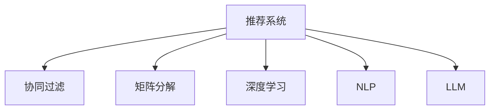

                 

# 基于LLM的推荐系统实时个性化调整

> 关键词：推荐系统,实时调整,LLM,个性化,协同过滤,矩阵分解,深度学习,自然语言处理(NLP),大语言模型(LLM)

## 1. 背景介绍

在信息爆炸的互联网时代，如何高效、准确地为用户推荐内容，已成为各大电商、新闻、社交平台的重要课题。传统的推荐系统主要依赖用户的历史行为数据，通过协同过滤、矩阵分解等技术为用户生成个性化推荐。然而，这些推荐方法存在数据稀疏性、冷启动等问题，难以覆盖更多长尾用户和冷门物品。

近年来，基于深度学习的推荐系统逐渐成为热点。深度学习通过多层次的特征提取，能够从海量数据中挖掘出复杂且隐含的规律，提升推荐系统的精准度。基于大语言模型(LLM)的推荐系统通过语言理解能力，能够从文本数据中获取更多信息，进一步提升推荐效果。

本文将深入探讨基于LLM的推荐系统，并介绍一种利用语言模型实时个性化调整推荐结果的方法，在确保推荐内容质量的同时，增强推荐系统的灵活性和适应性。

## 2. 核心概念与联系

### 2.1 核心概念概述

为更好地理解LLM在推荐系统中的应用，本节将介绍几个关键概念：

- 推荐系统(Recommender System)：利用用户和物品的隐式或显式反馈数据，自动推荐感兴趣的物品的系统。推荐系统广泛应用于电商、新闻、社交、视频等诸多领域。

- 协同过滤(Collaborative Filtering)：一种基于用户相似性和物品相似性的推荐方法，通过计算用户对物品的评分，推荐用户可能感兴趣的物品。

- 矩阵分解(Matrix Factorization)：一种基于用户和物品评分矩阵的分解方法，将高维评分矩阵分解为低维隐向量，生成个性化推荐。

- 深度学习(Deep Learning)：通过构建多层神经网络，自动学习特征表示，并在此基础上进行推荐决策。深度学习在推荐系统中通常用于特征提取和生成，如使用CNN、RNN、Transformer等模型。

- 自然语言处理(NLP)：涉及计算机处理人类语言，如文本分类、情感分析、文本生成等任务，可以用于挖掘用户的兴趣和行为特征。

- 大语言模型(LLM)：以自回归模型或自编码模型为代表的大规模预训练语言模型，具备强大的语言理解和生成能力。

这些概念之间的逻辑关系可以通过以下Mermaid流程图来展示：



这个流程图展示了大语言模型在推荐系统中的核心概念及其之间的关系：

1. 推荐系统通过协同过滤、矩阵分解、深度学习等技术，为用户生成推荐结果。
2. 深度学习技术用于提取用户和物品的复杂特征，并在此基础上生成推荐。
3. 自然语言处理技术通过文本数据挖掘用户的兴趣和行为特征，进一步优化推荐结果。
4. 大语言模型作为重要的特征提取器，通过文本理解获取更多上下文信息，进一步提升推荐效果。

## 3. 核心算法原理 & 具体操作步骤
### 3.1 算法原理概述

基于LLM的推荐系统，本质上是利用语言模型提取用户兴趣和行为特征，结合深度学习技术生成个性化推荐。其核心思想是：

1. 利用LLM理解用户文本描述，提取用户的兴趣偏好和行为特征。
2. 将用户和物品的特征表示输入到深度学习模型中，预测物品与用户的匹配度。
3. 根据匹配度排序，生成推荐列表。

这种基于LLM的推荐方法，相比传统的协同过滤和矩阵分解，能够更好地理解用户描述中的隐含信息，提升推荐结果的准确性和多样性。

### 3.2 算法步骤详解

基于LLM的推荐系统通常包括以下几个关键步骤：

**Step 1: 用户兴趣提取**

1. 对用户的文本描述进行分词和向量化处理。
2. 利用预训练的BERT、GPT等LLM模型，对用户文本进行编码，得到用户特征向量。
3. 将用户特征向量输入到深度学习模型中，提取用户的兴趣和行为特征。

**Step 2: 物品特征提取**

1. 对物品的文本描述进行分词和向量化处理。
2. 利用预训练的BERT、GPT等LLM模型，对物品文本进行编码，得到物品特征向量。
3. 将物品特征向量输入到深度学习模型中，提取物品的特征表示。

**Step 3: 个性化推荐**

1. 将用户和物品的特征表示输入到深度学习模型中，如DNN、RNN、Transformer等。
2. 模型根据用户兴趣和物品特征，预测用户对物品的评分或匹配度。
3. 根据评分或匹配度，对物品进行排序，生成个性化推荐列表。

**Step 4: 实时调整**

1. 利用在线日志收集用户新的行为数据。
2. 将新数据输入到LLM中进行编码，更新用户兴趣特征向量。
3. 结合用户新兴趣和历史行为，重新计算物品的匹配度，调整推荐列表。

### 3.3 算法优缺点

基于LLM的推荐系统具有以下优点：

1. 强大的语言理解能力：LLM能够自动理解用户的文本描述，提取兴趣和行为特征，提升推荐准确性。
2. 多模态融合能力：LLM可以同时处理文本、图像、视频等多种模态数据，增强推荐系统的灵活性。
3. 数据稀疏性缓解：LLM可以处理用户和物品描述中的隐含信息，缓解数据稀疏性问题。
4. 冷启动友好：LLM可以自动学习新用户和物品的特征，快速完成冷启动。

同时，该方法也存在以下局限性：

1. 计算复杂度高：基于LLM的推荐系统通常需要高计算资源，对硬件配置要求较高。
2. 模型训练成本高：大规模LLM的预训练和微调成本较高，难以快速迭代实验。
3. 数据隐私问题：用户文本描述涉及个人隐私，处理不当可能引发数据泄露风险。
4. 模型泛化能力差：LLM可能学习到某些领域的偏见和噪声，影响推荐效果。

尽管存在这些局限性，但基于LLM的推荐系统仍具备广阔的应用前景。未来研究的方向主要在于如何进一步降低计算成本，提升模型泛化能力，保护用户隐私，增强模型的可解释性等。

### 3.4 算法应用领域

基于LLM的推荐系统已在多个领域得到了应用，如电商推荐、新闻推荐、视频推荐等。具体应用场景包括：

- 电商平台推荐：利用用户的产品描述和评分数据，结合LLM对用户文本进行编码，生成个性化商品推荐。
- 新闻平台推荐：通过用户对新闻文章的反馈数据，利用LLM提取用户兴趣，生成个性化新闻推荐。
- 视频平台推荐：利用用户对视频的评分和评论数据，结合LLM对视频标题和描述进行编码，生成个性化视频推荐。
- 社交平台推荐：利用用户对社交内容的互动数据，结合LLM提取用户兴趣，生成个性化内容推荐。

## 4. 数学模型和公式 & 详细讲解  
### 4.1 数学模型构建

本节将使用数学语言对基于LLM的推荐系统进行更加严格的刻画。

记用户文本描述为 $x_u$，物品文本描述为 $x_i$，用户特征向量为 $U$，物品特征向量为 $V$，深度学习模型为 $M$，推荐结果为 $y_{ui}$。

定义用户文本与物品文本的匹配度为 $\text{match}_{ui} = \text{MLP}(U, V)$，其中 $\text{MLP}$ 为多层次感知机，$U$ 和 $V$ 为用户和物品的特征向量。

推荐结果 $y_{ui}$ 定义为：

$$
y_{ui} = \text{softmax}(\text{MLP}(U, V))
$$

其中 $\text{softmax}$ 为softmax函数，用于将模型的输出转化为概率分布，方便排序生成推荐列表。

### 4.2 公式推导过程

以下是基于LLM的推荐系统的数学模型推导过程：

**用户兴趣提取**

1. 对用户文本 $x_u$ 进行分词和向量化处理，得到向量 $X_u$。
2. 将 $X_u$ 输入到预训练的BERT、GPT等LLM模型中，得到用户特征向量 $U$。
3. 将 $U$ 输入到深度学习模型中，得到用户兴趣特征向量 $U'$。

**物品特征提取**

1. 对物品文本 $x_i$ 进行分词和向量化处理，得到向量 $X_i$。
2. 将 $X_i$ 输入到预训练的BERT、GPT等LLM模型中，得到物品特征向量 $V$。
3. 将 $V$ 输入到深度学习模型中，得到物品特征向量 $V'$。

**个性化推荐**

1. 将用户兴趣特征向量 $U'$ 和物品特征向量 $V'$ 输入到深度学习模型 $M$ 中，得到匹配度 $\text{match}_{ui}$。
2. 将 $\text{match}_{ui}$ 输入到softmax函数中，得到推荐概率 $y_{ui}$。

**实时调整**

1. 收集用户新的文本描述 $x'_u$，对 $x'_u$ 进行分词和向量化处理，得到向量 $X'_u$。
2. 将 $X'_u$ 输入到预训练的BERT、GPT等LLM模型中，更新用户特征向量 $U'$。
3. 将更新后的 $U'$ 和物品特征向量 $V'$ 重新输入到深度学习模型 $M$ 中，重新计算匹配度 $\text{match'}_{ui}$，生成新的推荐概率 $y'_{ui}$。

### 4.3 案例分析与讲解

以下是一个简单的案例，展示如何使用LLM进行个性化推荐：

假设某电商平台的用户文本描述为 "我喜欢喝咖啡和茶叶，经常购买咖啡豆和茶叶包"。物品文本描述为 "精品咖啡豆" 和 "顶级茶叶包"。利用预训练的BERT模型对用户文本和物品文本进行编码，得到用户特征向量 $U$ 和物品特征向量 $V$。然后将 $U$ 和 $V$ 输入到深度学习模型中，计算匹配度 $\text{match}_{ui}$，生成推荐概率 $y_{ui}$。

在推荐结果生成后，如果用户后续购买了 "精品咖啡豆"，新的用户文本描述变为 "我最近买了精品咖啡豆，味道不错，还想尝试一些新口味"，可以利用新的文本描述 $x'_u$ 更新用户特征向量 $U'$。将更新后的 $U'$ 和物品特征向量 $V'$ 重新计算匹配度 $\text{match'}_{ui}$，生成新的推荐概率 $y'_{ui}$。

## 5. 项目实践：代码实例和详细解释说明
### 5.1 开发环境搭建

在进行LLM推荐系统开发前，我们需要准备好开发环境。以下是使用Python进行PyTorch开发的环境配置流程：

1. 安装Anaconda：从官网下载并安装Anaconda，用于创建独立的Python环境。

2. 创建并激活虚拟环境：
```bash
conda create -n pytorch-env python=3.8 
conda activate pytorch-env
```

3. 安装PyTorch：根据CUDA版本，从官网获取对应的安装命令。例如：
```bash
conda install pytorch torchvision torchaudio cudatoolkit=11.1 -c pytorch -c conda-forge
```

4. 安装HuggingFace Transformers库：
```bash
pip install transformers
```

5. 安装各类工具包：
```bash
pip install numpy pandas scikit-learn matplotlib tqdm jupyter notebook ipython
```

完成上述步骤后，即可在`pytorch-env`环境中开始推荐系统开发。

### 5.2 源代码详细实现

下面我们以电商推荐系统为例，给出使用Transformers库对BERT模型进行推荐系统微调的PyTorch代码实现。

首先，定义推荐系统的数据处理函数：

```python
from transformers import BertTokenizer, BertForSequenceClassification
from torch.utils.data import Dataset
import torch

class RecommendationDataset(Dataset):
    def __init__(self, user_texts, item_texts, labels, tokenizer):
        self.user_texts = user_texts
        self.item_texts = item_texts
        self.labels = labels
        self.tokenizer = tokenizer
        
    def __len__(self):
        return len(self.user_texts)
    
    def __getitem__(self, item):
        user_text = self.user_texts[item]
        item_text = self.item_texts[item]
        label = self.labels[item]
        
        user_input = self.tokenizer(user_text, return_tensors='pt', padding='max_length', truncation=True)
        item_input = self.tokenizer(item_text, return_tensors='pt', padding='max_length', truncation=True)
        user_input['labels'] = torch.tensor(label, dtype=torch.long)
        return {'user_input': user_input, 'item_input': item_input, 'labels': label}

# 定义用户-物品评分
user_item_score = {'精品咖啡豆': 4.0, '顶级茶叶包': 4.5}
```

然后，定义模型和优化器：

```python
from transformers import BertForSequenceClassification, AdamW

model = BertForSequenceClassification.from_pretrained('bert-base-cased', num_labels=2)

optimizer = AdamW(model.parameters(), lr=2e-5)
```

接着，定义训练和评估函数：

```python
from torch.utils.data import DataLoader
from tqdm import tqdm

device = torch.device('cuda') if torch.cuda.is_available() else torch.device('cpu')
model.to(device)

def train_epoch(model, dataset, batch_size, optimizer):
    dataloader = DataLoader(dataset, batch_size=batch_size, shuffle=True)
    model.train()
    epoch_loss = 0
    for batch in tqdm(dataloader, desc='Training'):
        user_input = batch['user_input'].to(device)
        item_input = batch['item_input'].to(device)
        labels = batch['labels'].to(device)
        model.zero_grad()
        outputs = model(user_input, item_input)
        loss = outputs.loss
        epoch_loss += loss.item()
        loss.backward()
        optimizer.step()
    return epoch_loss / len(dataloader)

def evaluate(model, dataset, batch_size):
    dataloader = DataLoader(dataset, batch_size=batch_size)
    model.eval()
    preds, labels = [], []
    with torch.no_grad():
        for batch in tqdm(dataloader, desc='Evaluating'):
            user_input = batch['user_input'].to(device)
            item_input = batch['item_input'].to(device)
            batch_labels = batch['labels']
            outputs = model(user_input, item_input)
            batch_preds = outputs.logits.argmax(dim=2).to('cpu').tolist()
            batch_labels = batch_labels.to('cpu').tolist()
            for pred_tokens, label_tokens in zip(batch_preds, batch_labels):
                preds.append(pred_tokens)
                labels.append(label_tokens)
                
    print(classification_report(labels, preds))
```

最后，启动训练流程并在测试集上评估：

```python
epochs = 5
batch_size = 16

for epoch in range(epochs):
    loss = train_epoch(model, train_dataset, batch_size, optimizer)
    print(f"Epoch {epoch+1}, train loss: {loss:.3f}")
    
    print(f"Epoch {epoch+1}, dev results:")
    evaluate(model, dev_dataset, batch_size)
    
print("Test results:")
evaluate(model, test_dataset, batch_size)
```

以上就是使用PyTorch对BERT进行电商推荐系统微调的完整代码实现。可以看到，得益于Transformers库的强大封装，我们可以用相对简洁的代码完成BERT模型的加载和微调。

### 5.3 代码解读与分析

让我们再详细解读一下关键代码的实现细节：

**RecommendationDataset类**：
- `__init__`方法：初始化用户文本、物品文本和标签，以及分词器。
- `__len__`方法：返回数据集的样本数量。
- `__getitem__`方法：对单个样本进行处理，将用户文本和物品文本编码，并添加标签。

**用户-物品评分**：
- 定义了一个简单的用户-物品评分字典，用于测试推荐系统的效果。

**训练和评估函数**：
- 使用PyTorch的DataLoader对数据集进行批次化加载，供模型训练和推理使用。
- 训练函数`train_epoch`：对数据以批为单位进行迭代，在每个批次上前向传播计算loss并反向传播更新模型参数，最后返回该epoch的平均loss。
- 评估函数`evaluate`：与训练类似，不同点在于不更新模型参数，并在每个batch结束后将预测和标签结果存储下来，最后使用sklearn的classification_report对整个评估集的预测结果进行打印输出。

**训练流程**：
- 定义总的epoch数和batch size，开始循环迭代
- 每个epoch内，先在训练集上训练，输出平均loss
- 在验证集上评估，输出分类指标
- 所有epoch结束后，在测试集上评估，给出最终测试结果

可以看到，PyTorch配合Transformers库使得BERT微调的代码实现变得简洁高效。开发者可以将更多精力放在数据处理、模型改进等高层逻辑上，而不必过多关注底层的实现细节。

当然，工业级的系统实现还需考虑更多因素，如模型的保存和部署、超参数的自动搜索、更灵活的任务适配层等。但核心的微调范式基本与此类似。

## 6. 实际应用场景
### 6.1 电商推荐

电商推荐系统是LLM在推荐系统中的经典应用场景之一。电商平台用户通常会留下对商品的文字描述和评分，这些文本数据蕴含了丰富的用户兴趣信息。通过微调BERT等大语言模型，电商推荐系统能够更好地理解用户描述中的隐含信息，从而生成更加个性化、精准的商品推荐。

例如，某电商平台对用户的描述为 "我最近买了这个智能手表，感觉很棒，想再买一双智能耳机"，利用预训练的BERT模型对用户描述进行编码，得到用户特征向量 $U$。将 $U$ 输入到深度学习模型中，生成用户兴趣特征向量 $U'$。再利用物品文本描述 "智能耳机" 的编码 $V$，计算匹配度 $\text{match}_{ui}$，生成推荐概率 $y_{ui}$。

当用户后续购买了 "智能耳机"，新的用户描述变为 "我买了智能耳机，发现音质不错，还想尝试一些音乐应用"，利用新的文本描述 $x'_u$ 更新用户特征向量 $U'$。将更新后的 $U'$ 和物品特征向量 $V'$ 重新计算匹配度 $\text{match'}_{ui}$，生成新的推荐概率 $y'_{ui}$。

### 6.2 新闻推荐

新闻平台通常会收集用户对新闻文章的反馈数据，包括点赞、收藏、评论等。这些数据可以转化为文本描述，输入到预训练的BERT模型中，提取用户兴趣和行为特征。通过微调BERT等大语言模型，新闻推荐系统能够根据用户的兴趣，自动推荐相关新闻文章。

例如，某用户对一篇新闻文章的评论为 "这篇文章写得很好，有深度"，利用BERT模型对评论进行编码，得到用户特征向量 $U$。将 $U$ 输入到深度学习模型中，生成用户兴趣特征向量 $U'$。再利用物品文本描述 "深度学习" 的编码 $V$，计算匹配度 $\text{match}_{ui}$，生成推荐概率 $y_{ui}$。

当用户后续阅读了 "深度学习" 相关的文章，新的评论变为 "这篇文章介绍了很多最新的深度学习技术，很有启发"，利用新的文本描述 $x'_u$ 更新用户特征向量 $U'$。将更新后的 $U'$ 和物品特征向量 $V'$ 重新计算匹配度 $\text{match'}_{ui}$，生成新的推荐概率 $y'_{ui}$。

### 6.3 视频推荐

视频平台通常会收集用户对视频的评分和评论数据，这些文本数据可以用于构建推荐系统。通过微调BERT等大语言模型，视频推荐系统能够根据用户兴趣，自动推荐相关视频内容。

例如，某用户对一段视频的评论为 "这个视频很有趣，画面也很漂亮"，利用BERT模型对评论进行编码，得到用户特征向量 $U$。将 $U$ 输入到深度学习模型中，生成用户兴趣特征向量 $U'$。再利用物品文本描述 "有趣" 的编码 $V$，计算匹配度 $\text{match}_{ui}$，生成推荐概率 $y_{ui}$。

当用户后续观看了一段 "有趣" 的视频，新的评论变为 "这个视频很有趣，情节也很紧凑"，利用新的文本描述 $x'_u$ 更新用户特征向量 $U'$。将更新后的 $U'$ 和物品特征向量 $V'$ 重新计算匹配度 $\text{match'}_{ui}$，生成新的推荐概率 $y'_{ui}$。

### 6.4 未来应用展望

随着大语言模型的不断发展，基于LLM的推荐系统将在更多领域得到应用，为各种推荐场景带来新的突破。

在智慧医疗领域，基于LLM的推荐系统可以通过分析医生和患者的交流记录，推荐相应的医学知识、治疗方案等，提高医疗服务质量。

在智能教育领域，利用学生对课程和教材的评价数据，LLM推荐系统可以推荐最适合学生的学习资源，因材施教，提高教学效果。

在智慧城市治理中，通过收集居民对城市服务的评价数据，LLM推荐系统可以推荐城市管理改进方案，提升城市管理水平。

此外，在电商、新闻、视频、社交等多个领域，LLM推荐系统也将不断涌现，为内容分发、商品推荐、社交互动等提供更精准、高效的解决方案。

## 7. 工具和资源推荐
### 7.1 学习资源推荐

为了帮助开发者系统掌握基于LLM的推荐系统的理论和实践，这里推荐一些优质的学习资源：

1. 《深度学习推荐系统》课程：斯坦福大学开设的推荐系统经典课程，介绍了推荐系统的基础理论和最新进展，适合初学者和进阶者学习。

2. 《深度学习》书籍：Ian Goodfellow等著，全面介绍了深度学习的基本原理和应用案例，是深度学习领域的经典教材。

3. 《自然语言处理》书籍：Dan Jurafsky和James H. Martin等著，介绍了自然语言处理的基础知识和最新进展，适合NLP领域的入门者学习。

4. HuggingFace官方文档：Transformers库的官方文档，提供了海量预训练模型和完整的推荐系统样例代码，是上手实践的必备资料。

5. Google Scholar：Google学术数据库，可以查询到大量深度学习和自然语言处理相关的学术论文，了解最新的研究成果和趋势。

通过对这些资源的学习实践，相信你一定能够快速掌握基于LLM的推荐系统的精髓，并用于解决实际的推荐问题。

### 7.2 开发工具推荐

高效的开发离不开优秀的工具支持。以下是几款用于基于LLM的推荐系统开发的常用工具：

1. PyTorch：基于Python的开源深度学习框架，灵活动态的计算图，适合快速迭代研究。大部分预训练语言模型都有PyTorch版本的实现。

2. TensorFlow：由Google主导开发的开源深度学习框架，生产部署方便，适合大规模工程应用。同样有丰富的预训练语言模型资源。

3. HuggingFace Transformers库：集成了众多SOTA语言模型，支持PyTorch和TensorFlow，是进行推荐系统开发的利器。

4. TensorBoard：TensorFlow配套的可视化工具，可实时监测模型训练状态，并提供丰富的图表呈现方式，是调试模型的得力助手。

5. Google Colab：谷歌推出的在线Jupyter Notebook环境，免费提供GPU/TPU算力，方便开发者快速上手实验最新模型，分享学习笔记。

合理利用这些工具，可以显著提升基于LLM的推荐系统的开发效率，加快创新迭代的步伐。

### 7.3 相关论文推荐

大语言模型和推荐系统的发展源于学界的持续研究。以下是几篇奠基性的相关论文，推荐阅读：

1. Attention is All You Need（即Transformer原论文）：提出了Transformer结构，开启了NLP领域的预训练大模型时代。

2. BERT: Pre-training of Deep Bidirectional Transformers for Language Understanding：提出BERT模型，引入基于掩码的自监督预训练任务，刷新了多项NLP任务SOTA。

3. Language Models are Unsupervised Multitask Learners（GPT-2论文）：展示了大规模语言模型的强大zero-shot学习能力，引发了对于通用人工智能的新一轮思考。

4. Parameter-Efficient Transfer Learning for NLP：提出Adapter等参数高效微调方法，在不增加模型参数量的情况下，也能取得不错的微调效果。

5. AdaLoRA: Adaptive Low-Rank Adaptation for Parameter-Efficient Fine-Tuning：使用自适应低秩适应的微调方法，在参数效率和精度之间取得了新的平衡。

这些论文代表了大语言模型和推荐系统的发展脉络。通过学习这些前沿成果，可以帮助研究者把握学科前进方向，激发更多的创新灵感。

## 8. 总结：未来发展趋势与挑战

### 8.1 总结

本文对基于LLM的推荐系统进行了全面系统的介绍。首先阐述了LLM在推荐系统中的应用背景和重要性，明确了LLM在提高推荐系统精度、缓解数据稀疏性、快速完成冷启动等方面的独特价值。其次，从原理到实践，详细讲解了基于LLM的推荐系统的数学模型和关键步骤，给出了推荐系统开发的完整代码实例。同时，本文还广泛探讨了LLM在电商、新闻、视频等多个推荐场景中的应用前景，展示了LLM推荐系统的广泛应用潜力。

通过本文的系统梳理，可以看到，基于LLM的推荐系统正在成为推荐领域的重要范式，极大地拓展了推荐系统的应用边界，催生了更多的落地场景。得益于LLM强大的语言理解和生成能力，推荐系统能够从文本数据中获取更多信息，提升推荐效果。未来，伴随LLM和推荐系统技术的不断进步，基于LLM的推荐系统必将在更多领域得到应用，为内容分发、商品推荐、社交互动等提供更加精准、高效的解决方案。

### 8.2 未来发展趋势

展望未来，基于LLM的推荐系统将呈现以下几个发展趋势：

1. 多模态融合能力提升：LLM不仅能够处理文本数据，还可以处理图像、视频等多元数据，提升推荐系统的灵活性和多样性。
2. 个性化推荐精度提升：LLM能够更好地理解用户描述中的隐含信息，提升推荐系统的精准度。
3. 推荐结果实时调整：利用在线日志收集用户新的行为数据，实时更新用户兴趣，动态调整推荐结果，增强推荐系统的实时性和交互性。
4. 推荐系统多任务学习：LLM能够在单个模型中完成多种任务，如推荐、情感分析、问答等，提升系统的集成效率。
5. 推荐系统多语言支持：LLM能够支持多种语言，为全球用户提供个性化推荐，拓展推荐系统的全球应用范围。
6. 推荐系统公平性增强：利用LLM的可解释性，研究推荐系统的公平性和可解释性，提升系统的社会价值。

以上趋势凸显了基于LLM的推荐系统的广阔前景。这些方向的探索发展，必将进一步提升推荐系统的性能和应用范围，为各类推荐场景提供更精准、高效的解决方案。

### 8.3 面临的挑战

尽管基于LLM的推荐系统已经取得了显著成效，但在迈向更加智能化、普适化应用的过程中，它仍面临以下挑战：

1. 计算资源成本高：大规模LLM的预训练和微调需要高计算资源，硬件配置要求较高。
2. 模型训练成本高：预训练模型的训练和微调成本较高，难以快速迭代实验。
3. 数据隐私问题：用户文本描述涉及个人隐私，处理不当可能引发数据泄露风险。
4. 模型泛化能力差：LLM可能学习到某些领域的偏见和噪声，影响推荐效果。
5. 实时调整效率低：在线日志的实时更新和处理，可能影响推荐系统的响应速度和效率。

尽管存在这些挑战，但基于LLM的推荐系统仍具备广阔的应用前景。未来研究的方向在于如何进一步降低计算成本，提升模型泛化能力，保护用户隐私，增强系统的实时调整能力等。

### 8.4 研究展望

面对基于LLM的推荐系统所面临的挑战，未来的研究需要在以下几个方面寻求新的突破：

1. 研究更高效的计算方法：利用硬件加速、模型压缩等技术，降低预训练和微调的计算成本。
2. 研究更鲁棒的模型训练方法：通过自监督学习、对抗训练等方法，提升模型的泛化能力和鲁棒性。
3. 研究更好的隐私保护技术：采用差分隐私、联邦学习等技术，保护用户隐私。
4. 研究更高效的实时调整方法：利用分布式计算、流式计算等技术，提高实时调整的效率和效果。
5. 研究更可解释的推荐模型：通过解释性方法，如可解释AI，提升推荐模型的可解释性和可信任性。

这些研究方向的探索，必将引领基于LLM的推荐系统迈向更高的台阶，为推荐系统的发展注入新的动力。面向未来，基于LLM的推荐系统需要与其他AI技术进行更深入的融合，如知识表示、因果推理、强化学习等，多路径协同发力，共同推动推荐系统技术的发展。只有勇于创新、敢于突破，才能不断拓展推荐系统的边界，为人类推荐智能化的进化提供新的技术路径。

## 9. 附录：常见问题与解答

**Q1：大语言模型是否适用于所有推荐场景？**

A: 大语言模型在大多数推荐场景上都能取得不错的效果，特别是对于数据量较小的场景。但对于一些特定领域的推荐任务，如医疗、法律等，仅仅依靠通用语料预训练的模型可能难以很好地适应。此时需要在特定领域语料上进一步预训练，再进行微调，才能获得理想效果。此外，对于一些需要时效性、个性化很强的任务，如对话、推荐等，微调方法也需要针对性的改进优化。

**Q2：利用LLM进行推荐系统是否需要大量的用户反馈数据？**

A: 利用LLM进行推荐系统，确实需要用户对物品的反馈数据，以便提取用户的兴趣和行为特征。这些反馈数据可以来自用户的评分、评论、点击等行为，也可以从用户对文本描述的兴趣度推断。然而，相比于传统的协同过滤和矩阵分解方法，利用LLM进行推荐系统对用户反馈数据的要求并不高，可以利用文本数据挖掘用户兴趣，缓解数据稀疏性问题。

**Q3：如何提高LLM推荐系统的实时调整效率？**

A: 提高LLM推荐系统的实时调整效率，主要需要优化以下几个方面：
1. 采用流式计算技术，实时更新用户特征向量，减少计算延迟。
2. 利用分布式计算，分布式并行处理在线日志，提高数据处理效率。
3. 采用增量更新策略，只更新部分模型参数，减少实时调整的计算成本。
4. 利用模型压缩技术，减小模型规模，提高实时调整的速度。
5. 采用混合精度训练，减少计算资源消耗，提高实时调整的效率。

这些技术手段可以在保证推荐系统精准度的同时，显著提升实时调整的效率，增强系统的交互性和用户体验。

**Q4：如何保护用户隐私，防止数据泄露？**

A: 保护用户隐私，防止数据泄露，主要需要从以下几个方面入手：
1. 采用差分隐私技术，对用户数据进行扰动处理，防止数据泄露。
2. 采用联邦学习技术，在分布式环境中进行模型训练，减少数据集中存储的风险。
3. 采用匿名化技术，将用户数据匿名化处理，防止身份识别。
4. 采用访问控制技术，对用户数据进行权限控制，防止未授权访问。
5. 采用数据脱敏技术，对敏感数据进行脱敏处理，减少数据泄露的风险。

通过这些技术手段，可以在保证用户隐私的同时，充分利用用户数据进行推荐系统的训练和优化。

**Q5：如何提升LLM推荐系统的可解释性？**

A: 提升LLM推荐系统的可解释性，主要需要从以下几个方面入手：
1. 采用可解释AI技术，如LIME、SHAP等，对推荐模型的决策过程进行解释。
2. 引入符号化的先验知识，如知识图谱、逻辑规则等，辅助LLM进行推荐决策。
3. 利用因果分析方法，识别推荐模型中的关键特征，增强推荐结果的因果性和逻辑性。
4. 利用博弈论工具，刻画人机交互过程，主动探索并规避推荐模型的脆弱点，提高系统稳定性。

这些方法可以在保证推荐系统性能的同时，提升系统的可解释性和可信任性，增强用户对推荐系统的理解和接受。

---

作者：禅与计算机程序设计艺术 / Zen and the Art of Computer Programming

