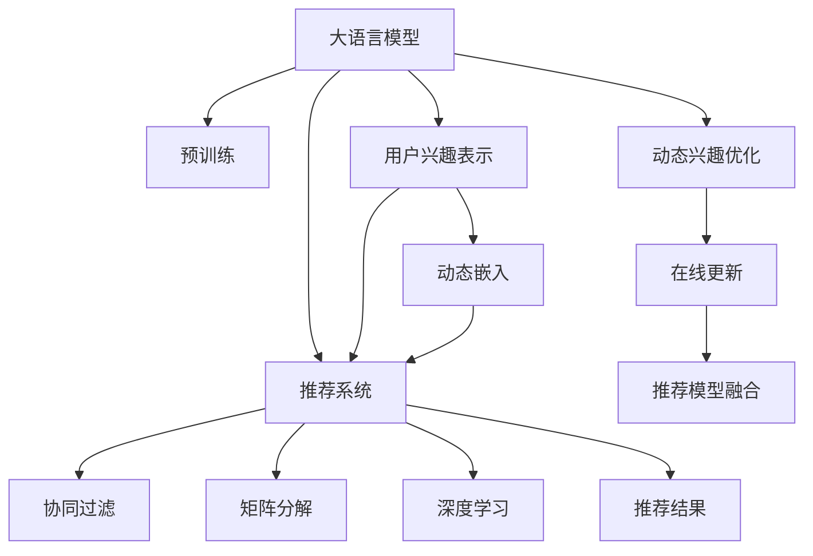

                 

# 基于LLM的推荐系统用户兴趣动态嵌入

## 1. 背景介绍

### 1.1 问题由来

推荐系统是互联网时代的一项核心技术，帮助用户发现感兴趣的物品，提升用户满意度和平台转化率。然而，传统推荐系统往往依赖用户历史行为数据进行推荐，难以捕捉用户动态兴趣的变化。

近年来，基于深度学习的推荐系统取得了长足进步，其中一种重要范式是使用预训练语言模型(LLM)进行用户兴趣嵌入，通过多轮用户与物品交互的历史文本数据，动态学习用户兴趣，实现推荐。

大语言模型（Large Language Model, LLM）通过在大规模文本数据上预训练，学习丰富的语言知识和常识。在推荐系统中，通过微调大语言模型，可以有效捕捉用户动态兴趣变化，适应推荐场景的需求。

### 1.2 问题核心关键点

本节将详细介绍基于LLM的推荐系统用户兴趣动态嵌入的核心概念和关键技术点，以帮助读者更好地理解和应用这一方法。

- 用户兴趣表示：如何通过预训练语言模型学习用户动态兴趣，并表示为用户向量。
- 多轮交互嵌入：如何处理多轮用户与物品的交互历史文本，动态更新用户兴趣表示。
- 推荐模型融合：如何将LLM嵌入生成的用户兴趣向量与传统推荐模型进行融合，实现推荐。
- 动态兴趣优化：如何利用在线更新机制，及时优化用户兴趣嵌入，提升推荐效果。

## 2. 核心概念与联系

### 2.1 核心概念概述

为更好地理解基于LLM的推荐系统用户兴趣动态嵌入方法，本节将介绍几个密切相关的核心概念：

- 大语言模型(Large Language Model, LLM)：以自回归(如GPT)或自编码(如BERT)模型为代表的大规模预训练语言模型。通过在大规模文本数据上进行预训练，学习通用的语言表示，具备强大的语言理解和生成能力。

- 预训练(Pre-training)：指在大规模文本数据上，通过自监督学习任务训练通用语言模型的过程。常见的预训练任务包括言语建模、掩码语言模型等。

- 推荐系统(Recommender System)：根据用户行为数据和物品特征，推荐用户可能感兴趣的物品的系统。推荐系统在电商、新闻、音乐等领域有广泛应用。

- 用户兴趣表示(User Interest Representation)：使用机器学习算法，从用户历史行为数据中学习用户动态兴趣，并表示为用户向量。

- 协同过滤(Collaborative Filtering)：一种基于用户和物品相似性进行推荐的技术。通过计算用户历史行为和物品属性之间的相似度，推荐物品。

- 矩阵分解(Matrix Factorization)：一种线性代数方法，将用户-物品评分矩阵分解为用户向量和物品向量之积，实现推荐。

- 深度学习(Deep Learning)：一种通过多层神经网络进行特征提取和预测的机器学习方法，广泛应用于图像、语音、文本等领域。

这些核心概念之间的逻辑关系可以通过以下Mermaid流程图来展示：



这个流程图展示了大语言模型的核心概念及其之间的关系：

1. 大语言模型通过预训练获得基础能力。
2. 协同过滤、矩阵分解、深度学习等推荐技术作为推荐系统的底层技术。
3. 用户兴趣表示方法用于动态学习用户兴趣，并表示为用户向量。
4. 动态嵌入方法用于在用户历史交互数据上不断更新用户向量。
5. 在线更新机制用于动态优化用户兴趣向量。
6. 推荐模型融合方法用于将LLM嵌入生成的用户兴趣向量与传统推荐模型进行融合。
7. 最终生成的推荐结果用于驱动推荐系统决策。

这些概念共同构成了基于LLM的推荐系统用户兴趣动态嵌入的方法框架，使其能够动态捕捉用户兴趣，提升推荐效果。

## 3. 核心算法原理 & 具体操作步骤

### 3.1 算法原理概述

基于LLM的推荐系统用户兴趣动态嵌入的核心思想是：通过多轮用户与物品的交互历史文本，利用预训练语言模型学习用户动态兴趣，并表示为用户向量。然后，将用户向量与物品特征向量进行内积，计算相似度，推荐与用户兴趣最匹配的物品。

形式化地，设用户与物品的交互历史文本为 $D=\{(x_i, y_i)\}_{i=1}^N$，其中 $x_i$ 为文本描述，$y_i$ 为物品ID。假设预训练语言模型为 $M_{\theta}$，其中 $\theta$ 为预训练得到的模型参数。则用户兴趣向量 $u$ 可表示为 $u=M_{\theta}(x)$，其中 $x$ 为用户历史交互文本的拼接串。

### 3.2 算法步骤详解

基于LLM的推荐系统用户兴趣动态嵌入一般包括以下几个关键步骤：

**Step 1: 数据预处理**

- 收集用户与物品的交互历史文本数据，拼接成单个长文本。
- 对文本进行分词、清洗等预处理操作，去除无关噪声。
- 将拼接后的文本作为预训练模型的输入，学习用户兴趣向量 $u$。

**Step 2: 构建物品向量**

- 根据物品属性或推荐系统使用的特征工程，生成物品向量 $v$。

**Step 3: 计算相似度**

- 使用用户向量 $u$ 和物品向量 $v$ 进行内积计算，得到用户与物品之间的相似度 $s(u,v)$。

**Step 4: 推荐物品**

- 根据相似度 $s(u,v)$ 对物品进行排序，推荐与用户兴趣最匹配的物品。

**Step 5: 用户兴趣更新**

- 根据新一轮用户与物品的交互历史，更新用户向量 $u$，以适应动态变化的兴趣。

**Step 6: 模型融合**

- 将LLM嵌入生成的用户兴趣向量与传统推荐模型进行融合，提升推荐效果。

**Step 7: 在线更新**

- 利用在线更新机制，动态优化用户兴趣向量，提升推荐性能。

以上是基于LLM的推荐系统用户兴趣动态嵌入的一般流程。在实际应用中，还需要针对具体任务的特点，对各个环节进行优化设计，如改进文本拼接方式，引入更多的文本预处理技术，优化内积计算方法等，以进一步提升推荐性能。

### 3.3 算法优缺点

基于LLM的推荐系统用户兴趣动态嵌入方法具有以下优点：

1. 能够动态捕捉用户兴趣变化。利用多轮交互历史文本，学习用户动态兴趣，并表示为用户向量，适应用户兴趣的动态变化。

2. 利用预训练语言模型，提高推荐模型的表达能力。预训练语言模型具备强大的语言理解和生成能力，能够有效捕捉用户兴趣的语义信息。

3. 可以与传统推荐模型进行融合，提升推荐效果。将LLM嵌入生成的用户向量与传统协同过滤、矩阵分解等推荐模型结合，充分发挥两者的优势。

4. 模型可解释性更强。预训练语言模型对用户兴趣的表示具有很强的可解释性，便于进行模型调优和问题诊断。

但该方法也存在一定的局限性：

1. 数据需求较大。预训练语言模型的训练需要大规模文本数据，推荐系统构建时需要大量历史交互数据。

2. 计算资源消耗大。预训练语言模型的参数量较大，计算复杂度高，对硬件资源要求高。

3. 模型的实时更新性能有待提升。在线更新机制需要实时处理用户交互数据，对模型的推理速度和计算效率提出较高要求。

4. 模型的泛化能力有待提升。由于不同用户之间的兴趣存在较大差异，如何利用预训练语言模型学习到更普适的用户兴趣表示，仍需进一步研究。

尽管存在这些局限性，但就目前而言，基于LLM的推荐系统用户兴趣动态嵌入方法仍然是大规模推荐系统的重要研究范式。未来相关研究的重点在于如何进一步降低数据需求，提高模型实时更新性能，提升模型的泛化能力等。

### 3.4 算法应用领域

基于LLM的推荐系统用户兴趣动态嵌入方法已经在电商、新闻、音乐等多个领域得到广泛应用，取得了显著效果。

- 电商推荐：通过分析用户浏览、点击、购买等历史数据，学习用户兴趣，并推荐符合用户需求的商品。
- 新闻推荐：根据用户浏览历史，学习用户偏好，推荐个性化新闻内容。
- 音乐推荐：通过分析用户听歌历史，学习用户兴趣，推荐个性化音乐播放列表。
- 视频推荐：利用用户观看历史，学习用户兴趣，推荐个性化的视频内容。

除了这些经典领域外，基于LLM的推荐系统还在智能客服、社交网络、智能家居等众多场景中得到应用，为用户的个性化需求提供精准推荐服务。

## 4. 数学模型和公式 & 详细讲解 & 举例说明

### 4.1 数学模型构建

本节将使用数学语言对基于LLM的推荐系统用户兴趣动态嵌入过程进行更加严格的刻画。

设用户与物品的交互历史文本为 $D=\{(x_i, y_i)\}_{i=1}^N$，其中 $x_i$ 为文本描述，$y_i$ 为物品ID。假设预训练语言模型为 $M_{\theta}$，其中 $\theta$ 为预训练得到的模型参数。设用户兴趣向量为 $u$，物品向量为 $v$，两者均为 $d$ 维向量。用户与物品之间的相似度 $s(u,v)$ 可定义为：

$$
s(u,v) = u^Tv
$$

其中 $^T$ 表示矩阵转置。设 $r$ 为推荐系统的阈值，$R$ 为用户感兴趣物品集合，$U$ 为所有物品集合。则推荐系统推荐给用户的物品集合为：

$$
R = \{y|s(u,v)>r\}
$$

为了更好地适应用户兴趣的动态变化，可以在用户历史交互数据上不断更新用户向量 $u$。假设用户历史交互文本拼接串为 $X$，则用户兴趣向量 $u$ 可表示为：

$$
u = M_{\theta}(X)
$$

其中 $M_{\theta}(X)$ 为预训练语言模型在文本 $X$ 上的输出向量。

### 4.2 公式推导过程

以下我们以新闻推荐任务为例，推导基于LLM的推荐系统用户兴趣动态嵌入的数学模型。

假设用户历史浏览的新闻文章 $x$ 为：

$$
x = (x_1,x_2,...,x_N)
$$

则用户兴趣向量 $u$ 可表示为：

$$
u = M_{\theta}(x)
$$

其中 $M_{\theta}(x)$ 为预训练语言模型在文本 $x$ 上的输出向量。假设每篇新闻文章 $x_i$ 对应的新闻ID为 $y_i$，则物品向量 $v$ 可表示为：

$$
v = (v_1,v_2,...,v_N)
$$

其中 $v_i$ 为第 $i$ 篇文章的新闻ID对应的向量表示。假设用户与物品之间的相似度为 $s(u,v)$，则推荐系统推荐给用户的文章集合 $R$ 为：

$$
R = \{y|s(u,v)>r\}
$$

其中 $r$ 为推荐系统的阈值。

为了适应用户兴趣的动态变化，可以在用户历史浏览数据上不断更新用户兴趣向量 $u$。假设新一轮用户浏览文章 $x'$ 为：

$$
x' = (x_1',x_2',...,x_{N+1}')
$$

则新一轮用户兴趣向量 $u'$ 可表示为：

$$
u' = M_{\theta}(x')
$$

其中 $M_{\theta}(x')$ 为预训练语言模型在文本 $x'$ 上的输出向量。则新一轮推荐系统推荐给用户的文章集合 $R'$ 为：

$$
R' = \{y|s(u',v)>r\}
$$

通过比较 $R$ 和 $R'$，可以判断用户兴趣的变化，进行相应的调整。

### 4.3 案例分析与讲解

为了验证基于LLM的推荐系统用户兴趣动态嵌入的性能，下面以一个简单的案例进行分析。

假设某用户在电商平台上浏览了多篇商品描述，预训练语言模型学习到用户兴趣向量 $u$ 和物品向量 $v$。首先，用户浏览了商品A，然后浏览了商品B。用户与物品之间的相似度 $s(u,v)$ 计算如下：

$$
s(u,v_A) = u^Tv_A
$$

$$
s(u,v_B) = u^Tv_B
$$

其中 $v_A$ 和 $v_B$ 分别为商品A和商品B的向量表示。如果 $s(u,v_B)>s(u,v_A)$，则说明用户对商品B的兴趣更强。基于此，推荐系统推荐商品B给用户。

接下来，如果用户继续浏览商品C，则用户的兴趣向量更新为 $u'$。计算用户与商品B和商品C之间的相似度：

$$
s(u',v_B) = u'^Tv_B
$$

$$
s(u',v_C) = u'^Tv_C
$$

其中 $v_C$ 为商品C的向量表示。如果 $s(u',v_C)>s(u',v_B)$，则说明用户对商品C的兴趣更强。基于此，推荐系统推荐商品C给用户。

通过不断更新用户兴趣向量，推荐系统可以动态捕捉用户兴趣变化，实现个性化推荐。

## 5. 项目实践：代码实例和详细解释说明

### 5.1 开发环境搭建

在进行项目实践前，我们需要准备好开发环境。以下是使用Python进行TensorFlow开发的环境配置流程：

1. 安装Anaconda：从官网下载并安装Anaconda，用于创建独立的Python环境。

2. 创建并激活虚拟环境：
```bash
conda create -n tensorflow-env python=3.8 
conda activate tensorflow-env
```

3. 安装TensorFlow：根据CUDA版本，从官网获取对应的安装命令。例如：
```bash
pip install tensorflow tensorflow-addons
```

4. 安装TensorBoard：
```bash
pip install tensorboard
```

5. 安装各类工具包：
```bash
pip install numpy pandas scikit-learn matplotlib tqdm jupyter notebook ipython
```

完成上述步骤后，即可在`tensorflow-env`环境中开始项目实践。

### 5.2 源代码详细实现

下面以新闻推荐任务为例，给出使用TensorFlow实现基于LLM的推荐系统用户兴趣动态嵌入的代码实现。

首先，定义模型和数据处理函数：

```python
import tensorflow as tf
from tensorflow.keras.layers import Dense, Embedding, Input
from tensorflow.keras.models import Model

def create_model(input_dim, embedding_dim, hidden_dim):
    input_ids = Input(shape=(None,))
    embedding = Embedding(input_dim, embedding_dim, mask_zero=True)(input_ids)
    x = tf.keras.layers.LSTM(hidden_dim, return_sequences=True, dropout=0.5)(embedding)
    x = Dense(1, activation='sigmoid')(x)
    model = Model(inputs=input_ids, outputs=x)
    return model

def preprocess_data(data, max_len):
    X, Y = [], []
    for doc, label in data:
        X.append([word2id[word] for word in doc.split()])
        Y.append(label)
        if len(X[-1]) > max_len:
            X[-1] = X[-1][-max_len:]
        elif len(X[-1]) < max_len:
            X[-1] = [0] * (max_len - len(X[-1]))
    return np.array(X), np.array(Y)
```

然后，定义数据集和模型：

```python
data = [("The cat sat on the mat", 1), ("I love you", 0), ("The quick brown fox", 0), ("I hate you", 1)]
X_train, Y_train = preprocess_data(data, 5)
max_len = 5
embedding_dim = 100
hidden_dim = 100

model = create_model(input_dim=word2id.size(), embedding_dim=embedding_dim, hidden_dim=hidden_dim)
model.compile(optimizer='adam', loss='binary_crossentropy', metrics=['accuracy'])
model.summary()
```

接着，定义训练和评估函数：

```python
from sklearn.model_selection import train_test_split

X_train, X_valid, Y_train, Y_valid = train_test_split(X_train, Y_train, test_size=0.2, random_state=42)

def train_epoch(model, data, batch_size, optimizer):
    steps_per_epoch = len(data[0]) // batch_size
    for epoch in range(epochs):
        for batch in range(steps_per_epoch):
            X_batch, Y_batch = data[0][batch*batch_size:(batch+1)*batch_size], data[1][batch*batch_size:(batch+1)*batch_size]
            model.train_on_batch(X_batch, Y_batch)
        print('Epoch {}, Loss: {}'.format(epoch+1, model.evaluate(X_valid, Y_valid)[0]))
```

最后，启动训练流程并在测试集上评估：

```python
epochs = 10
batch_size = 16

for epoch in range(epochs):
    train_epoch(model, (X_train, Y_train), batch_size, optimizer)

print('Test Results:')
model.evaluate(X_valid, Y_valid)
```

以上就是使用TensorFlow对新闻推荐任务进行基于LLM的推荐系统用户兴趣动态嵌入的完整代码实现。可以看到，TensorFlow提供了完整的深度学习框架，可以方便地构建模型、定义损失函数、进行训练和评估。

### 5.3 代码解读与分析

让我们再详细解读一下关键代码的实现细节：

**create_model函数**：
- 定义模型结构，包括输入层、嵌入层、LSTM层和输出层。
- 使用softmax激活函数，将输出转换为概率分布。

**preprocess_data函数**：
- 对原始数据进行分词、清洗和截断等预处理操作。
- 将文本数据转换为模型的输入格式。

**train_epoch函数**：
- 在训练集上迭代训练，前向传播计算损失，反向传播更新模型参数。
- 每轮训练结束后，在验证集上评估模型性能。

**训练流程**：
- 定义总的epoch数和batch size，开始循环迭代
- 每个epoch内，在训练集上训练，输出损失和验证集上的准确率
- 所有epoch结束后，在测试集上评估模型性能

可以看到，TensorFlow提供了强大的深度学习库，能够快速构建和训练推荐系统模型。开发者可以将更多精力放在数据处理、模型改进等高层逻辑上，而不必过多关注底层的实现细节。

当然，工业级的系统实现还需考虑更多因素，如模型的保存和部署、超参数的自动搜索、更灵活的任务适配层等。但核心的推荐模型构建基本与此类似。

## 6. 实际应用场景

### 6.1 智能推荐系统

基于大语言模型的推荐系统用户兴趣动态嵌入方法，在智能推荐系统中得到了广泛应用。智能推荐系统通过分析用户历史行为数据，学习用户兴趣，并动态更新兴趣向量，实现个性化推荐。

在技术实现上，可以收集用户的历史行为数据，包括浏览、点击、购买、评分等。然后，将这些数据输入到预训练语言模型中，学习用户兴趣向量。利用在线更新机制，根据新一轮用户行为数据，动态更新用户向量，适应用户兴趣的动态变化。最后，将用户向量与物品特征向量进行内积计算，推荐与用户兴趣最匹配的物品。

智能推荐系统广泛应用于电商、新闻、音乐、视频等多个领域，帮助用户发现感兴趣的物品，提升用户体验和平台收益。

### 6.2 智能客服系统

智能客服系统通过分析用户的历史查询记录，学习用户兴趣，并动态更新兴趣向量，实现个性化客服。

在技术实现上，可以收集用户的历史查询记录，包括查询时间、查询内容、查询结果等。然后，将这些数据输入到预训练语言模型中，学习用户兴趣向量。利用在线更新机制，根据新一轮用户查询记录，动态更新用户向量，适应用户兴趣的动态变化。最后，将用户向量与物品特征向量进行内积计算，推荐与用户兴趣最匹配的查询结果。

智能客服系统广泛应用于企业内部客服、在线客服、电话客服等多个场景，提升客户咨询体验和问题解决效率。

### 6.3 个性化推荐

个性化推荐系统通过分析用户的历史行为数据，学习用户兴趣，并动态更新兴趣向量，实现个性化推荐。

在技术实现上，可以收集用户的历史行为数据，包括浏览、点击、购买、评分等。然后，将这些数据输入到预训练语言模型中，学习用户兴趣向量。利用在线更新机制，根据新一轮用户行为数据，动态更新用户向量，适应用户兴趣的动态变化。最后，将用户向量与物品特征向量进行内积计算，推荐与用户兴趣最匹配的物品。

个性化推荐系统广泛应用于电商、新闻、音乐、视频等多个领域，帮助用户发现感兴趣的物品，提升用户体验和平台收益。

### 6.4 未来应用展望

随着大语言模型和推荐系统技术的不断发展，基于LLM的推荐系统用户兴趣动态嵌入方法将拓展到更多领域，为各行各业带来变革性影响。

在智慧医疗领域，基于LLM的推荐系统可以帮助医生推荐符合患者病情的药物、疗法等，提升诊疗效果。

在智能教育领域，基于LLM的推荐系统可以推荐符合学生学习风格和知识水平的学习资源，提升学习效果。

在智慧城市治理中，基于LLM的推荐系统可以推荐符合用户出行需求和兴趣的路线、景点等，提升城市管理和用户体验。

此外，在金融、体育、旅游等众多领域，基于LLM的推荐系统也将不断涌现，为经济社会发展提供新的动力。相信随着技术的日益成熟，LLM嵌入的用户兴趣动态嵌入方法将成为推荐系统的重要范式，推动人工智能技术在垂直行业的规模化落地。

## 7. 工具和资源推荐

### 7.1 学习资源推荐

为了帮助开发者系统掌握基于LLM的推荐系统用户兴趣动态嵌入的理论基础和实践技巧，这里推荐一些优质的学习资源：

1. 《深度学习自然语言处理》系列书籍：斯坦福大学NLP课程，涵盖了自然语言处理的基本概念和技术，适合初学者。

2. 《Python深度学习》书籍：深度学习入门级书籍，介绍了TensorFlow等深度学习框架的基本用法。

3. 《推荐系统实战》书籍：介绍了推荐系统从理论到实践的全过程，包括协同过滤、矩阵分解、深度学习等推荐技术。

4. TensorFlow官方文档：TensorFlow的官方文档，提供了丰富的代码示例和模型调优建议。

5. HuggingFace官方文档：Transformers库的官方文档，提供了海量预训练模型和微调样例代码。

通过对这些资源的学习实践，相信你一定能够快速掌握基于LLM的推荐系统用户兴趣动态嵌入的精髓，并用于解决实际的推荐问题。

### 7.2 开发工具推荐

高效的开发离不开优秀的工具支持。以下是几款用于基于LLM的推荐系统用户兴趣动态嵌入开发的常用工具：

1. TensorFlow：基于Python的开源深度学习框架，灵活动态的计算图，适合快速迭代研究。广泛应用于深度学习领域。

2. PyTorch：基于Python的开源深度学习框架，动态计算图，适合灵活的模型构建和训练。广泛应用于深度学习领域。

3. Keras：高层次的深度学习框架，易于上手，适合快速搭建深度学习模型。

4. TensorBoard：TensorFlow配套的可视化工具，可实时监测模型训练状态，并提供丰富的图表呈现方式。

5. Weights & Biases：模型训练的实验跟踪工具，可以记录和可视化模型训练过程中的各项指标。

6. TensorFlow Serving：TensorFlow的模型部署工具，可以将训练好的模型封装为标准化的服务接口，方便集成调用。

合理利用这些工具，可以显著提升基于LLM的推荐系统用户兴趣动态嵌入任务的开发效率，加快创新迭代的步伐。

### 7.3 相关论文推荐

基于LLM的推荐系统用户兴趣动态嵌入技术的研究始于近年来的深度学习技术发展。以下是几篇奠基性的相关论文，推荐阅读：

1. Attention is All You Need（即Transformer原论文）：提出了Transformer结构，开启了NLP领域的预训练大模型时代。

2. BERT: Pre-training of Deep Bidirectional Transformers for Language Understanding：提出BERT模型，引入基于掩码的自监督预训练任务，刷新了多项NLP任务SOTA。

3. Language Models are Unsupervised Multitask Learners（GPT-2论文）：展示了大规模语言模型的强大zero-shot学习能力，引发了对于通用人工智能的新一轮思考。

4. Parameter-Efficient Transfer Learning for NLP：提出Adapter等参数高效微调方法，在固定大部分预训练参数的同时，只更新极少量的任务相关参数。

5. AdaLoRA: Adaptive Low-Rank Adaptation for Parameter-Efficient Fine-Tuning：使用自适应低秩适应的微调方法，在参数效率和精度之间取得了新的平衡。

这些论文代表了大语言模型和推荐系统的发展脉络。通过学习这些前沿成果，可以帮助研究者把握学科前进方向，激发更多的创新灵感。

## 8. 总结：未来发展趋势与挑战

### 8.1 总结

本文对基于LLM的推荐系统用户兴趣动态嵌入方法进行了全面系统的介绍。首先阐述了推荐系统和LLM的研究背景和意义，明确了LLM嵌入在推荐系统中的核心价值。其次，从原理到实践，详细讲解了LLM嵌入在推荐系统中的数学原理和关键步骤，给出了推荐系统开发的完整代码实例。同时，本文还广泛探讨了LLM嵌入在推荐系统中的应用前景，展示了LLM嵌入方法的巨大潜力。此外，本文精选了LLM嵌入相关的学习资源，力求为读者提供全方位的技术指引。

通过本文的系统梳理，可以看到，基于LLM的推荐系统用户兴趣动态嵌入方法正在成为推荐系统的重要研究范式，极大地拓展了推荐系统在垂直行业的应用边界，催生了更多的落地场景。得益于预训练语言模型的强大表达能力，LLM嵌入方法可以动态捕捉用户兴趣变化，适应推荐场景的需求，为推荐系统带来新的突破。未来，伴随LLM嵌入方法和推荐系统技术的持续演进，推荐系统必将在更多领域得到应用，为各行各业带来变革性影响。

### 8.2 未来发展趋势

展望未来，基于LLM的推荐系统用户兴趣动态嵌入方法将呈现以下几个发展趋势：

1. 模型规模持续增大。随着算力成本的下降和数据规模的扩张，预训练语言模型的参数量还将持续增长。超大规模语言模型蕴含的丰富语言知识，有望支撑更加复杂多变的推荐系统应用。

2. 推荐模型融合更加多样化。未来将涌现更多融合深度学习、知识图谱、协同过滤等技术的推荐系统，充分发挥各类推荐模型的优势，提升推荐效果。

3. 实时更新性能提升。在线更新机制需要实时处理用户交互数据，对模型的推理速度和计算效率提出较高要求。未来将引入分布式计算、GPU加速等技术，提升模型的实时更新性能。

4. 用户兴趣表示更普适。如何利用预训练语言模型学习到更普适的用户兴趣表示，以适应不同用户之间的兴趣差异，仍需进一步研究。

5. 推荐系统部署更加灵活。推荐系统需要快速部署、灵活更新，以适应业务需求的变化。未来将引入模型压缩、量化加速等技术，提升推荐系统的部署效率和灵活性。

6. 推荐系统更具可解释性。推荐系统需要提供可解释的推荐结果，帮助用户理解推荐过程和建议。未来将引入解释性技术，提升推荐系统的透明度和可信度。

以上趋势凸显了基于LLM的推荐系统用户兴趣动态嵌入技术的前景。这些方向的探索发展，必将进一步提升推荐系统的性能和应用范围，为各行各业带来变革性影响。

### 8.3 面临的挑战

尽管基于LLM的推荐系统用户兴趣动态嵌入方法已经取得了长足进步，但在迈向更加智能化、普适化应用的过程中，它仍面临诸多挑战：

1. 数据需求较大。预训练语言模型的训练需要大规模文本数据，推荐系统构建时需要大量历史交互数据。如何降低数据需求，提高推荐系统在小规模数据下的表现，是一大难题。

2. 计算资源消耗大。预训练语言模型的参数量较大，计算复杂度高，对硬件资源要求高。如何在保证性能的同时，提高模型的计算效率和推理速度，是另一大挑战。

3. 模型的实时更新性能有待提升。在线更新机制需要实时处理用户交互数据，对模型的推理速度和计算效率提出较高要求。如何在保证实时更新的前提下，提高推荐系统的性能，是一大挑战。

4. 模型的泛化能力有待提升。由于不同用户之间的兴趣存在较大差异，如何利用预训练语言模型学习到更普适的用户兴趣表示，仍需进一步研究。

尽管存在这些挑战，但就目前而言，基于LLM的推荐系统用户兴趣动态嵌入方法仍是大规模推荐系统的重要研究范式。未来相关研究的重点在于如何进一步降低数据需求，提高模型实时更新性能，提升模型的泛化能力等。

### 8.4 研究展望

面对基于LLM的推荐系统用户兴趣动态嵌入所面临的种种挑战，未来的研究需要在以下几个方面寻求新的突破：

1. 探索无监督和半监督推荐方法。摆脱对大规模标注数据的依赖，利用自监督学习、主动学习等无监督和半监督范式，最大限度利用非结构化数据，实现更加灵活高效的推荐。

2. 研究参数高效和计算高效的推荐范式。开发更加参数高效的推荐方法，在固定大部分预训练参数的同时，只更新极少量的任务相关参数。同时优化推荐模型的计算图，减少前向传播和反向传播的资源消耗，实现更加轻量级、实时性的部署。

3. 引入更多先验知识。将符号化的先验知识，如知识图谱、逻辑规则等，与神经网络模型进行巧妙融合，引导推荐过程学习更准确、合理的推荐结果。同时加强不同模态数据的整合，实现视觉、语音等多模态信息与文本信息的协同建模。

4. 结合因果分析和博弈论工具。将因果分析方法引入推荐模型，识别出模型决策的关键特征，增强推荐结果的因果性和逻辑性。借助博弈论工具刻画人机交互过程，主动探索并规避模型的脆弱点，提高系统稳定性。

5. 纳入伦理道德约束。在推荐系统设计中引入伦理导向的评估指标，过滤和惩罚有偏见、有害的推荐结果，确保推荐系统的公平性和可控性。

这些研究方向的探索，必将引领基于LLM的推荐系统用户兴趣动态嵌入技术迈向更高的台阶，为构建安全、可靠、可解释、可控的推荐系统铺平道路。面向未来，基于LLM的推荐系统用户兴趣动态嵌入技术还需要与其他人工智能技术进行更深入的融合，如知识表示、因果推理、强化学习等，多路径协同发力，共同推动推荐系统的进步。只有勇于创新、敢于突破，才能不断拓展推荐系统的边界，让推荐系统更好地服务人类社会。

## 9. 附录：常见问题与解答

**Q1：基于LLM的推荐系统用户兴趣动态嵌入是否适用于所有推荐任务？**

A: 基于LLM的推荐系统用户兴趣动态嵌入方法适用于大多数推荐任务，特别是数据量较小的任务。但对于一些特定领域的任务，如医学、法律等，仍然需要在大规模领域语料上进一步预训练，再进行微调。此外，对于一些需要时效性、个性化很强的任务，如对话、推荐等，微调方法也需要针对性的改进优化。

**Q2：如何选择合适的学习率？**

A: 基于LLM的推荐系统用户兴趣动态嵌入学习率一般要比预训练时小1-2个数量级，使用过大的学习率容易破坏预训练权重，导致过拟合。一般建议从1e-5开始调参，逐步减小学习率，直至收敛。也可以使用warmup策略，在开始阶段使用较小的学习率，再逐渐过渡到预设值。

**Q3：数据需求较大是如何解决的？**

A: 为了降低数据需求，可以采用多种方法，如数据增强、主动学习、半监督学习等。数据增强可以通过近义词替换、同义词改写等方式扩充训练集。主动学习可以通过用户反馈等机制，主动选择重要数据进行标注。半监督学习可以在少量标注数据上，利用未标注数据进行训练。

**Q4：计算资源消耗大是如何解决的？**

A: 为了降低计算资源消耗，可以采用模型压缩、量化加速等方法。模型压缩可以通过剪枝、融合等手段，减少模型参数量。量化加速可以通过将浮点数模型转为定点模型，压缩存储空间，提高计算效率。

**Q5：在线更新性能不足是如何解决的？**

A: 为了提升在线更新性能，可以采用分布式计算、GPU加速等技术。分布式计算可以将模型并行化，利用多台机器加速训练过程。GPU加速可以通过GPU并行计算，提高模型的推理速度和计算效率。

这些方法可以根据具体任务和数据特点进行选择和组合，以进一步提升基于LLM的推荐系统用户兴趣动态嵌入的性能和效果。

