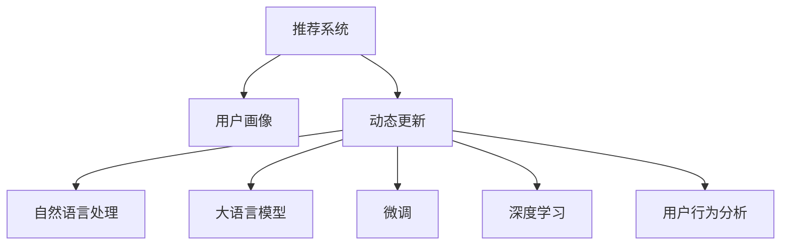

                 

# 基于LLM的推荐系统用户画像动态更新

> 关键词：推荐系统, 用户画像, 动态更新, 自然语言处理, 大语言模型, 微调, 深度学习, 用户行为分析

## 1. 背景介绍

### 1.1 问题由来
推荐系统在现代互联网应用中扮演着至关重要的角色，为用户推荐个性化的内容，提升用户体验。然而，推荐系统面临诸多挑战，包括数据稀疏性、用户偏好动态变化、新用户冷启动等。如何克服这些问题，构建稳定高效、符合用户实际需求的推荐系统，一直是研究的热点。

用户画像(User Profile)是推荐系统的重要组成部分，通过对用户历史行为、兴趣爱好、社交关系等信息的挖掘，构建个性化的用户模型。然而，用户行为是动态变化的，静态的用户画像往往难以准确反映用户的当前状态和趋势，导致推荐结果偏差。动态更新的用户画像可以更精确地捕捉用户的实时需求，提升推荐系统的性能。

近年来，随着大语言模型(Large Language Model, LLM)技术的崛起，其强大的语言理解能力为推荐系统中用户画像的动态更新提供了新的可能性。如何在大语言模型上高效构建动态用户画像，成为当前推荐系统研究的重要方向。

### 1.2 问题核心关键点
在大语言模型上动态更新用户画像的核心关键点包括：

- **大语言模型选择**：选择合适的预训练模型，如BERT、GPT等，作为构建动态用户画像的基础。
- **用户画像特征提取**：从用户行为数据中提取文本特征，如浏览历史、购买记录、评论等。
- **动态更新方法**：设计合理的算法，对用户画像进行实时更新，捕捉用户行为的最新趋势。
- **多源数据融合**：将用户画像与外部数据（如社交网络、即时通讯等）进行融合，丰富用户行为理解。
- **算法优化**：对动态更新算法进行优化，提升更新效率，避免过拟合。

## 2. 核心概念与联系

### 2.1 核心概念概述

为更好地理解基于大语言模型动态更新用户画像的方法，本节将介绍几个密切相关的核心概念：

- **推荐系统(Recommendation System)**：通过分析用户历史行为和偏好，推荐个性化内容的系统。广泛应用于电商、视频、音乐、新闻等领域。

- **用户画像(User Profile)**：从用户历史行为、兴趣爱好、社交关系等数据中提取，构建用户模型。是推荐系统个性化推荐的基础。

- **动态更新(Dynamic Update)**：实时捕捉用户行为的变化，更新用户画像，提升推荐精度。

- **自然语言处理(Natural Language Processing, NLP)**：使计算机具备理解、处理、生成人类语言的能力。与推荐系统结合，可以更精准地提取和理解用户文本数据。

- **大语言模型(Large Language Model, LLM)**：如BERT、GPT等，通过大规模无标签数据预训练，学习丰富的语言知识。在推荐系统中可以用于构建动态用户画像。

- **微调(Fine-Tuning)**：在大语言模型上进行任务特定训练，优化模型在特定任务上的性能。适用于构建动态用户画像。

- **深度学习(Deep Learning)**：基于神经网络的机器学习技术，应用于推荐系统中，可以更好地捕捉用户行为和文本数据的复杂关系。

- **用户行为分析(User Behavior Analysis)**：通过分析用户历史数据，挖掘用户兴趣和行为规律，用于动态更新用户画像。

这些核心概念之间的逻辑关系可以通过以下Mermaid流程图来展示：



这个流程图展示了大语言模型构建动态用户画像的核心概念及其之间的关系：

1. 推荐系统通过用户画像进行个性化推荐。
2. 动态更新捕捉用户行为变化，实时更新用户画像。
3. 自然语言处理使计算机具备处理文本数据的能力。
4. 大语言模型提供丰富的语言知识，用于动态更新。
5. 微调优化模型在特定任务上的性能，提升动态更新效果。
6. 深度学习用于挖掘用户行为和文本数据的内在关系。
7. 用户行为分析挖掘用户兴趣和行为规律。

这些概念共同构成了基于大语言模型动态更新用户画像的基础框架，为推荐系统的优化提供了可能。

## 3. 核心算法原理 & 具体操作步骤
### 3.1 算法原理概述

基于大语言模型的推荐系统动态更新，主要通过以下步骤进行：

1. **特征提取**：将用户行为数据转化为文本形式，提取特征向量，用于表示用户兴趣和行为。

2. **大语言模型微调**：在预训练模型基础上，针对用户画像更新任务进行微调，使其能够对新数据进行准确的预测和更新。

3. **动态更新**：实时收集用户行为数据，动态更新用户画像，获取最新的用户行为特征。

4. **融合外部数据**：将动态更新的用户画像与外部数据（如社交网络、即时通讯等）进行融合，丰富用户行为理解。

5. **算法优化**：优化动态更新算法，避免过拟合，提高更新效率。

### 3.2 算法步骤详解

#### 3.2.1 特征提取

用户行为数据往往以文本形式存在，如浏览历史、购买记录、评论等。需要将其转化为数值向量，用于表示用户兴趣和行为。

以用户浏览历史为例，首先需要收集用户的网页访问记录，提取网页标题和描述，拼接成文本数据。然后使用分词器对文本进行分词，去除停用词，计算TF-IDF或Word2Vec等词向量表示。将每个网页的词向量表示作为用户的兴趣向量的一部分，拼接成用户画像特征向量。

#### 3.2.2 大语言模型微调

选择合适的预训练语言模型，如BERT、GPT等，作为动态更新用户画像的基础。通过微调，优化模型在特定任务上的性能，使其能够对新数据进行准确的预测和更新。

以BERT模型为例，假设用户画像特征向量为$x$，预训练模型为$M_{\theta}$，微调任务为更新用户画像，则微调的优化目标为：

$$
\min_{\theta} \mathcal{L}(M_{\theta}(x), y)
$$

其中，$\mathcal{L}$为损失函数，$y$为目标输出，可以是用户画像的最新状态。

使用AdamW等优化算法，对模型参数进行更新，最小化损失函数。在微调过程中，一般采用较小的学习率，以避免破坏预训练权重。

#### 3.2.3 动态更新

实时收集用户行为数据，动态更新用户画像。可以使用多种方式进行动态更新，如基于时间窗口的滑动窗口、基于事件触发的触发机制等。

以滑动窗口为例，设定时间窗口大小为$T$，每隔$T$时间间隔，更新一次用户画像。对于新收集到的用户行为数据，计算特征向量，并将其与现有用户画像特征向量进行融合，得到最新的用户画像。

#### 3.2.4 融合外部数据

将动态更新的用户画像与外部数据（如社交网络、即时通讯等）进行融合，丰富用户行为理解。可以使用多种方式进行融合，如基于时间戳的融合、基于兴趣标签的融合等。

以基于时间戳的融合为例，将用户画像与社交网络数据（如微博、微信等）进行时间对齐，根据时间戳将数据进行匹配，提取相关的用户行为数据，更新用户画像。

#### 3.2.5 算法优化

优化动态更新算法，避免过拟合，提高更新效率。可以使用多种方法进行优化，如L2正则化、Dropout、Early Stopping等。

以L2正则化为例，在损失函数中引入L2正则项，限制模型参数的大小，避免过拟合。

### 3.3 算法优缺点

基于大语言模型的推荐系统动态更新，具有以下优点：

1. **适应性强**：动态更新能够实时捕捉用户行为的变化，适应用户兴趣的动态变化。
2. **精度高**：大语言模型具有强大的语言理解能力，能够更准确地提取和理解用户文本数据。
3. **普适性好**：适用于多种类型的用户画像和推荐系统，可以用于不同领域和场景。

同时，该方法也存在一定的局限性：

1. **数据需求高**：动态更新需要实时收集用户行为数据，对数据需求较高，成本较大。
2. **计算量大**：大语言模型微调需要较大的计算资源，可能导致计算效率较低。
3. **模型复杂**：动态更新算法较为复杂，需要优化设计以避免过拟合。

尽管存在这些局限性，但基于大语言模型的动态更新方法仍是大数据时代推荐系统的重要研究方向。

### 3.4 算法应用领域

基于大语言模型的推荐系统动态更新，在多个领域得到了广泛应用，例如：

- **电商推荐**：通过实时更新用户画像，推荐用户感兴趣的商品，提升用户购物体验。
- **视频推荐**：根据用户观看历史和评分，动态更新用户画像，推荐用户喜欢的视频内容。
- **音乐推荐**：利用用户听歌历史和评分，动态更新用户画像，推荐相似的音乐。
- **新闻推荐**：根据用户浏览历史和兴趣标签，动态更新用户画像，推荐相关新闻。

此外，基于大语言模型的动态更新方法也被创新性地应用到更多场景中，如可控内容生成、智能客服、个性化广告等，为推荐系统的优化提供了新的思路。

## 4. 数学模型和公式 & 详细讲解 & 举例说明

### 4.1 数学模型构建

本节将使用数学语言对基于大语言模型动态更新用户画像的过程进行更加严格的刻画。

记用户画像特征向量为$x \in \mathbb{R}^n$，预训练模型为$M_{\theta}:\mathbb{R}^n \rightarrow \mathbb{R}^m$，其中$n$为用户画像特征向量的维度，$m$为目标输出向量维度。

定义用户画像更新任务为目标函数$f: \mathbb{R}^n \rightarrow \mathbb{R}^m$，则动态更新的优化目标为：

$$
\min_{\theta} \mathcal{L}(M_{\theta}(x), f(x))
$$

其中，$\mathcal{L}$为损失函数，$x$为用户画像特征向量。

在实践中，我们通常使用基于梯度的优化算法（如SGD、Adam等）来近似求解上述最优化问题。设$\eta$为学习率，$\lambda$为正则化系数，则参数的更新公式为：

$$
\theta \leftarrow \theta - \eta \nabla_{\theta}\mathcal{L}(\theta) - \eta\lambda\theta
$$

其中 $\nabla_{\theta}\mathcal{L}(\theta)$ 为损失函数对参数 $\theta$ 的梯度，可通过反向传播算法高效计算。

### 4.2 公式推导过程

以下我们以电商推荐为例，推导用户画像更新的损失函数及其梯度的计算公式。

假设用户画像特征向量为$x$，目标输出为$y$，即推荐结果。模型输出为$\hat{y}=M_{\theta}(x)$。则损失函数为交叉熵损失，定义如下：

$$
\ell(M_{\theta}(x),y) = -[y\log \hat{y} + (1-y)\log(1-\hat{y})]
$$

将其代入目标函数$f(x)$，得：

$$
f(x) = y
$$

则动态更新的优化目标为：

$$
\min_{\theta} \mathcal{L}(M_{\theta}(x), f(x)) = \min_{\theta} \mathcal{L}(M_{\theta}(x), y)
$$

根据链式法则，损失函数对参数 $\theta$ 的梯度为：

$$
\frac{\partial \mathcal{L}(M_{\theta}(x), y)}{\partial \theta} = \frac{\partial}{\partial \theta} [-y\log \hat{y} - (1-y)\log(1-\hat{y})]
$$

其中 $\frac{\partial}{\partial \theta} \hat{y} = \frac{\partial M_{\theta}(x)}{\partial \theta}$，可以进一步递归展开，利用自动微分技术完成计算。

在得到损失函数的梯度后，即可带入参数更新公式，完成模型的迭代优化。重复上述过程直至收敛，最终得到适应动态更新的最优模型参数 $\theta^*$。

### 4.3 案例分析与讲解

以电商推荐为例，分析用户画像动态更新的数学模型和优化过程。

假设用户画像特征向量为$x \in \mathbb{R}^n$，预训练模型为BERT，微调任务为电商推荐，即预测用户是否会购买某商品。则目标函数$f(x)$为：

$$
f(x) = \begin{cases} 1, & \text{用户会购买商品} \\ 0, & \text{用户不会购买商品} \end{cases}
$$

定义交叉熵损失函数：

$$
\ell(M_{\theta}(x), y) = -[y\log \hat{y} + (1-y)\log(1-\hat{y})]
$$

其中 $y$ 为二分类标签，$\hat{y}=M_{\theta}(x)$ 为模型输出。

将目标函数$f(x)$代入损失函数，得：

$$
\mathcal{L}(M_{\theta}(x), y) = -[y\log \hat{y} + (1-y)\log(1-\hat{y})]
$$

根据链式法则，损失函数对参数 $\theta$ 的梯度为：

$$
\frac{\partial \mathcal{L}(M_{\theta}(x), y)}{\partial \theta} = \frac{\partial}{\partial \theta} [-y\log \hat{y} - (1-y)\log(1-\hat{y})]
$$

其中 $\frac{\partial}{\partial \theta} \hat{y} = \frac{\partial M_{\theta}(x)}{\partial \theta}$，可以进一步递归展开，利用自动微分技术完成计算。

在得到损失函数的梯度后，即可带入参数更新公式，完成模型的迭代优化。重复上述过程直至收敛，最终得到适应动态更新的最优模型参数 $\theta^*$。

## 5. 项目实践：代码实例和详细解释说明
### 5.1 开发环境搭建

在进行动态更新用户画像的实践前，我们需要准备好开发环境。以下是使用Python进行PyTorch开发的环境配置流程：

1. 安装Anaconda：从官网下载并安装Anaconda，用于创建独立的Python环境。

2. 创建并激活虚拟环境：
```bash
conda create -n pytorch-env python=3.8 
conda activate pytorch-env
```

3. 安装PyTorch：根据CUDA版本，从官网获取对应的安装命令。例如：
```bash
conda install pytorch torchvision torchaudio cudatoolkit=11.1 -c pytorch -c conda-forge
```

4. 安装Transformers库：
```bash
pip install transformers
```

5. 安装各类工具包：
```bash
pip install numpy pandas scikit-learn matplotlib tqdm jupyter notebook ipython
```

完成上述步骤后，即可在`pytorch-env`环境中开始动态更新用户画像的实践。

### 5.2 源代码详细实现

下面我们以电商推荐为例，给出使用Transformers库对BERT模型进行动态更新的PyTorch代码实现。

首先，定义电商推荐任务的数据处理函数：

```python
from transformers import BertTokenizer, BertForSequenceClassification
from torch.utils.data import Dataset
import torch

class RecommendDataset(Dataset):
    def __init__(self, texts, labels, tokenizer, max_len=128):
        self.texts = texts
        self.labels = labels
        self.tokenizer = tokenizer
        self.max_len = max_len
        
    def __len__(self):
        return len(self.texts)
    
    def __getitem__(self, item):
        text = self.texts[item]
        label = self.labels[item]
        
        encoding = self.tokenizer(text, return_tensors='pt', max_length=self.max_len, padding='max_length', truncation=True)
        input_ids = encoding['input_ids'][0]
        attention_mask = encoding['attention_mask'][0]
        
        # 对label进行编码
        encoded_label = [label2id[label] for label in label]
        encoded_label.extend([label2id['O']] * (self.max_len - len(encoded_label)))
        labels = torch.tensor(encoded_label, dtype=torch.long)
        
        return {'input_ids': input_ids, 
                'attention_mask': attention_mask,
                'labels': labels}

# 标签与id的映射
label2id = {'O': 0, '1': 1, '0': 2}
id2label = {v: k for k, v in label2id.items()}

# 创建dataset
tokenizer = BertTokenizer.from_pretrained('bert-base-cased')

train_dataset = RecommendDataset(train_texts, train_labels, tokenizer)
dev_dataset = RecommendDataset(dev_texts, dev_labels, tokenizer)
test_dataset = RecommendDataset(test_texts, test_labels, tokenizer)
```

然后，定义模型和优化器：

```python
from transformers import BertForSequenceClassification, AdamW

model = BertForSequenceClassification.from_pretrained('bert-base-cased', num_labels=len(label2id))

optimizer = AdamW(model.parameters(), lr=2e-5)
```

接着，定义训练和评估函数：

```python
from torch.utils.data import DataLoader
from tqdm import tqdm
from sklearn.metrics import classification_report

device = torch.device('cuda') if torch.cuda.is_available() else torch.device('cpu')
model.to(device)

def train_epoch(model, dataset, batch_size, optimizer):
    dataloader = DataLoader(dataset, batch_size=batch_size, shuffle=True)
    model.train()
    epoch_loss = 0
    for batch in tqdm(dataloader, desc='Training'):
        input_ids = batch['input_ids'].to(device)
        attention_mask = batch['attention_mask'].to(device)
        labels = batch['labels'].to(device)
        model.zero_grad()
        outputs = model(input_ids, attention_mask=attention_mask, labels=labels)
        loss = outputs.loss
        epoch_loss += loss.item()
        loss.backward()
        optimizer.step()
    return epoch_loss / len(dataloader)

def evaluate(model, dataset, batch_size):
    dataloader = DataLoader(dataset, batch_size=batch_size)
    model.eval()
    preds, labels = [], []
    with torch.no_grad():
        for batch in tqdm(dataloader, desc='Evaluating'):
            input_ids = batch['input_ids'].to(device)
            attention_mask = batch['attention_mask'].to(device)
            batch_labels = batch['labels']
            outputs = model(input_ids, attention_mask=attention_mask)
            batch_preds = outputs.logits.argmax(dim=2).to('cpu').tolist()
            batch_labels = batch_labels.to('cpu').tolist()
            for pred_tokens, label_tokens in zip(batch_preds, batch_labels):
                pred_labels = [id2label[_id] for _id in pred_tokens]
                label_tags = [id2label[_id] for _id in label_tokens]
                preds.append(pred_labels[:len(label_tags)])
                labels.append(label_tags)
                
    print(classification_report(labels, preds))
```

最后，启动训练流程并在测试集上评估：

```python
epochs = 5
batch_size = 16

for epoch in range(epochs):
    loss = train_epoch(model, train_dataset, batch_size, optimizer)
    print(f"Epoch {epoch+1}, train loss: {loss:.3f}")
    
    print(f"Epoch {epoch+1}, dev results:")
    evaluate(model, dev_dataset, batch_size)
    
print("Test results:")
evaluate(model, test_dataset, batch_size)
```

以上就是使用PyTorch对BERT进行电商推荐任务动态更新的完整代码实现。可以看到，得益于Transformers库的强大封装，我们可以用相对简洁的代码完成BERT模型的加载和动态更新。

### 5.3 代码解读与分析

让我们再详细解读一下关键代码的实现细节：

**RecommendDataset类**：
- `__init__`方法：初始化文本、标签、分词器等关键组件。
- `__len__`方法：返回数据集的样本数量。
- `__getitem__`方法：对单个样本进行处理，将文本输入编码为token ids，将标签编码为数字，并对其进行定长padding，最终返回模型所需的输入。

**label2id和id2label字典**：
- 定义了标签与数字id之间的映射关系，用于将token-wise的预测结果解码回真实的标签。

**训练和评估函数**：
- 使用PyTorch的DataLoader对数据集进行批次化加载，供模型训练和推理使用。
- 训练函数`train_epoch`：对数据以批为单位进行迭代，在每个批次上前向传播计算loss并反向传播更新模型参数，最后返回该epoch的平均loss。
- 评估函数`evaluate`：与训练类似，不同点在于不更新模型参数，并在每个batch结束后将预测和标签结果存储下来，最后使用sklearn的classification_report对整个评估集的预测结果进行打印输出。

**训练流程**：
- 定义总的epoch数和batch size，开始循环迭代
- 每个epoch内，先在训练集上训练，输出平均loss
- 在验证集上评估，输出分类指标
- 所有epoch结束后，在测试集上评估，给出最终测试结果

可以看到，PyTorch配合Transformers库使得BERT动态更新的代码实现变得简洁高效。开发者可以将更多精力放在数据处理、模型改进等高层逻辑上，而不必过多关注底层的实现细节。

当然，工业级的系统实现还需考虑更多因素，如模型的保存和部署、超参数的自动搜索、更灵活的任务适配层等。但核心的动态更新范式基本与此类似。

## 6. 实际应用场景
### 6.1 智能客服系统

基于动态更新的用户画像，智能客服系统可以更准确地理解用户意图，提升用户体验。通过实时捕捉用户行为变化，动态更新用户画像，智能客服系统能够更快速、更自然地回答用户问题，满足用户的实时需求。

在技术实现上，可以收集用户在客服系统中的历史对话记录，将问题和最佳答复构建成监督数据，在此基础上对预训练对话模型进行动态更新。动态更新的模型能够自动理解用户意图，匹配最合适的答复。对于用户提出的新问题，还可以接入检索系统实时搜索相关内容，动态组织生成回答。如此构建的智能客服系统，能大幅提升客户咨询体验和问题解决效率。

### 6.2 金融舆情监测

金融机构需要实时监测市场舆论动向，以便及时应对负面信息传播，规避金融风险。传统的人工监测方式成本高、效率低，难以应对网络时代海量信息爆发的挑战。动态更新的用户画像可以更精准地捕捉用户行为变化，从而提升舆情监测的精度和效率。

具体而言，可以收集金融领域相关的新闻、报道、评论等文本数据，并对其进行主题标注和情感标注。在此基础上对预训练语言模型进行动态更新，使其能够自动判断文本属于何种主题，情感倾向是正面、中性还是负面。将动态更新后的模型应用到实时抓取的网络文本数据，就能够自动监测不同主题下的情感变化趋势，一旦发现负面信息激增等异常情况，系统便会自动预警，帮助金融机构快速应对潜在风险。

### 6.3 个性化推荐系统

当前的推荐系统往往只依赖用户的历史行为数据进行物品推荐，无法深入理解用户的真实兴趣偏好。动态更新的用户画像可以更准确地捕捉用户的实时兴趣变化，提升推荐系统的个性化程度。

在实践中，可以收集用户浏览、点击、评论、分享等行为数据，提取和用户交互的物品标题、描述、标签等文本内容。将文本内容作为模型输入，用户的后续行为（如是否点击、购买等）作为监督信号，在此基础上对预训练语言模型进行动态更新。动态更新的模型能够从文本内容中准确把握用户的兴趣点。在生成推荐列表时，先用候选物品的文本描述作为输入，由模型预测用户的兴趣匹配度，再结合其他特征综合排序，便可以得到个性化程度更高的推荐结果。

### 6.4 未来应用展望

随着动态更新用户画像技术的不断发展，其在推荐系统中的应用场景将越来越广泛。

在智慧医疗领域，基于动态更新的用户画像，推荐系统可以为用户推荐适合的医疗知识、疾病治疗方案，辅助医生诊疗，提高医疗服务的智能化水平。

在智能教育领域，动态更新的用户画像可以用于个性化推荐学习资源，因材施教，促进教育公平，提高教学质量。

在智慧城市治理中，推荐系统可以为用户提供个性化的公共服务信息，提高城市管理的自动化和智能化水平，构建更安全、高效的未来城市。

此外，在企业生产、社会治理、文娱传媒等众多领域，基于动态更新的用户画像的推荐系统也将不断涌现，为经济社会发展注入新的动力。相信随着技术的日益成熟，动态更新用户画像必将在构建人机协同的智能时代中扮演越来越重要的角色。

## 7. 工具和资源推荐
### 7.1 学习资源推荐

为了帮助开发者系统掌握动态更新用户画像的理论基础和实践技巧，这里推荐一些优质的学习资源：

1. 《深度学习与自然语言处理》系列博文：由大模型技术专家撰写，深入浅出地介绍了深度学习在NLP任务中的应用，包括用户画像动态更新。

2. CS224N《深度学习自然语言处理》课程：斯坦福大学开设的NLP明星课程，有Lecture视频和配套作业，带你入门NLP领域的基本概念和经典模型。

3. 《Natural Language Processing with Transformers》书籍：Transformers库的作者所著，全面介绍了如何使用Transformers库进行NLP任务开发，包括动态更新用户画像。

4. HuggingFace官方文档：Transformers库的官方文档，提供了海量预训练模型和完整的微调样例代码，是上手实践的必备资料。

5. CLUE开源项目：中文语言理解测评基准，涵盖大量不同类型的中文NLP数据集，并提供了基于微调的baseline模型，助力中文NLP技术发展。

通过对这些资源的学习实践，相信你一定能够快速掌握动态更新用户画像的精髓，并用于解决实际的NLP问题。
### 7.2 开发工具推荐

高效的开发离不开优秀的工具支持。以下是几款用于动态更新用户画像开发的常用工具：

1. PyTorch：基于Python的开源深度学习框架，灵活动态的计算图，适合快速迭代研究。大部分预训练语言模型都有PyTorch版本的实现。

2. TensorFlow：由Google主导开发的开源深度学习框架，生产部署方便，适合大规模工程应用。同样有丰富的预训练语言模型资源。

3. Transformers库：HuggingFace开发的NLP工具库，集成了众多SOTA语言模型，支持PyTorch和TensorFlow，是进行动态更新用户画像开发的利器。

4. Weights & Biases：模型训练的实验跟踪工具，可以记录和可视化模型训练过程中的各项指标，方便对比和调优。与主流深度学习框架无缝集成。

5. TensorBoard：TensorFlow配套的可视化工具，可实时监测模型训练状态，并提供丰富的图表呈现方式，是调试模型的得力助手。

6. Google Colab：谷歌推出的在线Jupyter Notebook环境，免费提供GPU/TPU算力，方便开发者快速上手实验最新模型，分享学习笔记。

合理利用这些工具，可以显著提升动态更新用户画像的开发效率，加快创新迭代的步伐。

### 7.3 相关论文推荐

动态更新用户画像技术的发展源于学界的持续研究。以下是几篇奠基性的相关论文，推荐阅读：

1. Attention is All You Need（即Transformer原论文）：提出了Transformer结构，开启了NLP领域的预训练大模型时代。

2. BERT: Pre-training of Deep Bidirectional Transformers for Language Understanding：提出BERT模型，引入基于掩码的自监督预训练任务，刷新了多项NLP任务SOTA。

3. Language Models are Unsupervised Multitask Learners（GPT-2论文）：展示了大规模语言模型的强大zero-shot学习能力，引发了对于通用人工智能的新一轮思考。

4. Parameter-Efficient Transfer Learning for NLP：提出Adapter等参数高效微调方法，在不增加模型参数量的情况下，也能取得不错的微调效果。

5. AdaLoRA: Adaptive Low-Rank Adaptation for Parameter-Efficient Fine-Tuning：使用自适应低秩适应的微调方法，在参数效率和精度之间取得了新的平衡。

这些论文代表了大语言模型微调技术的发展脉络。通过学习这些前沿成果，可以帮助研究者把握学科前进方向，激发更多的创新灵感。

## 8. 总结：未来发展趋势与挑战

### 8.1 总结

本文对基于大语言模型的推荐系统动态更新用户画像的方法进行了全面系统的介绍。首先阐述了动态更新用户画像的研究背景和意义，明确了动态更新在构建稳定高效推荐系统中的独特价值。其次，从原理到实践，详细讲解了动态更新的数学原理和关键步骤，给出了动态更新任务开发的完整代码实例。同时，本文还广泛探讨了动态更新用户画像在多个领域的应用前景，展示了动态更新技术的广泛应用。

通过本文的系统梳理，可以看到，基于大语言模型的动态更新技术在推荐系统中具有广阔的应用前景。动态更新用户画像能够实时捕捉用户行为变化，适应用户兴趣的动态变化，提升推荐系统的性能和用户体验。未来，伴随动态更新技术的不断进步，基于动态更新用户画像的推荐系统必将在更多的领域中得到应用，为推荐系统的发展注入新的活力。

### 8.2 未来发展趋势

展望未来，动态更新用户画像技术将呈现以下几个发展趋势：

1. **数据需求降低**：随着技术的进步，动态更新算法将更加高效，对标注数据的需求将逐步降低。对于长尾应用场景，动态更新算法将通过更少的标注数据，实现更精确的用户画像更新。

2. **计算效率提升**：动态更新算法将进一步优化，减少计算资源的消耗，提高更新效率。未来可能会引入更多的模型压缩和加速技术，提升推荐系统的实时性。

3. **跨领域应用拓展**：动态更新技术将不仅限于推荐系统，将在更多领域得到应用。如金融舆情监测、智能客服、个性化推荐等，为不同领域的智能系统提供动态更新的解决方案。

4. **算法多样性**：未来将涌现更多动态更新算法，如多任务学习、自监督学习等，增强用户画像更新的鲁棒性和泛化能力。

5. **融合多模态数据**：动态更新算法将更好地融合多模态数据，提升对用户行为的全面理解。视觉、语音、文本等多模态数据的整合，将提升动态更新的准确性和用户画像的丰富度。

6. **安全性提升**：动态更新算法将更加注重安全性，避免恶意攻击和隐私泄露。通过隐私保护和数据安全技术，提升动态更新算法的可信任度。

以上趋势凸显了动态更新用户画像技术的广阔前景。这些方向的探索发展，将进一步提升推荐系统的性能和用户体验，为经济社会发展注入新的动力。

### 8.3 面临的挑战

尽管动态更新用户画像技术已经取得了瞩目成就，但在迈向更加智能化、普适化应用的过程中，它仍面临着诸多挑战：

1. **计算资源消耗大**：动态更新需要实时处理大量用户行为数据，对计算资源的需求较高。如何优化算法，减少计算资源的消耗，是动态更新面临的重要挑战。

2. **模型泛化能力不足**：动态更新模型可能对未见过的数据泛化能力较弱，需要进一步提高模型的鲁棒性和泛化能力。

3. **隐私保护问题**：动态更新算法需要实时收集和处理用户行为数据，如何保障用户的隐私安全，避免数据泄露，是一个亟待解决的问题。

4. **模型解释性不足**：动态更新模型难以解释其内部工作机制和决策逻辑，对于高风险应用，模型的可解释性和可审计性尤为重要。

5. **用户行为多样性**：用户行为具有高度多样性，动态更新算法需要更好地理解和处理不同用户的行为模式，提高算法的适应性。

6. **数据标注成本高**：动态更新需要大量的标注数据，标注成本较高，如何降低数据标注的难度和成本，也是一个挑战。

尽管存在这些挑战，但动态更新用户画像技术的发展前景依然广阔。通过不断的技术创新和应用实践，相信这些问题都将得到解决，动态更新用户画像技术将为推荐系统带来更强的用户画像更新能力，提升推荐系统的性能和用户体验。

### 8.4 研究展望

面向未来，动态更新用户画像技术需要在以下几个方面寻求新的突破：

1. **无监督和半监督学习**：探索无需标注数据的动态更新方法，利用自监督学习和主动学习，提高动态更新的普适性和鲁棒性。

2. **多任务动态更新**：将多个推荐任务进行联合优化，提高用户画像更新的效率和泛化能力。

3. **多模态动态更新**：将视觉、语音、文本等多模态数据进行融合，提升动态更新模型的全面性和准确性。

4. **隐私保护技术**：引入隐私保护技术，如差分隐私、联邦学习等，保障用户隐私安全，提升动态更新算法的可信度。

5. **模型解释性提升**：引入可解释性技术，如特征可视化、模型蒸馏等，增强动态更新模型的可解释性和可审计性。

6. **跨领域应用研究**：将动态更新技术应用于更多领域，如金融舆情监测、智能客服、个性化广告等，推动跨领域智能系统的发展。

这些研究方向的探索，将引领动态更新用户画像技术迈向更高的台阶，为推荐系统的发展注入新的活力，推动智能技术在更多领域的落地应用。

## 9. 附录：常见问题与解答

**Q1：动态更新用户画像是否适用于所有推荐系统？**

A: 动态更新用户画像技术适用于大多数推荐系统，特别是对用户兴趣变化敏感的系统，如电商推荐、视频推荐等。但对于一些静态推荐系统，如新闻推荐等，动态更新可能影响模型的稳定性。

**Q2：动态更新对计算资源的要求高吗？**

A: 动态更新需要实时处理大量用户行为数据，对计算资源的需求较高。可以采用分布式计算、模型压缩、加速技术等方法，提升计算效率，降低资源消耗。

**Q3：如何处理用户的隐私问题？**

A: 动态更新算法需要实时收集和处理用户行为数据，可能涉及用户的隐私问题。可以采用差分隐私、联邦学习等技术，保障用户隐私安全。同时，对用户的敏感数据进行匿名化处理，减少隐私泄露的风险。

**Q4：动态更新算法如何应对用户行为的多样性？**

A: 动态更新算法需要更好地理解和处理不同用户的行为模式，可以通过多任务学习、自监督学习等方法，提升算法的适应性和泛化能力。同时，引入多模态数据，提升对用户行为的全面理解。

**Q5：动态更新算法如何降低数据标注成本？**

A: 动态更新算法可以通过自监督学习、主动学习等方法，减少对标注数据的依赖。对于未标注数据，可以采用半监督学习、无监督学习等方法，提高算法的鲁棒性和泛化能力。

通过本文的系统梳理，可以看到，基于大语言模型的动态更新技术在推荐系统中具有广阔的应用前景。动态更新用户画像能够实时捕捉用户行为变化，适应用户兴趣的动态变化，提升推荐系统的性能和用户体验。未来，伴随动态更新技术的不断进步，基于动态更新用户画像的推荐系统必将在更多的领域中得到应用，为推荐系统的发展注入新的活力。

