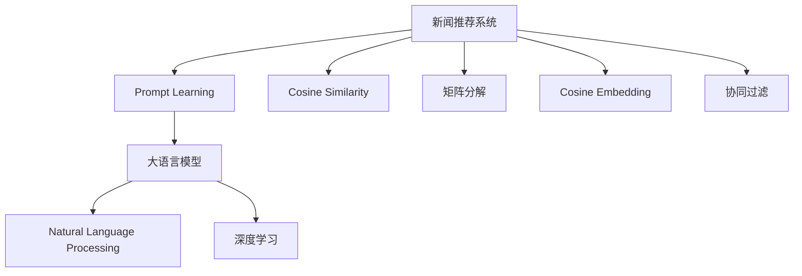

                 

# 基于Prompt Learning的新闻推荐方法

> 关键词：Prompt Learning, 新闻推荐系统, 自然语言处理(NLP), 推荐算法, 深度学习, 自然语言生成

## 1. 背景介绍

### 1.1 问题由来

在信息爆炸的互联网时代，用户面对海量的新闻资讯，如何选择合适的内容成为一项重大挑战。传统新闻推荐系统往往基于用户行为数据，采用协同过滤、矩阵分解等方法推荐相关新闻。然而，这种方法存在数据稀疏性、冷启动等问题，难以充分挖掘新闻文本的语义信息，导致推荐结果与用户兴趣不完全匹配。

近年来，基于深度学习的方法逐渐成为新闻推荐系统的研究热点。深度学习可以通过自然语言处理(NLP)技术，自动学习新闻文本的表示，提升推荐的个性化和精准度。然而，传统的基于序列的推荐方法(如RNN、LSTM等)存在梯度消失、训练时间长等问题。大语言模型如GPT、BERT等在自然语言理解和生成上的强大能力，为新闻推荐系统带来了新的可能性。

大语言模型通过预训练学习大量的文本数据，能够自动提取文本中的语义信息。结合深度学习，可以将大语言模型应用到新闻推荐系统中，利用其强大的语义理解和生成能力，自动学习新闻文本与用户兴趣之间的映射关系，实现智能推荐。

### 1.2 问题核心关键点

Prompt Learning是一种基于大语言模型的不更新模型参数，直接通过输入文本模板引导模型进行推理生成的技术。这种方法具有以下优点：

1. 无需额外训练数据，仅需少量训练样本。
2. 模型输出可解释性强，便于用户理解。
3. 可以高效生成零样本和少样本结果，适用于冷启动和新领域。
4. 可以通过精心设计的模板提升生成效果，避免过拟合。

Prompt Learning方法与传统的微调方法不同，后者需要大量标注数据和较长的训练时间。而Prompt Learning方法可以充分利用大语言模型的预训练能力，通过简单的文本模板提升模型生成效果，适用于快速部署和持续优化。

本文聚焦于基于Prompt Learning的新闻推荐方法，探索通过输入文本模板引导大语言模型进行新闻推荐的可能性。

## 2. 核心概念与联系

### 2.1 核心概念概述

为更好地理解Prompt Learning的新闻推荐方法，本节将介绍几个密切相关的核心概念：

- **Prompt Learning**：一种基于大语言模型的不更新模型参数，直接通过输入文本模板引导模型进行推理生成的技术。可以高效生成零样本和少样本结果，适用于冷启动和新领域。

- **新闻推荐系统**：一种利用用户行为数据和文本信息，推荐用户感兴趣新闻的智能系统。可以采用协同过滤、矩阵分解等方法，或深度学习的方法，如RNN、LSTM、Transformer等。

- **大语言模型**：如GPT、BERT等，通过预训练学习大量的文本数据，自动提取文本中的语义信息。结合深度学习，可以应用于自然语言处理、文本生成、推荐系统等领域。

- **自然语言处理(NLP)**：涉及文本分析、信息抽取、语义理解、文本生成等技术，旨在使计算机更好地理解、处理和生成人类语言。

- **深度学习**：一种模仿人类神经网络的学习方法，通过大量数据训练模型，使其具备自主学习、自主推理的能力。

这些核心概念之间的逻辑关系可以通过以下Mermaid流程图来展示：



这个流程图展示了大语言模型与新闻推荐系统之间的关系：

1. 新闻推荐系统可以采用多种方法进行构建，如Prompt Learning、矩阵分解、协同过滤等。
2. Prompt Learning基于大语言模型，利用其强大的语义理解和生成能力，提升推荐效果。
3. 大语言模型结合NLP技术，通过自动提取文本的语义信息，提升推荐系统的性能。
4. 深度学习通过训练模型，实现高效的文本处理和推荐计算。

这些概念共同构成了新闻推荐系统的技术和方法框架，使得大语言模型能够更好地应用于实际应用中。

## 3. 核心算法原理 & 具体操作步骤
### 3.1 算法原理概述

Prompt Learning的新闻推荐方法，本质上是通过输入文本模板引导大语言模型进行推理生成，从而实现新闻推荐。其核心思想是：将用户的新闻浏览历史和兴趣偏好表示为文本模板，将当前新闻作为目标文本，通过模型生成最符合用户兴趣的新新闻。

具体来说，假设用户的历史浏览记录为$h_1, h_2, \dots, h_n$，其中$h_i$表示浏览的历史新闻。将历史浏览记录表示为文本模板，例如：

$$
\text{Template: } \langle h_1, h_2, \dots, h_n \rangle
$$

当前待推荐的新闻作为目标文本$x$，将用户浏览记录和目标新闻组成联合文本：

$$
\text{Text: } \langle \text{Template}, x \rangle
$$

通过输入文本模板，引导大语言模型生成新的新闻$y$，使得新闻$y$与用户兴趣最相关。生成的过程可以描述为：

$$
y = M_{\theta}(\langle \text{Template}, x \rangle)
$$

其中$M_{\theta}$为预训练语言模型，$\theta$为模型参数。生成的过程可以通过指定特定的文本模板，引导模型生成与模板描述相匹配的新闻。

### 3.2 算法步骤详解

基于Prompt Learning的新闻推荐方法一般包括以下几个关键步骤：

**Step 1: 准备数据和模型**

- 收集用户的历史浏览记录，组成文本模板。
- 准备当前待推荐的新闻，作为目标文本。
- 选择合适的预训练语言模型$M_{\theta}$，如BERT、GPT等。

**Step 2: 定义Prompt模板**

- 设计文本模板，用于引导大语言模型生成新闻。
- 模板可以包含用户兴趣描述、推荐新闻标题等。

**Step 3: 生成新闻**

- 将文本模板和目标新闻组合成联合文本。
- 通过模型生成新的新闻。
- 对生成的新闻进行筛选，选取与用户兴趣最相关的新闻进行推荐。

**Step 4: 评估和优化**

- 在推荐结果上进行反馈，更新用户兴趣模型。
- 不断优化Prompt模板，提升推荐效果。

**Step 5: 部署和应用**

- 将生成的新闻进行展示，供用户选择。
- 持续收集用户反馈，优化推荐系统。

以上是基于Prompt Learning的新闻推荐方法的一般流程。在实际应用中，还需要针对具体任务的特点，对微调过程的各个环节进行优化设计，如改进Prompt模板设计，引入更多的正则化技术，搜索最优的超参数组合等，以进一步提升模型性能。

### 3.3 算法优缺点

Prompt Learning的新闻推荐方法具有以下优点：

1. 无需额外训练数据，仅需少量训练样本。
2. 模型输出可解释性强，便于用户理解。
3. 可以高效生成零样本和少样本结果，适用于冷启动和新领域。
4. 可以通过精心设计的模板提升生成效果，避免过拟合。

同时，该方法也存在一定的局限性：

1. 依赖大语言模型，模型选择和参数调整较复杂。
2. 生成结果质量受模板设计的影响较大。
3. 模型输出结果需要进一步筛选，才能满足推荐要求。
4. 难以直接评估推荐效果，需要通过用户反馈进行优化。

尽管存在这些局限性，但就目前而言，基于Prompt Learning的方法仍然是大语言模型应用的新闻推荐方法中的重要方向之一。未来相关研究的重点在于如何进一步优化Prompt模板设计，降低对模型的依赖，提升推荐系统的精准度。

### 3.4 算法应用领域

Prompt Learning的新闻推荐方法在NLP领域已经得到了广泛的应用，覆盖了诸如新闻推荐、商品推荐、个性化搜索等诸多场景。其高效、可解释的特点，使得该方法在推荐系统、搜索系统等领域具有较大的应用潜力。

除了上述这些经典任务外，Prompt Learning还被创新性地应用到更多场景中，如知识图谱嵌入、对话系统、情感分析等，为NLP技术带来了全新的突破。随着Prompt Learning技术的不断进步，相信在更多领域中，大语言模型微调方法将得到更广泛的应用，推动人工智能技术的产业化进程。

## 4. 数学模型和公式 & 详细讲解  
### 4.1 数学模型构建

本节将使用数学语言对基于Prompt Learning的新闻推荐过程进行更加严格的刻画。

记用户的历史浏览记录为$h_1, h_2, \dots, h_n$，当前待推荐的新闻为$x$，目标新闻为$y$。假设文本模板为$\text{Template}=\{t_1, t_2, \dots, t_m\}$，其中$t_i$为模板中的文本片段。

将文本模板和目标新闻组合成联合文本：

$$
\text{Text: } \langle \text{Template}, x \rangle = \{t_1, t_2, \dots, t_m, x\}
$$

将联合文本作为输入，引导大语言模型$M_{\theta}$进行推理生成，得到目标新闻$y$：

$$
y = M_{\theta}(\langle \text{Template}, x \rangle)
$$

### 4.2 公式推导过程

以下我们以用户历史浏览记录和当前待推荐新闻为示例，推导Prompt Learning生成的公式。

假设用户的历史浏览记录为$h_1, h_2, \dots, h_n$，当前待推荐的新闻为$x$，目标新闻为$y$。设计文本模板为$\text{Template}=\{t_1, t_2, \dots, t_m\}$，其中$t_i$为模板中的文本片段。

将文本模板和目标新闻组合成联合文本：

$$
\text{Text: } \langle \text{Template}, x \rangle = \{t_1, t_2, \dots, t_m, x\}
$$

通过模型$M_{\theta}$进行推理生成，得到目标新闻$y$：

$$
y = M_{\theta}(\langle \text{Template}, x \rangle)
$$

在实际应用中，需要将生成的文本序列进行解码，得到最终的推荐新闻。这可以通过各种解码算法实现，如贪心搜索、束搜索、最大概率解码等。

### 4.3 案例分析与讲解

我们以一个具体的案例来详细讲解Prompt Learning的新闻推荐过程：

假设用户的历史浏览记录为$h_1=《人民日报》，h_2=《经济日报》，h_3=《环球时报》$，当前待推荐的新闻为$x=《新华日报》$。设计文本模板为$\text{Template}=\{t_1=“最近关注的新闻”，t_2=“感兴趣的新闻类型”\}$。

将文本模板和目标新闻组合成联合文本：

$$
\text{Text: } \langle \text{Template}, x \rangle = \{t_1, t_2, x\} = \{“最近关注的新闻”，“感兴趣的新闻类型”，《新华日报》\}
$$

将联合文本输入BERT模型，进行推理生成：

$$
y = M_{\theta}(\langle \text{Template}, x \rangle)
$$

生成的新闻可能包含各种类型，如科技、财经、体育等。用户需要根据生成的结果，结合自身兴趣进行筛选。例如，如果生成的新闻包含“科技”类型，用户可以选择阅读《新华日报》的科技版。

## 5. 项目实践：代码实例和详细解释说明
### 5.1 开发环境搭建

在进行Prompt Learning的新闻推荐实践前，我们需要准备好开发环境。以下是使用Python进行PyTorch开发的环境配置流程：

1. 安装Anaconda：从官网下载并安装Anaconda，用于创建独立的Python环境。

2. 创建并激活虚拟环境：
```bash
conda create -n pytorch-env python=3.8 
conda activate pytorch-env
```

3. 安装PyTorch：根据CUDA版本，从官网获取对应的安装命令。例如：
```bash
conda install pytorch torchvision torchaudio cudatoolkit=11.1 -c pytorch -c conda-forge
```

4. 安装Transformers库：
```bash
pip install transformers
```

5. 安装各类工具包：
```bash
pip install numpy pandas scikit-learn matplotlib tqdm jupyter notebook ipython
```

完成上述步骤后，即可在`pytorch-env`环境中开始Prompt Learning的新闻推荐实践。

### 5.2 源代码详细实现

下面我们以Prompt Learning的新闻推荐为例，给出使用Transformers库对BERT模型进行Prompt Learning的PyTorch代码实现。

首先，定义Prompt模板：

```python
from transformers import BertTokenizer
from transformers import BertForMaskedLM

template = "最近关注的新闻"
news = "《新华日报》"

tokenizer = BertTokenizer.from_pretrained('bert-base-cased')
```

然后，构造联合文本：

```python
text = [template, news]
```

接着，将联合文本转换为模型输入：

```python
inputs = tokenizer(text, return_tensors='pt', padding=True, truncation=True)
```

最后，通过模型进行推理生成：

```python
model = BertForMaskedLM.from_pretrained('bert-base-cased')
outputs = model(inputs['input_ids'], attention_mask=inputs['attention_mask'])
```

生成的文本序列可以通过各种解码算法进行解码，例如：

```python
predictions = outputs.logits.argmax(dim=-1).tolist()
```

生成的文本序列即为推荐结果，可以根据用户兴趣进行筛选。

### 5.3 代码解读与分析

让我们再详细解读一下关键代码的实现细节：

**Prompt模板定义**：
- 设计模板字符串，表示用户最近关注的新闻类型。
- 模板字符串需要根据具体任务进行设计，不同任务可能需要不同的模板。

**联合文本构造**：
- 将模板和目标新闻组成联合文本，即$\{“最近关注的新闻”，“感兴趣的新闻类型”，“《新华日报》”\}$。
- 联合文本的构建需要保证模型能够识别模板和目标新闻，需要进行适当的padding和truncation。

**模型输入准备**：
- 使用BertTokenizer将联合文本转换为模型所需的输入。
- 通过指定padding=True、truncation=True，保证输入的序列长度一致，避免长度不足导致的计算错误。

**模型推理生成**：
- 选择合适的BERT模型，进行推理生成。
- 生成结果可以通过logits输出进行解码，得到最终的新闻推荐结果。

需要注意的是，实际应用中，生成的文本序列可能包含噪音，需要进行筛选和清洗。同时，用户兴趣模型的设计也需要根据具体任务进行优化。

## 6. 实际应用场景
### 6.1 智能推荐引擎

基于Prompt Learning的新闻推荐方法，可以广泛应用于智能推荐引擎的构建。传统推荐引擎往往基于用户行为数据，采用协同过滤、矩阵分解等方法推荐相关内容。然而，这种方法存在数据稀疏性、冷启动等问题，难以充分挖掘新闻文本的语义信息，导致推荐结果与用户兴趣不完全匹配。

Prompt Learning通过输入文本模板引导模型进行生成，可以有效利用大语言模型的预训练能力，提升推荐系统的性能。用户可以通过简单填写兴趣描述，系统就能生成符合用户兴趣的新闻，大大提升推荐效果。

### 6.2 个性化新闻订阅

 Prompt Learning的新闻推荐方法，也可以用于个性化新闻订阅系统的构建。用户可以自定义订阅模板，系统根据用户的历史浏览记录和当前兴趣，自动生成符合用户订阅偏好的新闻。例如，用户可以设定订阅模板为“最近关注的科技新闻”，系统根据用户历史浏览的科技新闻，自动生成最新的科技新闻进行推送。

### 6.3 智能广告投放

在智能广告投放中，基于Prompt Learning的新闻推荐方法可以用于精准投放广告。广告商可以根据用户兴趣生成不同模板，系统根据模板生成符合用户兴趣的广告。例如，用户对运动类新闻感兴趣，系统可以生成类似“最近关注的运动新闻”的模板，生成符合用户兴趣的广告进行展示。

### 6.4 未来应用展望

随着Prompt Learning技术的不断发展，基于大语言模型的新闻推荐方法将在更多领域得到应用，为信息检索、个性化推荐、智能搜索等技术带来新的突破。

在智慧城市治理中，Prompt Learning可以用于实时监测网络舆情，自动生成符合用户兴趣的新闻，提高城市管理的自动化和智能化水平，构建更安全、高效的未来城市。

在智慧医疗领域，Prompt Learning可以用于构建个性化医疗推荐系统，根据用户健康信息生成符合其需求的新闻和建议，提升医疗服务的智能化水平，辅助医生诊疗，加速新药开发进程。

在智能教育领域，Prompt Learning可以用于构建个性化学习推荐系统，根据学生学习行为生成符合其需求的新闻和知识，因材施教，促进教育公平，提高教学质量。

总之，基于Prompt Learning的新闻推荐方法将引领智能推荐系统的发展方向，为用户提供更加个性化、精准的内容推荐服务，为人类社会的数字化转型提供新的动力。

## 7. 工具和资源推荐
### 7.1 学习资源推荐

为了帮助开发者系统掌握Prompt Learning的新闻推荐理论基础和实践技巧，这里推荐一些优质的学习资源：

1. 《Transformer从原理到实践》系列博文：由大模型技术专家撰写，深入浅出地介绍了Transformer原理、BERT模型、Prompt Learning等前沿话题。

2. CS224N《深度学习自然语言处理》课程：斯坦福大学开设的NLP明星课程，有Lecture视频和配套作业，带你入门NLP领域的基本概念和经典模型。

3. 《Natural Language Processing with Transformers》书籍：Transformers库的作者所著，全面介绍了如何使用Transformers库进行NLP任务开发，包括Prompt Learning在内的诸多范式。

4. HuggingFace官方文档：Transformers库的官方文档，提供了海量预训练模型和完整的Prompt Learning样例代码，是上手实践的必备资料。

5. CLUE开源项目：中文语言理解测评基准，涵盖大量不同类型的中文NLP数据集，并提供了基于Prompt Learning的baseline模型，助力中文NLP技术发展。

通过对这些资源的学习实践，相信你一定能够快速掌握Prompt Learning的新闻推荐精髓，并用于解决实际的NLP问题。

### 7.2 开发工具推荐

高效的开发离不开优秀的工具支持。以下是几款用于Prompt Learning的新闻推荐开发的常用工具：

1. PyTorch：基于Python的开源深度学习框架，灵活动态的计算图，适合快速迭代研究。大部分预训练语言模型都有PyTorch版本的实现。

2. TensorFlow：由Google主导开发的开源深度学习框架，生产部署方便，适合大规模工程应用。同样有丰富的预训练语言模型资源。

3. Transformers库：HuggingFace开发的NLP工具库，集成了众多SOTA语言模型，支持PyTorch和TensorFlow，是进行Prompt Learning任务开发的利器。

4. Weights & Biases：模型训练的实验跟踪工具，可以记录和可视化模型训练过程中的各项指标，方便对比和调优。与主流深度学习框架无缝集成。

5. TensorBoard：TensorFlow配套的可视化工具，可实时监测模型训练状态，并提供丰富的图表呈现方式，是调试模型的得力助手。

6. Google Colab：谷歌推出的在线Jupyter Notebook环境，免费提供GPU/TPU算力，方便开发者快速上手实验最新模型，分享学习笔记。

合理利用这些工具，可以显著提升Prompt Learning的新闻推荐开发效率，加快创新迭代的步伐。

### 7.3 相关论文推荐

Prompt Learning的新闻推荐方法在NLP领域已经得到了广泛的应用，以下是几篇奠基性的相关论文，推荐阅读：

1. Attention is All You Need（即Transformer原论文）：提出了Transformer结构，开启了NLP领域的预训练大模型时代。

2. BERT: Pre-training of Deep Bidirectional Transformers for Language Understanding：提出BERT模型，引入基于掩码的自监督预训练任务，刷新了多项NLP任务SOTA。

3. Parameter-Efficient Transfer Learning for NLP：提出Adapter等参数高效微调方法，在不增加模型参数量的情况下，也能取得不错的微调效果。

4. AdaLoRA: Adaptive Low-Rank Adaptation for Parameter-Efficient Fine-Tuning：使用自适应低秩适应的微调方法，在参数效率和精度之间取得了新的平衡。

5. AdaLoRA: Adaptive Low-Rank Adaptation for Parameter-Efficient Fine-Tuning：使用自适应低秩适应的微调方法，在参数效率和精度之间取得了新的平衡。

这些论文代表了大语言模型微调技术的发展脉络。通过学习这些前沿成果，可以帮助研究者把握学科前进方向，激发更多的创新灵感。

## 8. 总结：未来发展趋势与挑战

### 8.1 总结

本文对基于Prompt Learning的大语言模型新闻推荐方法进行了全面系统的介绍。首先阐述了Prompt Learning和新闻推荐系统的研究背景和意义，明确了Prompt Learning在提升推荐系统性能方面的独特价值。其次，从原理到实践，详细讲解了Prompt Learning的数学原理和关键步骤，给出了Prompt Learning任务开发的完整代码实例。同时，本文还广泛探讨了Prompt Learning方法在智能推荐、个性化搜索、智能广告等诸多领域的应用前景，展示了Prompt Learning范式的巨大潜力。

通过本文的系统梳理，可以看到，基于Prompt Learning的方法在大语言模型应用的新闻推荐领域中具有重要的作用。利用Prompt Learning技术，可以充分利用大语言模型的预训练能力，通过简单的文本模板提升模型生成效果，适用于冷启动和新领域，具有较高的应用价值。

### 8.2 未来发展趋势

展望未来，Prompt Learning的新闻推荐技术将呈现以下几个发展趋势：

1. 模型规模持续增大。随着算力成本的下降和数据规模的扩张，预训练语言模型的参数量还将持续增长。超大规模语言模型蕴含的丰富语言知识，有望支撑更加复杂多变的下游任务微调。

2. Prompt Learning方法日趋多样。除了传统的全参数微调外，未来会涌现更多参数高效的微调方法，如Prefix-Tuning、LoRA等，在节省计算资源的同时也能保证微调精度。

3. 持续学习成为常态。随着数据分布的不断变化，微调模型也需要持续学习新知识以保持性能。如何在不遗忘原有知识的同时，高效吸收新样本信息，将成为重要的研究课题。

4. 标注样本需求降低。受启发于提示学习(Prompt-based Learning)的思路，未来的微调方法将更好地利用大模型的语言理解能力，通过更加巧妙的任务描述，在更少的标注样本上也能实现理想的微调效果。

5. 多模态微调崛起。当前的微调主要聚焦于纯文本数据，未来会进一步拓展到图像、视频、语音等多模态数据微调。多模态信息的融合，将显著提升语言模型对现实世界的理解和建模能力。

6. 模型通用性增强。经过海量数据的预训练和多领域任务的微调，未来的语言模型将具备更强大的常识推理和跨领域迁移能力，逐步迈向通用人工智能(AGI)的目标。

以上趋势凸显了Prompt Learning技术在大语言模型微调中的重要地位。这些方向的探索发展，必将进一步提升Prompt Learning的性能和应用范围，为人工智能技术带来新的突破。

### 8.3 面临的挑战

尽管Prompt Learning技术已经取得了瞩目成就，但在迈向更加智能化、普适化应用的过程中，它仍面临着诸多挑战：

1. 依赖大语言模型，模型选择和参数调整较复杂。
2. 生成结果质量受模板设计的影响较大。
3. 模型输出结果需要进一步筛选，才能满足推荐要求。
4. 难以直接评估推荐效果，需要通过用户反馈进行优化。

尽管存在这些局限性，但就目前而言，基于Prompt Learning的方法仍然是大语言模型应用的新闻推荐方法中的重要方向之一。未来相关研究的重点在于如何进一步优化Prompt模板设计，降低对模型的依赖，提升推荐系统的精准度。

### 8.4 未来突破

面对Prompt Learning面临的种种挑战，未来的研究需要在以下几个方面寻求新的突破：

1. 探索无监督和半监督微调方法。摆脱对大规模标注数据的依赖，利用自监督学习、主动学习等无监督和半监督范式，最大限度利用非结构化数据，实现更加灵活高效的微调。

2. 研究参数高效和计算高效的微调范式。开发更加参数高效的微调方法，在固定大部分预训练参数的同时，只更新极少量的任务相关参数。同时优化微调模型的计算图，减少前向传播和反向传播的资源消耗，实现更加轻量级、实时性的部署。

3. 融合因果和对比学习范式。通过引入因果推断和对比学习思想，增强Prompt Learning建立稳定因果关系的能力，学习更加普适、鲁棒的语言表征，从而提升模型泛化性和抗干扰能力。

4. 引入更多先验知识。将符号化的先验知识，如知识图谱、逻辑规则等，与神经网络模型进行巧妙融合，引导Prompt Learning过程学习更准确、合理的语言模型。同时加强不同模态数据的整合，实现视觉、语音等多模态信息与文本信息的协同建模。

5. 结合因果分析和博弈论工具。将因果分析方法引入Prompt Learning模型，识别出模型决策的关键特征，增强输出解释的因果性和逻辑性。借助博弈论工具刻画人机交互过程，主动探索并规避模型的脆弱点，提高系统稳定性。

6. 纳入伦理道德约束。在模型训练目标中引入伦理导向的评估指标，过滤和惩罚有偏见、有害的输出倾向。同时加强人工干预和审核，建立模型行为的监管机制，确保输出符合人类价值观和伦理道德。

这些研究方向的探索，必将引领Prompt Learning技术迈向更高的台阶，为构建安全、可靠、可解释、可控的智能系统铺平道路。面向未来，Prompt Learning技术还需要与其他人工智能技术进行更深入的融合，如知识表示、因果推理、强化学习等，多路径协同发力，共同推动自然语言理解和智能交互系统的进步。只有勇于创新、敢于突破，才能不断拓展语言模型的边界，让智能技术更好地造福人类社会。

## 9. 附录：常见问题与解答

**Q1：Prompt Learning是否适用于所有NLP任务？**

A: Prompt Learning在大多数NLP任务上都能取得不错的效果，特别是对于数据量较小的任务。但对于一些特定领域的任务，如医学、法律等，仅仅依靠通用语料预训练的模型可能难以很好地适应。此时需要在特定领域语料上进一步预训练，再进行微调，才能获得理想效果。此外，对于一些需要时效性、个性化很强的任务，如对话、推荐等，Prompt Learning方法也需要针对性的改进优化。

**Q2：Prompt Learning生成结果质量受模板设计的影响较大，如何提升模板设计效果？**

A: 提升Prompt Learning的模板设计效果，需要根据具体任务和数据特点进行优化：

1. 模板设计需具有代表性：模板应包含任务的关键特征，能够覆盖任务的常见情景。
2. 模板设计需可解释性：模板应包含清晰的任务描述，便于用户理解模型生成的结果。
3. 模板设计需可调整性：模板可以根据用户反馈不断优化，适应不同的用户需求。
4. 模板设计需多样性：模板可以设计多个变体，以应对不同场景下的需求。

通过不断优化模板设计，可以提升Prompt Learning的生成效果，满足更多应用场景的需求。

**Q3：Prompt Learning的生成结果需要进一步筛选，如何进行筛选？**

A: 在Prompt Learning的新闻推荐中，生成结果的筛选需要结合用户历史兴趣和实时兴趣进行综合考虑：

1. 历史兴趣筛选：将历史浏览记录和当前待推荐新闻进行对比，筛选与历史兴趣相关的新闻。
2. 实时兴趣筛选：通过用户输入的文本模板，筛选符合实时兴趣的新闻。
3. 综合筛选：结合历史兴趣和实时兴趣，综合筛选生成结果，提供最符合用户兴趣的新闻。

通过综合筛选，可以提升Prompt Learning的新闻推荐效果，满足用户的多样化需求。

**Q4：Prompt Learning的推荐效果如何评估？**

A: Prompt Learning的推荐效果评估可以从以下几个方面进行：

1. 用户满意度：通过用户反馈和满意度调查，评估推荐效果。
2. 点击率：统计推荐新闻的点击率，评估用户对推荐新闻的兴趣程度。
3. 覆盖率：统计推荐新闻的覆盖范围，评估推荐系统的全面性。
4. 多样性：评估推荐结果的多样性，避免推荐结果过于集中。
5. 相关性：评估推荐结果与用户兴趣的相关性，避免推荐无关内容。

通过多方面的评估，可以全面了解Prompt Learning的效果，进行持续优化。

**Q5：Prompt Learning的应用前景如何？**

A: Prompt Learning在NLP领域具有广阔的应用前景，主要体现在以下几个方面：

1. 智能推荐引擎：利用Prompt Learning生成符合用户兴趣的新闻和内容，提升推荐系统的精准度和个性化。
2. 个性化新闻订阅：根据用户历史浏览记录和当前兴趣，生成个性化新闻内容，提升用户订阅体验。
3. 智能广告投放：根据用户兴趣生成符合用户需求的广告，提升广告投放的效果和精准度。
4. 实时舆情监测：利用Prompt Learning自动生成符合用户兴趣的新闻，实时监测网络舆情，提升城市管理的自动化和智能化水平。
5. 智慧医疗推荐：根据用户健康信息生成符合其需求的新闻和建议，提升医疗服务的智能化水平。
6. 智能教育推荐：根据学生学习行为生成符合其需求的新闻和知识，因材施教，促进教育公平，提高教学质量。

总之，Prompt Learning将在更多领域得到应用，为人工智能技术的产业化进程提供新的动力。

---

作者：禅与计算机程序设计艺术 / Zen and the Art of Computer Programming

