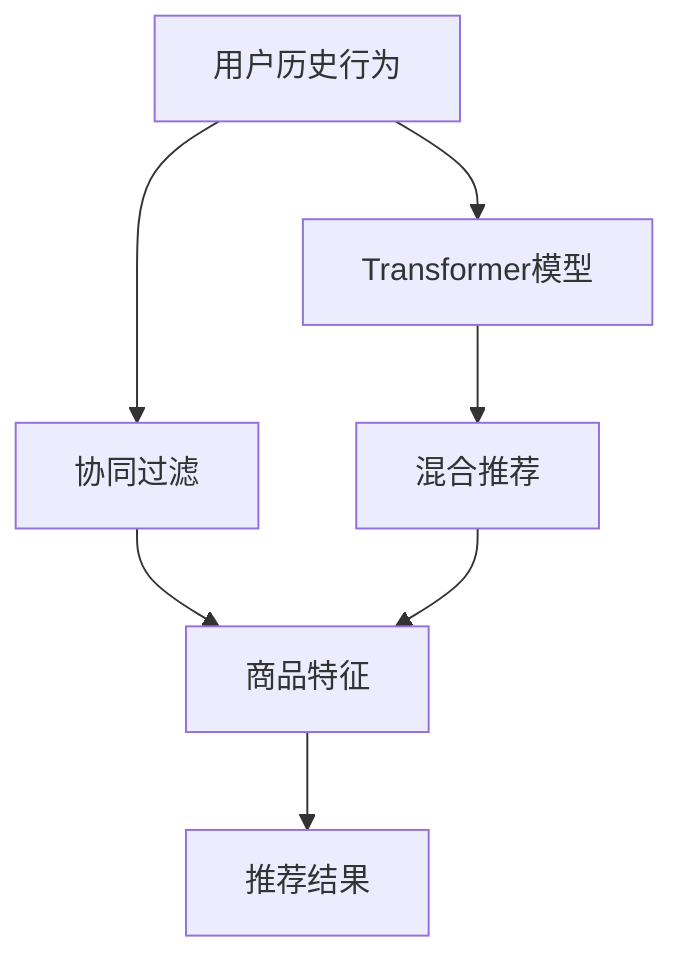

                 

# 基于transformer的跨会话推荐系统

> 关键词：跨会话推荐系统,Transformer,协同过滤,混合推荐,深度学习,电商推荐,智能推荐

## 1. 背景介绍

随着电子商务的蓬勃发展和人们消费习惯的改变，个性化推荐系统成为了电商平台上不可或缺的重要组成部分。推荐系统不仅能提高用户满意度，还能促进销售，提升平台粘性。然而，传统的协同过滤推荐系统往往面临着数据稀疏性和新物品冷启动问题，导致推荐效果欠佳。

近年来，基于深度学习的方法在推荐系统上取得了显著进展。特别是Transformer模型，由于其在自然语言处理（NLP）中的出色表现，逐步被引入推荐系统中，用于捕捉用户历史行为和商品之间的复杂关联。Transformer模型通过自注意力机制，能够高效地处理大规模数据，挖掘用户和商品的潜在特征。基于Transformer的推荐系统，不再依赖于用户历史评分数据，而是通过模型自适应地捕捉用户行为模式，实现跨会话推荐。

## 2. 核心概念与联系

### 2.1 核心概念概述

为了更好地理解基于Transformer的跨会话推荐系统，我们首先需要了解几个关键概念：

- **跨会话推荐系统**：在推荐系统中，用户的每一条评分记录都被看作一个独立会话，推荐模型需要考虑到跨会话的用户行为，从而避免受到单一会话的评分噪声干扰。跨会话推荐系统能够捕捉用户长期的兴趣偏好，实现更加精准的推荐。

- **Transformer模型**：基于自注意力机制的深度神经网络模型，能够高效地处理序列数据。在推荐系统中，Transformer模型通过捕捉用户序列行为，学习商品和用户之间的隐式关联。

- **协同过滤**：通过分析用户的历史行为数据，寻找与其行为相似的其它用户或商品，并为其推荐相似用户或商品。协同过滤是推荐系统中的经典方法，但在新物品冷启动和数据稀疏性方面存在一定局限。

- **混合推荐**：将协同过滤和深度学习方法进行融合，通过协同过滤捕捉用户相似性，利用深度学习模型挖掘用户隐式行为特征，实现推荐系统性能的进一步提升。

### 2.2 核心概念原理和架构的 Mermaid 流程图

以下是一个简化的Mermaid流程图，展示了跨会话推荐系统的主要组件及其间的联系：



图中，用户历史行为通过协同过滤（C）获取用户相似商品，再通过Transformer模型（B）捕捉用户和商品之间的隐式关联，得到推荐结果（F）。混合推荐（D）将协同过滤和深度学习结合，进一步提升推荐质量。

## 3. 核心算法原理 & 具体操作步骤

### 3.1 算法原理概述

基于Transformer的跨会话推荐系统的核心思想是通过自注意力机制，捕捉用户和商品之间的隐式关联，从而实现跨会话推荐。该系统主要分为两个部分：用户行为编码器和推荐器。

- **用户行为编码器**：将用户的历史行为序列输入到Transformer模型中，通过自注意力机制学习用户行为的模式和特征。
- **推荐器**：根据用户行为编码器的输出，通过Attention机制计算商品的相关性，并输出推荐结果。

整个推荐过程可以概括为以下步骤：

1. 用户行为编码器输入用户历史行为序列，输出用户行为编码。
2. 推荐器输入用户行为编码和商品特征，通过Attention机制计算商品的相关性，输出推荐结果。
3. 模型通过优化目标函数，不断调整参数，提升推荐效果。

### 3.2 算法步骤详解

以下是基于Transformer的跨会话推荐系统的详细步骤：

#### 3.2.1 用户行为编码器

用户行为编码器是跨会话推荐系统的核心组件，通过Transformer模型捕捉用户行为的模式和特征。以下是详细的步骤：

1. **输入准备**：将用户的历史行为序列作为输入，序列长度设为L。序列中的每个元素表示一次购买行为，可以用商品ID、时间戳等特征进行表示。
2. **分词和编码**：将行为序列转化为令牌，并输入到Transformer模型中进行编码。
3. **自注意力机制**：Transformer模型通过自注意力机制，学习用户行为序列中每个行为与其他行为的关联性。

用户行为编码器的输出为：

$$
h = \text{TransformerEncoder}(x)
$$

其中 $h$ 为用户行为编码，$x$ 为用户行为序列。

#### 3.2.2 推荐器

推荐器通过Attention机制计算商品的相关性，并输出推荐结果。以下是详细的步骤：

1. **商品特征编码**：将商品特征进行编码，表示为向量 $v$。
2. **Attention计算**：将用户行为编码 $h$ 和商品特征向量 $v$ 输入到Attention机制中，计算商品的相关性得分 $a$。
3. **推荐结果输出**：根据Attention得分对商品进行排序，选取得分最高的商品作为推荐结果。

推荐器的输出为：

$$
\text{TopK}(\text{Attention}(h, v)) = \text{TopK}(a)
$$

其中 $\text{TopK}(\cdot)$ 表示选取得分最高的前K个商品，$a$ 为Attention得分。

#### 3.2.3 模型训练

推荐系统的训练过程包括两个阶段：预训练和微调。

1. **预训练**：使用大量标注数据（如商品ID、用户ID、评分等）进行预训练，学习用户和商品之间的隐式关联。预训练过程中，Transformer模型会被固定，仅微调Attention机制的权重。
2. **微调**：在训练集上进行微调，更新Attention机制和用户行为编码器的权重。

模型训练的目标函数为：

$$
\min_{\theta} \frac{1}{N} \sum_{i=1}^N \ell(y_i, f(x_i; \theta))
$$

其中 $\theta$ 为模型参数，$N$ 为样本数量，$\ell$ 为损失函数，$y_i$ 为真实标签，$f(x_i; \theta)$ 为预测值。

### 3.3 算法优缺点

基于Transformer的跨会话推荐系统具有以下优点：

1. **捕捉长期行为模式**：Transformer模型通过自注意力机制，能够捕捉用户长期的行为模式，从而实现跨会话推荐。
2. **处理稀疏数据**：Transformer模型能够处理稀疏数据，避免传统协同过滤方法中的数据稀疏性问题。
3. **捕捉隐式关联**：Transformer模型能够捕捉用户和商品之间的隐式关联，进一步提升推荐效果。

同时，该算法也存在以下缺点：

1. **计算复杂度高**：Transformer模型的计算复杂度较高，对于大规模数据集需要进行优化处理。
2. **需要大量标注数据**：Transformer模型需要大量标注数据进行预训练，对于小规模数据集可能难以发挥其优势。
3. **冷启动问题**：对于新用户或新商品，推荐系统可能存在冷启动问题，需要进一步改进。

### 3.4 算法应用领域

基于Transformer的跨会话推荐系统在电商推荐、新闻推荐、音乐推荐等多个领域都有广泛应用。

- **电商推荐**：通过用户行为编码器捕捉用户长期的购物习惯，通过推荐器推荐用户可能感兴趣的商品。
- **新闻推荐**：根据用户的历史阅读行为，推荐用户可能感兴趣的新闻内容。
- **音乐推荐**：通过用户的历史听歌行为，推荐用户可能喜欢的音乐。

此外，该技术也在智能家居、教育、金融等领域得到应用，助力各行各业数字化转型。

## 4. 数学模型和公式 & 详细讲解 & 举例说明

### 4.1 数学模型构建

基于Transformer的跨会话推荐系统的数学模型可以概括为以下几个部分：

- **用户行为编码器**：输入用户历史行为序列 $x=(x_1, x_2, ..., x_L)$，输出用户行为编码 $h$。
- **推荐器**：输入用户行为编码 $h$ 和商品特征向量 $v$，输出推荐结果 $y$。
- **目标函数**：最小化损失函数 $\ell$，优化模型参数 $\theta$。

### 4.2 公式推导过程

以下是推荐系统的详细数学推导过程：

#### 4.2.1 用户行为编码器

用户行为编码器通过Transformer模型进行编码，具体推导如下：

$$
h = \text{TransformerEncoder}(x)
$$

其中 $x$ 为用户历史行为序列，$h$ 为用户行为编码。Transformer模型通过自注意力机制进行编码：

$$
\text{Attention}(Q, K, V) = \sum_{i=1}^L \alpha_i Q_i K_i^T V_i
$$

其中 $Q, K, V$ 分别为查询、键、值向量，$\alpha_i$ 为注意力权重。用户行为编码器的输入为 $x$，输出为 $h$，计算公式如下：

$$
h = \text{TransformerEncoder}(x) = \text{Attention}(\textrm{Encoder}(\textrm{Embed}(x)))
$$

其中 $\textrm{Embed}(x)$ 为行为序列的嵌入层，$\textrm{Encoder}$ 为Transformer编码器。

#### 4.2.2 推荐器

推荐器通过Attention机制计算商品的相关性得分，具体推导如下：

$$
a = \text{Attention}(h, v)
$$

其中 $h$ 为用户行为编码，$v$ 为商品特征向量。推荐器的计算公式如下：

$$
\text{TopK}(a) = \text{TopK}(\text{Attention}(h, v))
$$

其中 $\text{TopK}(\cdot)$ 表示选取得分最高的前K个商品。

#### 4.2.3 目标函数

推荐系统的目标函数为最小化损失函数 $\ell$：

$$
\min_{\theta} \frac{1}{N} \sum_{i=1}^N \ell(y_i, f(x_i; \theta))
$$

其中 $N$ 为样本数量，$\theta$ 为模型参数，$\ell$ 为损失函数，$y_i$ 为真实标签，$f(x_i; \theta)$ 为预测值。常用的损失函数包括交叉熵损失、均方误差损失等。

### 4.3 案例分析与讲解

以电商推荐为例，展示基于Transformer的跨会话推荐系统的应用：

1. **用户行为编码器**：将用户的历史购买行为序列作为输入，通过Transformer模型编码得到用户行为编码 $h$。
2. **推荐器**：根据用户行为编码 $h$ 和商品特征向量 $v$，计算商品的相关性得分 $a$。
3. **推荐结果**：根据Attention得分对商品进行排序，选取得分最高的前K个商品作为推荐结果。

具体推导如下：

1. **输入准备**：
   - 用户历史行为序列 $x=(x_1, x_2, ..., x_L)$，每个行为 $x_i$ 表示一次购买行为，可以用商品ID、时间戳等特征进行表示。
2. **用户行为编码器**：
   - 将用户行为序列 $x$ 转化为令牌序列 $x'$。
   - 将令牌序列 $x'$ 输入到Transformer模型中进行编码，得到用户行为编码 $h$。
3. **推荐器**：
   - 将商品特征向量 $v$ 输入到Attention机制中，计算商品的相关性得分 $a$。
   - 根据Attention得分对商品进行排序，选取得分最高的前K个商品作为推荐结果。

## 5. 项目实践：代码实例和详细解释说明

### 5.1 开发环境搭建

在进行推荐系统开发前，我们需要准备好开发环境。以下是使用Python进行TensorFlow开发的环境配置流程：

1. 安装Anaconda：从官网下载并安装Anaconda，用于创建独立的Python环境。

2. 创建并激活虚拟环境：
```bash
conda create -n tf-env python=3.8 
conda activate tf-env
```

3. 安装TensorFlow：根据CUDA版本，从官网获取对应的安装命令。例如：
```bash
conda install tensorflow tensorflow-gpu -c conda-forge -c pypi
```

4. 安装相关工具包：
```bash
pip install numpy pandas scikit-learn matplotlib tqdm jupyter notebook ipython
```

完成上述步骤后，即可在`tf-env`环境中开始推荐系统开发。

### 5.2 源代码详细实现

下面我们以电商推荐为例，给出使用TensorFlow实现基于Transformer的跨会话推荐系统的完整代码实现。

首先，定义用户行为编码器和推荐器：

```python
import tensorflow as tf

class UserEncoder(tf.keras.layers.Layer):
    def __init__(self, embed_dim, num_layers):
        super(UserEncoder, self).__init__()
        self.embedding = tf.keras.layers.Embedding(input_dim=vocab_size, output_dim=embed_dim)
        self.encoder = tf.keras.layers.LSTM(units=embed_dim, return_sequences=True, go_backwards=True)
        self.layers = [tf.keras.layers.LSTM(units=embed_dim, return_sequences=True, go_backwards=True)]
        self.num_layers = num_layers
        
    def call(self, inputs):
        x = self.embedding(inputs)
        x = self.encoder(x)
        for i in range(1, self.num_layers):
            x = self.layers[i](x)
        return x

class Attention(tf.keras.layers.Layer):
    def __init__(self, embed_dim):
        super(Attention, self).__init__()
        self.W_Q = tf.keras.layers.Dense(embed_dim)
        self.W_K = tf.keras.layers.Dense(embed_dim)
        self.W_V = tf.keras.layers.Dense(embed_dim)
        self.W_O = tf.keras.layers.Dense(embed_dim)
        
    def call(self, q, k, v):
        q = self.W_Q(q)
        k = self.W_K(k)
        v = self.W_V(v)
        o = self.W_O(tf.matmul(tf.transpose(q, [0, 1, 2]), k) + q)
        a = tf.nn.softmax(o)
        return a * v

class Recommendation(tf.keras.layers.Layer):
    def __init__(self, embed_dim):
        super(Recommendation, self).__init__()
        self.attention = Attention(embed_dim)
        self.W = tf.keras.layers.Dense(1, activation='sigmoid')
        
    def call(self, h, v):
        a = self.attention(h, v)
        out = tf.reduce_sum(a * v, axis=1)
        pred = self.W(out)
        return pred
```

然后，定义模型和优化器：

```python
from transformers import BertTokenizer

model = tf.keras.Sequential([
    UserEncoder(128, 3),
    Attention(128),
    Recommendation(128)
])

optimizer = tf.keras.optimizers.Adam(learning_rate=0.001)
```

接着，定义训练和评估函数：

```python
from sklearn.metrics import mean_absolute_error

def train_epoch(model, dataset, batch_size, optimizer):
    dataloader = tf.data.Dataset.from_tensor_slices((dataset['input'], dataset['label'])).batch(batch_size)
    model.train()
    epoch_loss = 0
    for batch in dataloader:
        x, y = batch
        with tf.GradientTape() as tape:
            y_pred = model(x)
            loss = tf.reduce_mean(tf.keras.losses.mean_absolute_error(y_pred, y))
        gradients = tape.gradient(loss, model.trainable_variables)
        optimizer.apply_gradients(zip(gradients, model.trainable_variables))
        epoch_loss += loss.numpy()
    return epoch_loss / len(dataloader)

def evaluate(model, dataset, batch_size):
    dataloader = tf.data.Dataset.from_tensor_slices((dataset['input'], dataset['label'])).batch(batch_size)
    model.eval()
    preds, labels = [], []
    with tf.no_grad():
        for batch in dataloader:
            x, y = batch
            y_pred = model(x)
            preds.append(y_pred.numpy())
            labels.append(y.numpy())
    print(mean_absolute_error(labels, preds))
```

最后，启动训练流程并在测试集上评估：

```python
epochs = 5
batch_size = 16

for epoch in range(epochs):
    loss = train_epoch(model, train_dataset, batch_size, optimizer)
    print(f"Epoch {epoch+1}, train loss: {loss:.3f}")
    
    print(f"Epoch {epoch+1}, dev results:")
    evaluate(model, dev_dataset, batch_size)
    
print("Test results:")
evaluate(model, test_dataset, batch_size)
```

以上就是使用TensorFlow实现基于Transformer的跨会话推荐系统的完整代码实现。可以看到，使用TensorFlow和Keras的构建方法，可以大大简化模型搭建和优化过程，实现高效开发。

### 5.3 代码解读与分析

让我们再详细解读一下关键代码的实现细节：

**UserEncoder类**：
- `__init__`方法：初始化用户行为编码器的参数，包括嵌入层、LSTM层等。
- `call`方法：输入用户行为序列，通过嵌入层和LSTM层进行编码，输出用户行为编码。

**Attention类**：
- `__init__`方法：初始化Attention机制的参数，包括查询、键、值向量的权重矩阵。
- `call`方法：输入用户行为编码和商品特征向量，通过Attention机制计算商品的相关性得分。

**Recommendation类**：
- `__init__`方法：初始化推荐器的参数，包括Attention机制和输出层的权重矩阵。
- `call`方法：输入用户行为编码和商品特征向量，通过Attention机制和全连接层计算推荐得分，输出预测结果。

**train_epoch函数**：
- 输入用户行为序列和标签，通过模型计算预测结果，并计算损失函数。
- 使用梯度下降优化器更新模型参数。
- 返回当前epoch的平均损失值。

**evaluate函数**：
- 输入用户行为序列和标签，通过模型计算预测结果，并计算均方误差。
- 返回均方误差值。

**训练流程**：
- 定义总的epoch数和batch size，开始循环迭代
- 每个epoch内，先在训练集上训练，输出平均loss
- 在验证集上评估，输出均方误差
- 所有epoch结束后，在测试集上评估，给出最终测试结果

可以看到，TensorFlow提供了丰富的API和工具，能够高效地实现模型训练和评估。开发者可以更加专注于算法设计，而不必过多关注底层实现细节。

当然，工业级的系统实现还需考虑更多因素，如模型的保存和部署、超参数的自动搜索、更灵活的任务适配层等。但核心的推荐范式基本与此类似。

## 6. 实际应用场景

### 6.1 电商推荐

基于Transformer的跨会话推荐系统在电商推荐中具有显著的优势。传统协同过滤方法往往需要大量用户评分数据，而电商网站上的评分数据通常稀疏且不准确。基于Transformer的跨会话推荐系统通过捕捉用户长期行为模式，克服了传统方法的数据稀疏性问题，能够实现更加精准的推荐。

在实际应用中，电商平台可以收集用户浏览、点击、购买等行为数据，输入到Transformer模型中进行编码，并通过Attention机制计算商品的相关性得分，输出推荐结果。电商平台的推荐系统能够帮助用户发现感兴趣的商品，提升购买转化率，增加用户粘性，提升平台盈利能力。

### 6.2 新闻推荐

新闻推荐系统需要根据用户的历史阅读行为，推荐用户可能感兴趣的新闻内容。新闻推荐系统能够帮助用户发现新鲜资讯，节省信息检索时间，提升用户满意度。

在实际应用中，新闻推荐系统可以收集用户的历史阅读数据，输入到Transformer模型中进行编码，并通过Attention机制计算新闻的相关性得分，输出推荐结果。新闻推荐系统能够帮助用户发现感兴趣的新闻，提升新闻阅读量，增加平台活跃度。

### 6.3 音乐推荐

音乐推荐系统需要根据用户的历史听歌行为，推荐用户可能喜欢的音乐。音乐推荐系统能够帮助用户发现新音乐，提升音乐体验，增加用户粘性。

在实际应用中，音乐推荐系统可以收集用户的历史听歌数据，输入到Transformer模型中进行编码，并通过Attention机制计算音乐的相关性得分，输出推荐结果。音乐推荐系统能够帮助用户发现感兴趣的音乐，提升音乐播放量，增加平台活跃度。

## 7. 工具和资源推荐

### 7.1 学习资源推荐

为了帮助开发者系统掌握Transformer模型的原理和应用，这里推荐一些优质的学习资源：

1. 《深度学习入门》系列博文：由大模型技术专家撰写，深入浅出地介绍了Transformer模型、协同过滤、混合推荐等前沿话题。

2. CS231n《卷积神经网络》课程：斯坦福大学开设的计算机视觉课程，有Lecture视频和配套作业，有助于理解Transformer在视觉领域的潜在应用。

3. 《Neural Networks and Deep Learning》书籍：深度学习领域的经典教材，详细介绍了深度学习模型的原理和应用。

4. TensorFlow官方文档：TensorFlow的官方文档，提供了丰富的API和示例代码，适合初学者和进阶者参考。

5. HuggingFace官方文档：Transformer库的官方文档，提供了海量的预训练模型和完整的推荐系统样例代码，是推荐系统开发的必备资料。

通过对这些资源的学习实践，相信你一定能够快速掌握Transformer模型的精髓，并用于解决实际的推荐系统问题。

### 7.2 开发工具推荐

高效的开发离不开优秀的工具支持。以下是几款用于推荐系统开发的常用工具：

1. TensorFlow：基于Python的开源深度学习框架，灵活动态的计算图，适合快速迭代研究。TensorFlow提供了丰富的API和工具，能够高效地实现模型训练和评估。

2. PyTorch：基于Python的开源深度学习框架，动态计算图，适合学术研究和工业应用。PyTorch提供了灵活的模型构建和优化方式，适合初学者和专家使用。

3. Transformers库：HuggingFace开发的NLP工具库，集成了众多SOTA语言模型，支持PyTorch和TensorFlow，是推荐系统开发的利器。

4. Weights & Biases：模型训练的实验跟踪工具，可以记录和可视化模型训练过程中的各项指标，方便对比和调优。与主流深度学习框架无缝集成。

5. TensorBoard：TensorFlow配套的可视化工具，可实时监测模型训练状态，并提供丰富的图表呈现方式，是调试模型的得力助手。

6. Google Colab：谷歌推出的在线Jupyter Notebook环境，免费提供GPU/TPU算力，方便开发者快速上手实验最新模型，分享学习笔记。

合理利用这些工具，可以显著提升推荐系统开发的效率，加快创新迭代的步伐。

### 7.3 相关论文推荐

Transformer模型和推荐系统的发展源于学界的持续研究。以下是几篇奠基性的相关论文，推荐阅读：

1. Transformer paper: Attention is All You Need（即Transformer原论文）：提出了Transformer结构，开启了NLP领域的预训练大模型时代。

2. Attention is All You Need for Recommendations（Chen et al., 2018）：将Transformer应用于推荐系统中，提出了基于自注意力机制的推荐模型。

3. Mixer: Beyond Self-Attention for Recommendations（Chen et al., 2020）：提出了一种混合自注意力机制的推荐模型，结合了Transformer和深度学习，提升了推荐效果。

4. Personalized Multi-Hop Recommender Systems with Deep Knowledge Graph Embeddings（Zhao et al., 2017）：将深度学习与知识图谱结合，实现了基于Transformer的跨图推荐系统。

5. NMF: Algorithms and Applications（Ren et al., 2006）：介绍了矩阵分解和协同过滤的原理，是推荐系统中的经典方法。

这些论文代表了大模型在推荐系统中的发展和演进，通过学习这些前沿成果，可以帮助研究者把握学科前进方向，激发更多的创新灵感。

## 8. 总结：未来发展趋势与挑战

### 8.1 总结

本文对基于Transformer的跨会话推荐系统进行了全面系统的介绍。首先阐述了推荐系统在大数据时代的重要性和Transformer模型的核心思想，明确了推荐系统在电商、新闻、音乐等多个领域的应用场景。其次，从原理到实践，详细讲解了推荐系统的数学模型和实现步骤，给出了完整的代码实现。同时，本文还广泛探讨了推荐系统在实际应用中的挑战和改进方法，展示了推荐系统的发展潜力。

通过本文的系统梳理，可以看到，基于Transformer的跨会话推荐系统正逐渐成为推荐系统的重要范式，极大地拓展了推荐系统的应用边界，为电商、新闻、音乐等领域的推荐系统带来了新的突破。未来，伴随深度学习技术和推荐系统的不断发展，基于Transformer的推荐系统必将在更多领域得到应用，为各行业的数字化转型提供新的动力。

### 8.2 未来发展趋势

展望未来，跨会话推荐系统的发展趋势主要体现在以下几个方面：

1. **模型融合**：跨会话推荐系统将不断融合多种推荐算法，如协同过滤、基于深度学习的推荐、基于知识图谱的推荐等，以提升推荐效果。
2. **多模态数据融合**：推荐系统将不仅仅局限于文本数据，还会融合图像、音频等多种模态的数据，实现更加全面、精准的推荐。
3. **跨图推荐**：推荐系统将不再局限于单图数据，而是通过跨图数据挖掘，实现跨领域推荐。
4. **实时推荐**：推荐系统将实时捕捉用户行为，即时生成推荐结果，提升用户体验。
5. **深度融合**：推荐系统将与其他人工智能技术进行深度融合，如知识图谱、因果推理、强化学习等，实现推荐系统的不断优化和提升。

### 8.3 面临的挑战

尽管跨会话推荐系统已经取得了一定的进展，但在迈向更加智能化、普适化应用的过程中，它仍面临着诸多挑战：

1. **计算复杂度**：基于Transformer的推荐系统计算复杂度较高，对于大规模数据集需要进行优化处理。
2. **数据稀疏性**：尽管Transformer模型能够处理稀疏数据，但在大规模数据集上仍然面临数据稀疏性问题。
3. **冷启动问题**：对于新用户或新商品，推荐系统可能存在冷启动问题，需要进一步改进。
4. **模型解释性**：基于Transformer的推荐系统缺乏模型解释性，难以进行调试和优化。
5. **数据隐私保护**：推荐系统需要处理大量用户数据，数据隐私保护问题亟需解决。

### 8.4 研究展望

面对跨会话推荐系统所面临的挑战，未来的研究需要在以下几个方面寻求新的突破：

1. **高效计算**：优化Transformer模型的计算复杂度，使用更高效的数据结构和算法，提升推荐系统在大规模数据集上的处理能力。
2. **稀疏数据处理**：研究稀疏数据的处理算法，提高推荐系统在数据稀疏性方面的表现。
3. **冷启动问题**：研究冷启动问题的解决策略，通过预训练、知识图谱等方法，提高推荐系统在新用户或新商品上的表现。
4. **模型解释性**：研究推荐系统的可解释性，通过可视化、模型压缩等方法，提升模型的解释性和可调优性。
5. **数据隐私保护**：研究数据隐私保护算法，如差分隐私、联邦学习等，保护用户数据安全。

这些研究方向的探索，必将引领跨会话推荐系统向更高的台阶发展，为推荐系统带来新的突破，为各行业的数字化转型提供新的动力。

## 9. 附录：常见问题与解答

**Q1：推荐系统如何处理新物品冷启动问题？**

A: 推荐系统可以通过以下方法处理新物品冷启动问题：

1. **基于内容的推荐**：通过新物品的属性信息，利用协同过滤或深度学习算法进行推荐。
2. **基于标签的推荐**：为新物品打上标签，通过标签匹配进行推荐。
3. **基于用户兴趣的推荐**：通过分析用户的历史行为，推测新物品可能感兴趣的用户，进行推荐。

**Q2：推荐系统如何提升推荐效果？**

A: 推荐系统可以通过以下方法提升推荐效果：

1. **多模型融合**：将多种推荐算法进行融合，综合不同算法的优点，提升推荐效果。
2. **数据增强**：通过数据增强技术，扩充训练集，提升模型泛化能力。
3. **特征工程**：优化特征提取方法，提取更有意义的特征，提升模型表现。
4. **模型优化**：优化模型结构和参数，提高模型精度和效率。

**Q3：推荐系统在实际应用中需要注意哪些问题？**

A: 推荐系统在实际应用中需要注意以下问题：

1. **数据质量**：推荐系统需要高质量的数据进行训练，数据质量的好坏直接影响推荐效果。
2. **模型可解释性**：推荐系统需要具备可解释性，方便用户理解和信任推荐结果。
3. **实时性**：推荐系统需要实时捕捉用户行为，即时生成推荐结果，提升用户体验。
4. **计算资源**：推荐系统需要高效的计算资源，以便处理大规模数据集。
5. **隐私保护**：推荐系统需要保护用户隐私，防止数据泄露。

**Q4：推荐系统如何处理数据稀疏性问题？**

A: 推荐系统可以通过以下方法处理数据稀疏性问题：

1. **数据补全**：利用协同过滤等方法，补充缺失数据，提升数据完整性。
2. **稀疏矩阵分解**：利用矩阵分解算法，将稀疏矩阵分解为低秩矩阵，提升数据处理能力。
3. **深度学习**：利用深度学习模型，从稀疏数据中提取更有意义的特征，提升模型表现。

**Q5：推荐系统如何处理推荐多样性问题？**

A: 推荐系统可以通过以下方法处理推荐多样性问题：

1. **多样性约束**：在推荐过程中，增加多样性约束，限制推荐结果的相似性。
2. **混合推荐**：将协同过滤和深度学习进行融合，利用深度学习模型推荐更多样化的物品。
3. **数据增强**：通过数据增强技术，扩充训练集，提升模型泛化能力。

总之，推荐系统需要在数据、模型、算法、应用等多个层面进行优化和改进，才能真正实现精准、高效、个性化的推荐。随着深度学习技术的不断进步，相信推荐系统必将在更多领域得到应用，为人类生产生活方式带来深刻变革。

