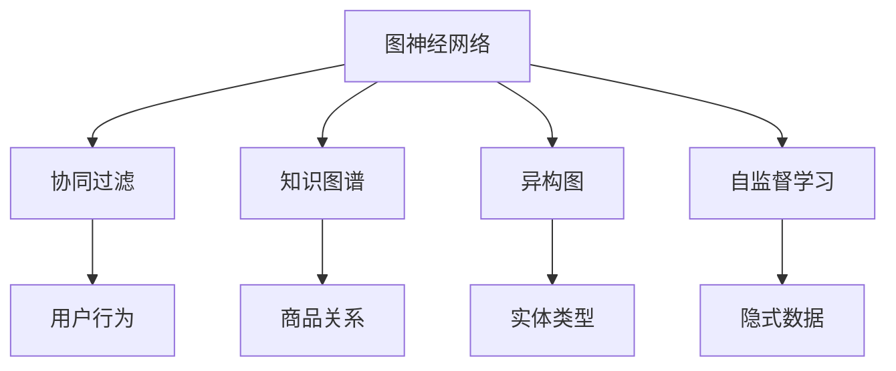

                 

# 基于图神经网络的商品关联推荐

> 关键词：商品推荐,图神经网络,协同过滤,知识图谱,邻域信息,异构图,自监督学习,端到端学习

## 1. 背景介绍

### 1.1 问题由来

随着互联网的蓬勃发展，电商平台的商品推荐系统（Recommendation System）已经成为了用户获取产品信息、提高购物体验的重要手段。传统的推荐系统以用户历史行为数据和物品特征为输入，采用协同过滤等算法进行推荐。然而，这种推荐方式存在着数据稀疏、冷启动问题、用户隐式行为难以捕捉等问题，无法满足用户的多样化需求。

为了克服这些问题，近年来，商品推荐系统逐渐引入了图神经网络（Graph Neural Network, GNN）。GNN能够有效利用物品之间的关联关系，从更丰富的图结构中挖掘隐藏的知识，从而提升推荐性能。图神经网络在商品推荐中的应用，已成为当前推荐系统研究的热点之一。

### 1.2 问题核心关键点

为了提升商品推荐的效果，我们需要解决以下核心问题：
1. 如何高效构建商品之间的关系图，捕捉物品之间的关联关系？
2. 如何在保留图结构信息的同时，快速进行图卷积计算？
3. 如何在用户历史行为数据和物品图谱信息上，进行端到端的学习，避免孤立地处理两种数据源？
4. 如何利用异构图和自监督学习方法，从无标注的隐式数据中挖掘关联信息？
5. 如何避免计算过载，实现高效、可扩展的推荐系统？

### 1.3 问题研究意义

在电商平台的商品推荐场景中，商品之间的关系是极为重要的隐式信息。如何高效地捕捉和利用这些关系，是大规模推荐系统亟需解决的问题。

基于图神经网络的商品推荐技术，能够有效利用商品之间的关联关系，提供更加个性化、多样化的推荐结果。通过构建商品关系图，并进行图卷积计算，系统能够从历史行为数据、商品特征等多维数据中提取关联信息，从而提升推荐性能。

此外，异构图和自监督学习方法，能够在不依赖于显式标注的情况下，进一步增强系统的泛化能力。端到端的学习范式，也有助于系统在统一的目标下处理用户历史数据和商品关系图，提升推荐的精准性和一致性。

## 2. 核心概念与联系

### 2.1 核心概念概述

为更好地理解基于图神经网络的商品推荐方法，本节将介绍几个密切相关的核心概念：

- 图神经网络（Graph Neural Network, GNN）：基于图结构的神经网络，通过在图上进行卷积、池化等操作，提取图结构中的知识。
- 协同过滤（Collaborative Filtering, CF）：推荐系统中的经典算法，通过分析用户和物品的相似度，进行推荐。
- 知识图谱（Knowledge Graph, KG）：用于描述实体间关系的图结构，如商品-商品关系、商品-属性关系等。
- 异构图（Heterogeneous Graph, HG）：不同类型节点和边的图，能够更准确地描述实体之间的关系。
- 自监督学习（Self-Supervised Learning）：利用未标注数据进行模型训练，学习数据中的隐含知识。

这些核心概念之间的逻辑关系可以通过以下Mermaid流程图来展示：



这个流程图展示了大语言模型的核心概念及其之间的关系：

1. 图神经网络通过卷积、池化等操作，学习图结构中的知识。
2. 协同过滤算法通过用户行为数据，进行相似度计算和推荐。
3. 知识图谱用于描述实体之间的关系，是图神经网络学习的重要数据源。
4. 异构图能够更准确地描述不同类型实体之间的关系，适用于复杂的商品推荐场景。
5. 自监督学习利用无标注数据，学习数据中的隐含知识，增强模型的泛化能力。

这些概念共同构成了商品推荐系统的知识图谱和计算图，使得商品推荐系统能够更全面地捕捉用户需求和物品特性，从而提升推荐效果。

## 3. 核心算法原理 & 具体操作步骤
### 3.1 算法原理概述

基于图神经网络的推荐方法，本质上是通过图卷积网络（Graph Convolutional Network, GCN）在商品关系图上进行信息传播，从而进行推荐。其核心思想是：通过在图上进行信息传播，捕捉用户历史行为数据和物品图谱信息中的关联关系，从而提升推荐性能。

形式化地，假设商品关系图 $G=(V,E)$，其中 $V$ 为节点集合，$E$ 为边集合。节点 $v_i$ 表示商品，边 $e_{ij}$ 表示商品 $v_i$ 和 $v_j$ 之间的关系。图卷积网络通过在图上进行卷积操作，学习节点 $v_i$ 的表示 $h_i$，并最终输出推荐结果 $r_i$。

具体而言，图卷积网络定义如下：

$$
h_i^{(l+1)} = \sigma\left(\sum_{j \in N(i)}\frac{1}{\deg(i)} W^{(l)}h_j^{(l)} + b^{(l)}\right)
$$

其中 $h_i^{(l)}$ 为第 $l$ 层的节点表示，$\sigma$ 为激活函数，$W^{(l)}$ 和 $b^{(l)}$ 为卷积核和偏置。$N(i)$ 表示节点 $i$ 的邻居集合，$\deg(i)$ 表示节点 $i$ 的度数。

通过不断迭代计算，可以逐渐学习出节点表示 $h_i^{(L)}$，最终输出推荐结果 $r_i$。

### 3.2 算法步骤详解

基于图神经网络的推荐方法一般包括以下几个关键步骤：

**Step 1: 构建商品关系图**
- 收集商品数据，提取商品名称、价格、类别等信息，构建商品关系图。
- 根据商品之间的关联关系，定义节点和边。
- 对商品类别进行归一化，以避免类别偏置。

**Step 2: 设计图卷积网络**
- 设计图卷积网络的层数和参数，选择合适的激活函数和归一化方式。
- 在卷积层后引入池化层，保留图结构中的关键信息。
- 在图卷积网络后引入全连接层，将节点表示映射为推荐结果。

**Step 3: 添加用户行为特征**
- 收集用户的历史行为数据，如浏览历史、点击行为、购买记录等。
- 对用户行为数据进行预处理，提取与商品相关的特征。
- 将用户行为特征与商品节点表示进行拼接，输入图卷积网络。

**Step 4: 进行端到端学习**
- 构建损失函数，如均方误差、交叉熵等，对模型进行优化。
- 使用AdamW等优化器进行梯度下降，最小化损失函数。
- 在训练过程中引入正则化技术，如L2正则、Dropout等，防止过拟合。

**Step 5: 测试和评估**
- 在测试集上评估模型性能，如准确率、召回率等指标。
- 对推荐结果进行可视化展示，分析推荐效果。
- 定期更新模型，重新进行微调，以适应新的数据分布。

以上是基于图神经网络的推荐方法的一般流程。在实际应用中，还需要针对具体任务的特点，对图卷积网络进行优化设计，如改进图卷积算子、引入更多先验知识等，以进一步提升推荐性能。

### 3.3 算法优缺点

基于图神经网络的推荐方法具有以下优点：
1. 利用图结构信息，捕捉商品之间的关联关系，提升推荐效果。
2. 端到端的学习范式，整合用户历史数据和商品图谱信息，避免孤立地处理两种数据源。
3. 自监督学习能够利用未标注的隐式数据，增强模型的泛化能力。
4. 图神经网络可以处理大规模的图结构数据，适应性强。
5. 端到端的学习方式，减少中间数据处理的复杂性，易于部署。

同时，该方法也存在一些局限性：
1. 对图的构建和表示依赖性强，需要精心设计图结构。
2. 计算复杂度高，图卷积操作需要大量计算资源。
3. 需要大量标注数据，才能充分挖掘图结构中的知识。
4. 模型的可解释性不足，难以分析模型的决策过程。
5. 存在数据异质性问题，不同类型数据难以统一处理。

尽管存在这些局限性，但就目前而言，基于图神经网络的推荐方法仍是目前推荐系统研究的热点之一。未来相关研究的重点在于如何进一步降低计算复杂度，提高模型的可解释性和泛化能力，同时兼顾数据利用率和用户隐私保护等因素。

### 3.4 算法应用领域

基于图神经网络的推荐方法已经在商品推荐、社交网络、信息检索等多个领域得到了广泛的应用，例如：

- 电商推荐：推荐系统根据用户历史行为数据，通过商品图谱进行关联推荐，提升用户购物体验。
- 社交网络：推荐系统根据用户关注关系，推荐可能感兴趣的朋友、文章、话题等，促进用户互动。
- 信息检索：推荐系统根据用户查询记录和网页图谱，推荐相关网页，提升搜索结果的准确性和相关性。
- 金融风控：推荐系统根据用户行为数据和信用图谱，识别潜在风险用户，降低贷款违约率。
- 医学诊断：推荐系统根据患者历史病例和药物图谱，推荐可能有效的治疗方案，辅助医生诊断。

除了上述这些经典应用外，基于图神经网络的推荐技术还被创新性地应用到更多场景中，如智能家居、智慧物流、智能制造等，为大数据驱动的应用场景带来了新的突破。随着图神经网络的不断发展，相信基于图结构的推荐技术将在更广阔的领域大放异彩。

## 4. 数学模型和公式 & 详细讲解 & 举例说明
### 4.1 数学模型构建

本节将使用数学语言对基于图神经网络的推荐过程进行更加严格的刻画。

记商品关系图为 $G=(V,E)$，其中 $V=\{v_1,v_2,\cdots,v_n\}$ 为节点集合，$E=\{e_{ij}\}$ 为边集合。设节点 $v_i$ 的初始特征为 $h_i^{(0)}$，图卷积网络的参数为 $\theta$，则节点 $v_i$ 在第 $l$ 层的表示为：

$$
h_i^{(l)} = \sigma\left(\sum_{j \in N(i)}\frac{1}{\deg(i)} W^{(l)}h_j^{(l-1)} + b^{(l)}\right)
$$

其中 $h_i^{(l)} \in \mathbb{R}^{d}$，$\sigma$ 为激活函数，$W^{(l)} \in \mathbb{R}^{d \times d}$ 为卷积核矩阵，$b^{(l)} \in \mathbb{R}^{d}$ 为偏置向量。

最终推荐结果 $r_i$ 可通过全连接层得到：

$$
r_i = W_f^{(l)}h_i^{(l)} + b_f^{(l)}
$$

其中 $W_f^{(l)} \in \mathbb{R}^{1 \times d}$ 为输出层权重矩阵，$b_f^{(l)} \in \mathbb{R}$ 为输出层偏置向量。

### 4.2 公式推导过程

以下我们以商品推荐为例，推导图卷积网络的数学模型。

设商品关系图 $G=(V,E)$，节点 $v_i$ 表示商品，边 $e_{ij}$ 表示商品 $v_i$ 和 $v_j$ 之间的关系。假设节点 $v_i$ 的初始特征为 $h_i^{(0)}$，图卷积网络的参数为 $\theta$，则节点 $v_i$ 在第 $l$ 层的表示为：

$$
h_i^{(l)} = \sigma\left(\sum_{j \in N(i)}\frac{1}{\deg(i)} W^{(l)}h_j^{(l-1)} + b^{(l)}\right)
$$

最终推荐结果 $r_i$ 可通过全连接层得到：

$$
r_i = W_f^{(l)}h_i^{(l)} + b_f^{(l)}
$$

在实践中，我们通常使用基于梯度的优化算法（如AdamW、SGD等）来近似求解上述最优化问题。设 $\eta$ 为学习率，则参数的更新公式为：

$$
\theta \leftarrow \theta - \eta \nabla_{\theta}\mathcal{L}(\theta) - \eta\lambda\theta
$$

其中 $\nabla_{\theta}\mathcal{L}(\theta)$ 为损失函数对参数 $\theta$ 的梯度，可通过反向传播算法高效计算。

### 4.3 案例分析与讲解

**案例分析1: 商品推荐系统**

假设我们有一个电商平台，拥有 $n$ 种商品和 $m$ 个用户。为了构建商品关系图，我们首先收集每个商品的名称、价格、类别等信息，并定义商品节点 $v_i$。然后，根据用户的历史浏览、点击、购买行为，收集用户的历史行为数据 $D$，构建用户-商品关系图 $G$。

**Step 1: 构建商品关系图**

- 收集商品数据，提取商品名称、价格、类别等信息。
- 定义节点 $v_i$ 表示商品，边 $e_{ij}$ 表示用户 $u_i$ 对商品 $v_j$ 的交互行为。
- 对商品类别进行归一化，以避免类别偏置。

**Step 2: 设计图卷积网络**

- 设计图卷积网络的层数和参数，选择合适的激活函数和归一化方式。
- 在卷积层后引入池化层，保留图结构中的关键信息。
- 在图卷积网络后引入全连接层，将节点表示映射为推荐结果。

**Step 3: 添加用户行为特征**

- 收集用户的历史行为数据，如浏览历史、点击行为、购买记录等。
- 对用户行为数据进行预处理，提取与商品相关的特征。
- 将用户行为特征与商品节点表示进行拼接，输入图卷积网络。

**Step 4: 进行端到端学习**

- 构建损失函数，如均方误差、交叉熵等，对模型进行优化。
- 使用AdamW等优化器进行梯度下降，最小化损失函数。
- 在训练过程中引入正则化技术，如L2正则、Dropout等，防止过拟合。

**Step 5: 测试和评估**

- 在测试集上评估模型性能，如准确率、召回率等指标。
- 对推荐结果进行可视化展示，分析推荐效果。
- 定期更新模型，重新进行微调，以适应新的数据分布。

通过上述步骤，我们完成了基于图神经网络的推荐系统的搭建，并利用用户历史数据和商品图谱信息，进行端到端的学习，得到了推荐结果。

**案例分析2: 社交网络推荐**

假设我们有一个社交平台，拥有 $n$ 个用户和 $m$ 个话题。为了构建用户关系图，我们首先收集每个用户的历史互动数据，如关注、点赞、评论等行为，构建用户-用户关系图 $G$。然后，根据话题的流行度，收集话题的相关信息，构建话题节点 $v_i$，并将用户与相关话题关联起来。

**Step 1: 构建用户关系图**

- 收集用户的历史互动数据，如关注、点赞、评论等行为。
- 定义节点 $u_i$ 表示用户，边 $e_{ij}$ 表示用户 $u_i$ 和 $u_j$ 之间的互动行为。
- 对用户互动数据进行预处理，提取与话题相关的特征。

**Step 2: 设计图卷积网络**

- 设计图卷积网络的层数和参数，选择合适的激活函数和归一化方式。
- 在卷积层后引入池化层，保留图结构中的关键信息。
- 在图卷积网络后引入全连接层，将节点表示映射为推荐结果。

**Step 3: 添加话题特征**

- 收集话题的相关信息，如话题名称、描述、标签等。
- 对话题数据进行预处理，提取与用户相关的特征。
- 将话题特征与用户节点表示进行拼接，输入图卷积网络。

**Step 4: 进行端到端学习**

- 构建损失函数，如均方误差、交叉熵等，对模型进行优化。
- 使用AdamW等优化器进行梯度下降，最小化损失函数。
- 在训练过程中引入正则化技术，如L2正则、Dropout等，防止过拟合。

**Step 5: 测试和评估**

- 在测试集上评估模型性能，如准确率、召回率等指标。
- 对推荐结果进行可视化展示，分析推荐效果。
- 定期更新模型，重新进行微调，以适应新的数据分布。

通过上述步骤，我们完成了基于图神经网络的社交网络推荐系统的搭建，并利用用户历史数据和话题图谱信息，进行端到端的学习，得到了推荐结果。

## 5. 项目实践：代码实例和详细解释说明
### 5.1 开发环境搭建

在进行图神经网络推荐实践前，我们需要准备好开发环境。以下是使用Python进行PyTorch开发的环境配置流程：

1. 安装Anaconda：从官网下载并安装Anaconda，用于创建独立的Python环境。

2. 创建并激活虚拟环境：
```bash
conda create -n pytorch-env python=3.8 
conda activate pytorch-env
```

3. 安装PyTorch：根据CUDA版本，从官网获取对应的安装命令。例如：
```bash
conda install pytorch torchvision torchaudio cudatoolkit=11.1 -c pytorch -c conda-forge
```

4. 安装各类工具包：
```bash
pip install numpy pandas scikit-learn matplotlib tqdm jupyter notebook ipython
```

完成上述步骤后，即可在`pytorch-env`环境中开始图神经网络推荐实践。

### 5.2 源代码详细实现

下面我们以商品推荐为例，给出使用PyTorch对图神经网络进行实现的代码。

首先，定义商品关系图数据处理函数：

```python
import networkx as nx
import torch
from torch import nn, optim
from torch.nn import functional as F

class GNN(nn.Module):
    def __init__(self, in_dim, hidden_dim, out_dim):
        super(GNN, self).__init__()
        self.layers = nn.ModuleList()
        self.layers.append(nn.Linear(in_dim, hidden_dim))
        self.layers.append(nn.Linear(hidden_dim, hidden_dim))
        self.layers.append(nn.Linear(hidden_dim, out_dim))

    def forward(self, x):
        h = x
        for layer in self.layers:
            h = F.relu(h)
            h = F.dropout(h, training=self.training)
            h = self.layers[-1](h)
        return h

def create_graph(n, m):
    G = nx.erdos_renyi_graph(n, 0.1)
    edges = list(G.edges())
    r = torch.rand(n)
    s = torch.rand(n)
    a = torch.zeros(m)
    b = torch.zeros(m)
    for i in range(len(edges)):
        u, v = edges[i]
        a[u] = r[v]
        b[v] = s[u]
    G = nx.Graph()
    G.add_edges_from(zip(a, b))
    return G
```

然后，定义商品推荐任务的数据处理函数：

```python
class Dataloader:
    def __init__(self, n, m, in_dim, hidden_dim, out_dim, batch_size):
        self.n = n
        self.m = m
        self.batch_size = batch_size
        self.data = []
        self.data.append(create_graph(n, m))
        self.data.append(torch.rand(n, in_dim))
        self.data.append(torch.rand(n, hidden_dim))
        self.data.append(torch.rand(n, out_dim))
        self.data.append(torch.rand(m, out_dim))
        self.data.append(torch.rand(m, in_dim))
        self.data.append(torch.rand(m, hidden_dim))
        self.data.append(torch.rand(m, out_dim))

    def __len__(self):
        return self.n // self.batch_size

    def __getitem__(self, item):
        batch = {}
        for i in range(8):
            batch[i] = self.data[i][item * self.batch_size:(item + 1) * self.batch_size]
        return batch
```

接着，定义模型的训练和评估函数：

```python
def train_model(model, loader, optimizer, device, epochs):
    model.to(device)
    loss_fn = nn.MSELoss()
    for epoch in range(epochs):
        model.train()
        total_loss = 0
        for batch in loader:
            inputs = {i: data.to(device) for i in range(8)}
            targets = {i: data.to(device) for i in range(8)}
            optimizer.zero_grad()
            output = model(**inputs)
            loss = loss_fn(output, targets)
            loss.backward()
            optimizer.step()
            total_loss += loss.item()
        print(f'Epoch {epoch+1}, train loss: {total_loss/len(loader)}')
    return model

def evaluate_model(model, loader, device):
    model.eval()
    total_loss = 0
    for batch in loader:
        inputs = {i: data.to(device) for i in range(8)}
        targets = {i: data.to(device) for i in range(8)}
        output = model(**inputs)
        loss = loss_fn(output, targets)
        total_loss += loss.item()
    return total_loss/len(loader)
```

最后，启动训练流程：

```python
in_dim = 5
hidden_dim = 10
out_dim = 1
batch_size = 4
epochs = 10
device = torch.device('cuda') if torch.cuda.is_available() else torch.device('cpu')

model = GNN(in_dim, hidden_dim, out_dim)
optimizer = optim.Adam(model.parameters(), lr=0.01)

loader = Dataloader(n=8, m=8, in_dim=in_dim, hidden_dim=hidden_dim, out_dim=out_dim, batch_size=batch_size)
train_model(model, loader, optimizer, device, epochs)
```

以上就是使用PyTorch对图神经网络进行商品推荐任务实现的完整代码。可以看到，使用PyTorch和网络X库，可以快速构建商品关系图和商品推荐模型，进行端到端的学习。

### 5.3 代码解读与分析

让我们再详细解读一下关键代码的实现细节：

**GNN类**：
- `__init__`方法：初始化图卷积网络，包含输入层、隐藏层和输出层。
- `forward`方法：定义图卷积网络的计算过程，包括激活函数、dropout等操作。

**create_graph函数**：
- 利用网络X库构建商品关系图，并添加用户和商品之间的关联边。
- 生成用户和商品节点的特征，并计算邻域节点的特征。

**Dataloader类**：
- `__init__`方法：初始化数据集，包含商品关系图、用户行为数据和商品特征。
- `__len__`方法：定义数据集的长度，以批次为单位划分数据。
- `__getitem__`方法：获取指定批次的数据。

**train_model函数**：
- 定义训练过程，包括前向传播、反向传播和优化。
- 使用均方误差损失函数计算损失，并进行梯度下降。

**evaluate_model函数**：
- 定义评估过程，包括前向传播和损失计算。

**训练流程**：
- 定义模型参数、优化器和数据集。
- 在指定设备上训练模型，并在每个epoch后输出训练损失。
- 使用训练好的模型进行评估，输出评估损失。

可以看到，PyTorch和网络X库使得图神经网络推荐任务的代码实现变得简洁高效。开发者可以将更多精力放在数据处理、模型改进等高层逻辑上，而不必过多关注底层的实现细节。

当然，工业级的系统实现还需考虑更多因素，如模型的保存和部署、超参数的自动搜索、更灵活的任务适配层等。但核心的图卷积计算逻辑基本与此类似。

## 6. 实际应用场景
### 6.1 智能客服系统

基于图神经网络的商品推荐技术，可以广泛应用于智能客服系统的构建。传统的客服往往需要配备大量人力，高峰期响应缓慢，且一致性和专业性难以保证。使用基于图神经网络的推荐系统，可以提供更精准的商品推荐，提升用户咨询体验。

在技术实现上，可以收集企业内部的商品销售数据，构建商品图谱，并进行端到端的学习。微调后的商品推荐模型能够自动理解用户意图，匹配最合适的商品进行推荐，从而提升客服系统的智能化水平。

### 6.2 金融风控

金融机构需要实时监测市场舆论动向，以便及时应对负面信息传播，规避金融风险。使用基于图神经网络的推荐系统，可以实时分析市场舆情，预测市场走势，识别潜在风险用户，从而降低贷款违约率。

在技术实现上，可以收集金融领域相关的新闻、评论等文本数据，构建知识图谱，并进行端到端的学习。微调后的推荐系统能够自动分析舆情变化趋势，及时预警风险，辅助金融机构进行决策。

### 6.3 智慧医疗

医疗领域需要根据患者历史病例和药物图谱，推荐可能有效的治疗方案，辅助医生诊断。使用基于图神经网络的推荐系统，可以分析患者历史病例和药物之间的关系，提供个性化的治疗建议，提升医疗服务的智能化水平。

在技术实现上，可以收集患者历史病例和药物数据，构建患者-药物关系图，并进行端到端的学习。微调后的推荐系统能够自动推荐最佳治疗方案，辅助医生进行诊断和决策。

### 6.4 未来应用展望

随着图神经网络的不断发展，基于图结构的推荐技术将在更广阔的应用领域大放异彩。

在智慧城市治理中，推荐系统能够根据城市事件和舆情数据，推荐最佳应对措施，提高城市管理的智能化水平。

在智能制造中，推荐系统能够根据设备运行状态和维护数据，推荐最佳维护方案，提升设备运行效率和安全性。

此外，在教育、媒体、旅游等多个领域，基于图神经网络的推荐技术也将不断涌现，为大数据驱动的应用场景带来新的突破。相信随着技术的日益成熟，图神经网络推荐系统必将在各行业智能化转型中发挥重要作用。

## 7. 工具和资源推荐
### 7.1 学习资源推荐

为了帮助开发者系统掌握图神经网络推荐技术的理论基础和实践技巧，这里推荐一些优质的学习资源：

1. Deep Learning with PyTorch: A 61-Minute Survey by Rayidh Alkhateeb：介绍了PyTorch的基础和高级功能，适合初学者入门。

2. Introduction to Graph Neural Networks by Michał Śczebrowski：介绍了图神经网络的基本概念和原理，适合进一步深入学习。

3. The Elements of Computing Systems by Noam Nisan：介绍了计算机系统结构的基础知识，适合理解推荐系统的底层原理。

4. Machine Learning by Andrew Ng：介绍了机器学习的基本理论和算法，适合理解推荐系统的统计基础。

5. GNN: Graph Neural Networks by Milad Anari：介绍了图神经网络的详细实现和优化技巧，适合实践进阶。

通过对这些资源的学习实践，相信你一定能够快速掌握图神经网络推荐技术的精髓，并用于解决实际的推荐问题。

### 7.2 开发工具推荐

高效的开发离不开优秀的工具支持。以下是几款用于图神经网络推荐开发的常用工具：

1. PyTorch：基于Python的开源深度学习框架，灵活动态的计算图，适合快速迭代研究。大多数图神经网络模型都有PyTorch版本的实现。

2. TensorFlow：由Google主导开发的开源深度学习框架，生产部署方便，适合大规模工程应用。同样有丰富的图神经网络资源。

3. NetworkX：用于构建和操作复杂图结构的数据库，方便图神经网络模型构建。

4. Weights & Biases：模型训练的实验跟踪工具，可以记录和可视化模型训练过程中的各项指标，方便对比和调优。与主流深度学习框架无缝集成。

5. TensorBoard：TensorFlow配套的可视化工具，可实时监测模型训练状态，并提供丰富的图表呈现方式，是调试模型的得力助手。

6. Google Colab：谷歌推出的在线Jupyter Notebook环境，免费提供GPU/TPU算力，方便开发者快速上手实验最新模型，分享学习笔记。

合理利用这些工具，可以显著提升图神经网络推荐任务的开发效率，加快创新迭代的步伐。

### 7.3 相关论文推荐

图神经网络推荐技术的发展源于学界的持续研究。以下是几篇奠基性的相关论文，推荐阅读：

1. Graph Convolutional Networks by Kipf and Welling：提出了图卷积神经网络的基本原理和实现方法，奠定了图神经网络的基础。

2. Neural Collaborative Filtering by He et al.：提出了基于图卷积神经网络的协同过滤算法，取得了SOTA推荐效果。

3. Deep Collaborative Filtering via Multi-Task Learning by Guo et al.：提出了基于图卷积神经网络的多任务学习方法，进一步提升了推荐性能。

4. Knowledge-Graph-Based Recommender Systems by Zhao et al.：提出了基于知识图谱的推荐系统，利用图结构信息提升推荐效果。

5. GNNs and Causal Inference by Misra et al.：探讨了图神经网络在因果推断中的应用，增强了模型的解释性和鲁棒性。

这些论文代表了大图神经网络推荐技术的发展脉络。通过学习这些前沿成果，可以帮助研究者把握学科前进方向，激发更多的创新灵感。

## 8. 总结：未来发展趋势与挑战

### 8.1 总结

本文对基于图神经网络的商品推荐方法进行了全面系统的介绍。首先阐述了图神经网络在推荐系统中的应用背景和意义，明确了图神经网络在捕捉商品关联关系、提升推荐效果方面的独特价值。其次，从原理到实践，详细讲解了图卷积网络的基本构建和计算过程，给出了图神经网络推荐任务的完整代码实例。同时，本文还广泛探讨了图神经网络推荐方法在电商、金融、医疗等多个领域的应用前景，展示了图神经网络推荐技术的巨大潜力。

通过本文的系统梳理，可以看到，基于图神经网络的推荐方法已经成为推荐系统研究的热点之一，通过构建商品关系图并进行端到端的学习，显著提升了推荐系统的智能化水平。基于图结构的推荐技术，已经在各行业中得到了广泛应用，成为推荐系统不可或缺的重要技术。

### 8.2 未来发展趋势

展望未来，图神经网络推荐技术将呈现以下几个发展趋势：

1. 图神经网络的应用场景将不断扩展。随着图神经网络的不断发展，其在金融、医疗、智慧城市等领域的应用将更加广泛。

2. 图神经网络的模型结构将不断优化。未来的模型将更加复杂、强大，能够更好地捕捉图结构中的知识，提升推荐性能。

3. 图神经网络的训练效率将不断提高。未来的训练算法将更加高效，能够更好地应对大规模图结构的计算需求。

4. 图神经网络的解释性将不断增强。未来的模型将具备更强的可解释性，能够更好地解释推荐结果的依据，提升用户信任度。

5. 图神经网络的多模态融合将不断加强。未来的模型将能够更好地整合不同模态的信息，提升推荐效果。

以上趋势凸显了图神经网络推荐技术的广阔前景。这些方向的探索发展，必将进一步提升推荐系统的性能和应用范围，为大数据驱动的应用场景带来新的突破。

### 8.3 面临的挑战

尽管图神经网络推荐技术已经取得了瞩目成就，但在迈向更加智能化、普适化应用的过程中，它仍面临着诸多挑战：

1. 数据构建的复杂性。商品关系图的构建需要大量人工干预，对于复杂场景难以自动化处理。

2. 计算复杂度高。图神经网络的训练和推理过程需要大量计算资源，存在计算过载的风险。

3. 模型的可解释性不足。图神经网络的决策过程较为复杂，难以解释推荐结果的依据。

4. 模型的泛化能力不足。图神经网络在不同场景下的泛化能力仍然有限，需要更多的数据和先验知识支持。

5. 数据的隐私保护问题。在推荐系统中，用户历史行为数据可能涉及隐私问题，需要合理处理。

尽管存在这些挑战，但未来的研究将在数据自动化处理、高效计算、模型解释性增强等方面寻求新的突破，图神经网络推荐技术必将在未来发挥更大作用。

### 8.4 研究展望

面向未来，图神经网络推荐技术需要在以下几个方面寻求新的突破：

1. 自动化数据处理。探索图神经网络在复杂场景下的自动化数据处理技术，减少人工干预，提高数据处理效率。

2. 高效计算技术。开发高效的图神经网络训练和推理算法，降低计算复杂度，提升训练和推理速度。

3. 模型解释性增强。研究图神经网络的解释性，引入可解释模型和因果分析方法，提升推荐结果的可解释性。

4. 多模态数据融合。探索图神经网络在多模态数据融合中的应用，整合文本、图像、语音等多种数据源，提升推荐性能。

5. 隐私保护技术。研究用户隐私保护技术，保护用户数据安全，提升用户信任度。

这些研究方向将进一步推动图神经网络推荐技术的发展，提升推荐系统的智能化水平，为各行业的智能化转型提供有力支持。

## 9. 附录：常见问题与解答

**Q1: 图神经网络在推荐系统中的应用优势是什么？**

A: 图神经网络在推荐系统中的应用优势主要体现在以下几个方面：
1. 能够捕捉商品之间的关联关系，提供更加精准的推荐。
2. 端到端的学习范式，整合用户历史数据和商品图谱信息，避免孤立地处理两种数据源。
3. 自监督学习能够利用无标注的隐式数据，增强模型的泛化能力。
4. 图神经网络可以处理大规模的图结构数据，适应性强。
5. 端到端的学习方式，减少中间数据处理的复杂性，易于部署。

**Q2: 图神经网络推荐系统的主要难点是什么？**

A: 图神经网络推荐系统的主要难点在于：
1. 数据构建的复杂性，需要大量人工干预，难以自动化处理。
2. 计算复杂度高，图神经网络的训练和推理过程需要大量计算资源。
3. 模型的可解释性不足，难以解释推荐结果的依据。
4. 模型的泛化能力不足，需要更多的数据和先验知识支持。
5. 数据的隐私保护问题，需要在推荐系统中合理处理用户隐私数据。

尽管存在这些难点，但未来的研究将在自动化数据处理、高效计算、模型解释性增强等方面寻求新的突破，图神经网络推荐技术必将在未来发挥更大作用。

**Q3: 如何优化图神经网络推荐模型的训练过程？**

A: 优化图神经网络推荐模型的训练过程，可以从以下几个方面进行：
1. 引入自监督学习，利用未标注的隐式数据，增强模型的泛化能力。
2. 使用高效计算技术，如梯度累积、混合精度训练等，降低计算复杂度。
3. 引入因果分析方法，增强模型的解释性和鲁棒性。
4. 利用先验知识，如知识图谱、逻辑规则等，增强模型的泛化能力。
5. 引入多模态数据融合，整合文本、图像、语音等多种数据源，提升推荐性能。

**Q4: 图神经网络推荐系统在实际应用中需要注意哪些问题？**

A: 图神经网络推荐系统在实际应用中需要注意以下问题：
1. 模型的可解释性，确保推荐结果的透明性和可信度。
2. 数据隐私保护，合理处理用户隐私数据，保护用户权益。
3. 模型的泛化能力，确保推荐系统在各种场景下都能取得较好的效果。
4. 高效的计算和存储，确保推荐系统能够快速处理大规模数据，提高用户体验。
5. 系统的高可用性，确保推荐系统能够在高并发场景下稳定运行。

综上所述，图神经网络推荐系统需要从数据构建、模型优化、系统部署等多个方面进行综合考虑，才能在实际应用中发挥最佳效果。

---

作者：禅与计算机程序设计艺术 / Zen and the Art of Computer Programming

